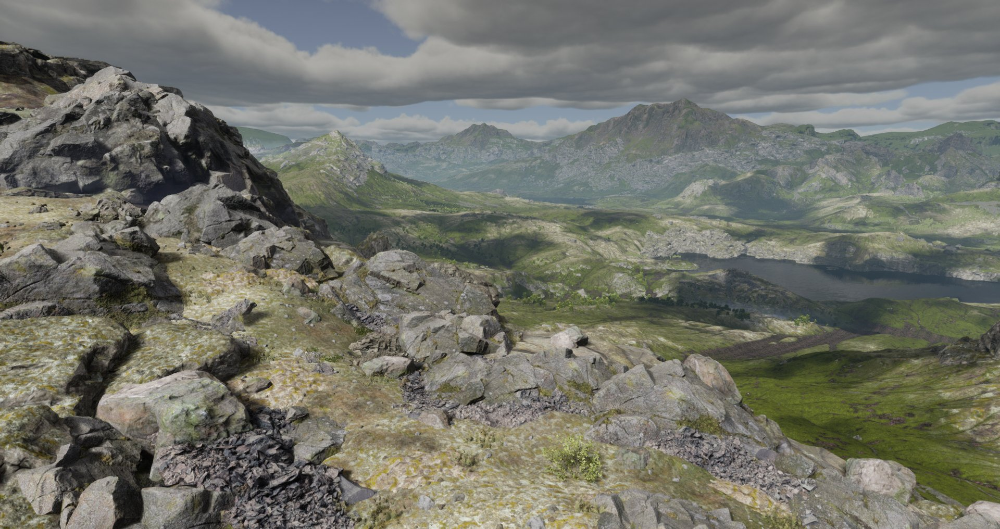
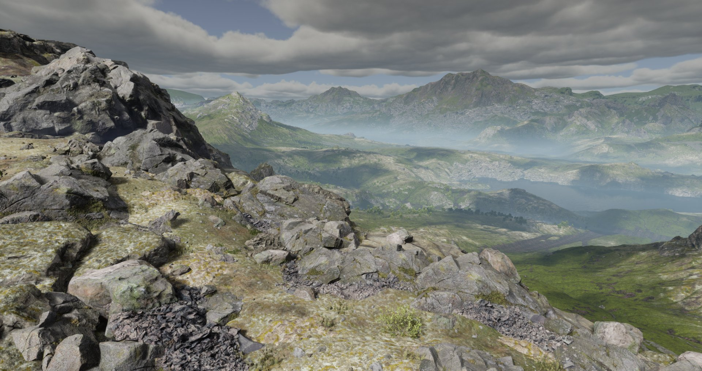

# 调整环境光照功能

> 路径：虚幻引擎5.7文档 / 入门指南 / 虚幻引擎新用户指南 / 解谜冒险游戏美术创作指南 / 调整环境光照功能

> 原始页面：https://dev.epicgames.com/documentation/unreal-engine/07-adjust-environment-lighting-features

在本节中，你将更深入地了解环境光照。 在[“为场景打光”](../artist-02-light-a-scene/index.md)教程中，你已经学习了如何调整应用于整个关卡的光照。 现在，你将学习通过以下方式，在关卡的特定区域进一步强化氛围效果：

- 在低洼区域添加第二层雾，增强关卡的真实感和氛围。
- 调整体积云Actor的材质，以创建带有闪电效果的风暴云。

> [!NOTE]
> 完成本教程时，你可以选择跟随示例属性值进行操作，也可以尝试不同的值，以在关卡中实现所需的外观和感觉。

## 开始之前

请确保你已理解[解谜冒险游戏美术创作指南](../index.md)教程系列的前几节中涵盖的相关内容：

- 虚幻编辑器基础知识，包括变换Actor和使用视口。

你将在[示例项目文件](../artist-01-project-setup-and-content-import/index.md)中使用以下资产：

- ExponentialHeightFog actor
- VolumetricCloud actor

## 添加指数高度雾到低洼区域

在关卡中创建浓淡不同的雾区域，可以增强场景的层次感和真实感，让玩家沉浸于逼真的环境中。

要创建这种效果，你将使用指数高度雾Actor的第二雾数据（Second Fog Data）属性，为关卡添加一层额外的雾。 你可以使用这些属性自定义第二层雾的高度（在Z轴上）和密度。

指数高度雾层的组合可以在远距离处为整个关卡提供一致的雾密度，同时通过第二层雾单独增强低洼区域的雾浓度，例如下图示例中的山谷区域。 你可以在第一张图片中看到有一层雾，然后观察第二层覆盖山谷的浓雾如何改变场景。

指数高度雾：单层雾

指数高度雾：添加第二层雾

### 添加第二层雾

在示例关卡中，你将使用指数高度雾Actor，在Room 1中带有陷阱的低洼坑区域添加一层更浓的雾。 第二层雾也会应用于关卡中的任何其他低洼区域，例如起始房间的地刺坑。

> [!NOTE]
> 你可以通过多种方式创建这种效果，例如使用材质或局部雾体积，但对于这个示例关卡的规模来说，你只需要使用指数高度雾来实现。

要为关卡中的低洼区域添加第二层雾，请执行以下操作：

1. 在**大纲视图**中，选择**指数高度雾（Exponential Height Fog）**Actor。

   > [!TIP]
   > 要查找此Actor，可以使用**大纲视图**的搜索框。 或者，点击**大纲视图**右上角的**设置**（齿轮图标），选择**全部折叠**，然后展开**Level**文件夹。
2. 在**细节**面板中，展开**Exponential Height Fog Component > Second Fog Data**，并修改以下值：

   1. **雾密度（Fog Density）**: `0.3`
   2. **高度雾衰减（Fog Height Falloff）**：`1.8`
   3. **雾高度偏差（Fog Height Offset）**：`7500`

      > [!TIP]
      > **雾高度衰减（Fog Height Falloff）**控制雾气上升时消散的速度，而**雾高度偏移（Fog Height Offset）**决定了雾层在世界中的垂直位置。

在调整完第二层雾的属性后，坑洞区域的效果应该类似如下：

这是从更高视角下关卡调整前后的效果：

> 动图已省略：f2f74a81de7e9f0d7852989849ff755aa4dffc326a937abff72d451471d63752

### 为雾添加彩色光照

次级体积雾为Room 1的坑区域增加了一些氛围效果，但视觉上显得较为平淡。 你可以通过添加与雾气相互作用的额外光照，为这个区域营造出更具戏剧性和不祥的氛围。

在本节中，你将添加一个不投射阴影的光源，以增强坑洞内的辉光效果，并使雾气在较阴暗的环境中显得更加突出。

要给雾气打光和上色，请执行以下操作：

1. 在主工具栏中打开**创建（Create）**菜单，然后选择**Lights > Point Light**。
2. 拖动光源并将其放置在房间中央的柱子内部或柱子稍下方的位置。

   > [!NOTE]
   > 光源放置的高度会影响玩家进入房间时的可见度。 找到最适合你关卡外观和感觉的放置位置。
3. 选中**点光源**后，在**细节**面板中修改以下属性：

   |  |  |  |
   | --- | --- | --- |
   | **属性** | **值** | **说明** |
   | 强度 | 10 |  |
   | 光源颜色 | HEX RGB = FF6E36FF（浅橙色） | 如果你使用不同的颜色，可能需要根据颜色的波长调整光照强度（蓝色比红色和绿色需要更高的光强度）。 |
   | 衰减半径 | 1300 | 此值可使光照亮整个Room 1。 |
   | 投射阴影 | 关闭 | 该点光源应充当“填充”光，仅照亮雾气而不投射阴影。 |
   | Advanced > Use Inverse Squared Falloff | 关闭 | 当你要用光照均匀地填充某个区域时，请禁用此属性。 关闭此选项可移除光源中心附近的明亮光斑。 |
   | Advanced > Light Falloff Exponent | 3.0 | 降低默认值会让光源在**衰减半径（Attenuation Radius）**范围内照亮更大的区域，但可能使光线看起来不那么真实（在现实生活中，光源只能照亮一定距离）。 |
4. 可选：调整**体积散射强度（Volumetric Scattering Intensity）**，以增加或减少光线对体积雾的影响程度。 （默认值为1.0。）

   > 动图已省略：6a0801d7b98a1c1ab227a4d15ef361d629c9ccb2ba61d120be6932ee16a1b03c

### 修正聚光源的体积强度

在[“给场景打光”](../artist-02-light-a-scene/index.md)教程中，你在起始房间的关键位置和每个门上方放置了聚光源，并增加了这些灯的体积散射强度。 之前提高它们的体积强度可以使光束更加明亮且更清晰，但不会增加整个关卡的雾密度。

如果回到起始房间，你会看到聚光源现在为体积雾提供了过多的光照，导致光束变得过于明亮。

要修正起始房间中的聚光源并恢复其柔和的外观，请执行以下操作：

1. 使用**视口**或**大纲视图**，选择四个**聚光灯**Actor。
2. 在**细节**面板中，将**体积强度（Volumetric Intensity）**从`50`改为`4`（或根据需要使用其他值）。

使用上述建议值，光照效果看起来应该类似于这样：

> [!TIP]
> 若要仅为关卡的特定部分添加雾气，请尝试使用[局部雾体积（Local Fog Volumes）](../../../../building-virtual-worlds/lighting-the-environment/environmental-light-with-fog-clouds-sky-and-atmosphere/local-fog-volumes/index.md)。

## 使用体积云组件创建风暴云

示例关卡是基于**基础**关卡模板创建的，该模板包含一系列光照Actor，其中包括一个体积云Actor。 该Actor由其所分配的体积云材质实例进行控制。 你可以使用此材质创建不同的云层形态和效果，包括云层后出现闪电的风暴云。

在本节中，你将创建现有体积云材质实例的副本，并修改该副本以创建风暴云，使其与之前通过环境光照和指数高度雾打造的黑暗氛围关卡风格相匹配。

### 复制体积云材质实例

由于体积云材质位于引擎内容中，因此在使用之前，应先在自己的项目中复制一份。 这样，原始资产仍会作为备份，保留在**Engine > Content**文件夹中。

> [!WARNING]
> 在处理**Engine > Content**中的资产前，务必先制作副本。 此文件夹中的资产在你的所有虚幻引擎项目中是共享的，因此对此文件夹内的资产进行任何更改都会对你的其他项目和关卡产生影响。

要创建并使用体积云材质实例的副本，请执行以下操作：

1. 在**大纲视图**中，选择**体积云**Actor。
2. 在**细节**面板的**云材质（Cloud Material）**类别中，点击**材质（Material）**旁边的**浏览至资产（Browse to Asset）**按钮。
3. 在**内容浏览器**中，将`m_SimpleVolumetricCloud_Inst`拖动到**Content > AdventureGame > Artist > Materials**文件夹中。
4. 选择**复制至此处（Copy Here）**以创建原始文件的副本。
5. 前往**AdventureGame > Artist > Materials**文件夹，并将材质副本重命名为`MI_MyVolumetricCloud`。
6. 在**细节**面板中，使用**材质**资产槽将`MI_MyVolumetricCloud`分配给你关卡中的体积云Actor。

### 自定义体积云

现在，你已经将自己的体积云材质实例应用到关卡中，可以通过材质实例中的参数来调整风暴云效果。

要使用体积云材质创建风暴云，请执行以下操作：

1. 在**内容浏览器**中，打开`MI_MyVolumetricCloud`。 该材质实例的参数分为以下几个组：**云布局（Cloud Layout）**、**形状（Shape）**、**风暴（Storm）**和**多散射（Multiscatter）**。

   > [!TIP]
   > 在独立窗口中打开材质实例（将其从编辑器中分离出来），这样在修改参数值时，你可以同时在视口中观察关卡效果的变化。
2. 展开**02 - 风暴**类别，启用**StormClouds**，并将其值设置为`0.3`到`0.5`之间的数，以此作为起始点。 你可以增大或减小此值，以此调整天空中的云层覆盖量。

   > [!TIP]
   > 在视口中，将摄像机移动到玩家站立的位置，以便从玩家的视角测试云层的外观效果。
3. 在**02-风暴**分类下，启用**Storm_LightningMasks**并展开其参数。
4. 在**Storm_LightningMasks**下，将**LightingMaskBias**调整为到`1`到`0`之间的值（例如，从`0.5`开始尝试）。 随着该值越接近0，你会看到云层背后的闪电变得更加明显。

   > [!TIP]
   > 如果在视口中难以看到闪电效果，请确保**实时视口（Realtime Viewport）**已启用，并将摄像机稍微指向地平线上方，因为该效果往往出现在天空较低的位置。

这些参数为创建云层后方带闪电效果的风暴云提供了一个良好的起点。 你可以将材质参数设置为本教程建议的值，也可以尝试采用不同值来创建你想要的视觉效果。

如果你想继续调整风暴云，可以尝试修改以下设置：

|  |  |  |
| --- | --- | --- |
| **类别** | **参数** | **说明** |
| 02 - Storm > Storm_LightningAnim | 全部 | 这些参数用于控制闪电闪烁动画的变化效果。 更改这些参数时要保守一些，并记住默认值，以便在需要时恢复。 |
| 02 - Storm > Storm_LightningClouds | FillScatterIntensity | 增大或减小该值可以调整云层中闪电闪烁的亮度强度。 |
| 02 - Storm > Storm_LightningMasks | LightningMaskStrength | 较低的数值会减弱闪电效果，使其在云层中不那么明显。 将此设置与CloudTextureWeight结合使用，可以在云层中产生柔和、翻滚的闪电效果。 |
| 02 - Storm > Storm_LightningMasks | Cloud TextureWeight | 较低的值会减少光照对云层的照亮程度，使闪电效果更柔和。 |

以下是修改体积云材质参数后可以达到的效果示例：

想查看更多使用体积云材质创建不同云层形态的示例和信息，请参阅[体积云材质](../../../../building-virtual-worlds/lighting-the-environment/volumetric-cloud-material/index.md)。

## 使用光源混合器调整灯光属性

虚幻引擎提供了两个编辑器面板，你可以在此集中调整场景光照或大气光照属性。

在**光源混合器**面板中，你可以管理关卡中的局部光源。 这个面板就像一个**大纲视图**，但只显示包含光源的Actor。

在虚幻编辑器主菜单中选择**Window > Light Mixer**，打开**光源混合器**。

在示例关卡的**光源混合器**中，你可以看到它包含独立的光源Actor，如聚光源，以及跳跃板和火焰陷阱Actor（因为它们的蓝图包含光源）。

在**环境光照混合器**窗口中，你可以创建和编辑关卡环境光照组件的属性。

通过主菜单选择**Window > Env，打开**环境光照混合器**。 光源混合器**。

要了解更多关于这些编辑器窗口的使用方法，请参阅[光源混合器](../../../../building-virtual-worlds/lighting-the-environment/environmental-light-with-fog-clouds-sky-and-atmosphere/using-the-light-mixer/index.md)和[环境光源混合器](../../../../building-virtual-worlds/lighting-the-environment/environmental-light-with-fog-clouds-sky-and-atmosphere/environment-light-mixer/index.md)。

## 下一步

在下一节中，你将开始为游戏添加音效。 你将学习如何创建Sound Cue，并为示例关卡中的火焰陷阱添加循环播放的音效。

- [为火焰陷阱添加音效](../artist-09-adding-sounds-to-fire-traps-artist-track/index.md) - 学习如何在蓝图中添加音效。
