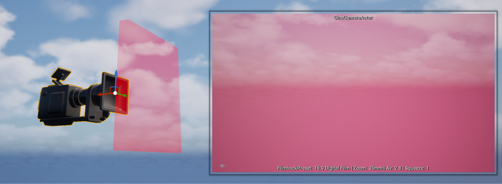
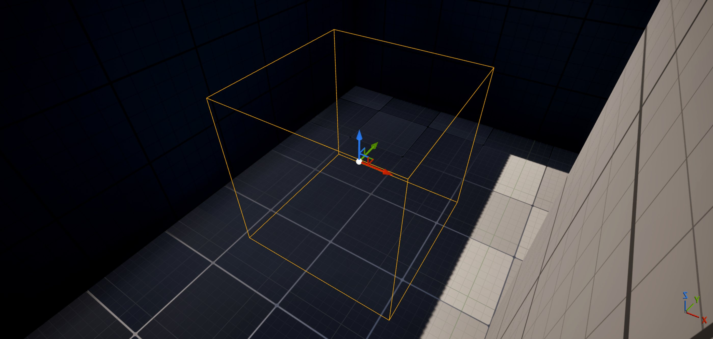
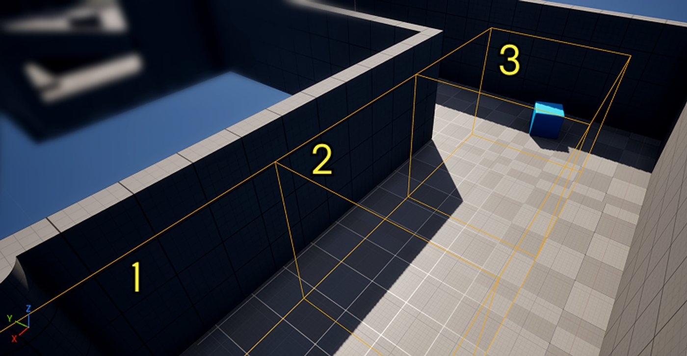
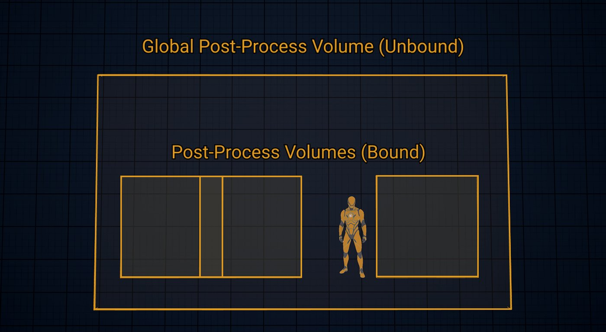
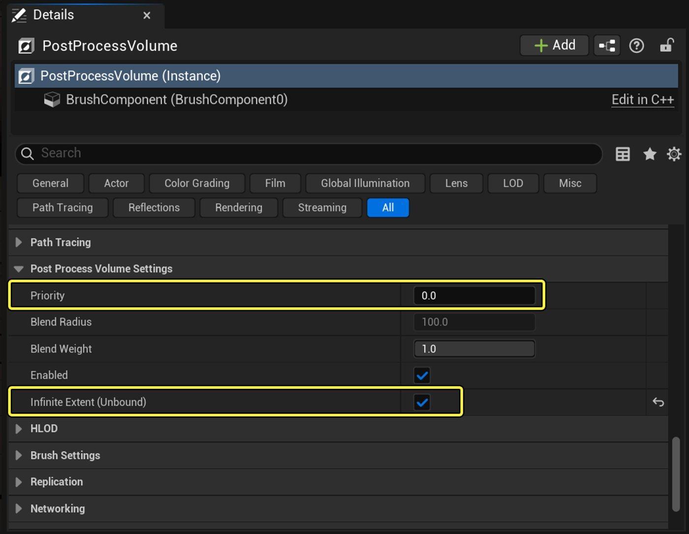
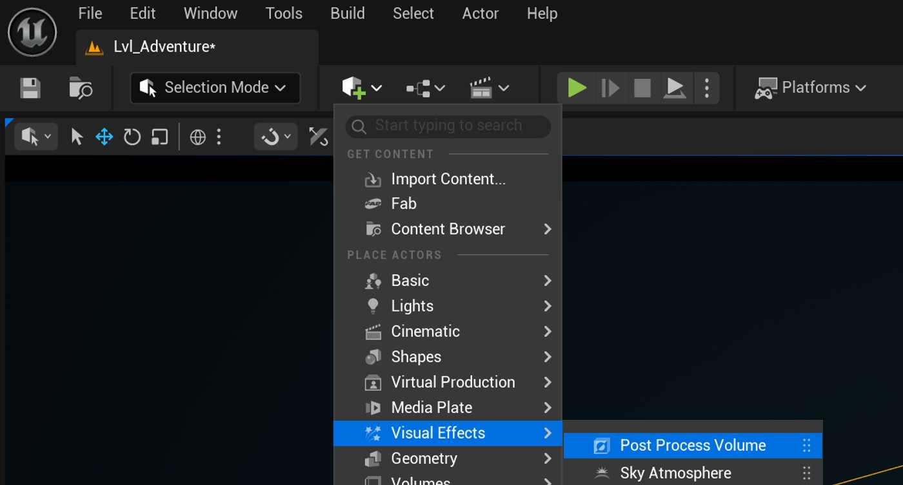
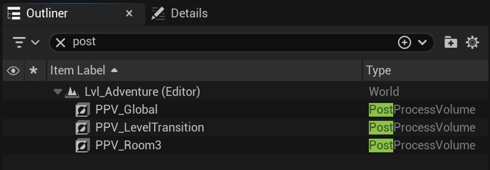
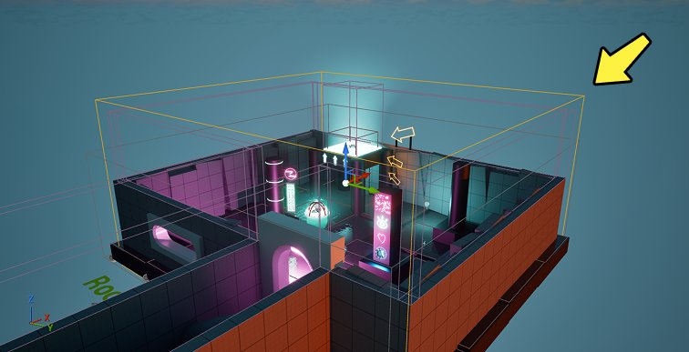

# 添加后期处理体积

> 路径：虚幻引擎5.7文档 / 入门指南 / 虚幻引擎新用户指南 / 解谜冒险游戏美术创作指南 / 添加后期处理体积

> 原始页面：https://dev.epicgames.com/documentation/unreal-engine/add-post-process-volumes

在本教程中，你将使用[上一个教程](../artist-03-create-materials-and-material-instances/index.md)中的材质和资产创建一个夜景场景，并应用一系列后期处理效果，包括**曝光**、**泛光**、**镜头光晕**和**颜色分****级**。 你还将学习如何使用**后期处理体积**以及[Lumen全局光照与反射](../../../../building-virtual-worlds/lighting-the-environment/global-illumination/lumen-global-illumination-and-reflections/index.md)来提升场景中的光照与反射质量。

**后期处理效果**能够以无损方法改变关卡的视觉效果和氛围。 你可以将这些效果想象成给摄像机添加滤镜，或在镜头前放置一块彩色滤片。

一个透过粉色滤色片观察的摄像机。

后期处理效果可以实时应用，无需修改关卡中的资产。 这些属于无损效果，因此可以在不影响材质或复杂光照设置的情况下进行视觉调整。

下方图像中的两个关卡之间的唯一区别是**颜色分级**——这是后期处理的一个类别。

|  |  |
| --- | --- |
| [Room-with-amber-light](https://dev.epicgames.com/community/api/documentation/image/c6a50803-97f1-4c3f-a667-12fb36a19276?resizing_type=fit) | [Room-with-cool-tones](https://dev.epicgames.com/community/api/documentation/image/927686b6-8002-497a-adae-76add04c2628?resizing_type=fit) |

游戏开发者使用不同类型的后期处理效果来引导玩家注意力、传达游戏机制信息，并增强视觉叙事。 例如：

- [颜色分级](../../../../designing-visuals-rendering-and-graphics/post-process-effects/index.md)可以模拟不同的时间段，改变场景氛围，或直观地传达诸如闪回等叙事手法。
- [反射](../../../../designing-visuals-rendering-and-graphics/post-process-effects/index.md)可以增强真实感并提升游戏沉浸感。
- [泛光](../../../../designing-visuals-rendering-and-graphics/post-process-effects/index.md)能够与[曝光](../../../../designing-visuals-rendering-and-graphics/post-process-effects/index.md)和[镜头光晕](../../../../designing-visuals-rendering-and-graphics/post-process-effects/index.md)结合使用，以强调光辉、反射性，或引导玩家注意某个资产。

多个后期处理效果可以组合使用，以建立统一的游戏视觉风格，或用于特定的游戏情境。 在下面的演示中，我们使用了多个效果，直观地展示玩家处于水下的状态。

后期处理效果也可用于控制光照功能的优化。 如果你玩过3A游戏，可能会注意到可以调整资源密集型效果的选项，例如**反射质量**。 在本教程的后续部分，你将使用后期处理体积来平衡虚幻引擎中的反射质量的保真度与性能。

|  |  |
| --- | --- |
|  |  |

接下来，我们来看看如何在游戏关卡中应用后期处理效果。

## 后期处理体积的结构

你可以通过在关卡中放置**后期处理体积**来应用后期处理效果。 体积定义了效果应用的区域。 这些体积在运行时对玩家是不可见的，并且可以设置为**有边界（Bound）**或**无边界（Unbound）**。

一个后期处理体积及其可见边界。

让我们来看一个示例，展示有边界体积和无边界体积之间的区别。 在下图中，我们创建了三个影响**饱和度（Saturation）**的后期处理体积。

（1）无边界，100%饱和度（2）有边界，25%饱和度（3）有边界，0%饱和度

请注意上方视频中的两个现象。 当玩家沿着走廊前进时：

- 即使玩家**不在**体积内部，**无边界**体积的饱和度也会保持不变。 这是因为无边界体积**全局**应用效果，作用于整个关卡。 体积的缩放和位置并不重要。
- **有边界**体积的饱和度效果仅在玩家位于体积**内部**时可见。 这是因为有边界体积会在**局部**范围内应用效果——仅作用于其边界范围内的区域。

> [!NOTE]
> 稍后，你将学习如何通过混合体积，以便在玩家接近其边界时触发效果。

体积可以像图形设计软件中的图层一样分层堆叠。 无边界（或称为**全局体积**）会叠加在关卡中较小的有边界体积之上。 同样地，你也可以为相互重叠的有边界体积设置分层优先级。

全局体积有助于整个游戏保持一致的视觉风格，作为后续叠加效果的基础，并使工作流程井井有条。

例如，逐层叠加视觉效果可以避免难以定位和调试等意外结果。 对于需要为多个关卡处理数百种特效的团队来说，保持条理清晰可以节省宝贵的开发和调试时间。

接下来，你将在关卡中设置三个后期处理体积，并为它们设置优先级。

## 设置全局与局部体积

让我们回到你在[为场景打光](../artist-02-light-a-scene/index.md)教程中创建的后期处理体积，并确认它是否在全局范围内应用效果：

1. 在**大纲视图**中，搜索**PostProcessVolume**并选中它。
2. 将此体积重命名为`PPV_Global`。
3. 在**细节**面板中，展开**后期体积设置**。
4. 确认**无限范围（无边界）**已勾选，且**Priority**设置为`0`。

   

接下来，你将创建两个新的体积：一个包围Room 3，另一个包围Room 3内的关卡过渡点。

你将调整每个有边界体积的**优先级**，使其在玩家进入时优先生效，覆盖全局体积。 设置优先级时，较高的值优先于较低的值。

要创建新体积，请执行以下操作：

1. 在编辑器主工具栏中，点击**创建 > 视觉效果 > 后期处理体积**。 你也可以通过搜索来找到它。 添加两个体积。

   
2. 将第一个体积命名为`PPV_Room3`，第二个命名为`PPV_LevelTransition`。

   
3. 在**大纲视图**，选择`PPV_Room3`并将其**缩放**设置为`8.5, 10, 5`。
4. 将其**位置**设置为`1600, -1050, 370`。 它应该大致包围Room 3。

   
5. 在**后期处理体积设置**下，将**优先级**设置为`100`。

   > 图片已省略：Priority-set-to-100

   > [!TIP]
   > 选择数值时，请确保它们之间有较大的差距。 这样，你可以在无需更新现有体积优先级的情况下插入或移除体积。 例如，在每个数值之间按10或100进行递增调整。
6. 将**混合半径**设置为`0`，并确认**无限范围**未被勾选。

   > 图片已省略：Blend-radius-and-infinite-extent
7. 选择`PPV_LevelTransition`并将其**Scale**设置为`1.5, 1.5, 2.5`。
8. 将其**位置**设置为`2170, -1450, 600`。 该体积应大致包围关卡过渡点。

   > 图片已省略：Arrow-to-the-transition-platform
9. 将其**优先级**设置为`200`，并确认**无限范围**未被勾选。

   > 图片已省略：Priority-at-200

本教程中的体积现在就设置好了。

## 尝试使用后期处理预设

在本节中，你将尝试以下后期处理类别中的效果：

- **镜头**

  - 曝光
  - 泛光
  - 镜头光晕
- **颜色分级**

  - 偏移
  - 对比度

- **全局光照与反射**

  - Lumen场景光照质量
  - Lumen场景细节
  - 反射质量
  - 屏幕追踪
  - 要追踪的最大粗糙度

### 曝光

**[曝光](../../../../designing-visuals-rendering-and-graphics/post-process-effects/index.md)**用于控制关卡亮度的上限和下限。 请记住，后期处理体积不会改变关卡中其他Actor的属性。 在下面的演示中，**光源**的亮度并没有发生变化。 真正发生变化的是允许进入摄像机镜头的**最大可见光量**。

在现实世界中，这种效果类似于摄像机的光圈控制其捕捉的光量。 或者，就像你的瞳孔如何放大和收缩以适应不同的光照条件。 正因如此，虚幻引擎中的曝光也被称为**眼部适应（Eye Adaptation）**。

你可以通过曝光设置，模拟现实世界的光学效果，为游戏增添真实感。 例如，当玩家从暗处移动到亮处时，延长全局曝光调整所需的时间，可以模拟人眼适应更强光线所需的时间。

曝光被有意延迟，以便显示下方的地形。

在本节中，你将调整`PPV_Global`和`PPV_Room3`的曝光设置，以在玩家走入Room 3时创建夜晚过渡效果。

要设置曝光，请执行以下操作：

1. 在**大纲视图**面板中，选择`PPV_Global`。
2. 在**细节**面板中，展开**曝光**，勾选**MIN EV100**，并将其设置为`-10`。
3. 勾选**MAX EV100**，并将其设置为`20`。
4. 在**大纲视图**中选择`PPV_Room3`。
5. 在**细节**面板中，展开**曝光**，勾选**MIN EV100**，并将其设置为`-1.0`。

在视口中右键单击并选择**从此处运行（Play From Here）**来测试你的关卡。 当你移动到Room 3时，曝光应发生变化，但目前的变化过于突兀。

为了延长过渡持续时间，你将通过使用**混合半径**将全局体积与有边界体积进行混合：

1. 在**大纲视图**中选择`PPV_Room3`。
2. 在**后期处理体积设置**中，将**混合半径**设置为`1500`。

测试你的关卡。 现在，当你向Room 3移动时，曝光应逐渐发生变化。

> [!NOTE]
> 即使使用相同的曝光数值，你的关卡效果也可能与我们的不同。 在[上一个教程](../artist-04-expanded-material-instances/index.md#create-an-emissive-material)中，我们通过调整**定向光源**的设置，使场景看起来更像黄昏。

接下来，你将使用泛光调整霓虹灯牌的发光效果。

### 泛光

[泛光（Bloom）](../../../../designing-visuals-rendering-and-graphics/post-process-effects/index.md)是一种光照瑕疵效果，表现为光线似乎溢出光源或反射的边界。

> 图片已省略：泛光已禁用。

> 图片已省略：启用泛光。

泛光已禁用。

启用泛光。

在电影中，这种不完美源于摄影机传感器和镜头捕捉光线的方法，但在游戏中，我们也可以为了艺术目的而模仿这种效果。 例如，泛光和曝光可以用于在视觉上表达玩家进入梦境、闪回，或在爆炸后处于眩晕状态。

在虚幻引擎中，你在[上一个教程](../artist-04-expanded-material-instances/index.md#create-an-emissive-material)中也已经见过泛光效果：当你将自发光材质的**亮度**参数提高到1以上时，就会出现该效果。

> 图片已省略：Emissive-mask-in-blueprints

与其逐一调整每个资产的属性来实现整体效果，不如使用后期处理体积来控制Room 3的整体泛光效果。

1. 在**大纲视图**中选择`PPV_Room3`。
2. 在**细节**面板中，展开**镜头**类别。
3. 展开**Bloom**类别，然后勾选**强度（Intensity）**。 将其设置为`0.8`，或使用你自己的值。
4. 勾选**阈值**，并将其设置为`1`，或使用你自己的值。

**阈值**设置了会让泛光开始对关卡产生影响的最小值。 你可以将其理解为一种钳制效果，就像上一个教程所示。 **强度**用于控制泛光生效后的强弱程度。

在阈值为1的情况下调整强度。

> [!TIP]
> 将阈值设置为-1可使关卡中的所有颜色都对泛光产生影响。

接下来，你将为霓虹灯牌添加镜头光晕。

### 镜头光晕

镜头光晕是一种光照伪影，当强光在镜头缺陷或摄像机内部元件上反射时就会产生。

该效果可用于在游戏中为艺术目的进行的模拟。 例如，镜头光晕可以引导玩家注意某个反光资产、增强真实感，或在玩家直视太阳时强调日光的强度。

> 图片已省略：Image-looking-through-columns-at-a-镜头-flare

要在关卡中创建镜头光晕，请执行以下操作：

1. 在**大纲视图**中选择`PPV_Room3`。
2. 在**细节**面板中，展开**镜头 > 镜头光晕**。
3. 勾选**强度**，并将其设置为`0.5`。
4. 勾选**BokehSize**，并将其设置为`5`。

   > [!TIP]
   > 较低的数值会产生更清晰、色散更少的散景效果；较高的数值则会产生更多的色散。
5. 勾选**BokehShape**，并搜索`DefaultBokeh`。

   > 图片已省略：Bokeh-options-in-the-menu

   > [!NOTE]
   > 在电影中，**散景**光斑的几何形状来自摄影机光圈的形状。 由于这种效果在电影中非常普遍，因此游戏也对其进行了模拟，尽管游戏中并不存在物理光圈。

在关卡中的光源或自发光材质前来回移动，以此测试你的工作成果。

接下来，你将使用颜色分级向玩家传达游戏机制。

### 颜色分级

就像在图像编辑软件中一样，你可以使用颜色分级来调整关卡的**饱和度**、**对比度**、**伽马值**、**增益**、**偏移**、**色调**等。

> 图片已省略：颜色分级已禁用。

> 图片已省略：颜色分级已启用。

颜色分级已禁用。

颜色分级已启用。

你可以借助这些工具，改变关卡所呈现的时间感、氛围或类型风格。 例如，棕褐色调是一种暗示古旧感的颜色分级风格。

> 图片已省略：Sepia-tone-color-grading-in-real-time.

棕褐色的实时颜色分级效果。

在你的关卡中，你将使用颜色分级来向玩家传达他们何时进入了关卡过渡点。 关卡过渡点是你在[设计解谜冒险游戏](../../design-a-puzzle-adventure-game/index.md)中创建的一种游戏机制，用于将玩家传送到新关卡。

> 图片已省略：Image-of-player-character-on-a-glowing-platform

目前，当你站在关卡过渡点上时，你脚下的矩形光源强度不足，无法与房间中的定向光源和点光源相抗衡。 从玩家的角度来看，这可以得更清晰地传达从游戏玩法到关卡过渡的变化。

> 图片已省略：Glowing-platform-with-glowing-cube

> [!TIP]
> 如果呈现手法清晰且一致，玩家就能逐渐学会识别并期待那些用于提示游戏机制的视觉线索。

要通过后期处理解决此问题，请执行以下操作：

1. 在**大纲视图**中选择`PPV_LevelTransition`。
2. 在**细节**面板中，展开**色彩分级 > 全局**，并勾选**偏移**。

   > [!TIP]
   > **偏移（Offset）**会影响关卡中最暗的区域，因此非常适合用于调整这个昏暗房间的整体色调。
3. 你可以选择自己的值，或者设置**R** = `-1.0`，**G** = `-0.02`，**B** = `0.15`，和**Y** = `0.07`。

   房间现在应该呈现蓝色：
4. 为了解决由点光源产生的白色高光热点，展开**色彩分级 > 高光**，并勾选**对比度**。

   > [!TIP]
   > **对比度**用于调整关卡中最暗区域与最亮区域之间的差异。 在这里，降低对比度会压低白色亮度，使其落入偏移校正的阈值范围内。
5. 将数值设置为：**R** = `0.5`，**G** = `0.8`，**B** = `0.7`，**Y** = `1`。

   热点应该不那么明显了：

要测试效果，在视口中右键单击并选择**从此处运行**。 当你跑上JumpPad并落在关卡过渡点时，屏幕应变为蓝色。

接下来，你将使用后期处理体积来控制反射质量的优化。

### 全局光照与反射

后期处理体积可以控制视觉效果的质量和影响范围。 当使用诸如动态光照等高消耗的渲染特性时，这可以帮助你平衡保真度和性能。

请记住，资源分配通常会影响开发过程中的决策。 在广阔的室外关卡中，你可以使用后期处理体积来远离玩家所在的区域，以便节省画质开销——因为玩家不会注意到那些区域。 这样可以将资源保留给更重要的区域，例如游戏过程中玩家周围的区域，或电影镜头中的摄像机周围。

体积的**全局光照**和**反射**设置包含不同的光照计算方法，适用于不同的开发需求：

| 方法 | 说明 |
| --- | --- |
| **无（None）** | 禁用所有全局光照或反射计算。 光源不会产生反弹光或反射，阴影将显示为纯黑色。 |
| **Lumen** | [Lumen全局光照（GI）](../../../../building-virtual-worlds/lighting-the-environment/global-illumination/lumen-global-illumination-and-reflections/index.md)是虚幻引擎的全动态全局光照系统，适用于所有光照类型。 |
| **屏幕空间** | [屏幕空间全局光照（Screen Space Global Illumination，SSGI）](../../../../building-virtual-worlds/lighting-the-environment/global-illumination/screen-space-global-illumination/index.md)是一种快速的动态光照系统，它只计算屏幕视野范围内的光照。 |

在下面的演示中，当选择**Lumen**方法时，请注意霓虹箭头的橙色光辉会动态地影响场景。 这是因为自发光材质（并非真正的光源）在使用Lumen时会被计算，而在使用其他方法时则不会。

除了控制画质之外，后期处理体积还可以控制光照和反射在场景中的影响范围。 Lvl_Adventure相对较小，因此渲染距离不是问题。 然而，对于更大的区域（例如在开放世界游戏中，远距离可能会消耗大量资源），诸如**Lumen场景视距**和**最大追踪渲染距离**之类的设置可用于平衡场景范围与性能。

#### 使用Lumen GI调整反射质量

在本节中，你将通过一系列练习解决问题，从而调整关卡的全局光照和反射设置。 在操作过程中，你将逐步了解每个设置，并改进你在上一个教程中创建的湿地板反射效果。

你将调整的设置包括：

| 设置 | 说明 |
| --- | --- |
| 全局光照 |  |
| **Lumen场景光照质量** | 计算场景光照保真度。 数值越高，画面质量越高，但会增加性能开销。 |
| **Lumen场景细节** | 控制场景中可以呈现的实例大小。 数值越高，细节越丰富，但性能成本也越高。 |
| 反射 |  |
| **质量** | 提高Lumen反射在表面上的保真度。较高的数值意味着更高的保真度，并可减少伪影，但会增加性能开销。 |
| **屏幕追踪** | 切换Lumen全局光照的屏幕空间追踪功能。 启用屏幕追踪可以提高反射保真度，但它只会影响屏幕上可见的部分。 |
| **要追踪的最大粗糙度** | 设置Lumen仍会追踪反射的最大粗糙度值。 |

要继续操作，请将这些值应用于`PPV_Room3`：

- **全局光照**

  - **方法：**None
  - **Lumen场景光照质量**：`0.25`
  - **Lumen场景细节：**`0.25`
- **反射**

  - **方法：**None
  - **质量：** `0.25`
  - **屏幕追踪**：未勾选
  - **要追踪的最大粗糙度：**`0.0`

要开始练习，请执行以下操作：

1. 在视口或**大纲视图**中，找到你在上一个教程中创建的一个自发光资产。 根据你的喜好将其摆放在地板上。
2. 在**大纲视图**中选择`PPV_Room3`。
3. 前往**细节**面板。 要使用Lumen GI，请展开**全局光照**，勾选**方法**，**然后选择****Lumen**。

   你的场景现在应如下所示：
4. 要使用Lumen反射，展开**反射**，勾选**方法**，然后选择**Lumen**。

   你的场景现在应如下所示：
5. 在粗糙度较低的材质上，反射更为明显。 由于`BP_Floor`在变湿时的粗糙度为0（无粗糙度），请将**Max Roughness to Trace**设置为`1.0`。

   你的场景现在应如下所示：
6. 湿地板丢失了部分自发光强度。 要解决这个问题，请勾选**屏幕追踪**。

   你的场景现在应如下所示：
7. 虽然反射光量有所提升，但反射本身仍不够清晰。 为了提高清晰度，将**质量**提高到`1.0`。

   你的场景现在应如下所示：
8. 反射清晰度有所提升，但在箭头后方仍然可以看到细微的伪影。

   > 动图已省略：9fcaf4453fb168470ad915f228c0ee9988a26ee9fd9c5a1be3387b8d2d7c350b

   要解决伪影问题，可以增加Lumen GI生成的采样数量。 在**Lumen全局光照**下，勾选**Lumen场景光照质量**，并将其值设置为`1.0`。
9. 勾选**Lumen场景细节**，并将其值设置为`1.0`。

   你的最终场景现在应如下所示：

通过这些设置，你已经使用Lumen全局光照和反射来控制Lvl_Adventure的视觉保真度与性能。 在你自己的关卡中探索这些设置，并思考应向哪些地方分配更多资源以提升画质，或在哪些地方节省资源以优化性能。

## 下一步

在下一个教程中，你将学习如何创建后期处理材质，并应用一个屏幕特效来指示伤害。

- [UI上的后期处理材质](../artist-06-post-process-materials-on-the-ui/index.md) - 学习如何使用材质来创建基于游戏玩法的屏幕后期处理效果。
