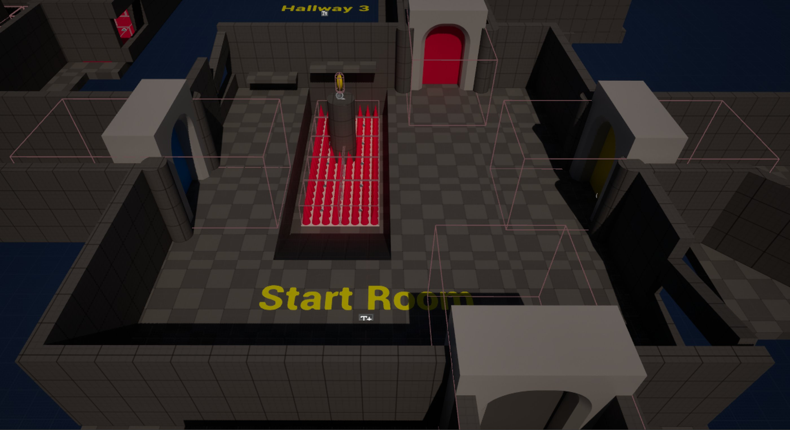
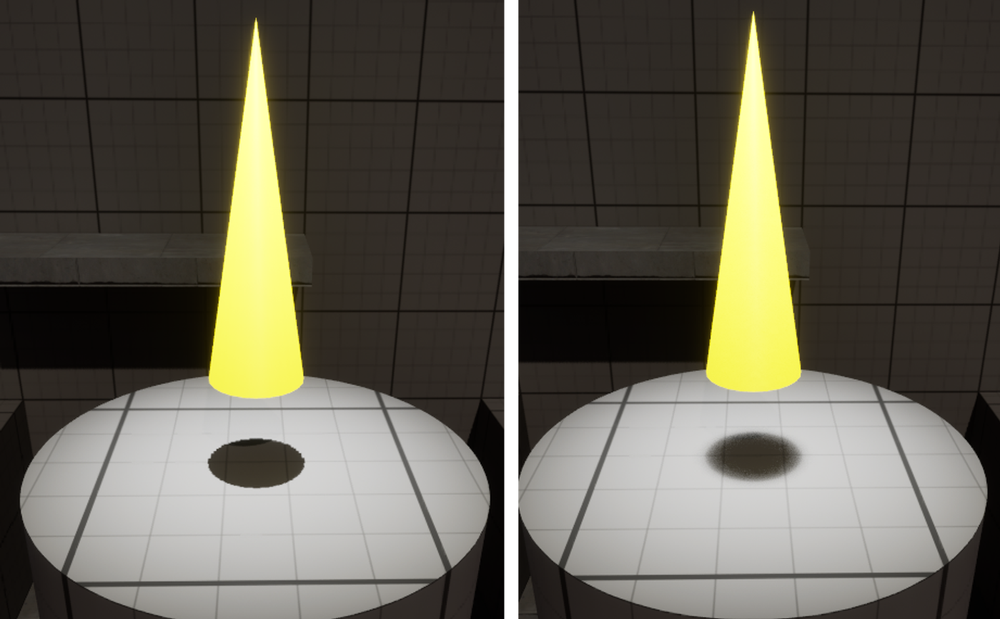
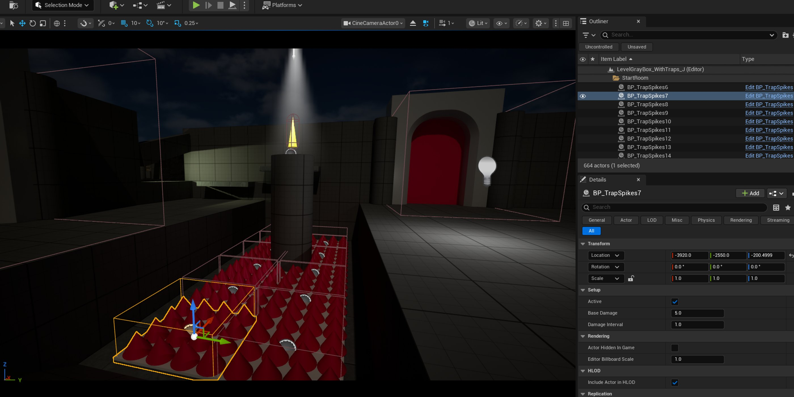
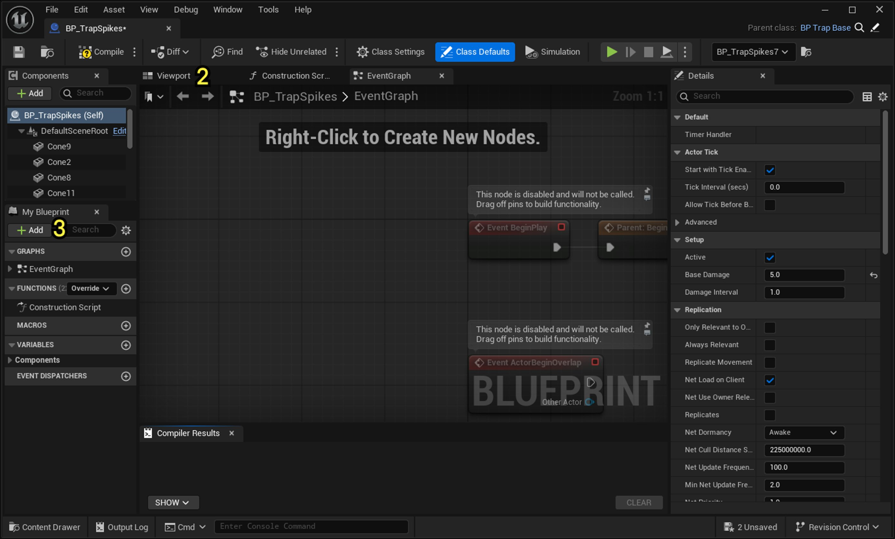
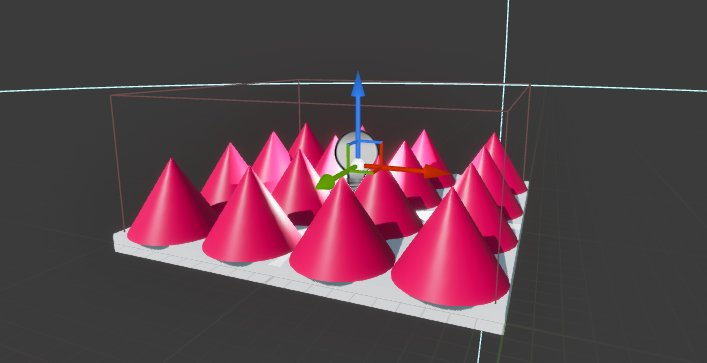
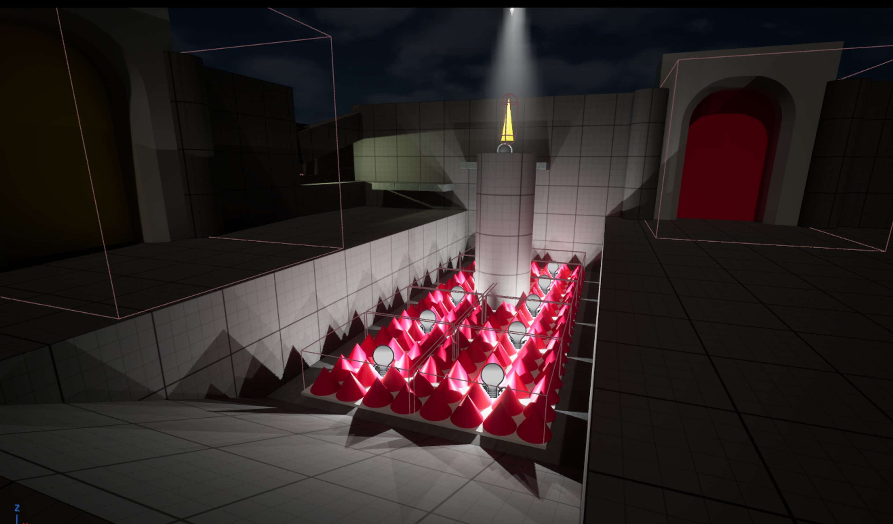
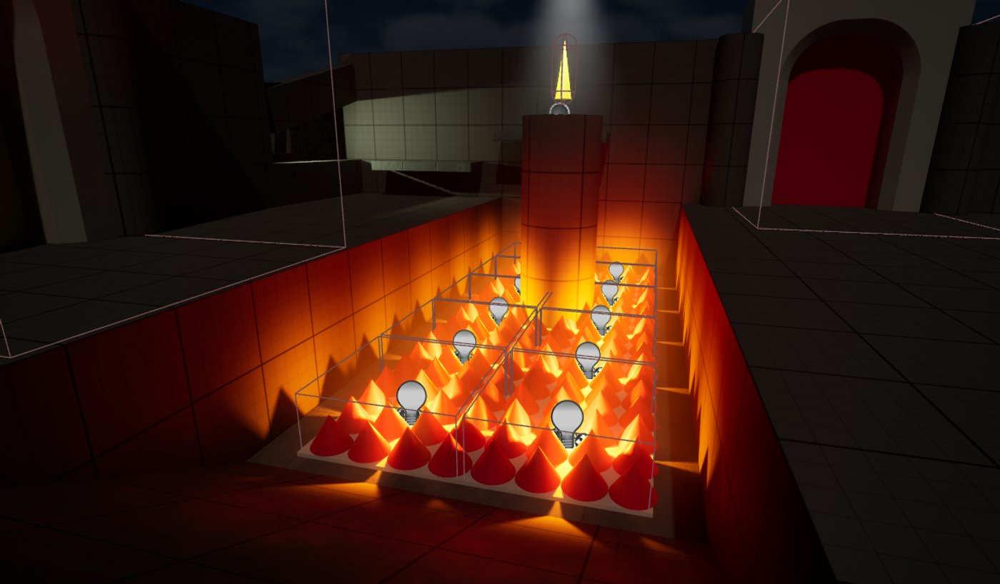
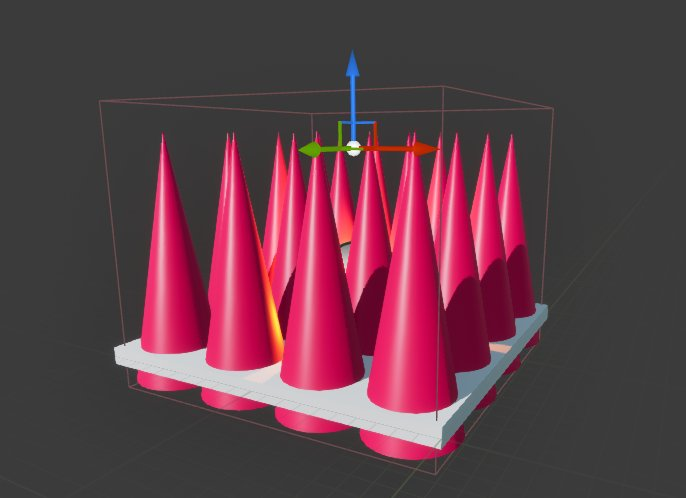

# 为场景打光

> 路径：虚幻引擎5.7文档 / 入门指南 / 虚幻引擎新用户指南 / 解谜冒险游戏美术创作指南 / 为场景打光

> 原始页面：https://dev.epicgames.com/documentation/unreal-engine/artist-02-light-a-scene

虚幻引擎的光照系统用于模拟光线在场景中与物体的交互方式。 这些交互对象包括：应用于表面的材质、几何体产生的阴影、反射效果、大气与云层、雾效等等。 所有这些元素共同作用，打造出既真实又风格化的视觉效果，以定义游戏氛围、可读性和画面质量。

在本指南中，你将学习以下内容：

- 可供选择的光源Actor类型。
- 如何在场景中放置和使用光源。
- 光源的通用属性。

## 开始之前

请确保你已掌握[《虚幻引擎新用户指南》](../../index.md)文档中涵盖的以下内容：

- 虚幻编辑器基础知识，包括变换Actor和使用视口。
- 添加和编辑蓝图组件。

你将在[示例项目文件](../artist-01-project-setup-and-content-import/index.md)中使用以下资产：

- `BP_TrapSpikes`蓝图

## 光源类型与行为

虚幻引擎包含五种可用于照亮场景和产生阴影的光源。 你可以借助从大型到小型的不同光源，打造接近真实世界的多种光照效果。

可放置用于照亮场景的光源Actor可以分为两类：

**环境光照**是覆盖整个场景的自然光源，用于建立整体氛围、时间感和关卡亮度。

- **定向光源**主要是室外光源，模拟从极远或近乎无限远的距离投射的光线。 这种光源通常用于太阳或月亮。
- **天空光照**可捕捉环境光照并将其应用于场景，以一种高效的方式让黑暗区域看起来更自然。 这种光源可捕捉环境背景并将其应用到关卡几何体上。

**局部光照**是具有明确位置的光源，通常代表场景中的真实物体，用于引导玩家视线或增强真实感。

- **点光源**是全向光源，从一个点向所有方向发射光线，类似于一个灯泡。
- **聚光源**是方向受限的光源，从单一点向锥形方向发射光线， 其功能类似于手电筒。
- **矩形光源**（也称为区域光源）从矩形表面沿一个方向发射光线。 它们还有一些属性，可以让你调整光源四周的虚拟遮光板，从而让投射到物体表面的光线变得更柔和或更锐利。 这些光源通常用于矩形窗户或天花板灯，但也可以为大面积区域提供柔和的反射光。

常见的光源Actor调整包括光强、颜色、光源大小和色温（暖光或冷光）。 此外，每种光照类型还具有其专属属性， 例如：聚光源可调节锥形角度，矩形光源可调节光源尺寸与角度。

> [!TIP]
> 有了**Lumen全局照明**，你还可以在条件合适的情况下，使用自发光材质作为光源。

## 用于游戏玩法的光照

照亮场景不仅仅是为了让玩家能看到东西——你还可以使用光源与玩家进行视觉沟通。 为某个区域或路径添加光照，可以通过创造对比度和可见度来引导玩家朝某个方向前进。 让某个可拾取物品发光，可以向玩家提示其重要性。 你甚至可以在游戏中用光照创造一种视觉语言，例如：用绿光照亮的物体代表回血道具，而用橙光照亮的门口则代表出口。

光照还能传达情绪和故事。 调整光线的强度、颜色、对雾的影响体积阴影（光束），可以在不改变任何场景几何体的情况下，将一个空间的氛围从平静转变为鼓舞人心，再转变为恐怖。

## 设置世界光照

首先，调整关卡中的环境光照，使之后添加的局部光照清晰可见。

> [!TIP]
> 为了在工作时隐藏关卡编辑器中的阻挡体积，请单击视口工具栏中的眼睛按钮（**显示标记**），转到**体积（Volumes）**，然后禁用**阻挡（Blocking）**。

要使关卡变暗以便添加局部光照，请执行以下操作：

1. 添加后期处理体积：

   1. 使用**创建（Create）**下拉菜单向场景添加一个**后期处理体积（Post Process Volume）**。
   2. 在其**细节（Details）**面板的**后期处理体积设置（Post Process Volume Settings）**类别中，启用**无限范围（Infinite Extent (Unbound）**。
   3. 在**镜头（Lens） > 曝光（Exposure）**类别中，将**Min EV100**和**Max EV100**均设置为`1.0`。
   4. 可选：将体积移开，以免在处理其他关卡对象时意外选中它。 此体积应用于整个关卡，所以放置在哪个位置都可以。
2. 调整定向光源：

   1. 在**大纲视图（Outliner）**中，搜索并选中**DirectionalLight**。

      > [!TIP]
      > 要查找此Actor，可以使用大纲视图的搜索框。 如果要查看关卡中所有的环境光照Actor，可点击大纲视图右上角的“设置”（齿轮图标），选择全部折叠（Collapse All），然后展开关卡（Level）文件夹。
   2. 将**强度（Intensity）**降低至`0.75`，以便更轻松地处理场景中的其他光照效果。 “强度”用于设置应发射的光量。
3. 启用体积雾：

   1. 在**大纲视图（Outliner）**中，搜索并选中**ExponentialHeightFog**。
   2. 在**细节（Details）**面板的**体积雾（Volumetric Fog）**类别下，启用**体积雾（Volumetric Fog）**。 这并不会改变场景的外观，但它设置了环境，以便你之后通过空气散射光线，创造光束或柔和的大气辉光。

> [!NOTE]
> 在所有其他光照和材质绘制完成后，后期处理体积会调整场景的渲染方式和在摄像机上的显示效果。 你可以将最小和最大曝光阈值设置为相同的值以稳定光照，防止引擎的自动曝光导致此范围内的场景忽明忽暗。
>
> 你将通过本教程系列的后续部分，了解更多关于体积雾、环境光照和后期处理效果的信息。

接下来，你将向起始房间添加三种类型的光源，探索如何使用它们实现不同的效果。 你可以跟随这三个使用不同光源和行为的示例执行操作，但这并不代表此场景只能使用这三种光源。 你可以根据需要在房间或其他地方放置多个光源。

> [!TIP]
> 你可以跟随本教程进行操作，也可以调整每个光源的设置，为项目实现理想的外观。

## 在钥匙上方添加聚光源

聚光源从一个点发射光线，并以锥形范围定向投射光线。 以下是更改聚光源属性的演示：

为了引导玩家注意到钥匙并强调其重要性，可以添加一个聚光源，使其向下照射起始房间中的钥匙。

> [!TIP]
> 要了解关于光源属性的更多信息，请将鼠标悬停在**细节（Details）**面板中的属性名称上。 此时将出现一个工具提示，显示有关该属性的信息。

要向关卡添加聚光源，请执行以下操作：

1. 在**关卡编辑器（Level Editor）**工具栏中，使用**创建（Create）>光源（Lights）**菜单向场景添加一个**聚光源（Spot Light）**。
2. 将它放置在第一把钥匙所在的柱子上方。 尽量把它放在柱子上方的中心位置，并向正上方抬高。

   > [!TIP]
   > 你可以使用**顶端正交（Top Orthographic）**视图来帮助定位对象，或者选择**BP_Key**蓝图并将其**位置（Location）**复制到**细节（Details）**面板中的**光源位置（Light's Location）**。

> 动图已省略：Placing-a-light-above-a-column

要配置光源的设置，请执行以下操作：

1. 选中聚光源后，使用**细节（Details）**面板更改以下设置：

   1. **强度（Intensity）**：100
   2. **衰减半径（Attenuation Radius）**：500

      这可以控制光线能够达到的距离。 将其调整到足够大的数值，使其能够到达柱子顶部或略超过钥匙所在位置，但又不能大到触及柱子下方的地板。 抬高或降低光源来调整光线照射到钥匙的方式。
   3. **外锥角（Outer Cone）**：20
   4. **源半径（Source Radius）**：50

      这设置了光源本身的尺寸。 它会改变从其投射的光线和阴影的软硬程度。 增加光源尺寸会导致光线在钥匙周围出现更多散射，增加钥匙阴影的柔和度。 对象到表面的距离以及阴影的位置也会对阴影的柔和程度产生影响。

      
   5. **体积散射强度（Volumetric Scattering Intensity）**：15-50

      将此值设置为你想要的数值。

      体积散射强度值分别为0、15、30、50的示例。

## 向尖刺陷阱蓝图添加点光源

点光源则向所有方向发射光线。 以下是更改点光源属性的演示：

使用点光源为你的尖刺陷阱添加火焰光芒效果。 将其添加到蓝图后，光源将自动应用于关卡中的每个尖刺陷阱Actor。

要向尖刺陷阱蓝图添加点光源，请执行以下操作：

1. 在起始房间中，选择该坑中的一个**BP_TrapSpikes**实例。 在**大纲视图（Outliner）**中，选择**编辑BP_TrapSpikes（Edit BP_TrapSpikes）**，以便在蓝图编辑器（Blueprint Editor）中打开`BP_TrapSpikes`蓝图。

   
2. 选择**视口（Viewport）**选项卡查看蓝图的组件。

   
3. 在**组件（Components）**面板中，单击**添加（Add）**，然后从列表中选择一个**点光源（Point Light）**。 这会将一个点光源添加到视口的中心点（或世界0位置）。
4. 选中点光源后，将其向上移动（Z轴）30个单位，使其靠近视口中尖刺网格体的顶部。

   

返回关卡编辑器（Level Editor）查看场景中的效果：

现在，编辑光源属性以改变场景氛围并创建独特的外观。

要调整尖刺陷阱的光芒，请执行以下操作：

1. 在`BP_SpikeTrap`中，选中**PointLight**组件后，在**细节（Details）**面板中更改以下属性：

   1. **强度（Intensity）**：40
   2. **衰减半径（Attenuation Radius）**：300
   3. **源半径（Source Radius）**：5
   4. **使用色温（Use Temperature）**：已启用
   5. **色温（Temperature）**：1700

      这可以根据开尔文色温标度改变光的颜色（暖色或冷色）。
   6. **体积散射强度（Volumetric Scattering Intensity）**：40

      此属性与你之前启用的体积雾（Volumetric Fog）相互作用。

      
   7. **强度单位（Intensity Units）**：Lumen - 光通量，标准化
2. 为了使尖刺坑看起来更危险，请选择所有**锥形（Cone）**网格体组件，单击缩放（Scale）小工具，然后在 Z（蓝色）轴上按比例放大尖刺。 更锋利的尖刺会产生更多上下文相关的阴影，可以传达该区域的危险或伤害信息。
3. 选择**InvisFloor**网格体组件，并将其向上移动以匹配尖刺的高度。 这个隐形平台可以防止玩家网格体卡在尖刺之间。

   > [!NOTE]
   > 要使地板在视口中可见，请在**细节（Details）**面板的**渲染（Rendering）**部分启用**可见（Visible）**。 完成编辑蓝图后，记得禁用它。
4. 选择**TrapTrigger**组件并调整其大小和位置，使其延伸到尖刺顶部之外。 这可以确保玩家落在陷阱上时触发尖刺的伤害效果。

   
5. **编译（Compile）**并**保存（Save）**此蓝图。

> [!NOTE]
> 运行游戏以测试新的尖刺陷阱。 请确保你已完成以下步骤：
>
> - 正确放置隐形地板，确保玩家不会卡在尖刺中。
> - 调整TrapTrigger碰撞盒体的大小，确保玩家站在陷阱上时仍会受到伤害。

## 在门框上方添加聚光源

接下来，照亮彩色的门框。 你将结合之前在聚光源和点光源中使用过的属性，并利用体积雾，在门上方创造一种有趣的光照效果。

要照亮门框，请执行以下操作：

1. 对于黄色门，添加一个**聚光源（Spot Light）**，将其移动到门框上方或正好在门楣下方，使其看起来像是固定在门框上的聚光灯。 对其进行旋转，使它指向门外几米远的地方。

   > 图片已省略：Add-a-spot-light-to-the-yellow-door
2. 选中聚光源后，按住**Alt**键并在X和Y轴（红色和绿色柄）上拖动光源以进行复制。 将副本移到蓝色门前，然后再复制一次，将副本移到红色门前。

   > 动图已省略：Duplicate-the-light-for-each-door

   > 图片已省略：Final-image-with-all-three-doors-lit
3. 在**细节（Details）**面板中，为光源设置以下属性：

   1. **源半径（Source Radius）**：5
   2. **体积散射强度（Volumetric Scattering Intensity）**：50

      此属性与你之前启用的体积雾（Volumetric Fog）相互作用。

      此时的光源应如下所示：

      > 图片已省略：Finished-light-on-yellow-door
   3. **强度（Intensity）**：100
4. 选择黄色门前的聚光源。 在**细节（Details）**面板中，单击**光源颜色（Light Color）**色条。 在**取色器（Color Picker）**窗口中，将颜色更改为黄色。 要使用与示例关卡相同的颜色，请在**Hex sRGB**属性中输入`FFFF89FF`。 单击**确定（OK）**接受颜色更改。

   > 图片已省略：Color-wheel-for-door-lights
5. 更改另外两个聚光源的**光源颜色（Light Color）**属性以匹配门的颜色。 要匹配示例关卡，你可以使用以下的**Hex sRGB**值：

   1. 红色门灯：**FF8989FF**
   2. 蓝色门灯：**8989FFFF**

现在你的场景看起来应该像这样，每个门框上方都有彩色灯光，指示应该用哪个钥匙开门。

> 图片已省略：Door-light-color-matches-the-door-color

## 为窗户添加矩形光源

矩形光源从一个矩形表面发射定向光线。 以下是更改矩形光源属性的演示：

为了创造良好的效果，并引导玩家意识到他们可以跳上平台以到达第一把钥匙的位置，你应该在附近的窗户添加一个矩形光源。

要让光线透过窗户照进来，请执行以下操作：

1. 在关卡编辑器（Level Editor）工具栏中，使用**创建（Create）>光源（Lights）**菜单向场景添加一个**矩形光源（Rect Light）**。

   光源的黄色矩形线框代表光源的尺寸及其**挡光板角度（Barn Door Angle）**和**挡光板长度（Barn Door Length）**，它们会控制矩形光源光束的成形和投射方式。
2. 将矩形光源放置在窗户外面。 旋转并放置该光源，使其光线穿过墙壁的开口，增加房间内的光影效果。
3. 在**细节（Details）**面板中，将**强度（Intensity）**改为`200`。
4. 将**源宽度（Source Width）**和**源高度（Source Height）**更改为大致匹配窗户的尺寸。 在示例关卡中，起始房间的矩形光源宽度为`400`，高度为`200`。
5. 调整光源的位置，直到你对它在房间里营造的光影角度和强度满意为止。

现在你应该可以看到类似这样的效果：

> 图片已省略：Finished-Rect-Light-streaming-into-room

对于矩形光源，你可以分配一个**源纹理（Source Texture）**对其进行着色，并为场景增添独特的外观。 光源离表面越近，分配的源纹理的漫射程度就越低。

> 动图已省略：Gif-showing-source-texture-at-different-distances

要为矩形光源添加源纹理，请执行以下操作：

1. 选择**矩形光源（Rect Light）**。 在**细节（Details）**面板的**光源（Light）**类别中，找到**源纹理（Source Texture）**资产分配槽。
2. 单击下拉菜单，搜索并选择**ColorGradingWheelGradient**纹理。

   > 图片已省略：Color-grading-wheel-gradient

   > [!NOTE]
   > 此纹理包含在引擎内容中，应自动显示在下拉列表中。

现在，多彩的灯光就会投射进房间：

> 图片已省略：Multi-colored-light-via-the-wheel-gradient

## 使用自发光材质作为光源

最后，创建一个使用**Lumen全局光照**系统发射光线的材质。 你可以为此材质选择自己喜欢的颜色。

> 图片已省略：Emissive-material

要创建自发光材质，请执行以下操作：

1. 在内容浏览器（Content Browser）中，导航至你的Content > AdventureGame > Artist文件夹。
2. 在Artist文件夹内，新建一个文件夹，命名为`Materials`。
3. 在**内容浏览器（Content Browser）**的**AdventureGame > Artist > Materials**文件夹内，右键单击文件夹中的空白区域或单击**添加（Add）**按钮，然后选择**材质（Material）**。

   > [!NOTE]
   > 本教程假设你使用的是教程示例关卡和[《设计解谜冒险》](../../design-a-puzzle-adventure-game/index.md)中使用的资产目录结构。
4. 将材质资产命名为`M_Emissive`，然后双击打开它。

   > [!NOTE]
   > 我们建议使用前缀为资产命名，以便快速识别资产。 例如，教程的示例项目使用`M_`作为材质名称的命名规范。
5. 在**材质图表（Material Graph）**中，在**M_Emissive**材质节点上，单击**自发光颜色（Emissive Color）**输入旁边的色条，并设置一种颜色。 要跟随示例关卡进行操作，请将 **Hex sRGB**更改为`00FF0000`。

   > 图片已省略：Emissive-color-gradient-wheel
6. 单击**确定（OK）**接受新颜色并关闭**取色器（Color Picker）**窗口。
7. 在材质（Material）中，单击**应用（Apply）**然后**保存（Save）**。

接下来，你将向场景添加一些几何体，并将此材质应用于这些几何体。

要在关卡中使用自发光材质，请执行以下操作：

1. 从**内容浏览器（Content Browser）**中，在**Content>LevelPrototyping>Meshes**中，向你正在处理的房间添加两个`SM_Cylinder`网格体。 调整它们的大小和位置，使其成为房间其余阴暗角落中的细柱。如果你使用的是示例关卡，请复制黄色和蓝色门旁边的两根柱子，并将它们移到房间的前角。

   > 图片已省略：Duplicating-the-emissive-columns
2. 打开**内容浏览器（Content Browser）**将`M_Emissive`拖放到两个柱子上，以将该材质应用于网格体形状。 此更改可能需要几秒钟才能完成加载。

> [!WARNING]
> 要使用材质作为光源，则必须为项目启用Lumen。 作为光源的自发光材质会产生更多重影效果，并且不适用于小而亮的光源。 因此，我们建议谨慎使用自发光材质，并牢记这些限制。

现在，你的房间看起来应该类似于这样：

> 图片已省略：Finished-start-room

## 下一步

在下一节中，你将深入学习如何使用材质，包括如何使用实例化来创建灵活的材质。这些材质可以在运行时动态更改颜色和亮度，为你修改场景提供更多助力。

- [创建材质和材质实例](../artist-03-create-materials-and-material-instances/index.md) - 使用材质和材质实例为关卡添加表面效果。
