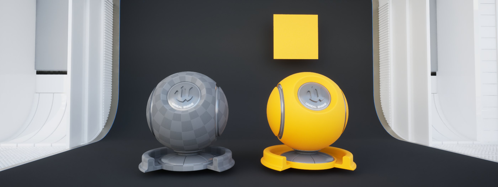
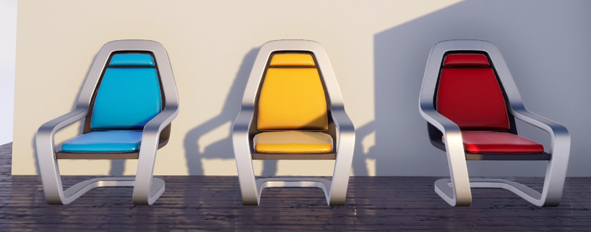
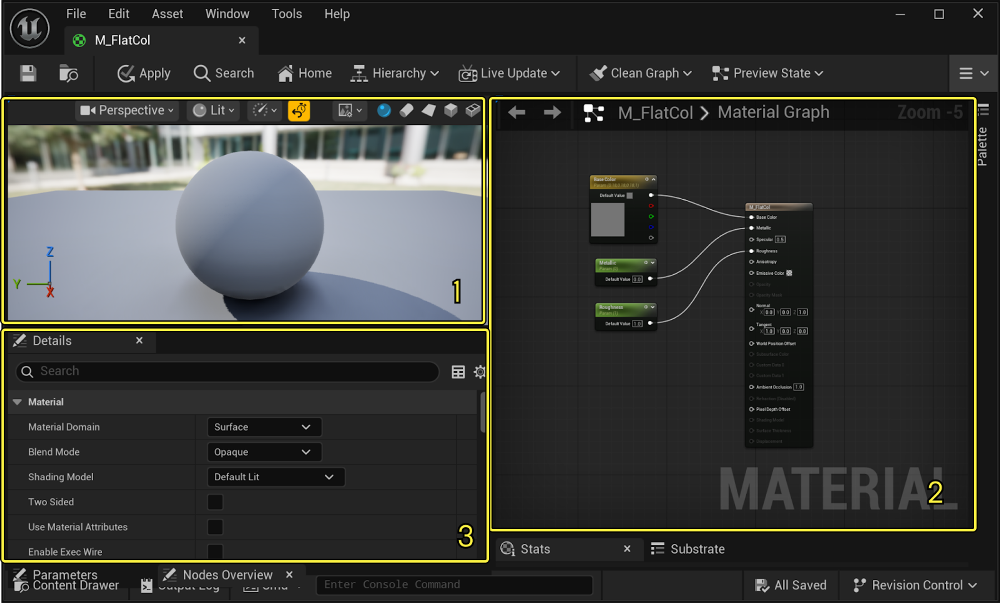
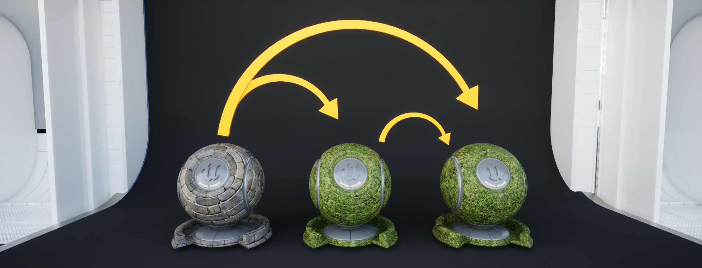
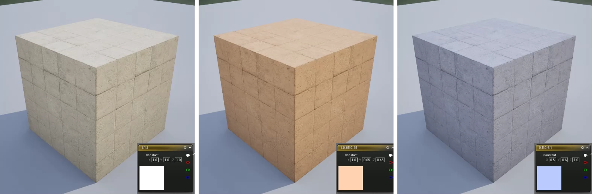
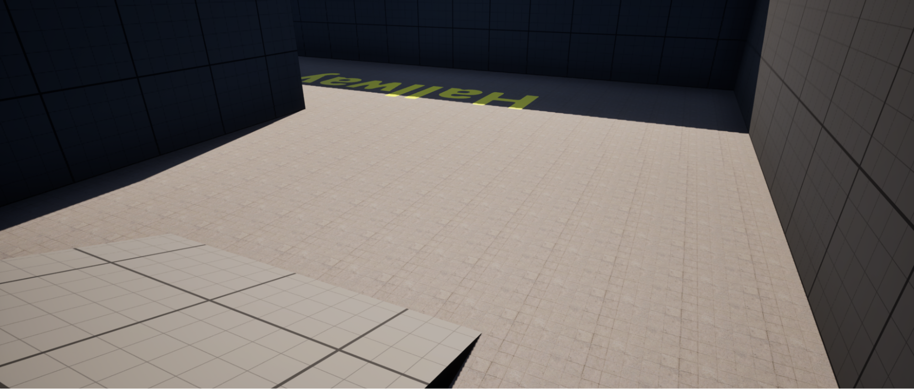

# 创建材质和材质实例

> 路径：虚幻引擎5.7文档 / 入门指南 / 虚幻引擎新用户指南 / 解谜冒险游戏美术创作指南 / 创建材质和材质实例

> 原始页面：https://dev.epicgames.com/documentation/unreal-engine/artist-03-create-materials-and-material-instances

在本教程中，你将进一步了解**材质**和**材质实例**。 你将学习有助于做出艺术选择、加快开发速度以及控制项目开销的材质工具集和技术。 稍后，你将把材质应用到游戏资产上，并根据关卡中的玩家行为，使用蓝图来控制材质。

## 开始之前

本模块需要明亮的环境光照。 如果你已经按照[上一篇教程](../artist-02-light-a-scene/index.md)减少了关卡中的光照，请使用以下设置：

|  |  |
| --- | --- |
| **定向光源强度（Directional Light Intensity）** | 6.0 |
| **最小 EV100（Min EV100）** | False |
| **最大 EV100（Max EV100）** | False |

## 材质和材质实例

[材质（Materials）](../../../../designing-visuals-rendering-and-graphics/unreal-engine-materials/essential-unreal-engine-material-concepts/index.md)用于定义游戏中各类资产的表面属性。 与[纹理](../../../../designing-visuals-rendering-and-graphics/textures/index.md)类似，材质就像包裹网格体的包装纸，改变其表面的外观以及对光源的反应方式。

从左到右：一个裸露的网格体和一个已有表面材质的网格体。

与纹理不同，材质通过基于节点的工作流程提供无损的自定义方式。 例如，材质包含一些预设的**属性**，用于模拟现实世界中的石头或金属等物质的特性。 下图中材质之间的唯一区别在于它们的**金属感**和**粗糙度**属性。

材质可以组合纹理和逻辑，逐层生成复杂的物质。 你可以通过这些组合，做出影响项目世界构建的艺术选择。 你可以利用它创造简单如为金属游戏资产添加划痕的效果，或者复杂如模拟水流冲刷沙子的效果。

> 动图已省略：水和沙子substrate材质。

水和沙子、岩石和冰，以及蛋白石substrate材质。

除了美术选择之外，你还可以利用材质来简化开发流程。 例如，材质可以生成子文件类型，称为材质实例。 **材质实例（Material Instance）**是一个副本，它继承自其父材质的属性。 实例可以无损地覆盖这些继承属性，以获得自己的独有属性。

仅使用一个父材质，材质实例就可以拥有蓝色、黄色和红色等不同属性。

在开发环境中，你可以使用父材质和材质实例进行以下操作：

- **获得即时视觉反馈：**对实例所做的更改会立即在所有视口中显示，无需重新编译父材质的着色器。
- **提升性能：**材质实例与父材质使用相同的着色器代码，从而减少需要编译的着色器总数，并降低运行时的**着色器切换**开销。
- **精简工作流程：**实例仅公开艺术团队需要的相关属性，从而简化复杂性。
- **与蓝图交互：**由于材质及其子实例使用逻辑，材质属性可以通过[蓝图](../../../../blueprints-visual-scripting/introduction-to-blueprints-visual-scripting/index.md)进行外部控制。

> [!TIP]
> 提示：
>
> - 材质并不仅仅局限于网格体。 它们可以用于用户界面、后期处理、光照等。
> - 材质不是着色器，而是一种接口，可以无声地将基于节点的表达式转换为高级着色语言（High-Level Shader Language，HLSL)，以计算资产的最终外观。
> - **着色器切换**是指虚幻引擎为其正在绘制的资产选择相关着色器的过程。 频繁的着色器切换可能会导致运行时卡顿。

让我们来熟悉一下本教程中会用到的工具和界面。

## 材质的构成

为了更好地理解材质工具集，让我们打开一个现有的材质。 在**内容浏览器（Content Browser）**中，导航到以下路径：

**All > Content > LevelPrototyping > Materials**

在**Materials**文件夹内，找到`M_FlatCol`。

注意此材质的命名规范：它使用了前缀**M_**。 这是虚幻引擎常用的[命名规范](../../../../production-pipeline/recommended-asset-naming-conventions-in-unreal-89ae65f2/index.md)，用于将材质与其他文件区分开来。 你可以自行决定具体的前缀，但要注意：当开发团队需要处理数百个资产时，统一的命名规范有助于防止混淆。

双击`M_FlatCol`。 打开的窗口就是**材质编辑器**。 在本教程中，此编辑器中最重要的选项卡是**预览窗口**、**材质图表**和**细节**面板。

| 编号 | 选项卡名称 | 说明 |
| --- | --- | --- |
| 1 | **预览窗口** | 显示正在编辑的材质的实时示例。 包含更改光照、视图模式和预览网格体的选项。 |
| 2 | **材质图表** | 材质是通过在这个基于节点的图表中组合节点（称为**表达式**）来构建的。默认情况下，材质图表中已包含一个节点，称为**基础材质节点**或**材质根节点**。与使用纹理贴图不同，`M_FlatCol`使用**表达式**来设置灰色的**基础颜色（Base Color）**。 |
| 3 | **细节面板** | 所有已选材质表达式的属性窗口。 如未选择节点，将显示该材质的**基本属性**。基础属性**材质域（Material Domain）**、**混合模式（Blend Mode）**和**着色模型（Shading Model）**会影响材质根节点在图表上显示的属性。 |

要更改材质的**基础颜色（Base Color）**，请执行以下操作：

1. 在材质图表中，双击**基础颜色（Base Color）**节点。
2. 在**取色器（Color Picker）**中，输入**HEX sRGB**`FFBC00FF`，然后点击**确定（OK）**。
3. 单击**Save（保存）**，**选择File（文件）> Save（保存）**或按**Ctrl + S**保存材质。

如果你项目中的资产使用了`M_FlatCol`，你可能会注意到关卡中的变化。

返回内容浏览器，找到`MI_DefaultColorway`。 这是一个使用`M_FlatCol`作为其父材质的材质实例。

双击它以打开**材质实例编辑器**。

与材质编辑器不同，材质实例编辑器不允许自定义节点结构。 在**细节**面板中，可以看到`M_FlatCol`显示在**Parent**节点标头下。 由于父材质会将属性传递给其子材质，此实例的**基础颜色（Base Color）**应该是黄色——请查看**预览窗口（Preview Window）**进行确认。 示例网格体仍然是灰色的。

这是因为`M_FlatCol`中的**基础颜色（Base Color）**属性是**公开**的（即可编辑的），并且当前被一个灰色值所覆盖。 实例可以通过重载公开的父材质属性来获得自己独有的属性设置。

让我们做两个不同的实验：

- 移除重载。
- 应用重载以改变此实例的基础颜色。

请按照以下步骤继续操作：

1. 在**细节面板**的**表面属性**下，取消勾选**基础颜色（Base Color）**。 这将移除重载。 在预览窗口中，示例网格体应从灰色变为黄色。
2. 要重新应用重载，请选中**基础颜色（Base Color）**。 点击色条，打开**取色器（Color Picker）**并选择一种新颜色。
3. **保存**该材质实例。

注意，关卡中使用此实例的资产将更新为新的基础颜色，但使用`M_FlatCol`的资产仍保持黄色。

这是因为材质是分层的：

- 父材质可以将更改传播到其子实例。
- 实例可以拥有独特的公开属性。
- 实例可以将更改传播到其自身的子实例。
- 实例无法将更改传播到父材质。

材质与实例的传播层级结构。

一个高效且实用的父材质可以作为所有子实例的灵活基础，减少开发流程中的编译量、着色器切换次数以及重复操作。 在创建父材质时，应考虑你的团队会频繁访问和迭代哪些属性。

> [!NOTE]
> 如果想重置本节中修改过的材质，请将M_Flat_Col的**基础颜色（Base Color）**设置为`767676FF`，并将MI_DefaultColorway的**基础颜色（Base Color）**设置为`C0C0C0FF`。

> [!NOTE]
> 如需深入了解材质编辑器界面，请参阅[材质编辑器UI](../../../../designing-visuals-rendering-and-graphics/unreal-engine-materials/unreal-engine-material-editor-user-guide/unreal-engine-material-editor-ui/index.md)。

## 创建父材质

在本节中，你将构建一个包含**基础颜色（Base Color）**、**金属感（Metallic）**、**法线（Normal）**和**粗糙度（Roughness）**属性的父材质。 你将通过使用纹理、表达式以及两者的组合来控制这些属性。

要创建新的材质，请执行以下操作：

1. 在**内容浏览器**中，导航至文件路径**All > Content > AdventureGame > Artist > Materials**，点击**添加（Add）**并从列表中选择**材质（Material）**。
2. 将该材质命名为`M_Surfaces`。
3. 双击`M_Surfaces`打开材质编辑器。

接下来，你将使用纹理来控制材质中的各项属性。

### 通过纹理控制属性

**纹理贴图**（或纹理）是一种图像文件，可以在材质中进行分层和定制，以创造不同的视觉效果。

对于具有复杂细节或空间变化细节的材质来说，纹理非常有用，因为每个像素都存储着独特的RGB和Alpha信息。 例如，在创建模拟金属划痕的材质时，高光度贴图使用Alpha信息来精确定位哪些区域应该反射光线，哪些区域不应该反射。

注意火箭上的反射和非反射区域。

在本节中，你将使用表达式**TextureSample**为你的材质应用**漫反射**贴图和**法线**贴图。

> [!TIP]
> **漫反射贴图（Diffuse Map）**包含基本的颜色和视觉属性，不含光照信息。 **法线贴图**可以在不增加网格几何体的情况下，模拟表面纹理细节（例如凹凸或裂缝）。

要添加纹理贴图，请执行以下操作：

1. 右键单击图表，然后搜索并从列表中选择**TextureSample**。 你也可以使用键盘快捷键**T + 鼠标左键**。

   > 动图已省略：7f38e865f4b7da1bbb49bf3cbbac7f154089aefec263cc3e2e36128c2d609387
2. 添加两个**TextureSample**节点，并将其中一个移动到另一个的下方。
3. 选中顶部的**TextureSample**节点。 在**细节**面板的**材质表达式纹理基础（Material Expression Texture Base）**下，点击空的**纹理（Texture）**下拉菜单并搜索`DefaultDiffuse`。 从列表中选择漫反射贴图。

   > 动图已省略：136578ed2800854bf166f559e53f5de6d2ae3ff49dd4144ebc74230dd5c5de54
4. 保持顶部**TextureSample**节点选中状态，将其**RGB**输出连接到材质根节点（`M_Surfaces`）的**基础颜色（Base Color）**输入。
5. 选择**TextureSample**节点。 在**细节**面板的**材质表达式纹理基础（Material Expression Texture Base）**下，点击**纹理**下拉菜单并搜索`DefaultNormal`。 从列表中选择法线贴图。
6. 在仍然选中底部的**TextureSample**节点的情况下，将它的**RGB**输出连接到材质根节点上的**法线（Normal）**输入端口。

   > 动图已省略：41a65fd4942be7a37630156cf99fe7c98047ededdaf18ee27e467c59efba7a75
7. **保存**你的材质。

你的材质图表应如下所示：

接下来，你将使用表达式来控制属性。

### 通过常量控制属性

在本节中，你将通过使用**常量（Constant）**表达式控制**金属感（Metallic）**和**粗糙度（Roughness）**属性来创建类似石头的材质。 使用常量来控制属性，这种方法很适合进行统一、全局性的调整。

常量通过单个**浮点值**控制属性。 例如，**金属感（Metallic）**的浮点值范围为0到1。 0模拟非金属表面（如塑料），1模拟金属表面（如铬）。

> [!NOTE]
> 在虚幻引擎中，金属表面上的反射会受基础颜色影响，而非金属表面上的反射则受环境光源影响。

**粗糙度（Roughness）**的浮动值范围也是0–1。 0模拟光滑表面，1模拟粗糙表面。 粗糙度会影响光线在表面的散射方式；光滑的表面具有更集中的镜面反射效果（呈现光泽感），而粗糙表面则产生漫反射效果（呈现哑光感）。

使用常量控制这些属性，你就可以模拟哑光塑料、光泽塑料、粗糙金属或光滑铬等材质效果。

要创建石头材质，请执行以下操作：

1. 在材质图表中右键单击，从列表中选择**常量（Constant）**。 或者，你可以使用键盘快捷键**1 + 鼠标左键**。 添加两个常量。
2. 从第一个常量引脚拖出连线，将其连接到根节点的**金属感（Metallic）**输入。 将第二个常量连接到**粗糙度（Roughness）**输入。

   > 动图已省略：350f47ebad19650a08297c428a317478d0f85d04d0b01d84834810e0d80faa11
3. 选中金属感常量后，确认其**值**为`0`。
4. 选中粗糙度常量后，将其**值**设置为`1`。
5. **保存**你的材质。

你的材质图表应如下所示：

在下一节中，你将学习更多关于在材质内平铺纹理的知识。

### 缩放和平铺纹理

你可能已经注意到，你的漫反射贴图和法线贴图看起来像地板砖。 在本节中，你将使用材质表达式来缩放[UV](../../../../working-with-content/modeling-and-geometry-scripting/modeling-tools/uvs-category/index.md)，并创建一个可以向各个方向无限重复的石质地板。 这种方式称为**平铺（Tiling）**。

平铺常用于覆盖大型网格体，无需增加额外开销；与使用特定网格体专用的大型高分辨率纹理相比，缩小并平铺纹理的成本更低。

平铺的木地板材质。

> [!NOTE]
> 资源分配通常会影响游戏开发中的决策。 在玩家不太关注的区域（例如地板）节省资源，有助于团队将更多资源投入角色、项目或在实时过场动画中需要特写的几何体，为其创建高分辨率、独特或手绘的纹理。

在这里，你将使用**纹理坐标（Texture Coordinate）**表达式来控制漫反射贴图和法线贴图的平铺。 你还将使用一种新的表达式——乘法（Multiply）。 **Multiplay**表达式接收两个输入并将它们组合成一个输出。

要创建平铺纹理，请执行以下操作：

1. 在材质编辑器的预览窗口中，将网格体设置为基本平面，以便更清晰地查看材质。

   > [!TIP]
   > 你可能需要调整预览光照，以便更清楚地观察纹理。 在预览窗口中，按住**L键**并同时按住**鼠标左键（LMB）**，可以拖拽光源进行调整。
2. 在材质图表中，右键单击并从列表中添加一个**纹理坐标（Texture Coordinate）**节点。
3. 从**纹理坐标（Texture Coordinate）**节点的**输出**端拖出连线，搜索并创建一个**乘法（Multiply）**节点。
4. 从**Multiply**节点的**B**输入端拖出连线，创建一个**Constant**。
5. 将**常量**节点的**浮点值**设置为`1`。
6. 从**Multiply**节点的**输出**拖出引线，将其分别连接到**Diffuse**节点和**Normal Texture Sample**节点的**UV**输入上。

你的平铺材质已经完成了。 让我们进行两个关于平铺的实验：使用整数放大，以及使用小数缩小。

1. 在材质图表中，选择控制**纹理坐标（Texture Coordinate）**的**常量（Constant）**。
2. 将其**值**设置为`2`。

由于漫反射贴图和法线贴图在其原始比例（1.0）下显示为5x5的砖块网格，将它们放大2倍后将生成10x10的砖块网格。 如果仔细观察，你可以发现纹理瑕疵重复出现的地方。

|  |  |
| --- | --- |
|  |  |
| 纹理坐标缩放（Texture Coordinate Scale）：1.0 | 纹理坐标缩放（Texture Coordinate Scale）：2.0 |

现在，将**值**设置为`0.5`。 注意，纹理没有采用正确的平铺方式。 如果漫反射贴图是一个6x6的网格，将其比例缩小到0.5后就不会被裁切。 在创建贴图时，必须考虑纹理在虚幻引擎中的缩放方式。

|  |  |
| --- | --- |
|  |  |
| 纹理坐标缩放（Texture Coordinate Scale）：0.5 | 纹理坐标缩放（Texture Coordinate Scale）：0.6 |

> [!TIP]
> 网格体的UV也会影响纹理的平铺方式；被拉伸的UV可能会导致出现非预期的纹理拉伸现象。 你将在本教程的后续部分以及下一部分教程系列中，了解更多相关内容并找到解决方案。

### 材质图表整理

让我们先暂停一下，思考一下组织结构这个问题。 随着材质图表变得越来越复杂，应务必整理节点结构并保持清晰的逻辑——这不仅便于开发团队进行协作，也有助于你在开发过程中理清思路。 为了保持整洁，你可以使用**注释框（Comment Boxes）**在图表中创建视觉分区和标题。

要创建注释框，请执行以下操作：

1. 选中**Texture Coordinate**和**Multiply**节点。 按下键盘快捷键**Q**，将它们水平对齐。
2. 选中**Texture Coordinate**、**Multiply**和**Constant**节点，按下键盘快捷键**C**添加注释。
3. 将注释框的标题重命名为`UV Tiling`。

   > 动图已省略：c8d638d73d7e323ddeec156098dd5d08724455c2e226c670d4b1240c23b3251a
4. **保存**你的材质。

> [!TIP]
> 为了整理白色的连接线，可以双击它们添加断点。 按**Q键**水平对齐任何表达式或断点。
>
> > 动图已省略：5f008dc106a8c70e28eed01c34c73f43f880ed4384d7e36e70ad3628efa488d8

你的材质图表应如下所示：

### 通过Constant3Vectors控制属性

既然你已经熟悉了常量，接下来就可以使用**Constant3Vector**了。 与向量变量一样，Constant3Vector可以保存三个浮点值，而不是一个。 这对于调整XYZ坐标或RGB信息非常有用。

在本节中，你将使用一个Constant3Vector节点来设置RGB颜色。 你将使用乘法节点将该颜色与漫反射贴图结合，无损地改变其色调。

从左到右：无变化（白色）、黄褐色和灰色状态下的M_Surfaces漫反射纹理。

要更改漫反射贴图的色调，请执行以下操作：

1. 在材质图表中，从**Diffuse Texture Sample**节点的**RGB**输出端拖出连线，并从选择菜单中创建一个**Multiply**节点。
2. 从**Multiply**节点的**输出**端拖出连线，将其连接到材质根节点的**Base Color**输入。
3. 从**Multiply**节点的**B**输出端拖出连线，创建一个**Constant3Vector**节点。
4. 双击**Constant3Vector**节点的**色条**以打开**取色器（Color Picker）**并选择一种颜色，或者输入HEX sRGB值`CDDAFFFF`进行跟随操作。
5. 选中Constant3VectorMultiply）节点，按下键盘上的C键，创建一个名为`漫反射色调（Diffuse Hue）`的注释框。
6. 保存你的材质。

你的材质图表应如下所示：

你的父材质现在就完成了。 在下一节中，你将学习更多关于使用材质层级结构以及将更改传播到实例的知识。

## 静态值和参数

到目前为止，你一直在使用**静态**值。 静态值是在编译时设置的值，不能在运行时更改。 在下一节中，你将学习如何将静态值转换为**参数**。 参数可以在运行时通过蓝图进行修改。

还记得那个传播层级结构吗？ 和其他属性一样，参数会从父级传播到子级。

不过，与其他属性不同的是，参数可以在子材质实例中被重载。 当你更改`MI_DefaultColorway`的基础颜色时，你已经使用过参数了。

> [!TIP]
> 这也称为**公开**和**已公开**参数。

### 将静态值转换为参数

请记住，父材质是所有子实例的灵活基础。 在公开属性时，务必考虑你将如何在不同资产之间使用材质。 在本例中，你将使用`M_Surfaces`来为三个游戏资产赋予表面材质：

- 布景
- 地板
- 地板的干湿效果（将在下一篇教程中实现）。

> [!NOTE]
> **布景**或**场景装饰**（简称set dec）是一个源自电影行业的术语，在游戏开发中通常指玩家无法与之交互的关卡内静态资产。

考虑到这些应用场景，你需要将用于控制以下属性的**常量**转换为参数：

- UV平铺
- 漫反射贴图
- 漫反射色调
- 法线贴图
- 粗糙度（Roughness）

要将一个表达式转换为参数，请执行以下操作：

1. 在`M_Surfaces`的材质图表中，选择UV平铺（UV Tiling）中的**常量（Constant）**。
2. 右键单击节点，选择**转换为参数（Convert to Parameter）。**
3. 给参数命名，使其具有可识别性并与它要更改的值相关联。 在本例中，其命名为`UV Tiling`。
4. 选中连接到**粗糙度（Roughness）**属性的常量，右键单击该常量，然后选择**转换为参数（Convert to Parameter）**。
5. 将新参数命名为`Roughness`。
6. 选中控制漫反射色调的Constant3Vector，将其转换为向量参数，并重命名为`Diffuse Hue`。
7. 选中漫反射**TextureSample**节点，将其转换为参数，并重命名为`Diffuse`。
8. 选中法线**TextureSample**节点，将其转换为参数，并重命名为`Normal`。
9. 保存你的材质。

你的材质图表应如下所示：

接下来，你将创建材质实例，为你的游戏资产应用材质效果。

## 创建材质实例

让我们为本节要展示的地板和布景这两个资产分别创建一个材质实例。

要创建材质实例，请执行以下操作：

1. 在内容浏览器中，右键单击`M_Surface`并选择**创建材质实例（Create Material Instance）**。
2. 将其命名为`MI_Surfaces_Floor`。
3. 创建第二个材质实例，将其命名为`MI_Surfaces_Tile`。
4. 双击`MI_Surfaces_Floor`打开材质实例编辑器（Material Instance Editor）。

注意，你在`M_Surfaces`中公开的参数现在已分组显示在此子实例的**细节**面板中。

接下来，你将把这些实例应用到关卡中的网格体上，并对已公开的属性进行调整。

### 材质实例重载

在本节中，你将把`MI_Surfaces_Floor`应用到**Lvl_Adventure**场景中`Hallway 2`走廊的地板网格体上。

要将实例应用到地面，请执行以下操作：

1. 在**大纲视图**中，找到**Hallway2**文件夹，并选中名称中包含`Floor`的所有项。
2. 在**细节**面板的**材质（Materials）**类别下，在**Element 0**旁边，将`MI_ProcGrid`替换为`MI_Surfaces_Floor`。

仔细观察地面。 你可以看到纹理在地板网格体上出现了重复。 根据你的项目需求，明显的重复效果可能并不理想。

MI_Surfaces_Floor使用了其父材质的UV平铺值1.0。

有许多方法可以掩饰平铺问题，例如纹理混合、距离混合、纹理爆炸或贴花。 在本教程中，你有足够的**纹理分辨率**进行缩放。

要在实例中放大UV，请执行以下操作：

1. 在`MI_Surfaces_Floor`的**细节**面板中，在**全局标量参数值（Global Scalar Parameter Values）**下勾选**UV平铺（UV Tiling）**，将其值设置为`0.2`。
2. **保存**材质实例。

放大UV后，地面的平铺痕迹看起来就不那么明显了，瓷砖相对于玩家角色来说尺寸更加合理，从玩家的视角看纹理依然清晰，并且关卡中有相当大的一片区域已经完成了材质覆盖。 你无需消耗不必要的高分辨率纹理资源，就能够实现这一切操作。

### 重复使用材质实例

假设你需要快速制作一个由石材构成的其他资产。 你可以通过重载属性，重复使用父材质，以较低成本创建独特的资产。 在本例中，你将创建场景装饰：一堆石板地面材质。

要创建地砖网格体，请执行以下操作：

1. 在虚幻编辑器工具栏中，单击**Add > Shapes > Cube**。 在**大纲视图（Outliner）**中，将其重命名为`Tile`。
2. 选中平铺（Tile），在**细节**面板中，将**缩放（Scale）**修改为`0.5`、`0.5`和`0.05`。
3. 在虚幻编辑器工具栏中，单击**Add > Shapes > Cube**并将其命名为`Slab`。
4. 选中板（Slab），在**细节**面板中，将**缩放（Scale）**修改为`1.5`、`1.0`和`0.05`。
5. 选中平铺（Tile）后，按住**Alt键**并在视口中**拖拽**以复制静态网格体。 对板（Slab）执行相同的操作。 按照你的喜好排列这些资产。

要微妙地区分瓷砖与地面，请执行以下操作：

1. 双击`M_Surfaces_Tile`将其打开。 在**细节**面板中，勾选**UV平铺（UV Tiling）**，并将数值设置为`0.2`，以匹配地板网格体。
2. 在**全局向量参数值（Global Vector Parameter Values）**下，勾选**漫反射色调（Diffuse Hue）**并将HEX sRGB值设置为`A5AEC9FF`。
3. **保存**你的实例。
4. 在**大纲视图**中，选中所有**Tile**实例。 在**细节**面板的**Materials > Element 0**下，添加`MI_Surfaces_Tile`。
5. 选中所有**板（Slab）**实例，并应用`MI_Surfaces_Tile`。

注意，这里有个问题。 **图块（Tiles）**的分辨率与地面网格体相当，但当你调整**板（Slab）**的缩放时，其UV会随着网格体一起（均匀和非均匀地）缩放。 正因为如此，你的石头材质被拉伸了。 这在网格体的侧面尤为明显。

根据项目需求，你可能希望材质的分辨率在不同资产上能够呈现出一致的缩放效果，而不是出现拉伸变形。

（1）适当比例的材质。 （2）均匀拉伸放大的材质。 （3）非均匀拉伸放大的材质。

在开发环境中，你可以通过调整网格体几何体、UV映射或使用三平面投影（一种沿着网格体XYZ轴均匀应用材质的方法）来解决这个问题。

在本示例中，你将通过重载从`M_Surfaces`继承的纹理贴图，为布景创建一个全新的外观：

1. 在`MI_Surfaces_Tile`的**细节**面板中，在**UV平铺（UV Tiling）**旁边，将数值设置为`1`。
2. 勾选**漫反射（Diffuse）**并搜索`Gray`。
3. 选中**法线（Normal）**，然后搜索`T_Base_Tile_Normal`。
4. 在**漫反射色调（Diffuse Hue）**旁边，输入HEX sRGB`D0CECBFF`。
5. **保存**你的实例。

现在，你的布景和地面部分就完成了。

> [!NOTE]
> 在更实际的开发环境中，你可能会采用更高效的方法来创建布景。 例如，你可以将松散的地砖直接并入地板网格体中，以节省几何体资源。

现在你已经创建了一个灵活的父材质和两个独特的材质实例。 在此过程中，你还了解了：

- **管理资源分配：**谨慎的资源分配意味着你可以将更多资源用于重要的游戏资产。
- **在编辑器中整理资产：**当团队需要处理数百个资产时，良好的组织结构和命名规范有助于避免混乱。
- **构建模块化工作流程：**无损的模块化流程可以避免重复或耗时的工作——这一点在开发周期紧张时尤为重要。
- **兼顾艺术表现与技术限制：**游戏开发通常需要发挥创造力，以规避技术限制，并在尽量不牺牲艺术效果和观感的前提下找到折中方案。

## 下一步

在下一个教程中，你将学习三平面投影、使用静态开关打破传播层级，以及利用蓝图根据关卡中的玩家行为来控制材质。

- [扩展材质实例](../artist-04-expanded-material-instances/index.md) - 使用动态材质实例创建一个交互式技术演示。
