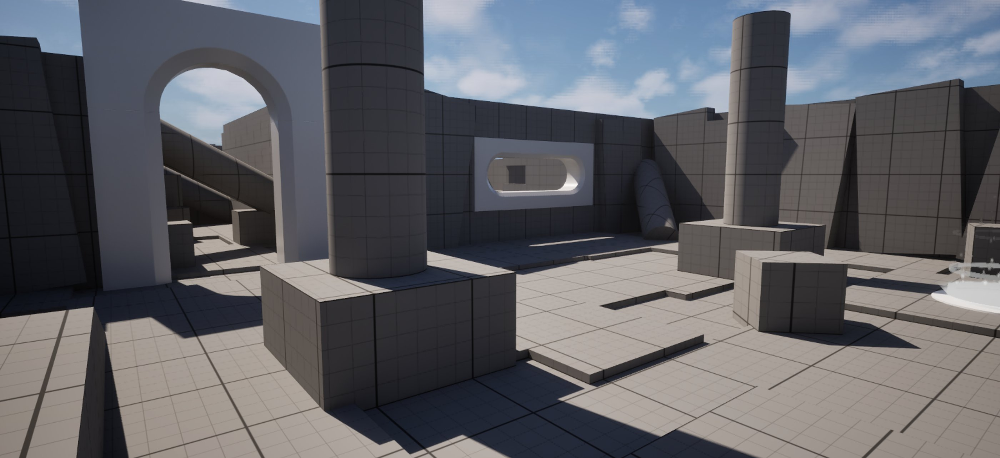
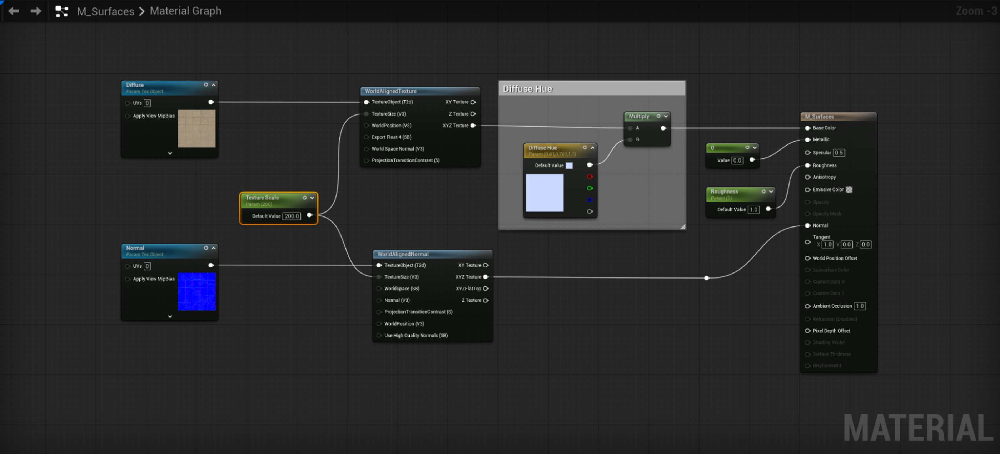
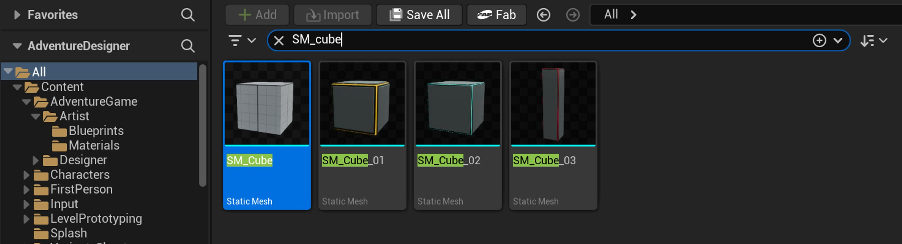
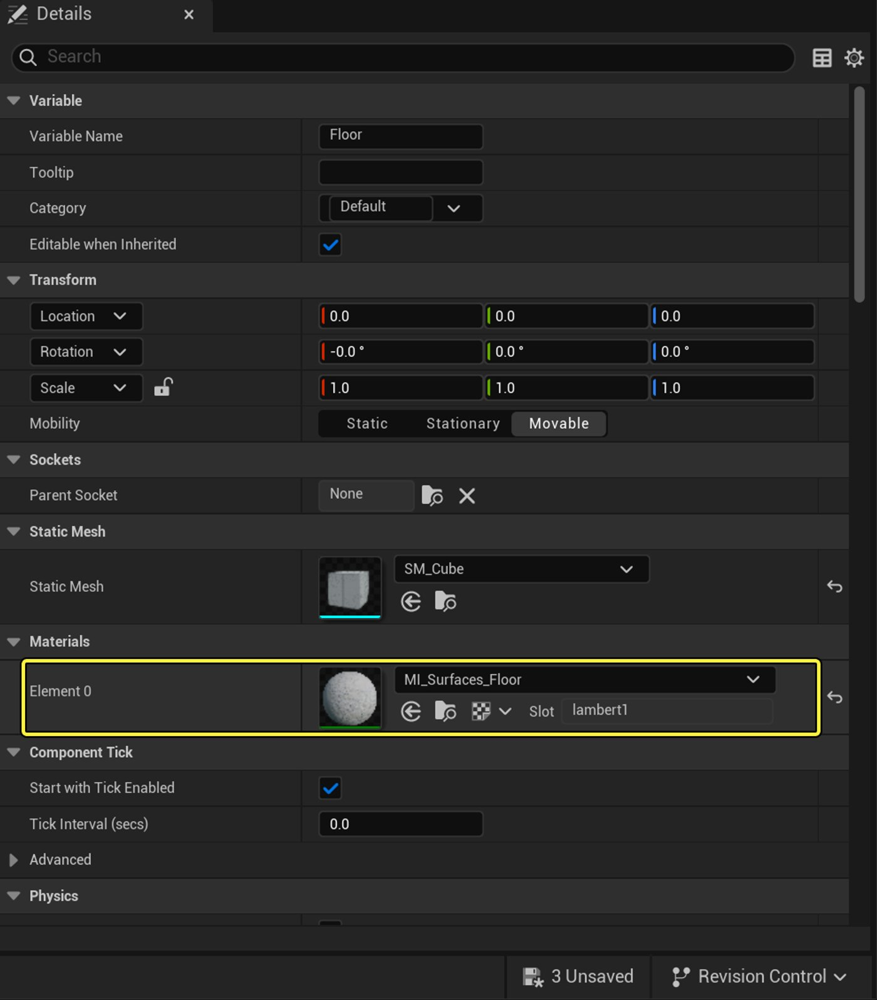
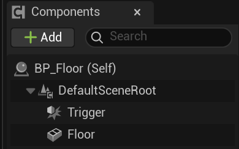
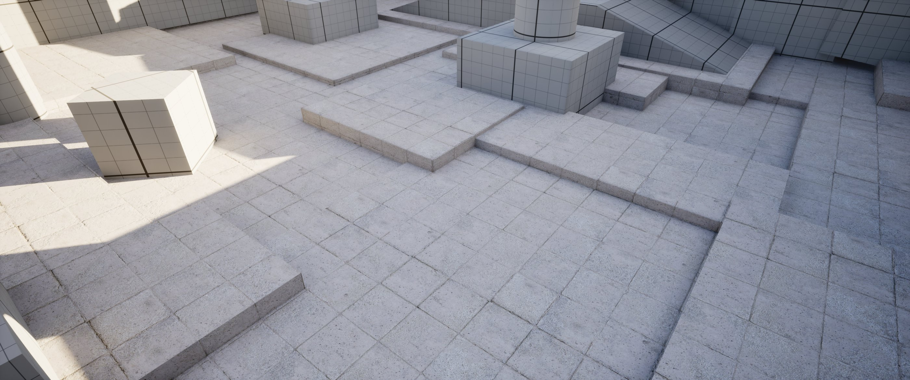
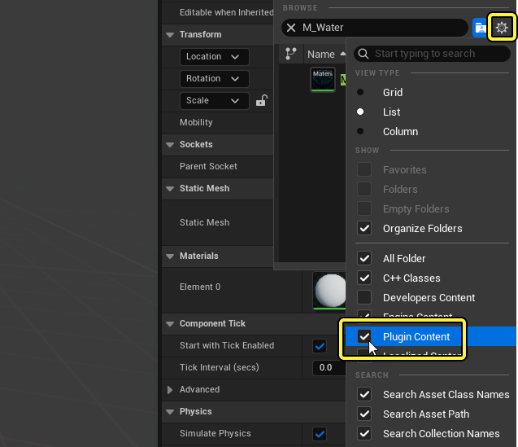
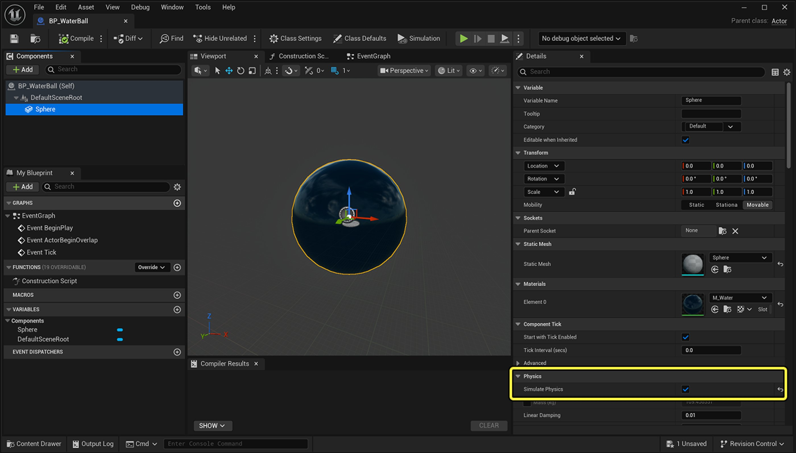

# 扩展材质实例

> 路径：虚幻引擎5.7文档 / 入门指南 / 虚幻引擎新用户指南 / 解谜冒险游戏美术创作指南 / 扩展材质实例

> 原始页面：https://dev.epicgames.com/documentation/unreal-engine/artist-04-expanded-material-instances

在游戏过程中更改资产的材质属性，是向玩家提供视觉反馈、传达玩法信息或增强沉浸感的有效方式。 例如：

- 玩家皮肤可以改变外观，用于表示不同的状态效果。
- 拾取物可以发光，以便吸引附近玩家的注意。
- 下雨时，地面从干燥变为湿润可以增加游戏内的沉浸感。

> 动图已省略：b57e36d2784ed33e24b3811d844ecf751415821f7a4867a01fe387f3e13118ba

角色在获得强化道具后，手臂会变为自发光。

在本教程中，你将使用**蓝图**在运行时更改材质属性，创建一个交互式技术演示。 在此演示中，你将创建一个水球，当玩家在关卡中推动它时，它会浸湿地板。

你还将尝试使用**自发光材质**、简单的**遮罩**和**静态开关**，创建能在湿地板上产生反射效果的布景。

## 创建可立即使用的地板资产

你将为技术演示构建的第一个资产是地板。 在**Lvl_Adventure**的Room 3中，你将创建一个可用于游戏的成品地板资产，以替换占位地板网格体。



Room 3的占位地板网格体。

在开始之前，让我们暂停一下，思考你的实现方法。 在[上一篇教程](../artist-03-create-materials-and-material-instances/index.md#reuse-material-instances)中，你了解到**平铺****纹理**是一种为大型网格体（如地板）添加表面的低成本方法。 你也已经了解网格的[UV](../../../../working-with-content/modeling-and-geometry-scripting/modeling-tools/uvs-category/index.md)会影响纹理的显示效果。

（1）正确缩放的材质。 （2）均匀拉伸放大的材质。 （3）非均匀拉伸放大的材质。

Room 3中的占位地板由三个网格体组成，每个网格体都有不同的UV。

在下面的演示中，请注意，由于不同网格之间UV不一致，平铺纹理看起来大小不同。 这给地板的整体表面处理带来了一个挑战。

> 动图已省略：Floor-pattern-sliding-over-platforms

在不同UV的网格体之间缩放非世界对齐纹理。

你将通过使用**三平面投影**来解决这个问题。 三平面投影是一种表面处理技术，它忽略UV并使纹理实现**世界对齐**。 这种方法在无法修正UV，或者处理难以展开UV的几何体时非常有用。

> 动图已省略：Floor-pattern-moving-over-platforms

在不同UV的网格体之间缩放世界对齐纹理。

基于这一思路，你将使用**表达式**让`M_Surfaces`实现世界对齐。 由于材质实例会继承父材质的属性，`MI_Surfaces_Floor`也将采用世界对齐方式。 然后，你将把`MI_Surfaces_Floor`应用到这个蓝图上，以替换场景中的占位网格体。

> [!TIP]
> 为了提前避免UV问题，我们建议在建模软件中创建模块化资产时，适当地缩放其UV。

### 创建世界对齐材质

要使你的父材质世界对齐，请执行以下操作：

1. 在**内容浏览器**中，导航至文件路径**All > Content > AdventureGame > Artist > Materials**，并打开`M_Surfaces`。
2. 选择**UV 平铺（UV Tiling）**注释框中的所有节点、漫反射贴图和法线贴图。 将它们**删除**。

   > 动图已省略：Delete-the-UV-box-and-2-maps
3. 右键单击图表并搜索[纹理对象（Texture Object）](https://dev.epicgames.com/documentation/unreal-engine/texture-material-expressions-in-unreal-engine?application_version=5.7)。 创建两个这样的节点。

   > 动图已省略：Create-2-texture-target-nodes
4. 选择第一个**纹理对象（Texture Object）**。 在**细节**面板中，将其**纹理（Texture）**设置为**DefaultDiffuse**。
5. 右键单击**纹理对象（Texture Object）**并选择**转换为参数（Convert to Parameter）**。 将新参数命名为`Diffuse`。
6. 选择第二个**纹理对象（Texture Object）**。 在**细节**面板中，将其**纹理（Texture）**设置为**DefaultNormal**。
7. 右键单击**纹理对象（Texture Object）**并选择**转换为参数（Convert to Parameter）**。 将新参数命名为`Normal`。
8. 在**Diffuse**节点上，从输出端口拖出并添加一个**World Aligned Texture**节点。

   > 动图已省略：Add-world-aligned-texture-mode
9. 从**XYZ Texture**输出端口，将其连接到**Multiply**节点的**A**输入端口（在漫反射色调（Diffuse Hue）注释框内）。
10. 在**Normal**节点上，从**输出**端口拖出并添加一个**World Aligned Normal**节点。
11. 从**XYZ纹理（XYZ Texture）**输出端口，将其连接到**M_Surfaces**材质根节点的**法线（Normal）**输入。
12. 在图表中右键单击并搜索**Scalar Parameter**。 将其命名为`Texture Scaling`。
13. 将其**默认值（Default Value）**设置为`214`。
14. 将**纹理缩放（Texture Scaling）**的输出连接到两个**WorldAligned**节点的**TextureSizeV3**输入端。
15. **保存**你的材质。

你的材质图表应如下所示：



接下来，你将创建一个蓝图，用于替换占位地板。

### 创建地板蓝图

要创建该蓝图，请执行以下操作：

1. 在**内容浏览器**中，导航至路径**All > Content > AdventureGame > Artist**，右键单击并选择**新建文件夹（New Folder）**。
2. 将文件夹命名为`Blueprints`。
3. 在**Blueprints**文件夹中右键单击，选择**蓝图类（Blueprint Class）**，然后选择**Actor**作为父类（Parent Class）。
4. 将蓝图命名为`BP_Floor`并双击，以便在**蓝图编辑器**中将其打开。
5. 在内容浏览器中，选择**All**文件夹，并搜索`SM_Cube`。

   
6. 将**SM_Cube**拖入蓝图编辑器（Blueprint Editor）的**组件（Components）**面板，作为**BP_Floor**的子项。

   > 动图已省略：Drag-SM-cube-to-the-editor
7. 将SM_Cube命名为`Floor`。
8. 在**细节**面板中，确保其**缩放（Scale）**为`1.0, 1.0, 1.0`。
9. 在**Materials > Element 0**旁边，将其材质设置为`MI_Surfaces_Floor`。

   
10. 在**组件（Components）**选项卡中，选择**DefaultSceneRoot**，点击**添加（Add）**，然后添加一个`盒体碰撞（Box Collision）`。
11. 将盒体碰撞命名为`Trigger`。

    
12. 在**细节**面板中，将触发器（Trigger）的**缩放（Scale）**设置为`1.5, 1.5, 1.5`。
13. 将触发器（Trigger）的位置设置为`50, 50, 55`。
14. **保存**并**编译**蓝图。

将一个`BP_Floor`实例拖入你的关卡进行移动。 请注意，当你移动网格体时，纹理仍然保持在原来的位置。 如果你尝试缩放网格体，会发现网格体本身发生了变化，但纹理并不会随之缩放。

> 动图已省略：30c3745041b672498f060a0b8d86427eb1216746aa8996fec151444aae980867

接下来，你将用`BP_Floor`的实例替换Room 3中的占位符地板。

### 替换占位网格体

现在，你可以按照自己的喜好，用`BP_Floor`替换Room 3中的占位网格并体进行排列。 我们创建了一个与占位符匹配的地板：



如果你希望使用上面展示的内容，可以按照以下步骤复制该关卡：

1. 确认你已根据上述教程更新了`M_Surfaces`并创建了`BP_Floor`。
2. 在**大纲视图**中，选择Room 3文件夹内的所有内容，然后按**删除（Delete）**。
3. **复制**以下代码段。

   Console Output

   ```
   Begin Map
      Begin Level
         Begin Actor Class=/Script/Engine.StaticMeshActor Name=StaticMeshActor_2 Archetype="/Script/Engine.StaticMeshActor'/Script/Engine.Default__StaticMeshActor'" ExportPath="/Script/Engine.StaticMeshActor'/Game/SFEFWFWEEEWEF.SFEFWFWEEEWEF:PersistentLevel.StaticMeshActor_2'"
            Begin Object Class=/Script/Engine.StaticMeshComponent Name="StaticMeshComponent0" Archetype="/Script/Engine.StaticMeshComponent'/Script/Engine.Default__StaticMeshActor:StaticMeshComponent0'" ExportPath="/Script/Engine.StaticMeshComponent'/Game/SFEFWFWEEEWEF.SFEFWFWEEEWEF:PersistentLevel.StaticMeshActor_2.StaticMeshComponent0'"
            End Object
            Begin Object Name="StaticMeshComponent0" ExportPath="/Script/Engine.StaticMeshComponent'/Game/SFEFWFWEEEWEF.SFEFWFWEEEWEF:PersistentLevel.StaticMeshActor_2.StaticMeshComponent0'"
               StaticMesh="/Script/Engine.StaticMesh'/Game/LevelPrototyping/Meshes/SM_Cylinder.SM_Cylinder'"
               StaticMeshImportVersion=1
               bUseDefaultCollision=False
               StaticMeshDerivedDataKey="STATICMESH_FD1BFC73B5510AD60DFC65F62C1E933E_228332BAE0224DD294E232B87D83948FQuadricMeshReduction_V2$2e1_6D3AF6A2$2d5FD0$2d469B$2dB0D8$2dB6D9979EE5D2_CONSTRAINED0_100100000000000000000000000100000000000080FFFFFFFFFFFFFFFFFFFFFFFF000000000000803F00000000000000803F0000803F00000000000000003D19FC1626C9B2485E57DB4B8EC731318B8215AE8D46FAD400000000010000000100000000000000010000000100000000000000000000000100000001000000400000000000000001000000000000000000F03F000000000000F03F000000000000F03F0000803F00000000050000004E6F6E65000C00000030000000803FFFFFFFFF0000803FFFFFFFFF0000000000000041000000000000A0420303030000000000000000_RT00_0"
   ```
4. 在**视口**中按下**Ctrl + V**。

   > 动图已省略：e1fac9e75cacf4d582064f8f85845c5bc5bb22a6b12f98f84e9185b08deb5e29

接下来，你将创建水球并使用**动态材质实例（Dynamic Material Instances）**将地板从干燥变为湿润。

## 通过玩家交互更改材质

水球将是一个启用了物理效果的对象，能够触发地板属性变化，使其呈现湿润外观。

### 创建水球

要创建并展示水球，请执行以下操作：

1. 在**内容浏览器**的**Blueprints**文件夹中，右键单击以创建一个新的**蓝图类（Blueprint Class）**。
2. 选择**Actor**作为父类（Parent Class）。
3. 将新蓝图命名为`BP_WaterBall`，并在**蓝图编辑器（Blueprint Editor）**中将其打开。
4. 在**组件（Component）**选项卡中，点击**添加（Add）**并搜索`Sphere`。
5. 在**细节**面板中，将**Materials > Element 0**设置为`M_Water`。

   > [!TIP]
   > `M_Water`是虚幻引擎自带的材质，你无需下载或创建。 如果你没有看到此资产，请点击资产选择器或内容浏览器中的**设置（Settings）**按钮，并启用**插件内容（Plugin Content）**。
   >
   > 
6. 还是在**细节**面板中，在**物理（Physics）**下，勾选**模拟物理（Simulate Physics）**。

   
7. **保存**并**编译**蓝图。
8. 将一个`BP_WaterBall`实例拖入你的关卡中。

在视口中右键单击并选择**从此处运行（Play From Here）**，在你的关卡中测试水球。 当你撞到该球体时，它应当沿着地面弹跳。

> 动图已省略：fd57871fa6d95ba989d9381faee945f01a325a277a3a3518e283a98af554cdfb

> [!TIP]
> 如果你的关卡中有敌人，将它们的**最大速度（Max Speed）**设置为`0`，以避免它们追逐你，或者直接将其移除。

接下来，你将在`BP_Floor`中使用逻辑创建一个动态材质实例（Dynamic Material Instance）。

### 创建动态材质实例

[动态材质实例（Dynamic Material Instance）](../../../../designing-visuals-rendering-and-graphics/unreal-engine-materials/instanced-materials/index.md)是通过脚本（例如蓝图）在运行时生成的材质实例，可以在游戏运行时动态更改其属性。

在本节中，你将创建蓝图逻辑，该逻辑引用指定给地板网格体的材质（`MI_Surfaces_Floor`），从中生成一个动态材质实例，并将新实例指定给地板。 然后，动态材质实例会更改你在[上一个教程](../artist-03-create-materials-and-material-instances/index.md#convert-static-values-to-parameters)中公开的属性，即粗糙度（Roughness）和漫反射色调（Diffuse Hue），以模拟湿地板。

在运行时，这次替换会让地板看起来仿佛被一层薄薄的水浸湿。

要创建动态材质实例，请执行以下操作：

1. 在**内容浏览器**中，双击`BP_Floor`，在**蓝图编辑器**中将其打开。
2. 在**事件图表**中，删除**Event BeginPlay**之外的所有节点。
3. 在**组件（Components）**选项卡中，将一个**Floor**实例拖入事件图表。
4. 从**Floor**的**输出**引脚拖出并搜索**Get Material**。

   > 动图已省略：19bde42f922af277ab634506eeec8c1b69cef656ee7cd7c6dbab7dc98adbd6e1
5. 从**Get Material**节点的**返回值（Return Value）**输出引脚拖出连线，并添加一个**Create Dynamic Material****Instance**节点，目标为Kismet Material Library。

   > 图片已省略：Bueprint-of-return-value
6. 将**Event BeginPlay**的**输出**连接到**创建动态材质（Create Dynamic Material Instance）**实例的**输入执行引脚**。

   > 动图已省略：c8d46966d85488964f9e90981014ba1ad1dfac673bc3b8ba01735be6f279b139
7. 从**动态材质实例（Dynamic Material Instance）**的**返回值（Return Value）**拖出并选择**提升为变量（Promote to Variable）**。
8. 在**细节**面板中，将此变量重命名为`Dynamic Mat Ref`。
9. 将另一个**地板（Floor）**实例拖入事件图表。
10. 从Floor的**输出**端口拖出并搜索**Set Material**。
11. 将设置（Set）节点上的**白色执行输出**引脚连接到设置材质（Set Material）节点的**执行输入**引脚。
12. 将设置节点上的**蓝色输出**引脚连接到设置材质节点的**材质输入**引脚。

    > 动图已省略：Connect-the-set-node-to-the-set-material-node
13. 为了保持图表整洁，选中所有节点并按**C**键。 将注释框命名为`Create Dynamic Material`。
14. **保存**并**编译**。

你的事件图表现在应该如下所示：

> 图片已省略：Final-event-graph

### 调用事件

要触发地板的湿润效果，你需要一个**事件**来检测`BP_Floor`是否与`BP_WaterBall`重叠，并根据结果调用相应的外观效果。

让我们来设计这段逻辑：

- 当某个Actor与`BP_Floor`发生重叠时：

  - 检查另一个Actor是否（等于）`BP_WaterBall`。 如果条件为（true），则：

    - 调用`BP_Floor`的湿润外观。
  - 否则，如果结果为false，则：

    - 不执行任何操作。

要创建此逻辑，请执行以下操作：

1. 在`BP_Floor`的**EventGraph**中右键单击，并搜索**Add Custom Event**。 将此节点命名为`Call Wet Look`。
2. 在**组件（Components）**选项卡中，右键单击**触发器（Trigger）**并创建**Add Event > Add OnComponentBeginOverlap**。

   > 图片已省略：Add-event-on-trigger

   > [!TIP]
   > **OnComponentBeginOverlap**用于检测碰撞。
3. 从**OnComponentBeginOverlap**中的**Other Actor**输出端口拖出并创建**Get Class**。
4. 从**返回值（Return Value）**输出引脚拖出并创建**Equal**节点。
5. 右键单击**选择类（Select Class）**输入并选择**提升为变量（Promote to Variable）**。
6. 将变量命名为`WaterBall`，然后**编译**你的蓝图。

   > 图片已省略：Trigger-node-with-function-to-get-water-ball
7. 在**细节**面板中，将WaterBall的**默认值（Default Value）**设置为`BP_WaterBall`。

   > 图片已省略：Set-default-variable-name-to-water-ball
8. 从**Equal**节点的**输出**端口拖出并创建一个**分支（Branch）**。
9. 从**分支（Branch）**的**True**输出端口拖出并搜索**Call Wet Look**。
10. 将**OnComponentBeginOverlap**的**执行输出**引脚连接到**分支（Branch）**节点的**执行****输入**引脚。

你的事件图表现在应该如下所示：

> 图片已省略：Trigger-to-branch-to-call-wet-look

### 控制材质属性

现在，你将构建地板的湿润变体。 由于地板是石质且多孔的，它在吸水时的颜色应变暗（通过**漫反射色调（Diffuse Hue）**实现）。 由于表面覆盖着一层薄薄的水，地面应当呈现出光滑效果（通过调整**Roughness**实现）。

要为湿润外观构建逻辑，请执行以下操作：

1. 将**Dynamic Mat Ref**变量拖到EventGraph中，然后从列表中选择**Get**。

   > 动图已省略：Dynamic-mat-ref-in-Blueprints
2. 从**输出**引脚拖出并创建**设置标量参数值（Set Scalar Parameter Value）**。
3. 从同一个**输出**引脚拖出连线，创建**设置向量参数值（Set Vector Parameter Value）**节点。

   > [!TIP]
   > 还记得你在`M_Surfaces`中[公开](../artist-03-create-materials-and-material-instances/index.md#convert-static-values-to-parameters)的参数吗？ **粗糙度（Roughness）**是一个**标量**（单个值），而**漫反射色调（Diffuse Hue）**是一个**向量**（三个值，即RGB）。
4. 在**Set Scalar Parameter Value**节点上，右键单击**Parameter Name**并选择**提升为变量（Promote to Variable）**。 将变量命名为`Roughness`。
5. 在**Set Vector Parameter Value**节点上，右键单击**Parameter Name** 并选择**提升为变量（Promote to Variable）**。 将变量命名为`Diffuse Hue`。
6. **编译**蓝图并为每个参数名称输入值：

   1. 选择粗糙度（Roughness）变量并输入`Roughness`作为其默认值（Default Value）。
   2. 选择**漫反射色调（Diffuse Hue）**变量，并输入`Diffuse Hue`作为其**默认值（Default Value）**。

      > 图片已省略：Default-value-for-roughness-and-diffuse-hue

      > [!WARNING]
      > 默认值必须与`M_Surfaces`中的相应参数匹配。
7. 将**Set Vector Parameter Value**节点的**输出执行**引脚连接到**Set Scalar Parameter Value**节点的**输入执行**引脚。

   > 图片已省略：Connect-set-scaler-node-to-set-vector-node

除了让地板从干燥变为湿润外，你还可以使用逻辑来控制这种变化发生的速度。 由于材质被“浸湿”需要一定时间，你将逐步在不同材质属性之间进行过渡，以实现渐变效果。 你可以使用线性插值（**Lerp**）节点来实现这一点。

> [!TIP]
> **Lerp**节点用于在两个数值之间进行平滑混合或**插值**。 它非常适合在不同颜色、纹理或效果之间进行渐变过渡。

要创建线性插值（Lerp），请执行以下操作：

1. 从标量参数（Scalar Parameter）节点的**值（Value）**输入引脚拖出连线，创建一个**Lerp**节点。 这将控制**粗糙度（Roughness）**。

   > 动图已省略：9b1aa59c08916b917b94f0b729839a8a558444711dcb5ad8d4ef45813dac2ab0
2. 在Lerp节点上，将**A**值设置为`1.0`。 这将是**干燥外观**的粗糙度值。 将**B**值保持为`0.0`。 这将是**湿润外观**的值。

   > [!TIP]
   > 你已经通过[上一篇教程](../artist-03-create-materials-and-material-instances/index.md#control-properties-through-constants)了解到：粗糙度（Roughness）为1表示哑光，为0表示光滑。（glossy）。 你希望水看起来有光泽。
3. 从**Set Vector Parameter Value**节点的**Value**输入端口拖出并创建一个**Lerp**节点。 这将控制**漫反射色调（Diffuse Hue）**。

   > 动图已省略：a806aa9e6b4d26fdf55213418d61a1d234ee0e902d8766f523320bbb0bc21e7d
4. 从新**Lerp**的**A**值拖出并选择**提升为变量（Promote to Variable）**（线性颜色）。 将变量命名为**Unsaturated**。

   > 动图已省略：3c9293a9c32336f9e9424ec19eb95c77a822f2b4cdb218561b12969e9d6c3bc4
5. 从**Lerp**的**B**值拖出并选择**提升为变量（Promote to Variable）**。 将变量命名为`Saturated`。
6. **编译**你的蓝图。 在**细节**面板中，将**不饱和（Unsaturated）**的默认值设置为`CDDAFFFF`。

   > 图片已省略：Details-panel-showing-unsaturated-color
7. 在**细节**面板中，将**饱和度（Saturated）**的默认值设置为较深的颜色，例如`656C7FFF`。

你的事件图表现在应该如下所示：

> 图片已省略：Blueprint-of-event-graph

现在，你已经通过蓝图逻辑为地板创建了一个全新的外观。 然而，你还缺少一个用于驱动这套逻辑的核心组件：**时间轴（Timeline）**。

### 使用时间轴驱动逻辑

与动画软件中的时间轴非常相似，**时间轴（Timeline）**节点会在关键帧之间随时间驱动数值变化。 你将使用该节点，在指定时间内实现干湿效果之间的插值过渡。

要创建时间线，请按照以下步骤操作：

1. 在事件图表中右键单击，搜索并创建**添加时间轴（Add Timeline）**。

   > 动图已省略：Create-add-timeline
2. 双击**Timeline**节点以打开**Timeline_Template**选项卡。
3. 单击**轨道（Track）**，然后从列表中选择**添加浮点轨道（Add Float Track）**。
4. 将轨道命名为`Alpha`。 此轨道名称将作为输出引脚出现在时间轴（Timeline）节点上。
5. 将时间轴**长度（Length）**设置为 `3.0` 秒。

   > 图片已省略：Save-timeline-length
6. 在时间轴（Timeline）中右键单击，选择**添加关键帧（Add Key）**。
7. 选中关键帧（显示为蓝色高亮）后，将该关键帧的**时间（Time）**和**值（Value）**设置为`0.0`。

   > 图片已省略：Setting-the-time-and-value
8. 创建第二个关键帧，并将其**时间（Time）**和**值（Value）**设置为`1.0`。
9. 右键单击第一个**关键帧**并选择**用户（User）**。

   > 图片已省略：Right-click-menu-to-select-user

   > [!TIP]
   > **用户（User）**设置允许你控制动画的缓动效果。 我们选择逐渐提高饱和效果的速度。
   >
   > > 图片已省略：Graph-showing-effect-increasing-over-time
10. **保存**并**编译**。

此时间轴现在会输出一个在三秒内从0到1进行混合的数值。 现在，你可以将剩余的节点连接到时间轴（Timeline）：

1. 回到**事件图表**，将**Call Wet Look**的输出连接到**Timeline**上的**Play**输入。
2. 将**时间轴（Timeline）**上的**更新（Update）**输出连接到**设置标量参数值（Set Scalar Parameter Value）**的**执行输入（Exec input）**。
3. 将**时间轴的Alpha**输出连接到两个**Lerps**的**Alpha**输入。

   > 动图已省略：d2c72faf5100f2aba0704c6b7bbd9ab7752880bb6c0a1a52c58f722262b1f317
4. 选中这些节点并按下**C**键添加注释。 将注释框命名为`Lerp Dynamic Materials`。

   > 图片已省略：Dynamic-lerp-comment-box-in-Blueprints
5. **保存**并**编译**。

你完整的事件图表现在应该如下所示：

> 图片已省略：Node-structure-in-three-comment-boxes

要测试你的效果，在关卡中右键单击并选择**从此处运行（Play From Here）**。 当你在房间内推动水球时，地板应呈现出“被淹没”的效果。

在白天环境下，湿润表面的反射效果并不是那么清晰。 为了展示地板的反射效果，你将调暗关卡环境，并使用**自发光材质（ Emissive Material）**添加光照。

## 自发光材质

**自发光材质（Emissive Materials）**是创建自发光效果的一种低成本方式。 它们可以用于创建发光效果，并整合进更复杂的材质中，例如角色的科幻护甲上的LED灯，或汽车的刹车灯。

> 图片已省略：Long-red-line-of-a-car's-tail-light

自发光材质还能够与[Lumen全局光照和反射（Lumen Global Illumination and Reflections）](../../../../building-virtual-worlds/lighting-the-environment/global-illumination/lumen-global-illumination-and-reflections/index.md)系统交互，这意味着它们会与周围环境相互作用。

自发光材质的亮度可以通过浮点值控制，范围从**0**（无光）到**1**（自发光），或大于**1**（产生[泛光](../../../../designing-visuals-rendering-and-graphics/post-process-effects/bloom/index.md)的自发光）。

> 动图已省略：10a3a5fbb64dc2eebc22ae50158c0b55ebfda26d76b8bbc77b2d95b91c039bd4

自发光材质和反射效果在较暗的关卡中会更加明显。 要更改关卡中的整体光照，请执行以下操作：

1. 在**大纲**视图中，选择**定向光源（Directional Light）**。
2. 在**视口**中，按下**Ctrl + L**，然后移动鼠标以调整关卡中定向光源的位置和相对时间。

   > 动图已省略：11424b0ddf3e5a85ff1a990f4b658b0424ee0862f85b8c91aaa211469184782c

> [!TIP]
> 通常不建议将自发光材质用于环境光照。 使用自发光材质作为光源可能会产生非预期的结果。 相反，我们建议在环境中使用真实的光源。

### 创建自发光材质

在本教程中，你将创建霓虹灯标牌，并将它们摆放在关卡中，使其倒映在湿漉漉的石质地面上。 为实现这一点，你将创建一个灵活的父材质，以便将以下参数传播到其子实例中：

- 发光颜色
- 自发光亮度
- 纹理遮罩

要创建自发光材质，请执行以下操作：

1. 在**内容浏览器**中，导航至路径**All > Content > AdventureGame > Artist > Materials**，创建一个新的**材质（Material）**。
2. 将材质命名为`M_EmissiveSign`，然后双击它，以便在材质编辑器中将其打开。
3. 在**材质图表**中，从材质根节点上的**自发光颜色（Emissive Color）**输入拖出，并从选择列表中添加一个**乘法（Multiply）**节点。
4. 从**Multipl）**节点的**A**输入端拖出，并添加一个**Constant3Vector**。

   > 图片已省略：Constant-3-vector-node-to-m-emissive
5. 右键单击**Constant3Vector**，并选择**转换为参数（Convert to Parameter）**。
6. 将该参数重命名为`Color`。
7. 双击色条，为你的自发光效果选择一个颜色。
8. 从**Multiply**节点的**B**输入端口拖出，并从选择列表中添加一个**常量（Constant）**节点。

   > 图片已省略：Emissive-color-in-the-color-node
9. 将常量转换为参数，命名为`Brightness`，并将其**值**设置为`25`。

你的材质图表应如下所示：

> 图片已省略：Color-and-emissive-nodes-in-Blueprints

### 使用钳制（Clamps）来限制参数

虽然自发光亮度理论上没有上限，但你可以在父材质中使用**钳制**来自定义最小和最大亮度范围。 钳制可以让你通过滑块更轻松地调整数值，尤其是在处理较小数值或对数值变化较为敏感的情况下。

与其他参数一样，钳制会传播到材质实例。

要钳制亮度常量，请执行以下操作：

1. 在材质图表中，选择**亮度（Brightness）**参数。
2. 在**细节**面板中，将**滑块最大值（Slider Max）**设置为`50`。

   > 图片已省略：Setting-the-brightness-parameter-to-50

接下来，你将使用纹理遮罩为你的标牌添加内容。

### 创建简单遮罩

[纹理遮罩（Texture Mask）](../../../../designing-visuals-rendering-and-graphics/unreal-engine-materials/unreal-engine-materials-tutorials/using-texture-masks/index.md)是一种灰度（Alpha）或单通道纹理贴图，用于显示或隐藏材质的某些区域。 你可以将Alpha遮罩想象成图层；遮罩的白色区域显示下层的信息，黑色区域则将其隐藏。

> 图片已省略：Image-of-light-being-contained-by-a-black-planar-mask

（1）Alpha遮罩 （2）自发光材质

在你的自发光材质中，你将使用Alpha遮罩来显示或隐藏发光区域，以形成霓虹灯牌的内容。

要在`M_Emissive`父材质内创建遮罩，请执行以下操作：

1. 在未选中任何节点的情况下，导航到**细节**面板。 在**混合模式（Blend Mode）**旁边，点击下拉菜单并选择**已遮罩（Masked）**。

   > 图片已省略：Set-blend-mode-to-masked
2. 在**事件图表**中，右键单击并创建一个**纹理采样（Texture Sample）**。
3. 在**细节**面板中，在**纹理（Texture）**旁边，搜索`T_UE_Logo_M`。

   > [!TIP]
   > 该纹理随虚幻引擎提供，无需下载或自行创建。
4. 将纹理采样（Texture Sample）上的**RGB**输出连接到材质根节点上的**不透明蒙版（Opacity Mask）**输入。
5. 右键单击**纹理采样（Texture Sample）**并选择**转换为参数（Convert to Parameter）**。 将参数命名为`LED Sign`。

你的材质图表应如下所示：

> 图片已省略：Final-blueprint-with-color-and-led-sign-nodes

你现在已经创建了一个模拟霓虹灯牌效果的材质。 接下来，你将通过反转遮罩进一步提高父材质的灵活性，并增加你可以创建的独特资产数量：

|  |  |
| --- | --- |
| [Glowing-Unreal-logo](https://dev.epicgames.com/community/api/documentation/image/c7dca68f-51e2-4b1b-bada-5e822055ac6b?resizing_type=fit) | [Glowing-masked-unreal-logo](https://dev.epicgames.com/community/api/documentation/image/e3b9bf83-0e89-459b-ab07-aa91f3eaff96?resizing_type=fit) |
| 原始遮罩。 | 反转遮罩。 |

要实现这一点，你也可以为反转和未反转的遮罩分别创建独立的材质实例。 相反，你将使用**静态开关（Static Switch）**从任何由`M_EmissiveSign`创建的材质实例内部**切换**反转。

## 使用静态开关切换参数

在[上一个教程](../artist-03-create-materials-and-material-instances/index.md#the-anatomy-of-a-material)中，你学习了材质传播层次结构，子实例继承父材质的属性。

实例可以自定义继承的参数，但不能彻底弃用——除非借助 **静态开关（Static Switch）**。 在父材质中设置的静态开关（Static Switch），可以让子实例切换参数的开启或关闭状态。

由于被关闭的参数不会被编译，静态开关可以在**运行时**提高性能。 不过，由于每个布尔值都会创建一个新的着色器排列组合，这可能会大幅增加**编译时间**（取决于材质的复杂性）。 开关的取值取决于你的使用方式以及项目的开发需求。

> [!TIP]
> **运行时（Runtime）**指的是游戏运行期间。 **编译时（Complie time）**指的是游戏正在编译、尚未运行的阶段。

要创建用于控制遮罩反转的静态开关，请执行以下操作：

1. 在**材质图表**中，选中**LED Sign**节点，按下**Ctrl + D**进行复制。
2. 将新节点重命名为`Screen`。
3. 从**Screen**节点的**RGB**输出引脚拖出并搜索**One Minus**。
4. 在图表中右键单击并搜索**Static Switch Parameter**。 将开关命名为`Flip Mask?`。
5. 将**One Minus**的**输出**连接到开关的**False**输入端。
6. 将**LED Sign**的**RGB**输出连接到开关的**True**输入端。
7. 将开关的**输出**端口连接到材质根节点的**Opacity Mask**输入。
8. **保存**你的材质。

你的材质图表应如下所示：

> 图片已省略：Finished-nodes-in-blueprints

现在你可以从`M_EmissiveSign`创建材质实例，从而分别控制**亮度**、**颜色**、**纹理贴图**或**遮罩反转**。

> 图片已省略：Viewport-with-logo-sign-and-details-panel

将`M_EmissiveSign`的实例应用到关卡中新建或现有的网格体上，以创建你选择的场景。 当你在关卡中滚动水球时，你的招牌将使用Lumen的[全局光照和反射系统（Global Illumination and Reflections System）](../../../../building-virtual-worlds/lighting-the-environment/global-illumination/lumen-global-illumination-and-reflections/index.md)（默认开启）反射在湿地板上。 你将在下一篇教程中了解更多关于Lumen以及其他反射系统的内容。

## 下一步

在下一篇教程中，你将学习更多关于后期处理体积（Post-Process Volumes）中的反射、光照系统，以及如何为关卡应用不同的镜头内效果。

- [添加后期处理体积](../add-post-process-volumes/index.md) - 创建后期处理体积，以控制关卡的视觉效果和性能。
