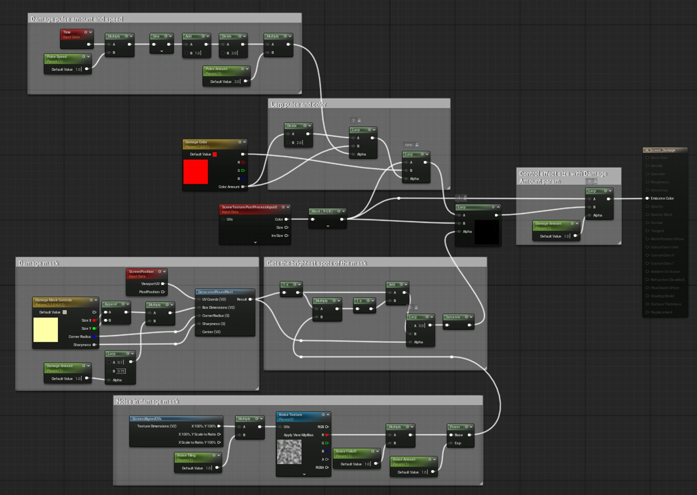

# UI上的后期处理材质

> 路径：虚幻引擎5.7文档 / 入门指南 / 虚幻引擎新用户指南 / 解谜冒险游戏美术创作指南 / UI上的后期处理材质

> 原始页面：https://dev.epicgames.com/documentation/unreal-engine/artist-06-post-process-materials-on-the-ui-in-unreal-engine

到目前为止，你一直在使用后期处理体积来调整预先存在的设置，以控制场景的整体视觉效果。 要添加自定义后期处理效果，你可以创建一个**后期处理材质**。 材质随后可以将该效果应用到摄像机，或添加到Post Process Volume中，从而影响玩家在屏幕上看到的画面。

在本系列教程的这一部分，你将添加一个效果，用于在玩家受到伤害时，在屏幕上直观地表现受伤状态。 屏幕边缘会呈现出红色的脉动效果。 随着玩家生命值降低，效果会增强并占据更多屏幕空间。

要实现此功能，你需要：

- 构建一个父级后期处理材质。
- 创建一个材质实例，用于控制父材质中的各个参数。
- 使用蓝图可视化脚本显示并控制屏幕效果。
- 修改玩家角色的蓝图逻辑，使其在一段时间后恢复生命值，从而使受伤视觉效果消失。

## 开始之前

请确保你已理解[《解谜冒险游戏美术创作指南》](../index.md)教程系列的前几节中涵盖的相关内容：

- 构建材质和材质实例。
- 将后期处理体积添加到关卡中。

你将在[示例项目文件](../artist-01-project-setup-and-content-import/index.md)中使用以下资产：

- `BP_AdventureCharacter`蓝图

## 创建用于显示伤害效果的材质

首先，你需要制作一个材质，作为定义效果外观的基础。 材质会生成一个灰度遮罩，使游戏内摄像视角显示在遮罩的较亮区域，而脉动的红色伤害效果出现在遮罩的较暗区域。

要创建新的后期处理材质，请执行以下操作：

1. 在**内容浏览器**中，转到**AdventureGame > Artist > Materials**文件夹。
2. 在**Materials**文件夹中，创建一个新的**Material**资源，命名为`M_Screen_Damage`。 打开这个材质。
3. 在**细节**面板中，将材质的**Domain**更改为**Post Process**。

   你会注意到这改变了材质根节点上可用的引脚。 对于后期处理材质，你只需要控制自发光颜色，因为这些材质不使用场景光照。

在**Surface**类型的材质中，自发光颜色会控制材质发出的光量。 当你将材质的**Domain**更改为**Post Process**时，它将不再为表面着色，而是直接写入屏幕。 在这种情况下，自发光颜色控制每个像素的最终输出颜色。

### 定义伤害效果形状

现在，你将开始构建材质图，从定义后期处理效果形状的遮罩开始。 首先，使用**GeneratedRoundRectNode**绘制一个灰度遮罩，其形状为圆角矩形——内部为白色，外部为黑色。 稍后，你将定义遮罩各部分显示的内容。

你将在本节教程中添加这组表达式。

要创建灰度遮罩，请执行以下操作：

1. 在材质图表中，在材质根节点左侧添加一个**GeneratedRoundRect**节点。

   > [!TIP]
   > 如果你将其连接到材质根节点，可以在预览窗口中看到节点输出的示例。
2. 添加一个ScreenPosition节点。
3. 将**ScreenPosition**节点的**ViewportUV**输出连接到**GeneratedRoundRect**节点的**UVCoords (V2)**输入。

   **ViewportUV**输出会让**GeneratedRoundRect**节点在与视口屏幕坐标相同的空间中绘制遮罩。

要使用向量参数控制遮罩形状，请执行以下操作：

1. 添加一个**Constant4Vector**节点。 你可以使用这个节点来创建一个颜色值，也可以更广泛地将它作为一组参数，用于控制**GeneratedRoundRect**遮罩的大小和形状。

   > [!NOTE]
   > 按住键盘上的**4**，然后在图表中单击以添加该节点。
2. 右键单击向量节点并选择**Convert to Parameter**以将常量转换为向量参数。 将其命名为`Damage Mask Controls`。

   > [!NOTE]
   > 使用向量参数时，你可以像使用单值Constant（或Scalar Parameter）节点一样使用每个通道的值，使图表更加高效和整洁。 默认情况下，这些值带有RGBA颜色通道标签，但你可以在节点的**细节**面板中重命名，使这些值表示任何你想要的含义。
3. 在**细节**面板中，展开**Parameter Customization**分类下的**Channel Names**，为向量参数节点中的每个颜色通道分配名称。 你将为这些通道命名以对应**GeneratedRoundRect**节点的输入：

   - **R** = `Size X`
   - **G**= `Size Y`
   - **B**= `Corner Radius`
   - **A**= `Sharpness`

   |  |  |
   | --- | --- |
   |  |  |
   | **细节**面板中的参数通道名称 | 使用重命名通道名称的**Damage Mask Controls** |
4. 在**Material Expression Vector Parameter**分类中，展开**Default Value**，为每个通道设置以下默认值：

   - **Size X** = 1
   - **Size Y** = 1
   - **Corner Radius**= 0.4
   - **Sharpness**= 0.2
5. 在材质图表中，从常量向量节点的**Size X**引脚拖出，创建一个**AppendVector**节点。
6. 将**Size Y**引脚连接到**Append**节点的**B**输入。
7. 将**Append**节点的输出引脚连接到**GeneratedRoundRect**节点上的**Box Dimensions**引脚。
8. 连接**Damage Mask Controls**节点和**GeneratedRoundRect**节点上的**Corner Radius**和**Sharpness**引脚。
9. 为这些节点添加一个注释框，并标注为`Damage Mask Falloff`。

> [!NOTE]
> 在**GeneratedRoundRectNode**中，**UV Coords**定义了材质绘制矩形的位置，而**Box Dimensions**定义了矩形在该空间内的大小。 当**Box Dimensions**设置为（1, 1）时，矩形（白色区域）会占据大部分屏幕空间；设置为（0.5, 0.5）时，矩形会占据屏幕宽度和高度的一半。

要查看矩形遮罩，请执行以下操作：

1. 将**GeneratedRoundRect**节点连接到材质根节点的**Emissive Color**输入。
2. 选择**Damage Mask Controls**节点，尝试不同的**Size**、**Corner Radius**和**Sharpness**值，观察它们对矩形产生的效果。
3. 将数值重置为之前设置的默认值，并删除**GeneratedRoundRect**与主材质节点之间的连线。

### 在遮罩的不同部分显示视觉效果

在[扩展材质实例](../artist-04-expanded-material-instances/index.md)教程中，你使用了**线性插值（lerp）**在石头地板材质的干湿效果之间进行混合。 地板的材质**Lerp**节点曾使用时间轴作为**Alpha**输入，在两个参数值之间进行混合。 请记住，在**Lerp**节点中，**Alpha**输入控制在**A**和**B**输入之间的混合程度。 当Alpha为0时，输出为全A。 当Alpha为1时，输出为全B。

Alpha值也可以来自灰度遮罩，其中每个像素提供一个值：白色区域显示B，黑色区域显示A，灰色区域则是两者的混合。 因此，在本节中，你将使用**Lerp**节点在屏幕中央（遮罩为白色处）未被遮挡的游戏画面与屏幕边缘（遮罩为黑色处）的红色之间进行混合。

你将在本教程的这一部分添加这些表达式。

要在游戏屏幕和代表受到伤害的红色之间进行混合，请执行以下操作：

1. 在**GeneratedRoundRect**节点右侧添加一个LinearInterpolate（即**Lerp**）节点。 将鼠标悬停在节点上，点击**Toggle Comment Bubble**按钮，然后输入`1`。

   为你的Lerp节点编号有助于你跟随教程执行操作，因为该图表中使用了多个Lerp节点。 我们将这个节点称为**Lerp (1)**。

   > 动图已省略：6314d6743ae2fa3f6afab2febf5e88ef9b0bb263dc2546ab1c5b8a00b6990590
2. 将**GeneratedRoundRect Result**输出连接到**Lerp (1)**节点的**Alpha**输入。
3. 添加一个**SceneTexture**节点。
4. 在**细节**面板中，将**Scene Texture Id**更改为**PostProcessInput0**。
5. 将**SceneTexture**节点的**Color**输出连接到**Lerp (1)**节点的**B**输入。
6. 在图表中，添加一个**Constant3Vector**。 右键单击节点，选择**转换为参数**。 将该参数命名为`Damage Color`。 该参数用于控制伤害效果的颜色。
7. 点击**Default Value**旁边的色条，将颜色更改为红色（**R = 1**）。
8. 将**Damage Color**节点顶部（白色）的引脚连接到**Lerp (1)**节点的**A**输入端。 伤害颜色的顶部引脚仅输出RGB三个颜色通道。
9. 将**Lerp (1)**的输出连接到材质根节点的**Emissive Color**引脚，以在预览窗口中查看效果。 你会看到一个由Float3到Float4转换问题导致的未定义算术错误。

**Damage Color**节点的顶部引脚输出一个Float3值（三个通道：RGB），而**SceneTexture**节点的**Color**引脚输出一个Float4值（四个通道：RGBA）。 要解决此错误并使值类型匹配，你可以使用**Component Mask**，从**Scene Texture**的**Color**输出中移除**Alpha**通道，因为你只需要三个通道（RGB）来匹配。 组件遮罩是解决此类错误的常用方法。

要将**SceneTexture**节点的颜色转换为Float3值并解决错误，请执行以下操作：

1. 添加一个**ComponentMask**节点，将**SceneTexture**节点的**Color**引脚连接到**Mask**节点。
2. 将**Mask**节点的输出连接到**Lerp (1)**节点的**B**输入。
3. 点击**Mask**节点底部的箭头，查看颜色输出中每个通道的复选框。
4. 默认情况下，组件遮罩仅遮罩R和G通道。 在**B**旁添加勾选标记。 这将创建一个Float3组件遮罩，以便两个**Lerp (1)**输入使用相同的通道。

此时的图表应如下所示：

在预览视口中，材质效果应如下所示：

### 为效果添加噪点和变化

在本节中，你将通过在框架外边缘应用纹理来构建材质的噪点部分。 至此，你可以使用材质参数来指导效果的最终外观，使其与游戏中角色的伤害相关联。

> [!TIP]
> 在视觉效果中，噪点可用于添加可控的随机性。 你可以使用这种模式使材质感觉更自然、不那么完美，例如用于不平坦的表面或闪烁的灯光。

你将在本教程的这一部分添加这些表达式。

要为材质添加噪点，请执行以下操作：

1. 在图表底部，添加一个**ScreenAlignedUVs**节点。 使用**ScreenAlignedUVs**节点，你可以将纹理或效果映射到整个屏幕。 它会为整个视口或屏幕生成UV坐标。
2. 从**X 100%, Y 100%**引脚拖出并添加一个**Multiply**节点。
3. 右键单击并创建一个**Constant**节点。 右键单击它，选择**Convert to Parameter**，并将其命名为**Noise Tiling**。 将其连接到**Multiply**节点的**B**输入。
4. 在**Noise Tiling**节点中，将**Default Value**设置为`1`。
5. 从**Multiply**节点的输出引脚拖出连线，创建一个**TextureSample**节点，并将连线连接到其**UVs**输入。
6. 右键单击**TextureSample**，将其转换为参数，并将其命名为`Noise Texture`。
7. 选中**Noise Texture**节点，在**细节**面板底部的**Material Expression Texture Base**分类中，将**Noise Texture**纹理指定为`TilingNoise05`。

   > [!NOTE]
   > 该纹理是虚幻引擎自带的引擎内容的一部分。 你可以使用自己的设置，但如果没有其他选项，不妨将此默认值作为起点。 注意：如果你使用不同的纹理，其效果可能与本教程展示的结果不同。
8. 从**Noise Texture**节点的**R**通道拖出并创建一个**Multiply**节点。
9. 右键单击其**B**引脚并选择**Promote to Parameter**。 将该参数命名为`Noise Falloff`，并将其**Default Value**设置为`1`。
10. 从**Multiply**节点的输出引脚拖出并创建一个**Power**节点。
11. 右键单击**Exp**引脚并选择**Promote to Parameter**。 将参数命名为`Noise Amount`，并将其**Default Value**设置为`1`。
12. 选中你刚创建的八个节点，按**C**键为它们添加一个注释框。 将注释框标记为`Noise in Damage Mask`。

此时，你可以通过将**Power**节点直接连接到`M_Screen_Damage`材质根节点上的**Emissive Color**输入来测试这部分材质的效果。 你应该在预览窗口中看到以下内容：

测试完成后，断开材质根节点与噪点纹理逻辑的连接，并将其重新连接到**Lerp (1)**节点。 在连接所有内容之前，你将继续构建材质的其他部分。

### 为遮罩添加噪点

现在你已经创建了噪点遮罩，需要通过一个Multiply节点将它与伤害遮罩的衰减效果相融合。 这会将噪点遮罩应用到靠近屏幕中心的伤害遮罩内边缘结果上。

你将在本节教程中添加高亮显示的一组表达式节点。

要将噪点纹理添加到遮罩的黑色区域，请执行以下操作：

1. 将`M_Screen_Damage`材质根节点向右移动，以便在它与**GeneratedRoundRect**节点之间腾出空间。 删除**GeneratedRoundRect**节点和现有**Lerp (1)**节点之间的连线，因为你将在此处添加新的逻辑。
2. 右键单击图表并创建一个新的**Lerp**节点。 将鼠标悬停在节点上，点击**Toggle Comment Bubble**，并输入`2`作为注释。
3. 将**GenerateRoundRect**节点的**Result**引脚连接到**Lerp (2)**节点的**Alpha**引脚。
4. 从**GenerateRoundRect**节点的**output**拖出连线，创建一个**One Minus**节点。
5. 从**One Minus**节点拖出连线，创建一个**Add**节点，并将其输出连接到**Lerp (2)**节点的**B**引脚。
6. 从**One Minus**节点拖出，添加一个**Multiply**节点。
7. 从**Multiply**输出拖出，添加一个新的**One Minus**节点，并将其连接到**Add**节点的**B**输入端。
8. 在**Lerp (2)**之后，添加一个**Saturate**节点。 这会将输出值限制在**0-1**范围内。
9. 给该逻辑添加一个注释，标记为`Gets the Brightest Spots of the Mask`。

此时，你的材质应类似于这样：

### 连接噪点、遮罩和伤害颜色部分

要连接图表中的Noise、Damage Mask和Damage Color元素，请执行以下操作：

1. 在噪点遮罩逻辑中，从**Power**节点拖出连线，连接到伤害遮罩区域逻辑中**Multiply**节点的**B**输入。

   > [!TIP]
   > 在任意连线上使用重路由节点来理清路径，并重新整理图表。 双击一条连线可添加一个重路由节点，然后拖动它以更改连线路径。
2. 将**Saturate**节点的输出引脚连接到**Lerp (1)**节点的**Alpha**引脚。
3. **保存**和**应用**材质更改。

你可以将**Lerp (1)**节点连接到材质根节点上的**Emissive Color**输入以查看结果：

现在，你已经定义了一个矩形遮罩区域，为该遮罩应用了颜色，使用纹理创建了一个噪点遮罩，并将它们混合成当前在材质编辑器预览窗口中看到的效果。

### 为伤害效果添加脉动

在本节中，你将构建材质逻辑，这样在玩家受到更多伤害时，屏幕边缘的红色伤害指示器就会脉动。 你将使用一个**Sine**节点来驱动脉冲效果，并对正弦波进行调整，使其只使用正数值。

你将在本教程部分添加高亮显示的表达式部分。

要使红色效果随着伤害增加而脉动，请执行以下操作：

1. 在图表顶部的空白区域添加一个**Time**节点。

   > [!NOTE]
   > **Time**节点会在编辑器中输出时间流逝的数值，这对于为材质制作动画或在指定时间内改变材质效果非常有帮助。
2. 从它的引脚拖出并添加一个**Multiply**节点。
3. 创建一个**Constant**节点，将其转换为参数，并命名为**Pulse Speed**。 在该节点中，将其**Default Value**设置为`0.5`。
4. 将**Pulse Speed**连接到**Multiply**节点的**B**输入端。
5. 从**Multiply**节点拖出并添加一个**Sine**节点。

   **Sine**节点会将不断增加的**Time**值转换为一个在-1到1之间平滑振荡的循环波形数值。
6. 从**Sine**节点的输出引脚拖出连线，并添加一个**Add**节点。 确保其**B**输入值设置为**1.0**。
7. 从**Add**节点拖出连线，添加一个**Divide**节点。 确保其**B**输入值为**2.0**。

   设置**Add** 1再**Divide** 2，将正弦波更改为从1到0变化，而不是在1和-1之间变化。 这样可以防止**Sine**节点对纹理数值进行反转，避免画面从红色闪烁变成浅蓝色（红色的反相颜色）。
8. 从**Divide**节点拖出并添加一个**Multiply**节点。
9. 从其**B**输入拖出并创建一个**Constant**。 将其转换为参数并将其命名为`Pulse Amount`。 将其**Default Value**设置为`1`。
10. 选择该图表部分中的节点，按**C**键添加一个注释框。 将其标记为`Damage Pulse Amount and Speed`。

你的材质现在包含了构成此后期处理材质伤害效果的所有主要元素。 此时，你的图表应该与下图类似：

### 连接脉冲逻辑

现在你已经设置了脉冲逻辑，接下来将其集成到场景纹理的伤害颜色应用中。 然后，你可以调整遮罩脉动时的强度。

你将在本教程部分添加高亮显示的表达式部分。

你将基于**Damage Pulse Amount and Speed**部分添加表达式，将脉动逻辑连接到图表中的Damage Color和Scene Texture部分。

> [!NOTE]
> 在本节操作过程中，你将断开之前设置的一些元素，并整合新的连接关系。 在难以追踪重叠的连线时，可以拖动节点来腾出空间。

要将脉冲逻辑连接到伤害颜色，请执行以下操作：

1. 在图表中右键单击，在**Damage Color**节点和脉冲逻辑附近创建一个新的**Lerp**节点。 将该节点标记为`3`。
2. 在脉冲逻辑的末端，将**Multiply**节点的**output**连接到**Lerp (3)**的**Alpha**引脚。

   在**Lerp (3)**节点中，**Alpha**用于控制应用到遮罩上的脉冲强度，以及脉冲发生的频率。
3. 删除**Lerp (1)** 节点**A**输入端连接的**Damage Color**连线，并将其连接到新建的**Lerp (3)**节点的**B**输入端。
4. 选择Damage Color节点。 在细节面板的**Parameter Customization**下，展开Channel Names，使用文本字段将A通道名称更改为`Color Amount`。
5. 在**Material Expressions Vector Parameter**类别中，在**Default Value**下，将**Color Amount**值设置为`2`。
6. 在**Damage Color**节点上，从**Color Amount**引脚拖出，添加一个**Divide**节点，并将其输出连接到**Lerp (3)**的**A**输入。
7. 在**Lerp (3)**和脉冲逻辑附近创建一个新的**Lerp**节点。 用`4`为其添加标签。
8. 将**Lerp (3)**节点的输出连接到**Lerp (4)**的**Alpha**输入。
9. 将**Damage Color**节点的**RGB**（白色）引脚连接到**Lerp (4)**的**B**输入。
10. 返回到连接至**SceneTexture**节点的**Mask (RGB)**节点。 将**Mask**节点的输出连接到**Lerp (4)**的**A**输入。 组件遮罩节点现在分别连接到**Lerp (1)**的**B**输入，以及**Lerp (4)**的**A**输入。
11. 将**Lerp (4)**的输出连接到**Lerp (1)**的**A**输入。
12. 拖动选择**Lerp (3)**和**Lerp (4)**节点。 按**C**为它们创建一个注释框，并标注为`Lerp Pulse and Color`。
13. 点击**保存**和**应用**。

图表中新增加的这个部分应该如下图所示：

你可以将**Lerp (3)**连接到材质根节点的**Emissive Color**输入端口，以在材质预览窗口中查看伤害效果：

> 动图已省略：66

> [!NOTE]
> 在上面的示例中，**Damage Color**节点的**Color Amount**值被调高到5.0，以便在预览窗口中清晰地看到效果。

在图表中，更改**Pulse Speed**和**Pulse Amount**的值，观察它们如何改变效果的大小以及效果应用的速度。 **脉冲强度**必须在0到1之间。 在后续步骤中，你可以在材质实例中控制这两个参数。

### 使用Damage Amount参数控制效果

你需要在材质图表中添加的最后一个内容是名为**Damage Amount**的新参数，它会根据玩家在游戏中受到的伤害程度来控制效果的大小。

该参数将在角色的蓝图中进行设置：当玩家受到伤害时，该参数会控制屏幕边缘显示的脉冲伤害效果强度。 玩家受到的伤害越多，该材质在玩家屏幕上的效果就越强。

要添加一个在运行时控制效果大小的参数，请执行以下操作：

1. 在你现有的材质逻辑和`M_Screen_Damage`材质根节点之间添加一些空间。 右键单击图表并添加一个**Lerp**节点。 将该**Lerp**节点标记为`5`。
2. 将**Mask (RGB)**节点的输出连接到**Lerp (5)**节点的**A**引脚。
3. 将**Lerp (1)**节点的输出连接到**Lerp (5)**的**B**输入。
4. 在**Lerp (5)**上，右键点击**Alpha**引脚，选择**Promote to Parameter**，将参数命名为**Damage Amount**，并将默认值改为`1`。

   > [!TIP]
   > 准确地为该参数命名，并确保它有默认值；当玩家受伤或恢复生命时，玩家角色蓝图将使用此参数控制该材质在屏幕上显示的程度。
5. 将**Lerp (5)**节点的输出连接到根节点的**Emissive Color**输入。

**Damage Amount**值使用一个介于0（无伤害，效果关闭）和1（最大伤害，效果开启）之间的数值。

这是你将在预览窗口中看到的结果：

> 动图已省略：7018edbb6136a601c6e07b409b1b1bc49934c48af59002b7bf70599a714cadc4

> [!NOTE]
> 在这里的示例中，**Damage Color**节点的**Color Amount**值被调高到5.0，以便在预览窗口中清晰地看到效果。

接下来，你将添加一组新的节点，使用**Damage Amount**作为输入来影响**GeneratedRoundRect**遮罩的大小。 此添加使伤害效果随着玩家受到更多伤害而向屏幕中心向内脉动，并随着玩家生命值恢复而退缩。

要让**Damage Amount**影响伤害遮罩的大小和强度，请执行以下操作：

1. 在材质图表中，前往**Damage Mask Falloff**部分。 删除**Append**节点和**GeneratedRoundRect**节点之间的连线。
2. 从**Append**节点拖出并添加一个**Multiply**节点。
3. 将**Multiply**节点的输出连接到**GeneratedRoundRect**节点的**Box Dimensions**输入。
4. 在**Multiply**节点上，从输入**B**拖出连线并添加一个**Lerp**节点。 将**Lerp**节点标记为`6`。
5. 在**Lerp (6)**节点上，保持**A**值为**0**，并将**B**值设置为`0.75`。
6. 右键单击**Lerp (6)**节点的**Alpha**，选择**提升为参数**。 将该节点命名为**Damage Amount**，以同另一个**Damage Amount**节点保持一致。 你也可以复制并粘贴原始的**Damage Amount**节点。
7. 点击**应用**和**保存**。

这是你将在预览窗口中看到的结果：

> 动图已省略：79df05ee1cdad268ead683dbff3635c97d334629aa863d62effef32cb99aed05

> [!NOTE]
> 在这里的示例中，**Damage Color**节点的**Color Amount**值被调高到5.0，以便在预览窗口中清晰地看到效果。

当所有内容构建完成后，你的`M_Screen_Damage`材质图表应如下所示：

Blueprint

4

Lerp

A

B

Alpha

MaterialFunction

UV Coords (V2)

Box Dimensions (V2)

Corner Radius (S)

Sharpness (S)

Center (V2)

Result

ScreenPosition

Viewport UV

Pixel Position

Fullscreen

Reset

Graph

Zoom 1:1

Renderer by

Rancoud

Material

INIT INTERACTIONS...

> [!NOTE]
> 要将此代码片段复制到你的项目中，请删除材质图中所有现有节点，点击**Copy Full Snippet**，然后在你的材质中按**Ctrl + V**进行粘贴。 然后，将**Lerp (5)**节点连接到主材质节点的**Emissive Color**引脚。

## 创建材质实例以控制效果

现在你已经有了材质，创建一个材质实例来控制你在材质中创建的所有参数。 你将使用材质实例中公开的参数来定义屏幕上的伤害效果的最终外观和表现。

要设置材质实例以控制材质参数，请执行以下操作：

1. 在**内容浏览器**中，在你的**Artist > Materials**文件夹里，右键单击材质`M_Screen_Damage`，然后从上下文菜单中选择**Create Material Instance**。
2. 将资产命名为`MI_Screen_Damage`并打开它。
3. 为了让材质预览实时运行，并查看参数变化对材质的影响，点击视口上方的黄色秒表按钮两次。
4. 在**细节**面板中，展开**Parameter Groups**下的各个部分，查看你在材质中公开的所有参数。 展开向量参数（例如**Damage Mask Controls**），即可查看各个独立通道的参数数值。
5. 为除**Noise Texture**之外的所有参数勾选复选框，使其可以被重载。

   > [!TIP]
   > 在更改参数值后取消选中该参数，使用父材质中设置的原始默认值。
6. 在编辑材质实例时，可以尝试调整不同的参数，观察它们在预览窗口中对伤害效果的影响。 尝试不同的**Pulse Amount**、**Noise Falloff**、**Pulse Speed**以及**Damage Mask Controls**（向量参数）数值，观察它们如何改变效果。
7. **伤害量**的默认值设置为1，因此你可以在预览窗口中看到材质发生的变化。 不过，请将该值改为`0`，这样在游戏开始时，该效果就不会立即出现在屏幕上，而是在玩家受到伤害后才显示。 在下一节中，你将让玩家角色蓝图控制该值。
8. **保存**该材质实例。

> [!TIP]
> 稍后，当你能够在游戏中测试效果时，可以返回材质实例，重复这些步骤来调整效果。

### 在材质实例中设置参数值

本教程示例关卡使用了以下参数值。 你可以使用这些值，或根据项目需要进行调整。

|  |  |  |
| --- | --- | --- |
| 参数 | 默认值 | 建议值 |
| **全局标量参数值** |  |  |
| 伤害量 | 0 | 0 |
| 噪点强度 | 1.0 | 0.35 |
| 噪点衰减 | 1.0 | 0.75 |
| 噪点平铺 | 1.0 | 1.1 |
| 脉冲强度 | 1.0 | 0.75 |
| 脉冲速度 | 0.5 | 0.65 |
| **全局纹理参数值** |  |  |
| 噪点纹理 | TilingNoise05 | TilingNoise05 |
| **全局向量参数值** |  |  |
| 伤害颜色 | Hex sRGB: FF0000FF | Hex sRGB: FF0000FF |
| 伤害颜色：颜色强度 | 2.0 | 5.0 |
| 伤害遮罩控制：Size X | 1.0 | 0.75 |
| 伤害遮罩控制：Size Y | 1.0 | 0.5 |
| 伤害遮罩控制：Corner Radius | 0.4 | 2.0 |
| 伤害遮罩控制：Sharpness | 0.2 | 2.1 |

### [可选]整理并限制参数值

为了使材质实例的参数值更易于浏览和使用，并减少极端值的出现，你可以将参数分组，并应用值范围，将数值滑块保持在可接受或预期的值范围内。

例如，**Damage Amount**用于映射玩家的生命值状态：0表示屏幕无伤害效果，1表示屏幕满伤害效果。因此，为该参数设置一个0到1范围的滑动条是合理的，因为它不可能超出这个范围。

在父材质中，选中每一个已命名的参数，并在**细节**面板中为它们分别设置**Group**、**Slider Min**和**Slider Max**范围，如下所示：

|  |  |  |  |
| --- | --- | --- | --- |
| 参数 | 组 | 滑条最小值 | 滑条最大值 |
| 伤害量 | 伤害（Damage） | 0 | 1 |
| 脉冲强度 | 脉冲 | 0 | 1 |
| 脉冲速度 | 脉冲 | 0 | 2 |
| 伤害颜色：颜色强度 | 脉冲 | 不适用 | 不适用 |
| 噪点平铺 | 噪点 | -1 | 2 |
| 噪点衰减 | 噪点 | 1 | 5 |
| 噪点强度 | 噪点 | 0.5 | 3 |
| 伤害遮罩控制 | 噪点 | 不适用 | 不适用 |
| 噪点纹理 | 噪点 | 不适用 | 不适用 |

在材质实例中，你可以在参数列表中看到此更改对该值的影响。 参数根据其分组被整理到新的类别中。 你可以在最小值和最大值之间拖动滑块，而不会超出这个范围。不过，你也可以通过手动输入新数值来重载滑块的限制。

## 将后期处理材质添加到角色蓝图

现在，你已经设置并实例化了后期处理材质。 接下来，你将设置角色蓝图，以创建并使用一个**Dynamic Material Instance**（也称为Material Instance Dynamic，简称MID）。 这将使用`MI_Screen_Damage`材质实例在蓝图中读取名为Damage Amount的参数。 使用你在蓝图图表中设置的逻辑，你可以在游戏过程中将值注入到材质实例的Damage Amount参数中，从而根据游戏中发生的情况实时调整材质效果。

角色拥有一个Health变量，在受到伤害时会发生变化。 你将结合使用该变量与材质实例，在角色受到更多伤害时，将该效果应用到屏幕上，并在生命值恢复时移除该效果。

### 创建动态材质实例并将其添加到后期处理中

你的材质实例是无法在运行时直接修改的资产。 不过，你将在角色蓝图中创建一个**动态材质实例**。 动态材质实例是在游戏运行时创建的材质实例版本，你可以在游戏运行过程中通过其命名参数进行修改。 然后，你将把MID分配给玩家的摄像机，以便在玩家受到伤害时让它显示在屏幕上。

要在变量中创建并保存该材质实例，请执行以下操作：

1. 在**内容浏览器**中，进入**Content > AdventureGame > Designer > Blueprints > Characters**，并打开`BP_AdventureCharacter`蓝图。
2. 在事件图表中，找到以**Event BeginPlay**节点开头的逻辑组。 将该逻辑组拖动到图表中更空旷的区域，以便为后续添加更多节点预留空间。

   > [!NOTE]
   > 要在图表中查找事件节点，请在My Blueprint面板中展开**EventGraph**列表，然后双击**Event BeginPlay**。 图表视图聚焦在该节点上。
3. 在**Set Default Movement Speed**节点之后，从执行（**exec**）引脚拖出，添加一个**Create Dynamic Material Instance**节点。
4. 在该**Create Dynamic Material Instance**节点上，将Parent设置为`MI_ScreenDamage`。 这是你之前创建的材质实例，用于控制屏幕上的伤害效果。
5. 右键单击节点的**Return Value**引脚并选择**提升为变量**。
6. 在**My Blueprint**面板的**Variables**列表中，将**NewVar**重命名为`MID Damage`。

现在，**Create Dynamic Material Instance**节点会创建`MI_Screen_Damage`的运行时版本，并将其保存到新变量中，使其可以在图表的其他位置引用。

要将材质实例分配给摄像机的后期处理通道，请执行以下操作：

1. 在**组件**面板中，将**FirstPersonCamera**组件拖到图表中。 这会创建一个对玩家摄像机的引用。
2. 从其输出端拖出并创建一个**Set Post Process Settings**节点。
3. 连接两个**Set**节点的**exec**引脚。
4. 从Set Post Process Settings节点的Post Process Settings输入端拖出，添加一个Make Post Process Settings节点。
5. 选择Make Post Process Settings节点。 在Detail面板的Rendering Features分类中，勾选Post Process Materials，以便将该引脚添加到Make Post Process Settings节点。
6. 在节点中，右键单击**Post Process Materials**输入引脚并选择**Split Struct Pin**。 该引脚现在接收一个数组作为输入。
7. 从**Post Process Materials Array**引脚拖出，添加一个**Make Array**节点。
8. 从**Make Array**节点的**[0]**输入拖出，添加一个**Make Weighted Blendable**节点。
9. 在**Make Weighted Blendable**节点上，将**Weight**更改为`1`。
10. 从**Set MID Damage**节点的输出（蓝色）引脚拖出连线，连接到**Make Weighted Blendable**节点**Object**输入。

    > [!NOTE]
    > **Set**节点的输出引脚会返回该变量的引用。
11. 选中你在图表中添加的节点，按**C**键为它们创建一个注释框。 为其添加标签：`Create Dynamic Material Instance for Post-Process Effect and assign to Player Camera`。
12. **编译**并**保存**此蓝图。

此逻辑会在游戏开始时创建动态材质实例，并将其应用到该蓝图的第一人称摄像机上。

玩家**Event BeginPlay**逻辑新增的部分如下所示：

以下是一段上面高亮部分的代码片段，你可以将它复制到事件图表中，而无需自己构建逻辑：

Blueprint

Create Dynamic Material Instance

Parent

MI_Screen_Damage

Optional Name

None

Creation Flags

None

Return Value

SET

MID Damage

First Person Camera

Fullscreen

Reset

Graph

Zoom 1:1

Renderer by

Rancoud

blueprint

INIT INTERACTIONS...

要将此代码片段复制到你的项目中，点击Copy Full Snippet，按Ctrl + V将其粘贴到BP_AdventureCharacter的事件图表中，然后将Set Default Movement Speed节点的exec引脚连接到Create Dynamic Material Instance节点。

### 在游戏中测试效果

在材质实例（`MI_Screen_Damage`）中，临时将**Damage Amount**更改为`1`，然后单击**Save**。 运行游戏后，你可以在角色未受到伤害的情况下测试该效果，以便调整到理想的视觉表现。 当**Damage Amount**设置为`1`时，材质将持续开启。 当你完成材质测试后，将**Damage Amount**重置为`0`。

> 动图已省略：3d5ecfba52c680bda77c5814ced90cc2e25e7905263282f1fb7f3b5ded4836ed

这是你将Damage Amount设置为1以持续显示效果（即使玩家未受伤）时的游戏内效果。

接下来，你将向角色蓝图添加逻辑，使该动态材质实例在角色受到伤害时出现，并在生命值恢复时逐渐减弱。

## 根据受到的伤害显示或隐藏效果

为了让动态材质实例效果仅在玩家受伤时出现，你需要在玩家角色中扩展现有的伤害处理逻辑。

这个新的逻辑需要实现以下功能：

1. 根据角色的**Health**变量调整材质的**Damage Amount**参数，使其满足以下逻辑：

   - 当**Health**为满值时，屏幕上不会出现后期处理效果。
   - 当Health减少时，屏幕上的后期处理效果会逐渐增强。
2. 当玩家在一段时间内未再受到伤害时，将**Health**恢复为满值，并移除后期处理效果。

### 创建Maximum Health变量

你将使用玩家的生命值，因此最好将玩家的最大生命值保存在一个变量中，以便在整个伤害效果逻辑中引用，而不是直接输入静态的硬编码值100。 这样，如果你决定调整角色的初始生命值（无论增加还是减少），你的蓝图逻辑仍然能够正常运行。

要创建一个用于存储玩家最大生命值的变量，请执行以下操作：

1. 在`BP_AdventureCharacter`中，在**My Blueprint**面板的**Variables**部分，点击**+**添加一个新变量。
2. 将其命名为`MaxHealth`，并将类型更改为**Float**。 编译此蓝图。
3. 在事件图表中，关注上一节中处理的**Event BeginPlay**逻辑组中的**Event BeginPlay**和**Set Default Movement Speed**节点。
4. 从**Event BeginPlay**拖出并添加一个**Set MaxHealth**节点。
5. 从**Variables**列表中，将**Health**变量拖到新的**Set**节点的**Max Health**引脚上。

现在，当游戏开始时，**Health**的默认值（100）会被保存到**MaxHealth**。 随着玩家游戏过程中**Health**的变化，**MaxHealth**保持不变，保证玩家的最大血量不受影响。

### 将当前玩家生命值连接到材质

首先，你将扩展玩家的伤害处理逻辑，使用**伤害量（Damage Amount）**参数来控制动态材质实例，这样当玩家生命值降低时，屏幕上的效果强度便会随之增强。

要随着玩家生命值损失而放大**伤害量**，请执行以下操作：

1. 在角色蓝图中，前往事件图表左下角标记为**(DT) 伤害与失败处理**的逻辑组。 你将要在**Set Health**和**Branch**节点之间添加新的逻辑，因此请在这两个节点之间预留一些空间。
2. 在**Variables**列表中，将**MID Damage**变量拖到图表上，并选择**Get MID Damage**。
3. 从**Get MID Damage**节点的输出引脚拖出连线，在列表中选择**Set Scalar Parameter Value**。
4. 将**Set Health**连接到**Set Scalar Parameter Value**，然后再连接到**Branch**节点。
5. 在**Set Scalar Parameter Value**节点中，将**Parameter Name**设置为`Damage Amount`。 这是控制屏幕上效果大小和强度的材质参数。

   > [!WARNING]
   > 此名称必须与材质`M_Screen_Damage`中的相应参数匹配，效果才能生效。
6. 在**Set Scalar Parameter Value**节点上，从**Value**输入引脚拖出并创建一个**Lerp**节点。
7. 在**Lerp**节点上，将**A**设置为`1.0`，将B设置为`0`。 这样会重新映射数值，这样在受到伤害时，角色的生命值就会从最大值（100）递减到0，而不是反过来。
8. 在**Lerp**节点上，从**Alpha**输入引脚拖出连线，创建一个**Divide**节点。
9. 在**Variables**列表中，将角色的**Health**变量拖到**Divide**节点的顶端输入端口。
10. 将角色的**MaxHealth**变量拖到**Divide**节点的下方输入端。

**Divide**节点将玩家的生命值转换为0到1之间的数值，其中1代表满血（无伤害）。 但是，**Damage Amount**的值应该随着玩家生命值的减少而增加，而不是减少。 Lerp节点会反转数值范围。 例如，如果**Health**为 25，**Lerp**会向**Set Scalar Parameter Value**节点返回0.75，这会产生达到最大强度75%的效果。

现在，图表中的**(DT) 伤害与失败处理部分**应类似如下所示：

### 添加重置延迟以恢复生命值

为了让玩家的**Health**（或HP）恢复到满值并使伤害效果消失，应让玩家角色在短时间内停止受到伤害。 你将使用一个**Retrigerable Delay**节点来实现一个5秒的延迟，只有延迟完成后，**Health**才会恢复。这种延迟节点可以用于重置冷却时间：它会等待设定的时间结束后再执行下一个节点；如果在时间结束前再次被触发，它会重新开始倒计时。

要在移除伤害效果之前添加一个延迟，请执行以下操作：

1. 在**Branch**节点下，从**Fn Set HP**节点的**exec**引脚拖出，添加一个**Sequence**节点。 你将使用它来添加一系列在玩家受到伤害（但尚未死亡）之后执行的操作。
2. 从**Then 0**路径拖出并添加一个**Retriggerable Delay**节点。 在延迟节点中，将**Duration**设置为`5`秒。
3. 最佳做法是在延迟后检查玩家是否还活着：

   1. 从**Retriggerable Delay**拖出并添加一个**Branch**节点。
   2. 在**Branch**节点上，从**Condition**引脚拖出，添加一个**Greater (>)**节点。
   3. 在**Variables**面板中，将**Health**变量拖到**Greater (>)**节点的上方输入引脚。

现在，每当玩家受到伤害且未被淘汰（生命值不为0）时，时间延迟都会从0重新开始。 接下来，你将设置延迟完成后应执行的逻辑。

此时，你的蓝图图表应该与下图类似：

### 使用时间轴混合玩家生命值

在图表的这个部分中，你将添加一个时间轴，用于在短时间内逐渐恢复玩家的Health。 时间轴节点的控件定义了它如何开始、停止，以及在轨道时间内的行为。

要设置一个持续五秒的时间轴，请执行以下操作：

1. 在图表的**Sequence**节点的**Then 0**逻辑下方，右键单击图表，在节点操作列表中搜索`add timeline`，然后选择**Add Timeline**。 将时间轴节点命名为`Damage Blend`。
2. 双击**Damage Blend**节点，在蓝图中将它打开为单独的选项卡。
3. 在此选项卡中，单击**+ 轨道 > 添加浮点轨道**以向时间轴添加一个新轨道。
4. 将轨道命名为**Blend**。 该轨道标签也会作为一个输出引脚出现在 伤害混合时间轴节点。
5. 在**+ Track**按钮旁，确保**Length**设置为**5**秒。
6. 在**Blend**曲线中，右键单击并选择**Add key to CurveFloat_0**。 重复此操作以添加另一个关键帧——总共需要两个。
7. 点击第一个关键帧，将其数值设置为：**Time**= **0**，**Value** = **0**。
8. 点击第二个关键帧，将其值更改为**Time** = **5**和**Value** = **1**。
9. 右键点击第一个关键帧，选择**Auto**。 这会将混合方法从线性混合改为在0到1之间进行平滑过渡。
10. 使用蓝图选项卡，切换回包含**Damage Blend Timeline**节点的Event Graph。
11. 在**Sequence**节点上，将**Then 1**执行引脚连接到 Damage Blend节点的**Stop**引脚。
12. 在延迟后的**Branch**节点中，从**True**引脚拖出，并连接到Damage Blend节点的**Play from Start**输入端。

现在，此时间轴节点输出一个在五秒内从0到1变化的值。 当**Retriggerable Delay**完成时，时间轴就会开始播放。 当时间轴轨道逻辑完成时，程序会顺着**Then 1**这条线继续往下执行，并且停止时间轴的更新。

### 恢复玩家生命值并移除后期处理材质

现在你已经设置好了时间轴，接下来将构建逻辑，使用这个五秒的轨道将玩家的Health变量混合回其初始满值，并将材质的**Damage Amount**降低回 0。

要使用时间轴逐步恢复玩家生命值，请执行以下操作：

1. 在**Damage Blend Timeline**节点之后，创建一个**Lerp**节点。 将时间轴的**Blend**输出引脚连接到**Lerp**节点的**Alpha**输入引脚。
2. 在**Lerp**节点上，从**B**输入拖出连线，添加一个对**MaxHealth**的引用。
3. 在**Variables**列表中，将**Health**变量拖放到**Lerp**节点的**A**输入上。
4. 从**Lerp**节点的**Return Value**引脚拖出连线，添加一个**Set Health**节点（在节点操作列表的**Variables** > **Default**下）。
5. 从时间轴的**Update**引脚拖出并连接到**Set Health**节点的**exec**引脚。

   现在，**Lerp**节点在五秒内（时间轴的长度）将玩家的当前**Health**值混合到他们在游戏开始时拥有的最大生命值（在此例中为100）。
6. 返回到事件图表中包含你在**Branch**节点之前创建的**Set Scalar Parameter Value**节点的部分。 框选**Set Scalar Parameter Value**、**MID Damage**、**Lerp**、**Divide**和**Health**节点，然后按**Ctrl+C**进行复制。
7. 在事件图表中，返回到**Damage Blend**时间轴，然后按**Ctrl+V**粘贴节点。
8. 将**Set Health**节点的**exec**引脚连接到**Set Scalar Parameter Value**的**exec**引脚。

现在，随着玩家的**Health**变量恢复到满值，**Damage Amount**会相应地降回0。

此时，你的图表应该与下图类似：

### 在HUD上显示更新的生命值

当**Health**变量逐渐恢复到100时，玩家UI上显示的值会带有两位小数。 为了从HUD中移除这种视觉噪点，你需要添加去除小数位的逻辑，仅以整数形式显示**Health**。

这是一个示例，展示了使用截断（Truncate）去除小数位的差异。

> 动图已省略：ccfc3298ee67617276206321ee8cd7898eb1817f8e97d9c80f3a6381b8e8d8cb

为了确保在HUD上显示的玩家**Health**为整数，请执行以下操作：

1. 转到在你创建的**Sequence**节点之前执行的**Fn Set HP**节点。 选择**Fn Set HP**节点及其输入（**HUD**和**Health**），按**Ctrl + C**进行复制。
2. 在时间轴逻辑末尾的**Set Scalar Parameter Value**节点之后，按**Ctrl + V**粘贴这三个节点。
3. 连接**Set Scalar Parameter Value**节点和**Fn Set HP**节点的**exec**引脚。
4. 将**Fn Set HP**节点向右拖动，以便腾出一些空间。
5. 删除**Health**变量和**Fn Set HP**节点上的**New HP**输入之间的连线。
6. 从**Health**变量拖出连线，添加一个**Truncate**节点。 这会将浮点值转换为整数，移除小数部分。
7. 从**Truncate**节点拖出，并将其连接到**Fn Set HP**节点的**New HP**输入端。 虚幻引擎会自动添加一个整数到浮点的转换节点。
8. **编译**并**保存**此蓝图。

现在，包含所有新增内容后的完整蓝图应如下所示：

## 测试最终效果

现在当你进行游戏并受到伤害时，你应该会看到后期处理伤害效果出现，并随着你承受更多伤害而增强。

你可以返回材质实例，调整参数值，以获得最终想要的效果。 以下示例展示了被放大的伤害效果。

## 下一步

在下一节中，你将学习通过在低洼区域添加更浓的雾气、在天空中加入暴风云层，来增强关卡的氛围效果。

- [调整环境光照功能](../07-adjust-environment-lighting-features/index.md) - 学习如何通过在低洼区域添加更浓密的雾气，以及在天空中加入风暴云，增强关卡的氛围效果。
