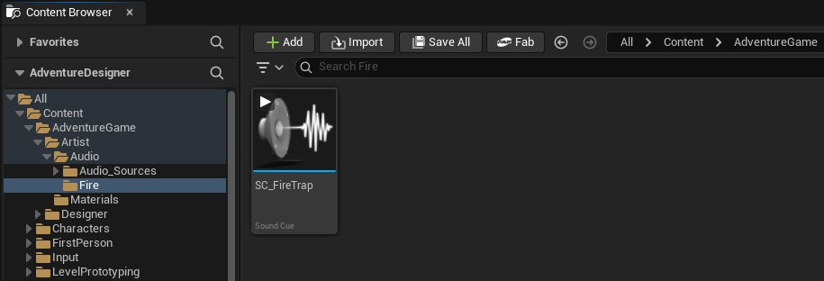
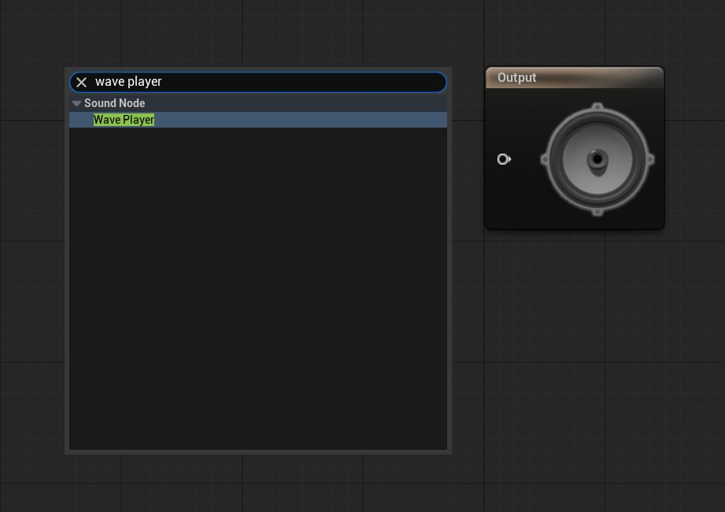

# 为火焰陷阱添加音效

> 路径：虚幻引擎5.7文档 / 入门指南 / 虚幻引擎新用户指南 / 解谜冒险游戏美术创作指南 / 为火焰陷阱添加音效

> 原始页面：https://dev.epicgames.com/documentation/unreal-engine/artist-09-adding-sounds-to-fire-traps-artist-track-unreal-engine

在本教程中，你将为关卡中的火焰陷阱添加一个音效。 你将创建一个**Sound Cue**资产，用来选择要播放的音频文件，该音频文件已随项目文件提供。

接下来，你将创建一个**声音衰减**资产，以调整玩家听到声音的方式。 该资产包含多种设置，例如：衰减内半径、衰减距离，以及声音是否在3D空间中进行空间化。

最后，你需要更新火焰特效的蓝图，为其添加**Audio**组件，并根据火焰是否激活来启动或停止音效。

## 开始之前

请确保你已掌握[虚幻引擎新用户指南](../../index.md)文档中涵盖的以下内容：

- 蓝图基础知识，例如如何添加和连接节点。

你将在[设置项目与导入内容](../artist-01-project-setup-and-content-import/index.md)中使用以下资产：

- **S_Fire**声波文件
- **BP_TrapFire**蓝图

## 创建Sound Cue

首先，你将创建一个**Sound Cue**，这是一种基于节点的音频资产。

**Sound Cue**是一种音频资产，它可以包含一个或多个音频文件的引用，并定义音频在图表中流动时如何被处理和控制。 这与蓝图为游戏对象添加功能和逻辑的方式类似。 **Sound Cue编辑器**提供了一系列**声音节点**类型，你可以使用它们来控制音效。

要创建Sound Cue资产，请执行以下操作：

1. 在**内容浏览器**中，前往**Content > AdventureGame > Artist****> Audio**文件夹。
2. 在**Audio**文件夹中，创建一个名为**Fire**的新文件夹。
3. 在**火焰（Fire）**文件夹中，右键点击资产区域，转到**音频（Audio）**，然后选择**Sound Cue**。
4. 将此资产命名为`SC_FireTrap`并将其打开。

   

该资产会在**Sound Cue编辑器**中打开，这个界面的感觉可能类似于蓝图编辑器。

Sound Cue编辑器附带了许多节点和设置，你可以使用它们来自定义音效。 在本教程中，你将添加一个你希望播放的音频文件，并让它循环播放。

要向Sound Cue添加音频文件，请执行以下操作：

1. 右键单击并添加一个**Wave Player**节点。

   
2. 将声波播放器的**Output**引脚连接到**Output**节点。 Output节点始终是Sound Cue中的最后一个节点。
3. 选择**Wave Player**节点。 在窗口左侧面板中，将**声波（Sound Wave）**更改为你在[设置项目与导入内容](../artist-01-project-setup-and-content-import/index.md)教程中导入的`S_Fire`声波文件。
4. 启用**Looping**，这样音频就可以持续循环播放。
5. 保存Sound Cue。

至此，你已经创建了一个Sound Cue，并设置好每个火焰陷阱播放的音频文件。 现在你可以关闭Sound Cue编辑器了。

## 使用声音衰减（Sound Attenuation）控制声音

接下来，你需要创建一个**声音衰减**资产，用来调整音频设置，例如衰减距离、音效作用半径等。

你的声音衰减设置应当确保：

- 火焰声只有在该陷阱范围内才会以最大音量播放。
- 当玩家远离陷阱时，火焰声音的音量会逐渐降低（衰减）。
- 当玩家距离陷阱几米远，就听不到了火焰声音。

这可以确保玩家只有在进入陷阱所在的房间时才能听到火焰声，并且不会同时听到所有陷阱的声音。

要创建声音衰减资产，请执行以下操作：

1. 打开**内容浏览器**。 在**音频（Audio）**文件夹中右键单击，进入**音频（Audio）**，选择**声音衰减（Sound Attenuation）**。
2. 将此资产命名为`SA_FireTrap`并将其打开。 声音衰减资产是一种数据资产，因此你会看到一个包含多种设置的**细节**面板。
3. 在**衰减（音量）**分类下，修改声音衰减资产中的以下设置：

   1. **内部半径（Inner Radius）：100**
   2. **衰减距离（Falloff Distance）：600**
4. 保存`SA_FireTrap`，然后关闭该窗口。

现在，你已经将该音效的衰减设置保存为一个资产。

## 修改火焰陷阱蓝图

在**BP_TrapFire**蓝图中，你需要将**Sound Cue**和**声音衰减**资产结合起来，并定义何时开始播放音效以及何时停止播放。

要修改蓝图，请执行以下操作：

1. 前往**内容浏览器**，导航到**AdventureGame > Designer > Blueprints > Traps**文件夹。
2. 打开`BP_TrapFire`蓝图。
3. 在**组件**面板中点击**添加**，添加一个**音频**组件。
4. 选择**音频**组件。 在**细节**面板中，找到**声音**部分，并将**声音**设置为你创建的`SC_FireTrap`资产。
5. （可选）你可以修改**音量乘数（Volume Multiplier）**字段来改变该音效的音量大小。
6. 在**衰减（Attenuation）**部分，将**衰减设置（Attenuation Settings）**设置为`SA_FireTrap`。
7. 确保启用**允许空间化（Allow Spatialization）**，这样当玩家靠近声音来源时，音频会以更高的音量播放。

接下来，你需要修改该蓝图的图表，以添加启动和停止音频播放的逻辑。 火焰陷阱会被激活和停用，由于这一逻辑已经存在，因此你只需要在此基础上扩展并添加相关节点。

要在陷阱被禁用时停止音频播放，请执行以下操作：

1. 在**BP_TrapFire**蓝图编辑器中，进入**事件图表**选项卡。
2. 找到红色事件**fnBPISwitchOn**节点，并定位到该节点序列中的最后一个节点。 你可以使用**CTRL + F**来搜索节点。
3. 将**音频**组件从组件列表拖入蓝图图表，并放在**Set Material**节点之后。 这样会创建一个**Audio**节点。
4. 从**Audio**节点的引脚拖出，并添加一个**Stop**节点（位于**Audio**分类下）。
5. 从**Audio**节点拖出**exec input**引脚，并将其连接到**Set Material**节点的**exec**引脚。 这样可以停止**音频**组件正在播放的声音。

在这一组节点序列下方，你会看到另一组以**Event fnBPIButtonOff**节点开始的序列。

要在陷阱激活时播放音频，请执行以下操作：

1. 找到红色事件**fnBPISwitchOff**点，并定位到该节点序列中的最后一个节点。
2. 从**Set Material**节点的**exec**引脚拖出，在节点列表中搜索**Play** **Audio**，并添加**Play (Audio)**节点。 音频组件会自动被添加为**目标**。
3. 编译并保存蓝图。

现在，你已经修改了火焰陷阱的蓝图，使其在激活时播放音效。 你的最终蓝图图表应该如下所示：

现在可以关闭`BP_TrapFire`蓝图编辑器。

在关卡视口中，如果你选择一个火焰陷阱Actor，你会看到该Actor周围有两个球形线框：内层球体表示声音的**内半径（Inner Radius）**，外层球体表示声音的**衰减距离（Falloff Distance）**。

现在你可以运行游戏，在火焰陷阱激活时听到音效了！

## 下一步

接下来，你将继续学习音频相关内容，并了解如何使用虚幻引擎的Metasounds系统为你的关卡程序化生成背景音乐。

- [创建程序化音乐](../artist-10-create-procedural-music-with-metasounds/index.md) - 使用MetaSound创建程序化音乐。
