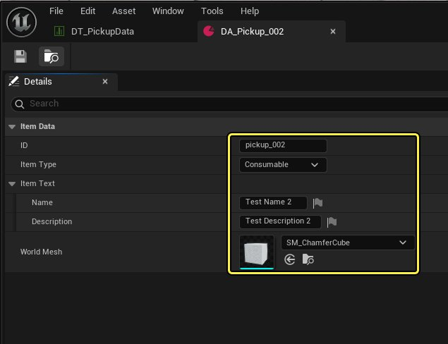

# 创建可重新生成的拾取物

> 路径：虚幻引擎5.7文档 / 入门指南 / 虚幻引擎新用户指南 / 编写第一人称冒险游戏 / 创建可重新生成的拾取物

> 原始页面：https://dev.epicgames.com/documentation/unreal-engine/coder-06-create-a-respawning-pickup-item-in-unreal-engine

## 开始之前

请确保你已经完成了上一节[管理物品和数据](../coder-05-manage-item-and-data-in-an-unreal-engine-game/index.md)中的以下目标：

- 设置项目数据结构体、`UDataAsset`类、名为`DA_Pickup_001`的消耗品类型数据资产实例和数据表。

## 创建新拾取物类

到目前为止，你已经学会了如何定义并存储物品的结构和数据。 在本节中，你将学习如何将这些数据转化为游戏中的"拾取物"，即表格数据的具体表现形式，让玩家可以与之交互并获得效果。 拾取物可以是 可装备的小道具、提供材料的箱子，或者是给予临时增益的强化道具。

要设置附带初始声明的拾取物类，请执行以下步骤：

1. 打开虚幻编辑器，转到**工具（Tools）** > **新C++类（New C++ Class）**。 选择**Actor**作为父类，并将该类命名为`PickupBase`。 点击**创建类（Create Class）**。
2. 在Visual Studio中，打开`PickupBase.h`并在文件顶部添加以下语句：

   - `#include "Components/SphereComponent.h"`。 你需要为拾取物添加一个球体组件，以检测玩家与拾取物之间的碰撞。
   - `#include "AdventureCharacter.h"`。 添加对第一人称角色类的引用，让你可以检查拾取物与该类角色之间的重叠。 （本教程使用`AdventureCharacter`。）
   - 针对`UItemDefinition`的前置声明。 这是所有拾取物会引用的关联数据资产物品。

   C++

   ```
   // Copyright Epic Games, Inc. All Rights Reserved.

   #pragma once

   #include "Components/SphereComponent.h"
   #include "CoreMinimal.h"
   #include "AdventureCharacter.h"
   #include "GameFramework/Actor.h"
   #include "PickupBase.generated.h"
   ```
3. 在 `APickupBase` 类定义上方的 `UCLASS()` 宏中，添加 `BlueprintType` 和 `Blueprintable` 说明符，将其作为创建蓝图的基类公开。

   C++

   ```
   UCLASS(BlueprintType, Blueprintable)class ADVENTUREGAME_API APickupBase : public AActor{
   ```
4. 在`PickupBase.cpp`中，添加`ItemDefinition.h`的`#include`。

   C++

   ```
   // Copyright Epic Games, Inc. All Rights Reserved. #include "PickupBase.h"#include "ItemDefinition.h"
   ```

## 使用表格数据初始化拾取物

到目前为止，你的拾取物还只是一个空白的Actor，因此在游戏开始时，你需要为它提供正常运行所需的数据。 拾取物应从数据表中提取一行值，并将这些值保存在ItemDefinition数据资产（即"引用物品"）中。

### 从数据表格拉取数据

在`PickupBase.h`的`public`部分，声明一个新的void函数`InitializePickup()`。 你将使用此函数和数据表中的值初始化拾取物。

C++

```
// Initializes this pickup with values from the data table.void InitializePickup();
```

要从表中拉取数据，拾取物的蓝图需要两个属性：数据表资产和行名称（而你已将其设为与物品ID相同）。

在`protected`部分，声明一个名为`PickupItemID`的`FName`属性。 为其添加`EditInstanceOnly`和`Category = "Pickup | Item Table"`说明符。 这将是此拾取物在关联数据表中的ID。

C++

```
// The ID of this pickup in the associated data table.UPROPERTY(EditInstanceOnly, Category = "Pickup | Item Table")FName PickupItemID;
```

拾取物不应具有默认物品ID，因此`EditInstanceOnly`说明符让你能够在世界中拾取物的实例里编辑此属性，但不能在原型（或类的默认值）中编辑。

> [!TIP]
> 在`Category`文本中，竖线（`|`）会创建一个嵌套子分段。 因此，在此例中，虚幻引擎会在资产的**细节（Details）**面板中创建一个名为**拾取物（Pickup）**的分段，并带有一个名为**物品表（Item Table）**的子分段。

接下来，为名为 `PickupDataTable`的`UDataTable`声明一个`TSoftObjectPtr`。 为其赋予与`PickupItemID`相同的说明符。 这将是拾取物获取其数据所用的数据表。

数据表可能不会在运行时加载，因此请在这里使用`TSoftObjectPtr`，以便异步加载数据表。

保存头文件，然后切换到`PickupBase.cpp`以实现`InitializePickup()`。

在函数内部，使用`if`语句检查提供的`PickupDataTable`是否有效，以及`PickupItemID`是否拥有值。

C++

```
/** *	Initializes the pickup with default values by retrieving them from the associated data table.*/void APickupBase::InitializePickup(){	if (PickupDataTable && !PickupItemID.IsNone())	{	}}
```

在`if`语句中，添加代码以从数据表检索该行的值。 声明一个名为`ItemDataRow`的常量`FItemData`指针，并将其设置为在你的`PickupDataTable`上调用`FindRow()`的结果。 将要查找的行的类型指定为`FItemData`。

C++

```
const FItemData* ItemDataRow = PickupDataTable->FindRow<FItemData>();
```

`FindRow()`会使用两个参数：

- 你要查找的 `FName` 行的名称。 将 `PickupItemID` 作为行名称传入。
- 一个 `FString` 类型的上下文字符串。当未找到该行时，用它进行调试。 你可以使用 `Text("My context here.")` 来添加上下文字符串，或者使用`ToString()`将物品ID转换为上下文字符串。

C++

```
if (PickupDataTable && !PickupItemID.IsNone()){	// Retrieve the item data associated with this pickup from the Data Table	const FItemData* ItemDataRow = PickupDataTable->FindRow<FItemData>(PickupItemID, PickupItemID.ToString());}
```

### 创建引用物品

检索到拾取物的行数据后，请创建并初始化数据资产类型`ReferenceItem`来保存该信息。

只要将数据保存在这种引用物品中，虚幻引擎就可以在需要了解物品信息时轻松引用该数据，而无需执行更多的表格数据查找，而查找会导致降低效率。

在`PickupBase.h`的在`protected`部分，声明一个指向`UItemDefinition`的`TObjectPtr`，命名为`ReferenceItem`。 这就是存储拾取物数据的数据资产。 为其添加`VisibleAnywhere`和`Category = "Pickup | Reference Item"`说明符。

C++

```
// Data asset associated with this item.UPROPERTY(VisibleAnywhere, Category = "Pickup | Reference Item")TObjectPtr<UItemDefinition> ReferenceItem;
```

保存头文件，然后切换回`PickupBase.cpp`。

在`InitializePickup()`函数中，调用`FindRow()`之后，将`ReferenceItem`设置为`UItemDefinition`类型的`NewObject`。

> [!NOTE]
> 在虚幻引擎中，`NewObject<T>()`是一个模板化的函数，用于在运行时动态创建派生于`UObject`的实例。 它会返回一个指向新对象的指针。 其常见语法如下：
>
> `T* Object = NewObject<T>(Outer, Class);`
>
> 其中*T*是你正在创建的`UObject`的类型，*`Outer`*是该对象的所有者，*`Class`*是你正在创建的对象的类。 `Class`参数通常是`T::StaticClass()`，会返回一个表示*T*的类类型的`UClass`指针。 不过，你通常可以省略这两个参数，因为虚幻引擎会假设当前类是*`Outer`*，并使用*T*来推断`UClass`。

将 `此`作为外部类传递，并将`UItemDefinition::StaticClass()`作为类类型传递，以创建基础`UItemDefinition`。

C++

```
ReferenceItem = NewObject<UItemDefinition>(this, UItemDefinition::StaticClass());
```

要将拾取物的信息复制到`ReferenceItem`中，请将`ReferenceItem`中的每个字段设为`ItemDataRow`中相关字段的值。 对于`WorldMesh`，请从`ItemDataRow`所引用的`ItemBase`中拉取`WorldMesh`属性。

C++

```
ReferenceItem = NewObject<UItemDefinition>(this, UItemDefinition::StaticClass()); ReferenceItem->ID = ItemDataRow->ID;ReferenceItem->ItemType = ItemDataRow->ItemType;ReferenceItem->ItemText = ItemDataRow->ItemText;ReferenceItem->WorldMesh = ItemDataRow->ItemBase->WorldMesh;
```

### 调用InitializePickup()

在`BeginPlay()`中，调用`InitializePickup()`，从而在游戏启动时初始化拾取物。

C++

```
// Called when the game starts or when spawnedvoid APickupBase::BeginPlay(){	Super::BeginPlay(); 	// Initialize this pickup with default values	InitializePickup();}
```

保存文件。 `PickupBase.cpp`现在应该如下所示：

C++

```
// Copyright Epic Games, Inc. All Rights Reserved.

#include "PickupBase.h"

// Sets default values
APickupBase::APickupBase()
{
 	// Set this actor to call Tick() every frame.
	PrimaryActorTick.bCanEverTick = true;
}
```

## 创建游戏内功能

你的拾取物已经拥有了所需的物品数据，但它仍需要知道如何在游戏世界中呈现和运作。 它需要一个供玩家查看的网格体，一个碰撞体积来决定玩家会在何时触碰它，还需要一些逻辑来让拾取物消失（就好像玩家拾取了它一样），并在一定时间后重新生成。

### 添加网格体组件

就像你在[添加第一人称摄像机、网格体和动画](../coder-04-adding-a-firstperson-camera-mesh-and-animation/index.md)中设置玩家角色时所做的那样，你需要使用`CreateDefaultSubobject`模板函数创建一个静态网格体对象，将其作为拾取物类的子组件，然后为该组件应用物品的网格体。

转到`PickupBase.h`的`protected`小节，声明一个指向名为`PickupMeshComponent`的`UStaticMeshComponent`的`TObjectPtr`。 它将是在世界中代表该拾取物的网格体。

你将使用代码将数据资产的网格体分配给该属性，因此请为它添加`VisibleDefaultsOnly`和`Category = "Pickup | Mesh"`说明符，使其在虚幻编辑器中可见，但不可编辑。

C++

```
// The mesh component to represent this pickup in the world.UPROPERTY(VisibleDefaultsOnly, Category = "Pickup | Mesh")TObjectPtr<UStaticMeshComponent> PickupMeshComponent;
```

保存头文件，然后切换到`PickupBase.cpp`文件。

在`APickupBase`构造脚本中，将`PickupMeshComponent`指针设为调用类型为`UStaticMeshComponent`的`CreateDefaultSubobject()`函数的结果。 在`文本（Text）`参数中，将对象命名为`"PickupMesh"`。

为确保将网格体正确实例化，请检查`PickupMeshComponent`是否不为空。

C++

```
// Sets default valuesAPickupBase::APickupBase(){ 	// Set this actor to call Tick() every frame.  You can turn this off to improve performance if you don't need it.	PrimaryActorTick.bCanEverTick = true; 	 // Create this pickup's mesh component	PickupMeshComponent = CreateDefaultSubobject<UStaticMeshComponent>(TEXT("PickupMesh"));	check(PickupMeshComponent != nullptr);}
```

转到`InitializePickup()`的实现部分。

在为拾取物的网格体组件应用`WorldMesh`之前，由于你使用`TSoftObjectPtr`定义了该网格体，因此需要检查该网格体是否已被加载。

首先，声明一个名为`TempItemDefinition`的新`UItemDefinition`指针，并将其设置为调用`ItemDataRow->ItemBase.Get()`的结果。

C++

```
UItemDefinition* TempItemDefinition = ItemDataRow->ItemBase.Get();
```

然后，在一个`if`语句中，调用`WorldMesh.IsValid()`以检查当前是否已加载`WorldMesh`。

C++

```
// Check if the mesh is currently loaded by calling IsValid().if (TempItemDefinition->WorldMesh.IsValid()) { }
```

如果已加载，则调用`SetStaticMesh()`以设置`PickupMeshComponent`，从而使用`Get()`检索`WorldMesh`：

C++

```
// Check if the mesh is currently loaded by calling IsValid().if (TempItemDefinition->WorldMesh.IsValid()) {// Set the pickup's mesh to the associated item's meshPickupMeshComponent->SetStaticMesh(TempItemDefinition->WorldMesh.Get());}
```

如果未加载网格体，则对该网格体调用`LoadSynchronous()`以将其强制加载。 此函数会加载并返回一个指向该对象的资产指针。

在`if`语句之后的`else`语句中，声明一个名为`WorldMesh`的新`UStaticMesh`指针，并调用`WorldMesh.LoadSynchronous()`来设置它。

然后，使用`SetStaticMesh()` 设置`PickupMeshComponent`。

C++

```
else {	// If the mesh isn't loaded, load it by calling LoadSynchronous().	UStaticMesh* WorldMesh = TempItemDefinition->WorldMesh.LoadSynchronous();	PickupMeshComponent->SetStaticMesh(WorldMesh);}
```

在`else`语句之后，使用`SetVisiblity(true)` 将`PickupMeshComponent`设为可见：

C++

```
// Set the mesh to visible.PickupMeshComponent->SetVisibility(true);
```

### 添加碰撞形态

添加球体组件以充当碰撞体积，然后为该组件启用碰撞查询。

转到`PickupBase.h`的`protected`小节，声明一个指向名为`SphereComponent`的`USphereComponent`的`TObjectPtr`。 这就是用于碰撞检测的球体组件。 为其添加`EditAnywhere`、`BlueprintReadOnly`和`Category = "Pickup | Components"`说明符。

C++

```
// Sphere Component that defines the collision radius of this pickup for interaction purposes.UPROPERTY(EditAnywhere, BlueprintReadOnly, Category = "Pickup | Components")TObjectPtr<USphereComponent> SphereComponent;
```

保存头文件，然后切换到`PickupBase.cpp`文件。

在`APickupBase`构造函数中，设置`PickupMeshComponent`之后，将`SphereComponent`设置为调用`CreateDefaultSubobject`的结果，并以`USphereComponent`作为类型，以`"SphereComponent"`作为名称。 在其后添加空值`check`。

C++

```
// Create this pickup's sphere componentSphereComponent = CreateDefaultSubobject<USphereComponent>(TEXT("SphereComponent"));check(SphereComponent != nullptr);
```

现在你拥有了两个组件，请使用`SetupAttachment()`将`PickupMeshComponent`附加到`SphereComponent`上：

C++

```
// Attach the sphere component to the mesh componentSphereComponent->SetupAttachment(PickupMeshComponent);
```

将`SphereComponent`附加到`MeshComponent`上之后，使用`SetSphereRadius()`设置球体的大小。 这个值应该既能确保拾取物的碰撞体积大到可以发生碰撞，但又不能过大，以免你的角色意外撞到它。

C++

```
// Set the sphere's collision radiusSphereComponent->SetSphereRadius(32.f);
```

转到`InitializePickup()`函数，在`SetVisibility(true)`这一行之后，调用`SetCollisionEnabled()`以使`SphereComponent`可发生碰撞。

此函数会使用一项枚举（`ECollisionEnabled`），该枚举会向引擎表明要使用的碰撞类型。 你需要让角色能够与拾取物发生碰撞并触发碰撞查询，但拾取物不应有因被撞击而弹开的物理效果，因此请传递`ECollisionEnabled::QueryOnly`选项。

C++

```
// Set the mesh to visible and collidable.PickupMeshComponent->SetVisibility(true);SphereComponent->SetCollisionEnabled(ECollisionEnabled::QueryOnly);
```

`PickupBase.cpp`现在应如下所示：

C++

```
// Copyright Epic Games, Inc. All Rights Reserved.

#include "PickupBase.h"
#include "ItemDefinition.h"

// Sets default values
APickupBase::APickupBase()
{
	// Set this actor to call Tick() every frame.  You can turn this off to improve performance if you don't need it.
	PrimaryActorTick.bCanEverTick = true;
```

### 模拟拾取碰撞

现在你的拾取物已经有了碰撞形态，请添加逻辑，以此检测拾取物和玩家之间的碰撞，并让拾取物在发生碰撞时消失。

#### 设置碰撞事件

在`PickupBase.h`的`protected`部分中，声明一个名为`OnSphereBeginOverlap()`的`void`函数。

所有继承自`UPrimitiveComponent`的组件（比如`USphereComponent`）都可以实现此函数，以便在该组件与其他Actor重叠时运行代码。 此函数会使用几个用不到的参数，而你只需传递以下内容即可：

- `UPrimitiveComponent* OverlappedComponent`：受到重叠的组件。
- `AActor* OtherActor`：与组件重叠的Actor。
- `UPrimitiveComponent* OtherComp`：受到重叠的Actor组件。
- `int32 OtherBodyIndex`：受重叠组件的索引。
- `bool bFromSweep, const FHitResult& SweepResult`：有关碰撞的信息，比如碰撞发生的位置和角度。

C++

```
// Code for when something overlaps the SphereComponent. UFUNCTION()void OnSphereBeginOverlap(UPrimitiveComponent* OverlappedComponent, AActor* OtherActor, UPrimitiveComponent* OtherComp, int32 OtherBodyIndex, bool bFromSweep, const FHitResult& SweepResult);
```

保存头文件，然后切换到`PickupBase.cpp`文件。

虚幻引擎会使用动态组播委托来实现碰撞事件。 在虚幻引擎中，这种委托系统让一个对象能够同时调用多个函数，这有点像向一个邮件列表广播消息，而这里的订阅者就是这些其他函数。 将函数绑定到委托就好比将它们订阅到邮件列表中。 "委托"就是我们的事件；在本例中就是玩家和拾取物之间的碰撞。 当事件发生时，虚幻引擎会调用所有绑定到该事件的函数。

> [!NOTE]
> 虚幻引擎包含其他数个绑定函数，但你需要使用 `AddDynamic()`，因为你的委托 `OnComponentBeginOverlap` 是动态委托。 而且你是在绑定 `UObject` 类中的一个 `UFUNCTION`，而这需要使用 `AddDynamic()` 来提供反射支持。 如需详细了解动态组播委托，请参阅[多播委托](../../../../cpp-programming/delegates-and-lambda-functions/multicast-delegates/index.md)。

在PickupBase.cpp的`InitializePickup()`中，使用`AddDynamic`宏将`OnSphereBeginOverlap()`绑定到球体组件的`OnComponentBeginOverlap`事件。

C++

```
// Register the Overlap EventSphereComponent->OnComponentBeginOverlap.AddDynamic(this, &APickupBase::OnSphereBeginOverlap);
```

保存你的工作。 现在，当角色与拾取物的球体组件碰撞时，`OnSphereBeginOverlap()`将运行。

#### 在碰撞后隐藏拾取物

在`PickupBase.cpp`中实现`OnSphereBeginOverlap()`，使拾取物消失，这样看起来就像是玩家拾取了它。

首先添加一条调试消息，以指示该函数被触发。

C++

```
void APickupBase::OnSphereBeginOverlap(UPrimitiveComponent* OverlappedComponent, AActor* OtherActor, UPrimitiveComponent* OtherComp, int32 OtherBodyIndex, bool bFromSweep, const FHitResult& SweepResult){	GEngine->AddOnScreenDebugMessage(-1, 5.0f, FColor::Yellow, TEXT("Attempting a pickup collision"));}
```

由于此函数会在其他Actor与拾取物碰撞时运行，因此你需要确保是你的第一人称角色在进行碰撞。

声明一个名为`Character`的新`AAdventureCharacter`指针，并将`OtherActor`转换为你的角色类的名称（本教程使用`AAdventureCharacter`），从而为其设置。

C++

```
// Checking if it's an AdventureCharacter overlappingAAdventureCharacter* Character = Cast<AAdventureCharacter>(OtherActor);
```

在`if`语句中，检查`角色（Character）`是否不为空。 空表示类型转换失败，即`OtherActor`不是`AAdventureCharacter`类型。

在`if`语句内部，通过调用`RemoveAll()`从该函数中注销`OnComponentBeginOverlap`，避免将其反复触发。 这将结束碰撞。

C++

```
if (Character != nullptr){	// Unregister from the Overlap Event so it is no longer triggered	SphereComponent->OnComponentBeginOverlap.RemoveAll(this);}
```

然后，使用`SetVisibility(false)`将`PickupMeshComponent`设置为不可见，同时使用`SetCollisionEnabled()`并传递`NoCollision`选项，将拾取物网格体和球体组件设置为非碰撞状态。

C++

```
if (Character != nullptr){	// Unregister from the Overlap Event so it is no longer triggered	SphereComponent->OnComponentBeginOverlap.RemoveAll(this); 	// Set this pickup to be invisible and disable collision	PickupMeshComponent->SetVisibility(false);	PickupMeshComponent->SetCollisionEnabled(ECollisionEnabled::NoCollision);	SphereComponent->SetCollisionEnabled(ECollisionEnabled::NoCollision);}
```

保存`PickupBase.cpp`。

### 重新生成拾取物

现在角色已经不再与拾取物发生交互，你需要让它在一段时间后重新生成。

在`PickupBase.h`的`protected`部分，声明一个名为`bShouldRespawn`的bool。 你可以使用它来开启或关闭重新生成功能。

声明一个初始值为`4.0f`的浮点型变量`RespawnTime`。 这即是拾取物重新生成前需要等待的时间。

为这两个属性添加`EditAnywhere`、`BlueprintReadOnly`和`Category = "Pickup | Respawn"`说明符。

C++

```
// Whether this pickup should respawn after being picked up.UPROPERTY(EditAnywhere, BlueprintReadOnly, Category = "Pickup | Respawn")bool bShouldRespawn; // The time in seconds to wait before respawning this pickup.UPROPERTY(EditAnywhere, BlueprintReadOnly, Category = "Pickup | Respawn")float RespawnTime = 4.0f;
```

声明一个名为`RespawnTimerHandle`的`FTimerHandle`。

C++

```
// Timer handle to distinguish the respawn timer.FTimerHandle RespawnTimerHandle;
```

在虚幻引擎中，游戏定时器由`FTimerManager`处理。 该类包含`SetTimer()`函数，可在设定延迟后调用函数或委托。 `FTimerManager的`函数使用`FTimerHandle`来启动、暂停、恢复函数或无限循环函数。 你需要使用`RespawnTimerHandle`发出拾取物重新生成的信号。 如需详细了解定时器管理器，请参阅[Gameplay定时器](../../../../gameplay-systems/gameplay-framework/gameplay-timers/index.md)。

保存头文件，然后切换到`PickupBase.cpp`文件。

要实现拾取物的重新生成，请使用定时器管理器设置一个定时器，让后者在短暂等待后调用`InitializePickup()`。

你需要仅在启用重新生成功能时才重新生成拾取物；因此，请在 `OnSphereBeginOverlap`的底部添加一个`if`语句，检查`bShouldRespawn`是否为true。

C++

```
if (bShouldRespawn){ }
```

在`if`语句中，使用`GetWorldTimerManager()`获取定时器管理器，并对定时器管理器调用`SetTimer()`。 此函数的语法如下：

`SetTimer(InOutHandle, Object, InFuncName, InRate, bLoop, InFirstDelay);`

其中：

- `InOutHandle`是控制定时器的`FTimerHandle`（即你的`RespawnTimerHandle`）。
- `Object`是你正在调用的函数所属的`UObject`。 使用this。
- `InFuncName`是指向你想要调用的函数的指针（在本例中是`InitializePickup()`）。
- `InRate`是一个浮点值，用于指定在调用你的函数之前需要等待的时间（以秒为单位）。
- `bLoop`使定时器每隔`Time`秒重复一次（`true`）或仅触发一次（`false`）。
- `InFirstDelay`（可选）是循环定时器中第一次函数调用之前的初始时间延迟。 如果未指定，虚幻引擎将使用`InRate`作为延迟时间。

你只需要调用一次`InitializePickup()`即可替换拾取物，因此请将`bLoop`设置为`false`。

设置你想要的重新生成时间；本教程会让拾取物在四秒后重新生成，且没有初始延迟。

C++

```
// If the pickup should respawn, wait an fRespawnTime amount of seconds before calling InitializePickup() to respawn itif (bShouldRespawn){	GetWorldTimerManager().SetTimer(RespawnTimerHandle, this, &APickupBase::InitializePickup, RespawnTime, false, 0);}
```

完整的`OnSphereBeginOverlap()`函数应如下所示：

C++

```
/** 
*	Broadcasts an event when a character overlaps this pickup's SphereComponent. Sets the pickup to invisible and uninteractable, and respawns it after a set time.
*	@param OverlappedComponent - the component that was overlapped.
*	@param OtherActor - the Actor overlapping this component.
*	@param OtherComp - the Actor's component that overlapped this component.
*	@param OtherBodyIndex - the index of the overlapped component.
*	@param bFromSweep - whether the overlap was generated from a sweep.
*	@param SweepResult - contains info about the overlap such as surface normals and faces.
*/
void APickupBase::OnSphereBeginOverlap(UPrimitiveComponent* OverlappedComponent, AActor* OtherActor, UPrimitiveComponent* OtherComp, int32 OtherBodyIndex, bool bFromSweep, const FHitResult& SweepResult)
```

保存你的代码并在Visual Studio中编译。

## 在关卡中实现拾取物

你已经定义了构成拾取物的代码，现在该在游戏中测试一下了！

要将拾取物品添加到你的关卡中，请执行以下步骤：

1. 在虚幻编辑器中，在**内容浏览器（Content Browser）**资产树中，转至**Content > FirstPerson > Blueprints**。
2. 在 **Blueprints**文件夹中，创建一个名为**Pickups**的新子文件夹，用于存储你的拾取物类。
3. 在资产树中，转至你的**C++ Classes**文件夹。 右键点击**PickupBase**类，从该类创建一个蓝图。
4. 将其命名为`BP_PickupBase`。
5. 至于**路径（Path）**，请选择**Content/FirstPerson/Blueprints/Pickups**，然后点击**创建拾取物基类（Create Pickup Base Class）**。
6. 返回你的**Blueprints > Pickups**文件夹。 将你的`BP_PickupBase`蓝图拖入关卡。 PickupBase的一个实例将出现在你的关卡中，并在**大纲视图（Outliner）**面板中被自动选中。 不过，它目前还缺少网格体。
7. 在选中`BP_PickupBase`的状态下，在**细节（Details）**面板中设置以下属性：

   1. 将**拾取物ID（Pickup Item ID）**设置为`pickup_001`。
   2. 将**拾取物数据表（Pickup Data Table）**设置为`DT_PickupData`。
   3. 将**应重新生成（Should Respawn）**设置为**true**。

当点击 **播放（Play）**测试游戏时，拾取物将使用**拾取物ID（Pickup Item ID）**查询数据表，并检索与`pickup_001`相关的数据。 该拾取物将使用表格数据和对`DA_Pickup_001`数据资产的引用，初始化一个引用物品并加载其静态网格体。

当你穿过拾取物时，你应会看到拾取物消失，然后在四秒后重新出现。

### 加载不同的拾取物

如果将**拾取物ID（Pickup Item ID）**设置为不同的值，拾取物将从表格中对应行检索数据。

要尝试切换**拾取物ID（Pickup Item ID）**，请执行以下步骤：

1. 创建一个名为**DA_Pickup_002**的新数据资产。 在此资产中设置以下属性：

   - **ID**：pickup_002
   - **物品类型（Item Type）**：消耗品（Consumable）
   - **名称（Name）**：Test Name 2
   - **说明（Description）**：Test Description 2
   - **世界****网格体（World Mesh）**：`SM_ChamferCube`

   
2. 在`DT_PickupData`数据表中添加新的一行，并将数据资产的信息填入新行的字段。
3. 在`BP_PickupBase`中，将**拾取物ID（Pickup Item ID）**更改为`pickup_002`。

当点击**播放（Play）**测试游戏时，拾取物应使用`DA_Pickup_002`的值生成！

## 在编辑器中更新拾取物Actor

现在，你的拾取物已经在游戏中生效了，但由于缺少默认网格体，你还是难以在编辑器中看到它们。

要解决此问题，请使用`PostEditChangeProperty()`函数。 这是一个编辑器内函数。虚幻引擎会在编辑器更改某个属性时调用该函数，因此，你可以使用该函数来确保视口中的Actor随着属性的变更而保持最新状态。 例如，当你更改玩家的默认生命值时更新UI元素，或者当你使球体靠近或远离原点时，对球体进行缩放。

在本项目中，每当**拾取物ID（Pickup Item ID）**更改时，你将使用该函数应用拾取物的新静态网格体。 这样一来，你就可以更改拾取物的类型，并在视口中立即看到其更新，而无需点击运行（Play）！

要让拾取物的更改在编辑器中立即显示，请执行以下步骤：

1. 在`PickupBase.h`的`protected`部分，声明一个`#if WITH_EDITOR`宏。 这个宏会向虚幻头文件分析工具表明，它所含的任何内容都只应针对编辑器构建打包，而不应针对游戏的发布版本进行编译。 用`#endif`语句结束该宏。

   C++

   ```
   #if WITH_EDITOR #endif
   ```
2. 在该宏内部，为`PostEditChangeProperty()`声明一个虚void函数重载项。 该函数会接收对`FPropertyChangedEvent`的引用，该事件包含被更改属性的信息、更改类型等。 保存头文件。

   C++

   ```
   #if WITH_EDITOR	// Runs whenever a property on this object is changed in the editor	virtual void PostEditChangeProperty(FPropertyChangedEvent& PropertyChangedEvent) override; #endif
   ```
3. 在`PickupBase.cpp`中，实现`PostEditChangeProperty()`函数。 首先调用`Super::PostEditChangeProperty()`函数，用其处理所有父类属性的更改。

   C++

   ```
   /***	Updates this pickup whenever a property is changed.*	@param PropertyChangedEvent - contains info about the property that was changed.*/void APickupBase::PostEditChangeProperty(FPropertyChangedEvent& PropertyChangedEvent){	// Handle parent class property changes	Super::PostEditChangeProperty(PropertyChangedEvent);}
   ```
4. 新建一个名为`ChangedProperty`的新`const FName`变量，用于存储被更改属性的名称。

   C++

   ```
   // Handle parent class property changesSuper::PostEditChangeProperty(PropertyChangedEvent); const FName ChangedPropertyName;
   ```
5. 为验证`PropertyChangedEvent`是否包含`属性（Property）`并保存该属性，请使用以`PropertyChangedEvent.Property`为条件的三元运算符。 如果条件为true，则将`ChangedPropertyName`设为`PropertyChangedEvent.Property->GetFName()`，如果为false，则将其设置为`NAME_None`。

   C++

   ```
   // If a property was changed, get the name of the changed property. Otherwise use none.const FName ChangedPropertyName = PropertyChangedEvent.Property ? PropertyChangedEvent.Property->GetFName() : NAME_None;
   ```

   > [!TIP]
   > `NAME_None`是虚幻引擎的全局常量，类型为`FName`，表示"无有效名称"或"空名称"。
6. 现在你已经知道了属性的名称，可让虚幻引擎在检测到ID变更时更新网格体了。

   在`if`语句中，检查`ChangePropertyName`是否等于调用`GET_MEMBER_NAME_CHECKED()`的结果，并传递此`APickupBase`类和`PickupItemID`。 这个宏会进行编译时检查，以确保你传入的属性在传入的类中存在。

   你还需要根据数据表检索值，因此请在输入`if`语句前检查该表是否有效。

   C++

   ```
   // Verify that the changed property exists in this class and that the PickupDataTable is valid.if (ChangedPropertyName == GET_MEMBER_NAME_CHECKED(APickupBase, PickupItemID) && PickupDataTable){}
   ```
7. 在`if`语句内部，请调用`FindRow`函数，像调用`InitializePickup()`那样检索与此拾取物关联的数据行。

   这次，为了确保在续续操作之前`PickupItemID`存在于表中，此次需将`FindRow`行放在嵌套的`if`语句中。

   C++

   ```
   // Verify that the changed property exists in this class and that the PickupDataTable is valid.if (ChangedPropertyName == GET_MEMBER_NAME_CHECKED(APickupBase, PickupItemID) && PickupDataTable){	// Retrieve the associated ItemData for this pickup.if (const FItemData* ItemDataRow = PickupDataTable->FindRow<FItemData>(PickupItemID, PickupItemID.ToString()))	{}}
   ```
8. 如果虚幻引擎成功找到该行数据，请创建一个 `TempItemDefinition` 变量，用于存储在`ItemDataRow`中引用的数据资产（包含新网格体）。

   C++

   ```
   if (const FItemData* ItemDataRow = PickupDataTable->FindRow<FItemData>(PickupItemID, PickupItemID.ToString())){	UItemDefinition* TempItemDefinition = ItemDataRow->ItemBase;
   ```
9. 要更新网格体，请对`PickupMeshComponent`使用`SetStaticMesh`，并传入临时数据资产的`WorldMesh`。

   C++

   ```
   // Set the pickup's mesh to the associated item's meshPickupMeshComponent->SetStaticMesh(TempItemDefinition->WorldMesh.Get());
   ```
10. 使用`SetSphereRadius(32.f)`设置球体组件的碰撞半径。

    C++

    ```
    // Set the sphere's collision radiusSphereComponent->SetSphereRadius(32.f);
    ```
11. 保存你的代码并在Visual Studio中编译。

完整的`PostEditChangeProperty()`函数应如下所示：

C++

```
/**
*	Updates this pickup whenever a property is changed.
*	@param PropertyChangedEvent - contains info about the property that was changed.
*/
void APickupBase::PostEditChangeProperty(FPropertyChangedEvent& PropertyChangedEvent)
{
	// Handle parent class property changes
	Super::PostEditChangeProperty(PropertyChangedEvent);

	// If a property was changed, get the name of the changed property. Otherwise use none.
```

回到编辑器中，转到**大纲视图（Outliner）**，确保已选中**BP_PickupBase**Actor。 将**拾取物ID（Pickup Item ID）**从`pickup_001`更改为`pickup_002`，然后再改回来。 当你更改ID时，拾取物的网格体将在视口中更新。

> [!WARNING]
> 如果尝试其他网格体，可能需要先运行一次游戏，以强制新网格体完全加载，之后才能在编辑器视口中查看。

> 动图已省略：519ba7db92872cc1a2609d6517f93298f4f7b65074434d5ca9224f0312f56aeb

## 下一步

接下来，你需要进一步扩展拾取物类，创建一个自定义小道具并将其装备到角色身上！

- [装备角色](../coder-07-equip-your-character-with-cplusplus-tools/index.md) - 学习使用C++创建自定义可装备物品，并将其附加到角色身上。

## 完整代码

C++

PickupBase.h

```
// Copyright Epic Games, Inc. All Rights Reserved.

#pragma once

#include "Components/SphereComponent.h"
#include "CoreMinimal.h"
#include "AdventureCharacter.h"
#include "GameFramework/Actor.h"
#include "PickupBase.generated.h"
```

C++

PickupBase.cpp

```
// Copyright Epic Games, Inc. All Rights Reserved.

#include "PickupBase.h"
#include "ItemDefinition.h"

// Sets default values
APickupBase::APickupBase()
{
	// Set this actor to call Tick() every frame.  You can turn this off to improve performance if you don't need it.
	PrimaryActorTick.bCanEverTick = true;
```
