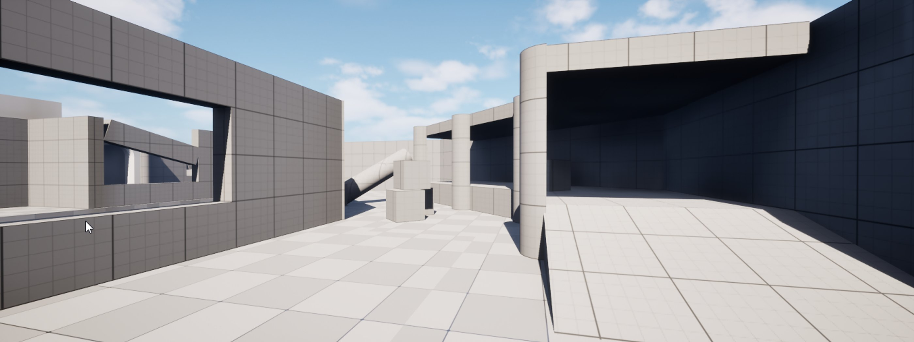
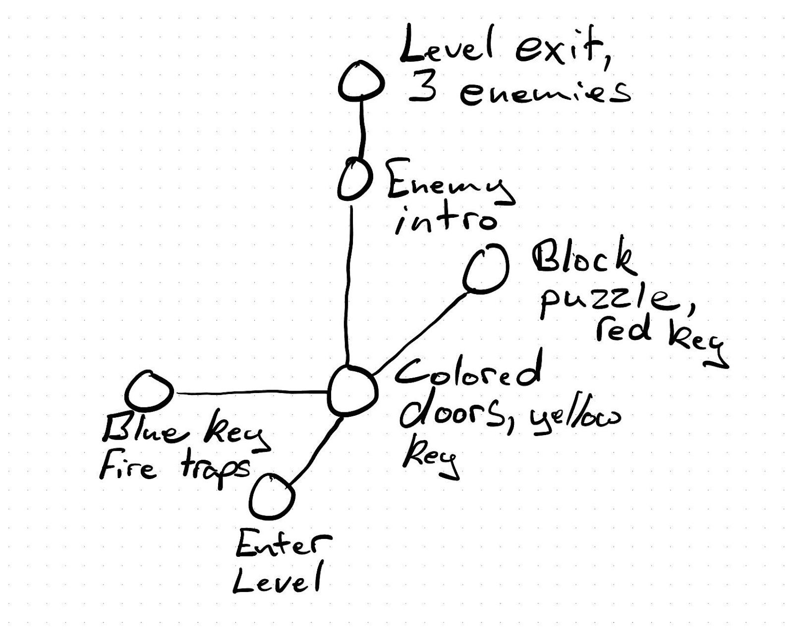
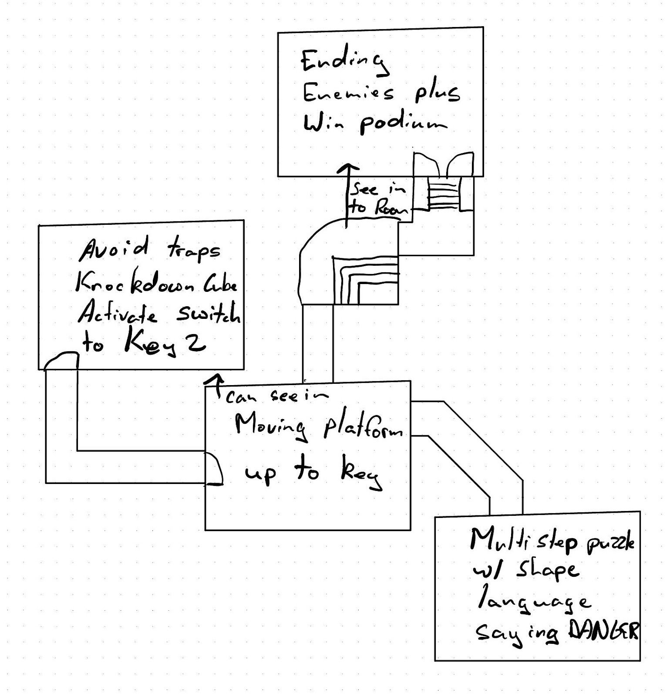
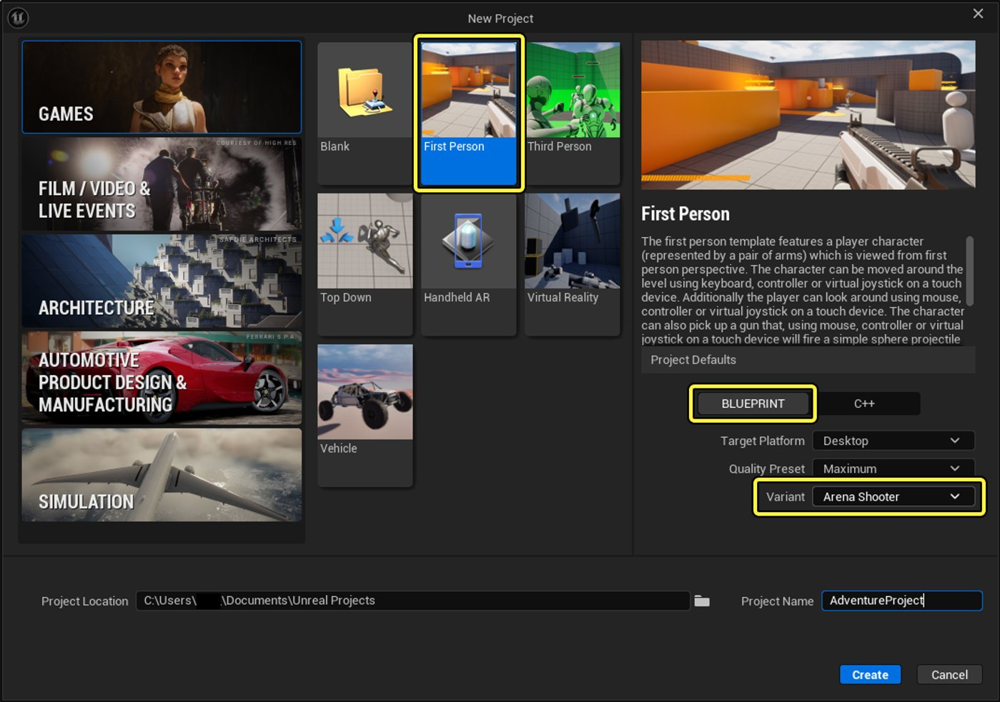
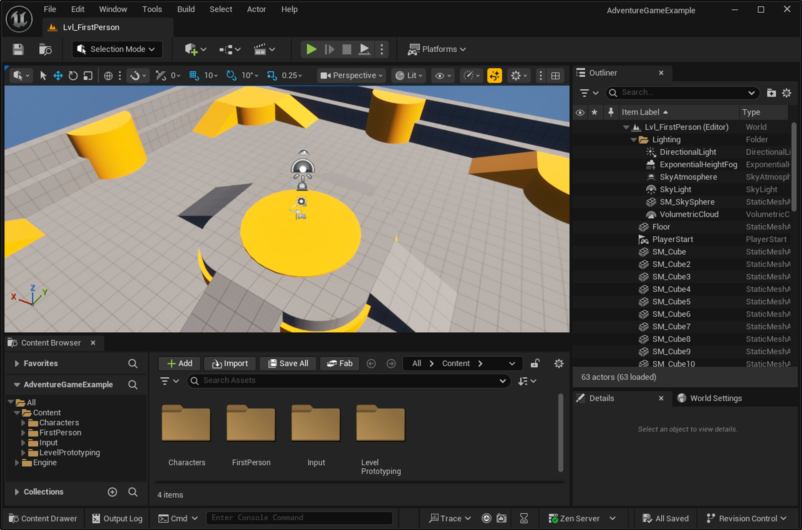
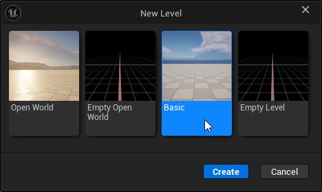
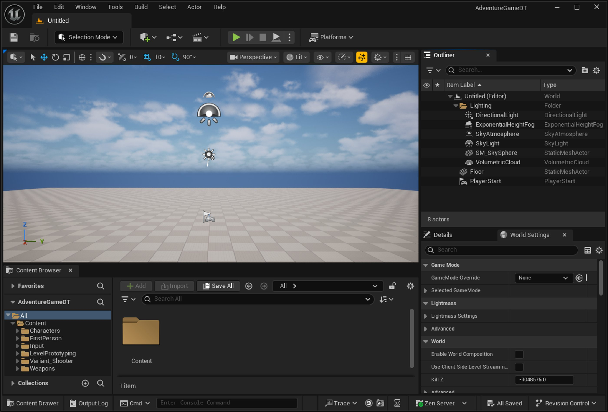
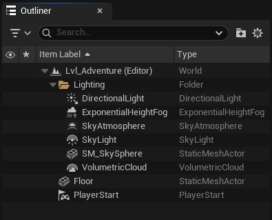

# 项目设置与关卡粗模搭建

> 路径：虚幻引擎5.7文档 / 入门指南 / 虚幻引擎新用户指南 / 设计解谜冒险游戏 / 项目设置与关卡粗模搭建

> 原始页面：https://dev.epicgames.com/documentation/unreal-engine/designer-01-project-setup-and-level-blockout-in-unreal-engine

在本系列教程的这一节中，将熟悉虚幻编辑器的基础操作，包括如何创建新关卡、放置和变换物体、使用不同的视口模式，以及如何利用大纲视图让项目井井有条。

此外，你还将学习如何利用简单的形状搭建粗模，并应用诸如缩放、垂直性、遮挡、对比度和引导线等关卡设计概念。 所有这些工具都会影响玩家在关卡中的移动方式和体验。

在本节结束时，你将搭建好一个可玩空间，为后续章节的Gameplay创建工作打下坚实的基础。



### 开始之前

确保已经[安装Epic Games启动器和虚幻引擎](https://www.epicgames.com/help/en-US/epic-games-store-c-202300000001639/launcher-support-c-202300000001735/how-to-download-the-epic-games-launcher-a202300000012839)。

学习本教程前，须对虚幻编辑器的工具栏、面板及视口控件有基本的了解。 如需了解更多信息，请在开始本教程前，参阅[《虚幻引擎新用户指南》](../../index.md)文档中的其他页面：

- [虚幻编辑器界面](../../unreal-editor-interface/index.md)
- [视口功能按钮](../../viewport-controls/index.md)
- [视口工具栏](../../viewport-toolbar/index.md)

## 构思草图

在编辑器中开始构建前，建议先花10到20分钟用纸笔将想法写下或画出草图。 最初的迭代过程有以下好处：

- 弄清关卡中的基本Gameplay节拍和概念。
- 在投入时间到编辑器中构建之前，预判Gameplay创意是否可行以及范围是否得当。
- 在中断工作后，能够快速衔接之前的思路。

这种初步设计可以从不同角度切入，例如以Gameplay机制为先导，或以关卡设计为先导。 根据要创建的游戏类型和个人偏好，可以选择或组合不同的关卡设计技巧。 游戏设计并无唯一的正确方法，重要的是最终呈现的效果。 当关卡设计与Gameplay能够相辅相成时，游戏会更具凝聚力，为玩家带来的体验也会更加沉浸和引人入胜。

技巧之一是“节点映射”，即绘制一张由圆圈和线条组成的简化抽象图，用以表示关卡中的不同空间、其中发生的事件，以及玩家在这些空间之间移动的路径。 节点映射主要关注Gameplay节奏、分支路径和玩家选择。 其中，一个节点代表一个玩家操作或事件。 空间中发生的事件可以为该空间的设计提供灵感。

本教程将用一系列房间来演示如何实现常见的Gameplay物体，例如用锁和钥匙限制玩家、创建可伤害玩家的障碍物，以及添加平台和开关来清除这些障碍物。 我们用节点勾画出的关卡创意草图如下：



另一种技巧是**绘制视觉草图**，可以是关卡实际布局的俯视图、侧视图或正交视图。 这种方法的重点在于关卡设计本身，而非Gameplay。 关卡空间的形态可以启发玩家的操作和事件设计。

我们为本教程关卡最初绘制的房间和走廊设计草图如下：



你还可以围绕**玩家动词**进行设计，也就是玩家在游戏里能做的动作，如跳跃、奔跑、躲藏、抓取、制造、射击、近战和交谈。 这种思维方式能将设计重心从世界中的“物”转移到玩家所“参与的行为”上。 这种思维方式有助于提升关卡的互动性、趣味性及节奏感。

设计关卡空间时，要思考在何处为这些玩家动词创造有意义的使用机会。 这些动词可以反过来为空间设计提供思路。 比如，如果动词是**跳跃**，就可以添加需要跨越的壕沟、一些平台、垂直空间，或者需要跳过的敌人或危险区域。 在不同空间中变换使用这些动词，可以保持Gameplay的新鲜感和良好节奏。

无论采用何种方法设计关卡及其Gameplay，都必须始终考虑玩家的行为。

## 创建项目

首先，使用第一人称模板创建一个新项目。 模板中包含了网格体、Gameplay物体和玩家角色等预制资产，可以加快关卡设计进程。

> [!NOTE]
> **网格体**（Mesh）即3D模型，或者说是构成3D模型的多边形集合。 **静态网格体**（Static Mesh）是一种用于在关卡中构成物体的3D模型，可对其进行平移、旋转和缩放操作。

> [!TIP]
> 如果已经学习了[《编程系列教程》](../../code-a-firstperson-adventure-game/index.md)，可以直接在本系列教程中继续使用之前的项目。

请按照以下步骤，创建一个新的第一人称项目：

1. 打开虚幻编辑器。 打开**虚幻项目浏览器**，转到**游戏（Games）**项目类别，选择**第一人称（First Person）**模板。
2. 保留所有**项目默认值**，并选择**竞技场射击游戏**作为**模板变体**。 模板变体中包含额外的资产以及一个与该Gameplay类型相对应的示例关卡。

   
3. 为项目**命名**。 本教程使用的项目名称为`AdventureGame`。
4. 点击**创建**在虚幻编辑器中打开新项目。

项目打开后，视口中将加载并显示`Lvl_FirstPerson`示例关卡。



## 开始一个新关卡

为了让这个项目更具个性化，现在来创建一个全新的**关卡**（有时也称**地图**），探索其中的内容，设置游戏的启动方式，并进行首次试玩。

> [!TIP]
> 在虚幻编辑器中工作时，如果遇到意外行为（例如，资产或Actor不显示或不更新），请尝试重启编辑器。 由于虚幻引擎高度依赖缓存，重启通常可以解决这些问题。

请按照以下步骤，创建一个新关卡：

1. 在虚幻编辑器的菜单栏中，转到**文件**（File），然后选择**新建关卡**（New Level）。

   
2. 在**新建关卡**窗口中，选择**基本**（Basic），然后点击**创建**（Create）。 这样就会创建一个包含地面、天空、玩家出生点和环境光照的初始场景。

   
3. 转到**文件 > 保存当前关卡**（File > Save Current Level）。
4. 创建一个文件夹结构，用来存放本系列教程中将要创建的资产：

   - 在**关卡另存为**窗口的左侧面板中，右键点击**Content**文件夹，然后选择**新建文件夹**。
   - 用项目名称为此文件夹命名。 本教程中使用的项目名称是`AdventureGame`。
   - 右键点击刚创建的文件夹并选择**新建文件夹**。
   - 将此文件夹命名为`Designer`，然后选中它。
5. 为关卡输入一个名称，然后点击**保存**。 本教程中使用的关卡名称是`Lvl_Adventure`。

### 探索大纲视图与细节面板

查看**大纲视图**，里面是关卡中所有物体的列表。 这些物体通常也被称为**Actor**。



在**Lighting**文件夹下，有一组控制关卡背景和环境光照的物体。 要查看各项对关卡外观的影响，可将鼠标悬停在每一项上，然后点击旁边的眼睛图标来切换其在视口中的可见性。

> 动图已省略：在Lighting文件夹中切换可见性的操作演示（GIF动图）

> [!TIP]
> 这些光照关卡物体的位置不影响功能，如果觉得碍事，可以把它们移走。

关卡中还包含一个地面网格体和一个**PlayerStart**生成点，它控制着玩家进入关卡的初始位置。

在**大纲视图**中，点击**DirectionalLight**。 这个光源的作用相当于太阳（或月亮），用于照亮关卡并投射阴影。 在**细节**（Details）面板中，可以查看并修改该光源的属性，例如**颜色**或**强度**，所做修改会即时在视口中生效。

> 图片已省略：光源调整示例图

> [!TIP]
> 如果在视口中找不到某个物体，可以在**大纲视图**中选中它，然后按**F**键，视口就会自动聚焦到该物体上。

如需了解有关自定义关卡光照的更多信息，请参阅教程[《为场景设置光照》](https://dev.epicgames.com/documentation/zh-cn/unreal-engine/environmental-light-with-fog-clouds-sky-and-atmosphere-in-unreal-engine)。

### 在视口中预览Gameplay

视口显示的是关卡的预览画面。 在“视口工具栏”中，点击**运行**即可在视口中运行关卡。 该模式通常也称为**在编辑器中运行**（**PIE**）模式。 借助PIE模式，可以在虚幻编辑器内部（无论是在视口中还是在新窗口中）测试项目在运行时的功能。

> [!NOTE]
> **运行时**指的是项目在其目标平台（例如你的计算机或游戏主机）上运行的这段时间。

运行关卡时，角色会生成在PlayerStart所在的位置。

之后，点击视口，使用**WASD**或**方向键**移动，按**空格键**跳跃。

向下看，可以看到游戏使用的是一个默认的第一人称玩家角色。

> 图片已省略：玩家低头看着自己在地面上的影子

按**Shift+F1**可以切换回鼠标光标，然后点击**停止**（或按**Escape**）即可退出运行模式。

> [!TIP]
> 要运行一个完整的独立版游戏，可以点击“运行模式”控件旁边的三点菜单，然后选择**独立游戏模式**。 这会在一个新窗口中运行游戏，并模拟最终导出的游戏版本，方便测试UI菜单、加载界面、分辨率缩放和鼠标输入。 但是，该模式仍然是在编辑器内部运行。 要构建并运行一个临时的`.exe`版本的已打包游戏，选择**快速启动**模式。

可以使用此菜单切换回在视口中运行的模式。

> 图片已省略：三点菜单的图像

> [!TIP]
> 如果虚幻编辑器在电脑上运行缓慢，可以点击视口右上角附近的**性能和可延展性**工具按钮，转到**视口可延展性**，然后选择一个较低的质量设置。或者，在视口工具栏右侧附近，点击**光照**打开**视图模式**菜单，然后选择**无光o照**。 这只会影响虚幻编辑器的性能，不会影响最终的项目。
>
> > 图片已省略：通过调整视口可延展性来提高响应速度

### 更改启动关卡

可以通过项目设置，更改在虚幻编辑器中打开项目以及运行最终游戏时所加载的关卡。

请按照以下步骤，更改项目的默认启动关卡：

1. 打开虚幻编辑器的主菜单，转到**编辑（Edit） > 项目设置（Project Settings）**。
2. 在左侧面板的**项目**部分，选择**地图与模式**。
3. 在“默认地图”部分，将**编辑器启动地图**和**游戏默认地图**更改为新创建的关卡。 打开项目时，编辑器将打开**编辑器启动地图**。而运行独立版或已打包的`.exe`项目时，虚幻引擎将加载**游戏默认地图**。

   > 图片已省略：在项目设置中调整地图与模式的示意图
4. 关闭**项目设置（Project Settings）**。

## 搭建地图粗模

有了概念、全新的项目和新关卡之后，就可以开始在虚幻编辑器中进行设计了。

在考虑最终的美术效果和精致细节之前，首先应关注关卡的布局和可玩性。 这个设计阶段通常称为**搭建粗模**（或**灰盒测试**），即用简单的形状构建出关卡的大致空间，用以代表墙壁、路径和功能性障碍物。 这好比在用颜料上色之前，先用铅笔在画布上勾勒草图。

搭建粗模是一个能帮助快速迭代并测试想法的工具，可以借此判断设计中的可行与不可行之处。 注意，这一过程并非是在打磨最终产品，而是应该力求迅速，以便将更多时间投入到玩家会实际互动的游戏内容上。

搭建关卡粗模的好处在于：

- 无需等待最终美术设计敲定，就能着手设计Gameplay。
- 能更早地发现设计问题。
- 能快速实验和迭代，且没有重做美术资产的风险。
- 无需在现阶段不必要的细节上耗费时间，即可测试缩放、视线和Gameplay流程。

你要创建的是关卡最简单、最易于导航的版本，其中只包含为Gameplay服务的障碍物。 重点不在于外观，而在于空间给人的感受，它是否有趣，以及是否能支持你的Gameplay目标。 由于使用的是基本形状，如果某些设计不奏效，可以随时移除并尝试新方案。

可以在粗模中同时融入布局和美术设计，只要它们是功能性的并且能够为Gameplay服务。 成功的游戏会同时利用这两种设计元素来创造引人入胜的沉浸式空间。

|  | 应在粗模中添加的内容 | 不应在粗模中添加的内容 |
| --- | --- | --- |
| **布局设计选择** | 一个充当倒塌横梁的矩形方块，用以阻挡走廊的通行。能够阻挡视线的柱子，可用于制造深度感、营造“揭示”效果，或为玩家提供掩体。 | 一个仅代表靠墙的装饰性书架的矩形方块。 |
| **美术设计选择** | 一盏充当霓虹灯的光源，能将玩家吸引到特定区域或物体。 | 一盏仅用于营造篝火氛围的光源。 |

### 确定缩放比例

在深入搭建关卡粗模之前，确定游戏的标准度量和**缩放**比例非常重要。 这包括决定关卡中常见结构的尺寸，例如：

- 可跳跃物体、可攀爬物体、掩体、走廊及房间的高度。
- 门、窗及走廊的尺寸。

调整关卡缩放比例时，目标是让关卡看起来一致、自然且易于理解。 你的粗模同时也为环境美术师设定了缩放标准。

在虚幻引擎中，使用的是**厘米单位**，100厘米等于1米。

#### 营造自然感

空间中的各种特征应基于玩家的尺寸来设计，以使其感觉真实可信。 但注意，完全的真实感并不总能很好地转换到游戏中。 例如，现实生活中0.8米宽的门可能感觉很宽敞，但在游戏中可能就太窄了，甚至会导致摄像机不发生穿模就无法通过。 要在真实感和趣味性之间找到平衡点，使其对于你的游戏类型来说是可信的。

> 图片已省略：用于检查游戏内缩放比例的墙壁与平台图像

缩放比例取决于玩家大小、空间希望营造的感觉，以及该空间将支持何种Gameplay。 这个空间是狭窄、幽闭的走廊，还是一个开放、宽敞的房间？ 它需要容纳一名玩家、数名玩家，还是一场敌人遭遇战？

在决定关卡空间的缩放比例时，请参考以下这些平均度量

| 关卡物体 | 标准度量 |
| --- | --- |
| **人类角色** | 1.8米高，跳跃高度0.5米 |
| **走廊** | 2-3米宽，3-4米高第三人称摄像机需要更宽的走廊才能容纳。 |
| **门** | 1-1.5米宽，2米高 |
| **墙壁** | 4米高 |

注意，这些只是参考标准。 关卡的设计和缩放比例应符合Gameplay体验的需求。

#### 确保清晰易懂

关卡特征的缩放比例应让玩家易于辨认和预判。 当玩家走到一个物体前，应该能一眼就看出这个物体是用来蹲下作掩护的，还是可以跳上去或攀爬的，抑或是无法通行的。

例如，这里有一个矮矮的结构，它代表一道小花园的围墙，作用是引导玩家前进的路线，但不能跳过。 它高0.6米（比玩家的跳跃高度高10厘米）。

> 图片已省略：高度略高于玩家跳跃高度的矮墙图像

当玩家跑到这堵墙前，由于它很低，玩家会以为可以跳过去，当发现跳不过去时可能会感到沮丧。 作为替代，我们可以用一系列高大的棚架板来替换这堵墙，这样既能提供与墙相似的可见度，又能向玩家传达无法从这里通过的信息。

#### 确保一致性

为了让关卡更真实、更好地支撑世界观构建，环境中常见结构的大小应保持一致。

当然，也可以适度引入一些对比来吸引玩家的注意力或激发特定情绪。 例如，将一扇门做得比其他门都大，便可暗示其重要性。

当有多名设计师协作开发一个关卡或项目时，统一度量标准可以避免因资产不一致而返工，并有助于为玩家打造统一的体验。

> [!TIP]
> 在设计关卡时，建议在每个空间中都放置一个玩家大小的正方体或角色网格体，用作比例参考。 如需添加玩家静态网格体，可前往**内容浏览器**（Content Browser）中的**Content > Characters > Mannequins > Meshes**文件夹，然后将`SKM_Manny_Simple`拖入视口。

> [!TIP]
> 由于第三人称视图的摄像机位置更远，物体会显得更小，所以空间尺度可能需要相应地放大。 在处理第三人称摄像机时，较好的方法是将比例乘以1.5（即放大50%）。

#### 采用模块化部件还是整体部件

搭建空间粗模时，既可以用一个大的整体网格体来构建墙壁、地板和天花板，也可以通过不断复制小的网格体来实现更模块化的设计。

具体选择哪种方式取决于个人偏好和空间类型。例如，可以在走廊和方正的房间中使用模块化部件，而在形状不规则的房间或自然场景中使用较大的整体部件。

采用模块化部件搭建粗模有如下优势：

- 很多关卡设计师认为，与逐个调整部件大小相比，复制模块化部件的方式更快捷，结果也更可控。
- 在修改粗模时，更改一两个模块化部件通常比调整一个大部件更容易。
- 可以用最少的资产创建出丰富多样的空间，从而减轻美术师的工作量。
- 标准化的尺寸能确保所有物体都与网格和比例精确对齐，并通过减少独特材质和网格体的数量来优化性能。

采用模块化设计方法，可以创建一个网格体形状面板，然后像搭积木一样用这些基本形状来组装关卡空间。 当然，这些部件只是一个基础，随时可以根据需要添加独特的形状。

### 添加第一个对象

可以利用项目附带的示例资产，开始进行比例试验和关卡粗模的搭建。

资产就是创建或导入到项目中的文件，它们都存储在内容浏览器（Content Browser）中。 资产可以是3D网格体、2D图像、声音文件等多种形式。

在虚幻引擎中，主要与资产和Actor打交道：

- **资产**就是创建或导入到项目中的文件，它们都存储在内容浏览器（Content Browser）中。
- **Actor**是放置在关卡中的任何对象。

Actor通常是某个资产的**实例**，代表该资产被放置在世界中的一个独立副本。

请按照以下步骤，将第一个静态网格体添加到关卡中：

1. 在**内容浏览器**的资产树中，找到**Content > LevelPrototyping > Meshes**文件夹。

   > 图片已省略：内容抽屉中静态网格体资产的截图
2. 选中`SM_Cube`并将其拖入PlayerStart附近的视口中。 这样就在关卡中创建了一个使用`SM_Cube`资产的**静态网格体Actor**。

> 动图已省略：将立方体资产拖入关卡（GIF动图）

> [!NOTE]
> 内容浏览器中的资产与其在关卡中的实例之间存在一种**父子关系**。 对父级`SM_Cube`资产的修改会同步到关卡内的所有实例，但反过来，对关卡中单个`SM_Cube`物体实例的修改不会影响到**内容浏览器**里的`SM_Cube`源资产。

这个方块的尺寸为1×1×1米，并应用了一种网格材质，方便快速判断其尺寸。 材质上的深色线条代表1米网格，地板材质上的浅色线条则代表0.1米网格。 垂直表面上的浅色线条代表0.2米网格。

> 图片已省略：用于评估比例的1米立方体和地板网格线

> [!NOTE]
> 在虚幻引擎中，**材质**是一种由2D纹理构成的资产，它可以改变网格体表面的外观。 正是材质让网格体能够呈现出金属、木材或纯色等不同的外观。

请按照以下步骤，将1米见方的方块调整为墙壁的大小：

1. 在视口中点击方块网格体，将其选中。
2. 点击视口工具栏上的**缩放**（Scale）按钮（或按**R**键）。 此时，缩放小工具会出现在方块上。

   > 图片已省略：方块上的缩放小工具
3. 点击并拖动小工具的手柄，将方块调整得更薄、更长、更高。 墙壁的厚度取决于所构建的建筑类型。 例如，房屋的墙壁可能较薄，而堡垒的墙壁则会更厚。 从10-30厘米开始是一个不错的选择。

使用缩放属性调整立方体大小。

> [!NOTE]
> 调整形状大小时，可以留意**细节**面板中**缩放**属性的变化。 同样，也可以在**细节**面板中直接修改物体的位置、旋转和大小。

> [!TIP]
> 若要同时在多个维度上缩放形状，可将鼠标悬停在红色和蓝色手柄之间的三角形上，待其高亮变为黄色后，再点击并拖动。

> [!TIP]
> 若要等比缩放所有三个维度，可点击并拖动小工具中心的白色球体。

请按照以下步骤，调整墙壁的位置：

1. 点击视口工具栏上的**平移**（Translate）按钮（或按**W**键）。

   > 图片已省略：视口工具栏中的平移模式选项

   > 图片已省略：选中了缩放小工具的墙壁
2. 点击并拖动绿色或红色手柄，即可让形状沿地板在相应方向上移动。

> 动图已省略：墙壁被选中并移动的过程

若要同时在两个方向上移动形状，可将鼠标悬停在绿色和红色手柄之间的正方形上，待其高亮变为黄色后，即可点击并拖动形状在地板上自由移动。

### 复制并对齐物体来构建房间

要构建一个房间，还需要几面墙壁。

要快速复制墙壁，可选中墙壁网格体，按住**Alt**键，然后使用平移小工具移动网格体。 这样操作会保留原始物体，并在新位置创建一个副本。

> 动图已省略：使用Alt键复制墙壁

不断复制并移动墙壁，来搭建出第一个房间。 注意要预留足够的空间，以便在本教程的后续模块中添加障碍物。

> [!TIP]
> 按**Ctrl**键可同时选中多个部件，之后在旋转或平移时按住**Alt**键，即可复制所有选中的部件。

使用Ctrl和Alt键复制物体。

在移动物体时，会发现它们是沿着一个隐形网格进行吸附式移动的。 网格和网格吸附工具有助于在关卡中精确地放置、对齐及缩放物体。 网格能确保所有物体整齐地拼接在一起，并在大小和位置上保持一致。

> 动图已省略：立方体沿网格交点吸附移动

> [!TIP]
> 人造空间通常比自然空间更遵循网格布局。

在视口工具栏中，可以通过网格吸附菜单为平移、旋转和缩放分别设置不同的网格大小（即吸附增量）。 默认的移动网格大小为10单位，即10厘米。

> 图片已省略：工具栏中的选择工具

大的吸附增量适合用来布置房间和墙壁等大型结构，而小的网格尺寸则便于微调物体的位置。 例如，将旋转网格吸附设置为45°或90°，可以让物体在旋转时精确对齐直角。

若要了解所有吸附选项的详细信息，请参阅[视口工具栏](../../viewport-toolbar/index.md)文档中的**吸附工具和吸附设置**（Snapping Tools & Snap Settings）一节。

另一种确保物体对齐的方法是使用二维线框视图。 在视口工具栏右侧附近，点击**透视**（Perspective）打开摄像机选项，然后选择**顶视图**（Top）。

> 图片已省略：墙壁平面布局的鸟瞰图

这类正交视图默认采用**线框**（Wireframe）视图模式，该模式会显示关卡几何体的边缘和多边形结构。 在此模式下，网格也是可见的。 在搭建关卡粗模的过程中，应定期切换到**顶视图**或侧视图来检查网格体的对齐情况。 检查完毕后，再切换回**透视**模式。

> [!TIP]
> 在二维线框视口中，一些大型对象（如灯光、天空网格体或触发器体积）可能会妨碍选中其他对象。 要隐藏这些对象，可以使用视口工具栏中的**显示标记**（Show Flags）菜单来按类型隐藏。 此外，也可以利用**大纲视图**来隐藏单个对象。

### 设置出生点

关卡初具雏形后，需要将PlayerStart重新定位到玩家的出生点，并确保其朝向正确！

请按照以下步骤，更改玩家的起始位置和方向：

1. 点击**PlayerStart**对象。 使用**平移**小工具将其移动到第一个房间中期望的玩家出生位置。
2. 按键盘上的**Q**键切换到**选择**（Select）模式，以移除变换小工具。 **PlayerStart**对象上的蓝色箭头指示了游戏开始时玩家的朝向。

   > 图片已省略：玩家出生点图标
3. 使用变换工具栏切换到**旋转**（Rotation）小工具，并用它来控制玩家的初始朝向。

   > 动图已省略：c9e13c09b2f1ed76af48c2cd9ef13974559aa1bbe2d1f4755eddf3474e44b44a

### 添加门

在本教程的后续部分，将学习如何制作一个钥匙蓝图，它可以被设置为不同颜色，用以解锁对应颜色的门。 为了实现这一功能，需要在关卡中先添加几扇门。

请按照以下步骤，添加并调整`BP_DoorFrame`蓝图的大小：

1. 在关卡粗模中，为三扇不同的门预留出空间。

   > 图片已省略：带有三扇门的房间平面图
2. 在**内容浏览器**中，找到**Content > LevelPrototyping > Interactable > Door**文件夹。

   > 图片已省略：内容抽屉中的蓝图门框资产
3. 将`BP_DoorFrame`拖入关卡中。这个物体与`SM_Cube`不同，它不是一个普通的静态网格体，而是一个蓝图——一种内置了额外功能或行为脚本的可视化资产。 在视口中，可以看到它被一个触发器体积包围，并且带有一个**门尺寸**控件。 关于蓝图的更多知识，将在本教程的下一模块中进行讲解。

   > 动图已省略：从内容抽屉将门资产拖入关卡（GIF动图）
4. 点击**门尺寸**控件。 这会强制激活平移小工具，但可以用它来调整门的大小，其操作方式与使用缩放小工具类似。

   > 动图已省略：使用门尺寸小工具调整门的大小
5. 点击门的网格体，然后使用平移小工具将门移动到墙壁的缺口处。 可能需要微调墙壁或门的宽度，以使它们完美契合。

   在顶视线框视图中进行微调。
6. 重复上述步骤，为房间再添加两扇门。

   > 图片已省略：门被放置在墙壁中的效果图

### 构建一条走廊

接下来，添加一些移动空间，用一条走廊将第一个房间与第二个房间连接起来。

走廊的设计有几种不同的思路。 首先，考虑一下笔直的走廊。

> 图片已省略：通向房间的笔直走廊

这种设计本身并不出彩，但在某些情况下却很有效，比如想让玩家在走廊中承受来自远方的攻击压力，或者想让他们对走廊尽头的景象产生期待。 下面这个例子展示了如何通过添加需要玩家蹲下或攀爬的障碍物，让笔直的走廊变得更有趣：

> 图片已省略：将倒塌的圆柱作为障碍物的走廊

再来看看带拐角的走廊。

> 图片已省略：带有90度拐角的走廊

这样一来，当玩家转弯时，就产生了一定的“柳暗花明”的遮挡效果。 所谓遮挡，就是指玩家的视线被部分或完全阻挡。 你可以利用遮挡来引导玩家在关卡中的注意力。 例如，将玩家的注意力引向拾取物和关卡进程，或者通过遮挡敌人来制造惊吓效果。

如果在走廊和下一个房间加上窗户会怎么样？

> 图片已省略：带有90度拐角和窗户的走廊

这样一来，穿越走廊的过程就变得更有趣了。 让玩家瞥见目的地，可以营造期待感，让他们觉得沿着这条路探索是值得的。

如果我们增加一些垂直变化呢？ 垂直性意味着在关卡中增加高度差，例如设置楼梯、山丘、平台和可攀爬区域。

垂直元素可以为Gameplay带来如下好处：

- 为空间增添多样性，让移动和探索过程更有趣。
- 让玩家获得战术优势（身处高处）或处于劣势（身处低处）。
- 向玩家展示下一个目标地点（例如，俯瞰远景）。
- 控制玩家的通路（例如，跳入一个无法返回的空间，或者只有在找到绳子后才能爬上某个区域）。

要在粗模中添加楼梯，可将一个`SM_Ramp`（位于**Content > LevelPrototyping > Meshes**文件夹）拖入关卡并调整其大小。 在操作时，务必随时测试比例是否合适。

> 图片已省略：带有斜坡和已缩放元素的关卡

这个走廊被设计成弯曲的，既能增加遮挡效果又不会显得太呆板。同时它也更宽，可以容纳两条不同的路径，为玩家提供了潜行和利用掩体的选择。 提供这样的选择能让玩家感觉自己拥有一定的主动权。

## 尽早并经常测试

在继续构建之前，务必先试玩关卡，检查各项度量和比例是否妥当。

测试玩家的视线，以检查遮挡效果是否设置得当。 一个空间在视口中可能看起来很完美，但通过游戏测试可能会发现玩家能看到一些不该看到的东西，比如敌方团队的出生点。

> [!TIP]
> 随着关卡的扩展，如果只想预览某个部分而不想从头开始，可以在视口中的目标位置点击右键，然后选择“从此处运行”（Play From Here）。

> 图片已省略：通过右键菜单访问“从此处运行”

## 设置阻挡体积

对设计进行游戏测试时，有时会发现玩家可以穿过几何体，离开甚至跳过整个游戏区域。 阻挡体积是一种特殊的关卡物体，它扮演着隐形墙的角色，能封闭意外开辟的区域，确保玩家始终留在关卡中。

不过要注意，绝不能在玩家认为可以自由通行的区域（如开放的门口或走廊）使用阻挡体积。

请按照以下步骤，为关卡添加阻挡体积：

1. 在主工具栏中，点击**创建（Create）**按钮。 通过该菜单可以创建新的Actor。
2. 在**创建（Create）**菜单中，滚动到**体积（Volumes）**，搜索`Blocking`，然后选择**阻挡体积（Blocking Volume）**。

   > 图片已省略：“阻挡体积”的菜单选项
3. 随后，编辑器将在主视口的中心位置添加一个`BlockingVolume`。

在完成阻挡体积的相关工作后，可以隐藏它们，让关卡视图显得更加整洁。

在下图的走廊示例中，阻挡体积能避免玩家在爬上柱子后，跳出窗户或跃上房顶：

> 图片已省略：阻挡体积轮廓示意图

> [!TIP]
> 阻挡体积还能用于平整复杂的碰撞形状或细节丰富的几何体，以免玩家被微小的边缘或孔洞卡住，或发生尴尬的碰撞。

## 整理大纲视图中的物体

关卡内容越丰富，大纲面板中的物体列表也会相应变长。 要让大纲视图更清晰、便于导览，可以将物体分门别类地归入不同文件夹。 可以根据功能或位置创建文件夹来分组物体。

请按照以下步骤，创建一个“Geometry”文件夹来存放所有粗模网格体：

1. 在**大纲视图**面板中，选择全部粗模几何体。 （按住**Ctrl**或**Shift**键可进行多选。）

   > 图片已省略：大纲视图中已选中全部几何体的图像
2. 在大纲视图右上角，点击**创建文件夹**（Create folder） 按钮。
3. 为文件夹输入名称（例如`Geometry`）。

   > 图片已省略：为几何体资源新建一个文件夹

随着关卡变得越来越复杂，可以为每个区域或房间创建单独的粗模几何体文件夹，使项目结构更加清晰。

> [!TIP]
> - 同样，可以重复上述步骤，为部分网格体创建子文件夹，并归入**Geometry**文件夹下进行管理。
> - 可使用**大纲视图**中的可见性开关，来隐藏文件夹内的所有物体。

## 添加文本标签

若要为规划中的空间、障碍物或Gameplay元素添加标签，可在粗模中添加一个文本渲染Actor（Text Render Actor）。 这些文本既可以作为占位符，也可以向游戏测试员说明该空间的未来用途。

请按照以下步骤，使用文本渲染Actor在关卡中显示一串文本：

1. 在主工具栏中，点击**创建（Create）**按钮。
2. 在**创建（Create）**菜单中，搜索`Text Render`，然后选择**文本渲染Actor（Text Render Actor）**。 随后，编辑器将在主视口的中心位置添加一个**TextRenderActor**。

   > 图片已省略：“文本渲染Actor”的菜单选项
3. 选中该Actor，然后在**细节** 面板中，找到**文本**（Text） 属性，输入希望在关卡中显示的文字。

   > 图片已省略：文本渲染的细节面板
4. 可用**世界场景大小**（World Size） 来放大或缩小文本，用**文本渲染颜色**（Text Render Color） 来改变文本颜色。

   > 图片已省略：世界尺寸和文本渲染的菜单选项
5. 将文本旋转并移动到目标位置。 文本渲染Actor最好放置在墙面、地面或障碍物上。

   > 图片已省略：置于吧台后方墙面上的文本渲染Actor
6. 可选：要使文本渲染Actor在游戏中不可见，请在**细节（Details）**面板的**渲染（Rendering）**部分，启用**游戏内隐藏Actor（Actor Hidden in Game）**。

## 优化设计

你已经完成了第一个房间和几条走廊的搭建，现在继续吧！

为完成本教程的后续内容，建议在粗模中加入以下元素：

- 供玩家收集三种不同钥匙，并用它们开启相应锁的区域。
- 可放置一个陷阱迷宫的区域，迷宫可通过地面开关关闭。
- 需要穿越一系列移动平台的区域。
- 与NPC敌人战斗的区域。

在此基础上，请大胆发挥想象，不断尝试与迭代！ 这正是灰盒测试的精髓。

在搭建时，还需考虑以下几条设计原则：

### 障碍物与遮挡

别忘了在设计中引入一些功能性障碍物。 例如：

- 用物体挡住主路，迫使玩家寻找其他有趣的路线。
- 利用柱子阻挡视线，增加关卡的趣味性。
- 创建可用作掩体的物体。
- 通过特定的几何体设计，引导玩家熟悉角色的动作组合（如跳跃、蹲下、爬行）。

下图是一个带有高度变化和视觉遮挡的粗模房间示例：

> 图片已省略：由坡道和圆柱搭建出的房间布局图

### 关卡流程与引导线

设计时应思考玩家在关卡中穿行路径的节奏感。 玩家是否能够被自然地引导到下一个区域？ 关卡体验中是否有张有弛？ 玩家是否能感觉自己拥有选择的余地？

利用引导线和对比点，可以在玩家无意识的情况下，将其引向感兴趣的区域。 当玩家被这些元素自然吸引时，整个世界会显得非常直观。

例如：

- 电缆、管道、栅栏、栏杆和道路的边缘都能起到引导玩家视线的作用。
- 光源或视觉反差强烈的景物能有效吸引玩家的注意力。
- 远处的地标，或能“框”出下一个区域景色的门廊，都会吸引玩家向该方向探索。

玩家进入这个房间后，视线会自然而然地沿着墙壁移动到窗边，进而被引导至出口。

> 图片已省略：从走廊末端看向房间的视角

设计空间时，需考虑玩家的移动路线。 例如，本教程创建了一个中心辐射型空间，玩家完成某些目标后需要返回起始房间。 在这种设计中，走廊不宜过长，因为玩家需要反复经过。

### 形状语言

即使在开发的粗模阶段，也可以利用不同的形状向玩家传递情感或功能信息。

- 圆角和曲线会带来自然、安全的感觉，因此适合用在休息区或治疗地点。
- 方正的区域则让人感觉稳定、有序，带有人工色彩。
- 而三角形、锯齿形或尖刺状的区域则会营造出危险的氛围。 这样的空间可以含蓄地警告玩家，附近有陷阱或敌人。
- 高大开阔的空间能营造宏伟之感，而狭窄拥挤的空间则会带来紧张和压抑。

例如，本教程后续会设计一个陷阱，玩家一旦落入便会受伤。 玩家通常会将尖刺与危险联系起来，因此该设计正是利用了这种形状语言，来告知玩家应避开此障碍物：

> 图片已省略：一个铺满尖刺锥体的平台

## 粗模示例

本教程的后续内容将基于这个空间展开。 你既可以照着它来搭建，也可以完全自由地发挥创意。

所有房间都已编号，便于在教程步骤中指代。

> 图片已省略：关卡整体平面布局图

房间的设计旨在逐级展示更高的复杂度：

- 起始房间（Start Room）是玩家的出生点。 此外，我们还增设了一个通往起始房间的小块生成区域。
- 2号房间（Room 2）较为简单，带有一条基本的L形走廊。
- 1号房间（Room 1）的复杂度有所提升，其弯曲的走廊包含了多条路径、视觉遮挡和高度变化。
- 3号房间（Room 3）则更进一步，充分展示了利用第一人称模板自带的基本形状所能达到的创作极限。 它为地板和墙壁增添了细节层次，这不仅能影响游戏的美术风格，还能激发美术师对该空间设计的想象力。

在关卡设计中，1号和2号房间所展示的粗模细节程度通常就是理想的目标。

> [!TIP]
> 此外，3号走廊（Hallway 3）和3号房间还用到了`BP_DoorFrame`网格体，其路径为**Content > LevelPrototyping > Interactable > Door > Assets > Meshes**。

> 图片已省略：重点展示起始房间的图像

> 图片已省略：重点展示1号走廊的图像

> 图片已省略：重点展示3号走廊的图像

### 试用示例关卡

如果想直接使用本教程创建的示例粗模，可复制下方的代码片段。 该片段是创建此示例所用的全部粗模网格体的文本表示形式。 将这段文本复制粘贴到关卡编辑器中，虚幻引擎便会自动将其转换为相应的关卡物体。

Command Line

起始房间

```
Begin Map
   Begin Level
      Begin Actor Class=/Game/LevelPrototyping/Interactable/Door/BP_DoorFrame.BP_DoorFrame_C Name=BP_DoorFrame_C_4 Archetype="/Game/LevelPrototyping/Interactable/Door/BP_DoorFrame.BP_DoorFrame_C'/Game/LevelPrototyping/Interactable/Door/BP_DoorFrame.Default__BP_DoorFrame_C'" ExportPath="/Game/LevelPrototyping/Interactable/Door/BP_DoorFrame.BP_DoorFrame_C'/Temp/Untitled_1.Untitled_1:PersistentLevel.BP_DoorFrame_C_4'"
         Begin Object Class=/Script/Engine.SceneComponent Name="DefaultSceneRoot" Archetype="/Script/Engine.SceneComponent'/Game/LevelPrototyping/Interactable/Door/BP_DoorFrame.BP_DoorFrame_C:DefaultSceneRoot_GEN_VARIABLE'" ExportPath="/Script/Engine.SceneComponent'/Temp/Untitled_1.Untitled_1:PersistentLevel.BP_DoorFrame_C_4.DefaultSceneRoot'"
         End Object
         Begin Object Class=/Script/Engine.BoxComponent Name="Box" Archetype="/Script/Engine.BoxComponent'/Game/LevelPrototyping/Interactable/Door/BP_DoorFrame.BP_DoorFrame_C:Box_GEN_VARIABLE'" ExportPath="/Script/Engine.BoxComponent'/Temp/Untitled_1.Untitled_1:PersistentLevel.BP_DoorFrame_C_4.Box'"
            Begin Object Class=/Script/Engine.BodySetup Name="BodySetup_0" Archetype="/Script/Engine.BodySetup'/Game/LevelPrototyping/Interactable/Door/BP_DoorFrame.BP_DoorFrame_C:Box_GEN_VARIABLE.BodySetup_0'" ExportPath="/Script/Engine.BodySetup'/Temp/Untitled_1.Untitled_1:PersistentLevel.BP_DoorFrame_C_4.Box.BodySetup_0'"
            End Object
         End Object
         Begin Object Class=/Script/Engine.TimelineComponent Name="Door Control" ExportPath="/Script/Engine.TimelineComponent'/Temp/Untitled_1.Untitled_1:PersistentLevel.BP_DoorFrame_C_4.Door Control'"
```

Command Line

走廊1，房间1

```
Begin Map
   Begin Level
      Begin Actor Class=/Script/Engine.ExponentialHeightFog Name=ExponentialHeightFog_0 Archetype="/Script/Engine.ExponentialHeightFog'/Script/Engine.Default__ExponentialHeightFog'" ExportPath="/Script/Engine.ExponentialHeightFog'/Temp/Untitled_1.Untitled_1:PersistentLevel.ExponentialHeightFog_0'"
         Begin Object Class=/Script/Engine.BillboardComponent Name="Sprite" Archetype="/Script/Engine.BillboardComponent'/Script/Engine.Default__ExponentialHeightFog:Sprite'" ExportPath="/Script/Engine.BillboardComponent'/Temp/Untitled_1.Untitled_1:PersistentLevel.ExponentialHeightFog_0.Sprite'"
         End Object
         Begin Object Class=/Script/Engine.ExponentialHeightFogComponent Name="HeightFogComponent0" Archetype="/Script/Engine.ExponentialHeightFogComponent'/Script/Engine.Default__ExponentialHeightFog:HeightFogComponent0'" ExportPath="/Script/Engine.ExponentialHeightFogComponent'/Temp/Untitled_1.Untitled_1:PersistentLevel.ExponentialHeightFog_0.HeightFogComponent0'"
         End Object
         Begin Object Name="Sprite" ExportPath="/Script/Engine.BillboardComponent'/Temp/Untitled_1.Untitled_1:PersistentLevel.ExponentialHeightFog_0.Sprite'"
            AttachParent="HeightFogComponent0"
         End Object
```

C++

走廊2，房间2

```
Begin Map
   Begin Level
      Begin Actor Class=/Script/Engine.StaticMeshActor Name=Floor_90 Archetype="/Script/Engine.StaticMeshActor'/Script/Engine.Default__StaticMeshActor'" ExportPath="/Script/Engine.StaticMeshActor'/Temp/Untitled_1.Untitled_1:PersistentLevel.Floor_90'"
         Begin Object Class=/Script/Engine.StaticMeshComponent Name="StaticMeshComponent0" Archetype="/Script/Engine.StaticMeshComponent'/Script/Engine.Default__StaticMeshActor:StaticMeshComponent0'" ExportPath="/Script/Engine.StaticMeshComponent'/Temp/Untitled_1.Untitled_1:PersistentLevel.Floor_90.StaticMeshComponent0'"
         End Object
         Begin Object Name="StaticMeshComponent0" ExportPath="/Script/Engine.StaticMeshComponent'/Temp/Untitled_1.Untitled_1:PersistentLevel.Floor_90.StaticMeshComponent0'"
            StaticMesh="/Script/Engine.StaticMesh'/Engine/MapTemplates/SM_Template_Map_Floor.SM_Template_Map_Floor'"
            bUseDefaultCollision=False
            StaticMeshDerivedDataKey="STATICMESH_34081786561B425A9523C94540EA599D_359a029847e84730ba516769d0f19427Simplygon_5_5_2156_18f808c3cf724e5a994f57de5c83cc4b_680318F3495BDBDEBE4C11B39CD497CE000000000100000001000000000000000000803F0000803F00000000000000000000344203030300000000"
            MaterialStreamingRelativeBoxes(0)=4294901760
```

C++

走廊3，房间3

```
Begin Map
   Begin Level
      Begin Actor Class=/Script/Engine.StaticMeshActor Name=StaticMeshActor_911 Archetype="/Script/Engine.StaticMeshActor'/Script/Engine.Default__StaticMeshActor'" ExportPath="/Script/Engine.StaticMeshActor'/Game/AdventureGame/deleteme.deleteme:PersistentLevel.StaticMeshActor_911'"
         Begin Object Class=/Script/Engine.StaticMeshComponent Name="StaticMeshComponent0" Archetype="/Script/Engine.StaticMeshComponent'/Script/Engine.Default__StaticMeshActor:StaticMeshComponent0'" ExportPath="/Script/Engine.StaticMeshComponent'/Game/AdventureGame/deleteme.deleteme:PersistentLevel.StaticMeshActor_911.StaticMeshComponent0'"
         End Object
         Begin Object Name="StaticMeshComponent0" ExportPath="/Script/Engine.StaticMeshComponent'/Game/AdventureGame/deleteme.deleteme:PersistentLevel.StaticMeshActor_911.StaticMeshComponent0'"
            StaticMesh="/Script/Engine.StaticMesh'/Game/LevelPrototyping/Meshes/SM_Cylinder.SM_Cylinder'"
            StaticMeshImportVersion=1
            StaticMeshDerivedDataKey="STATICMESH_FD1BFC73B5510AD60DFC65F62C1E933E_228332BAE0224DD294E232B87D83948FQuadricMeshReduction_V2$2e1_6D3AF6A2$2d5FD0$2d469B$2dB0D8$2dB6D9979EE5D2_CONSTRAINED0_100100000000000000000000000100000000000080FFFFFFFFFFFFFFFFFFFFFFFF000000000000803F00000000000000803F0000803F00000000000000003D19FC1626C9B2485E57DB4B8EC731318B8215AE8D46FAD400000000010000000100000000000000010000000100000000000000000000000100000001000000400000000000000001000000000000000000F03F000000000000F03F000000000000F03F0000803F00000000050000004E6F6E65000C00000030000000803FFFFFFFFF0000803FFFFFFFFF0000000000000041000000000000A0420303030000000000000000_RT00_0"
            RelativeLocation=(X=-2790.000000,Y=-1610.000000,Z=-0.499892)
```

请按照以下步骤，将此粗模示例复制到一个空关卡中：

1. 新建一个**基本**（Basic） 类型的关卡，删除其中的**Floor**和**PlayerStart**网格体，确保关卡内只剩下光照相关的物体。
2. 点击**复制完整代码片段**（Copy Full Snippet）。
3. 在虚幻编辑器中，确保视口或**大纲视图**为激活面板（在视口或大纲视图内点击任意位置后按**Esc**），然后按**Ctrl + V**粘贴。
4. 对所有房间和走廊重复此操作。

在大纲视图中，可以看到所有网格体都已按照房间和走廊的名称整理在对应的文件夹里。

> 图片已省略：用于规整房间文件的文件夹结构

> [!NOTE]
> 该示例关卡对大纲视图中的很多物体遵循了命名约定。 关卡原型设计用的网格体会根据用途重命名：
>
> - 墙体统一命名为`SM_Wall`
> - 柱体分别命名为`SM_Column`和`SM_QuarterColumn`

如果想采用这些命名约定来重命名自己的物体，可以在**大纲视图**中选中一组网格体，右键点击，然后选择**“编辑 > 重命名所选Actor”（Edit > Rename Selected Actors）**。 若想了解更多关于大纲视图的操作，请参阅[大纲视图](https://dev.epicgames.com/documentation/zh-cn/unreal-engine/outliner-in-unreal-engine) 文档。

## 下一步

关卡的粗模搭建完成后，下一步就是添加Gameplay元素了。 在下一节，你将初步了解虚幻引擎的蓝图可视化脚本，并学习如何为蓝图关卡物体构建Gameplay逻辑。

本系列教程的下一篇文档将用到虚幻引擎的可视化脚本语言——**蓝图**（Blueprints）。 如果你不熟悉蓝图，希望先了解如何用它来编写游戏逻辑，可以参阅 [《蓝图基础》](https://dev.epicgames.com/documentation/unreal-engine/blueprint-foundations?application_version=5.7)（Blueprints Foundations） 文档。

如果你已经对蓝图相当熟悉，则可以直接进入**创建钥匙**（Create a Key） 教程：

- [创建钥匙](../designer-02-create-a-key/index.md) - 使用蓝图，学习创建一个可供玩家拾取的钥匙。
