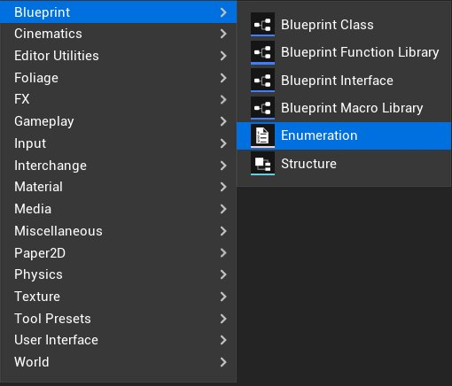
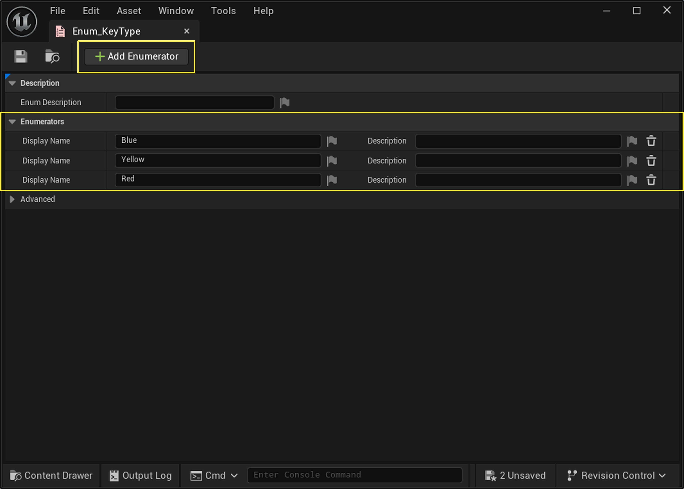
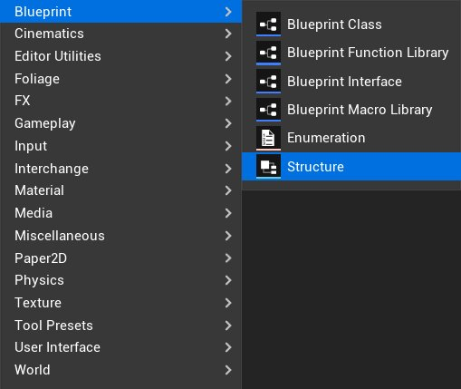
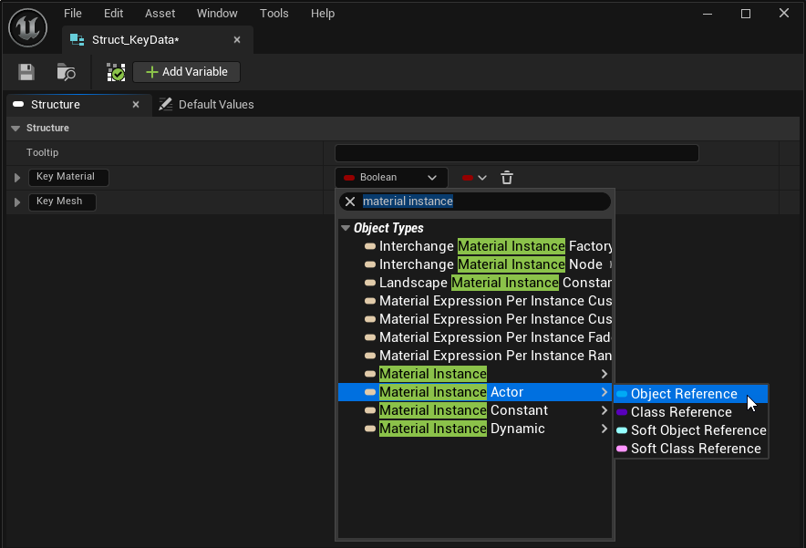
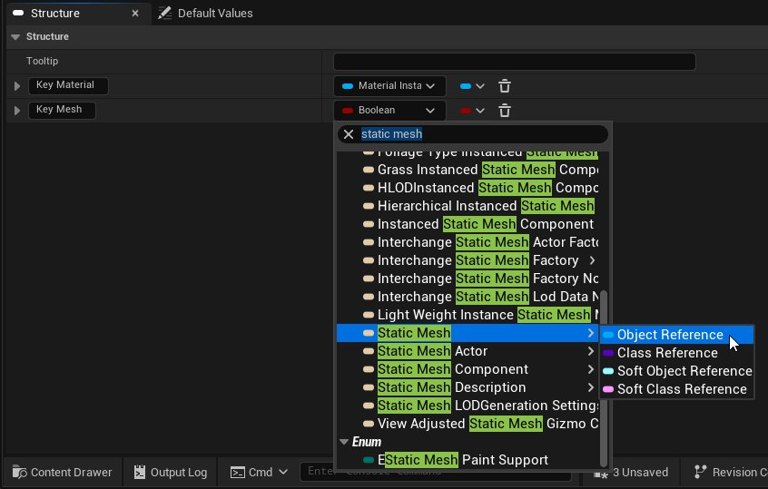
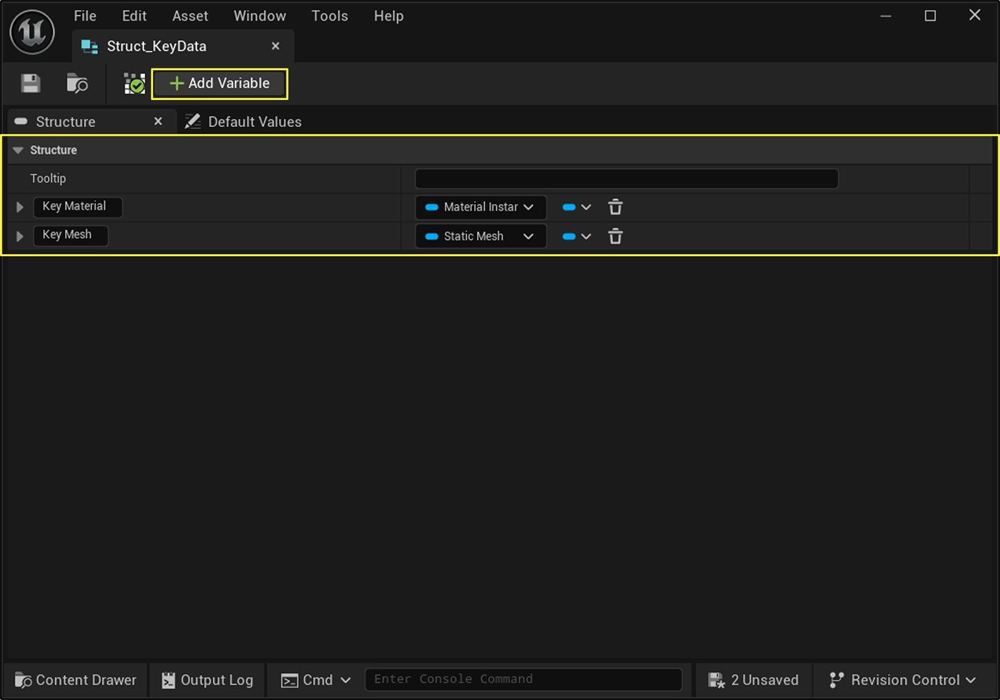
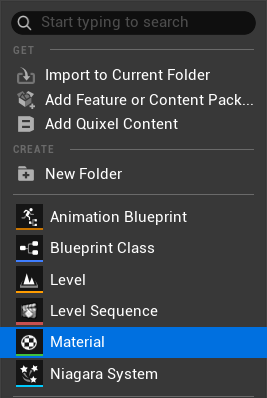
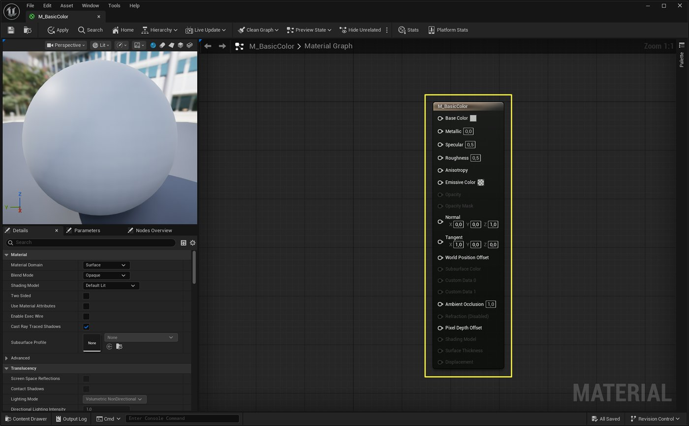

# 创建钥匙

> 路径：虚幻引擎5.7文档 / 入门指南 / 虚幻引擎新用户指南 / 设计解谜冒险游戏 / 创建钥匙

> 原始页面：https://dev.epicgames.com/documentation/unreal-engine/designer-02-create-a-key-in-unreal-engine

在本节中，你将创建第一个Gameplay物体：钥匙蓝图。

你将使用[蓝图可视化脚本](https://dev.epicgames.com/documentation/unreal-engine/blueprint-foundations?application_version=5.7)来为关卡中的Gameplay物体创建功能。 虚幻引擎中的蓝图是一种特殊的资产，它既有实体形态，又具备特殊功能（例如允许玩家拾取）。

蓝图可视化脚本系统能够让用户无需编写代码，即可通过基于节点的界面来创建Gameplay物体的行为。

首先，你需要定义钥匙在游戏中的Actor形态，并为其添加组件，从而呈现三种不同的钥匙（黄色椭圆形、蓝色矩形、红色圆锥体）。 无需为每种变体都创建单独的资产，蓝图能让你将所有选项都集成在同一个资产里。

接下来，你将为钥匙添加行为——让玩家角色能够将其拾取。 拾取物体是一种极为常见的Gameplay机制。

以下是你将创建的所有资产概览，用于制作一把拥有三种不同外观选项的钥匙，并允许玩家角色拾取该钥匙：

## 开始之前

请确保你已掌握[设计解谜冒险游戏](../index.md) 前几节讲述的以下内容：

- 了解虚幻编辑器UI，如**[内容浏览器](https://dev.epicgames.com/documentation/unreal-engine/BlueprintAPI/ContentBrowser?application_version=5.6)** 和 **[视口](https://dev.epicgames.com/documentation/unreal-engine/BlueprintAPI/Viewport?application_version=5.6)**。
- 对蓝图有基本认知。 更多信息请参阅 [《蓝图基础》](https://dev.epicgames.com/documentation/unreal-engine/blueprint-foundations?application_version=5.7) 文档。

你需要准备好在[项目设置与关卡粗模搭建](../designer-01-project-setup-and-level-blockout/index.md)中创建的下列资产：

- 一个已完成粗模搭建的关卡。

## 定义钥匙类型与属性

在创建钥匙蓝图前，要先定义一些关键数据，蓝图将依据这些数据来创建红、黄、蓝三种变体。

为了表示游戏中的不同钥匙类型，你将用到**枚举**（Enumeration） 和**结构体**（Structure） 这两种资产。

| 资产类型 | 说明 |
| --- | --- |
| **枚举** | 枚举（也称**Enum**）用于存储一个可在项目全局使用的唯一值列表。 对于钥匙，你将使用一个枚举来定义所有可选的钥匙类型（黄色椭圆形、蓝色矩形、红色圆锥体）。 |
| **结构体** | 结构体（也称**Struct**）用于将相关联的信息归类分组。 对于钥匙，你将使用一个结构体来存放它的所有属性：一个网格体（3D模型），以及应用到该网格体上的材质颜色（红、黄、蓝）。 |

每个枚举器好比是容器的标签，而结构体就是容器里存放的东西。

### 在枚举中定义钥匙类型

首先，创建一个枚举资产来定义钥匙的几种变体：红、黄、蓝。

请按照以下步骤，创建枚举资产：

1. 打开**内容浏览器**，或通过虚幻引擎左下角的**内容抽屉**（Content Drawer） 按钮开启一个**内容抽屉**。
2. 为本教程中将要创建的蓝图及辅助资产创建一个存放目录。 进入**Content > AdventureGame > Designer**文件夹。 在该文件夹中右键点击，然后选择**新建文件夹**（New Folder）。
3. 将新文件夹命名为`Blueprints`。
4. 在**Blueprints**文件夹内，再创建一个名为`Core`的文件夹。
5. 在**Core**文件夹中右键点击，依次选择**蓝图**（Blueprint） > **枚举**（Enumeration）。 将新资产命名为`Enum_KeyType`。

   
6. 双击该资产，即可在新窗口中打开它。

此枚举资产内含一个枚举器选项列表。

请按照以下步骤，向该枚举中添加钥匙类型：

1. 点击**添加枚举器**（Add Enumerator） 按钮三次，为列表添加三个新的枚举项。
2. 将第一个枚举器的**显示名称**（Display Name） 改为`Blue`。 将第二个改为`Yellow`，第三个改为`Red`。

   
3. 点击窗口左上角的**保存**（Save） 按钮，保存枚举资产。 也可以使用快捷键**CTRL + S**。

每添加一个枚举器，就相当于在列表中增加一个选项。 蓝、黄、红这三个值将用于区分不同的钥匙类型。

与蓝图不同，**数据资产**无需编译，因为它们本身不包含任何待编译的功能。

### 在结构体中定义钥匙属性

接下来，创建一个结构体来定义区分各个钥匙类型的属性：网格体形状和颜色。

请按照以下步骤，构建结构体（Struct）资产：

1. 再次打开**内容浏览器**，并确保当前路径为**Content > AdventureGame > Designer > Core**。
2. 在**Core**文件夹内右键点击，依次选择**蓝图** > **结构体**（Structure）。 将该资产命名为`Struct_KeyData`。

   
3. 双击此新资产，即可在新窗口中打开其属性面板。
4. 该结构体在创建时会默认带有一个名为**MemberVar_0**的变量。 点击**添加变量**（Add Variable） 来添加第二个变量。
5. 将第一个变量命名为`Key Material`，第二个变量命名为`Key Mesh`。
6. 每个变量都有一种与之对应的**数据类型**。 该类型默认为布尔值（即True或False）。 你需要更改这两个变量的类型。

   找到**Key Material**变量，点击其类型下拉菜单（当前显示为**Boolean**）。 在搜索框中输入`material instance`，将鼠标悬停于**Material Instance**上，然后选择**对象引用**（Object Reference）。

   
7. 重复以上步骤，将**Key Mesh** 的变量类型改为**Static Mesh > Object Reference**。

   
8. **保存**此结构体资产。

至此，你已成功为每种钥匙类型创建了两个属性——用于设定钥匙颜色的“Key Material”，以及用于设定钥匙形状的“Key Mesh”。

你已经完成了钥匙数据的定义工作。 接下来，你将设置钥匙的颜色，并着手构建各种类型的钥匙。

## 创建钥匙颜色

现在你已拥有蓝、黄、红三种钥匙类型的数据，接下来将创建对应颜色的**材质**，并将它们分别指定给各类钥匙。

在虚幻引擎中，**材质**决定了物体表面的视觉效果。 它能控制颜色、纹理、光泽度、透明度等诸多方面。 **材质实例**是一种材质的副本，它继承了父材质的基础属性，但允许你覆盖颜色、纹理等特定设置，从而避免了从零开始创建全新材质的麻烦。

在本例中，你将创建一个基础**材质**，用它来定义游戏中所有钥匙的通用属性。 然后，你将基于该材质创建两个**材质实例**，它们会继承所有属性，但颜色将被覆盖。

> [!NOTE]
> 本节只会简要介绍材质的创建步骤，以便你在后续教程中使用，不会深入讲解材质的原理。

请按照以下步骤，创建带颜色的材质资产：

1. 打开**内容浏览器**。 进入**Content > AdventureGame > Designer**文件夹。
2. 在**Designer**文件夹内右键点击，并选择**新建文件夹**。 将该文件夹命名为`Materials`。
3. 进入**Materials**文件夹。 在该文件夹内右键点击，选择**材质**（Material） 以创建材质资产。

   
4. 将此材质资产重命名为`M_BasicColor`。

   > [!NOTE]
   > 本教程的示例关卡使用`M_`前缀作为命名约定，用于识别材质资产。
5. 双击该材质即可将其打开。 此时将在一个新窗口中打开**材质编辑器**（Material Editor）。

**材质编辑器**是一种基于节点的编辑器，这意味着它在某些方面与蓝图可视化脚本的构建方式类似。 你会看到一个名为**M_BasicColor**的节点，这是用于更改该材质属性的主节点。

**底色**（Base Color） 属性决定了此材质的颜色。 点击**底色**属性旁的灰色方块即可手动设定颜色。

与其使用“颜色拾取器”（Color Picker），不如创建一个**颜色**（Color） 参数节点，这样一种材质就能呈现出多种颜色。 创建参数的效果等同于添加变量，即把材质颜色变成一个能在材质实例中编辑的参数。

请按照以下步骤，创建颜色参数节点：

1. 在**底色**属性旁，可以看到一个**引脚**（Pin）。 点击引脚，然后拖动到图表中的空白处。

   > 图片已省略：Base Color Material
2. 在弹出的列表中，于搜索框内键入`VectorParameter`，并选择**矢量参数**（VectorParameter）。

   操作完成后，会生成一个包含颜色拾取器的新节点。 矢量型变量有三个值，正好可以用来定义一种颜色的RGB值。
3. 节点创建后，其默认名称**Param**会处于高亮状态。 把节点改名为**颜色**，这样在材质实例中会更易于辨识。

   > [!TIP]
   > 若“Param”没有高亮，可以先点击节点，再点击节点名称来重命名。
4. 在新建的**颜色**节点上，点击**默认值**（Default Value） 属性旁的方格图案，以打开颜色拾取器。

   > 图片已省略：Checkered Box on the Color Parameter
5. 在“十六进制sRGB”（Hex sRGB）字段里，把值改为黄色的`F7DE0000`，然后点击“确定”。

   > 图片已省略：取色器
6. 点击**保存**（Save） 后关闭此材质资产。

下一步是创建材质实例，这样就能在不重做主材质的基础上，添加更多的颜色变体。

请按照以下步骤，为不同钥匙颜色创建三个材质实例：

1. 打开**内容浏览器**，在其中右击之前创建的`M_BasicColor`资产。 在右键菜单的靠前位置，点击**创建材质实例**（Create Material Instance）。
2. 把此材质实例资产命名为`M_BasicColor_Red`。 双击资产将其打开。

   > 图片已省略：Material Instance Window

   可以看到，这个窗口和材质编辑器有所不同。 这是因为**材质实例**无需像**材质**那样提供全套编辑功能，它的核心作用是修改基础**材质**中已定义的参数。
3. 在**细节**面板中，找到顶部的**参数组**（Parameter Groups）分类，并将其下的**全局向量参数值**（Global Vector Parameter Values）展开。

   > 图片已省略：全局向量参数值
4. 此时会看到一个未启用的**颜色**参数，它对应着在基础材质中添加的那个VectorParameter节点。 勾选“颜色”参数旁边的选框，从而启用并覆盖该参数。

   > 图片已省略：Global Vector Parameter Values Color Heading
5. 点击“颜色”参数旁的色板，将其**十六进制sRGB**值设为`F7005A00`。 这样，材质实例的颜色就变成了亮红色。
6. 接下来，请自行完成剩余步骤！ 重复以上流程，再创建两个材质实例：

   1. 创建名为`M_BasicColor_Blue`的材质实例。 将“颜色”参数覆写为**十六进制sRGB** = `00AFF700`，然后**保存**该资产。
   2. 创建名为`M_BasicColor_Yellow`的材质实例。 此实例直接沿用基础材质的颜色，**保存**资产即可。

> [!TIP]
> 材质实例的参数继承自其父材质，所以除非主动覆盖，否则参数值将始终与父材质保持一致。 举例来说，如果打开`M_BasicColor`材质并修改了颜色，那么`M_BaseColor_Yellow`这个材质实例的颜色也会随之改变。而蓝色和红色的材质实例则会因为参数已被覆盖，而维持原色不变。

## 创建钥匙蓝图

准备工作已经完成，现在开始创建钥匙蓝图。 钥匙蓝图是一种资产，可以将其添加到关卡中，从而创建一个可被玩家拾取的实例化Actor。

请按照以下步骤，为钥匙创建一个新的蓝图类：

1. 打开**内容浏览器**，进入**Content > AdventureGame > Designer > Blueprints**文件夹。
2. 新建一个名为`Key`的文件夹。
3. 打开**Key**文件夹。 在文件夹内右击，然后选择**蓝图类**（Blueprint Class）。
4. 在“选取父类”（Pick Parent Class）窗口中，选择**Actor**。

   > 图片已省略：选择父类
5. 把这个新Actor命名为`BP_Key`，然后双击将其打开。

   > [!NOTE]
   > 在本教程的示例关卡中，使用`BP_`前缀作为蓝图类的命名约定。

**Actor**是一种常见的父类，适用于所有可被放置到关卡中的物体。它不像“角色”（Character）父类那样自带移动等功能，但可以用来创建交互和实现逻辑。

> [!TIP]
> 若想将窗口停靠在主编辑器内，只需将其标签页拖至关卡标签页旁即可。
>
> Docking Blueprint Editor Window

为了让钥匙蓝图正常运行，还需要为其添加几个要素：

1. 一个静态网格体，用作钥匙在项目中的视觉形象。
2. 一个碰撞体积，用于检测玩家是否进入可拾取钥匙的范围。
3. 一种用于区分钥匙类型的方式。
4. 一段游戏逻辑，用来定义玩家与钥匙碰撞时触发的事件。

> [!TIP]
> 所谓碰撞，即是在运行时检测两个物体是否发生接触。 盒体、胶囊体和球体碰撞是用于实现这些检测的几种常用形状。

### 设置钥匙组件

首先来设置钥匙的组件，这样才能在游戏世界中放置实体并与之交互。

请按照以下步骤，为钥匙添加碰撞组件和网格体形状：

1. 在`BP_Key`中，切换到**视口** 标签页。
2. 在左上方的**组件**（Components）面板中，点击**添加**（Add），然后搜索并选中**胶囊体碰撞**（Capsule Collision）。

   > 图片已省略：Capsule Collision Component

   这就是玩家拾取钥匙时所接触的碰撞体积。 若没有这个组件，玩家将无法检测到钥匙。

   > [!TIP]
   > 当然也可以直接在钥匙网格体上添加碰撞，但使用独立的碰撞形状有助于平滑复杂的几何轮廓，进而提升碰撞检测的准确度和游戏性能。
3. 选中**胶囊体**组件，再次点击**添加**。 这一次，搜索并选择一个**球体**（Sphere）基本形状，然后将其改名为`KeyMesh`。

   > [!TIP]
   > 先选中**胶囊体**组件再添加**球体**网格体的操作，会使网格体成为**胶囊体**的子组件，**胶囊体**则是网格体的父组件。 子组件将继承其父组件的所有属性。
4. 设置**KeyMesh**组件的步骤如下：

   1. 选择**KeyMesh**组件。 在**细节**面板中，找到**变换**（Transform）类别。 将**缩放**（Scale）旁边的值分别改为`0.3`、`0.3`和`1.0`。

      > 图片已省略：Key Mesh Scale

      此操作会将网格体在两个轴向上压扁，使其变为椭圆形。
   2. 在**碰撞**（Collision）类别下，把**碰撞预设**（Collision Presets）设为**无碰撞**（NoCollision）。

      > 图片已省略：Collision Presets

      由于已经使用胶囊体组件处理碰撞，此处关闭网格体自身的碰撞，能确保玩家角色在收集钥匙时不会因撞上静态网格体而弹开。
5. 设置胶囊体组件的步骤如下：

   - 选择**胶囊体**组件。 在**细节**面板的**变换**类别下，把**位置**（Location）设为`0.0`、`0.0`、`80.0`。

     这样可以使钥匙悬浮在空中。 由于网格体是子组件，会继承父组件的所有属性，因此它会跟随胶囊体一起移动。
   - 在**形状**（Shape）类别下，把**胶囊体半****高**（Capsule Half Height）设为`60.0`。 此操作会拉伸碰撞体积，使其能更好地包裹住整个网格体。
6. 在**组件**面板中，选中**默认场景根节点**（DefaultSceneRoot）。 点击**添加**，然后选择**旋转运动**（Rotating Movement）。 该组件能让钥匙缓慢旋转，使其在场景中更加醒目。

   > 图片已省略：Rotating Movement
7. **保存**（Save）并 **编译**（Compile） 蓝图。

### 设置钥匙属性

钥匙本身也需要存储一些信息，比如它是什么类型的钥匙，以及该类型对应的材质和网格体分别是什么。

这项设置需要用到之前创建的“枚举钥匙类型”（Enum Key Type）和“结构体钥匙数据”（Struct Key Data）。

请按照以下步骤，为蓝图添加一个钥匙类型变量：

1. 在**组件**面板的下面是**我的蓝图**（My Blueprint）面板。 在**变量（Variables）**部分，点击加号（**+**）按钮添加一个新变量。
2. 把变量命名为`KeyType`。
3. 它的默认类型是**布尔值**。 点击类型下拉菜单，搜索并选中**枚举键类型**（Enum Key Type）。 这个变量类型正是之前创建的枚举，现在可以派上用场了。 这意味着**KeyType**变量的值只能是**红**、**黄**或 **蓝**中的一个。

   > [!TIP]
   > 在蓝图中，变量类型也叫**引脚类型**（pin type），因为节点上的变量都显示为引脚。
4. 点击**KeyType**变量旁边的**眼睛**图标，将其设为公开可编辑变量。 这一步至关重要，只有这样，后续才能在虚幻编辑器中修改该变量的值，从而设定关卡中每个钥匙实例的类型。

   > 图片已省略：Key Type Variable
5. 选中**KeyType**变量。 在**细节**面板中，找到**类别**（Category）属性，删除旁边的**Default**，然后输入`Setup`。

   这样，KeyType属性就会显示在**细节**面板中名为**Setup**的分类下。

   > 图片已省略：Key Type Blue

每一种钥匙类型都应对应一种形状和颜色的组合。 下一步将创建一个“映射”（Map）变量来定义这些组合。

请按照以下步骤，设置一个能将钥匙类型映射到对应形状和颜色的变量：

1. 在**我的蓝图**面板中，添加一个名为**KeyMap**的新变量，类型同样设为**枚举键类型**。
2. 选中**KeyMap**变量，在**细节**面板中可以看到，类型下拉菜单旁还有一个菜单，用于设定变量的**容器类型**（container type），它决定了变量能存储多少个值。 将容器类型改为**映射**（Map）。

   > 动图已省略：Set Variable Container Type
3. 当容器类型设为**映射**后，其旁边会出现一个新的类型下拉菜单。 这个下拉菜单用于指定映射中存储的数据类型。 此前已在结构体中定义好了钥匙数据，所以这里只需点击下拉菜单，并将数据类型设为**Struct_KeyData**。
4. **编译**蓝图，这样才能开始为KeyMap填充数据，即为每个KeyType选项配置对应的材质和网格体。
5. 在**细节**面板中，找到**默认值**类别。
6. 点击**Key Map**旁的**+**按钮，为该映射添加一个新**元素**。
7. 将**钥匙类型**从默认的**蓝色**改成其他颜色。 如果不先修改，可能会因为默认的钥匙类型已经存在而无法添加新元素。
8. 重复此操作两次，创建总共三个元素。
9. 添加完三个映射元素后，用以下数值来设置你的钥匙类型：

   | 键类型 | 钥匙材质 | 钥匙网格体 |
   | --- | --- | --- |
   | 红色 | `M_BasicColor_Red` | 椎体 |
   | 黄色 | `M_BasicColor_Yellow` | 球体 |
   | 蓝色 | `M_BasicColor_Blue` | 正方体 |

   > [!NOTE]
   > 请注意，项目中不止一个名为“`正方体`”和“`球体`”的网格体。 搜索这些网格体时，正确的`正方体`和`球体`应该会作为列表中的第二个结果出现。 验证方法是，将鼠标悬停在资产上，其工具提示显示的**文件路径（Path）**应为 /**Engine/BasicShapes**。
   >
   > > 图片已省略：正方体静态网格体的文件路径图示

   完成后，**KeyMap**变量的设置应与下图一致：

   > 图片已省略：KeyMap设置参考图

   KeyMap设置参考图
10. **保存**（Save）并 **编译**（Compile） 蓝图。

最后一步是创建一个变量，用于在玩家角色触碰钥匙时，保存对该角色的引用。

可按照以下步骤，创建一个能存储其他Actor引用的变量：

1. 在**变量（Variables）**区域中，新建一个变量并将其命名为`OtherActor`。
2. 将该变量的类型设置为**Actor > 对象引用**（Actor > Object Reference）。
3. 在**细节**面板中，将**容器类型**（Container Type）设置为**单个**（Single）。此设置的原因在于，每次与钥匙交互的Actor只有一个（即玩家），因此无需使用其他容器类型。

完成上述设置后，钥匙的变量部分应如下图所示：

> 图片已省略：钥匙的变量设置

### 测试钥匙功能

接下来，实际测试一下钥匙，以确认其当前在游戏中的表现。

切换回关卡编辑器，从**内容浏览器**中找到`BP_Key`资产并将其拖放到关卡中。 至此，一个可随时在游戏中实例化的蓝图就创建完成了，这是一个重要的阶段性成果。 不过，此时钥匙在场景中仍显示为灰色。

> 图片已省略：BP_Key显示为灰色

在选中钥匙的状态下，查看其**细节**面板。 在面板中找到之前创建的**设置**（Setup）类别，然后定位到**钥匙类型**（Key Type）属性。 尽管可以将该属性的值在**蓝色**、**黄色**和**红色**之间切换，但钥匙的灰色椭圆形状并不会因此改变。

出现这种情况的原因在于，尽管已经为钥匙添加了组件和数据，但它们之间还没有逻辑关联。 这正是蓝图可视化脚本发挥作用的地方。通过它构建由节点和连线组成的逻辑，可以在蓝图内部传递信息并据此执行操作。

## 通过蓝图函数设置钥匙的值

下一步是创建一个函数，以连接KeyMap和KeyMesh组件，实现根据钥匙类型自动设置其网格体形状和材质颜色的功能。

> [!NOTE]
> **函数**（Function）是一套可复用的蓝图节点集合，用于完成某项特定任务。 使用函数不仅能让节点图表更有条理，还能在需要时多次执行（即“调用”）同一段逻辑，而无需重复搭建。 你可以借助函数，从其他蓝图触发该部分蓝图逻辑的执行。

我们不会在钥匙蓝图中直接创建这个函数，而是将其置于一个新的**蓝图函数库**（Blueprint Function Library）中。这是一种专门存放可复用函数集合的蓝图资产。 库中的函数并不与任何特定的蓝图或Actor相关联。 相反，它们在整个项目中是全局可访问的。 函数库能将实用函数集中管理，避免在多个蓝图间反复复制粘贴同一段逻辑。

请按照以下步骤，创建一个蓝图函数库并添加新函数：

1. 打开**内容浏览器**，并进入**Content > AdventureGame > Designer > Core**路径。
2. 在**Core**文件夹空白处右键点击，在菜单中选择**蓝图（Blueprint）**，然后点击**蓝图函数库**。 将新建的资产命名为`BPL_FPGame`，然后双击打开。

   > 图片已省略：创建蓝图函数库
3. 打开编辑器后，在**我的蓝图**（My Blueprint）面板的**函数**（Functions）区域中，可以看到一个系统自动创建并已高亮选中的新函数。 将该函数命名为`fnBPLSetKey`。

   > 图片已省略：添加并命名新函数

   > [!NOTE]
   > 本教程的示例项目遵循一套命名规范：`BPL`代表函数来源于蓝图函数库，而`fn`是函数名的前缀。 这种规范有助于直观地理解SetKey的性质及其来源，同时也方便在节点操作列表中快速搜索到该函数。

下一步是为该函数配置所需的输入和输出参数。

**输入**（Input）是调用函数时传递给它的值，函数将基于这些值进行运算。 它们的行为与变量十分相似。 **fnBPLSetKey**函数的功能是处理KeyType、KeyMap和KeyMesh三者间的逻辑，因此需要将这三者都设为输入。

**输出**（Output）则是函数执行完毕后返回给调用方的信息，通常是运算结果。 对于**fnBPLSetKey**函数而言，它无需任何输出。

请按照以下步骤，为**fnBPLSetKey**函数添加入参：

1. 选中**fnBPLSetKey**函数。 在**细节**面板中，找到**输入**类别，并点击旁边的**+**按钮来添加一个新输入。

   > [!NOTE]
   > 和变量一样，每个输入也需要定义其名称、变量引脚类型和容器类型。
2. 将此输入的名称改为`静态网格体数组`（Static Mesh Array）。
3. 将其类型设置为**静态网格体组件 > 对象引用**（Static Mesh Component > Object Reference）。 此时观察函数的节点图表，会发现紫色的函数入口节点上出现了一个新的引脚，其样式精确地反映了刚创建的输入类型（静态网格体数组）。
4. 点击类型旁边的**容器类型**下拉菜单，并选择**数组**（Array）。

   > 图片已省略：BPL中的静态网格体数组输入

   > [!NOTE]
   > **数组**是一种能在单个容器中存储多个同类型值的变量。 存储在数组中的每个值被称为一个**数组元素**。
5. 接下来，设置另一个输入，使其与钥匙的**KeyMap**属性相匹配：

   1. 添加一个新输入，命名为`KeyMap`。
   2. 点击**引脚类型**（Pin Type）下拉菜单，将其设置为**枚举键类型**（Enum Key Type）。
   3. 点击**容器类型**下拉菜单，并选择**映射**（Map）。
   4. 点击**值类型**（Value Type）下拉菜单，将其设置为**结构体钥匙数据**（Struct Key Data）。
6. 接着，设置Key Type输入：

   1. 添加一个名为`Key`的新输入。
   2. 将其**容器**设为**单个**，类型保持为**枚举键类型**。

完成后，三个输入参数应如下图所示：

> 图片已省略：最终的输入参数配置

输入参数配置完毕，接下来开始构建函数的节点逻辑。 在图表面板中，可以看到函数入口节点**fnBPLSetKey**上，已经带有刚刚创建的**静态网格体数组**、**Key Map**和**Key**这三个输入引脚。

> [!NOTE]
> 蓝图图表导航操作：
>
> - **平移（Pan）：**按住鼠标右键并拖动。
> - **缩放（Zoom）：**滚动鼠标滚轮。

请按照以下步骤，为函数添加逻辑，以实现通过新的Key Mesh来设置钥匙形状的功能：

1. 从该节点的三角形**执行（exec）**引脚上拖出连线，搜索并选择**For Each Loop**节点。 这样就创建了一个新的节点，并自动连接至**fnBPLSetKey**节点。

   **For Each Loop**节点的作用是遍历数组中的每一个项，并对其执行指定操作。 任何连接到“循环主体”（Loop Body）执行引脚的逻辑，都会为数组中的每个元素执行一次。 待循环遍历完所有元素后，执行流将从“已完成”（Completed）引脚继续。

   > 图片已省略：事件图表01
2. 将**fnBPLSetKey**节点的**静态网格体数组**引脚连接到**For Each Loop**节点的**数组**引脚。

   > 图片已省略：事件图表02

   > [!NOTE]
   > 尽管当前钥匙只有一个网格体，但**fnBPLSetKey**的输入被设计为静态网格体数组，是为了使其能够兼容处理拥有多个网格体的各类关卡物体。 例如，在本系列教程的下一部分中，将要处理的门蓝图就包含左右两扇门，即两个静态网格体。
3. 接下来，从**fnBPLSetKey**节点的**Key Map**引脚拖出连线，搜索并添加一个**查找**（Find）节点。 该节点能根据给定的Key Type，从KeyMap中查询出对应的网格体和材质信息。
4. 在**Find**节点的**蓝色输出**引脚上右键点击，然后选择**拆分结构体引脚**（Split Struct Pin）。

   > 图片已省略：Find节点的“拆分结构体引脚”操作

   此操作会将原输出引脚拆分为**钥匙材质（Key Material）**和**钥匙网格体**（Key Mesh）两个引脚，它们分别对应`Struct_KeyData`结构体中的两个变量。
5. 将**fnBPLSetKey**节点的**Key**引脚，连接到**Find**节点的青绿色**Key**输入引脚。

   > 图片已省略：连接Key引脚
6. 在**For Each Loop**节点上，从**循环主体**引脚拖出连线，搜索并添加一个**Is Valid**节点（位于**结构体**类别下）。 注意，应添加旁边带有问号图标（**?**）的**Is Valid**节点，该版本专用于检查结构体这类值的有效性。

   > 图片已省略：连接Loop Body引脚

   该节点用于检查传入函数的网格体形状是否有效。 如果有效，则同时设置该对象的静态网格体和材质。 如果无效，则只更新其材质。
7. 将**Find**节点的**钥匙网格体**引脚，连接到**Is Valid**节点的**输入对象**（Input Object）引脚。

   > 图片已省略：连接Key Mesh引脚
8. 从**Is Valid**节点的**Is Valid**执行引脚拖出连线，并关闭**上下文关联**（Context Sensitive）选项。

   > 图片已省略：关闭上下文关联选项
9. 搜索并添加**设置静态网格体**（Set Static Mesh）节点。
10. 从**For Each Loop**节点拖出**数组元素**引脚，并将其连接到**设置静态网-网格体**节点的**目标（Target）**引脚。

    > [!TIP]
    > **目标**引脚决定了该节点将对哪个实体生效。 此处的意图是在KeyMesh上执行“设置静态网格体”操作，因此目标应为“静态网格体数组”中的当前元素。
11. 从**Find**节点拖出**钥匙网格体**引脚，并将其连接到**设置静态网格体**节点的**新建网格体**（New Mesh）引脚。

完成后，函数的图表应如下图所示：

> 图片已省略：事件图表03

> [!TIP]
> 双击两个节点之间的连线，可以创建一个额外的连接点。 将鼠标悬停在连接点上，待光标变为四向箭头时，即可拖动它来调整连线的走向。 这样有助于自由地排布节点和连线，优化图表布局。
>
> > 图片已省略：蓝图连线的转向节点
>
> 选中一条连线后，按**Q**键可以将其快速拉直。

钥匙的新网格体形状设置逻辑已完成，接下来只需设置其新材质。

请按照以下步骤，添加用于设置钥匙新材质颜色的逻辑：

1. 从**设置静态网格体**节点的**执行**引脚拖出连线，搜索并创建**设置材质**（Set Material）节点（位于**渲染 > 材质**类别下）。
2. 将其**目标**引脚连接到**For Each Loop**节点的**数组元素**引脚。
3. 将其**材质**引脚连接到**Find**节点的**钥匙材质**引脚。

   > 图片已省略：事件图表04
4. 为确保在未提供有效网格体的情况下也能设置材质，需要将**Is Not Valid**引脚连接到**设置材质**节点的执行引脚。 可以添加两个连接点来调整连线的走向。
5. **保存**（Save）并 **编译**（Compile） 蓝图。

此时，完整的**fnBPLSetKey**函数应如下图所示：

Blueprint

> [!NOTE]
> 若要将这组节点复制到自己的项目中，可点击**复制完整代码片段（Copy Full Snippet）**，然后在蓝图对应图表的空白处点击，最后按**Ctrl**+**V**粘贴。 粘贴后，需要手动将函数入口节点的输出引脚连接到**For Each Loop**和**Find**节点的相应输入引脚。

### 初始化钥匙

函数已经创建完毕，现在可以在钥匙蓝图内部调用它了。 首先要做的，是根据为钥匙指定的KeyType来初始化它。

> [!TIP]
> 对蓝图关卡物体进行**初始化**（Initialize），指的是在物体被创建时（无论是在视口中放置，还是在游戏开始时生成）就对其进行初始设置。

请按照以下步骤，初始化钥匙：

1. 从**构造脚本**（Construction Script）节点的**执行**引脚拖出连线，搜索并添加之前创建的**fnBPLSetKey**函数节点。

   > 图片已省略：添加fnBPLSetKey节点

   该函数节点需要**静态网格体数组**、**Key Map**和**Key**三个输入，这些数据都将由`BP_Key`蓝图自身提供。
2. 在**我的蓝图**面板中，于**变量**部分的**设置**类别下，将**KeyType**变量拖入节点图表，放置在函数节点旁边。

   > 动图已省略：获取变量引用节点
3. 此时会弹出一个菜单，询问是想**获取（Get）**还是**设置**（Set）该变量的值。 在当前情况下，需要读取钥匙的类型，因此选择**获取**。
4. 将新创建的**获取钥匙类型**（Get Key Type）节点的输出引脚，连接到**Fn BPLSet Key**节点的**Key**输入引脚。

   > 图片已省略：连接Get Key Type节点
5. 对**KeyMap**变量重复上述过程。 将其拖入节点图表并选择创建**Get**节点。 将该节点的输出引脚连接到**Fn BPLSet Key**节点的**KeyMap**输入引脚。

   > 图片已省略：连接Get Key Map节点
6. 接下来，从**组件（Components）**面板中将**KeyMesh**拖入图表，并选择创建**Get**节点。
7. **Key Mesh**节点输出的是单个静态网格体组件引用，而函数节点的输入需要一个数组。 虚幻引擎会自动处理这种转换：只需将**Key Mesh**引脚直接连接到**Fn BPLSet Key**节点的**静态网格体数组**输入引脚。
8. **保存**并**编译**蓝图。

此时，钥匙的构造脚本应如下图所示：

Blueprint

> [!NOTE]
> 如果是将代码片段粘贴到项目中，则需要手动将**FnBPLSetKey**节点的执行输入引脚连接到**构造脚本**节点的执行输出引脚。

### 测试钥匙的功能

现在可以测试刚刚在钥匙和新函数中实现的颜色切换功能了。

关闭蓝图编辑器窗口，回到主关卡编辑器界面。

因为**Key Type**的默认值是**Blue**，所以关卡中的钥匙实例应该已经自动变成了蓝色的矩形。

选中关卡中的钥匙Actor，在**细节**面板的**设置**部分下，尝试将**Key Type**的值在**黄色**和**红色**之间切换。 在切换属性值时，应该能看到关卡中的钥匙实例实时地更新其颜色和形状。

> [!NOTE]
> 若发现矩形和椭圆形钥匙在场景中尺寸过大，这通常意味着在构建**KeyMap**时指定了错误的网格体资产。 请返回**KeyMap**的设置界面，检查并确保球体（Sphere）和正方体（Cube）网格体均源自 /**/Engine/BasicShapes**这一文件路径。
>
> > 图片已省略：正方体文件路径图示

## 为玩家角色授予钥匙

游戏需要一套机制，首先要让玩家能够拾取钥匙，其次要让其他物体能检测到玩家当前持有的钥匙。 实现这套机制，我们将用到**蓝图接口**（Blueprint Interface）。

### 利用蓝图接口实现蓝图间的通信

**蓝图接口**是一种资产，它本身只存储一个函数声明列表，任何实现了该接口的蓝图都可以调用这些函数。 **实现**（implement）接口，意味着赋予蓝图一种能力，使其可以对一组共享的事件（或称**消息**）作出响应。

假设在一个同时存在玩家和NPC角色的游戏中，钥匙必须能够准确识别交互对象，确保只有玩家角色才能触发拾取行为。 要做到这一点，就需要创建一个蓝图接口，并由`BP_AdventureCharacter`玩家蓝图来实现它。 这个接口就像一张“通行证”，玩家蓝图一旦持有它，就获得了处理“拾取钥匙”这类特定消息的资格。

当希望不同的蓝图之间能互相通信，但又不希望它们产生直接依赖（即了解对方的内部细节）时，使用蓝图接口是理想的解决方案。

可请按照以下步骤，创建一个包含两个函数的蓝图接口：

1. 打开**内容浏览器**，进入**Content > AdventureGame > Designer > Core**目录。
2. 在**Core**文件夹的空白处右键点击，在菜单中选择**蓝图**（Blueprint），然后点击**蓝图接口**（Blueprint Interface）。 将该新资产命名为`BPI_PlayerKeys`，然后双击打开。

   可以看到，这个窗口的布局与常规的蓝图编辑器非常相似。 在编辑器右侧，是**我的蓝图**（My Blueprint）面板，其中会列出该接口包含的所有函数。 该面板下方则是**细节**面板。
3. 在**我的蓝图**面板中，可以看到系统已自动创建了一个新函数，并处于选中状态。 将此函数命名为`fnBPIAddKey`。
4. 选中该函数，然后在**细节**面板中，找到**输入**（Inputs）栏，点击旁边的**+**按钮来添加一个新的输入参数。
5. 将该输入参数命名为`KeyType`，并将其类型设置为**枚举键类型**（Enum Key Type）。

   > 图片已省略：已添加的输入参数
6. 同样在**细节**面板里，找到**类别（Category）**字段，输入`Keys`。 为函数设置类别后，在其他蓝图的接口列表中就能更容易地找到它。
7. 接下来，在“我的蓝图”面板中添加第二个函数，命名为fnBPIGetKeys，它将负责返回玩家持有的钥匙。

   > 图片已省略：添加新函数
8. 选中这个新的**fnBPIGetKeys**函数，在**细节**面板中找到**输出（Outputs）**栏，点击**+**按钮添加一个名为**Held Keys**的输出参数。
9. 将其类型设为**枚举键类型**，并将容器类型设为**数组**（Array），这样它就能返回玩家持有的所有钥匙。

   > 图片已省略：添加输入
10. **保存**并**编译**接口。 完成后，即可关闭**BPI_PlayerKeys**的编辑器窗口。

    > [!NOTE]
    > 接口与蓝图系统紧密相关，因此和普通蓝图一样，在修改后也需要编译才能生效。

值得注意的是，在蓝图接口中，我们只定义了函数的“声明”（即函数名、输入和输出）。 接口函数本身并不包含任何逻辑，但其结构（特别是输入和输出的定义）决定了它们在其他蓝图中的具体用法。

具体来说，没有输出的接口函数（如**fnBPIAddKeys**）通常作为事件来使用。而带有输出的函数（如**fnBPIGetKeys**），则可以像常规函数一样在实现它的蓝图中添加逻辑。

### 创建新的玩家角色

在为角色添加新功能前，我们先不直接修改默认角色，而是通过复制它来创建一个自定义的变体版本。 同时，还需要更改游戏模式（Game Mode）的设置，以便在游戏中使用这个新角色。

请按照以下步骤，为项目创建专属的玩家角色：

1. 打开**内容浏览器**，进入**Content > AdventureGame > Designer > Blueprints**文件夹。
2. 首先，创建一个名为`Characters`的新文件夹。
3. 接着，在内容浏览器中进入**Content > Variant_Shooter > Blueprints > FirstPerson**文件夹。
4. 将`BP_ShooterChracter`资产拖动到刚才创建的**Characters**文件夹中，在弹出的菜单中选择**复制到此处**（Copy Here）。
5. 在**Characters**文件夹中，右键点击新复制的资产，将其重命名为`BP_AdventureCharacter`。
6. 前往**编辑（Edit）> 项目设置（Project Settings）**。 在编辑器左侧面板中，打开**项目 > 地图和模式**（Project > Maps & Modes） 设置。
7. 在**DefaultGameMode（默认游戏模式）**设置下，展开**SelectedGameMode**（所选游戏模式）的选项。

   **游戏模式（Game Mode）**是一种定义游戏世界规则的资产，其中一项重要规则就是指定默认的玩家角色。 现在需要修改该设置，让游戏使用我们新创建的角色。 游戏模式的设置既可以在这里直接修改，也可以通过打开其资产文件进行编辑。
8. 将**默认Pawn类（Default Pawn Class）**选项更改为`BP_AdventureCharacter`。

   > 图片已省略：默认Pawn类设置
9. 完成后，关闭**项目设置**（Project Settings）窗口。

> [!TIP]
> 如果只想为当前关卡指定不同于项目默认设置的游戏模式，应当使用**世界设置**（World Settings）面板。 该面板通常位于**细节**面板的旁边。
>
> > 图片已省略：世界设置
>
> 如果**世界设置**面板不可见，可以从主菜单栏的**窗口**（Window）菜单中选择**世界设置**（World Settings）来打开它。

### 为玩家添加蓝图接口

本节将对玩家角色蓝图进行修改。 这个角色蓝图本身已经预设了许多实用的函数和接口，我们要做的是为其添加之前创建的**BPI_PlayerKeys**接口，从而赋予它拾取钥匙的能力。

接下来，将修改`BP_AdventureCharacter`蓝图，为其添加钥匙相关的功能。

请按照以下步骤，为角色添加蓝图接口函数：

1. 在内容浏览器中，定位到**Characters**文件夹并打开`BP_AdventureCharacter`。
2. 首先需要添加**BPI Player Keys**接口，以确保该玩家蓝图能够实现此接口。 在蓝图编辑器顶部的工具栏中，点击**类设置**（Class Settings）按钮。
3. 在编辑器右侧的**细节**面板中，找到**接口 > 已实现接口（Interfaces > Implemented Interfaces）**栏，点击**添加**（Add）按钮，然后从下拉列表中选择`BPI_PlayerKeys`。 此操作将使该角色蓝图能够实现**fnBPIGetKeys**和**fnBPIAddKey**这两个接口函数。

   > 图片已省略：添加接口示意图
4. **编译**该蓝图，使接口函数的改动生效。 编译后，在**我的蓝图**面板的“接口”（Interfaces）区域，可以看到新增了一个**Keys**类别，其中包含了**fnBPIAddKey**和**fnBPIGetKey**两个函数。 其中一个函数的图标是黄色的，这表示它在当前蓝图中将作为**事件**来使用。

### 存储已拾取的钥匙

玩家需要一个变量来存储已收集的钥匙。 考虑到玩家可能同时持有多把钥匙，这个变量应设为数组类型。

请按照以下步骤，创建一个用于存储玩家钥匙的数组变量：

1. 在`BP_AdventureCharacter`蓝图中，于**我的蓝图**面板的**变量**列表处添加一个新变量。
2. 将该变量命名为`Held Keys`。
3. 选中该变量，然后在**细节**面板中，将容器类型设置为**数组**，并将元素类型设置为**枚举****钥匙类型**。 必须使用数组，因为玩家需要能够同时持有多把钥匙。

   > 图片已省略：Held Keys变量设置

请按照以下步骤，实现在玩家拾取钥匙时将该钥匙添加到**Held Keys**数组的逻辑：

1. 切换到角色蓝图的**事件图表**（Event Graph）选项卡。
2. 在图表的空白处右键点击，搜索并添加事件**fnBPIAddKey**。 当**fnBPIAddKey**接口消息被调用时，就会触发这个事件节点的执行。
3. 从该事件节点的执行引脚拖出连线，搜索并添加一个`数组添加`（Array Add）节点，即**Add**节点。 该节点的功能是向一个数组中添加一个新元素。
4. 将**Held Keys**变量从“我的蓝图”面板拖入事件图表，并选择**Get**来创建一个该变量的“Get”节点。
5. 将**Held Keys**节点的输出引脚连接到**数组添加**节点的**目标数组**（Target Array）输入引脚。 该引脚的图标是一个正方形。
6. 将事件节点的**Key Type**引脚与Add节点的**新物品**（New Item）输入引脚连接。

   > 图片已省略：Key Type引脚与Add节点的连接示意

这样，每当该事件函数触发时，玩家角色就会将对应的**Key Type**添加至其“ **Held Keys**”数组。

### 检索玩家持有的钥匙列表

教程的下一部分将要制作的门需要检查玩家持有的所有钥匙，因此玩家蓝图需要具备一个功能，用以返回其已拾取的钥匙数组。

请按照以下步骤，处理钥匙的获取逻辑：

1. 在`BP_AdventureCharacter`蓝图中，找到并展开**我的蓝图（My Blueprint） > 接口（Interfaces）**下的**Keys**分类。

   > 图片已省略：“我的蓝图”中的接口部分

   > [!TIP]
   > 可以看到，列表中的**fnBPIGetKeys**函数图标为灰色，这表明它可作为常规函数（而非事件）来使用。
2. 双击**fnBPIGetKeys**函数，打开其对应的图表。
3. 将**Held Keys**变量拖入图表，并选择**获取（Get）**，创建一个该变量的引用节点。
4. 将**Get Held Keys**节点与**返回（Return）**节点的**Held Keys**引脚连接。

此时，**fnBPIGetKeys**函数的图表应与下图一致：

> 图片已省略：fnBPIGetKeys函数图表

### 实现钥匙与玩家的碰撞检测

接下来要添加一项功能，使得玩家拾取钥匙时能够触发**fnBPIGetKeys**事件函数。 该功能的触发时机是玩家的碰撞体与钥匙的碰撞体积发生接触时。

具体而言，需要为钥匙的**胶囊体**（Capsule）碰撞组件添加一个事件。 所谓事件，即指在Gameplay过程中，因某种情况发生而被触发的逻辑。 在本例中，当玩家Actor与钥匙的胶囊体发生重叠，钥匙便会执行一系列预设的动作。

请按照以下步骤，添加重叠事件并验证与之重叠的Actor是否为玩家：

1. 打开`BP_Key`蓝图，在**事件图表（EventGraph）**中找一个空白位置。
2. 在**组件**（Components）面板中，右键点击**胶囊体**组件，选择**添加事件 > 添加OnComponentBeginOverlap**（Add Event > Add OnComponentBeginOverlap）。 相应的事件节点便会出现在事件图表中。 一旦该组件与另一个Actor发生重叠，此事件节点就会被触发。

   > 图片已省略：添加BeginOverlap事件

   事件节点本身会提供与该事件相关的信息。 例如，触发重叠的Actor对象会通过**其他Actor**（Other Actor）引脚输出。
3. 从**变量**（Variables）列表中拖出**OtherActor**变量，并选择**设置**（Set）。 **设置**（Set）节点的作用是将一个新值存入指定的变量。
4. 将事件**OnComponentBeginOverlap**节点的**执行**（Exec）引脚与**设置其他Actor**（Set Other Actor）节点的**执行**（Exec）输入引脚连接。
5. 将**事件OnComponentBeginOverlap**节点的**其他Actor**引脚与**设置其他Actor**节点的**其他Actor**输入引脚连接。

   > 图片已省略：添加Set Other Actor节点后的图表
6. 在执行钥匙的后续逻辑前，必须先检查与之重叠的Actor是否为玩家，因为设定上只有玩家才能拾取钥匙。 判断方法是，检查该Actor是否实现了指定的蓝图接口。

   在**设置**（Set）节点附近右键点击，添加一个**对象是否实现接口**（Does Object Implement Interface）节点。
7. 在**对象是否实现接口**节点上，将**接口（Interface）**引脚的值设为**BPI_PlayerKeys**。
8. 将**设置其他Actor**节点的蓝色输出引脚与**测试对象**（Test Object）输入引脚连接。 该引脚的功能等同于一个**获取其他Actor（Get Other Actor）**节点。
9. 从**对象是否实现接口**节点的**返回值**（Return Value）引脚拖出，并添加一个**分支**（Branch）节点。
10. 连接**设置**（Set）节点的执行输出与**分支**节点的**执行**（Exec）输入引脚。

    > 图片已省略：与Branch节点的连接示意

**分支**（Branch）节点用于检查一个条件的真伪，并根据结果执行不同的逻辑分支。 在此，将基于重叠的Actor是否为玩家这一判断，分别为True、False两种结果创建不同的处理逻辑。

请按照以下步骤，实现在玩家触碰钥匙时调用“添加钥匙”的功能：

1. 如果Branch节点的结果为True，说明该Actor能够拾取钥匙，此时应触发接口中的事件函数。 从**分支**节点的**True**引脚拖出，添加一个**Fn BPIAdd Key (Message)**节点。

   > [!TIP]
   > 此处添加的是消息节点而非普通函数节点，其原因在于，调用蓝图接口函数本质上是发送一条消息。 只有实现了该接口的**目标**（Target）蓝图才会对这条消息作出响应。
2. 将**Fn BPIAdd Key**节点的**目标（Target）**引脚与一个新建的**获取其他Actor**节点连接。
3. 将**Key Type**引脚与一个新建的**获取钥匙类型**（Get Key Type）节点连接。 这也是一种添加变量引用节点的快捷方法。

   > 图片已省略：添加Get Key Type节点
4. 钥匙被拾取后，为了防止重复拾取，它应该在短暂延迟后从场景中消失。 为此，从**Fn BPIAdd Key**节点的**执行**（Exec）引脚拖出，添加一个**延迟**（Delay）节点。 其持续时间（Duration）参数保持默认值`0.2`即可。
5. 计时结束后，钥匙便应消失。因此，连接一个**销毁Actor**（Destroy Actor）节点至**延迟**节点的**已完成**（Completed）引脚。 确保该节点的**目标（Target）**参数为**self**，这表示让钥匙Actor将自身从关卡中移除。

   > 图片已省略：连接Delay节点的示意图
6. **保存**并**编译**蓝图。

> [!NOTE]
> 此时可以看到，**分支**节点的**False**引脚并未连接任何后续节点。 这样做的原因是，如果重叠的Actor未实现钥匙接口，它便无法拾取钥匙，所以不需要执行任何操作。

完成后，钥匙的事件图表整体逻辑应与下图一致：

Blueprint

这里又出现了本页开头的资产图，但这次显示的是你创建的所有资产和功能的摘要，以及它们如何组合在一起，共同实现钥匙的外观与行为：

## 测试最终的钥匙功能

回到关卡编辑器，将每种颜色的钥匙各放置一个到场景中。 现在可以进入游戏，通过控制角色走过钥匙来尝试拾取。

> [!TIP]
> 从**内容浏览器**拖入钥匙后，按**End**键可使其吸附到正下方的地面上。 该快捷键的作用是将选中的关卡物体对齐到其下方的表面。

## 下一步

在下一节中，将修改门蓝图，使其能够像钥匙一样改变颜色，并且只有当玩家持有相应钥匙时，门才会保持开启。

- [用钥匙开启门](../designer-03-open-doors-with-keys/index.md) - 本节将配置BP_DoorFrame蓝图，使门能够改变颜色，且只有匹配的BP_Key才能将其打开。
