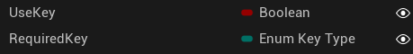
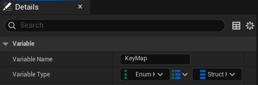
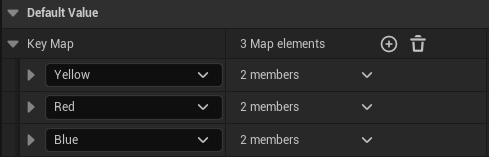
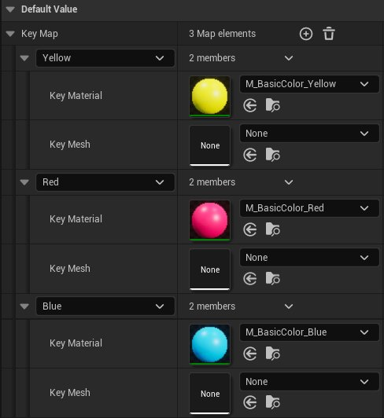
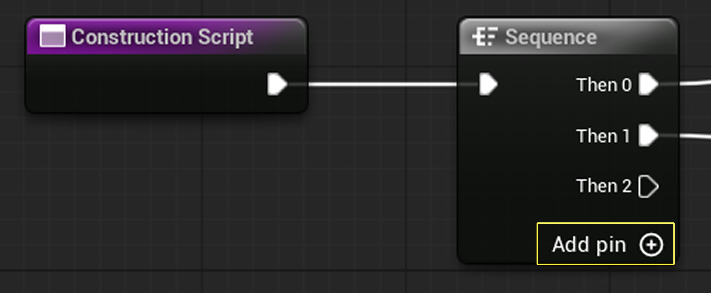
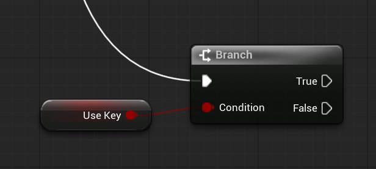
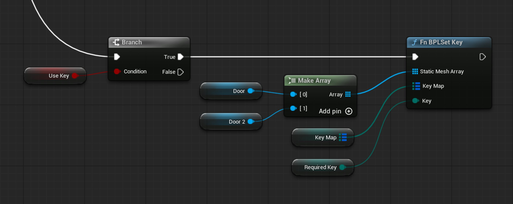
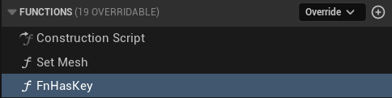

# 用钥匙开启门

> 路径：虚幻引擎5.7文档 / 入门指南 / 虚幻引擎新用户指南 / 设计解谜冒险游戏 / 用钥匙开启门

> 原始页面：https://dev.epicgames.com/documentation/unreal-engine/designer-03-open-doors-with-keys-in-unreal-engine

鉴于玩家已能在游戏中拾取钥匙，现在需要添加相应的功能，以实现用钥匙解锁并开启门的操作。 本节教程将介绍如何修改`BP_DoorFrame`蓝图，并探讨蓝图中的**函数（Functions）**。

在游戏设计中，可解锁的门是一种控制游戏流程、为玩家营造进度感的有效方式。 当前的示例项目在结构上被划分为多个房间。 因此，通过拾取钥匙来解锁门，便为玩家规划出一条逻辑清晰的前进路线。

## 开始之前

在继续之前，请确保你已掌握[设计解谜冒险游戏](../index.md)教程前几节所介绍的以下内容：

- [蓝图基础知识](https://dev.epicgames.com/documentation/unreal-engine/blueprint-foundations?application_version=5.7)，包括[蓝图接口（Blueprint Interfaces）](../../../../blueprints-visual-scripting/specialized-blueprint-visual-scripting-node-groups/types-of-blueprints/blueprint-interface/index.md)。
- 如何利用Map变量创建物体的变体。

本节教程需要用到在上一篇[创建钥匙](../designer-02-create-a-key/index.md)教程中创建的下列资产：

- `BP_Key`
- `BPL_FPGame`蓝图函数库
- `BPI_PlayerKeys`蓝图接口
- 三个已放置在关卡内房间或走廊之间的`BP_DoorFrame`实例。

## 为门添加颜色选项

鉴于第一人称模板已提供了一个门蓝图，可以直接修改此蓝图，为其添加用钥匙开门的功能。

为了与前一节定义的钥匙系统协同工作，门蓝图需要满足以下几项要求。 与钥匙类似，门也需要能够判断与之交互的Actor是否实现了`BPI_PlayerKeys`接口。

门应能改变自身颜色以匹配对应的钥匙，这意味着它需要一个变量来存储能够解锁它的钥匙类型。 最后，门还需要一个与钥匙蓝图相同的KeyMap变量，用于映射红、黄、蓝三种颜色。

### 创建用于与玩家和钥匙交互的变量

请按照以下步骤，向`BP_DoorFrame`蓝图添加新的变量：

1. 在**内容浏览器**中，进入**LevelPrototyping** > **可交互（Interactable）**> **门**（Door）文件夹，然后打开`BP_DoorFrame`蓝图。
2. 在**我的蓝图（My Blueprint）**面板中，在**变量（Variables）**栏添加一个名为**UseKey**的新变量，其类型为**布尔（Boolean）**。 该变量用于控制门是否需要钥匙才能开启。
3. 再创建一个名为**RequiredKey**的变量，其类型为**枚举键类型**（Enum Key Type）。 该变量用于指定开启此门所需要的钥匙类型。

   

   添加变量后的面板
4. 点击两个变量旁边的**眼睛**图标，使眼睛呈睁开状态，将其设置为**可编辑**。
5. 选中**UseKey**变量。 在**细节（Details）**面板中，将其**类别（Category）**设置为`Setup`。
6. 选中**RequiredKey**变量，并将其**分类**同样设为**Setup**。
7. 新建一个名为**Other Actor**的变量，类型为**Actor** > **对象引用**。 该变量用于存储与门交互的Actor，以便你用它来检查玩家是否与门体区域重叠。

### 构建钥匙映射变量

与在`BP_Key`中的操作类似，你需要添加一个映射变量，用于将钥匙类型映射到不同的材质颜色上。 但与钥匙不同的是，门不需要改变网格体形状，因此不会向Map中添加任何网格体信息。

请按照以下步骤，构建门的KeyMap变量：

1. 创建一个名为**KeyMap**的变量，其类型为**枚举键类型**。
2. 选中此变量，在**细节**面板中，将**容器（Container）**类型选为**Map**。
3. 将该Map的值类型（Value Type）设为**结构体钥匙数据**（Struct Key Data）。

   

   设置Struct Key Data类型
4. **编译**蓝图，以便为KeyMap设置默认值。
5. 在该Map的**默认值**（Default Value）区域，为**Key Map** **添加**（**+**）3个新元素。

   > [!TIP]
   > 由于Map的键不能重复，在添加第一个条目后，需先将其键改为另一种颜色，才能继续添加新条目。

   

   添加Key Map条目
6. 为每个Map元素指定对应的**钥匙材质**（Key Material）：

   1. `M_BasicColor_Yellow`
   2. `M_BasicColor_Red`
   3. `M_BasicColor_Blue`

   

   为对应的Key Map索引添加材质
7. 确保每个元素的**Key Mesh**字段均为**无（None）**。 如需移除已设置的网格体，可点击下拉菜单并选择列表顶部的**清除**（Clear）选项。
8. **保存**并**编译**该门蓝图。

### 添加变色蓝图逻辑

变量设置完成后，即可开始修改蓝图图表，以实现门的颜色切换功能。

首先，需要让门具备红、蓝、黄三种颜色选项，并由之前添加的**RequiredKey**变量来控制其颜色。 门的颜色变化应在关卡编辑器中设置时立即生效，而非等到Gameplay开始后。 因此，这项功能将在**构造脚本**（Construction Script）中实现。

请按照以下步骤，添加门的颜色选项：

1. 切换到门的**构造脚本**选项卡，该脚本中的逻辑会在门被创建时执行。 在图表中，找到紫色的**构造脚本**节点，它是此图表逻辑的起点。
2. 在与**构造脚本**节点相连的**序列**（Sequence）节点上，点击**添加引脚**（**+**）按钮以创建一个名为**Then 2**的新引脚，用于扩展逻辑链。

   

   为序列节点添加引脚

   > [!NOTE]
   > **序列**节点用于构建一个动作序列，其执行顺序为**Then 0**、**Then 1**，以此类推，引脚数量可按需添加。 使用该节点有助于保持图表整洁，避免单个逻辑链过于冗长。
3. 从**Then 2**引脚拖出，在图表的空白区域创建一个**分支**节点。
4. 连接**分支**节点的**条件**（Condition）输入与一个新建的**获取Use Key**（Get Use Key）节点。 如此一来，该Branch节点便可用于判断门是否需要使用钥匙。

   

   Branch节点的逻辑
5. 从**分支**节点的**True**引脚拖出，创建一个**Fn BPLSet** Key节点。 这是一个库函数，其作用是将新的材质颜色（和网格体，如果提供）应用到一组静态网格体上。
6. 将**Fn BPLSet Key**节点的**静态网g体数组（Static Mesh Array）**引脚与一个新建的**创建数组**（Make Array）节点连接。
7. 在**创建数组**节点上，点击**添加引脚 (+)**按钮。
8. 从**创建数组**节点的第一个引脚 **[0]**拖出，创建一个**获取门（Get Door）**节点。

   > [!NOTE]
   > 查看**我的蓝图**面板的**变量** > **组件**列表可知，该门蓝图包含**Door**和**Door2**两个静态网格体组件。 这两个组件正是需要改变颜色的对象。
9. 从第二个引脚 **[1]**拖出，创建一个**Get Door 2**节点。 这样，一个包含**Door**和**Door 2**这两个静态网格体组件的数组便创建好了。
10. 从**Fn BPLSet Key**节点拖出**Key Map**引脚，创建一个**Get Key Map**节点。 该节点是对门蓝图中**KeyMap**变量的引用。
11. 接着，从**Key**引脚拖出，创建一个**获取所需钥匙**节点，该节点是对之前添加的**RequiredKey**变量的引用。
12. **编译**并**保存**此蓝图。

此时，门的构造脚本中**序列**节点的**Then 3**引脚（译者注：原文为Then 3，但实际逻辑应接在Then 2后）之后的逻辑应如下图所示：



最终的门蓝图逻辑

以下是该逻辑的可复制版本：

Blueprint

门的构造脚本

Branch

Condition

True

False

Use Key

fn BPL Set Key

Static Mesh Array

Key Map

Key

Make Array

[0]

[1]

Array

Door

Fullscreen

Reset

Graph

Zoom 1:1

Renderer by

Rancoud

blueprint

INIT INTERACTIONS...

> [!NOTE]
> 如果是将此代码片段复制粘贴到`BP_DoorFrame的构造脚本`中，需要为现有的**序列**节点添加第三个执行引脚，并将其连接至**分支**节点的执行输入。

### 测试门的颜色变化

为门游戏对象设置好颜色逻辑后，即可着手配置开门条件，使得玩家在没有对应钥匙时无法开门。

在关卡中选中一个`BP_DoorFrame`实例。

在**细节**面板顶部的搜索栏中输入“Key”。 此时面板会筛选出**Use Key**和**Required Key**这两个选项。 尝试将**Required Key**的值更改为其他钥匙类型。 门的颜色应该会随之更新，与所选的钥匙类型保持一致。

> [!NOTE]
> 如果将**Use Key**切换为**false**，门的颜色将不会再随钥匙类型更新，因为蓝图中已设定了此条件。

修改门的颜色

这再次体现了在蓝图编辑器中使用**构造脚本**的好处。 无需进入游戏模式，在关卡编辑器中即可实时预览更改效果。

## 构建基于钥匙的开门逻辑

接下来，将构建用于检查玩家所持钥匙的功能。 为此，你将在`BP_DoorFrame`蓝图中定义一个名为**fnHasKey**的自定义函数，用于检查玩家是否拥有所需的钥匙。

> [!NOTE]
> **函数**（Function）是一套可复用的蓝图节点集合，用于完成某项特定任务。

### 创建用于检查钥匙的函数

该函数会将门所需的钥匙与玩家角色的钥匙数组进行比较，并返回一个真或假（布尔）值。 你将使用一个局部变量来存储该布尔返回值。

请按照以下步骤，创建一个使用局部变量的函数：

1. 在`BP_DoorFrame`蓝图的**我的蓝图（My Blueprint）**面板中，点击**函数（Functions）**部分旁的**Add**（**+**）添加新函数。 此操作与添加变量类似，只不过这次添加的是函数。
2. 将新函数命名为**fnHasKey**。

   

   命名函数为FnHasKey
3. 函数可以拥有自己独立的节点集合，因此它会在一个名为**fnHasKey**的专属选项卡中打开，并显示其独立的节点图表。 如果关闭了此选项卡，只需在**函数**列表中双击该函数即可重新打开。
4. 此时，在**我的蓝图**面板底部，会出现一个名为**局部变量（FnHasKey）（Local Variables（FnHasKey））**的新区域。 点击该区域旁的**添加**（**+**）按钮，创建一个新的**局部变量**。
5. 将该变量命名为**HasRequiredKey**，并将其类型设为**布尔值**。

   > 图片已省略：HasRequiredKey局部变量

   HasRequiredKey局部变量

   > [!NOTE]
   > 局部变量与普通变量相似，但其作用域仅限于其所在的函数。 在函数运行期间，局部变量常被用来存储临时值。 之后，可以通过**返回节点（Return Node）**将这个存储的值传回给蓝图的调用处。

函数的基本设置完成后，即可开始构建用于检查玩家是否持有正确钥匙的逻辑。

请按照以下步骤，检查进入门碰撞体积内的Actor是否持有开门所需的钥匙：

1. 从**fnHasKey**函数入口节点拖出执行引脚，创建一个**序列**节点。 该节点可将函数逻辑组织成一个按顺序执行的动作序列。
2. 从序列节点的Then 0引脚拖出，创建一个**Fn BPIGet Keys**（Message）节点。 这是一个接口函数，其作用是返回玩家已收集的钥匙所组成的数组。
3. 将**Fn BPIGet Keys**节点的**目标**引脚与一个新建的**获取其他Actor**节点连接。 待门的事件图表设置完毕后，该变量将用于存储与门碰撞体积发生重叠的Actor。

   > 图片已省略：FnKeys逻辑图

   FnKeys逻辑图
4. 将**HasRequiredKey**局部变量拖至**Fn BPIGet Keys**节点附近，并选择**设置**。
5. 连接**FN BPIGet Keys**节点的**执行**输出与**设置** **HasRequiredKey**节点的执行输入。
6. 从“设置**HasRequiredKey**”节点的**HasRequiredKey**输入引脚拖出，创建一个**包含项**（Contains Item）节点（在搜索结果的**数组**（Array）分类下）。 该节点用于检查一个数组中是否存在指定的项，并返回布尔值结果。

   > [!TIP]
   > 也可以直接搜索**数组包含项（Array Contains Item）**，以便更精确地定位该节点。
7. 连接**包含项**节点的**目标数组**（Target Array）引脚（方形）与**Fn BPIGet Keys**节点的**Held Keys**引脚。
8. 连接**包含项**节点的**需要查找的项**（Item to Find）引脚（圆形）与一个新建的**获取所需钥匙**节点。

至此，该函数的图表应与下图一致：

> 图片已省略：FnHasKey函数逻辑

FnHasKey函数逻辑

这段逻辑的作用是，检查由**OtherActor**变量所代表的Actor，其持有的钥匙中是否包含**RequiredKey**变量所指定的钥匙。 如果包含，**HasRequiredKey**局部变量的值就会被设为**true**。

接下来，需要将**HasRequiredKey**的检查结果传递回蓝图的调用处。 实现方式是使用**返回**节点，该节点会终止函数的执行，并将一个值返回给调用方。

请按照以下步骤，为函数添加**返回**节点以结束其执行：

1. 从**序列**节点的**Then 1**引脚拖出，在节点操作列表中搜索**返回**，并选择**添加返回节点（Add Return Node）**。
2. 要使函数能够返回值，它需要一个输出参数。 点击以选中**返回节点**。
3. 在**细节**面板中，点击底部**输出**（Outputs）区域旁的**添加**（**+**）按钮。 此操作会添加一个新的输出参数，其值将作为该函数的返回值。
4. 将此输出参数命名为**KeyFound**，并将其类型设为**布尔值**。
5. 回到图表中，连接**返回**节点的**Key Found**输入与一个新建的**获取HasRequiredKey**（Get HasRequiredKey）节点。

完成后，FnHasKey函数的完整图表应与下图一致：

Blueprint

FnHasKey函数图表

Fn Has Key

Sequence

Then 0

Then 1

fn BPI Get Keys

Target

Held Keys

Other Actor

SET

Has Required Key

Contains

Fullscreen

Reset

Graph

Zoom 1:1

Renderer by

Rancoud

blueprint

INIT INTERACTIONS...

> [!NOTE]
> 如果是复制粘贴此代码片段到项目中，需要手动将**FnHasKey**函数入口节点与**序列**节点连接。

### 用钥匙实现门的锁定与解锁

现在可以开始修改门蓝图，使其仅在所有必要条件均满足时才能开启。

与钥匙的逻辑类似，在角色尝试开启一扇需要钥匙的门之前，也必须检查该角色是否实现了`BPI_PlayerKeys`接口（可视为玩家的“通行证”）。

因此，在门开启前，必须同时满足以下所有条件：

- 门被设置为需要使用钥匙（即UseKey变量为True）。
- 与门重叠的Actor是玩家（即该Actor实现了BPI_PlayerKeys接口）。
- 玩家持有开门所需的钥匙类型。

请按照以下步骤，来判断与门交互的Actor是否为玩家：

1. 在`BP_DoorFrame`的事件图表中，找到**事件ActorBeginOverlap**节点。 这部分节点集合控制着当角色进入门的碰撞体积时所发生的逻辑。 接下来将向这段逻辑中添加蓝图接口和钥匙需求的判断，以确保门只会在开启者是玩家且持有正确钥匙时才会打开。

   > [!NOTE]
   > 可以使用快捷键**Ctrl** + **F**来搜索节点名称。 点击搜索结果即可直接跳转至该节点所在位置。
2. 按住**Alt**键并点击**事件ActorBeginOverlap**节点与**门控制**（Door Control）节点之间的连线，将其断开。 将**事件**节点向后移动，以便在它和**Door Control**节点之间为新的逻辑节点留出空间。

   断开蓝图节点连接
3. 从**事件ActorBeginOverlap**节点的执行引脚拖出，添加一个**设置其他Actor**节点。 连接**事件**节点的**其他Actor**输出与**设置**节点的**其他Actor**输入。

   > 图片已省略：Event Actor Begin Overlap设置Other Actor变量

   Event Actor Begin Overlap设置Other Actor变量

   此操作会将与门发生重叠的Actor存储到变量中。
4. 从**设置其他Actor**节点蓝色的**值（Value）**输出引脚拖出，创建一个**对象是否实现接口**节点。 将该节点的**接口**值设为`BPI_PlayerKeys`。

   > 图片已省略：Does Object Implement Interface节点

   Does Object Implement Interface节点
5. 从**设置其他Actor**节点的**执行**输出引脚拖出，创建一个新的**分支**节点。

请按照以下步骤，检查门是否需要使用钥匙：

1. 从**分支**节点的**True**引脚拖出，添加一个**Fn Has Key**节点，即本教程前面创建的函数。 该函数会获取开门所需的钥匙类型，然后在玩家的**Held Keys**数组中进行查找。 在此处调用该函数，便会执行其内部封装的节点逻辑。
2. 从**Fn Has Key**节点的**执行**输出引脚拖出，再创建一个**分支**节点。
3. 连接**Fn Has Key**节点的**Key Found**输出与**分支**节点的**条件**输入。
4. 将这个新**分支**节点的**True**输出连接到**Door Control**节点的**Play**输入。

   > 图片已省略：Door Control节点

   Door Control节点

目前为止，这段逻辑只处理了玩家持有正确钥匙时开门的情况。 门还应在下列情况下开启：

- 门本身被设置为无需钥匙。
- 一个非玩家角色（NPC）尝试通过这扇门。

第一个**分支**节点和**And**节点实际上已经覆盖了这两种情况的判断。 如果该判断的结果为**false**（即门需要钥匙且交互者是玩家），则**分支**的**false**分支会被执行。

请按照以下步骤，以确保门在无需钥匙或被NPC触发时也能开启：

1. 将第一个**分支**节点的**False**输出直接连接到**Door Control**节点的**Play**输入。 可以通过双击连线来创建转向节点，让蓝图布线更加规整。

   > 图片已省略：蓝图连接逻辑

   蓝图连接逻辑
2. **编译**并**保存**此蓝图。

现在，当触发交互的Actor未实现钥匙接口，或者门本身无需钥匙时（**UseKeys** = False），门依然会开启。

> [!NOTE]
> 在本教程的设计中，门是允许NPC通过的。 如果希望游戏有不同的表现，可以尝试自行修改这段图表逻辑。

新的`BP_DoorFrame`事件图表逻辑应与下图一致：

> 图片已省略：BP_DoorFrame事件图表逻辑

BP_DoorFrame事件图表逻辑

## 为蓝图添加注释

可以在蓝图中添加注释块。这是一种仅用于视觉提示的笔记，能够将一组节点归类，并解释蓝图的各个部分的功能。 注释能够帮助自己和团队成员快速了解某段节点的功能，从而保持蓝图的整洁和可读性。

构建蓝图逻辑时，推荐的做法是先专注于实现功能，然后再选中相关的节点，为它们添加注释以进行归类和说明。

请按照以下步骤，在蓝图中添加注释：

1. 点击图表，确保其为当前活动面板。
2. 按下键盘上的**C**键。 此操作会创建一个注释框。
3. 双击注释框顶部的文本区域即可输入注释内容。
4. 要调整注释框的大小，需先确保其处于选中状态（带有黄色高亮轮廓），然后拖动其边缘或角落。
5. 要将节点归入注释框内，只需将节点拖动到注释框的范围内即可。

此外，也可以先选中一个或多个节点，然后按**C**键，这样会创建一个刚好包裹住这些节点的注释框。

在蓝图中创建注释

## 测试门的功能

回到**关卡编辑器（Level Editor）**中的关卡。 利用门的“Required Key”属性为它们设置不同的颜色，并为每种颜色各放置一个对应的**BP_Key**。

现在，可以开始游戏测试了。 如果在未拾取钥匙的情况下靠近门，门将不会开启。

而在拾取了对应的钥匙后，靠近门时，门便会自动开启。 当角色离开足够远的距离后，门会自动关闭。

拾取一种颜色的钥匙后，可以尝试去开启一扇不同颜色的门。 此时，门应保持关闭状态。

测试门功能

如果正在使用本教程的示例关卡，请选中通往**2号走廊**的门，并将其所需钥匙设为蓝色。 接着，选中通往**3号走廊**的门，将其所需钥匙设为红色。 将通往**1号走廊**的门设为需要黄色钥匙。

> 图片已省略：颜色配对的门与钥匙

颜色配对的门与钥匙

### 通过调试消息添加反馈

如果希望在Gameplay期间查看蓝图的运行情况，可以使用**打印字符串（Print String）**节点在屏幕上显示调试消息。 这些调试消息不会出现在最终发布的游戏中。

接下来，可以尝试添加一个**打印字符串**节点，用以确认玩家拾取的钥匙类型。

请按照以下步骤，使用“打印字符串”节点来显示调试消息：

1. 在`BP_AdventureCharacter`的事件图表中，找到以**事件fnBPIAddKey**为起点、负责将钥匙添加到**HeldKeys**数组的那组节点。
2. 从**Add**节点的**执行**输出引脚拖出，添加一个**打印字符串**节点。
3. **In String**输入引脚决定了屏幕上将显示的文本内容。 可以直接输入自定义文本，也可以将**事件**节点的**Key Type**输出连接到**In String**输入。 后者可以在屏幕上显示出玩家当前拾取的钥匙类型。

   > 图片已省略：调试逻辑图

   调试逻辑图
4. **编译**该蓝图。
5. 再次运行游戏并拾取钥匙。 此时，每当拾取一把钥匙，屏幕上就会出现相应的调试文本，确认其颜色。
6. 调试完毕后，可返回节点图表，删除**打印字符串**和**枚举转字符串（Enum to String）**节点。 **编译**并**保存**此蓝图。

当蓝图的运行不符合预期时，可以在计算、事件调用或函数调用等关键节点后添加“打印字符串”节点，以帮助追踪数值和逻辑流程。

> [!TIP]
> 此外，还可以在游戏运行时打开蓝图编辑器，其连线会高亮显示，从而实时展示正在执行的逻辑。 这种名为**执行追踪**（Execution Tracing）的方法，与“打印字符串”消息相结合，能够快速定位问题。

## 放置可拾取物品

到目前为止，教程中的钥匙都只是简单地放置在地面上。 数组包含项

在本教程的示例关卡中，通过将钥匙放置在高处，增加了一些垂直维度的挑战，玩家必须跳跃才能获得钥匙。 这样的设计带来了一定的坠落风险，玩家一旦失误就可能需要从头再来。

> 图片已省略：包含功能性钥匙的关卡布局

包含功能性钥匙的关卡布局

关卡设计遵循了循序渐进的原则：玩家先在第一和第二个平台上练习跳跃，为通往柱子的、更具挑战性的最后一跳做准备。

## 试用示例关卡

如果不想自行搭建，而是希望直接添加本节教程中设计的房间部分，可以复制下方的代码片段。

### 起始房间的粗模搭建

此文本片段包含了创建通往黄色钥匙路径所需的坡道、内凹地板、圆柱以及两个平台网格体。

C++

起始房间布局

```
Begin Map
   Begin Level
      Begin Actor Class=/Script/Engine.StaticMeshActor Name=Floor_168 Archetype="/Script/Engine.StaticMeshActor'/Script/Engine.Default__StaticMeshActor'" ExportPath="/Script/Engine.StaticMeshActor'/Game/AdventureGame/Designer/Lvl_Adventure.Lvl_Adventure:PersistentLevel.Floor_168'"
         Begin Object Class=/Script/Engine.StaticMeshComponent Name="StaticMeshComponent0" Archetype="/Script/Engine.StaticMeshComponent'/Script/Engine.Default__StaticMeshActor:StaticMeshComponent0'" ExportPath="/Script/Engine.StaticMeshComponent'/Game/AdventureGame/Designer/Lvl_Adventure.Lvl_Adventure:PersistentLevel.Floor_168.StaticMeshComponent0'"
         End Object
         Begin Object Name="StaticMeshComponent0" ExportPath="/Script/Engine.StaticMeshComponent'/Game/AdventureGame/Designer/Lvl_Adventure.Lvl_Adventure:PersistentLevel.Floor_168.StaticMeshComponent0'"
            StaticMesh="/Script/Engine.StaticMesh'/Engine/MapTemplates/SM_Template_Map_Floor.SM_Template_Map_Floor'"
            bUseDefaultCollision=False
            StaticMeshDerivedDataKey="STATICMESH_34081786561B425A9523C94540EA599D_359a029847e84730ba516769d0f19427Simplygon_5_5_2156_18f808c3cf724e5a994f57de5c83cc4b_680318F3495BDBDEBE4C11B39CD497CE000000000100000001000000000000000000803F0000803F00000000000000000000344203030300000000"
            MaterialStreamingRelativeBoxes(0)=4294901760
```

请按照以下步骤，将新的粗模形状添加到起始房间：

- 在虚幻编辑器中，将**起始房间**内的所有钥匙移除，以防它们被新的几何体遮挡。
- 点击**复制完整代码片段**（Copy Full Snippet）。
- 在虚幻编辑器中，确保视口为当前活动面板（可在视口或**大纲视图**中点击任意位置，然后按**Esc**键），然后按**Ctrl** + **V**。

  > [!NOTE]
  > 如果曾移动过教程前一部分的任何粗模房间，新粘贴的网格体可能不会出现在预期的位置。 届时请根据需要手动移动它们。
- 粘贴后，有三块地板会覆盖住新的内凹地板。 在视口中，逐个选中它们并按**Delete**键删除。

  > 动图已省略：复制粘贴操作演示

  复制粘贴操作演示

## 下一步

目前，玩家角色虽然可以拾取钥匙，但没有任何UI反馈来告知他们已经持有哪些钥匙。 在下一节中，你将为玩家创建一个平视显示器（HUD），用以展示其物品栏中的钥匙。

- [玩家HUD](../designer-04-player-hud/index.md) - 创建一个简单的抬头显示（HUD），它会在玩家拾取物品时更新。
