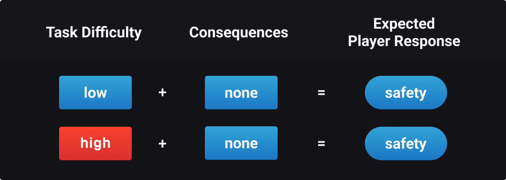
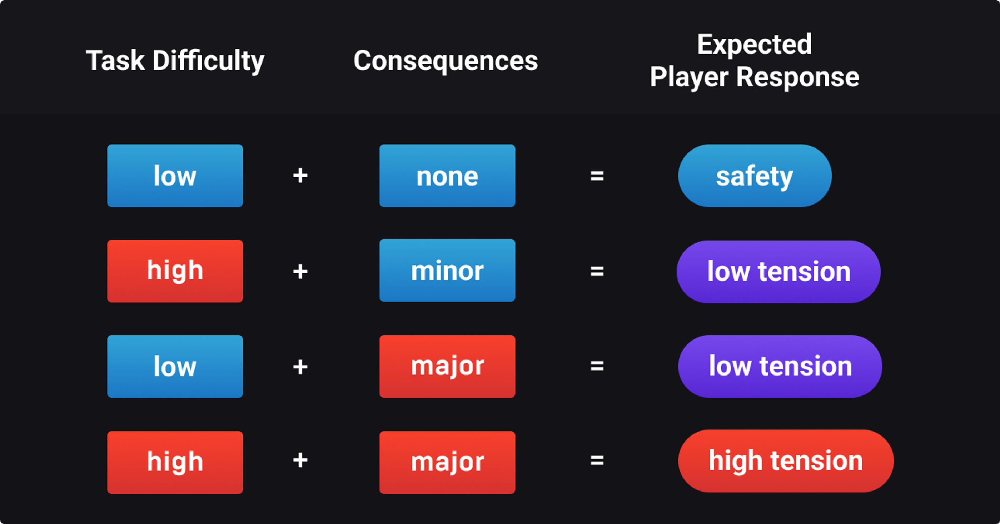
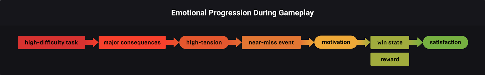
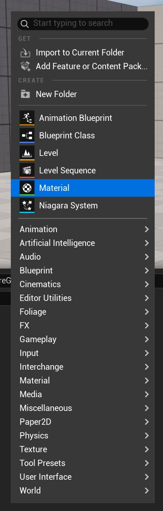
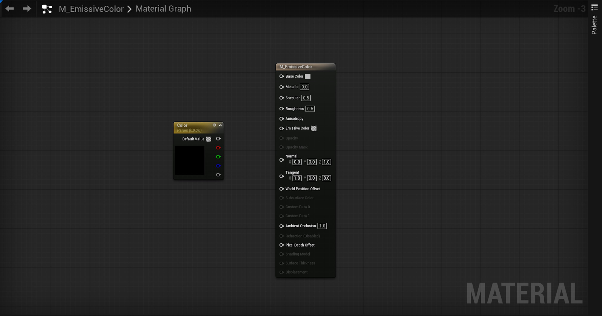
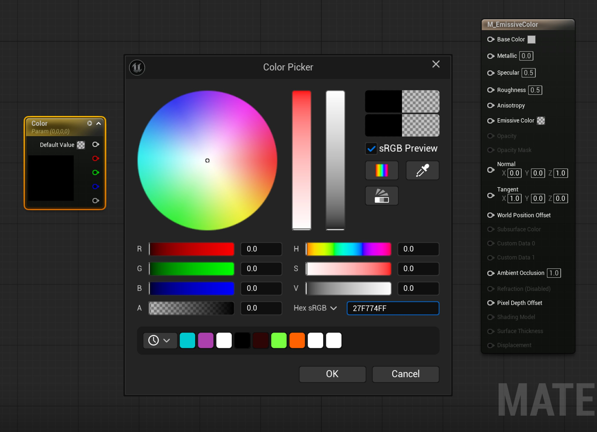
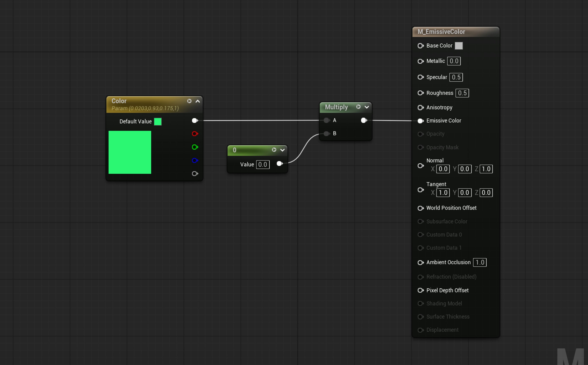
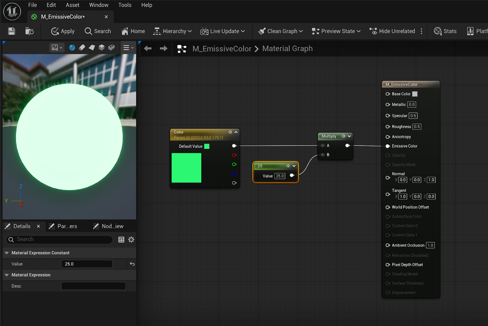

# 谜题：开关和立方体

> 路径：虚幻引擎5.7文档 / 入门指南 / 虚幻引擎新用户指南 / 设计解谜冒险游戏 / 谜题：开关和立方体

> 原始页面：https://dev.epicgames.com/documentation/unreal-engine/designer-05-puzzles-switches-and-cubes-in-unreal-engine

在本教程中，你将通过构建两个常见Gameplay对象来创建平台解谜游戏：

- 压力板开关。
- 一个会对玩家做出反应的物理立方体。

你将使用关卡设计和游戏机制（如**时间**、**物理**和**伤害**）来调整谜题的**难度**，并引入**玩家行为的后果**。

## 开始之前

本教程假定你已了解以下主题，这些主题在[设计解谜冒险游戏](../index.md)的前几节中介绍过：

- 材质
- 蓝图
- 变量
- 蓝图接口
- 在编辑器中运行模式

你需要用到在[创建钥匙](../designer-02-create-a-key/index.md)中创建的下列资产。

- `M_BasicColor_Blue`

## 一种Gameplay设计方法

无论哪种类型，引人入胜的Gameplay都会让玩家产生相应的感受；PvP的刺激感或农场模拟的舒适感。 这种情绪响应有助于提高玩家的参与度。 如果游戏没有吸引力，玩家玩下去的可能性就会降低，这可能会影响项目的成功。

作为游戏设计师，你的工作就是通过关卡设计和游戏机制来设计Gameplay。 你可以直观地设计关卡，但就本教程而言，我们将使用公式来可视化该过程。

### 关卡设计

通过关卡设计，你可以增加或降低任务的**难度**。 例如，在平台跳跃游戏中，跳上平台就是一项任务。 如果你在角色跳跃距离的上限处放置一个平台，就会增加到达该平台并完成任务的难度。

然而，如果没有失败的**后果**，即使是高难度的任务也可能会让玩家感到安全。

安全感在游戏教学阶段会很有用，因为玩家可以无后果地学习操作。

但是，一直让玩家有安全感可能会影响你的游戏。 例如，如果没有紧张感，Boss战斗可能会让人觉得乏味，导致玩家缺乏投入感。

为了让玩家感到*紧张*，你可以使用游戏机制**伤害**带来后果。

### 游戏机制

**伤害**在数字上表示玩家失去贵重资源的几率，例如：

- 装备
- 道具
- 关卡进度
- 可操作的角色或不可操作的伙伴。

任务的难度和后果的严重程度会影响玩家感受到的紧张程度：

> [!TIP]
> 任务难度过大、后果小或回报低可能让玩家产生*挫败感*。

执行任务时的紧张程度会影响玩家满足获胜条件时的满足感。 满足感，尤其是当满足感与奖励结合在一起时，会产生让玩家继续游玩的动力。

> [!TIP]
> **胜利条件**是玩家成功完成任务所必须满足的条件。

## 创建开关

> 动图已省略：Video-of-cube-dropping-onto-a-platform-that-changes-color

**开关**是一种Gameplay对象，当有东西与之交互时，会产生效果。

通过学习如何创建开关，你可以设计Gameplay功能，例如按按钮开门。 在本例中，你将使用开关更改与游戏内Actor碰撞时的颜色。

### 逻辑构建

当对象或玩家与开关重叠时，开关将激活。 在开始构建之前，让我们通过回答以下问题来简单了解支持此交互的逻辑：需要对谁进行什么操作，以及何时进行？

以下是开关逻辑的详情：

- 在运行时，开关关闭。
- 如果玩家踩到开关，开关就会打开。
- 如果玩家离开开关，则开关会关闭。

由于开关有两种状态（**开**和**关**），你可以使用材质可视化运行时的每种状态。 在测试期间，这将快速验证逻辑是否正常工作。

### 创建材质

对于开关的关闭状态，使用`M_BasicColor_Blue`，对于开启状态，则需要创建**自发光**材质。

> [!TIP]
> 自发光材质会发光。

要创建自发光材质，请按照以下步骤操作：

1. 在**内容浏览器**中，找到**AdventureGame > Designer > Materials**，右键点击并选择**材质（Material）**。

   
2. 将新材质命名为`M_EmissiveColor`，然后双击它以打开材质编辑器。
3. 在**材质图表**中，右键点击并搜索**向量参数**（Vector Parameter）。 点击它以将其填充到图表中，并将其命名为`Color`。 此功能按钮材质光源的颜色。

   
4. 在**Color**节点上，双击色条以打开**取色器**。
5. 选择你自己的颜色，或将其设置为十六进制sRGB`27F774FF`以按照说明操作。

   
6. 右键点击并搜索另外两个节点：**Constant**节点和**Multiply**节点。
7. 将**Color**节点连接到**Multiply**节点的**A**引脚。 然后，将**C****常量**连接到**Multiply**节点的**B**引脚。 最后，将**Multiply**节点连接到**M_EmissiveColor**节点的**自发光颜色（Emissive Color）**引脚。

   
8. Constant的**值（Value）**可以控制材质的自发光强度或亮度。 你可以根据需要调整它，或将其设置为`25`以遵循教程。

   
9. 点击**保存**后关闭材质。

你的Materials文件夹现在应如下所示：

> 图片已省略：A-collection-of-basic-colors-in-the-content-drawer-materials-folder

> [!TIP]
> 由于`M_EmissiveColor`是本教程中唯一的自发光材质，因此你不需要创建任何实例。 不过，材质实例仍然是保持项目模块化并在开发环境中高效运行的绝佳方法。

接下来，你将构建开关。

### 设置蓝图类

开关将是一个包含静态网格体和盒体碰撞的蓝图。 盒体碰撞将检测与玩家的接触，从而触发开关的开启和关闭状态。

> [!TIP]
> [碰撞](https://dev.epicgames.com/documentation/zh-cn/unreal-engine/collision-in-unreal-engine---overview)是指在运行时检测两个对象是否接触。 盒体碰撞以及球体和胶囊体碰撞是用于实现这些检测的几种常用体积。 例如，命中盒体就是使用碰撞形态来检测攻击成功的示例。

首先，请执行以下步骤：

1. 在**内容浏览器**的**AdventureGame > Designer > Blueprints**中，新建一个名为`Activation`的文件夹。
2. 在Activation内部，右键单击以创建一个新的**蓝图类**。

   > 图片已省略：Right-click-menu-selecting-blueprint-class
3. 在**选取父类（Pick Parent Class）**对话框中，选择**Actor**。

   > 图片已省略：Pick-parent-class-dialog-box
4. 将新蓝图命名为 `BP_Switch`，然后双击它，从而在蓝图编辑器中打开`BP_Switch`。
5. 在**组件（Components）**选项卡中，单击**添加（Add）**来创建静态网格体，搜索并选择`立方体（cube）`。
6. 将立方体命名为`Switch`。

   > 图片已省略：Viewport-with-switch-cube
7. 在**细节**面板的**变换**下，将**Switch**的缩放调整为`2.0`、`2.0`、`0.1`。

   > 图片已省略：Details-panel-showing-scale-settings
8. 在**组件**（Components）选项卡中，点击**添加**（Add）并搜索`盒体碰撞（boxcollision）`，创建盒体碰撞。
9. 将其命名为 `Trigger`。

   > 图片已省略：Trigger-component-inside-of-platform-but-taller-than-platform
10. 在**细节**面板的**位置**中，将盒体碰撞的**Z**值调整为`200`。
11. 在"**缩放（Scale）**"下，将其缩放调整为`1.5`、`1.5`、`5.0`。 此盒体碰撞比静态网格体更厚，可轻松捕获碰撞。

    > 图片已省略：Scale-inputs-for-the-trigger-component
12. **保存**并**编译**蓝图。

你的蓝图文件夹现在应如下所示：

> 图片已省略：Five-folders-in-the-blueprints-folder

> [!TIP]
> 为避免在编译失败时丢失工作成果，请在进行重大更改后**保存**并**编译**蓝图。

接下来，你将创建变量来控制开关的行为。

### 创建变量

通过变量`BP_Switch`可以引用你刚刚创建的材质。 你不必将特定材质硬编码到开关中，而是可以动态替换材质，本教程稍后将执行此操作。

现在，在`BP_Switch`中创建以下变量：

|  |  |  |  |
| --- | --- | --- | --- |
| 变量名称 | 类型 | 默认值 | 说明 |
| **OnMaterial** | 材质接口 | `M_EmissiveColor` | 打开时开关的颜色。 |
| **OffMaterial** | 材质接口 | `M_BasicColor_Blue` | 关闭时开关的颜色。 |

1. 在**我的蓝图（MyBlueprint）**选项卡的**变量（VARIABLES）**中，通过单击**+**按钮两次来创建两个新变量
2. 将一个命名为`OnMaterial`，另一个命名为`OffMaterial`。
3. 将其引脚类型设置为**材质接口（对象引用）[Material Interface（Object Reference）]**。

   > 图片已省略：Adding-variables-in-the-my-blueprint-tab
4. 选择**OnMaterial**。 在**细节**面板中，找到**类别（Category）**，创建一个名为`Setup`的新类别。
5. 点击**编译**，获取其**默认值（Default Value）**。 在**默认值**下，选择`M_EmissiveColor`。 至此变量设置完毕。

   > 图片已省略：On-material-shown-for-emissive-color
6. 选择**OffMaterial**。 在**细节**面板中，将其添加到**Setup**类别。
7. 在**默认值**下，选择`M_BasicColor_Blue`。
8. **保存**并**编译**。

现在蓝图可以引用材质，你将使用逻辑指示开关何时使用它们。

### 实现你的逻辑

你应该有一个盒体碰撞、一个静态网格体和两个材质。 现在开关的逻辑可写为：

- 在运行时，**Switch**应该显示**OffMaterial**。
- 如果**触发器**检测到碰撞，则将**Switch**的材质设置为**OnMaterial**。
- 如果**触发器**停止检测碰撞，则将**Switch**的材质设置为**OffMaterial**。

要构建此逻辑，你将使用构造脚本指示`BP_Switch`在运行时使用**OffMaterial**：

1. 在**构造脚本（Construction Script）**选项卡中，拖出构造脚本节点上的**执行**引脚，并搜索**设置材质 （Switch）[Set Material (Switch)]。** 点击以创建它。

   > 图片已省略：Construction-script-node-and-set-material-node
2. 在**Set Material**节点上，拖出**Material**引脚并搜索**Get OffMaterial**。 选择它。

   > 图片已省略：Set-material-node-connecting-to-off-material-node
3. **保存**并**编译**。

你将在**事件图表（EventGraph）**中处理其余逻辑。 要指示开关在重叠时打开和关闭，请执行以下步骤：

1. 在事件图表中，删除**Event BeginPlay**、**Event ActorBeginOverlap**和**Event Tick**节点。 现在不需要它们了。
2. 在**我的蓝图（My Blueprint）**选项卡中，在**组件（Components）**标题下，右键单击**触发器（Trigger）**并选择**添加事件（Add Event）**> **添加OnComponentBeginOverlap**。

   > 图片已省略：File-path-for-trigger-add-event-to add-on-component
3. 重复此过程以添加**OnComponentEndOverlap**节点。

   > 图片已省略：Image-of-the-on-component-end-overlap-node
4. 从**OnComponentBeginOverlap(Trigger)**节点的**执行**引脚，拖出引线并搜索**SetMaterial (Switch)**。

   > 图片已省略：Image-of-the-blueprint-with-the-set-material-node
5. 从**Set Material**节点的**Material**引脚拖出一根引线，然后搜索**Get OnMaterial**。

   > 图片已省略：Image-showing-the-get-on-material-node
6. 从**OnComponentEndOverlap(Trigger)**节点的**执行**引脚拖出引线并搜索**设置材质（switch）[Set Material (Switch)]**。
7. 从**SetMaterial**节点的**Material**引脚拖出一根引线，然后搜索**Get OffMaterial**。
8. 开关已经暂时完成了，请**保存**并**编译**。

你的**构造脚本**图表现在应该如下图所示：

Blueprint

构造脚本

User Construction Script

Set Material

Target

Element Index

0

Material

Switch

Off Material

Fullscreen

Reset

Graph

Zoom 1:1

Renderer by

Rancoud

blueprint

INIT INTERACTIONS...

你的**事件图表**现在应该如下所示：

Blueprint

事件图表代码

OnComponentBeginOverlap (Trigger)

Overlapped Component

Other Actor

Other Comp

Other Body Index

From Sweep

Sweep Result

OnComponentEndOverlap (Trigger)

Overlapped Component

Other Actor

Other Comp

Other Body Index

Set Material

Target

Element Index

0

Material

Fullscreen

Reset

Graph

Zoom 1:1

Renderer by

Rancoud

blueprint

INIT INTERACTIONS...

现在你可以测试项目，看看开关是否能正常工作。

将`BP_Switch`的实例从**内容浏览器**拖入**Room 1**。 点击**播放模式（Playmode）**工具栏中的三点菜单，然后选择**当前摄像机位置（Current Camera Location）**。 这样可以确保你从视口中的当前位置进入PIE模式，而不是跑遍整个关卡来测试单一功能。

> 图片已省略：Menu-showing-current-camera-option-under-spawn-player-at-section

在PIE模式下，当你踩到开关时，它应该会亮起。 当你离开时，它应该会变回蓝色。

> 动图已省略：PIE-clip-of-player-stepping-on-platform-that-lights-up

### 模块化开发的好处

假设你需要两个开关而不是一个，但你希望第二个开关光源是红色而不是绿色。 你可以使用相同的逻辑构建一个新的开关，并分配红色材质，但这会耗费你的开发时间，并为你的项目带来更多开销。

> [!TIP]
> **开销**是指资源的支出（处理能力、时间、存储量等）。

由于**平台**（计算机和游戏主机）的处理能力有限，游戏开发人员通常希望以模块化方式工作，以减少开销。

因为你已经使用了蓝图和变量来构建开关，所以你已经使用模块化工作方式。 让我们看看实际操作：

1. 在**蓝图编辑器**中打开`BP_Switch`，只需要在**内容浏览器**中双击它。
2. 在**变量（Variables）**下，选择**OnMaterial**并点击**眼睛**图标，将其打开。

   > 图片已省略：Off-material-with-eye-icon-closed-or-off
3. **选择OffMaterial**，这次我们要用不同的方法做同样的事情；在**细节面板**中启用**可编辑实例（Instance Editable）**。 你会注意到眼睛图标睁开了；它现在是公共变量。

   > 图片已省略：Material-interface-as-instance-editable
4. **保存**、**编译**并关闭。

关卡中应该已经有一个`BP_Switch`实例，现在拖入第二个实例。 在视口中选择任一开关后，**细节**面板将显示一个名为**Setup**的新UI类别。 这是你在[创建变量](https://docs.google.com/document/d/15dzlCSqIr82PCc7hgNzg8SOexUeYdt2cSulR-RQfGu4/edit?tab=t.hnlqf9ud6v54#heading=h.l9hbjee55t45)中创建的变量类别。 **Setup**将公共变量显示为参数，你可以从视口动态更改这些参数。

尝试将材质更改为你想要的任何内容，并测试开关在PIE模式下的反应。 你会看到开关的每个实例都可以保存唯一的开和关材质，而无需从头创建新开关，从而加快开发并减少开销。

> 动图已省略：Gif-clip-of-changing-instance-color-from-blue-to-red

> [!NOTE]
> 如果你希望自己的视口看起来和我们的完全一样，请在继续学习本教程之前删除第二个开关实例。

### 创建单个和多个激活

你的开关目前会无限次打开和关闭。 在某些情况下，我们会希望只激活一次。 例如，在通向战利品的走廊中，你可能需要一个开关来激活玩家必须避开的陷阱。 如果玩家成功避开陷阱并收集了战利品，开关不应再次激活陷阱。

你不必丢弃已构建的内容，而是添加一个**布尔值**，让开关仅使用一次。

|  |  |  |  |
| --- | --- | --- | --- |
| 变量名称 | 类型 | 默认值 | 说明 |
| **ActivateOnce** | 布尔（Boolean） | False | 此开关是可以重复激活还是仅激活一次。 |

为此，请按照下列步骤操作：

1. 在`BP_Switch`的蓝图编辑器中，点击**变量（Variables）**下的**+**按钮添加新变量。
2. 将其命名为`ActivateOnce`并将引脚类型设置为**布尔（Boolean）**。
3. 在**细节**面板中，勾选**可编辑实例（Instance Editable）**选框。
4. 点击**类别（Category）**旁边的下拉菜单，然后选择**Setup**。
5. 点击**编译**以访问变量的**默认值**并验证它是否已取消选中。 这意味着此蓝图不会默认启用**ActivateOnce**。

   > 图片已省略：Variable-type-showing-boolean-option
6. 在事件图表中，右键点击并搜索**Branch**节点。
7. 从**Branch**节点的**Condition**引脚中拖出并搜索**Get ActivateOnce**。

   > 图片已省略：In-blueprints-the branch-node-connected-to-activate-once
8. 将**On Component End Overlap (Trigger)**节点的**执行**引脚拖到**Branch**节点的**执行**引脚。 它应该会断开与SetMaterial节点的连接。

   > 动图已省略：GIF-of-on-component-connecting-to-branch-node
9. 将**Branch**节点的**False**引脚连接到**Set Material**节点的**执行**引脚。 这意味着当对象离开开关时，系统会做出决定：如果**ActivateOnce**切换为**True**，则开关停止检测碰撞。 如果**ActivateOnce**切换为**False**，则开关将无限期有效。

   > 图片已省略：Blueprint-of-the-final-event-graph
10. **保存**、**编译**并关闭蓝图。
11. 在视口中选择`BP_Switch`。 在细节面板中，**ActivateOnce**应该是该实例的可切换复选框。 启用它以了解其工作原理。

    > 图片已省略：Final-details-panel-settings-with-viewport

你的**事件图表**现在应该如下所示：

Blueprint

事件图表代码片段

OnComponentBeginOverlap (Trigger)

Overlapped Component

Other Actor

Other Comp

Other Body Index

From Sweep

Sweep Result

OnComponentEndOverlap (Trigger)

Overlapped Component

Other Actor

Other Comp

Other Body Index

Set Material

Target

Element Index

0

Material

Fullscreen

Reset

Graph

Zoom 1:1

Renderer by

Rancoud

blueprint

INIT INTERACTIONS...

点击**运行**，在PIE模式下测试你的变量。 启用ActivateOnce后，即使在离开开关后，开关也应该保持亮起。

> 动图已省略：GIF-clip-of-player-stepping-on-platform-and-it-changes-color

## 使用物理效果激活开关

在本教程的后半部分，玩家将需要在完成关卡其余部分的同时保持按住开关。 为此，你将创建此谜题的第二个Gameplay对象——物理立方体。 这会将游戏机制、**物理系统**融合到你设计的谜题中。

要使用蓝图创建物理立方体，请按以下步骤操作：

1. 在**内容浏览器**中，找到**AdventureGame > Designer > Blueprints > Activation**，单击右键并创建新的**蓝图类**。
2. 在**选取父类（Pick Parent Class）**对话框中，选择**Actor**。
3. 将新蓝图命名为 `BP_Cube`。
4. 双击它以在蓝图编辑器中打开 `BP_Cube`。
5. 在**组件（Components）**选项卡中，单击**添加（Add）**来创建静态网格体，搜索并选择`立方体（cube）`。
6. 将网格体命名为`Cube`。

   > 图片已省略：Viewport-with-the-cube-component-selected
7. 在**细节**面板的**静态网格体**下，搜索并选择**SM_ChamferCube**。

   > 图片已省略：Detials-panel-showing-sm-chamfer-cube-option
8. 将**Z**位置设置为`50.0`。
9. 在**材质（Materials）**下，将**元素0（Element 0）**设置为`M_BasicColor_Blue`。

   > 图片已省略：Details-panel-open-with-m-basic-color-blue-selected
10. 在**物理（Physics）**下，启用**模拟物理（Simulate Physics）**。 此设置会启用UE的[Chaos物理系统](https://dev.epicgames.com/documentation/zh-cn/unreal-engine/physics-in-unreal-engine)引擎，让立方体对玩家的推动做出反应。

    > 图片已省略：Details-tab-with-enable-physics-checkbox-selected
11. **保存**并**编译**。

要测试功能，请将`BP_Cube`实例拖入关卡中的开关附近。 按下**运行**进入PIE模式，并使用**WASD**字母键将`BP_Cube`推到开关上以将其打开。

> 动图已省略：GIF-clip-of-player-pushing-a-cube-onto-the-platform-with-a-color-change

### 调试

如果你将立方体推到开关上，它会打开，但你可能会注意到一个问题。 如果你走出开关，即使立方体仍与开关重叠，开关也会关闭。

> 动图已省略：GIF-clip-showing-player-steps-off-platform-which-turns-off-with-cube-on-still

查看当前逻辑以查找错误：

如果**触发器**停止检测**碰撞**，则将**Switch**的材质设置为**OffMaterial**。

要解决此问题，指示**触发器**在继续之前检查是否有重叠的Actor：

如果**触发器**停止检测到碰撞，并且没有Actor与其重叠，则将**Switch**的材质设置为**OffMaterial**。

要对蓝图进行调整，请按照以下步骤操作：

1. 在`BP_Switch`的蓝图编辑器中，右键点击并创建**Branch**节点。
2. 从**Condition**引脚拖出，搜索并创建一个**Is Empty（数组）**节点。

   > 图片已省略：Blueprint-showing-is-empty-node
3. 从**Is Empty**节点的**目标数组（Target Array）**引脚搜索并创建**获取重叠Actor（Trigger）[Get Overlapping Actors (Trigger)]**。
4. 将**类筛选器**设置为**Actor**。

   > 图片已省略：Setting-the-class-filter-to-actor
5. 要将此逻辑连接到现有节点，则从第一个**Branch**节点的**False**引脚拖出，并将其连接到第二个**Branch**节点的**执行**引脚。
6. 将第二个**Branch**节点上的**True**引脚连接到**Set Material**节点的**执行**引脚。
7. **保存**并**编译**。

你的**事件图表**现在应该如下所示：

Blueprint

事件图表代码片段

OnComponentBeginOverlap (Trigger)

Overlapped Component

Other Actor

Other Comp

Other Body Index

From Sweep

Sweep Result

OnComponentEndOverlap (Trigger)

Overlapped Component

Other Actor

Other Comp

Other Body Index

Set Material

Target

Element Index

0

Material

Fullscreen

Reset

Graph

Zoom 1:1

Renderer by

Rancoud

blueprint

INIT INTERACTIONS...

要调整**触发器**的碰撞设置，请执行以下步骤：

1. 在**组件（Components）**选项卡中，选择**触发器（Trigger）**。
2. 在**细节**面板的**碰撞预设（Collision Presets）**标题栏下，将下拉菜单设为**自定义（Custom）**。
3. 在**碰撞已启用（Collision Enabled）**下拉菜单中，选择**已启用碰撞（查询和物理）[Collision Enabled (Query and Physics)]**。
4. 在**对象类型（Object Type）**下拉菜单中，选择**WorldDynamic**。

   > 图片已省略：Collision-presets-menu-in-the-details-tab
5. 在**WorldDynamic**旁边，勾选**忽略（Ignore）**。

   > 图片已省略：Image-of-object-responses-menu
6. **保存**并**编译**。

进入PIE模式以测试你的解决方案。 只要有Actor与之重叠，开关就应该保持亮起，无论Actor是否移开。

## 创建其他功能

到目前为止，你已经创建了一个能够打开和关闭的开关。 这样可以可视化表示开关是否正常运行，不过它的用处还有很多。 接下来，你将使用该开关激活关卡中的其他对象。

首先，你将创建一个包含两个函数的**蓝图接口**；每个都代表开关的开启和关闭状态。 这些函数的用法类似于对象之间发出的事件。

1. 在**内容浏览器**中，找到**AdventureGame > Designer > Blueprints > Core**，单击右键并找到**蓝图**。 然后，选择**蓝图接口（Blueprint Interface）**。

   > 图片已省略：Image-showing-file-path-of-blueprint-to-blueprint-interface
2. 将接口命名为`BPI_Interaction`。 双击打开蓝图接口窗口。

   > 图片已省略：Image-showing-asset-of-bpi-interaction
3. **在我的蓝图（MyBlueprint）**面板中，应该已经存在一个新的函数。 将其命名为`fnBPISwitchOn`。

   > 图片已省略：Image-showing-fn-bpi-switch-node
4. 单击**添加（Add）**，然后单击函数以创建第二个函数。 将其命名为`fnBPISwitchOff`。
5. 这样接口就完成了。 保存、**编译**并关闭。

接下来，你要创建一个**数组（Array）**，其中包含你希望开关激活的所有对象。 在本教程中，我们会使用数组来管理开关激活哪些对象，而不是为每个新对象创建唯一的逻辑。

|  |  |  |  |
| --- | --- | --- | --- |
| 变量名称 | 类型 | 默认值 | 说明 |
| **InteractObjectList** | Actor数组 | 无（None） | 此开关激活的Actor数组。 |

1. 在`BP_Switch`的**我的蓝图（My Blueprint）**选项卡的**变量（VARIABLES）**下，单击**+**按钮以创建新变量。
2. 将其命名为`InteractObjectList`并将引脚类型设置为**Actor（对象引用）[Actor (Object Reference)]**。
3. 在**细节**面板中的**变量类型（Variable Type）**旁边，将容器类型设置为**数组（Array）**。

   > 图片已省略：Dropdown-menu-of-actor-types
4. 要使其成为UI参数，请选中**可编辑实例（Instance Editable）**并将其添加到**Setup**类别。
5. **保存**并**编译**。

我们要使用逻辑来指示开关迭代数组（当前为空）中的每个对象，并使用之前创建的`BPI_Interaction`接口向其发送信号。 这里我们要使用**For Each Loop**。

为此，请按照下列步骤操作：

1. 在**事件图表**中，从**Set Material**节点（在**On Component Begin Overlap**节点上）的**执行**引脚拖出，然后搜索**For Each Loop**。

   > 图片已省略：Event-graph-showing-for-each-loop
2. 要指示要为哪些对象执行该事件，请拖出**For Each Loop**上的**Array**引脚，然后搜索**Get InteractObjectList**。

   > 图片已省略：Showing-blueprint-with-get-interact-object-node
3. 最后，拖出**For Each Loop**上的**Loop Body**引脚，并搜索**fnBPISwitchOn**。 这就是你要调用的事件。

   > 图片已省略：Blueprint-showing-fnBPI-switch-node
4. 将**For Each Loop**上的Array Element引脚连接到**fnBPISwitchOn**节点上的**Target**引脚。

   > 图片已省略：BP-showing-the-array-connected-to-the-target
5. 必须为**On Component End Overlap（Trigger）**执行相同的操作。 要加快该过程，请选择For Each Loop和Interact Object List节点，并使用**右键单击 > 复制**或按**Ctrl+C**进行复制。 按**Ctrl+P**将其粘贴到图表中。

   > 动图已省略：Showing-clip-of-copy-pasting-nodes
6. 将**Set Material**节点的**执行**引脚连接到**For Each Loop**的**执行**引脚。
7. 从**For Each Loop**的**Loop Body**引脚拖出并搜索**fnBPISwitchOff**。 将**Array Element**引脚连接到**Target**引脚。
8. 你的开关暂时完成了。 **保存**、**编译**并关闭。

你的**事件图表**现在应该如下所示：

Blueprint

事件图表代码片段

OnComponentBeginOverlap (Trigger)

Overlapped Component

Other Actor

Other Comp

Other Body Index

From Sweep

Sweep Result

OnComponentEndOverlap (Trigger)

Overlapped Component

Other Actor

Other Comp

Other Body Index

Fullscreen

Reset

Graph

Zoom 1:1

Renderer by

Rancoud

blueprint

INIT INTERACTIONS...

现在你已经打好了基础，可以为关卡中的每个开关实例激活唯一的对象列表。 在下一节教程中，你将创建此挑战的第三个Gameplay对象——移动平台。

## 下一步

- [谜题：移动平台](../designer-06-puzzles-moving-platforms/index.md) - 在平台游戏的第二部分，你将了解如何使用蓝图创建移动平台，并学习如何调试你的脚本。
