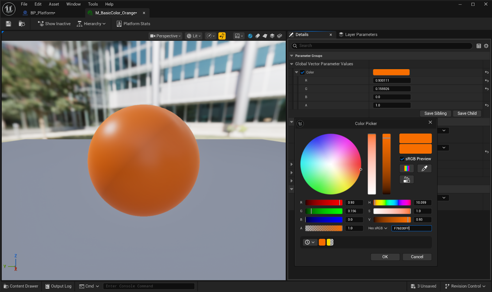
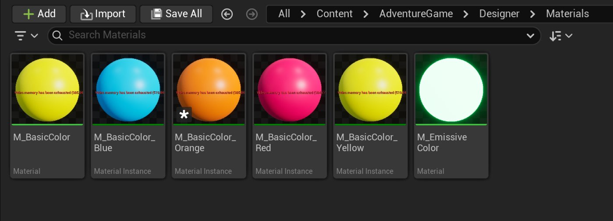
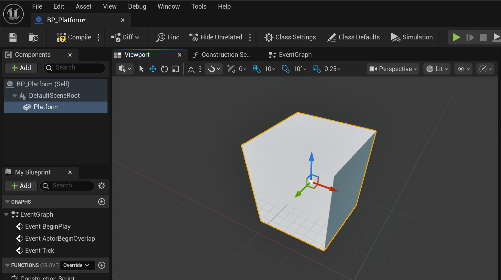
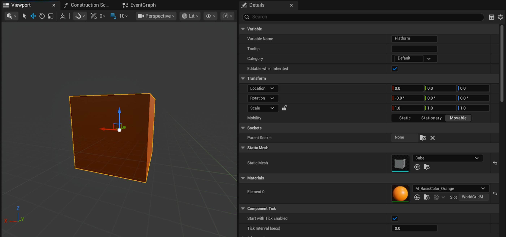
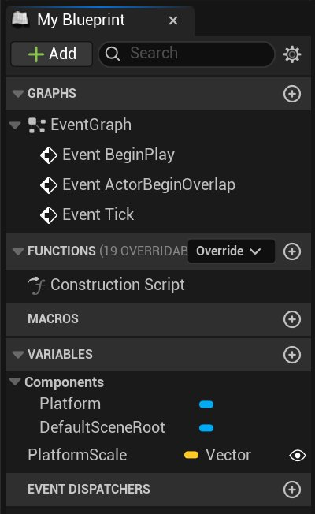
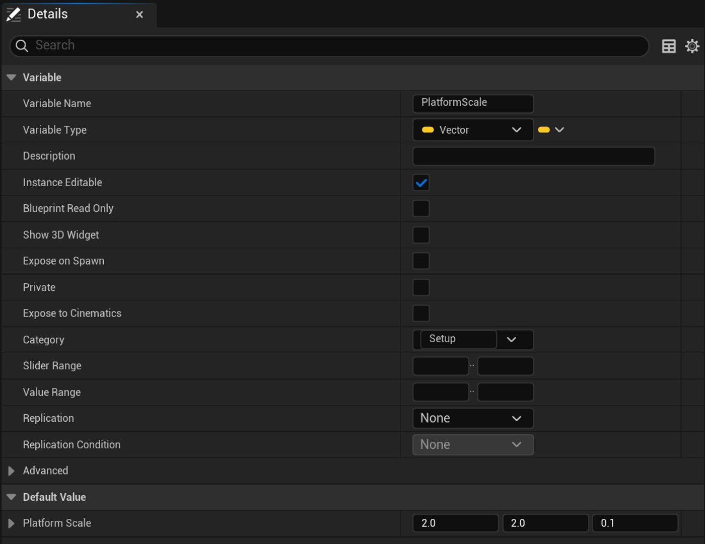
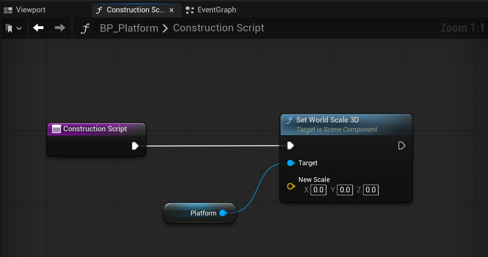
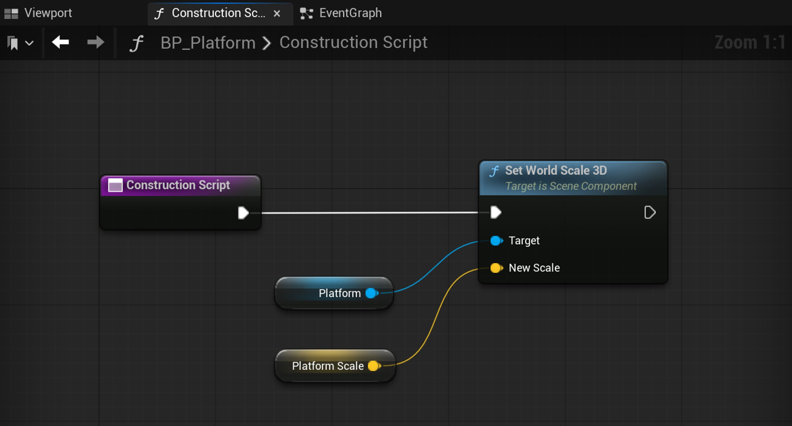

# 谜题：移动平台

> 路径：虚幻引擎5.7文档 / 入门指南 / 虚幻引擎新用户指南 / 设计解谜冒险游戏 / 谜题：移动平台

> 原始页面：https://dev.epicgames.com/documentation/unreal-engine/designer-06-puzzles-moving-platforms-in-unreal-engine

在本教程中，你将创建逻辑来让平台动起来，并使用你在[《谜题：开关与立方体》](../designer-05-puzzles-switches-and-cubes/index.md)中构建的Gameplay对象来激活它。 你还将把游戏机制中的时间融合到谜题中。

通过使用模块化工作流程，你将能够从视口修改平台的缩放、移动、目的地和速度。 你还可以选择点击开关会激活哪个平台。

有了这样的灵活性，你可以在设计时对关卡进行更改并动态测试其功能。 高效而灵活的设计选择可以提高开发管线的速度和弹性。

## 开始之前

本教程假定你已了解以下主题，这些主题在[设计解谜冒险游戏](../index.md)的前几节中介绍过：

- 材质
- 蓝图
- 变量
- 蓝图接口
- 在编辑器中运行模式

你需要在[创建钥匙](../designer-02-create-a-key/index.md)和[谜题：开关和立方体](../designer-05-puzzles-switches-and-cubes/index.md)中创建以下资产：

- `BP_Switch`
- `BP_Cube`
- `BP_Key`
- `BPI_Interaction`
- `M_BasicColor`
- `M_EmissiveColor`
- `M_BasicColor_Blue`

## 创建移动平台

通过学习如何创建移动平台并使用开关激活它，你可以设计简单的功能，例如在关卡中传送玩家。 开关、立方体和平台可以组合起来创建复杂的功能，例如一个完整的平台解谜，就像我们在本教程最后提供的那样。

要保持工作流程的模块化，首先要为平台创建材质实例和蓝图类。

### 创建材质实例

请按照以下步骤，为平台创建材质实例：

1. 在**内容浏览器**的**AdventureGame > Designer > Materials**中，右键点击**M_BasicColor**并选择**创建材质实例（Create Material Instance）**。
2. 将实例命名为`M_BasicColor_Orange`。 双击实例，在**材质编辑器**中将其打开。
3. 展开**全局向量参数值（Global Vector Parameter Values）**，然后启用**颜色（Color）**来重载。
4. 将**颜色**参数设置为**十六进制sRGB（Hex sRGB）**值`F76E00FF`。

   
5. **保存**实例并将其关闭。

你的Materials文件夹现在应如下所示：



### 设置蓝图类

要为平台创建一个蓝图类，请按照以下步骤操作：

1. 在**内容浏览器**中，找到**AdventureGame > Designer > Blueprints**，新建一个名为**`Platforms`**的文件夹。
2. 在**Platforms**文件夹中，右键单击并创建新的**蓝图类**。
3. 在**选择父类（Pick Parent Class）**对话框中，选择**Actor**并将新蓝图命名为`BP_Platform`。
4. 双击以在蓝图编辑器中打开`BP_Platform`。
5. **在组件（Components）选项卡中，单击添加（Add）创建静态网格体，搜索并选择"立方体（cube）"。**
6. `将网格体命名为Platform。`

   
7. 在**细节**面板的**材质**标题下，将**元素0（Element 0）**设置为`M_BasicColor_Orange`。

   

要在关卡编辑器中快速自定义平台的缩放并创建大小不同的平台，可以使用可编辑变量：

1. 在**我的蓝图（My Blueprint）** 选项卡中，找到**变量（Variables）**标题。 点击**+**按钮创建变量，并将其命名为`PlatformScale`。
2. 将其引脚类型设置为**向量(Vector)**，然后点击**眼睛图标**，将眼睛打开。

   
3. 在**细节**面板中，找到**类别**（Category），将其添加到`Setup`类别。
4. **编译**蓝图，然后将**PlatformScale**的**默认值**设置为`2`, `2`, `0.1`。

   
5. 在**构造脚本**图表中，拖出**Construction Script**节点的**Exec**引脚并创建**Set World Scale 3D (Platform)**。

   
6. 拖出**Set World Scale 3D**节点上的**New Scale**引脚，创建**Get PlatformScale**节点。这会将新的缩放数值应用于平台模型组件。

   
7. **保存**并**编译**。

你的 **构造脚本（Construction Script）**图表现在应该如下图所示：

> [!NOTE]
> 如果是复制此代码段到图表中，你需要将**Construction Script**入口节点连接到**Set World Scale 3D**。

Blueprint

构造脚本代码段

User Construction Script

Set World Scale3D

Target

New Scale

Platform

Platform Scale

Fullscreen

Reset

Graph

Zoom 1:1

Renderer by

Rancoud

blueprint

INIT INTERACTIONS...

如果返回到蓝图的**视口（Viewport）**选项卡，你会看到构造脚本已应用于平台的新缩放数值。

从**内容浏览器**中，将平台实例拖入关卡，如果你沿用我们提供的关卡，则拖入**Room 1**。 对于本教程，请确保关卡中还有`BP_Switch`和`BP_Cube`的实例：

> 图片已省略：Image-of-level-with-platforms-and-a-cube

## 使用逻辑构建

当对象与开关重叠时，平台应该在两个位置之间来回移动。 在开始构建之前，让我们通过回答以下问题来起草支持此交互的逻辑：需要对谁进行什么操作以及何时进行？

以下是平台逻辑的详情：

如果`BP_Platform`处于**激活**状态，则：

- 如果`BP_Platform`位于其**开始位置**，则**向前移动**到其**结束位置**，并**等待**2秒。
- 如果`BP_Platform`位于其**结束位置**，则**后退**到其**开始位置**，并**等待**2秒。

如果`BP_Platform`未**激活**，则`BP_Platform`**停止**。

指定等待时间的是为了让玩家有时间到达平台（或将东西推到平台上）。 你可以根据你想要的Gameplay任务难度来调整等待时间。 在本教程的后半部分，你将使用**时间**来设置平台的速度，这也会影响游戏难度。

由于你已经创建了`BP_Platform`，你需要一个布尔值来确定它是否激活。

要创建布尔值，请按照以下步骤操作：

1. 在`BP_Platform`的**我的蓝图（My Blueprint）**选项卡中，点击**+**按钮创建新变量并将其命名为`Active（激活）`。
2. 将其引脚类型设置为**布尔值**，然后点击**眼睛图标**，将其打开。

   > 图片已省略：Image-of-the-menu-with-the-new-active-variable
3. 在**细节**面板中，将**类别（Category）**更改为`Setup`。
4. **编译**你的蓝图，并验证**默认值****Active**是否有复选标记（true）。

   > 图片已省略：Details-tab-with-active-variable-selected

接下来，你需要定义平台要移动的位置。

### 定义位置

编辑的逻辑会声明平台需要两个位置：

- 开始位置
- 结束位置

为了保持模块化，我们将通过引用平台的实例来定义开始位置。 你将通过引用**目标点Actor**来定义结束位置。

> [!TIP]
> **目标点**是具有坐标数据的非渲染Actor。 你可以将目标点用作生成点，以设置动画路径，引导AI运动，或控制IK绑定中关节的方向。

你还需要向量来存储来自平台实例和目标点Actor的坐标数据，并在`BP_Platform`中实现它：

|  |  |  |
| --- | --- | --- |
| 变量名称 | 类型 | 说明 |
| **StartLocation** | 向量 | 存储BP_Platform的坐标。 |
| **EndLocation** | 向量 | 存储目标点Actor的坐标。 |
| **TargetPoint** | TargetPoint | 在关卡中指定你的EndLocation的目标点Actor。 |

要设置变量，请执行以下步骤：

1. 在**我的蓝图（My Blueprint）**选项卡中，点击**+**按钮两次以创建两个新变量。
2. 将变量命名为`StartLocation`和`EndLocation`。
3. 将引脚类型设为**向量**。
4. 创建名为`TargetPoint`的变量，并将引脚类型设置为**目标点（对象引用）（Target Point (Object Reference)）**。 此变量类型用于在蓝图中引用目标点Actor。
5. 选择`TargetPoint`变量后，找到**细节**面板。 将**类别**更改为`Setup`，并选中**实例可编辑（Instance Editable）**的复选框。

现在变量列表应如下所示：

> 图片已省略：Image-with-all-the-settings-for-variables

创建变量后，你可以添加逻辑：

1. 找到**EventGraph**并删除**Event ActorBeginOverlap**和**Event Tick**节点。 现在不需要它们了。 保持**Event BeginPlay**。
2. 从**Event BeginPlay**节点的**Exec**引脚拖出引线并创建**Set StartLocation**。

   > 图片已省略：Blueprint-with-event-begin-play-node
3. 从**开始位置**（Start Location）引脚拖出引线并创建**Get Actor Location**。 验证**目标（Target）**字段是否设置为**自身（Self）**。

   > 图片已省略：Blueprint-with-get-actor-location-node
4. 从**Set StartLocation**的**Exec**执行引脚拖出并创建**Set EndLocation**。

   > 图片已省略：Blueprint-showing-set-end-location-node
5. 从**End Location Vector**引脚拖出引线并创建**Get Actor Location**。
6. 从**Get Actor Locatio**n的**Target**引脚拖出并创建**Get TargetPoint**。

   > 图片已省略：Blueprint-showing-get-actor-location-to-target-point
7. **保存**并**编译**。

你的**事件图表**现在应该如下所示：

Blueprint

事件图表代码段

Event BeginPlay

SET

Start Location

GetActorLocation

Target

Return Value

SET

End Location

GetActorLocation

Target

Return Value

Fullscreen

Reset

Graph

Zoom 1:1

Renderer by

Rancoud

blueprint

INIT INTERACTIONS...

现在，你可以在关卡中创建目标点Actor，供蓝图引用：

1. 在编辑器的主工具栏中，点击**添加（Add）**按钮。
2. 搜索并选择**目标点**，以在你的关卡中创建一个目标点。

   > 图片已省略：Adding-a-target-point
3. 将目标点移到你希望平台结束的位置。 要跟随示例关卡，将目标点的**位置**设置为`-6200`、`570`、`-5.5`（在Room 1的底部）。
4. 在视口中，选择`BP_Platform`的实例，并将其移至你想要平台开始的位置。
5. 选择`BP_Platform`后，在**细节**面板的**Setup**分段中**Target Point**旁边，搜索关卡中Target Point的实例（或在视口中使用滴管选择）。

   > 图片已省略：Details-panel-settings-for-target-point

> 图片已省略：Image-of-level-with-crosshair-icon-for-target-point

接下来，你将构建平台的移动。

## 构建移动

我们的逻辑要求平台以四种方式移动：

- 前移
- 等待
- 后移
- Stop

要向**前移**、**后移**和**停止**的事件发出信号，你需要创建自定义事件。 稍后可以使用变量创建**等待**事件。

要创建自定义事件，请按照以下步骤操作：

1. 在`BP_Platform`的**事件图表**中，右键点击并创建**添加自定义事件（Add Custom Event）**。
2. 将新节点命名为`evMoveForward`。 你应该会看到该事件出现在**我的蓝图（My Blueprint）**选项卡的**事件图表（EventGraph）**标题下。
3. 再创建两个自定义事件。 将其命名为`evMoveBackward`和`evStop`。

   > 图片已省略：EV-move-backward-and-ev-stop-nodes
4. 由于你只希望平台在`Active`布尔值为true时移动，因此从**Set End Location**节点上的**Exec**引脚拖出引线，并创建一个**Branch**节点。

   > 图片已省略：Exec-pin-to-set-location-node
5. 在**Branch**节点上，从**Condition**引脚拖出引线，并创建**Get Active**。

   > 图片已省略：Exec-pin-to-set-location-node
6. 从**Branch**节点的**True**引脚拖出，并创建**EvMoveForward**来触发该事件。

   > 图片已省略：Create-the-ev-move-forward-trigger
7. **保存**并**编译**。

你的**EventGraph**现在应该如下所示：

Blueprint

事件图表代码段

Event BeginPlay

SET

Start Location

GetActorLocation

Target

Return Value

SET

End Location

GetActorLocation

Target

Return Value

Fullscreen

Reset

Graph

Zoom 1:1

Renderer by

Rancoud

blueprint

INIT INTERACTIONS...

如果在PIE模式下测试平台，平台不会执行任何操作。 这是因为自定义事件仅表示事件；它们需要进一步的逻辑来描述平台的运动。

### 创建前进运动

为了支持你的自定义事件，你将使用**Timeline（时间轴）**节点。 在时间轴中，你可以创建两个关键帧来表示平台的开始和结束位置。

要创建时间线，请按照以下步骤操作：

1. 在**事件图标**中右键点击，搜索并创建**Add Timeline**。

   > [!NOTE]
   > 确保没有选择添加时间轴组件（Add Timeline Component）。
2. 将时间轴节点命名为`TM_MovePlatform`。

   > [!TIP]
   > 创建时间轴节点时，**TM_MovePlatform**引用将出现在**我的蓝图**面板的**组件**列表中。 与其他组件类似，你可以在图表中使用此引用来获取或设置其属性。
3. 将**evMoveForward**的**Exec**引脚连接到**TM_MovePlatform**的**Play**引脚。
4. 将**Exec**引脚从**evStop**连接到**TM_MovePlatform**的**Stop**引脚。
5. 将**evMoveBackward**的**Exec**引脚连接到**Reverse**引脚。

   > 图片已省略：TM-move-platform-node-connected-to-custom-event-nodes
6. 双击**TM_MovePlatform**以打开**时间轴编辑器**。 当前的时间轴为空白，点击**轨道（Track）**按钮并选择**浮点轨道（Float Track）**作为轨道类型。

   > 图片已省略：Add-float-track-menu-option
7. 将此新轨道命名为`Alpha`。
8. 将轨道**长度**设置为`1.00`。 这是时间轴从开始播放到结束的秒数。

   > 图片已省略：Image-of-the-float-track-timeline
9. 要添加关键帧，请右键点击时间轴并选择**将关键帧添加到CurveFloat_0**。

   > 图片已省略：Menu-option-for-add-a-key
10. 将关键帧的**时间**和**值**设置为`0.0`。
11. **右键点击该关键帧，将"键帧插值（Key Interpolation）更改为自动（Auto）**。 这会将缓动添加到图表曲线；使平台在移动开始和结束时移动得更慢。

    > 图片已省略：Key-interpolation-menu-option-for-auto
12. 添加第二个关键帧，但将****时间（Time）****和值（Value）设置为`1.0，`并将关键帧插值（Key Interpolation）设置为**自动（Auto）**。
13. **保存**并**编译**。

你的时间轴现在应该如下所示：

> 图片已省略：Image-of-graph-with-wave-line-over-time

要创建移动，你将指示平台在每个游戏帧沿开始位置和结束位置之间的线性路径，递增设置新的位置。 如果你熟悉动画软件，你可以将其视为补间。 为此，你将使用**Lerp（线性插值）**节点。

> [!TIP]
> 插值节点使用alpha（类似于你在`TM_MovePlatform`中创建的alpha）在两个数值之间以增量方式混合。 你可以使用插值来内插颜色、材质，在本例中还可以内插位置。

要创建插值并将其连接到现有逻辑，请执行以下步骤：

1. 返回到**事件图表**选项卡。 从**TM_MovePlatform**的**（Update）**引脚拖出引线，并创建**Set World Location (Platform)**。

   > 图片已省略：Use-the-update-pin-and-set-world-location
2. 从**Set World Location**的**New Location**引脚拖出并创建**Lerp (Vector)**。

   > 图片已省略：Drag-out-and-create-a-lerp-vector
3. 从**Lerp**节点的**A**引脚拖出引线并创建**Get StartLocation**。
4. 从**Lerp**节点的**B**引脚拖出引线并创建**Get EndLocation**。

   > 图片已省略：Drag-out-and-create-get-end-location
5. 要利用在**TM_MovePlatform**中创建的alpha，请将**TM_MovePlatform**的**Alpha**引脚连接到**Lerp**的**Alpha**引脚。

   > 图片已省略：Connect-the-tm-move-platform-to-the-lerp
6. **保存**、**编译**并关闭蓝图编辑器。

你的**EventGraph**现在应该如下所示：

Blueprint

事件图表代码段

Event BeginPlay

SET

Start Location

GetActorLocation

Target

Return Value

SET

End Location

GetActorLocation

Target

Return Value

Fullscreen

Reset

Graph

Zoom 1:1

Renderer by

Rancoud

blueprint

INIT INTERACTIONS...

现在有足够的逻辑来测试你的平台了。 在编辑器的主工具栏中，单击**运行**按钮进入PIE模式。 在运行时，你的平台应该移动到结束位置。 平台现在移动速度很快，因此可能很难观察到。 接下来，我们要添加向后移动，以便平台在激活时连续移动。 之后，我们要添加变量以减慢速度。

你可以尝试在关卡中四处移动目标点，看看效果。

你制作的时间轴长度为一秒，因此平台从起始位置移动到目标点的时间固定为一秒。 平台离目标点越远，它移动到这段距离所需的移动速度就越快。

> 动图已省略：Gif-clip-of-yellow-platform-traveling-up-a-level

到目前为止，平台仅在一个方向上移动。 接下来，你将构建平台的向后移动。

### 创建向后移动

要反转平台的移动，你需要逻辑来检查其时间轴移动的方向。 如果它向前移动，逻辑应该调用`evMoveBackwards`。 如果它不向前移动，逻辑应该调用`evMoveForward`。 你可以使用分支节点来处理这种检查。

请按照以下步骤，创建分支节点并将其连接到现有逻辑：

1. 从**TM_MovePlatform**的**Finished**引脚拖出引线并创建**Branch**节点。

   > 图片已省略：Dragging-out-a-pin-to-make-a-new-branch-node
2. 从分支的**Condition**引脚拖出并创建**Equal (Enum)**。

   > 图片已省略：Condition-pin-to-equal-node
3. 将**TM_MovePlatform**的**方向**引脚连接到**Equal**的**A**引脚。

   > 图片已省略：Direction-pin-to-equal-node
4. 验证条件是否设置为**Forward**。
5. 从该分支的**True**引脚拖出引线并创建**evMoveBackward****s**。
6. 从该分支的**False**引脚拖出引线并创建**evMoveForward**。

   > 图片已省略：BP-image-with-e-move-forward-and-e-move-backward
7. 由于你只希望在`Active`布尔值为true时发生移动，因此首先在另一个分支中检查此项：

   1. 要在**TM_MovePlatform**和**Branch**节点之间添加新节点，从**Finished**引脚拖出引线并添加新的**Branch**节点。 这会保留现有连接，并在其间添加第二个Branch节点。

      > 图片已省略：Condition-pin-to-get-active
   2. 从新建**Branch**节点的**Condition**引脚中拖出并创建**Get Active**。

      > 图片已省略：Use-the-finish-pin-to-a-new-branch-node
8. **保存**并**编译**。

你的**EventGraph**现在应该如下所示：

Blueprint

事件图表代码段

Event BeginPlay

SET

Start Location

GetActorLocation

Target

Return Value

SET

End Location

GetActorLocation

Target

Return Value

Fullscreen

Reset

Graph

Zoom 1:1

Renderer by

Rancoud

blueprint

INIT INTERACTIONS...

> 动图已省略：Yellow-platform-raising-up-to-meet-top-of-wall

但是你要设计的逻辑规定是，平台在改变方向之前必须等待一段时间。 接下来，你要构建此延迟。

### 创建延迟

你可以使用延迟节点指示平台等待，并使用浮点类型变量定义你希望平台等待的时长。

要创建延迟节点和浮点，请按照以下步骤操作：

1. 在`BP_Platform`的**我的蓝图（My Blueprint）**选项卡中，点击**+**按钮创建新变量，并将其命名为`WaitDuration`。
2. 将其引脚类型设置为**浮点（Float）**。
3. 在**细节**面板中，将其添加到**Setup**类别，并启用**实例可编辑（Instance Editable）**。
4. **编译**以访问变量的**默认值**并将其设置为`2`秒。 这是我们在示例关卡中使用的时间。

   > 图片已省略：Details-tab-wait-duration-field
5. 要在平台改变方向之前添加延迟，请从**TM_MovePlatform**上的**Finished**引脚拖出，并创建**Delay**节点。

   > 图片已省略：Create-a-delay-node
6. 从**Delay**的**Duration**引脚拖出引线并创建**Get Wait Duration**。

   > 图片已省略：Create-get-wait-duration-node
7. **保存**并**编译**。

现在变量列表应如下所示：

> 图片已省略：Various-variable-options-in-the-my-blueprint-tab

你的**EventGraph**现在应该如下所示：

Blueprint

事件图表代码段

Event BeginPlay

SET

Start Location

GetActorLocation

Target

Return Value

SET

End Location

GetActorLocation

Target

Return Value

Fullscreen

Reset

Graph

Zoom 1:1

Renderer by

Rancoud

blueprint

INIT INTERACTIONS...

在PIE模式下测试你的平台。 它应该向前移动，等待，然后向后移动，等待，无限重复。

> 动图已省略：GIF-clip-of-player-getting-onto-a-platform-that-moves-up-and-back-down

最后，你需要通过`BP_Switch`激活你的平台。

## 将开关连接到平台

平台应该仅在玩家或其他对象激活`BP_Switch`时移动。 你将使用在[《谜题：开关与立方体》](../designer-05-puzzles-switches-and-cubes/index.md)中创建的蓝图接口函数以及`Active`布尔值来指示平台何时应该向前移动和停止。

要使切换的`BPI_Interaction`通知开始和停止平台的移动，请执行以下步骤：

1. 在`BP_Platform` 的蓝图编辑器菜单栏中，单击**类设置（Class Settings）**。

   > 图片已省略：Blueprint-editor-menu-bar
2. 在**细节**面板中，在**接口（Interface）**标题下，点击**实现的接口（Implemented Interfaces）**旁边的下拉菜单。 搜索并添加**BPI_Interaction**。

   > 图片已省略：Details-panel-implemented-interfaces
3. 这会在**我的蓝图（My Blueprint）**选项卡中创建新的接口（nterfaces）标题。

   > 图片已省略：New-interfaces-section-in-details-tab
4. 在**接口（Interfaces）**标题中，右键点击**fnBPISwitchOn**并选择**实现的事件（Implement Event）**，将其作为事件填充到**事件图表**。

   > 图片已省略：In-implement-event-choose-fn-bpi-switch-on
5. 对**fnBPISwitchOff**执行相同操作。
6. 从**fnBPISwitchOn**的**Exec**引脚，搜索并创建**Set Active**。 **选中Active**旁边的复选框，将其值设置为true。
7. 从**Set**节点的**Exec**引脚，搜索并创建**EvMoveForward**。

   > 图片已省略：Create-an-ev-move-forward-node
8. 从**fnBPISwitchOff**的**Exec**引脚，搜索并创建**Set Active**。

   > 图片已省略：Create-a-set-active-node
9. 从**Set**节点的**Exec**引脚搜索并创建**EvStop**。
10. **保存**并**编译**。

为`BP_platform`提供支持的所有逻辑已完成。 现在你已经完成了大量的工作，可以修改开关激活的平台、平台在何处往返以及平台的缩放——所有这一切都在视口中进行。 你随时可以通过视口使用这些设置，从而设计和测试关卡，无需不断编辑蓝图。

接下来，你将填充在[谜题：开关与立方体](../designer-05-puzzles-switches-and-cubes/index.md)中创建的开关数组。

### 填充交互对象列表

你可以将关卡中你希望开关激活的对象都填充到开关的交互对象列表（Interact Object List）数组中，只要该对象具有支持逻辑即可。 在本例中，你将选择关卡中的`BP_Platform`实例。

要填充数组，请执行以下步骤：

1. 在视口中选择你的平台。 在**细节**面板中，将**Active**设置为false（取消选中）。 这将阻止它在运行时激活并等待开关的信号。
2. 在视口中选择你的开关。 在**细节**面板的**设置**下，点击**交互对象列表**旁边的**添加元素（+）**按钮，在数组中创建新索引。
3. 在下拉菜单中，搜索`BP_Platform`或使用滴管工具在视口中选择它。

   > 图片已省略：Create-a-new-index-to-interact-with

进入PIE模式以测试你的最终Gameplay对象。 当你或物理立方体与开关重叠时，平台应该会前后移动（并在你或立方体移开时停止）。

> 动图已省略：Image-of-platform-leaving-without-player

尝试在`BP_Switch`上启用`ActivateOnce`。 你会注意到，由于开关保持激活状态，即使你离开开关，平台也会继续移动。

根据在关卡中放置目标点的位置，你可能会注意到一个问题。 如果将物理立方体放在平台上并踩下开关，平台会快速移动，导致立方体掉落。 这种不真实的物理效果会让玩家感到沮丧，阻碍他们完成谜题。

> 动图已省略：Image-of-cube-falling-off-the-platform

在下一小节中，你将解决这个问题。

## 调试

在本小节中，你将对物理立方体和平台进行调整并添加额外功能，减少导致玩家在解谜时感到沮丧的问题。

### 调整阻尼

当你推动立方体时会发现它感觉很轻，很容易推动。 当玩家操控立方体穿过谜题或使其在平台移动时，这种力的敏感度可能会造成问题。

要增加立方体的[阻尼](https://dev.epicgames.com/documentation/zh-cn/unreal-engine/physics-damping-in-unreal-engine)，请执行以下步骤：

1. 在**蓝图编辑器中打开**`BP_Cube`，并选择**立方体**静态网格体。
2. 在**细节**面板的**物理（Physics）**下，将**线性阻尼（Linear Damping）**设置为`0.7`，将**角阻尼（Angular Damping）**设置为`0.8`。 这是推荐的数值，可能会因你的项目需求而有所差异。
3. **保存**并**编译**。

再次测试立方体。 如果它仍然从平台上掉下来，请继续调整平台的速度。

### 调整速度

由于平台的速度会影响物理立方体，因此放慢平台速度可以帮助立方体留在平台上。

请按照以下步骤，调整平台的速度。

1. 在`BP_Platform`的**事件图表**中，创建名为`TimeToTarget`的新变量。
2. 将其**引脚**类型设置为**浮点**。
3. **编译**蓝图。
4. 在**细节**面板中，启用**实例可编辑（Instance Editable）**，将其添加到**Setup**类别，并将**默认值**设置为`2.0`。 这是推荐的数值，可能会因你的关卡而有所差异。
5. 找到事件图表顶部附近以**Event BeginPlay**开始的节点组。
6. 从**Set End Location**节点的**Exec**引脚拖出。 搜索并创建**Set Play Rate (Timeline)**。

   > [!TIP]
   > 你可能需要取消选中**上下文相关（Context Sensitive）**才能找到此节点。

   > 动图已省略：Create-a-set-play-rate-timeline
7. 从**Set Play Rate**节点的**Target**引脚中，搜索并创建一个**Get TM Move Platform**节点。

   > 图片已省略：Create-a-get-tm-move-platform-node
8. 从**Set Play Rate**的**New Rate**引脚拖出并创建**Divide**运算符节点。 将其**A**值设置为`1.0`。

   > 图片已省略：Create-a-divide-operator-node
9. 从**Divide**节点的**B**引脚拖出引线并创建**Get TimeToTarget**节点。

   > 图片已省略：Create-a-divide-operator-node
10. **保存**并**编译**。

你的**事件图表**现在应该如下所示：

Blueprint

事件图表代码段

Event BeginPlay

SET

Start Location

GetActorLocation

Target

Return Value

SET

End Location

GetActorLocation

Target

Return Value

Fullscreen

Reset

Graph

Zoom 1:1

Renderer by

Rancoud

blueprint

INIT INTERACTIONS...

在PIE模式下测试你的关卡，看看这会如何改变平台和立方体之间的交互。 现在立方体移动时应该会停留在平台上。

因为你在Setup类别中包含了`TimeToTarget`变量，所以你可以在设计关卡时轻松调整平台的速度并从视口进行测试。

> 动图已省略：Gif-clip-of-cube-floating-away-with-platform

## 示例谜题

我们使用本教程中描述的开关、立方体、平台和关键资产创建了Room 1的谜题。 如果你想复制我们的谜题，而不是创建自己的谜题，下面的小节将介绍如何将资产准确地放置在和我们相同的位置。 每个小节都重点介绍了我们在游戏测试中发现的会影响设计选择的见解。

> [!WARNING]
> 要复制我们的谜题，蓝图必须按如下所示命名：
>
> - BP_Switch
> - BP_Cube
> - BP_Platform
> - BP_Key
>
> 如果你没有根据本教程制作资产，代码片段可能无法按预期复制。

### 障碍物、立方体和钥匙

在游戏测试中，我们发现玩家很难控制物理立方体的移动。 我们添加了墙壁，以便当玩家在房间中推动立方体时引导立方体，并添加了阻尼，以降低立方体的敏感性。 这样可以减轻沮丧感，并避免因为不真实的物理行为而对玩家造成不公平的惩罚。

这时我们发现，如果玩家失败，还需要一种方法来重置我们的谜题。 由于玩家在游戏运行时可能会撞到平台上的立方体，我们在关键位置填充了更多立方体，以减少重置谜题和替换被破坏立方体所需的回溯次数。

> 图片已省略：Room 1开发序列

**Room 1开发序列**

要将障碍物复制到你的关卡中，请执行以下步骤：

1. 点击**复制完整代码片段（Copy Full Snippet）**来复制下面的片段。

   Command Line

   命令行代码片段

   ```
   Begin Map
      Begin Level
         Begin Actor Class=/Script/Engine.StaticMeshActor Name=StaticMeshActor_32 Archetype="/Script/Engine.StaticMeshActor'/Script/Engine.Default__StaticMeshActor'" ExportPath="/Script/Engine.StaticMeshActor'/Game/AdventureGame/Designer/Lvl_Adventure.Lvl_Adventure:PersistentLevel.StaticMeshActor_32'"
            Begin Object Class=/Script/Engine.StaticMeshComponent Name="StaticMeshComponent0" Archetype="/Script/Engine.StaticMeshComponent'/Script/Engine.Default__StaticMeshActor:StaticMeshComponent0'" ExportPath="/Script/Engine.StaticMeshComponent'/Game/AdventureGame/Designer/Lvl_Adventure.Lvl_Adventure:PersistentLevel.StaticMeshActor_32.StaticMeshComponent0'"
            End Object
            Begin Object Name="StaticMeshComponent0" ExportPath="/Script/Engine.StaticMeshComponent'/Game/AdventureGame/Designer/Lvl_Adventure.Lvl_Adventure:PersistentLevel.StaticMeshActor_32.StaticMeshComponent0'"
               StaticMesh="/Script/Engine.StaticMesh'/Game/LevelPrototyping/Meshes/SM_Cube.SM_Cube'"
               StaticMeshImportVersion=1
               StaticMeshDerivedDataKey="STATICMESH_FD1BFC73B5510AD60DFC65F62C1E933E_228332BAE0224DD294E232B87D83948FQuadricMeshReduction_V2$2e1_6D3AF6A2$2d5FD0$2d469B$2dB0D8$2dB6D9979EE5D2_CONSTRAINED0_100100000000000000000000000100000000000080FFFFFFFFFFFFFFFFFFFFFFFF000000000000803F00000000000000803F0000803F00000000000000003D19FC1626C9B248DECA64C7201D34D790CF7B09D3C0873700000000010000000100000000000000010000000100000000000000000000000100000001000000400000000000000001000000000000000000F03F000000000000F03F000000000000F03F0000803F00000000050000004E6F6E65000C00000030000000803FFFFFFFFF0000803FFFFFFFFF0000000000000041000000000000A0420303030000000000000000_RT00_0"
               RelativeLocation=(X=-5940.000136,Y=1669.999995,Z=-400.499900)
   ```
2. 在虚幻编辑器中，单击**编辑（Edit）> 粘贴（Paste）**或在视口中按下**Ctrl+V**。

### 平台

就像添加更多物理立方体作为谜题重置一样，我们添加了一个平台，可以将玩家提升到房间的起始位置。 通过使用**Active**变量，重置平台会在运行时激活。

要将障碍物复制到你的关卡中，请执行以下步骤：

1. 点击**复制完整代码片段（Copy Full Snippet）**来复制下面的片段。

   Command Line

   命令行代码片段

   ```
   Begin Map
      Begin Level
         Begin Actor Class=/Game/AdventureGame/Designer/Blueprints/Platforms/BP_Platform.BP_Platform_C Name=BP_MovingPlatform_C_16 Archetype="/Game/AdventureGame/Designer/Blueprints/Platforms/BP_Platform.BP_Platform_C'/Game/AdventureGame/Designer/Blueprints/Platforms/BP_Platform.Default__BP_Platform_C'" ExportPath="/Game/AdventureGame/Designer/Blueprints/Platforms/BP_Platform.BP_Platform_C'/Game/AdventureGame/Designer/Lvl_Adventure.Lvl_Adventure:PersistentLevel.BP_MovingPlatform_C_16'"
            Begin Object Class=/Script/Engine.SceneComponent Name="DefaultSceneRoot" Archetype="/Script/Engine.SceneComponent'/Game/AdventureGame/Designer/Blueprints/Platforms/BP_Platform.BP_Platform_C:DefaultSceneRoot_GEN_VARIABLE'" ExportPath="/Script/Engine.SceneComponent'/Game/AdventureGame/Designer/Lvl_Adventure.Lvl_Adventure:PersistentLevel.BP_MovingPlatform_C_16.DefaultSceneRoot'"
            End Object
            Begin Object Class=/Script/Engine.StaticMeshComponent Name="Platform" Archetype="/Script/Engine.StaticMeshComponent'/Game/AdventureGame/Designer/Blueprints/Platforms/BP_Platform.BP_Platform_C:Platform_GEN_VARIABLE'" ExportPath="/Script/Engine.StaticMeshComponent'/Game/AdventureGame/Designer/Lvl_Adventure.Lvl_Adventure:PersistentLevel.BP_MovingPlatform_C_16.Platform'"
            End Object
            Begin Object Class=/Script/Engine.TimelineComponent Name="TM_MovePlatform" ExportPath="/Script/Engine.TimelineComponent'/Game/AdventureGame/Designer/Lvl_Adventure.Lvl_Adventure:PersistentLevel.BP_MovingPlatform_C_16.TM_MovePlatform'"
            End Object
            Begin Object Name="DefaultSceneRoot" ExportPath="/Script/Engine.SceneComponent'/Game/AdventureGame/Designer/Lvl_Adventure.Lvl_Adventure:PersistentLevel.BP_MovingPlatform_C_16.DefaultSceneRoot'"
   ```
2. 在虚幻编辑器中，单击**编辑（Edit）> 粘贴（Paste）**或在视口中按下**Ctrl+V**。
3. 将平台连接到对应的目标点：

   - `BP_Platform1`引用**TargetPoint1**
   - `BP_Platform2`引用**TargetPoint2**
   - `BP_Platform3`引用**TargetPoint3**
   - `BP_Platform4`引用**TargetPoint4**
   - `BP_Platform5`引用**TargetPoint5**

### 开关

我们已经使用InteractObjectList数组将一些开关连接到多个平台。 通过这种方式，我们保持了谜题的简洁性和挑战性，避免了可能让玩家感到厌烦或沮丧的额外步骤。

要将障碍物复制到你的关卡中，请执行以下步骤：

1. 点击**复制完整代码片段（Copy Full Snippet）**来复制下面的片段。

   Command Line

   命令行代码片段

   ```
   Begin Map
      Begin Level
         Begin Actor Class=/Game/AdventureGame/Designer/Blueprints/Activation/BP_Switch.BP_Switch_C Name=BP_ActivationPlate_C_9 Archetype="/Game/AdventureGame/Designer/Blueprints/Activation/BP_Switch.BP_Switch_C'/Game/AdventureGame/Designer/Blueprints/Activation/BP_Switch.Default__BP_Switch_C'" ExportPath="/Game/AdventureGame/Designer/Blueprints/Activation/BP_Switch.BP_Switch_C'/Game/AdventureGame/Designer/Lvl_Adventure.Lvl_Adventure:PersistentLevel.BP_ActivationPlate_C_9'"
            Begin Object Class=/Script/Engine.SceneComponent Name="DefaultSceneRoot" Archetype="/Script/Engine.SceneComponent'/Game/AdventureGame/Designer/Blueprints/Activation/BP_Switch.BP_Switch_C:DefaultSceneRoot_GEN_VARIABLE'" ExportPath="/Script/Engine.SceneComponent'/Game/AdventureGame/Designer/Lvl_Adventure.Lvl_Adventure:PersistentLevel.BP_ActivationPlate_C_9.DefaultSceneRoot'"
            End Object
            Begin Object Class=/Script/Engine.StaticMeshComponent Name="Switch" Archetype="/Script/Engine.StaticMeshComponent'/Game/AdventureGame/Designer/Blueprints/Activation/BP_Switch.BP_Switch_C:Switch_GEN_VARIABLE'" ExportPath="/Script/Engine.StaticMeshComponent'/Game/AdventureGame/Designer/Lvl_Adventure.Lvl_Adventure:PersistentLevel.BP_ActivationPlate_C_9.Switch'"
            End Object
            Begin Object Class=/Script/Engine.BoxComponent Name="Trigger" Archetype="/Script/Engine.BoxComponent'/Game/AdventureGame/Designer/Blueprints/Activation/BP_Switch.BP_Switch_C:Trigger_GEN_VARIABLE'" ExportPath="/Script/Engine.BoxComponent'/Game/AdventureGame/Designer/Lvl_Adventure.Lvl_Adventure:PersistentLevel.BP_ActivationPlate_C_9.Trigger'"
            End Object
            Begin Object Name="DefaultSceneRoot" ExportPath="/Script/Engine.SceneComponent'/Game/AdventureGame/Designer/Lvl_Adventure.Lvl_Adventure:PersistentLevel.BP_ActivationPlate_C_9.DefaultSceneRoot'"
   ```
2. 在虚幻编辑器中，单击**编辑（Edit）> 粘贴（Paste）**或在视口中按下**Ctrl+V**。
3. 将每个开关连接到正确的平台：

   - `BP_Switch1`引用`BP_Platform1`。
   - `BP_Switch2`引用`BP_Platform2`和`BP_Platform 3`。
   - `BP_Switch3`引用`BP_Platform5`。

现在测试你的关卡，确保它能正常工作，并看看你是否可以解开谜题。 你可以对照我们在本教程系列最后提供的完整关卡来检查你的成果。

## 下一步

[创建陷阱并造成伤害](../designer-07-traps-and-damage/index.md)
