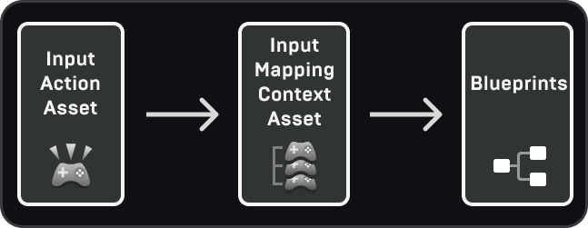
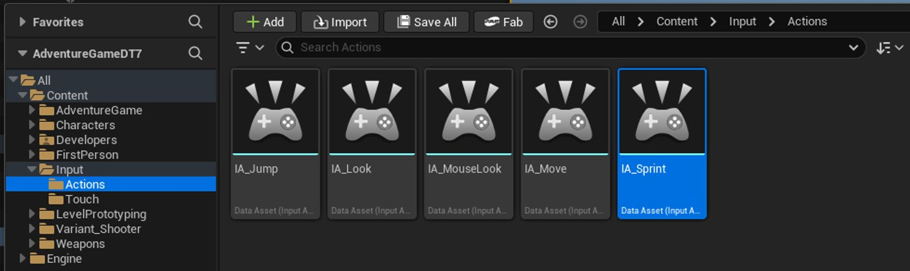
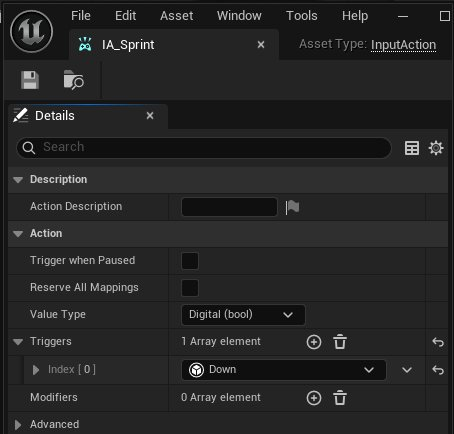
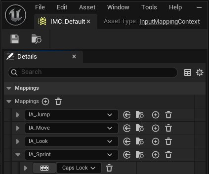
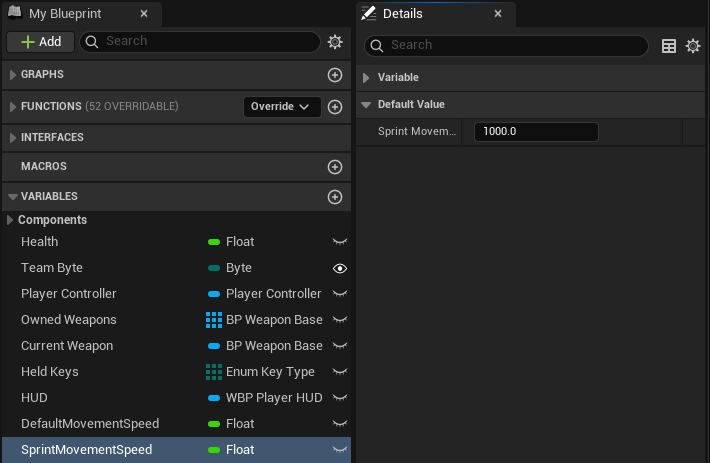
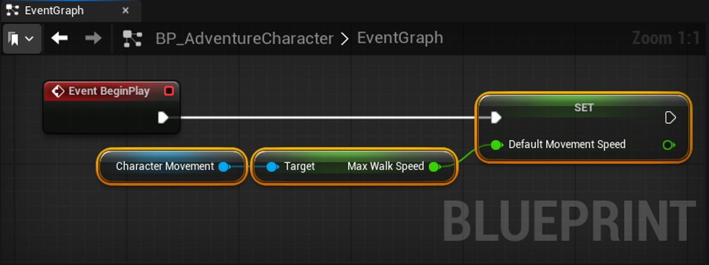
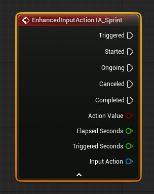
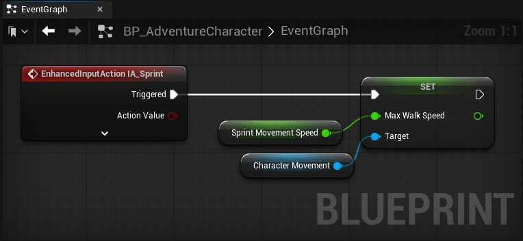

# 为玩家添加冲刺机制

> 路径：虚幻引擎5.7文档 / 入门指南 / 虚幻引擎新用户指南 / 设计解谜冒险游戏 / 为玩家添加冲刺机制

> 原始页面：https://dev.epicgames.com/documentation/unreal-engine/designer-09-sprint-input-action-in-unreal-engine

在本教程的此部分，你将修改玩家蓝图，增加按住特定键移动时冲刺的能力。 你将学习虚幻引擎的**增强输入系统（Enhanced Input System）**，这是接收玩家输入时推荐使用的系统。 你将使用此系统来：

- 创建一个**输入操作（Input Action）**，定义何种输入会触发冲刺移动。
- 通过将输入操作转换为事件，将其连接到玩家蓝图。
- 增加玩家冲刺时的移动速度。

在上一节中，你构建了敌方角色的逻辑，使敌人在玩家进入其视野时追逐玩家。 你可以通过冲刺机制，为玩家提供一种用于躲避这些敌方角色的游戏机制。

设计游戏时，务必为玩家构建挑战（例如敌人），同时为玩家提供可用于克服这些挑战的工具或策略。

冲刺是大多数游戏都会提供的一项热门功能，它能让玩家加快移动速度。 此机制会改变玩家在你设计的关卡空间中的移动方式。

## 开始之前

请确保你已掌握[设计解谜冒险游戏](../index.md)前一节中介绍的以下主题：

- 蓝图基础知识，如添加节点、函数和事件。

本系列教程的本文档需要用到以下资产：

- `BP_AdventureCharacter`

## 创建输入操作资产

首先，你将创建一个**输入操作**资产，它定义了：

- 操作的名称。
- 操作的值类型。
- 触发的类型（按下、按住或释放按键）。

输入操作是玩家角色蓝图在执行新行为之前监听的触发条件。

稍后，你将使用项目中已存在的**输入映射上下文（Input Mapping Context）**资产，将输入操作绑定到特定键位（也称为**映射**）。

下面是一个图表，表明了增强输入系统中使用的不同资产之间的关系。 如需了解更多信息，请参阅[增强输入（Enhanced Input）](../../../../gameplay-systems/input/enhanced-input/index.md)文档。

增强输入资产图

| 输入操作 | 输入映射上下文 | 蓝图 |
| --- | --- | --- |
| 定义意图与检测规则。 | 将按键和手柄按钮映射到输入操作。 | 使用输入操作来实现具体行为。 |

要为新的冲刺移动创建**输入操作（Input Action）**资产，请按照以下步骤操作：

1. 转到内容浏览器（Content Browser），然后导航到“Input > Actions”文件夹。 在此文件夹中，你将看到与Jump、Look、MouseLook和Move相关的输入操作资产。
2. 在**内容浏览器**中右键点击，转到**输入**并创建一个**输入操作**资产。
3. 将此资产命名为`IA_Sprint`。

   

   输入操作资源

   > [!NOTE]
   > 命名规范是为了方便我们确定这是输入操作文件，并不一定就要这样命名。
4. 双击`IA_Sprint`将其打开。 输入操作是一种数据资产，它会在一个新窗口中打开，并附带一个细节面板。

### 输入操作类型

让我们看一下`IA_Sprint`数据窗口中的**细节（Details）**面板。 使用**细节（Details）**面板修改此资产的属性，例如定义你希望从玩家角色接收的输入操作。

首先，找到**值类型（Value Type）**属性。 这将确定输入操作中的数据类型。 创建输入操作时，你需要根据希望通过该操作捕获的移动类型选择一个**值类型（Value Type）**。

默认情况下，输入操作的类型为**Digital (bool)**，这意味着它具有打开和关闭状态（冲刺或不冲刺）。 你将保留`IA_Sprint`的默认值。

**值类型**还可以是：

- **Axis1D**：该操作具有一个值，用于一维移动（向内和向外滚动）或标量调整（改变移动速度）。
- **Axis2D**：该操作具有用于二维移动的X和Y值，例如WSAD控制。
- **Axis3D**：该操作具有X、Y和Z值，用于三维移动，例如飞行或游泳控制。

### 使用触发器设置输入操作

要定义何种按键类型会触发冲刺动作，请按照以下步骤操作：

1. 在**操作（Action）**部分的触发器旁边，点击**加号 (+)**按钮向**触发器（Triggers）**数组中添加一个新元素。
2. 在你添加的新元素上，点击显示**None**的下拉字段。 你将看到一系列选项，例如**连击（Combo）**、**按住（Hold）**、**按下（Down）**，甚至是**点击（Tap）**等触摸输入。按住某个键通常会完成冲刺，因此请从列表中选**择按下（Down）**。
3. 点击窗口左上角的**保存（Save）**按钮以保存你的更改。 关闭`IA_Sprint`。

   

   输入操作编辑器

之所以应该选择**按下（Down）**而不是**按住（Hold）**，是因为**按下（Down）**会在按键时立即触发，而**按住（Hold）**会在按键被按住一段时间之后才触发。

**按住（Hold）**对于重击技能之类的动作很有用，这类动作需要你先蓄力，然后释放按键来发动攻击。 你可以将鼠标悬停在每个选项上，阅读提示文本，了解每个选项的更多信息。

> [!TIP]
> 展开触发器以查看其**触发阈值（Actuation Threshold）**，即输入设备需要被按下或移动多少距离才能触发该动作。 键盘按键在未按下时，驱动值为0；按下时，驱动值为1。 如果部分按下游戏手柄功能按钮的输入，则游戏手柄功能按钮还可以有0-1之间的小数值。

现在，我们的输入操作资产已设置完毕。 你已经将该操作命名为`IA_Sprint`，并且已经定义了触发该操作的条件（按下按键或按钮）。 接下来，你将使用输入映射上下文（Input Mapping Context）来定义具体哪个按键会触发该操作。

## 分配键映射

输入映射上下文资产会收集分配给它的输入操作资产，例如你刚刚创建的`IA_Sprint`，以设置输入键并将数值传递到角色蓝图，例如我们的玩家角色`BP_AdventureCharacter`。

要将按键映射到IA_Sprint操作，请按照以下步骤操作：

1. 返回内容浏览器（Content Browser）。 从“Input > Actions”文件夹，向上返回一级到Input文件夹。 在这里，你会看到两个输入映射上下文资产：`IMC_Default`和`IMC_MouseLook`。

   > [!NOTE]
   > IMC是输入映射上下文（Input Mapping Context）的缩写。
2. 双击**`IMC_Default`**，它将在带有细节（Details）面板的新编辑器窗口中打开。

   `IMC_Default`是我们在此项目中用于玩家默认技能（如移动和跳跃）的输入映射上下文资产。
3. 在**映射（Mappings）**部分，展开**映射（Mappings）**列表，可以看到三个条目：**IA_Jump**、**IA_Move**和**IA_Look**。 这些就是你之前在**“Input** > **Actions**”文件夹中看到的输入操作。
4. 点击**映射（Mappings）**旁边的**Add** (**+**)，向列表中添加一个新条目。
5. 对于新条目，使用下拉菜单选择你之前创建的**IA_Sprint**资产。
6. 展开**IA_Sprint**条目，显示该操作的按键选择界面。 点击**键盘**按钮，然后按键盘上的**Caps Lock**键。 你也可以使用下拉菜单为该操作分配一个按键。

   

   输入映射上下文编辑器
7. 保存并关闭输入映射上下文。

定义`IA_Sprint`输入操作键后，你现在有了一个在玩家按住它时触发的输入操作，并且该操作映射到**Caps Lock**键。

> [!WARNING]
> 某些键映射（Shift、Ctrl、Alt等）由虚幻编辑器使用，因此在PIE模式下测试游戏时可能不起作用。 如果使用其中一个映射，你需要在独立模式下测试，或在开发期间使用不同的键，然后在打包游戏之前切换到所需的键。 在PIE模式下通常安全的键映射包括字母和数字键、方向键、Caps Lock、Enter、Backspace、Page Up/Down和Home/End。

## 修改玩家蓝图以进行冲刺

设置好输入操作后，现在需要修改玩家蓝图，使其能够使用你分配的按键输入来进行冲刺。

你将通过以下方式实现冲刺功能：当玩家按下`IA_Sprint`的触发器时，加快玩家的移动速度。 当玩家松开冲刺键时，角色会返回到默认移动速度。

首先，为角色设置一个默认移动速度，然后再创建冲刺机制。

### 创建移动速度变量

首先，你需要创建变量来存储玩家的默认移动速度和冲刺移动速度。 玩家的移动组件设置了其默认移动速度，但将其保存在变量中可以保存该速度，并确保玩家在冲刺动作结束后能恢复到该速度。

要设置用于保存玩家不同移动速度的变量，请按照以下步骤操作：

1. 前往内容浏览器（Content Browser），导航至“Content > AdventureGame > Designer > Blueprints > Characters”文件夹，打开你的`BP_AdventureCharacter`蓝图。
2. 使用**我的蓝图**面板，添加一个名为**DefaultMovementSpeed**的新变量，类型为**浮点**。
3. 再添加一个名为**SprintMovementSpeed**的变量，同样也是**浮点**类型。
4. 点击蓝图编辑器的左上角的**编译**按钮。
5. 然后，点击**SprintMovementSpeed**变量。 在**细节**面板中，将**Default Value** > **Sprint Movement Speed**更改为**1000**。

   

   设置变量默认值

### 设置玩家的默认移动

在游戏开始时，捕获玩家的默认初始移动速度。

要保存游戏开始时的默认移动速度，请按照以下步骤操作：

1. 在事件图表（Event Graph）中，右键单击空白区域，创建一个Event BeginPlay节点。 此节点在游戏开始时执行一次。
2. 你将使用Event BeginPlay在游戏开始时获取玩家的默认移动速度。 拖动该节点的Exec引脚，并创建Set Default Movement Speed节点。
3. 正如你在创建`BP_Enemy`时所见，角色的移动组件包含控制其速度的属性。 从组件（Components）面板，将角色移动（CharMoveComp）拖入事件图表（Event Graph）。
4. 从Character Movement节点拖出引脚并创建Get Max Walk Speed节点。
5. 将Max Walk Speed引脚连接到Set Default Movement Speed节点。

此功能会将你创建的**DefaultMovementSpeed**变量的值设置为玩家的默认行走速度，该速度使用玩家**角色移动（Character Movement）**组件的**最大行走速度（Max Walk Speed）**。

示例图表配置

> [!TIP]
> 如果你选择**角色移动**组件，并查看细节面板中的**Character Movement:Walking分**段，你可以看到默认的**Max Walk Speed**为600 cm/s。
>
> **角色移动**组件包含许多控制角色移动方式的属性，你可以在运行时通过蓝图逻辑，使用和更改其中的任何属性。

### 定义冲刺动作行为

现在玩家有了起始移动速度，你可以在玩家按下冲刺键时增加该速度。

当你将输入操作添加到事件图表时，虚幻引擎会创建一个事件（Event）节点，该节点在玩家按下输入映射上下文（Input Mapping Context）中定义的该操作映射键时执行。 在本例中，**IA_Sprint**事件会在玩家按下**Caps Lock**时执行。

要使用你的`IA_Sprint`输入操作创建冲刺机制，请按照以下步骤操作：

1. 右键点击事件图表中的空白处，搜索**IA_Sprint**，然后在**Input** > **Enhanced Action Events**类别中选择**IA_Sprint**节点。

   

   单击节点底部的箭头以查看更多引脚。 你将使用**Triggered**和**Completed**引脚：

   - **Triggered**意味着玩家正在按操作键，因此它应该使角色以其**SprintMovementSpeed**移动。
   - **Completed**意味着玩家已经松开了按键，因此玩家应该返回到**DefaultMovementSpeed**。
2. 从**组件（Components）**面板中，再次将**角色移动（CharMoveComp）**组件拖入事件图表。
3. 拖出**Character Movement**引脚并创建一个**Set Max Walk Speed**节点。
4. 从**Set Max Walk Speed**节点中拖出**Max Walk Speed**引脚并创建**Get Sprint Movement Speed**节点。
5. 将**IA_Sprint**节点的**Triggered**引脚连接到**设置最大行走速度（Set Max Walk Speed）**节点。

   

   增强输入图表示例

这会将玩家角色的移动速度设置为**冲刺移动速度（Sprint Movement Speed）**的数值，即你之前设置为1000的数值。

最后，你需要在玩家松开按键时将移动速度改回默认值，此操作将被标记为**Completed**。

要在冲刺结束后将角色恢复到默认移动速度，请按照以下步骤操作：

1. 从**IA_Sprint**节点拖出**Completed**引脚并创建另一个**Set Max Walk Speed**节点。
2. 设置**Set Max Walk Speed**节点：

   1. 对于**Max Walk Speed**将引用连接到**DefaultMovementSpeed**。
   2. 对于**Target**，连接**角色移动**组件引用节点。

      > 图片已省略：冲刺机制设置

      冲刺机制设置
3. **编译**并**保存**你的蓝图。

## 测试角色

在虚幻编辑器中，点击**运行**按钮运行游戏。 现在，当你移动并按住映射的冲刺键（**Caps Lock**）时，你将能够冲刺。

在此视频中，角色以默认移动速度开始，然后在关卡中冲刺。

在玩家角色中试验不同的**最大行走速度（Max Walk Speed）**和**冲刺移动速度（Sprint Movement Speed）**数值，以确定最适合此游戏的数值。 现在玩家可以冲刺了，重新访问`BP_Enemy`角色并增加他们的**最大速度（Max Speed）**数值，以调整Hallway 3和Room 3中的遭遇战难度。

你也可以在本教程已有功能的基础上继续拓展，为游戏添加更多新的输入方式和行为逻辑。

## 下一步

现在你已经成功添加了玩家角色的所有机制和功能，你可以完成关卡了。 在本文档系列的最后一个模块中，你将使用目前已构建的所有元素对关卡进行最后的润色。

- [完成关卡](https://dev.epicgames.com/documentation/unreal-engine/designer-10-complete-the-level-in-unreal-engine) - 通过完成Gameplay循环并为玩家配置结束状态来完成关卡。
