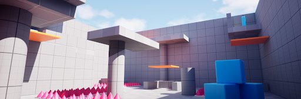
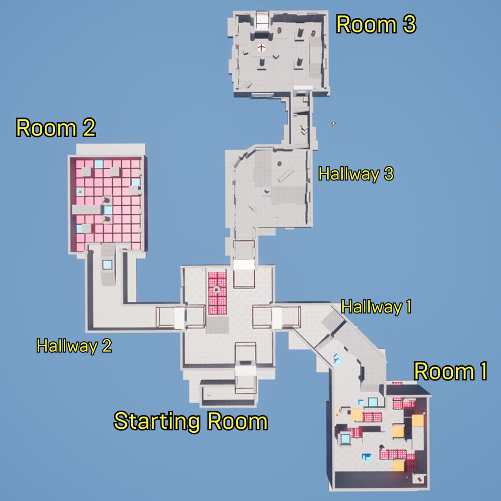

# 设计解谜冒险游戏

> 路径：虚幻引擎5.7文档 / 入门指南 / 虚幻引擎新用户指南 / 设计解谜冒险游戏

> 原始页面：https://dev.epicgames.com/documentation/unreal-engine/design-a-puzzle-adventure-game-in-unreal-engine

借助虚幻引擎提供的专业级工具，游戏创意即可变为现实。 在确定了想要的Gameplay类型后，便可着手构建用于定义游戏视觉世界的游戏空间和环境。

《设计师系列教程》概览

所谓游戏与关卡设计，就是要在为玩家设计挑战的同时，提供一个能够支撑这些体验的、充满趣味和吸引力的世界。 虽然《编写第一人称冒险游戏》（Code a First-Person Adventure Game）教程着重讲解如何使用C++创建Gameplay，但其实很多相同的元素也能通过蓝图脚本语言实现。 蓝图脚本语言非常灵活，非编程人员也能使用它来创建Gameplay、脚本事件以及可交互的元素。 在虚幻引擎中，可选择使用蓝图、C++或将两者相结合的方式来开发游戏。

在本系列教程中，我们将带领大家完整体验设计流程，学习如何使用蓝图构建关卡及若干谜题，并最终打造出完整的可玩Gameplay体验。 你不仅将学会如何用蓝图创建Gameplay，还将学会如何运用并复用各种Gameplay元素，通过“灰盒测试”的流程来完成关卡原型制作。

《设计师系列教程》之解谜游戏

## 《设计师系列教程》概览

学完本教程后，你将会构建出一个包含多个房间的冒险解谜游戏，并在其中展示多种不同的机制。

《设计师系列教程》关卡概览图

1. 设置并搭建关卡灰盒 这是关键的第一步。在着手处理关卡的具体机制和Gameplay前，应先通过这一步构思好整体的关卡设计。
2. 创建一个钥匙与门的开关机制。
3. 利用UMG为玩家的用户界面（UI）实现一个平视显示器（HUD）。
4. 设计方块谜题，该谜题最初由一个电灯开关激活器控制，之后会引入移动的平台。
5. 在平台跳跃游戏区域下方构建陷阱，并了解玩家失败的判定条件及如何设置持续伤害。
6. 配置敌人Pawn使其能够攻击玩家，并为玩家添加冲刺运动，让玩家可以迅速甩开敌人！
7. 添加一个结束状态，好让游戏判断结束的时机，最后再做一些额外的优化！

完成本教程的学习后，一个功能完备的解谜游戏就诞生了！

## 开始之前

- 如果你是虚幻引擎新手，建议先阅读[《虚幻引擎新用户指南》](../index.md)中的其他入门页面。
- 《编写第一人称冒险游戏》系列教程将讲解如何使用C++和虚幻编辑器构建一个自定义玩家角色。 《程序员系列教程》中构建的内容可以直接用作本系列教程的起点。

## 示例项目

以下提供了一个最终示例项目的下载链接，你可以使用本教程系列构建该项目。 你可以使用此示例项目预览最终成品，也可以将其作为参考，了解我们是如何构建和设计该项目的。

点击此处下载《设计师系列教程》

*（下载大小：75 MB）*

> [!NOTE]
> 要打开项目，请先解压文件，然后将**adventuredesigner**文件夹移动到你的虚幻项目目录下（默认位置为：`C:\Users\UserName\Documents\Unreal Projects`）。

## 我们开始吧！

- [项目设置与关卡粗模搭建](designer-01-project-setup-and-level-blockout/index.md) - 开始规划、设计和搭建你的解谜冒险关卡吧！ 本节将练习使用不同的视口（Viewport）模式、变换物体以及利用大纲（Outliner）视图整理资产。
- [创建钥匙](designer-02-create-a-key/index.md) - 使用蓝图，学习创建一个可供玩家拾取的钥匙。
- [用钥匙开启门](designer-03-open-doors-with-keys/index.md) - 本节将配置BP_DoorFrame蓝图，使门能够改变颜色，且只有匹配的BP_Key才能将其打开。
- [玩家HUD](designer-04-player-hud/index.md) - 创建一个简单的抬头显示（HUD），它会在玩家拾取物品时更新。
- [谜题：开关和立方体](designer-05-puzzles-switches-and-cubes/index.md) - 在平台解谜游戏分段的第一部分中，使用材质、物理效果和蓝图创建由立方体激活的开关。
- [谜题：移动平台](designer-06-puzzles-moving-platforms/index.md) - 在平台游戏的第二部分，你将了解如何使用蓝图创建移动平台，并学习如何调试你的脚本。
- [陷阱和伤害](designer-07-traps-and-damage/index.md) - 学习构建能够对玩家造成伤害的环境蓝图，并构建在玩家被淘汰时触发的游戏结束循环。
- [创建敌人](https://dev.epicgames.com/documentation/unreal-engine/designer-08-create-an-enemy-in-unreal-engine) - 构建游戏逻辑，创建可以造成和接收伤害的敌人角色。
- [为玩家添加冲刺机制](designer-09-sprint-input-action/index.md) - 使用输入操作（Input Actions）为玩家角色的移动集添加冲刺机制。
- [完成关卡](https://dev.epicgames.com/documentation/unreal-engine/designer-10-complete-the-level-in-unreal-engine) - 通过完成Gameplay循环并为玩家配置结束状态来完成关卡。
- [额外机制：生成新立方体](designer-11-spawn-new-cubes-mechanic/index.md) - 为你的解谜冒险游戏添加一个新机制，在设定的上限内生成 BP_Cube Actor。
