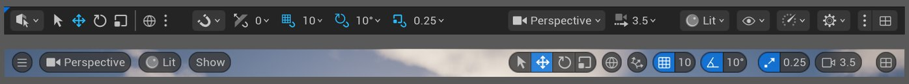
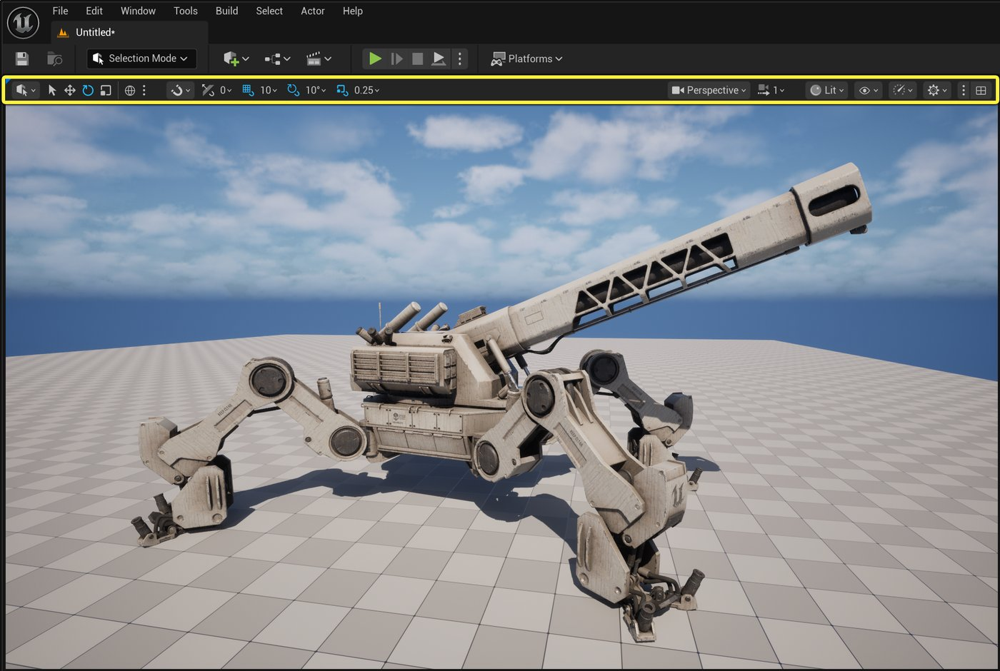
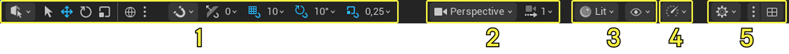
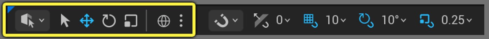
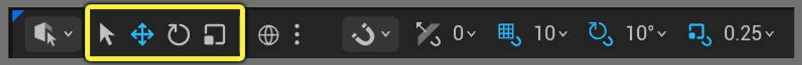
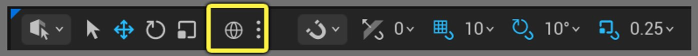
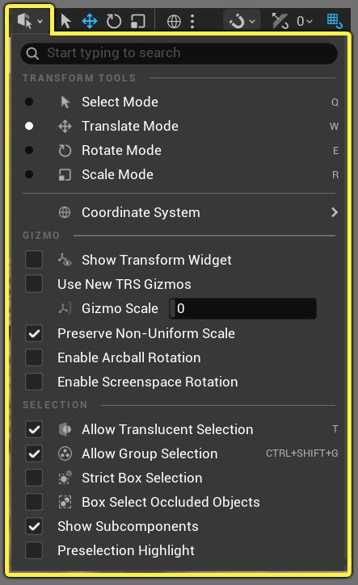
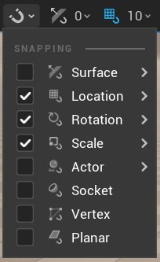

# 视口工具栏

> 路径：虚幻引擎5.7文档 / 入门指南 / 虚幻引擎新用户指南 / 视口工具栏

> 原始页面：https://dev.epicgames.com/documentation/unreal-engine/viewport-toolbar

使用虚幻编辑器时，你会看到不同的关卡编辑器模式，每种模式都有自己的工作流程、功能以及与之相对应的工具栏。 **视口工具栏**位于编辑器视口的上方，其中包含了各种快速选择工具和菜单选项，这些工具和选项会影响你与对象和整体关卡的交互方式，以及你在其中会看到的内容。 视口工具栏的具体选项会随关卡编辑器当前使用的模式而改变。

## 优化后的视口工具栏和旧版工具栏的区别

虚幻引擎5.6引入了优化后的视口工具栏，该工具栏采用了适应现代工作流程的新式布局。 对于关卡视口和所有其他也存在视口的资产编辑器，新版视口工具栏都完全取代了旧版的视口工具栏。

虚幻引擎5.6及更高版本中优化后的关卡视口工具栏对比虚幻引擎早期版本中的旧版视口工具栏。

更新后的视口工具栏具有以下优势：

- 按逻辑分类的功能有固定的显示位置，例如变换、对齐以及视口模式等。
- 统一了之前位于高级别设置下拉菜单中的相关工具和选项。
- 为较小的视口改进了溢出管理机制，即快速选择元素和菜单会缩放并折叠成单一的溢出菜单。
- 为关卡编辑器模式和资产编辑器设计了独特的工具栏，并分别配置了专用功能按钮。
- 可供用户自定义的菜单。
- 通过 `ToolsMenu` 系统实现了更好的可扩展性和自定义功能。

## 视口工具栏界面

无论是在关卡编辑器中还是在资产编辑器中，工具栏都位于视口窗口的正上方。

优化后的视口工具栏总是位于视口的顶部，是视口窗口上方的独立工具栏。 其设置项和工具的类别分组如下：

1. [变换和对齐工具](index.md#viewport-toolbar-transform-amp-snapping-tools)
2. [摄像机相关工具](index.md#viewport-toolbar-camera-settings)
3. [视图模式和显示标记选项](index.md#viewport-toolbar-view-mode-and-show-flag-options)
4. [性能和可伸缩性选项](index.md#viewport-toolbar-performance-and-scalability-tools)
5. [视口相关选项](index.md#viewport-related-settings)

## 视口工具栏的变换和对齐工具

**变换**和**对齐**工具构成了你在编辑器视口中会用来选择和操作对象的大部分工具。 具体包括用于选择、对齐和空间定向的工具，以及最常用的快速选择选项。

### 变换工具

**变换****工具**是一组快速选择工具，用来移动、旋转和缩放对象，并设置这些操作应在哪个空间（局部或世界）中进行。 这些选项是你与关卡中的对象进行交互的方式。 此部分的工具栏还包含了一个下拉菜单，其中给出了更多与变换相关的选项。

你可以使用这些快速选择工具栏选项来操作视口中的对象：

| 图标 | 名称 | 键盘快捷键 | 说明 |
| --- | --- | --- | --- |
| [变换工具选择图标](https://dev.epicgames.com/community/api/documentation/image/ae506c2d-8fd3-457d-9539-b2146473716b?resizing_type=fit) | **选择对象** | **Q** | 使用此选项选择视口中的对象。 |
| [选择和变换图标](https://dev.epicgames.com/community/api/documentation/image/e49bce41-2373-4fb9-8a26-e677fc9d7fd1?resizing_type=fit) | **选择并平移对象** | **W** | 使用此选项以选择对象，并使用平移小工具在世界范围内移动对象。 使用小工具即可沿单轴、双轴或三轴移动对象。 |
| [选择并旋转对象工具图标](https://dev.epicgames.com/community/api/documentation/image/271fc851-fde5-4700-87fc-041883d7c33a?resizing_type=fit) | **选择并旋转对象** | **E** | 使用此选项即可选择对象，并使用旋转小工具将其旋转。 使用小工具即可沿单个轴旋转所选对象。 |
| [选择并缩放对象工具图标](https://dev.epicgames.com/community/api/documentation/image/3b1c8342-7757-4025-8152-135b8b57f5a6?resizing_type=fit) | **选择并缩放对象** | **R** | 使用此选项即可选择对象，并使用缩放小工具将其缩放。 使用小工具即可沿单轴、双轴或三轴统一缩放对象。 |

|  |  |  |
| --- | --- | --- |
| 变换工具移动对象的视频。 | 变换工具旋转对象的视频。 | 变换工具缩放对象的视频。 |
| **移动** | **旋转** | **缩放** |

点击**坐标空间**图标即可切换世界空间和局部空间，这将影响视口中对象的平移和旋转方式。

| 图标 | 名称 | 键盘快捷键 | 说明 |
| --- | --- | --- | --- |
| [世界空间坐标图标](https://dev.epicgames.com/community/api/documentation/image/de6b6872-dfd8-4213-947f-7a53aa7916ff?resizing_type=fit) | **世界空间坐标** | **CTRL + `** | 世界空间（整个关卡）所使用的坐标系的图标，其原点是场景（世界网格）的中心。 该坐标系是固定的，不能变换。 对象会按照相对于关卡原点的绝对单位进行平移和旋转，并且相对于整个关卡进行缩放。 |
| [局部空间坐标图标](https://dev.epicgames.com/community/api/documentation/image/2f3c3533-737d-4f16-9f8e-e00108270761?resizing_type=fit) | **局部空间坐标** | **CTRL + `** | 局部（对象）空间所使用的坐标系的图标，其坐标系是相对于该Actor所附的场景组件而言的。 每个Actor在场景中都有一个相对于其枢轴点的局部空间坐标系。 如需相对于其父对象平移或旋转对象，请使用局部空间。 |

|  |  |
| --- | --- |
| 在世界空间中进行查看和旋转的视频。 | 在局部空间中进行移动和旋转的视频。 |
| **世界空间中的移动和旋转** | **局部空间中的移动和旋转** |

> [!NOTE]
> 如需深入了解虚幻引擎的坐标系以及在3D空间中变换物体所使用的坐标空间，请参阅[坐标系和空间](https://dev.epicgames.com/documentation/zh-cn/unreal-engine/coordinate-system-and-spaces-in-unreal-engine)文档。

#### 视口相关的变换工具菜单

**变换**工具栏下拉菜单包含了一系列的变换选项、坐标空间以及小工具在关卡编辑器视口中的显示方式的选项。 这里的部分选项，如变换工具和坐标系等，可以在视口工具栏中作为快速选择选项使用。

该菜单的类别分组如下：

| 菜单分段 | 名称 | 说明 |
| --- | --- | --- |
| [变换工具菜单。](https://dev.epicgames.com/community/api/documentation/image/bdc9649c-2d09-488f-8673-bb79b4282b38?resizing_type=fit) | **变换工具（Transform Tools）** | 菜单选项，用于选择要使用的变换工具或坐标空间。 这些选项在视口工具栏中作为快速选择选项呈现。 |
| [变换工具菜单的小工具选项。](https://dev.epicgames.com/community/api/documentation/image/06e546e2-d9eb-459b-a5ec-079bffbea4b7?resizing_type=fit) | **小工具（Gizmo）选项** | 菜单选项，可用来更改在选中对象时变换工具的小工具的查看和操作方式。 |
| [变换工具菜单的选择选项。](https://dev.epicgames.com/community/api/documentation/image/5599b4c9-9b70-42b8-b605-7478bba5a4a5?resizing_type=fit) | **选择（Selection）选项** | 菜单选项，可用来更改你在视口中选择对象的方式。 |

### 对齐工具和对齐设置

**对齐（Snapping）**工具包括了一组决定对齐尺寸和角度的快速选择工具，可按递增的量来移动、旋转和缩放对象。 对齐设置还自带选项来设置对象该如何对齐其他对象和曲面。

**对齐设置**下拉菜单将显示开关列表，供你选择对象在世界中的对齐方式。

此工具栏自带快速选择对齐开关和尺寸/角度的增量设置。

> 图片已省略：对齐工具增量设置。

点击工具栏中的快速选择对齐图标旁边的数值时，你可以使用其下拉菜单来设置数值，或从可用数值中选择要使用的数值。

|  |  |  |  |
| --- | --- | --- | --- |
| [表面对齐设置选项。](https://dev.epicgames.com/community/api/documentation/image/5894c0db-ee98-4d80-a58c-95bc5fbcb71d?resizing_type=fit) | [对齐菜单的网格对齐选项。](https://dev.epicgames.com/community/api/documentation/image/dd1fa1ba-a2d2-4b9a-97ef-b8a1ff18f917?resizing_type=fit) | [旋转角度对齐增量。](https://dev.epicgames.com/community/api/documentation/image/fc23d316-d3f6-4468-8712-7bc4c84c0bd9?resizing_type=fit) | [对齐菜单的缩放选项。](https://dev.epicgames.com/community/api/documentation/image/8938f8f1-2312-442a-a40b-213d2948a5f3?resizing_type=fit) |
| **表面对齐设置** | **网格对齐大小** | **旋转角度对齐增量** | **缩放对齐大小** |

#### 对齐到表面设置项

**表面对齐（Surface Snapping）**设置的下拉菜单可设置对象在场景中被拖动时的对齐行为。

> 图片已省略：表面对齐菜单。

**旋转至表面法线（Rotate to Surface Normal）**设置可切换对象是否应对准其对齐的表面的法线方向。 例如，当你沿着曲面拖动一个对象时，例如下方的柱子，若启用此设置，那么它就会对准曲面的方向。 若禁用此设置，则柱子将始终朝向其固定的方向。

|  |  |
| --- | --- |
| 开启旋转至表面法线后进行操作的视频片段。 | 关闭旋转至表面法线选项后的旋转视频。 |
| **旋转到表面法线：开启（默认）** | **旋转到表面法线：关闭** |

## 视口工具栏摄像机设置

**摄像机设置**包含了影响视口的摄像机视图和场景外观的选项。

> 图片已省略：工具栏摄像机设置。

| 图标 | 名称 | 说明 |
| --- | --- | --- |
| [摄像机透视选项](https://dev.epicgames.com/community/api/documentation/image/c7912095-a533-40f5-856f-e078bb46a4af?resizing_type=fit) | **摄像机选项** | 一系列影响视口外观及其视图的选项，同时包含了高分辨率屏幕截图工具的访问。 |
| [摄像机速度选项图标](https://dev.epicgames.com/community/api/documentation/image/bd8d7171-3738-47cc-9fa2-7bfe01f68866?resizing_type=fit) | **摄像机速度选项** | 控制摄像机在世界中的移速的选项。 |

### 摄像机选项菜单

点击**摄像机选项**下拉菜单即可打开一系列选项，如更改视口外观、切换摄像机的透视视图和正交视图、将视口设为过场动画视图等。 此菜单中的选项会根据关卡中放置的摄像机而变化，也取决与你所使用的是透视视图还是正交视图。

> 图片已省略：摄像机工具栏菜单。

该菜单的具体分段如下：

| 菜单分段 | 名称 | 说明 |
| --- | --- | --- |
| [摄像机透视菜单选项。](https://dev.epicgames.com/community/api/documentation/image/d2a1dcad-62c0-433f-9ccf-edeaca4d7114?resizing_type=fit) | **透视（Perspective）** | 此摄像机视图会模拟人眼感知世界的方式。 此摄像机视图是所有视口使用的默认视图。 此菜单中的**视图（View）**选项为透视摄像机视图所独有，会影响视野、近景平面和远景平面。 |
| [摄像机正交菜单选项。](https://dev.epicgames.com/community/api/documentation/image/a9f68cf9-3145-4b84-bf2c-be0b029210a2?resizing_type=fit) | **正交（Orthographic）** | 此摄像机视图会使用保持平行线的投影方式，因此无论对象与摄像机的距离如何，它们看起来都会具有相同的比例。 这包括了顶部、底部、左侧、右侧、正面和背面的视图。 |
| [摄像机移动菜单选项。](https://dev.epicgames.com/community/api/documentation/image/b3da86b3-a251-4b31-980e-dfe1c986fcec?resizing_type=fit) | **移动（Movement）** | 可用来更改视口摄像机移动方式的选项。 你可以操控场景中的其他Actor并更改摄像机的移动方式。 |
| [摄像机视图菜单选项。](https://dev.epicgames.com/community/api/documentation/image/dd5c3635-14fe-457a-8c9e-7269532ad0d5?resizing_type=fit) | **视图（View）** | 当使用**透视**视图时，这些选项可更改视口的视野、近景平面和远景平面，以决定视口中显示内容的方式。 |
| [摄像机曝光菜单选项。](https://dev.epicgames.com/community/api/documentation/image/b3793464-c3de-4b3e-98fc-f94dcf4f90d3?resizing_type=fit) | **曝光（Exposure）** | 重载设置，可更改视口中的曝光值。 禁用游戏设置（Game Settings）后，你可以使用文本字段重载视口的摄像机曝光值。 |
| [摄像机视口类型菜单选项。](https://dev.epicgames.com/community/api/documentation/image/7d82e614-1cb9-4348-bcf5-cb398be37d8e?resizing_type=fit) | **视口类型（Viewport Type）** | 选择要使用的视口布局。 **过场动画视口（Cinematic Viewport）**布局专为过场动画工作流程而定制，并在工具栏中添加了**构图覆层（Composition Overlays）**选项菜单，让你可以选择不同的覆层进行取景、遮罩和构图。 |
| [摄像机创建菜单选项。](https://dev.epicgames.com/community/api/documentation/image/579d922e-eb8e-4554-8dbd-66de7e007b3e?resizing_type=fit) | **创建（Create）** | 在世界中创建摄像机Actor和在世界中创建摄像机视图的场景书签的选项。 |
| [摄像机选项菜单的选择。](https://dev.epicgames.com/community/api/documentation/image/32c252f5-e48a-48d3-8cff-c507454cbcd9?resizing_type=fit) | **选项（Options）** | 各种影响视口的可切换设置，例如禁用所选项高亮显示和小工具的游戏视图，或**预览已选摄像机（Preview Selected Cameras）**选项，可设置视口右下方所选摄像机的预览窗口的大小。 |

### 摄像机的透视视图和正交视图

你可以使用**摄像机选项（Camera Options）**菜单来选择视口中显示内容的方式。 视口默认使用**透视（Perspective）**视图，但你也可以从**正交（Orthographic）**视图列表中选择视图来使用。

> 图片已省略：透视和正交菜单选项。

下方是正交视图和透视视图在视口中的不同视图示例。

> 图片已省略：展示正交视图和透视视图的4个视口。

### 移动选项

菜单的**移动（Movement）**选项分段中的选项可供你设置如何使用视口操控Actor以及更改摄像机在视口中的移动方式。

> 图片已省略：摄像机移动选项菜单。

此分段的菜单包括的设置项如下：

| 设置名称 | 说明 |
| --- | --- |
| 操控 |  |
| **操控（Pilot）[选择的Actor]** | 使用视口功能按钮移动选择的Actor，并将视口绑定至Actor的位置及方向。 |
| **停止操控Actor（Stop Piloting Actor）** | 当为Actor启用了操控功能时，此操作会停止在当前视口中对该Actor的操控。 同时从视口当前操控的Actor处解锁视口的位置和朝向。 |
| **准确摄像机视图（Exact Camera View）** | 在使用视口操控摄像机时，切换摄像机视图的显示方式。 |
| **选择被操控的Actor（Selected Piloted Actor）** | 在大纲视图中选择当前操控的Actor。 |
| 摄像机移动 |  |
| **摄像机速度（Camera Speed）** | 设置摄像机在视口中的移动速度。 相关选项在快速选择工具栏中同样可用。 |
| **聚焦选中项（Frame Selected）** | 将视口定位到所选的Actor上。 |
| **将摄像机移至对象（Move Camera to Object）** | 移动当前的摄像机以匹配选定对象的位置和旋转。 |
| **将对象移至摄像机（Move Object to Camera）** | 移动选定对象以匹配当前摄像机的位置和旋转。 |
| **围绕选择环绕运动（Orbit Around Selection）** | 启用后，摄像机将围绕视口中当前选择的位置进行轨道运动。 |
| **链接正交摄像机运动（Link Ortho Camera Movement）** | 启用后，所有正交视口都将链接到相同位置，并一同移动。 禁用后，正交视口将相互独立地移动。 |
| **正交缩放到光标（Ortho Zoom to Cursor）** | 启用后，正交视口的缩放将以鼠标光标位置为中心。 禁用后，则围绕视口的中心进行缩放。 |

### 视图选项

视口使用**透视（Perspective）**视图时，**视图（View）**选项将可用。 这些选项可配置视口摄像机的查看角度，以及可以看到距离该摄像机多远的内容。

> 图片已省略：视野的菜单选项。

此分段包括的设置项如下：

| 设置名称 | 说明 |
| --- | --- |
| **视野（Field of View）** | 设置视口摄像机的查看角度。 此角度决定了在给定时间点上对摄像机可见的世界的范围。 默认查看角度为**90度**。 角度越大，视野越宽阔，你能看到的世界越多，但这会使摄像机的视图产生倾斜。 角度越小，你能看到的世界越少，镜头感觉越近，所看到的内容范围越有限。 |
| **近景平面（Near View Plane）** | 设置当摄像机靠近某表面时，裁剪对象所用的平面的大小。 值越大，裁剪平面就越大，越让你能容易地透视对象。 |
| **远景平面（Far View Plane）** | 设置物体能在屏幕上渲染的最远距离。 此值不会影响启用了Nanite的对象。 |

下方示例展示了调整视野角度对视图的影响：

|  |  |  |
| --- | --- | --- |
| [65度时的视野示例。](https://dev.epicgames.com/community/api/documentation/image/dd0d0ca8-bdbb-4ba2-a61e-87d8d7ef68a9?resizing_type=fit) | [90度时的视野示例。](https://dev.epicgames.com/community/api/documentation/image/e1c26346-f98b-45a0-9ab5-98c04e148147?resizing_type=fit) | [120度时的视野示例。](https://dev.epicgames.com/community/api/documentation/image/e95c2bfd-c094-4c7f-bff7-80380a40280d?resizing_type=fit) |
| **视野：65度** | **视野：90度（默认）** | **视野：120度** |

### 创建选项

**创建（Create）**选项让你能根据当前视口的位置和方向，在世界中放置摄像机和书签。

> 图片已省略：创建摄像机菜单中的选项。

此分段包括的选项如下：

| 设置名称 | 说明 |
| --- | --- |
| 创建摄像机 |  |
| **摄像机Actor（Camera Actor）** | 在视口的当前位置和方向上生成一个摄像机Actor。 |
| **过场动画摄影机Actor（Cine Camera Actor）** | 在视口的当前位置和方向上生成一个过场动画摄像机Actor。 |
| 书签 |  |
| **设置书签（Set Bookmark）** | 从列表中选择一个书签并关联设置当前视口的位置和方向。 |
| **管理书签（Manage Bookmarks）** | **清除书签（Clear Bookmark）**：清除已保存的指定书签。**简洁书签（Compact Bookmarks）**：尝试移动书签索引，以使其保持连贯。 例如，如果你为插槽1、2和4设置了书签，则此操作会尝试将书签4移动到书签3的插槽位置。**清除所有书签（Clear All Bookmarks）**：清除所有已保存的书签。 |
| **书签列表（Bookmarks List）** | 所有已保存书签的列表以及它们所对应的键盘快捷键。 |

### 通用选项

菜单的**选项（Options）**分段包含了可为视口启用的常规设置。 它还让你能访问**高分辨率屏幕截图（High Resolution Screenshot）**工具，并用它快速从视口中截取静态图像。

> 图片已省略：通用选项菜单项目。

此分段包括的选项如下：

| 设置名称 | 说明 |
| --- | --- |
| **允许过场动画控制（Allow Cinematic Control）** | 启用后，允许在这个视口中播放过场动画（Sequencer）的预览。 |
| **游戏视图（Game View）** | 启用后，视口将显示场景在游戏中的效果，即没有编辑器控件、所选项的高亮显示，也没有通常仅在编辑器中可见的所有其他元素。 |
| **允许摄像机晃动（Allow Camera Shakes）** | 启用后，允许摄像机晃动预览面板对此视口应用晃动。 |
| **预览已选摄像机（Preview Selected Cameras）** | 启用此项后，选择摄像机Actor即可在当前的编辑器视口中，以摄像机的角度显示一套生动的画中画式预览。 使用此功能即可让你调整位置和后期处理等其他设置，而不必控制摄像机本身。 **预览大小（Preview Size）**的值可调整摄像机视图的画中画预览窗口的大小。 |
| **高分辨率截图（High Resolution Screenshot）** | 打开控制面板对话框，获取当前所用视口的高分辨率屏幕截图。 |

#### 高分辨率截图工具

**高分辨率屏幕截图（High Resolution Screenshot）**工具是一个对话框窗口，你可以使用它来截取当前视口窗口的静态图像，或者，你也可以使用**裁剪**工具来选择部分视口以进行截取。 它还提供了一些可供开启的输出选项。

> 图片已省略：高分辨率截图工具的菜单选项。

如需详细了解如何使用此工具，请参阅[高分辨率截图工具](../../../working-with-media/capturing-media/taking-screenshots/index.md)。

### 摄像机速度选项

**摄像机速度（Camera Speed）**下拉菜单中的选项了决定摄像机在世界中移动的速度。

> 图片已省略：摄像机速度菜选项目的视图。

| 设置名称 | 说明 |
| --- | --- |
| **摄像机速度（Camera Speed）** | 设置第一人称模式下的摄像机速度。按住任一鼠标键（鼠标左键或鼠标右键）并使用滚轮即可调高或调低镜头速度。 |
| **速度标量（Speed Scalar）** | 乘以摄像机速度滑块的有效值，从而控制滑块改变摄像机速度的效率。 |
| **基于距离的摄像机速度（Distance Based Camera Speed）** | 启用后，则根据摄像机与其观察位置之间的距离调整透视摄像机的速度。 |

## 视口工具栏视图模式和显示标记选项

视口的**视图模式（View Mode）**和**显示标记（Show Flag）**选项可启用不同的可视化模式和选项，以允许或禁止在视口中渲染特定的元素。

> 图片已省略：视图模式和显示标记的工具栏图标。

| 图标 | 名称 | 说明 |
| --- | --- | --- |
| [视图模式按钮的图像。](https://dev.epicgames.com/community/api/documentation/image/d0c9d681-cd02-4cf8-9768-1434de9a49b9?resizing_type=fit) | **视口模式** | 可视化模式的列表，可方便你查看场景中正在处理的特定类型的数据，例如仅光照、反射或缓冲区可视化。 这些模式可以帮助你诊断并调查项目中的特定问题。 |
| [显示标记图标的视图。](https://dev.epicgames.com/community/api/documentation/image/f073e230-ba36-4fc6-a965-970cbb9c04c8?resizing_type=fit) | **显示标记** | 视口中可显示或隐藏的引擎功能的列表。 例如，你可以禁用所有粒子系统、单个的后期处理功能等等。 |

### 视图模式

**视口模式**下拉菜单给出了多种可视化选项供你选择。 选择后，这些选项将仅对当前视口应用。

> 图片已省略：视口模式下拉菜单项目的图像。

以下是视口应用不同视口模式后的示例：

|  |  |  |
| --- | --- | --- |
| [墙体和Actor有光照的视图。](https://dev.epicgames.com/community/api/documentation/image/49689c22-40b5-4c34-a2d6-b59341946601?resizing_type=fit) | [墙体和Actor无光照的视图。](https://dev.epicgames.com/community/api/documentation/image/66712af5-54d0-4dc1-a79f-969d55f8f7a4?resizing_type=fit) | [墙体和Actor在渐变光源下的视图。](https://dev.epicgames.com/community/api/documentation/image/359774d1-bff4-4026-9601-2ae2e5f9f052?resizing_type=fit) |
| 视口模式：有光照（默认） | 视口模式：无光照 | 视口模式：光源复杂度 |

如需详细了解如何在项目工作流程中使用这些视口模式，请参阅[视图模式](../../../building-virtual-worlds/level-editor/editor-viewports/viewport-modes/index.md)。

### 显示标记

**显示标志**下拉菜单包含许多选项，可用来开关引擎功能的可视性，例如光照、后期处理、几何体类型等。

> 图片已省略：显示标记菜单项目的图像。

如需详细了解如何在项目中使用这些显示标记，请参阅[视口显示标记](../../../building-virtual-worlds/level-editor/editor-viewports/viewport-show-flags/index.md)。

## 视口工具栏性能和可伸缩性工具

**性能**和**可伸缩性工具**菜单包含的选项会影响视口中内容的外观和性能。 你可以用这些工具模拟内容在特定平台上的显示效果、设置项目的可伸缩性（以使其易于使用），以及查看游戏在不同可伸缩性选项下的视觉效果。 这能帮你为项目设置合适的可伸缩性选项。

> 图片已省略：工具栏上的可伸缩性菜单选项的图像。

### 实时视口

**实时视口（Realtime Viewport）**可切换当前视口是否应逐帧更新。

禁用后，只有你在场景中移动时，视口才会更新。 我们在视口工具栏的性能和可伸缩性下拉菜单旁边添加了一个警告图标。 点击该图标即可恢复视口的实时性。

> 图片已省略：实时查看器旁边的警告图标的图像。

### 预览平台

**预览平台（Preview Platform）**卷展栏菜单包含许多平台选项供你选择。 选择平台及其目标即会触发引擎的着色器重新编译。 完成后，视口会更新以显示使用此目标渲染场景的近似效果。

每个平台均可以拥有多个目标，具体取决于其支持的引擎渲染路径。

> 图片已省略：预览平台菜单的下拉菜单。

此菜单卷展栏包括的选项如下：

| 设置名称 | 说明 |
| --- | --- |
| 预览平台 |  |
| **禁用预览（Disable Preview）** | 禁用当前选定的所有预览平台目标，并将其恢复为操作系统的默认预览。 Windows的默认预览是指搭载Shader Model 6（SM6）的Windows平台。 |
| **[选择预览平台]** | 从平台目标列表中选择要在主编辑器视口中预览的目标平台。 每个平台都可以支持多个目标，例如Android平台就能使用OpenGL和Vulkan预览选项。 某些平台预览选项（例如游戏主机平台）仅在安装其SDK后才可用。 |

下方场景显示了Windows的默认视口预览设置与在视口中预览Android场景的对比。

|  |  |
| --- | --- |
| [大厅内的雕像，图像较暗。](https://dev.epicgames.com/community/api/documentation/image/c0856d72-92c2-4dcd-829b-860db192335a?resizing_type=fit) | [大厅内的雕像，光照较好。](https://dev.epicgames.com/community/api/documentation/image/ac520dee-ed6d-4d1a-9379-9e5b9d26ca67?resizing_type=fit) |
| **使用SM6的Windows** | **使用Vulkan高设置的Android** |

如需更多信息，请参阅[移动预览器](../../../mobile-development/development-tools-for-mobile-applications/using-the-mobile-previewer/index.md)。

### 视口可伸缩性

**视口可伸缩性（Viewport Scalability）**选项包含引擎常用设置的卷展栏菜单。 你可以将单个功能类别更改为低（Low）、中（Medium）、高（High）、极高（Epic）或过场动画（Cinematic）级别，也可以选择任意质量选项，将所有类别设为低（Low）、中（Medium）、高（High）、极高（Epic）或过场动画（Cinematic）。 或者，你也可以选择**自动（Auto）**选项，根据系统规格及其性能配置可伸缩性选项。

> 图片已省略：视口可伸缩性组的图像。

当可伸缩性选项被设为任意非默认值时，工具栏上就会出现此警告图标。 这表示在编辑器外运行的游戏效果并未反映当前可伸缩性选项的设置。 点击此图标即可将可伸缩性选项重置为默认设置。

> 图片已省略：工具栏上的视口可伸缩性图标。

如需更多信息，请参阅[可伸缩性](../../../designing-visuals-rendering-and-graphics/optimizing-and-debugging-projects-for-realtime-rendering/scalability/index.md)。

### 材质质量级别

**材质质量级别（Material Quality Level）**卷展栏菜单列出了低（Low）、中（Medium）、高（High）和极高（Epic）四种质量级别供你选择。 你可以使用这些级别检查使用**Quality Switch**节点的所有材质。 你也可以使用这些菜单选项仅检查视口中的材质。 材质质量的切换对可伸缩性选项也适用。

> 图片已省略：材质质量菜单的选项。

### 屏幕百分比

**屏幕百分比（Screen Percentage）**卷展栏菜单提供了视口当前所用屏幕百分比的信息，以及重载视口中屏幕百分比的选项。 此菜单中的摘要（Summary）会提供关于视口及其当前设置的具体信息。

> 图片已省略：屏幕百分比菜单的选项的图像。

## 视口相关设置

视口的**设置**和**覆层**菜单可帮你设置音频、视口内的鼠标移动、视口布局选项（用于处理多个视口）等。

> 图片已省略：工具栏上的设置项和视口布局图标的图像。

| 图标 | 名称 | 说明 |
| --- | --- | --- |
| [视口设置图标。](https://dev.epicgames.com/community/api/documentation/image/a2b5aef5-bf6b-412c-872e-040cd8d471c5?resizing_type=fit) | **视口设置** | 用于控制关卡编辑器中音量的设置项列表，以及用于在关卡编辑器视口中交互和遍历场景的可配置功能按钮等等。 |
| [视口布局图标。](https://dev.epicgames.com/community/api/documentation/image/58ab5bd4-f848-4bc3-8906-7015e98995ec?resizing_type=fit) | **视口布局选项** | 使用多个视口时，可供选择的视口布局列表。 |

### 视口设置

**视口设置**菜单包括影响视口内功能按钮和对象交互的选项、音频播放的声音级别以及负责视口配置的**编辑器偏好设置（Editor Preferences）**的快速访问入口。

> 图片已省略：视口设置菜单的选项。

| 设置项名称 | 说明 |
| --- | --- |
| 设置项 |  |
| **关卡编辑器音量（dB）（Level Editor Volume (dB)）** | 设置使用关卡编辑器时，关卡中所放置的音频的预览音量（按分贝计）。 |
| 功能按钮 |  |
| **鼠标灵敏度（Mouse Sensitivity）** | 使用鼠标滚轮时，透视摄像机在世界中移动的速度有多快。 |
| **鼠标滚动缩放速度（Mouse Scroll Zoom Speed）** | 设置使用鼠标滚轮时，摄像机向前或向后移动时的增量速度。 |
| **反转中部鼠标平移（Invert Middle Mouse Pan）** | 启用后，视口内中部鼠标平移的方向将被反转。 |
| **反转轨道轴（Invert Orbit Axis）** | 启用后，鼠标在轨道上移动时的Y轴将被反转。 |
| **反转鼠标右键移动（Invert Right Mouse Dolly）** | 启用后，轨道模式下鼠标右键移动的Y轴方向将反转。 |
| **滚动手势（Scroll Gestures）** | 设置在使用**透视**和**正交**视口时，滚动手势应使用标准滚动还是自然滚动。 |
| **打开视口偏好设置（Open Viewport Preferences）** | 打开**编辑器偏好设置**中的高级视口设置。 你可以在那里更改外观、功能按钮、网格对齐等设置。 |
| 级联 |  |
| **级联（Cascade）** | 这些设置仅对使用级联创建但已遭废弃的粒子系统有效。启用粒子系统LOD切换（Enable Particle Systems LOD Switching）：启用后，级联粒子系统将在透视视口中使用距离细节级别（LOD）的切换。**切换粒子系统辅助工具（Toggle Particle System Helpers）**：启用后，级联粒子系统会在视口中显示辅助控件。**冻结粒子模拟（Freeze Particle Simulation）**：启用后，级联粒子系统将冻结其模拟状态。 |

### 视口布局和大小设置

**视口布局**提供了一个布局窗口，供你选择喜欢的视口布局类型，另外还有一个快速切换按钮，用于在选定的布局和最大化视口屏幕之间切换。

> 图片已省略：工具栏上的视口布局图标和省略号。

垂直省略号菜单提供了可供选择的布局配置，包括在选定视口中使用**沉浸式视图（Immersive View）**的选项。

> 图片已省略：工具栏中的视口窗格菜单选项。

快速切换按钮可在最大化当前选定的视口或切换到在编辑器窗口中显示多个视口的选定布局配置之间切换。

> 图片已省略：工具栏上的快速切换菜单图标。

在此示例中，点击覆层切换按钮即可在最大化编辑器视口和选定的布局之间切换。

展示点击按钮以调整为多个视口视图的视频。

### 视口工具栏警告指示器

当菜单中的交互改变了影响视口的关键内容时（例如某项更改可能导致视觉效果或性能差异），视口工具栏会在受影响的类别旁显示一个可操作的警告指示器。 这有助于指示已发生的更改可能会以某种方式影响你在视口中看到的内容。

例如，当**实时视口**被禁用时，警告指示器会提示你：视口未更新你所看到的内容，并可能造成意想不到的后果。

当出现此类指示器时，点击该指示器即可将被更改的设置恢复为默认状态，从而消除警告。

> 图片已省略：工具栏上的实时视口警告图标。

### 其他编辑器视口

**视口工具栏**会根据关卡编辑器的不同模式及其对应的各个资产编辑器进行调整。

以下小节给出了这些差异的部分示例。

### 关卡编辑器视口模式

你可以为关卡编辑器选择不同的**模式**，以启用特定的编辑界面和工作流程，从而针对性地在视口中编辑特定类型的Actor和几何体。

你可以使用主工具栏上的下拉选择菜单更改关卡编辑器模式。

> 图片已省略：你可以从选择工具菜单中选择的类别菜单。

这些模式会针对特定的任务，更改关卡编辑器的主要行为，例如在世界中移动并变换资产，塑造地形，生成植被，为对象制作动画等等。

| 关卡编辑器模式 | 视口工具栏 |
| --- | --- |
| **选择（Selection，默认模式）** | [关卡编辑器模式的默认工具栏。](https://dev.epicgames.com/community/api/documentation/image/0a8b720e-58d1-46d2-ba36-732719e19079?resizing_type=fit) |
| **动画（Animation）** | [关卡编辑器模式的动画工具栏。](https://dev.epicgames.com/community/api/documentation/image/8d26a68d-9a04-4e06-986d-339090e30bd9?resizing_type=fit) |
| **建模（Modeling）** | [关卡编辑器模式的建模工具栏。](https://dev.epicgames.com/community/api/documentation/image/b306376c-abda-431e-904a-68b87befaa22?resizing_type=fit) |

如需详细了解这些编辑器模式，请参阅[关卡编辑器模式](../../../building-virtual-worlds/level-editor/level-editor-modes/index.md)页面。

### 资产编辑器

各个**资产编辑器**都会使用与其编辑器及其功能相适应的视口工具栏。

下方示例给出了旧版视口工具栏与改进版视口工具栏的对比。

> 图片已省略：旧版编辑器（下方）和当前工具栏的对比。

以下是不同编辑器中显示的不同视口工具栏的示例：

| 视口工具栏位置 | 视口工具栏表现形式 |
| --- | --- |
| **关卡编辑器选择模式** | [关卡编辑器选择模式工具栏的布局。](https://dev.epicgames.com/community/api/documentation/image/08ab64ba-77cd-4c5b-b51e-33ffd277b4d8?resizing_type=fit) |
| **静态网格体编辑器** | [静态网格体编辑器工具栏的布局。](https://dev.epicgames.com/community/api/documentation/image/c79c360d-387e-461c-9bf6-821511bb9a94?resizing_type=fit) |
| **材质/材质实例编辑器** | [材质实例编辑器工具栏的布局。](https://dev.epicgames.com/community/api/documentation/image/a70fdb42-bcaa-45d1-aa15-73cff360b595?resizing_type=fit) |

### 资产编辑器预览场景设置

**资产编辑器**视口会使用预览场景来显示资产。 此场景可以让你了解对应资产在光照环境下的显示效果。 使用**预览场景设置（Preview Scene Settings）**即可更改场景的属性。

点击视口工具栏上的菜单可访问部分设置项。

> 图片已省略：资产编辑器预览场景菜单的设置项。

如果你想进一步更改视口中的场景，请从此菜单中选择"预览场景设置（Preview Scene Settings）"以打开"预览场景设置"面板。你可以在此处访问额外的光照、后期处理和场景选项。

> 图片已省略：拥有更多选项的预览场景设置面板。

### 材质和材质实例视口工具栏

**材质**和**材质实例**编辑器都只能显示功能有限的视口工具栏。 由于这些编辑器负责预览材质及其在环境中的对象上的渲染效果，因此其他编辑器中的视口功能按钮对它们而言完全没有必要存在。

> 图片已省略：工具栏上的材质选项图标。

这两款编辑器与其他编辑器的显著区别在于，其视口工具栏中包含了**预览网格体**选项。 你可以在提供的形状中选择一种形状，或从**内容浏览器**中选择自定义网格体，从而预览材质。
