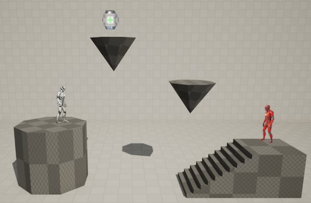
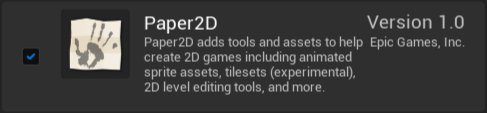
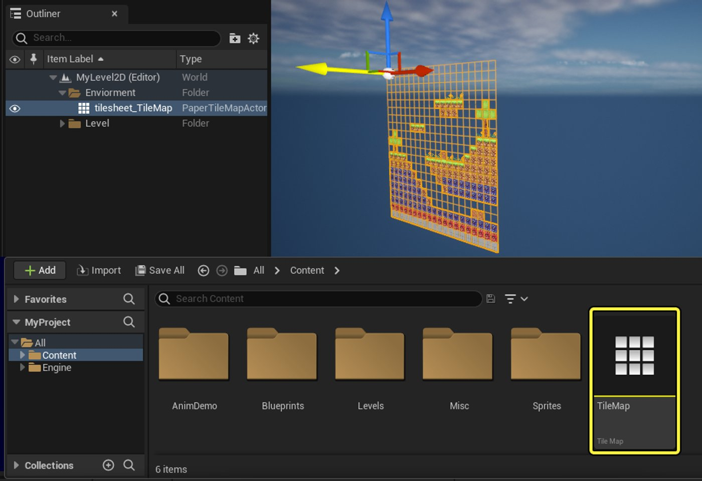

# 虚幻引擎中的2D开发

> 路径：虚幻引擎5.7文档 / 入门指南 / 为Unity开发者准备的虚幻引擎指南 / 虚幻引擎中的2D开发

> 原始页面：https://dev.epicgames.com/documentation/unreal-engine/2d-in-unreal-engine

**Paper 2D**是一款**虚幻引擎**插件，可用于创建2D和2D/3D结合的游戏玩法和动画系统。 Paper 2D插件支持各类2D资产类型，例如用于2D角色和对象的Sprite、用于制作Sprite动画的Flipbook、可以用来创建2D关卡和环境的TileSet和TileMap等，并且附带创建和编辑资产所需的所有相关编辑器。

- [虚幻引擎](../../../animating-characters-and-objects/paper-2d-overview/index.md) - Paper 2D是一种基于Sprite的系统，用于在虚幻引擎中开发2D或2D/3D结合的游戏。

在构建含2D元素的项目时，Paper 2D系统可为你提供许多选择。 该插件拥有丰富的资产和编辑器功能，可以供你创建从角色到环境的各种高质量2D内容。 该插件还可与虚幻引擎的3D渲染功能完全兼容，这也意味着2D元素能够与3D角色、对象或环境无缝集成。

#### 先决条件

要在虚幻引擎中创建2D和2D/3D混合项目，请先安装Paper 2D插件。

- 在虚幻编辑器的**菜单栏**，依次点击**编辑（Edit）**>**插件（Plugins）**，并在**2D分段**中找到**Paper 2D**插件，或使用**搜索栏**搜索该插件。 如未启用该插件，请勾选插件并重启编辑器。

## 从Unity迁移项目

要将2D项目从Unity迁移到虚幻引擎，请按下列步骤操作：

1. 在Unity项目的**Assets**文件夹（位于Unity项目的根目录）中找到与2D资产相关的图像文件。

   > [!NOTE]
   > 虚幻引擎支持Unity支持的所有2D图像文件，例如`.jpg`和`.png`。
2. 在Unity项目文件夹中找到图像文件后，你可以将它们拖到虚幻引擎项目的**内容浏览器（Content Browser）**中，或者使用内容浏览器的**导入（Import）**按钮查看文件在计算机上的位置。

导入虚幻引擎的图像文件将以纹理资产的形式导入，可用于创建Paper 2D资产，如Sprite、Flipbook和TileMap。

> [!TIP]
> 导入低分辨率图像（如基于Sprite的原画）时，可以为纹理应用Sprite特有的设置，从而锐化和增强像素原画的外观。方法是在内容浏览器（Content Browser）中右键点击资产，在快捷菜单中选择**Sprite操作（Sprite Actions）**>**应用Paper 2D导入设置（Apply Paper 2D Import Settings）**。

如需详细了解如何将基于Sprite的资产导入虚幻引擎，请参阅Paper 2D Sprites文档中的[导入Sprite](../../../animating-characters-and-objects/paper-2d-overview/paper-2d-sprites/index.md)一节。

将图像资产导入虚幻引擎后，你就可以创建Sprite和TileSet资产，使用它们各自的编辑器开始构建游戏对象。

## 资产

下文将简要介绍Paper 2D系统，详情可访问随附的文档链接。

### Sprite

与Unity一样，在虚幻引擎中用于创建2D角色和对象的主要资产被称为**Sprite**资产。 Sprite是一种平面游戏对象，你可以将图像映射到Sprite上，用作角色或对象。 虽然任何图像都可以用作Sprite资产，但Paper 2D插件附带专门的设置和材质，用于改善2D风格项目中常见的低分辨率像素风格图形的显示效果。

然后，你可以将Sprite作为**Sprite组件**，添加到任何虚幻引擎**Actor**或**Paper 2D角色Actor**上。

如需详细了解虚幻引擎中的Sprite（如Sprite编辑器的设置和参考信息），请参阅以下文档：

- [Paper 2D Sprites](../../../animating-characters-and-objects/paper-2d-overview/paper-2d-sprites/index.md) - 介绍虚幻引擎中的Sprite的创建方法。

### Flipbook

你可以使用**Flipbook**资产为Sprite Actor制作动画。Flipbook可以存储一系列不同Sprite资产的线性顺序播放内容。 与Unity不同的是，Flipbook是一种独特的资产，可以独立于单个Sprite资产或Actor对象使用。 这意味着动画更加灵活且可重复使用，并且可以通过蓝图或C++代码随时播放。

如需详细了解如何在虚幻引擎中创建、使用和编辑Flipbook，请参阅以下文档：

- [Paper 2D Flipbooks](../../../animating-characters-and-objects/paper-2d-overview/paper-2d-flipbooks/index.md) - 虚幻引擎中Flipbooks的描述及其创建方法。

### TileSet和TileMap

Paper 2D插件还包含TileSet和TileMap资产，以及相应的编辑器。你可以用这些编辑器创建2D关卡和环境。 通过TileSet资产，你可以导入一个包含关卡中所有背景资产的大型资产文件，提取每个图块，定义会影响玩家与环境交互方式的碰撞设置。

然后，你可以将这些图块组合成一个TileMap资产，用来构建关卡。你还可以使用图层等工具，为项目构建动态且有趣的环境。

如需详细了解如何在虚幻引擎中使用TileSet和TileMap，请参阅以下文档：

- [Paper 2D 图块集/图块地图](../../../animating-characters-and-objects/paper-2d-overview/paper-2d-tile-sets-and-tile-maps/index.md) - 如何创建在 Paper 2D 中使用的图块集和图块地图。
