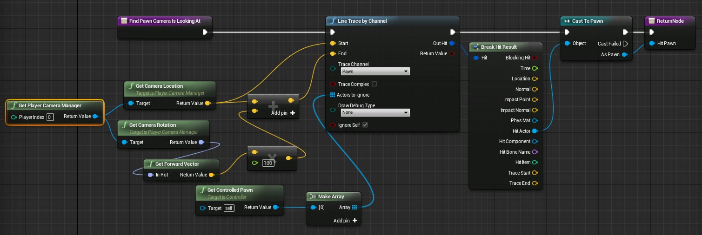
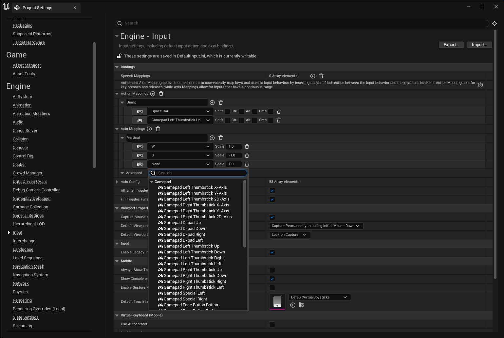

# 在虚幻引擎中创建Gameplay

> 路径：虚幻引擎5.7文档 / 入门指南 / 为Unity开发者准备的虚幻引擎指南 / 在虚幻引擎中创建Gameplay

> 原始页面：https://dev.epicgames.com/documentation/unreal-engine/creating-gameplay-in-unreal-engine-for-unity-developers

> [!NOTE]
> 本页面为Unity用户解释了一些虚幻引擎（UE）Gameplay编程概念。下面的说明假定你熟悉Unity C#并希望学习UE C++和蓝图。

下方的示例包含了一些Unity C#中常见的Gameplay编程用例，并介绍了如何在UE中实现同样的功能。

## 实例化GameObject/生成Actor

在Unity中，你会使用 `Instantiate` 函数创建对象的新实例。此函数可以获取任意 `UnityEngine.Object` 类型（GameObject、MonoBehaviour等），并创建其副本。

```
public GameObject EnemyPrefab;public Vector3 SpawnPosition;public Quaternion SpawnRotation; void Start(){	GameObject NewGO = (GameObject)Instantiate(EnemyPrefab, SpawnPosition, SpawnRotation);	NewGO.name = "MyNewGameObject";}
```

UE有两个不同的函数来实例化对象：

- NewObject

  用于创建新的

  UObject

  类型。
- SpawnActor

  用于生成

  AActor

  类型。

### UObject和NewObject

在UE中创建 `UObject` 的子类与在Unity中创建 `ScriptableObject` 的子类非常类似。对于不需要生成到世界中或像Actor那样绑定了组件的Gameplay类，这些很有用。

在Unity中，如果你创建一个 `ScriptableObject` 的子类，你可以如下所示将其实例化：

```
MyScriptableObject NewSO = ScriptableObject.CreateInstance<MyScriptableObject>();
```

在UE中，如果你创建一个 `UObject` 的子类，你可以如下所示将其实例化：

```
UMyObject* NewObj = NewObject<UMyObject>();
```

### AActor和SpawnActor

你可以用World（C++中的 `UWorld`）对象上的 `SpawnActor` 方法生成Actor。一些UObject和所有Actor都提供了 `GetWorld` 方法（例如，所有Actor都如此）来获取World对象。

在下面的示例中，我们对一个线程Actor的生成参数使用了这些方法，以模仿Unity的 `Instantiate` 方法。

#### 示例

下面是一个AActor子类的示例，`AMyActor`。默认构造函数初始化了 `int32` 和 `USphereComponent*`。

请注意 `CreateDefaultSubobject` 的使用。此函数创建组件并为其分配默认属性。使用此函数创建的子对象将充当默认模板，以便你在子类或蓝图中进行修改。

```
UCLASS()class AMyActor : public AActor{	GENERATED_BODY() 	UPROPERTY()	int32 MyIntProp; 	UPROPERTY()	USphereComponent* MyCollisionComp; 	AMyActor()	{		MyIntProp = 42; 		MyCollisionComp = CreateDefaultSubobject<USphereComponent>(FName(TEXT("CollisionComponent"));		MyCollisionComp->RelativeLocation = FVector::ZeroVector;		MyCollisionComp->SphereRadius = 20.0f;	}};
```

这创建了一个 `AMyActor` 的克隆体，包括所有成员变量、UPROPERTY和组件。

```
AMyActor* CreateCloneOfMyActor(AMyActor* ExistingActor, FVector SpawnLocation, FRotator SpawnRotation){	UWorld* World = ExistingActor->GetWorld();	FActorSpawnParameters SpawnParams;	SpawnParams.Template = ExistingActor;	World->SpawnActor<AMyActor>(ExistingActor->GetClass(), SpawnLocation, SpawnRotation, SpawnParams);}
```

## 类型转换

在此例中，我们获取了一个已知的组件，将其转换为特定类型，然后判断能否执行一些操作。

#### Unity

```
Collider collider = gameObject.GetComponent<Collider>;SphereCollider sphereCollider = collider as SphereCollider;if (sphereCollider != null){		// ...}
```

#### UE C++

```
UPrimitiveComponent* Primitive = MyActor->GetComponentByClass(UPrimitiveComponent::StaticClass());USphereComponent* SphereCollider = Cast<USphereComponent>(Primitive);if (SphereCollider != nullptr){		// ...}
```

#### 蓝图

你可以使用 **Cast to** 在蓝图中完成类型转换。更多详情请参阅[类型转换快速入门指南](../../../gameplay-systems/gameplay-framework/actors/actor-communication/casting-quick-start-guide/index.md)。

## 销毁GameObject/Actor

| 列 1 | 列 2 | 列 3 |
| --- | --- | --- |
| **Unity C#** `Destroy(MyGameObject);` | **UE C++** `MyActor->Destroy();` | **蓝图** |

## 销毁GameObject/Actor（延迟1秒）

| 列 1 | 列 2 | 列 3 |
| --- | --- | --- |
| **Unity C#** `Destroy(MyGameObject, 1);` | **UE C++** `MyActor->SetLifeSpan(1);` | **蓝图** |

## 禁用GameObject/Actor

| 列 1 | 列 2 | 列 3 |
| --- | --- | --- |
| **Unity C#** `MyGameObject.SetActive(false);` | **UE C++** `// 隐藏可见组件MyActor->SetActorHiddenInGame(true); // 禁用碰撞组件MyActor->SetActorEnableCollision(false); // 禁止Actor更新MyActor->SetActorTickEnabled(false);` | **蓝图** |
|  | // 隐藏可见组件 |  |
|  | MyActor->SetActorHiddenInGame(true); |  |
|  |  |  |
|  | // 禁用碰撞组件 |  |
|  | MyActor->SetActorEnableCollision(false); |  |
|  |  |  |
|  | // 禁止Actor更新 |  |
|  | MyActor->SetActorTickEnabled(false); |  |

## 从组件访问GameObject/Actor

| 列 1 | 列 2 | 列 3 |
| --- | --- | --- |
| **Unity C#** `GameObject ParentGO =MyComponent.gameObject;` | **UE C++** `AActor* ParentActor =MyComponent->GetOwner();` | **蓝图** |
|  | GameObject ParentGO = |  |
|  | MyComponent.gameObject; |  |
|  | AActor* ParentActor = |  |
|  | MyComponent->GetOwner(); |  |

## 从GameObject/Actor访问组件

#### Unity

```
MyComponent MyComp = gameObject.GetComponent<MyComponent>();
```

#### UE C++

```
UMyComponent* MyComp = MyActor->FindComponentByClass<UMyComponent>();
```

#### 蓝图

## 查找GameObject/Actor

#### Unity

```
// 按名称查找GameObjectGameObject MyGO = GameObject.Find("MyNamedGameObject"); // 按类型查找ObjectMyComponent[] Components = Object.FindObjectsOfType(typeof(MyComponent)) as MyComponent[];foreach (MyComponent Component in Components){		// ...} // 按标签查找GameObjectGameObject[] GameObjects = GameObject.FindGameObjectsWithTag("MyTag");foreach (GameObject GO in GameObjects){		// ...}
```

#### UE C++

```
// 按类型查找UObjectsfor (TObjectIterator<UMyObject> It; It; ++it){	UMyObject* MyObject = *It;	// ...} // 按名称查找Actor（也适用于UObject）AActor* MyActor = FindObject<AActor>(nullptr, TEXT("MyNamedActor")); // 按类型查找Actor（需要UWorld对象）for (TActorIterator<AMyActor> It(GetWorld()); It; ++It){		AMyActor* MyActor = *It;		// ...} // 按标签查找Actor（也适用于ActorComponent，需要改用TObjectIterator）for (TActorIterator<AActor> It(GetWorld()); It; ++It){	AActor* Actor = *It;	if (Actor->ActorHasTag(FName(TEXT("Mytag"))))	{		// ...	}}
```

#### 蓝图

## 向GameObject/Actor添加标签

#### Unity

```
MyGameObject.tag = "MyTag";
```

#### UE C++

```
// Actor可以有多个标签MyActor.Tags.AddUnique(TEXT("MyTag"));
```

#### 蓝图

## 向MonoBehaviour/ActorComponent添加标签

#### Unity

```
// 这会更改它绑定到的GameObject上的标签MyComponent.tag = "MyTag";
```

#### UE C++

```
// 组件有自己的标签数组MyComponent.ComponentTags.AddUnique(TEXT("MyTag"));
```

## 比较GameObject/Actor和MonoBehaviour/ActorComponent上的标签

#### Unity

```
if (MyGameObject.CompareTag("MyTag")){	// ...} // 检查它绑定到的GameObject上的标签if (MyComponent.CompareTag("MyTag")){	// ...}
```

#### UE C++

```
// 检查某个Actor是否有此标签if (MyActor->ActorHasTag(FName(TEXT("MyTag")))){	// ...}
```

#### 蓝图

#### UE C++

```
// 检查某个ActorComponent是否有此标签if (MyComponent->ComponentHasTag(FName(TEXT("MyTag")))){	// ...}
```

#### 蓝图

## 物理：刚体与图元组件

在Unity中，假如要为GameObject赋予物理特征，必须为其附加刚体组件。

在UE中，任何图元组件（C++中的 `UPrimitiveComponent`）都可以表示物理对象。一些常见图元组件如下：

- 形状组件（

  USphereComponent

  、

  UCapsuleComponent

  ，等等）
- 静态网格体组件
- 骨骼网格体组件

Unity将碰撞和可视性划分到不同的组件中，UE则将"潜在的物理碰撞"和"潜在的可视效果"组合到了单个图元组件中。凡是在世界中具有几何体的组件，只要能被渲染或通过物理方式交互，都是 `UPrimitiveComponent` 的子类。

> [!NOTE]
> UE中的碰撞通道对应Unity中的层。如需详细信息，请参阅[碰撞过滤](https://www.unrealengine.com/zh-CN/blog/collision-filtering)。

### RayCast与RayTrace

#### Unity

```
GameObject FindGOCameraIsLookingAt(){	Vector3 Start = Camera.main.transform.position;	Vector3 Direction = Camera.main.transform.forward;	float Distance = 100.0f;	int LayerBitMask = 1 << LayerMask.NameToLayer("Pawn"); 	RaycastHit Hit;	bool bHit = Physics.Raycast(Start, Direction, out Hit, Distance, LayerBitMask); 	if (bHit)	{		return Hit.collider.gameObject;	} 	return null;}
```

#### UE C++

```
APawn* AMyPlayerController::FindPawnCameraIsLookingAt(){	// 你可以在这里自定义有关追踪的各种属性	FCollisionQueryParams Params;	// 忽略玩家的Pawn	Params.AddIgnoredActor(GetPawn()); 	// 击中结果由线路追踪填充	FHitResult Hit; 	// 来自摄像机的光线投射，仅与Pawn碰撞（它们在ECC_Pawn碰撞通道上）	FVector Start = PlayerCameraManager->GetCameraLocation();	FVector End = Start + (PlayerCameraManager->GetCameraRotation().Vector() * 1000.0f);	bool bHit = GetWorld()->LineTraceSingle(Hit, Start, End, ECC_Pawn, Params); 	if (bHit)	{		// Hit.Actor包含指向追踪所击中的Actor的弱指针		return Cast<APawn>(Hit.Actor.Get());	} 	return nullptr;}
```

#### 蓝图



点击查看大图。

## 触发器体积

#### Unity

```
public class MyComponent : MonoBehaviour{	void Start()	{		collider.isTrigger = true;	}	void OnTriggerEnter(Collider Other)	{		// ...	}	void OnTriggerExit(Collider Other)	{		// ...	}}
```

#### UE C++

```
UCLASS()class AMyActor : public AActor{	GENERATED_BODY() 	// 我的触发器组件	UPROPERTY()	UPrimitiveComponent* Trigger; 	AMyActor()	{		Trigger = CreateDefaultSubobject<USphereComponent>(TEXT("TriggerCollider")); 		// 两个碰撞物都需要将此项设置为true，才能触发事件		Trigger.bGenerateOverlapEvents = true; 		// 设置碰撞物的碰撞模式		// 此模式仅为光线投射、扫描和重叠启用碰撞物		Trigger.SetCollisionEnabled(ECollisionEnabled::QueryOnly);	} 	virtual void NotifyActorBeginOverlap(AActor* Other) override; 	virtual void NotifyActorEndOverlap(AActor* Other) override;};
```

#### 蓝图

> [!TIP]
> 如需详细了解如何设置碰撞响应，请参阅[碰撞](../../../gameplay-systems/physics/collision/index.md)。

### 刚体运动

#### Unity

```
public class MyComponent : MonoBehaviour{	void Start()	{		rigidbody.isKinematic = true;		rigidbody.velocity = transform.forward * 10.0f;	}}
```

#### UE C++

```
UCLASS()class AMyActor : public AActor{	GENERATED_BODY() 	UPROPERTY()	UPrimitiveComponent* PhysicalComp; 	AMyActor()	{		PhysicalComp = CreateDefaultSubobject<USphereComponent>(TEXT("CollisionAndPhysics"));		PhysicalComp->SetSimulatePhysics(false);		PhysicalComp->SetPhysicsLinearVelocity(GetActorRotation().Vector() * 100.0f);	}};
```

## 输入事件

#### Unity

```
public class MyPlayerController : MonoBehaviour{	void Update()	{		if (Input.GetButtonDown("Fire"))		{			// ...		}		float Horiz = Input.GetAxis("Horizontal");		float Vert = Input.GetAxis("Vertical");		// ...	}}
```

#### UE C++

```
UCLASS()class AMyPlayerController : public APlayerController{	GENERATED_BODY() 	void SetupInputComponent()	{		Super::SetupInputComponent(); 		InputComponent->BindAction("Fire", IE_Pressed, this, &AMyPlayerController::HandleFireInputEvent);		InputComponent->BindAxis("Horizontal", this, &AMyPlayerController::HandleHorizontalAxisInputEvent);		InputComponent->BindAxis("Vertical", this, &AMyPlayerController::HandleVerticalAxisInputEvent);	} 	void HandleFireInputEvent();	void HandleHorizontalAxisInputEvent(float Value);	void HandleVerticalAxisInputEvent(float Value);};
```

#### 蓝图

你的项目设置中的输入属性可能如下所示：



> [!TIP]
> 如需详细了解如何设置UE项目的输入，请参阅[输入](../../../gameplay-systems/input/index.md)。

## 扩展阅读

如需详细了解上述各概念，推荐浏览以下文档：

- Gameplay框架

  - 介绍核心游戏系统，如游戏模式、玩家状态、控制器、Pawn、摄像机等。
- Gameplay架构

  - 创建和实现Gameplay类的参考文档。
- Gameplay教程

  - 重新创建常用Gameplay元素的教程。Tutorials for recreating common gameplay elements.
