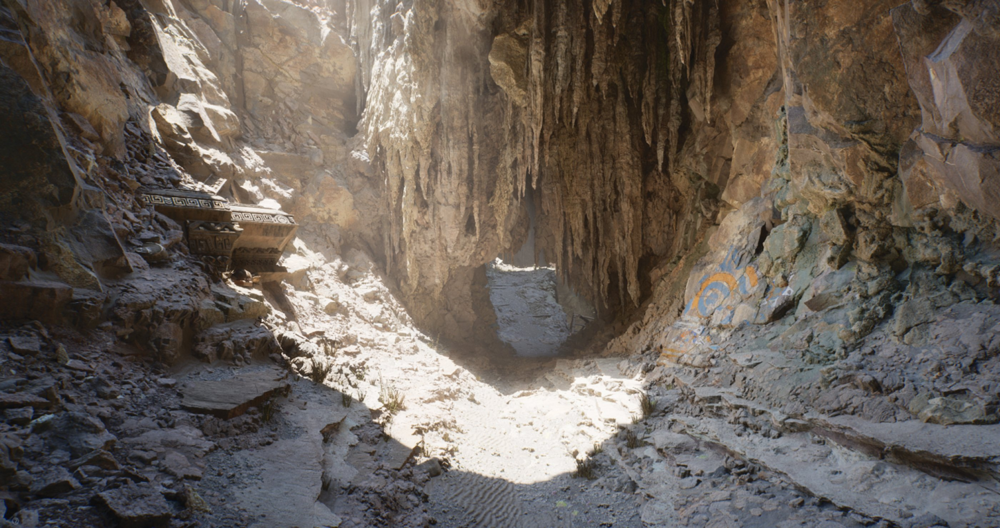
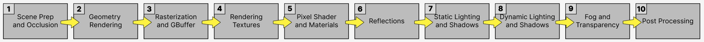
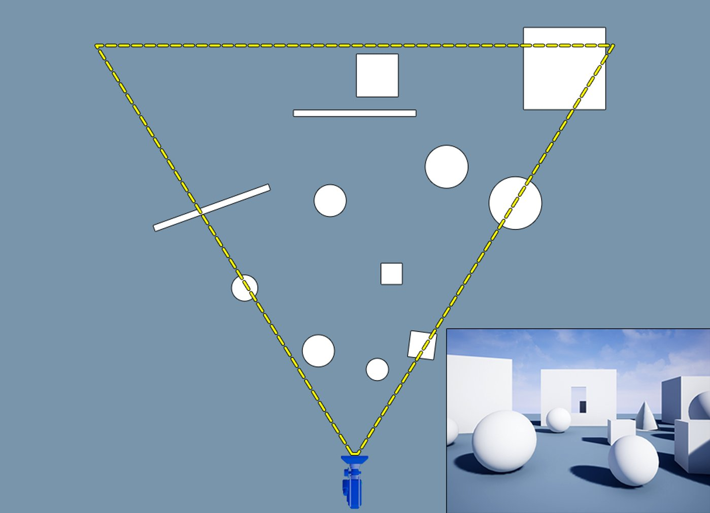
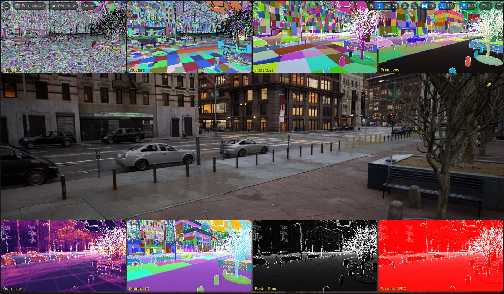
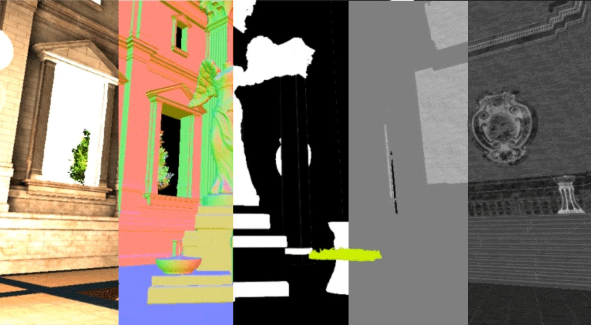
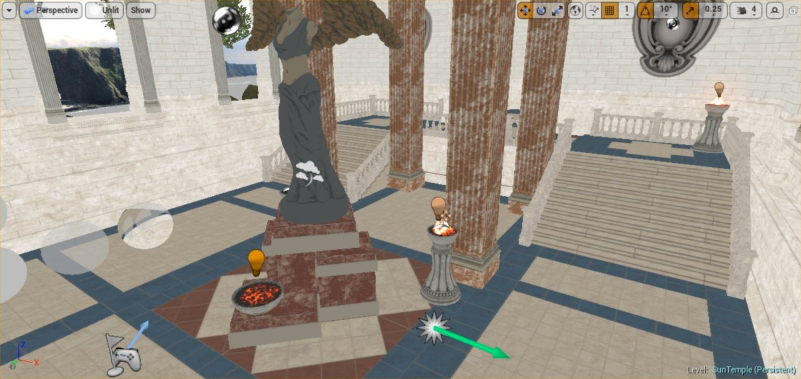
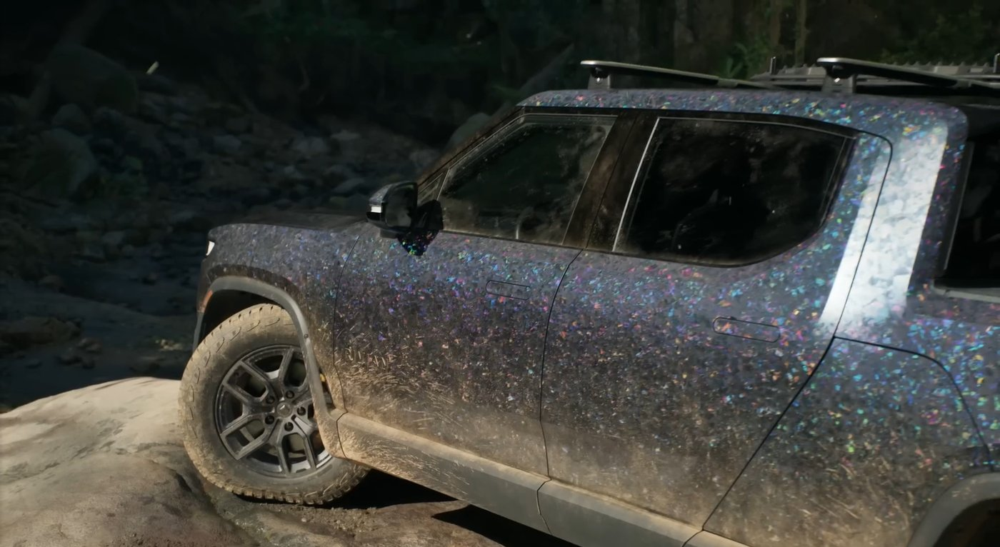
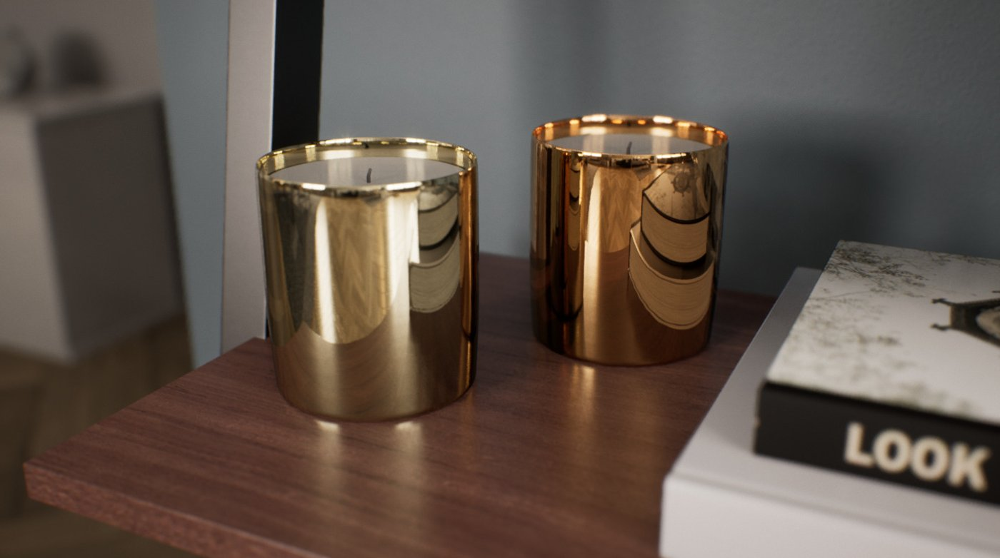

# 为Unity开发者准备的虚幻引擎渲染介绍

> 路径：虚幻引擎5.7文档 / 入门指南 / 为Unity开发者准备的虚幻引擎指南 / 为Unity开发者准备的虚幻引擎渲染介绍

> 原始页面：https://dev.epicgames.com/documentation/unreal-engine/introduction-to-rendering-in-unreal-engine-for-unity-developers

## 使用虚幻引擎渲染

## 游戏引擎渲染简介

渲染是指利用场景中的一系列对象在屏幕上生成最终图像（帧）的过程。

用于渲染帧的软件叫做**渲染引擎**，通常分为以下几类：

- **离线渲染**：专为高质量渲染而设计，优先考虑质量而不是处理时间。 通常用于渲染看重最终渲染帧质量，而不是渲染时间的应用程序。
- **实时渲染**：设计时充分考虑性能，能快速渲染帧。 典型的实时帧率目标值为每秒30 (33ms)、60 (16ms) 和120 (8ms) 帧（FPS），但实际帧率会随着时间的推移而变化，这取决于多种因素。 采用实时渲染技术开发的项目必须在性能和质量之间找到平衡点，以保持稳定的帧率。 实时渲染引擎通常用于交互式媒体，如视频游戏、模拟和建筑可视化。

**虚幻引擎**是一套功能强大的工具，专为实时渲染而设计，可满足从移动设备到高性能台式机等各种平台的需求。 虚幻引擎既可以进行高质量的实时渲染，也可以进行离线渲染。 你可以用它创建任何内容，包括移动设备、游戏主机平台和台式机平台上的交互式2D和3D体验，以及影视制片的最终帧渲染。

与市面上的其他实时引擎不同，虚幻引擎提供了许多专为实时性和性能而设计的专有功能。 其目标是降低开发的复杂度，在保持高质量和高性能的同时更快地获得结果。

诸如[Lumen全局光照和反射](../../../building-virtual-worlds/lighting-the-environment/global-illumination/lumen-global-illumination-and-reflections/index.md)系统、[Nanite虚拟几何体](../../../designing-visuals-rendering-and-graphics/optimizing-and-debugging-projects-for-realtime-rendering/nanite/nanite-virtualized-geometry/index.md)和[虚拟阴影贴图](../../../building-virtual-worlds/lighting-the-environment/shadowing/virtual-shadow-maps/index.md)等功能是实现这一目标的重要步骤，可以降低开发的复杂性，为游戏主机和台式机应用程序提供“恰到好处”的功能。 移动平台支持动态光照和需要将光照烘焙到纹理中的预计算光照工作流程。

## 虚幻引擎渲染简介

游戏引擎通过一系列步骤（通常称为**渲染管线**），将图像（或帧）渲染到屏幕上。 本节将介绍虚幻引擎如何使用默认的延迟渲染路径来实现这一点，并在适当的时候将这些步骤与Unity的延迟渲染路径进行比较。

Unity引擎有三种不同的渲染管线：内置、通用和高清。 每种管线都针对特定的用例而设计，通常在启动新项目前就得进行选择。

虚幻引擎配备**统一的渲染管线**，可根据目标平台（从手持设备、移动设备到当前世代的游戏主机和PC）优化各项功能。 这意味着你可以根据自己的项目选择最适合的渲染路径和可用功能，而不是锁死在单一的路径上。

虚幻引擎的渲染管线可使用默认的**延迟渲染**路径，也可设置为[前向渲染](../../../designing-visuals-rendering-and-graphics/optimizing-and-debugging-projects-for-realtime-rendering/forward-shading-renderer/index.md)路径。 此外，你还可以启用[移动端渲染路径](../../../mobile-development/rendering-features-for-mobile-games/index.md)，以适应低功耗设备，包括[Vulkan移动渲染器](../../../mobile-development/android-support/developing-guides-for-android/using-the-android-vulkan-mobile-renderer/index.md)。 如需详细了解不同渲染路径支持的渲染功能，请参阅[渲染路径支持的功能](../../../designing-visuals-rendering-and-graphics/supported-features-by-rendering-path-for-desktop/index.md)文档。

下图直观地展示了虚幻引擎使用**延迟渲染**路径渲染最终图像时每帧执行的步骤：

整个流程为从左到右，其中第2步至第5步并行发生。

下文将详细介绍渲染管线的各个步骤，以及渲染各帧的要求。

### 场景准备和遮蔽

虚幻引擎有三个主要线程 — 游戏线程（CPU）、绘制线程和GPU线程。

开始渲染流程前，**游戏（或CPU）**线程会收集场景中所有对象的变换。 这包括处理所有动画、物理模拟和人工智能（AI），然后再收集每个对象的最终变换。

然后，将变换信息传递给CPU上的**绘制**线程。 绘制线程将运行[剔除过程](../../../designing-visuals-rendering-and-graphics/optimizing-and-debugging-projects-for-realtime-rendering/visibility-and-occlusion-culling/index.md)，建立当前摄像机视图中可见对象的列表，删除摄像机不可见的所有其他对象。 这些对象不需要绘制，不渲染它们可提高性能。

此流程将（按顺序）执行以下步骤：

- **距离剔除**：剔除所有不在距离摄像机特定范围内的对象。
- **视锥体剔除**：剔除摄像机视锥体（视野）范围内不可见的对象。
- **遮挡剔除**：精确检查场景中所有剩余对象的可视性状态。 这种方法的开销大，因此需要在遮挡过程的最后阶段进行，即进一步检测剩余的可见对象是否被其他对象遮挡（隐藏）。

将最终可见对象列表传递给**GPU线程**，以开始渲染过程。

#### Unity等效类型

Unity会在渲染管线中执行**视锥体**和**遮挡剔除**。 此外，它还可以使用**CullingGroup** API执行距离剔除。 这些技术结合使用，生成场景中可见对象的最终列表。

### 几何体渲染

在此步，虚幻引擎会查看场景中的可见对象列表，并为下一步将3D顶点数据转换为显示在屏幕上的像素数据做好准备。

#### 顶点着色器

> [!NOTE]
> 着色器是一小段代码，直接在GPU上运行，用于执行成组计算。 着色器非常高效，GPU可以并行运行大量着色器计算。

顶点着色器将执行以下步骤：

- **将本地顶点位置转换为世界位置**：对象顶点数据存储在本地空间，但是一旦将对象置于世界中，顶点信息就必须转换为世界空间坐标。
- **处理顶点着色和调色**：顶点着色器处理顶点平滑以及对象本身的所有顶点颜色数据。
- **可对顶点位置应用额外偏移**：顶点着色器可以偏移屏幕上所有顶点的位置，以实现特定的效果。 此操作通过对象的材质完成，称为世界位置偏移。

#### 深度通道

渲染单个对象前，虚幻引擎会执行**深度通道**或早期Z通道，以确定对象之间的位置关系。 这样可以防止虚幻引擎在屏幕上多次渲染相同的像素。 这被称为**过度绘制**，会严重影响性能。 虚幻引擎会尽量避免这种情况。

#### 绘制调用

深度通道后，GPU会同时绘制所有具备相同属性的多边形，比如网格体和材质，从而渲染各个对象。 这就是**绘制调用**。

对象中被分配相同材质的所有多边形都算作同一个绘制调用。 但每个独特材质都需要单独的绘制调用。 例如，屏幕上的每个对象都至少需要一次绘制调用，但根据分配给该对象的材质数量，可能需要多次绘制调用。

> [!NOTE]
> 虚幻引擎的[Nanite虚拟几何体](../../../designing-visuals-rendering-and-graphics/optimizing-and-debugging-projects-for-realtime-rendering/nanite/nanite-virtualized-geometry/index.md)可同时渲染具有给定材质的所有对象的所有多边形。 帧预算不再受限于多边形数量、绘制调用或网格体内存占用。

#### Unity等效类型

Unity的渲染流程也会执行类似的步骤，即进行深度通道并使用绘制调用来绘制场景中的对象。

### 光栅化和几何体缓冲区

**光栅化过程**会将3D顶点数据转换为显示在屏幕上的2D像素数据。 此过程在顶点着色器处理完所有数据后开始。

虚幻引擎的**几何体缓冲区（GBuffer）**包含一系列图像，用于存储场景中的几何体信息。 这些图像通常包括场景中的**基础颜色**、**世界法线**、**金属感**、**粗糙度**和**高光度**的光照信息。 这些GBuffer中的图像将组成你在屏幕上看到的最终图像。

转换这些复合图像的过程发生在渲染的每一帧和每次绘制调用中，在绘制调用时将顶点数据转换为像素数据，并将图像的正确部分绘制到GBuffer中。

#### Unity等效类型

Unity的延迟渲染路径也使用GBuffer来存储场景的关键信息。 在Unity中，GBuffer存储了场景的类似信息（使用的名称不同）：对象的反射率、高光度、法线和自发光/光照信息。

### 渲染纹理

虚幻引擎使用[纹理流送](../../../designing-visuals-rendering-and-graphics/optimizing-and-debugging-projects-for-realtime-rendering/texture-streaming/texture-streaming-overview/index.md)渲染纹理，优化场景加载纹理的过程。 纹理流送系统使用纹理**mipmap**， 即预先计算好的、同一纹理在不同分辨率下的图像序列。 你可以把它理解为纹理的**细节级别（LOD）**，而不是网格体。 引擎会自动创建这些mipmap，其中每个图像的分辨率都是前一个图像的一半。

在游戏过程中，虚幻引擎会根据与摄像机的距离来流送纹理的mipmap。 这样做是为了优化带宽和内存消耗，同时减少远离摄像机的噪点。

> [!NOTE]
> 纹理尺寸必须是2的幂才能接收mipmap。 常见的纹理尺寸包括3840 x 2160像素（4K）和1920 x 1080像素（高清）。 请注意，并不要求纹理具有特定的高宽比，1920 x 480像素的纹理也能接收mipmap。

#### Unity等效类型

Unity的**Mipmap流送**系统使用纹理mipmap在运行时流送纹理。 与虚幻引擎类似，该系统会根据与摄像机的距离和角度自动流送适当的纹理mipmap。

### 像素着色器和材质

一旦对象被完全渲染到GBuffer中，虚幻引擎就将根据每个对象的材质属性，使用像素着色器为屏幕上的每个对象着色。

**像素着色器**会通过一系列计算来修改屏幕上每个像素的颜色。 像素着色器在GPU上运行，效率极高。 它们将驱动虚幻引擎的[材质系统](../../../designing-visuals-rendering-and-graphics/unreal-engine-materials/index.md)，并用于计算光照、雾、反射和后期处理效果。

材质系统使用高级着色器语言（HLSL）的着色器模板和[材质编辑器](../../../designing-visuals-rendering-and-graphics/unreal-engine-materials/unreal-engine-material-editor-user-guide/index.md)来创建最终材质，并将其应用于屏幕上的对象。 这些材质可以使用纹理等参数来定义各对象的外观。

#### Unity等效类型

Unity提供了多个预设的着色器（相当于虚幻引擎中的材质）和**着色器图表（Shader Graph）**，用于为你的项目创建着色器。 虚幻引擎的材质编辑器相当于Unity的着色器图表。

### 反射

为场景中的所有对象着色后，虚幻引擎将根据对象的材质属性渲染对象的反射。

虚幻引擎使用四个系统将反射渲染到场景中。 这些系统按以下顺序执行：

- [反射捕获](../../../building-virtual-worlds/lighting-the-environment/reflections-environment/reflections-captures/index.md)：预先计算并存储在特定位置的静态立方体贴图中。
- [平面反射](../../../building-virtual-worlds/lighting-the-environment/reflections-environment/planar-reflections/index.md)：捕捉平面造成和受到的反射。
- [屏幕空间反射（SSR）](../../../building-virtual-worlds/lighting-the-environment/reflections-environment/screen-space-reflections/index.md)：利用可用的屏幕信息，实时绘制对象的精确反射。
- [Lumen反射](../../../building-virtual-worlds/lighting-the-environment/global-illumination/lumen-global-illumination-and-reflections/index.md)：解决场景中所有粗糙度值范围内的反射问题。 支持天空光照、透明涂层材质、半透明甚至单层水材质的反射。

虚幻引擎会混用这三种方法，优先使用屏幕空间反射，然后再使用平面反射，最后再使用反射捕获。 最终的反射结果结合了GBuffer中的粗糙度、高光度和金属感图像。

> [!NOTE]
> 若你使用[Lumen全局光照](../../../building-virtual-worlds/lighting-the-environment/global-illumination/lumen-global-illumination-and-reflections/index.md)，则将自动使用Lumen反射。 但你也可以在不使用Lumen全局光照的情况下使用Lumen反射，在这种情况下，虚幻引擎将使用经过Lumen反射的烘焙光照。

#### Unity等效类型

Unity的**反射探针（Reflection Probe）**提供类似功能，可用于预先计算场景的反射数据。

### 静态光照和阴影

> 图片已省略：预计算光照的场景

渲染反射后，虚幻引擎将为场景中的所有对象渲染静态光照和阴影。

虚幻引擎使用[Lightmass全局光照](../../../building-virtual-worlds/lighting-the-environment/global-illumination/lightmass-basics/index.md)系统预计算场景的光照信息。 光照和阴影信息存储在[光照贴图UV纹理](../../../working-with-content/static-meshes/understanding-lightmapping/index.md)中，在场景中渲染对象时，该纹理会和对象的基础颜色混合。

该系统速度非常快，但需要更多内存，而且每次场景发生变化时都必须进行预计算。

对面向移动端和低功率设备的项目来说，Lightmass全局照明系统是不错的选择。

#### Unity等效类型

Unity的**渐进光照贴图程序**和**Enlighten烘培全局光照系统**可在预计算场景光照时，提供类似的功能。

### 动态光照和阴影

> 图片已省略：使用Lumen动态照明的场景

在渲染静态光照之后，虚幻引擎会使用其动态全局光照系统[Lumen](../../../building-virtual-worlds/lighting-the-environment/global-illumination/lumen-global-illumination-and-reflections/index.md)渲染动态（实时）光照和阴影。

**Lumen**是一种全**动态全局光照**和**反射**系统，专为次世代游戏主机和高端PC而设计。 该系统采用多种光线追踪方法来处理全局光照和大规模反射。

Lumen可提供无限的漫反射，并与[Nanite虚拟几何体](../../../designing-visuals-rendering-and-graphics/optimizing-and-debugging-projects-for-realtime-rendering/nanite/nanite-virtualized-geometry/index.md)无缝配合。 此外，该系统还可与[虚拟阴影贴图](../../../building-virtual-worlds/lighting-the-environment/shadowing/virtual-shadow-maps/index.md)配合使用，创建实时的高分辨率柔和阴影。

Lumen提供的**Lumen反射**可解决场景中各种粗糙度值的反射问题。 支持天空光照、透明涂层材质、半透明甚至单层水材质的反射。

> [!NOTE]
> 在场景中使用时，Lumen会取代屏幕空间反射。

#### Unity等效类型

Unity使用**Enlighten实时全局光照**为场景提供动态光照。 该系统使用预计算的可视性信息和光照贴图来计算运行时的间接光反射，从而提供实时全局光照。

这与Lumen不同，因为Lumen不需要任何预计算数据来提供间接光线反射。

### 雾和透明度

> 图片已省略：带体积雾的场景

在渲染了动态光照和阴影之后，虚幻引擎会接着渲染雾和透明度效果。

虚幻引擎使用[指数高度雾](../../../building-virtual-worlds/lighting-the-environment/environmental-light-with-fog-clouds-sky-and-atmosphere/exponential-height-fog/index.md)系统来渲染**雾效果**，该系统根据高度和与摄像机的距离来渲染雾的密度。 此外，该系统还可以生成[体积雾](../../../building-virtual-worlds/lighting-the-environment/environmental-light-with-fog-clouds-sky-and-atmosphere/volumetric-fog/index.md)。

透明对象使用[半透明材质](../../../designing-visuals-rendering-and-graphics/unreal-engine-materials/unreal-engine-materials-tutorials/using-transparency-in-unreal-engine-materials/index.md)，在流程中的这一阶段渲染。 使用延迟渲染路径时，虚幻引擎使用GBuffer中的可用信息来渲染透明度。 你也可以将材质配置为使用前向渲染路径来生成更精确的透明度效果。

#### Unity等效类型

Unity支持场景中的**线性**、**指数**和**指数平方**雾。

### 后期处理效果

> 图片已省略：将景深应用于最终图像的场景

一旦渲染了雾和透明度，虚幻引擎就可以在图像上应用额外效果。 这些效果叫做[后期处理效果](../../../designing-visuals-rendering-and-graphics/post-process-effects/index.md)，因为它们是在最终图像处理完之后应用的。 这些效果依赖于像素着色器，并使用GBuffer中的可用信息。

常见的后期处理效果包括泛光、景深、光束、色调映射和动态模糊。

在后期处理步骤中，虚幻引擎还可以应用[时间超级分辨率（TSR）](../../../designing-visuals-rendering-and-graphics/optimizing-and-debugging-projects-for-realtime-rendering/anti-aliasing-and-upscaling/temporal-super-resolution/index.md)。 TSR是一个不限平台的[时序上采样器](../../../designing-visuals-rendering-and-graphics/optimizing-and-debugging-projects-for-realtime-rendering/anti-aliasing-and-upscaling/temporal-upscalers/index.md)，虚幻引擎用它来渲染精美的4K图像。 由于它将一些开销大的渲染计算分摊到了许多帧，图像的开销只占一小部分。

在渲染链中，时间超级分辨率在景深之后发生，后续所有内容都会进行分辨率修改，例如动态模糊、泛光等等。

> 图片已省略：显示图像何时应用TSR的图片

一旦这些效果应用到GBuffer中，虚幻引擎就会将最终图像渲染到屏幕上。

上述步骤会在屏幕上生成一个**单独帧**。 根据游戏的目标帧率，这些步骤通常每秒重复 30 到 60 次。

#### Unity等效类型

Unity根据所选的渲染管线提供后期处理解决方案。 许多可用的效果与虚幻引擎中的效果类似。

此外，Unity6还配备**空间-时间后期处理（STP）**，这是一种基于软件的原生修改器，使用空间和时间上采样技术生成高质量的抗锯齿图像。

### 虚幻引擎的渲染功能概述

现在你已经了解了虚幻引擎将帧渲染到屏幕上的步骤，可以进一步了解虚幻引擎自带的特定渲染功能了。

如需详细了解虚幻引擎的渲染功能，请参阅[为场景设置光照](../../../building-virtual-worlds/lighting-the-environment/index.md)文档。
