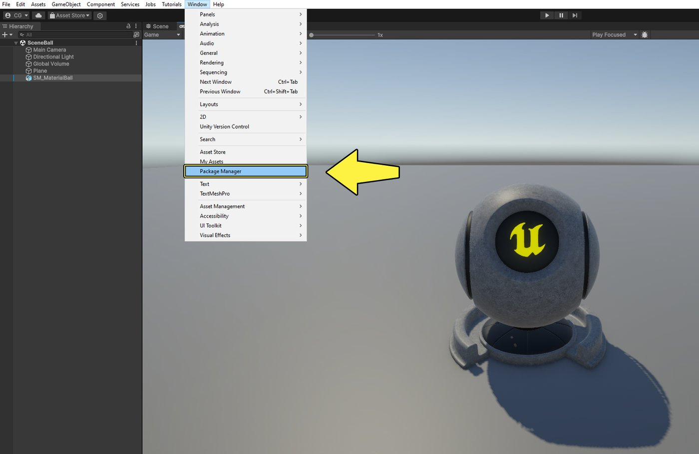
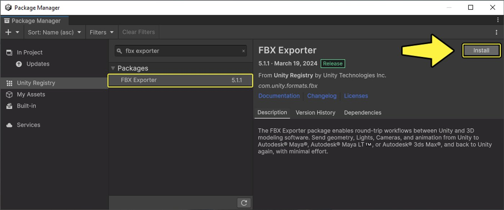
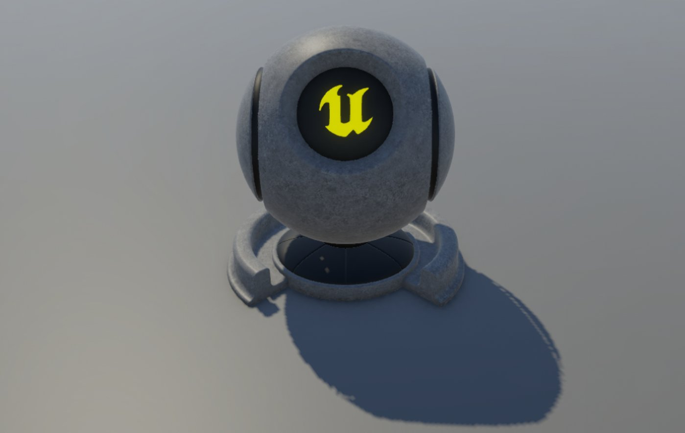
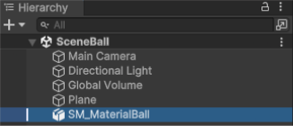
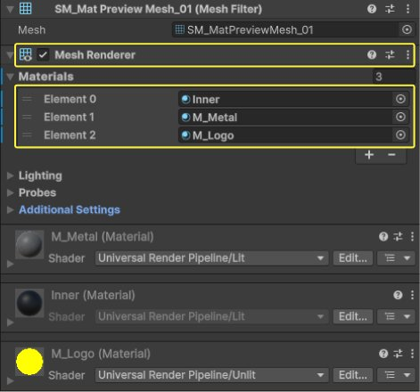
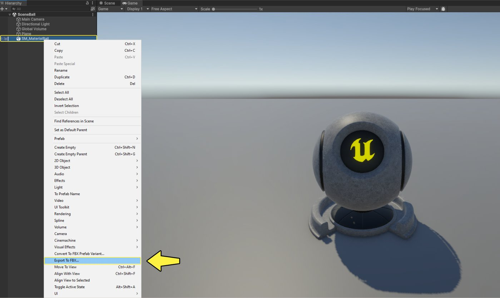
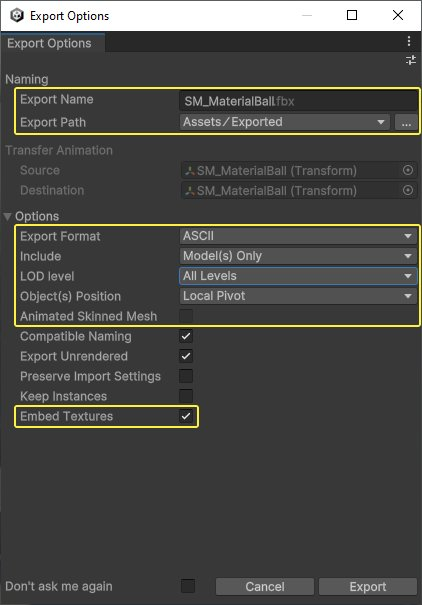
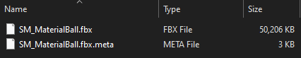

# 将资产从Unity迁移至虚幻引擎

> 路径：虚幻引擎5.7文档 / 入门指南 / 为Unity开发者准备的虚幻引擎指南 / 将资产从Unity迁移至虚幻引擎

> 原始页面：https://dev.epicgames.com/documentation/unreal-engine/migrating-assets-from-unity-to-unreal-engine

### 导入和转换资产

**虚幻引擎5**项目包含各种资产，这些资产构成了最终的游戏。 其中一些资产类型是虚幻引擎特有的，例如蓝图类，而另一些则是可以导入到引擎中的通用文件格式。

本文档将介绍可导入虚幻引擎的资产类型、导入方法以及其他信息的链接。

## 常见资产类型

虚幻引擎5支持以下资产类型：

| 虚幻资产类型 | Unity等效类型 | 支持的格式 |
| --- | --- | --- |
| 静态网格体 | 网格体 | `.fbx、.obj` |
| 骨骼网格体 | 蒙皮网格体 | `.fbx、.obj、.usd` |
| 动画序列 | 动画、Mecanim | `.fbx、.obj、.abc` |
| [纹理](../../../designing-visuals-rendering-and-graphics/textures/index.md) | 纹理 | `.bmp、.float、.jpeg、.jpg、.pcx、.png、.psd、.tga、.dds`（立方体贴图或2D）、`.exr`（HDR）、`.tif`（TIFF）、`.tiff`（TIFF） |
| 音频文件 | 音频文件 | `.wav、.ogg、.flac、.aif、.opus、.mp3` |
| 视频文件 | 视频剪辑片段 | `.mov、.mp4、.wmv` |
| 字体 | 字体资产 | `.ttf、.otf` |
| glTF文件 | glTF文件 | `.gltf`（JSON）、`.glb` |
| [SpeedTree模型](https://docs.speedtree.com/doku.php?id=ue4_introduction) | SpeedTree | `.srt` |

## 将资产导入虚幻引擎前的注意事项

### 虚幻引擎坐标系

虚幻引擎使用[笛卡尔坐标系来](https://en.wikipedia.org/wiki/Cartesian_coordinate_system)表示三维[欧几里得空间](https://en.wikipedia.org/wiki/Euclidean_space)中的位置。 虚幻编辑器中的坐标系为左手坐标系，使用**X轴**表示**前/后**方向，**Y轴**表示**右/左**方向，**Z轴**表示**上/下**方向。

Unity也使用左手坐标系。 而Unity使用**X轴**表示**右/左**，**Y轴**表示**上/下**，**Z轴**表示**前/后**。

这就阻碍了将资产直接从Unity导入虚幻引擎，因为资产的方向可能不对。 要解决这个问题，可以在数字内容创建（DCC）文件包（如Maya或Blender）中更改资产的方向，或者直接在虚幻引擎的**导入对话框**中更改。

如需详细了解虚幻引擎坐标系，请参阅[坐标系和空间](https://dev.epicgames.com/documentation/unreal-engine/coordinate-system-and-spaces-in-unreal-engine?application_version=5.7)文档。

### 虚幻引擎中的测量单位

虚幻引擎使用[公制](https://en.wikipedia.org/wiki/Metric_system)来测量对象的大小和距离。 具体来说，虚幻引擎在内部使用**虚幻单位（UU）**进行测量。 **一虚幻单位**等于**1厘米**。

在外部数字内容创建 (DCC) 文件包中创建网格体时，可按此指定正确的换算比例。

Unity内部也使用公制，**一Unity单位**等于**1米（100厘米）**。 这将影响从Unity直接导入虚幻引擎的对象的比例。

如需详细了解虚幻引擎测量单位，请参阅[测量单位](../../../understanding-the-basics/foundational-knowledge-in/units-of-measurement/index.md)文档。

### FBX内容管线

虚幻引擎支持以多种文件格式将内容导入项目。 **Autodesk FBX**是最流行的资产格式之一。

FBX格式支持许多数字内容创建 (DCC) 文件包之间的互操作，并具有以下优点：

- 对静态网格体、骨骼网格体、动画和变形目标使用单一文件格式。
- 在一次导入操作中导入多个LOD和Morph/Blendshape。
- 导入材质和纹理资产，并自动将它们应用于静态网格体。

虚幻引擎的FBX管线使用**FBX 2020.2**，因此我们建议使用该版本，避免导入资产时出现不兼容问题。

如需详细了解FBX管线，请参阅[FBX内容管线](../../../working-with-content/fbx-content-pipeline/index.md)文档。

## 版本信息

本文撰写时，所用的截图和术语源自以下虚幻引擎和Unity引擎版本：

- 虚幻引擎5.4.3
- Unity 6 (6000.0.2f1)

## 准备从Unity导出资产

从Unity中导出资产前，请按以下步骤**启用****FBX导出器（FBX Exporter）**软件包：

1. 在Unity中，点击**窗口（Window）>文件包管理器（Package Manager），**打开**文件包管理器**窗口。

   
2. 点击左侧的**Unity注册表（Unity Registry）**类别，搜索**FBX导出器（FBX Exporter）**。 点击**安装（Install）**安装软件包。

   
3. 安装软件包后，关闭**文件包管理器（Package Manager）**窗口。

现在，你可以在**层级（Hierarchy）**窗口中**右键点击**一个预制体，然后选择**导出为FBX（Export to FBX）**，将其导出为`.fbx`文件。

你也可以打开Unity项目的**源文件夹**，直接复制某些文件，例如纹理文件。

## 网格体/静态网格体

**静态网格体是**几何形状不会改变的三维网格体。 要将静态网格体导入虚幻引擎，可以使用.**fbx**格式或.**obj**格式，推荐使用.fbx格式。 如需详细了解虚幻引擎中的静态网格体，请参阅[静态网格体](../../../working-with-content/static-meshes/index.md)文档。

本示例将演示如何将虚幻引擎**材质球**静态网格体从Unity导入虚幻引擎。

此预制体拥有一个网格体和三种材质。 但你的网格预制体可在其层级中包含多个网格体。

### 从Unity导出静态网格体

要从Unity中导出**静态网格体**，请按以下步骤操作：

1. 右键点击**层级（Hierarchy）**窗口中的预制体，然后在菜单中选择**导出FBX…（Export FBX…）**。

   
2. 在**导出选项（Export Options）**窗口中，填写**导出名称（Export Name）**和**导出路径（Export Path）**。

   1. 在**选项（Options）**类别中，选择**ASCII导出格式（ASCII Export Format）**。
   2. 点击**包含（Include）**下拉菜单，选择**仅模型（Model(s) Only）**。
   3. 如果你的网格体有细节级别（LOD），请选择相应的级别。
   4. 如果你想导出带有相应纹理的网格体材质，请**勾选****嵌入纹理（Embed Textures）**复选框。
   5. 点击**导出（Export）**导出你的静态网格体。

   
3. 前往**导出路径**文件夹，找到静态网格体的.fbx文件。 这就是你要导入到虚幻引擎中的文件。

   

### 将静态网格体导入虚幻引擎

要将**静态网格体**导入虚幻引擎，请按以下步骤操作：

1. 打开**虚幻引擎**，点击**内容浏览器（Content Browser）**中的**导入（Import）**按钮。

   > 图片已省略：点击内容浏览器中的导入按钮
2. 前往**导出路径文件夹**，**选择网格体的**.fbx文件，点击**打开（Open）**。

   > [!NOTE]
   > 或者，在Unity中使用**在资源管理器中显示（Show in Explorer）**后，你可以将文件从文件资源管理器窗口直接**拖动**到虚幻引擎的**内容浏览器（Content Browser）**中以导入该文件。
3. **FBX导入选项（FBX Import Options）**窗口将打开，显示静态网格体的**导入设置**。

   1. 向下滚动到窗口底部的**Fbx文件信息（Fbx File Information）**分段，查看资产详情。 注意，**创建程序（Creator Application）**为**Unity FBX Exporter 5.1.1**，**文件轴方向（File Axis Direction）**为**Y轴向上（Y-UP）**。

      > 图片已省略：向下滚动到窗口底部的Fbx文件信息分段查看资产详情
   2. 向上滚动到**网格体（Mesh）**分段，**勾选****生成缺失的碰撞（Generate Missing Collision）复选框**。

      > 图片已省略：勾选生成缺失的碰撞复选框
   3. 如果要将多个网格体合并成一个，请展开**高级（Advanced）**分段，**勾选****合并网格（Combine Meshes）**复选框。 如果你的网格体有LOD，也可以**勾选****导入网格体LOD（Import Mesh LODs）**。

      > 图片已省略：按需勾选组合网格体和导入网格体LOD
   4. 向下滚动到**杂项（Miscellaneous）**分段，**勾选****转换场景（Convert Scene）**和**强制前向X轴（Force Front X Axis）**复选框。

      > 图片已省略：勾选转换场景和强制前向X轴复选框
   5. 向下滚动到**材质（Material）**分段，点击**材质导入方式（Material Import Method）**下拉菜单，选择**创建新材质（Create New Materials）**。 这将自动为静态网格体创建新材质。

      > 图片已省略：点击材质导入方式下拉菜单并选择创建新材质

      > [!NOTE]
      > 如需详细了解FBX导入器的可用设置，请参阅FBX导入选项参考页面。
4. 点击**导入全部（Import All）**将静态网格体导入虚幻引擎。

   > 图片已省略：点击导入全部
5. **静态网格体**资产及**材质**和**纹理**已导入虚幻引擎。

   > 图片已省略：静态网格体资产现已导入虚幻引擎
6. 将**静态网格体资**产从**内容浏览器（Content Browser）****拖入**关卡，即可看到最终效果。

   > 图片已省略：将静态网格体资产拖入关卡

如需详细了解静态网格体FBX管线，请参阅[虚幻引擎中的FBX静态网格体管线](../../../working-with-content/fbx-content-pipeline/fbx-static-mesh-pipeline/index.md)文档。

## 蒙皮网格体/骨骼网格体

> 图片已省略：Unity中的骨骼网格体

我们在虚幻引擎中创建角色时会用到很多独特的资产，这些资产用于渲染视觉几何体、播放动画、构建实时控制角色行为的逻辑。

在虚幻引擎中，角色的基础资产是**骨骼网格体**资产，其中包含角色的**视觉效果网格体**，即角色的几何模型渲染，还包含带骨骼数据的角色**[骨架](https://dev.epicgames.com/documentation/zh-cn/unreal-engine/skeletons-in-unreal-engine)**，骨骼数据用于制作角色动画。

如需详细了解虚幻引擎中的骨骼网格体，请参阅[骨骼网格体](../../../working-with-content/skeletal-mesh-assets/index.md)文档。

本示例将演示如何将虚幻引擎的**Quinn**角色从Unity导入虚幻引擎。

该预制体有一个**根**组件，其中包含用于IK处理的多个变换，以及一个带有蒙皮网格体渲染器和两种材质的**骨骼网格体组件**。

> 图片已省略：Quinn角色预制体

> 图片已省略：带蒙皮网格体渲染器和2种材质的骨骼网格体组件

### 从Unity导出骨骼网格体

要从Unity中导出**骨骼网格体**，请按以下步骤操作：

1. 右键点击**层级（Hierarchy）**窗口中的预制体，然后在菜单中选择**导出FBX…（Export FBX…）**。

   > 图片已省略：右键点击层级窗口中的预制体并选择导出FBX…
2. 在**导出选项（Export Options）**窗口中，填写**导出名称（Export Name）**和**导出路径（Export Path）**。

   1. 在**选项（Options）**类别中，选择**ASCII导出格式（ASCII Export Format）**，然后点击**包含（Include）**下拉菜单，选择**模型+动画（Model(s) + Animations）**。 这样就能包括分配给骨骼网格体的所有动画。
   2. 如果你的网格体有细节级别（LOD），请选择相应的级别。
   3. **勾选****带动画的蒙皮网格体（Animated Skinned Mesh）**复选框。
   4. 如果你想导出带有相应纹理的网格体材质，请**勾选****嵌入纹理（Embed Textures）**复选框。
   5. 点击**导出（Export）**导出你的静态网格体。

   > 图片已省略：为骨骼网格体选择正确的导出选项
3. 前往**导出路径**文件夹，找到骨骼网格体的`.fbx`文件。 这就是你要导入到虚幻引擎中的文件。

   > 图片已省略：前往导出路径文件夹找到骨骼网格体的.fbx文件

### 将骨骼网格体导入虚幻引擎

要将**骨骼网格体**导入虚幻引擎，请按以下步骤操作：

1. 打开**虚幻引擎**，点击**内容浏览器（Content Browser）**中的**导入（Import）**按钮。

   > 图片已省略：点击内容浏览器中的导入按钮
2. 前往**导出路径文件夹**，**选择骨骼网格体**的`.fbx`文件，点击**打开（Open）**。

   > [!NOTE]
   > 或者，在Unity中使用**在资源管理器中显示（Show in Explorer）**后，你可以将文件从文件资源管理器窗口直接**拖动**到虚幻引擎的**内容浏览器（Content Browser）**中以导入该文件。
3. **FBX导入选项（FBX Import Options）**窗口将打开，显示静态网格体的**导入设置**。

   1. 向下滚动到窗口底部的**Fbx文件信息（Fbx File Information）**分段，查看资产详情。 注意，**创建程序（Creator Application）**为**Unity FBX Exporter 5.1.1**，**文件轴方向（File Axis Direction）**为**Y轴向上（Y-UP）**。

      > 图片已省略：向下滚动到窗口底部的Fbx文件信息分段查看资产详情
   2. 向上滚动到**网格体（Mesh）**分段，**勾选****骨骼网格体（Skeletal Mesh）**和**导入网格体（Import Mesh）**复选框。 点击**导入内容类型（Import Content Type）**下拉菜单，选择**几何体和蒙皮加权（Geometry and Skinning Weights）**。

      > 图片已省略：勾选骨骼网格体和导入网格体复选框

      > [!NOTE]
      > 如果你的虚幻引擎项目已经有骨架资产，而且与你正在导入的角色骨架兼容，你可以选择在**骨架（Skeleton）**下拉菜单中选择可兼容的骨架。 但是，除非骨架资产完全相同，否则你应该选择将骨架作为各自的资产导入，然后将不同的骨架资产定义为兼容。 如需更多信息，请参阅[可兼容的骨架](../../../animating-characters-and-objects/skeletal-mesh-animation-system/animation-assets-and-features/skeletons/index.md#compatible-skeletons)文档。
   3. 如果你的骨骼网格体导出时包含动画，请向下滚动到**动画（Animation）**分段，**勾选****导入动画（Import Animations）**复选框。 本例中的骨骼网格体不包含任何动画。

      > 图片已省略：如果骨骼网格体有动画，勾选导入动画复选框
   4. 向下滚动到**材质（Material）**分段，点击**材质导入方式（Material Import Method）**下拉菜单，选择**创建新材质（Create New Materials）**。 这将自动为骨骼网格体创建新材质。

      > 图片已省略：点击材质导入方式下拉菜单并选择创建新材质

      > [!NOTE]
      > 如需详细了解FBX导入器的可用设置，请参阅FBX导入选项参考页面。 |
4. 点击**导入全部（Import All）**将骨骼网格体导入虚幻引擎。

   > 图片已省略：点击导入全部
5. **骨骼网格体**资产及**材质**和**纹理**已导入虚幻引擎。 此外，还根据骨骼网格体创建了**骨架**和**物理资产**。

   > 图片已省略：骨骼网格体资产现已导入虚幻引擎
6. 将**骨骼网格体**资产从**内容浏览器（Content Browser）****拖入**关卡，即可看到最终效果。

   > 图片已省略：将骨骼网格体资产拖入关卡

如需详细了解骨骼网格体FBX管线，请参阅[FBX骨骼网格体管线](../../../working-with-content/fbx-content-pipeline/fbx-skeletal-mesh-pipeline/index.md)文档。

## 动画

> 动图已省略：虚幻引擎中的角色动画

你可以使用虚幻引擎强大的**动画工具**套件和**编辑器**，直接在引擎中为**角色**和**对象创建运行时动画系统**，**渲染过场动画内容**，编辑**新的动画内容**。

虚幻引擎中的角色**动画**使用[骨骼网格体动画系统](../../../animating-characters-and-objects/skeletal-mesh-animation-system/index.md)制作。 动画应用于**骨骼网格体**，并由**动画资产**（如[动画蓝图](../../../animating-characters-and-objects/skeletal-mesh-animation-system/animation-blueprints/index.md)）驱动。

虚幻引擎提供了多种动画工具，可配合骨骼网格体使用，进一步增强动画效果。

如需详细了解骨骼网格体动画系统，以及虚幻引擎中的动画[编辑器](../../../animating-characters-and-objects/skeletal-mesh-animation-system/animation-editors/index.md)、[资产和功能](../../../animating-characters-and-objects/skeletal-mesh-animation-system/animation-assets-and-features/index.md)套件，请参阅[动画角色和对象](../../../animating-characters-and-objects/skeletal-mesh-animation-system/index.md)文档。

### 从Unity导出动画剪辑片段

Unity中的**动画剪辑片段（Animation Clips）**可通过**FBX导出器（FBX Exporter）**软件包，导出为`.fbx`文件。 导出的文件可作为**动画序列**导入虚幻引擎，供你在项目中使用。

> 动图已省略：Unity中的骨骼网格体动画

要从Unity中导出动画剪辑片段，请执行以下步骤：

1. 在Unity项目中找到**层级（Hierarchy）**面板，选择含要导出的动画剪辑片段的角色预制体。
2. **右键点击**该预制体，选择**导出为FBX...（Export to FBX…）**。

   > 图片已省略：在Unitiy中导出动画剪辑片段
3. 设置**导出名称（Export Name）**和**导出路径（Export Path）**等属性，为导出的文件命名，选择其在计算机上的保存位置。

   > 图片已省略：导出名称和导出路径属性
4. 将**导出格式（Export Format）**属性设为**ASCII**，将**包含（Include）**属性设为**模型+动画（Model(s) + Animation）**。 你也可以使用**LOD级别（LOD Level）**属性决定是否包含角色的所有细节级别模型（LOD），并为**对象位置（Object(s) Position）**属性设置一个自定义变换值。

   > 图片已省略：选项设置

   > [!NOTE]
   > 将包含（Include）属性设为**模型+动画（Model(s) + Animation）**，即可导出动画剪辑片段、角色模型和骨架层级，并将全部内容存储在单一的.fbx文件中。 这将方便你将资产导入到虚幻引擎中，因为所有资产都将保存在一起。
5. **勾选****带动画的蒙皮网格体（Animated Skinned Mesh）**复选框，然后点击**导出（Export）**按钮将资产导出。

   > 图片已省略：勾选带动画的蒙皮网格体复选框并点击导出

### 将动画导入虚幻引擎

要将动画从Unity导入到虚幻引擎，请执行以下步骤：

1. 在虚幻引擎的**内容浏览器（Content Browser）**中，点击**导入（Import）**按钮。

   > 图片已省略：虚幻引擎内容浏览器导入按钮
2. 在计算机上找到导出Unity动画剪辑片段的保存位置，选择文件，然后点击**打开（Open）**按钮。

   > [!NOTE]
   > 或者，在Unity中使用**在资源管理器中显示（Show in Explorer）**后，你可以将文件从文件资源管理器窗口直接**拖动**到虚幻引擎的**内容浏览器（Content Browser）**中以导入该文件。
3. 在**FBX导入选项（FBX Import Options）**窗口，设置如下属性：

   1. **启用****骨骼网格体（Skeletal Mesh）**属性。
   2. 如果你想导入动画剪辑片段，并使用动画序列资产生成新的骨骼网格体资产，请**启用****导入网格体（Import Mesh）**属性。 如果你只想将动画作为动画序列导入，请**禁用**此属性。 在本示例中，我们只导入动画，并不想同时导入网格体，因为先前已经导入了骨骼网格体。

      > 图片已省略：在FBX导入选项窗口设置正确选项

      > [!NOTE]
      > 如果你要导入网格体，还需**勾选****导入动画（Import Animations）**复选框。
      >
      > > 图片已省略：导入动画属性
   3. 如果你要导入新角色，并希望在导入过程中生成新的骨架资产，请**不要定义****骨架（Skeleton）**属性。 如果要导入动画并且希望将其用于项目中的现有角色骨骼，请从资产选择下拉菜单中选择骨骼资产。 在本例中，动画将用于Quinn的骨骼网格体，因此属性被定义为使用**SK_Mannequin**资产。

      > 图片已省略：虚幻引擎骨架属性

      > [!NOTE]
      > 如果你的虚幻引擎项目已经有骨架资产，并且与你正在导入的角色骨架兼容，你可以选择使用可兼容骨架定义该**骨架（Skeleton）**属性。 但是，除非骨架资产完全相同，否则你应该选择将骨架作为各自的资产导入，然后将不同的骨架资产定义为兼容。 如需更多信息，请参阅[可兼容的骨架](../../../animating-characters-and-objects/skeletal-mesh-animation-system/animation-assets-and-features/skeletons/index.md#compatible-skeletons)文档。
   4. 在FBX导入选项（FBX Import Option）窗口设置好属性后，点击**导入（Import）**以导入资产。

      > [!NOTE]
      > 使用FBX导入选项窗口导入骨骼网格体和动画资产时，**导入全部（Import All）**或**导入（Import）**按钮均可启动导入过程。 **导入全部（Import All）**将导入.fbx文件中包含的所有相关网格体、骨架、材质和纹理资产。 该选项适用于导入角色的所有元素。 如果是为已经导入的角色导入额外的相关动画，请选择**导入（Import）**选项，只导入单个动画资产。

导入完成后，你可以在资产编辑器中访问动画序列，或者将资产拖入关卡并[在编辑器中运行项目](../../../understanding-the-basics/playing-and-simulating/index.md)。

### 骨骼网格体导入的故障排除

从其他数字内容创建 (DCC) 文件包或游戏引擎导入骨骼网格体角色和对象到虚幻引擎中时，你可能会遇到一些问题。 例如，由于不同程序及各自的坐标系之间存在差异，在导入对象后，比例或旋转角度可能不对。

虚幻引擎的FBX Import Settings（FBX导入设置）菜单可以纠正导入过程中的一些问题，但如果你的对象未能正确导入，请参考以下小节，了解如何纠正导入错误。

#### 缩放

虚幻引擎坐标系采用固定的比例尺，1个虚幻单位等于1厘米。 其他程序可能有不同的比例尺，因此在两个程序之间迁移文件时，角色或对象可能比设计之初更大或更小。 如果从Unity（使用米为单位）迁移文件，将资产导入到虚幻引擎中后，你的角色和对象可能会显得更小。

> 图片已省略：scale import error

要解决这一问题，请在骨骼网格体编辑器中找到**资产详情（Asset Details）**面板，然后使用**导入统一比例（Import Uniform Scale）**属性为网格体设置一个新值。 设置该值后，点击编辑器工具栏上的**重新导入基础网格体（Reimport Base Mesh）**按钮。

> 图片已省略：scale import error fix

#### 旋转

角色的骨架、骨骼网格体或动画资产在视口中的旋转角度可能不正确，要解决这个问题，请在相关编辑器中打开该资产。

> 图片已省略：rotation import error

使用**资产详情（Asset Details）**面板为**导入旋转（Import Rotation）**属性设置一个值，然后点击资产编辑器**工具栏**中的**重新导入基础网格体（Reimport Base Mesh）**按钮。 如此一来，你的资产应该会在虚幻引擎中按正确角度旋转。

> 图片已省略：rotation import error fix

> [!NOTE]
> 由于Unity的坐标系和虚幻引擎的坐标系存在差异，在**X轴**上使用**90.0**的值应该可以纠正骨骼网格体或动画序列资产的所有旋转问题。

#### 转换场景属性

在资产的**资产详情（Asset Details）**面板中，你可以**启用****转换场景（Convert Scene）**、**强制前向轴（Force Front Axis）**和**转换场景单位（Convert Scene Unit）**等属性，以便在运行过程中纠正破损或不规则的网格体。 启用以上任何一项属性后，点击资产编辑器工具栏中的**重新导入基础网格体（Reimport Base Mesh）**按钮，即可应用更改。

> 图片已省略：convert scene properties

#### 同时编辑多个资产

将资产导入到虚幻引擎中时，有可能需要对多个资产的某个设置进行相同的修正，例如导入旋转或导入比例。 你可以用批量编辑同时为多个资产应用相同的设置或属性值，而不必单独编辑每个资产。

要同时编辑多个资产，请执行以下步骤：

1. **按住Shift键并点击**，在**内容浏览器（Content Browser）**中选择要编辑的各个资产。
2. **右键点击**选中的资产，然后在快捷菜单中选择**资产操作（Asset Actions）**>**在属性矩阵中编辑选中项（Edit Selection in Property Matrix）**选项。

   > 图片已省略：bulk edit setting
3. 现在即可在**资产详情（Asset Details）**面板中访问各个资产的属性，还可搜索或前往特定属性，将设置一次性应用于所有资产。

### 动画蓝图

导入骨骼网格体角色及其动画序列资产后，你可以使用**动画蓝图**在运行时驱动动画的播放和逻辑。 可以使用这些图表选择要播放的动画、混合不同的动画合、将动画分层。 如需详细了解如何在项目中使用动画蓝图驱动动画，请参阅[动画蓝图](../../../animating-characters-and-objects/skeletal-mesh-animation-system/animation-blueprints/index.md)文档。

> 图片已省略：animation blueprint graph overview

## 纹理

> 图片已省略：一个带材质的立方体，使用了Unity中的砖块纹理

**纹理**是图像资产，主要用于材质或应用于对象。 纹理也可直接用于其他用途，如抬头显示（HUD）等。

虚幻引擎使用[纹理流送](../../../designing-visuals-rendering-and-graphics/optimizing-and-debugging-projects-for-realtime-rendering/texture-streaming/texture-streaming-overview/index.md)渲染纹理，优化场景加载纹理的过程。 纹理流送系统使用纹理**mipmap**， 即预先计算好的、同一纹理在不同分辨率下的图像序列。

如需详细了解虚幻引擎中的纹理，请参阅[纹理](../../../designing-visuals-rendering-and-graphics/textures/index.md)文档。

### 从Unity导出纹理

Unity会将纹理文件以原始格式保存在项目目录中，因此无需从Unity导出纹理。 你可以直接从项目目录复制文件。

要在Unity项目目录中找到纹理文件，请执行以下步骤：

1. **右键单击****项目（Project）**窗口中的纹理文件，然后点击**在资源管理器中显示（Show in Explorer）**。
2. 现在你能看到项目目录中的文件。 你可以直接从此处复制文件，或在虚幻引擎中使用此文件夹位置查找文件。

   > 图片已省略：现在你就可以看到项目目录中的文件

### 将纹理导入虚幻引擎

要将**纹理**导入虚幻引擎，请按以下步骤操作：

1. 打开**虚幻引擎**，点击**内容浏览器（Content Browser）**中的**导入（Import）**按钮。

   > 图片已省略：点击内容浏览器中的导入按钮
2. 找到纹理所在的**Unity项目文件夹**，**选择纹理**文件，然后点击**打开（Open）**。

   > 图片已省略：选择纹理文件并点击打开

   > [!NOTE]
   > 或者，在Unity中使用**在资源管理器中显示（Show in Explorer）**后，你可以将文件从文件资源管理器窗口直接**拖动**到虚幻引擎的**内容浏览器（Content Browser）**中以导入该等文件。
3. **纹理**已导入虚幻引擎。

   > 图片已省略：纹理现已导入虚幻引擎

要了解如何在材质中使用纹理，请参阅下文的**着色器/材质**小节。

## 着色器/材质

> 图片已省略：一个立方体，带有Unity中的砖块材质

虚幻引擎中的**材质（Materials）**定义了场景中对象的表面属性。 从广义上来讲，你可以将材质理解为涂在网格体上用来控制其视觉外观的"涂料"。

从更偏技术性的角度来讲，材质确切告知渲染引擎一个表面应该如何与场景中的光线交互。 材质定义了表面的每个方面，包括颜色、反射性、崎岖度、透明度，等等。 执行这些计算时，使用了从各种**图像（纹理）**和基于节点的**材质表达式（Material expressions）**以及从材质本身固有的各种[属性设置](../../../designing-visuals-rendering-and-graphics/unreal-engine-materials/unreal-engine-material-properties/index.md)输入材质的数据。

如需详细了解虚幻引擎中的材质，请参阅[材质](../../../designing-visuals-rendering-and-graphics/unreal-engine-materials/index.md)文档。

### 从Unity导出材质

Unity用**着色器图表（Shader Graph）**直观地构建着色器。 Unity也有**材质**，这些材质可引用着色器图表资产并直接应用于GameObject。

虚幻引擎的材质则在内部转换为着色器，并使用[材质编辑器（Material Editor）](../../../designing-visuals-rendering-and-graphics/unreal-engine-materials/unreal-engine-material-editor-user-guide/index.md)编译，该编辑器也使用基于节点的方法来编译材质。

无法直接从Unity导出着色器图表资产并在虚幻引擎中转换为材质图表。 但你可以将所有相关**纹理**从Unity导入虚幻引擎，然后在虚幻引擎的材质编辑器中重新编译着色器图表节点网络。

下方示例展示了**光照着色器图表**，其中包含一个应用于**基础颜色**的纹理和一个作为**法线贴图**的纹理。

> 图片已省略：使用2个纹理的光照着色器图表

请按照本文**纹理**部分所述的步骤，从Unity导出这两个纹理。

### 将材质导入虚幻引擎

由于无法直接从Unity导入材质，你需要在虚幻引擎的材质编辑器中重新编译上图所示的着色器图表。

请执行以下步骤来编译材质：

1. 请按本指南**纹理**小节所述的步骤，将这些纹理导入虚幻引擎。

   > 图片已省略：纹理现已导入虚幻引擎
2. 在**内容浏览器（Content Browser）**中右键点击，选择**材质（Material）**以创建新的材质。 将资产命名为**M_Bricks**。

   > 图片已省略：新建材质并命名为M_Bricks

   > 图片已省略：材质资产已创建
3. 双击**M_Bricks**打开材质编辑器。

   > 图片已省略：双击M_Bricks打开材质编辑器
4. 在**内容浏览器（Content Browser）**中选择**纹理**，将纹理拖入**材质编辑器（Material Editor）**，创建两个**Texture Sample节点**。

   > 图片已省略：选择纹理并将其拖入材质编辑器
5. 将引用**漫反射**纹理的**Texture Sample**节点连接到材质节点的**基础颜色（Base Color）**引脚。 然后，将引用**法线贴图**纹理的**Texture Sample**节点连接到材质节点的**法线（Normal）**引脚。

   > 图片已省略：将Texture Sample节点连接到材质节点的基础颜色和法线引脚
6. 在材质节点上，将**高光度（Specular）**设为**0.2**，将**粗糙度（Roughness）**设为**0.8**。 点击**保存（Save）**按钮，编译并保存材质。

   > 图片已省略：将材质节点中的高光度设为0.2，粗糙度设为0.8
7. 在视口中，点击**添加+（Add +）>形状（Shapes）>立方体（Cube）**，为关卡添加一个立方体静态网格体。

   > 图片已省略：在视口中点击添加+ - 形状 - 立方体

   > 图片已省略：立方体已添加至关卡中
8. 在**内容浏览器（Content Browser）**中选择**M_Bricks**，将其**拖到**关卡中的**立方体**静态网格体上即可应用该材质。

   > 图片已省略：选择M_Bricks并将它拖到立方体静态网格体上

如需详细了解材质FBX管线，请参阅[FBX材质管线](../../../working-with-content/fbx-content-pipeline/fbx-material-pipeline/index.md)文档。

## 粒子效果

> 动图已省略：虚幻引擎中的Niagara视觉效果系统

Unity的视觉效果图表用于创建GPU粒子模拟。 该系统使用基于节点的接口来创建效果，并能在Gameplay中模拟大量粒子。

**Niagara视觉效果系统**是虚幻引擎的次世代视觉效果处理系统。 Niagara为用户提供全面掌控。 它可对每个轴进行编程和定制，并提供先进的工具用于调试、可视化和性能测量。

Niagara**系统**包含一个或多个**发射器**，可组合创建复杂的效果。 发射器可独立生成**CPU**或**GPU粒子**，并可将粒子渲染为**Sprite**、**网格体**、**贴花**、**光源**和**条带**。 此外，Niagara系统还具有**继承性**，这意味着你可以创建一个主Niagara系统，并从中派生出多个子系统。

高级用户可以直接在系统中创建**自定义模块**，从而完全控制控制发射器的行为。 Niagara还提供**预制模板**，包括一整套[流体模拟](../../../visual-effects/niagara-fluids/index.md)示例，比如**2D**和**3D气体**、**液体**、**浅水**等。

Niagara粒子可通过网格体距离场、碰撞和NeighborGrid3D模块与环境互动，该模块可实现复杂的粒子BOID行为，如群集。

Niagara支持虚幻引擎中其他系统的输入数据，例如物理、动画和蓝图代码。 它也支持外部来源的输入数据。

Unity视觉效果图表不能直接导出和导入到虚幻引擎中，因此你必须在Niagara中重新创建效果。 许多效果使用的材质和纹理是可以导出的。 如需了解如何从Unity导出纹理，请参阅本文的**纹理**小节。

如需详细了解Niagara，请参阅[创建视觉效果](../../../visual-effects/index.md)文档。

## 音频

Unity的音频系统可以导入并在3D空间中播放各种音频文件格式。 该系统还可以在运行时应用许多可选效果，例如混响。

**虚幻音频引擎**是一个功能强大的音频引擎，可在虚幻引擎支持的所有平台上提供各种功能。

该音频引擎附带一个多平台[音频混成器](../../../working-with-audio/audio/audio-mixer-overview/index.md)，支持音频数字信号处理（DSP）、程序化合成、自定义子混合图表以及灵活的C++ API。

各种次世代功能，例如[MetaSounds](../../../working-with-audio/sound-source/metasounds/index.md)、[音频调制](../../../working-with-audio/audio-mixing/audio-modulation/index.md)、[音频分析](../../../working-with-audio/audio-analysis-and-visualization/index.md)，以及支持自定义交互式和[程序化音乐系统](../../../working-with-audio/sound-source/metasounds/creating-procedural-music-with-metasounds/index.md)等，意味着无需使用FMOD或Wwise等音频中间件，即可为游戏创建丰富的交互式音频。

如需详细了解虚幻引擎中的音频，请参阅[虚幻引擎5中的音频系统](../../../working-with-audio/audio/audio/index.md)文档。

### 从Unity导出音频文件

Unity会将音频文件以原始格式保存在项目目录中，因此无需从Unity导出音频文件。 你可以直接从项目目录中复制文件。

要在Unity项目目录中找到音频文件，请执行以下步骤：

1. 右键单击**项目（Project）**窗口中的音频文件，然后点击**在资源管理器中显示（Show in Explorer）**。
2. 现在你能看到项目目录中的音频文件。 你可以直接从此处复制文件，或在虚幻引擎中使用此文件夹位置查找文件。

   > 图片已省略：现在你就可以看到项目目录中的音频文件

### 将音频文件导入虚幻引擎

要将**音频文件**导入虚幻引擎，请按以下步骤操作：

1. 打开**虚幻引擎**，点击**内容浏览器（Content Browser）**中的**导入（Import）**按钮。

   > 图片已省略：点击内容浏览器中的导入按钮
2. 找到音频文件所在的**Unity项目文件夹**，**选择音频**文件，然后点击**打开（Open）**。

   > [!NOTE]
   > 或者，在Unity中使用**在资源管理器中显示（Show in Explorer）**后，你可以将文件从文件资源管理器窗口直接**拖动**到虚幻引擎的**内容浏览器（Content Browser）**中以导入该文件。
3. **音频文件**已导入虚幻引擎。

   > 图片已省略：音频文件现已导入虚幻引擎
4. 右键点击**内容浏览器（Content Browser）**中的**音频文件**，点击**创建Cue（Create Cue）**即可创建Sound Cue资产。 这是虚幻引擎用于在游戏中播放声音的标准音频资产。

   > 图片已省略：已在内容浏览器中创建Sound Cue

如需详细了解Sound Cue，请参阅[Sound Cue](../../../working-with-audio/sound-source/sound-cue/index.md)文档。 同时建议你了解[MetaSounds](../../../working-with-audio/sound-source/metasounds/index.md)，因为与Sound Cue相比，MetaSounds拥有更多高级功能。

## 视频

Unity的视频播放器组件可将视频文件附到GameObject上，并提供多个在场景中播放视频文件的选项。

虚幻引擎附带功能齐全的[媒体框架](../../../working-with-media/integrating-media/media-framework/media-framework-technical-reference/index.md)，提供类似的功能。 该框架支持多种视频文件格式，具有播放优化功能，并支持Windows和Android设备上的音频/视频采集硬件。

如需详细了解如何在虚幻引擎中播放视频文件，请参阅[播放视频文件](../../../working-with-media/integrating-media/media-framework/media-framework-unreal-engine-tutorials/play-a-video-file/index.md)文档。

### 从Unity导出视频文件

Unity会将视频文件以原始格式保存在项目目录中，因此无需从Unity导出视频。 你可以直接从项目目录中复制文件。

要在Unity项目目录中找到视频文件，请执行以下步骤：

1. **右键单击****项目（Project）**窗口中的视频文件，然后点击**在资源管理器中显示（Show in Explorer）**。
2. 现在你能看到项目目录中的文件。 你可以直接从此处复制文件，或在虚幻引擎中使用此文件夹位置查找文件。

   > 图片已省略：现在你就可以看到项目目录中的视频文件

### 将视频文件导入虚幻引擎

要将**视频文件**导入虚幻引擎，请按以下步骤操作：

1. 打开**虚幻引擎**，点击**内容浏览器（Content Browser）**中的**导入（Import）**按钮。

   > 图片已省略：点击内容浏览器中的导入按钮
2. 找到视频所在的**Unity项目文件夹**，**选择视频**文件，然后点击**打开（Open）**。

   > [!NOTE]
   > 或者，在Unity中使用**在资源管理器中显示（Show in Explorer）**后，你可以将文件从文件资源管理器窗口直接**拖动**到虚幻引擎的**内容浏览器（Content Browser）**中以导入该文件。
3. **视频文件**已导入虚幻引擎。 **内容浏览器（Content Browser）**中会自动创建一个**媒体板Actor（Media Plate Actor）**，将其拖入关卡即可直接播放视频文件。

   > 图片已省略：视频文件已导入虚幻引擎
4. 选择**内容浏览器（Content Browser）**中的**视频文件**，将其拖入关卡。

   > 图片已省略：选择视频文件并将其拖入关卡
5. 选择**媒体板Actor（Media Plate Actor）**，然后在**细节（Details）**面板中找到**控制（Control）**分段。

   1. **勾选****打开时播放（Play on Open）**、**自动播放（Auto Play）**、**启用音频（Enable Audio）**复选框。
   2. 如有需要，可以**勾选****循环（Loop）**复选框，让视频无限循环。

   > 图片已省略：选择媒体板Actor，然后在细节面板中设置相应的选项
6. 你还可以向下滚动到**几何形状（Geometry）**分段，调整用于显示视频的**几何形状**（平面（Plane）、球体（Sphere）或自定义（Custom））、**长宽比（Aspect Ratio）**和**黑边长宽比（Letterbox Aspect Ratio）**。 在本例中，我们将**勾选****自动长宽比（Auto Aspect Ratio）**复选框，因此播放时的形状将符合视频文件的原始长宽比。

   > 图片已省略：向下滚动到几何形状分段，设置使用的几何形状和长宽比
7. 点击**模拟（Simulate）**查看视频在关卡中的播放情况。

   > 图片已省略：点击模拟查看视频在关卡中的播放情况

如需详细了解**媒体版Actor**，请参阅[媒体版Actor](../../../working-with-media/integrating-media/the-media-plate-actor/index.md)文档。

## 摄像机功能按钮和过场动画序列

> 动图已省略：在Sequencer中创建的过场动画序列

Unity配备了多种工具来创建过场动画内容。 Timeline工具用于在编辑器中创建过场动画序列，而Cinemachine是一套用于控制摄像机的工具。

开发者可以搭配使用这些工具，从而创建运行时的动态过场动画序列。

**Sequencer**是虚幻引擎中的多轨道编辑器，用于实时创建和预览过场动画序列。

该编辑器附带一系列强大的过场动画工具，你可以使用这些工具创建动画和过场动画序列。 你可以操纵摄像机来创建关卡飞越漫游视图，对光源进行动画处理，移动对象，对角色进行动画处理，渲染输出序列等等。

在Timeline和Cinemachine中创建的摄像机动画和行为不能直接从Unity导出到虚幻引擎中。 对这种用例，你必须使用Sequencer重新创建对应的行为。

如需详细了解Sequencer，请参阅[过场动画和Sequencer](../../../animating-characters-and-objects/cinematics-and-movie-making/index.md)文档。

## 代码和可视化脚本

> 图片已省略：Unity和虚幻引擎的代码对比

Unity的默认编程语言是C#，而虚幻引擎使用[C++](../../../cpp-programming/index.md)作为原生编程语言。 Unity还使用Bolt可视化脚本，类似于虚幻引擎的[蓝图可视化脚本](../../../blueprints-visual-scripting/index.md)语言。

Unity C#脚本和Bolt脚本文件不能直接从Unity导出并导入虚幻引擎。 你必须使用C++或蓝图来编译功能。

如需了解常见的虚幻引擎编程模式和最佳实践，请参阅[在虚幻引擎中创建Gameplay](../creating-gameplay-in-unreal-engine-for-unity-developers/index.md)文档。

## 2D资产

> 动图已省略：sprite paper 2d asset

**Paper 2D**是一种基于Sprite的系统，用于在虚幻引擎中开发2D和2D/3D结合的游戏。 Paper 2D系统使用映射到平面游戏对象的纹理文件来表示虚幻引擎项目中的2D角色、对象和背景。

如需详细了解Paper 2D和在虚幻引擎中创建2D项目，请参阅[Paper 2D](../../../animating-characters-and-objects/paper-2d-overview/index.md)文档。

### 从Unity导出2D资产

要从Unity导出2D资产，请执行以下步骤：

1. **右键点击****项目（Project）**窗口中的资产，选择在**资源管理器中显示（Show in Explorer）**，在计算机上打开资产的位置。

   > 图片已省略：从Unity导出Sprite
2. 现在你能看到项目目录中的文件。 你可以直接从此处复制文件，或在虚幻引擎中使用此文件夹位置查找文件。

   > 图片已省略：unity asset in file explorer

### 将2D资产导入虚幻引擎

要将**2D资产**导入虚幻引擎，请按以下步骤操作：

1. 打开**虚幻引擎**，点击**内容浏览器（Content Browser）**中的**导入（Import）**按钮。

   > 图片已省略：import button unreal engine content browser
2. 找到2D文件所在的**Unity项目文件夹**，选择2D文件，点击**打开（Open）**导入资产。

   > [!NOTE]
   > 或者，在Unity中使用**在资源管理器中显示（Show in Explorer）**后，你可以将文件从文件资源管理器窗口直接**拖动**到虚幻引擎的**内容浏览器（Content Browser）**中以导入该文件。
   >
   > > 图片已省略：import sprite to unreal
3. 2D资产现已被导入到虚幻引擎中

   > 图片已省略：sprite imported in unreal engine content browser
4. 现在文件已导入，你可以使用Paper 2D将其用于创建2D资产或动画。

如需了解如何导入资产、创建Sprite和Flipbook动画，请参阅[Paper 2D](../../../animating-characters-and-objects/paper-2d-overview/paper-2d-sprites/index.md)文档。

## SpeedTree资产

> 图片已省略：SpeedTree植被

SpeedTree是一套专门为实时和线性内容创建植被的产品。 该产品中包括树建模器和预设资产，可供购买并直接导入到虚幻引擎中。

如需详细了解在虚幻引擎中使用SpeedTree的方法，请参阅SpeedTree文档的[将SpeedTree用于虚幻引擎的简介](https://docs.speedtree.com/doku.php?id=ue4_introduction)。
