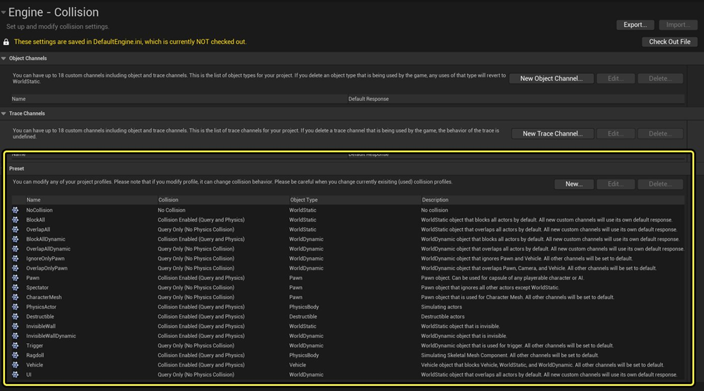
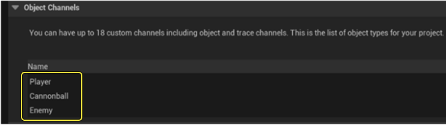
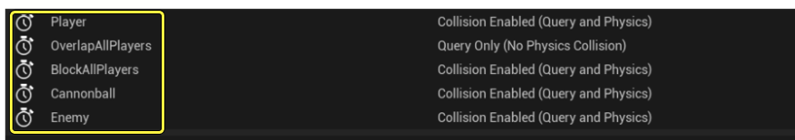
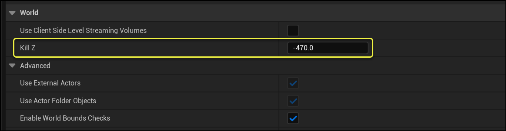
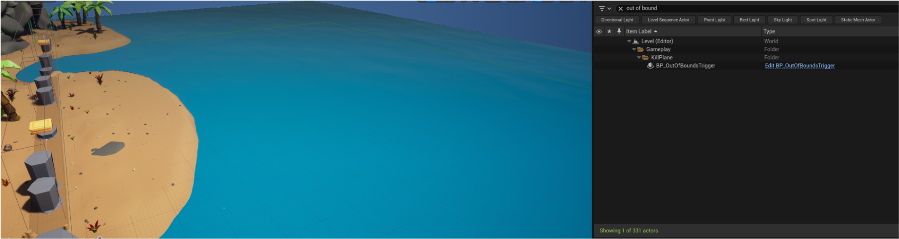
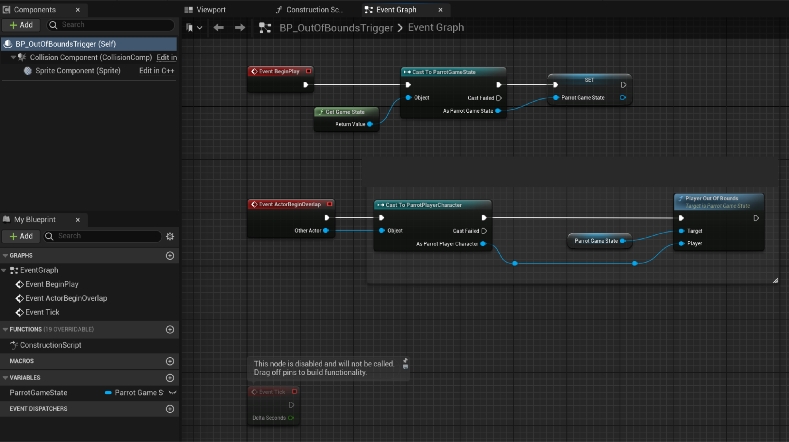
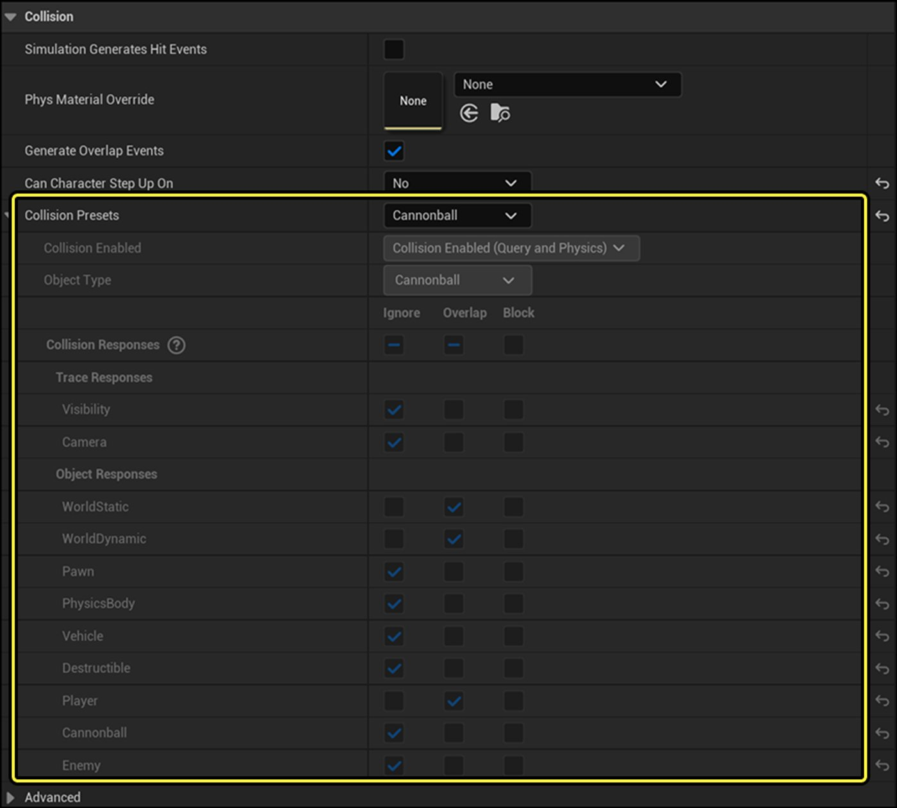
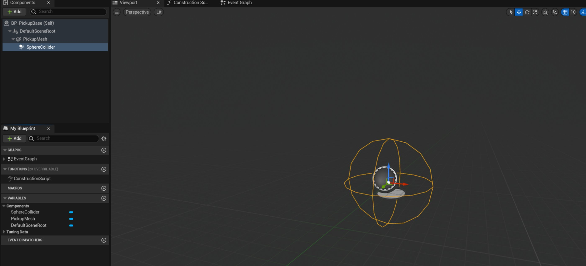

# Parrot中的碰撞物、触发器和拾取物

> 路径：虚幻引擎5.7文档 / 入门指南 / 为Unity开发者准备的虚幻引擎指南 / Parrot游戏示例 / Parrot中的碰撞物、触发器和拾取物

> 原始页面：https://dev.epicgames.com/documentation/unreal-engine/colliders-triggers-and-pickups-in-parrot-for-unreal-engine

## 碰撞类型

虚幻引擎的碰撞与Unity类似，但也存在一些差异。本文将阐述这些差异。 如果你曾用过Unity的基于层的碰撞检测，那么你应该会发现，此项目的碰撞设置与碰撞矩阵类似。 如需访问相关设置，请转到**编辑（Edit）** > **项目设置（Project Settings） > 碰撞（Collision）**。 展开**预设（Preset）**选项卡，即可查看所有的默认预设配置文件及其功能描述。

如上图所示，虚幻引擎在碰撞解析方面提供了更多选项。 [虚幻引擎碰撞概述](../../../../gameplay-systems/physics/collision/collision-in-unreal-engine---overview/index.md)对此有深入的阐述。 这种精细的碰撞检测非常实用，有助于优化游戏的性能。 需要特别注意的是：

- 你可以将通道或单个碰撞物设置为 "阻挡（Blocking）"、"重叠（Overlap）"或"忽略（Ignore）"。
- 在需要重叠事件时，一个常见的错误是没有为碰撞物正确勾选其"生成重叠事件（Generate Overlap Events）"复选框。
- 静态几何体应该具有阻挡和重叠的功能，但不一定要生成重叠或命中事件，因为Gameplay并不需要这些事件。
- 即使一个对象阻挡了另一个对象，重叠事件也依然可以被生成，尤其是在高速移动时。 在Unity中，如果你直接修改平移而不是修改刚体组件，那么这可能会引发问题。 因为这样做会绕过物理方面的考量。
- 在虚幻引擎中，当你调用的函数会更新Actor的变换时，会有两个布尔参数可决定Actor的移动方式：

  - **Sweep**：为true时会触发重叠事件，并在Actor被阻挡时阻止其到达目的地。 **Teleport**：决定了是否保留物理速度。

- 你也可以将通道（Channel）用于碰撞检测（Trace），它相当于Unity的物理投射功能（例如 Raycast、SphereCast等）。 你可以在Line Trace函数调用期间传递通道，就像在Unity的Raycast中传递层遮罩那样。

### Parrot自定义碰撞类型

Parrot中设置了多个自定义碰撞对象通道，即：**玩家（Player）**、**炮弹（Cannonball）**和**敌人（Enemy）**。

添加了这些对象类型后，Parrot就可以精确控制这些对象通道在场景中发生碰撞检测时与碰撞检测通道交互的方式。 系统设置了默认响应，以应对通常的情况，但你也可以按需自定义。 Parrot还提供了几套自定义碰撞检测通道的预设，即：**Player**、**OverlapAllPlayers**、**BlockAllPlayers**、**Cannonball**以及**Enemy**。

这些预设对于Gameplay触发器尤其有用。 例如，`OverlapAllPlayers`可以忽略所有其他碰撞，只响应玩家碰撞对象类型的碰撞事件。 只要查看游戏中不同网格体的碰撞设置，你就会发现这些预设的使用频率很高。

如有需要，你还可以逐网格体自定义碰撞设置。

### 世界边界

创建关卡时需要注意**世界边界**。 转到**世界设置（World Settings） > 世界（World）**，即可设置世界边界。 定义好世界边界后，你可以在Actor与世界边界交互时实现自定义的伤害类型。 Parrot的边界结合使用了**销毁Z（Kill Z）**世界设置和**越界（Out of Bounds）**触发器体积。

## 触发器体积

虚幻引擎内置了触发器体积Actor（详见[虚幻引擎中的触发器体积Actor](../../../../understanding-the-basics/actors-and-geometry/unreal-engine-actors-reference/trigger-volume-actors/index.md)），可用于触发事件。 开发者在Parrot中使用这些触发器体积的示例包括**越界（Out Of Bounds）**和**终点线（Finish Line）**触发器体积。 触发器体积通常会与关卡蓝图结合使用（详见开发者文档[Parrot中的关卡蓝图](../unreal-engine-level-blueprints-in-parrot/index.md)），但并非必须如此。 Parrot针对"越界"的触发器是一个带有简单事件图表的盒体触发器：

如果你在"细节（Details）"面板中查看Actor的碰撞设置，你会发现碰撞通道预设在这里完成了大部分工作。

### 强化拾取物

让我们以Parrot的强化拾取物的实现方案为例，讲解碰撞系统的实践应用。 请转到**内容（Content）** > **蓝图（Blueprints）** > **拾取物（Pickups）**，打开**BP_PickupBase**并查看视口，这时你会看到包含了碰撞组件的层级结构。

碰撞设置和越界体积都使用了一套触发器预设，可以为玩家生成重叠事件：

> 图片已省略：生成重叠事件选项的复选框的图像。

查看事件图表，你会看到`ActorBeginOverlap`事件以其他Actor（Other Actor）作为参数。 此事件的工作原理与Unity的`OnCollisionEnter`事件非常相似。 区别在于，它传递的不是碰撞物组件，而是Actor本身。

Parrot会进行投射，以检查该Actor是否为发生重叠的玩家。 然后调用 `OnPickedUp` 事件。 这将允许派生的蓝图类针对`OnPickedUp`定义其自身的行为，同时让基类处理Actor重叠事件本身。

开发者使用基类蓝图来处理所有拾取物播放声音并生成部分粒子效果的工作。 拾取物声音和粒子效果变量是可以编辑实例的，因此可以被设为派生类的类默认值。 **类默认值（Class Defaults）**位于蓝图编辑器顶部，编译按钮旁：

> 图片已省略：菜单栏设置中的类默认值选项。

速度拾取物就是一个更改后的类默认值，它使用了Niagra系统的绿色粒子（而红心拾取物则使用粉色粒子）。 同样地，派生的蓝图也可以设置拾取物网格体本身。 重叠逻辑的最后一步是销毁拾取物Actor，因为我们不希望它在被玩家拾取后仍然存在。

只需几个节点，你就可以创建诸多强大的逻辑，并轻松将其扩展至派生的蓝图。 所有派生的蓝图都源于与Actor绑定的重叠事件。

## 玩家角色从敌人身上跳下

另一个值得一看的例子是玩家从敌人身上跳下的情况。 敌人的胶囊体碰撞物类型即"敌人（Enemy）"，会与玩家对象类型发生碰撞。 手持剑刃的敌人也拥有类似的重叠事件。 这种胶囊体碰撞物通常被称为命中盒体（Hitbox），是攻击生效的地方。

但是，当玩家从敌人身上跳下时，Parrot要如何处理相关事件呢？ 该游戏采用的解决方法是在敌人头部放置一个受击盒体（Hurtbox）。 当玩家与受击盒体的体积重叠时，玩家角色可以根据角色的位置、受击盒体的位置以及受击盒体的范围进行一系列判定，以确定跳跃是否有效。 如果判定通过，玩家就可以执行跳跃并击中敌人。 其中的繁重工作将再次由碰撞通道完成，并过滤出Parrot所关注的那部分重叠，即玩家碰撞对象和位于受击盒体体积中的敌人。
