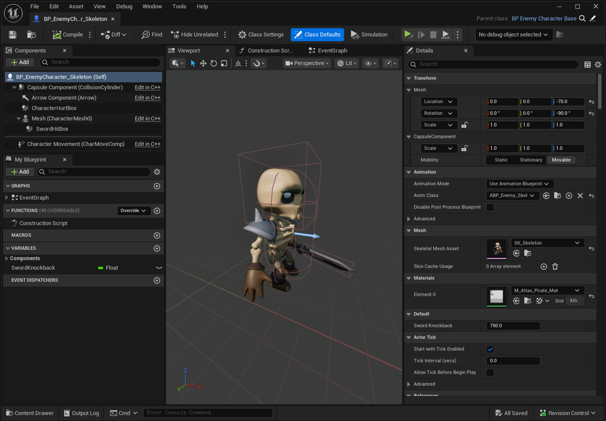

# Parrot中的战斗

> 路径：虚幻引擎5.7文档 / 入门指南 / 为Unity开发者准备的虚幻引擎指南 / Parrot游戏示例 / Parrot中的战斗

> 原始页面：https://dev.epicgames.com/documentation/unreal-engine/combat-in-parrot-for-unreal-engine

## 战斗

与其说战斗是一套离散的系统，不如说它是一套抽象的系统 ——它是由多套系统相互协作产生的复杂交互，其实现方案的复杂度在很大程度上取决于设计的复杂度。

在我们的游戏中，战斗的设计非常简单。 玩家只有一种攻击手段，即跳到敌人的头上。 敌人则有两种攻击玩家的方式，即近战攻击和接触攻击，具体取决于敌人的类型。

玩家的攻击和敌人的近战攻击几乎具有完全相同的基本原理。 根据角色的近战攻击方式，我们在其骨架网格体上放置了一个或多个命中盒体，同时放置了一个或多个受击盒体，以模拟需要进行命中测试的区域。

针对敌人的接触攻击，我们会使用敌人的胶囊体碰撞物来检查玩家是否与之接触，并执行与近战攻击相同的命中动作。 如需查看角色被击中时的实现方案，请转到位于`Parrot\Source\Parrot\Public\Character\ParrotCharacterBase.h`的角色基类。 此处及子类`ParrotPlayerCharacter.h`和`ParrotEnemyCharacterBase.h`中包含了相关的功能逻辑。

#### 玩家角色

在攻击敌人的原理方面，玩家的设置是独一无二的。 当玩家与敌人的受击盒体重叠时，敌人会将此信息传递给玩家，并询问攻击是否有效。 此时，它会检查玩家是否位于受击盒体的上方，以确保玩家会落在其上方，而不是从侧面或下方触发攻击。 如果攻击有效，那么敌人会提示玩家进行跳跃。 如果玩家在接触受击盒体时仍按住跳跃键，就会跳得更高。 如果玩家在接触受击盒体之前松开跳跃键，则会跳得不那么高。

#### 敌方角色

敌人的设置更复杂一点，原因有几方面。 我们希望近战攻击显得逼真，因此我们在敌人武器的边缘位置放置了命中盒体。 你可以在敌方角色蓝图的视口中查看其命中盒体、受击盒体和胶囊体碰撞物的设置，比如此处的设置：`Blueprints > Enemy > Skeleton > BP_EnemyCharacter_Skeleton`。

你可以在本例中看到头部的受击盒体、武器上的命中盒体、胶囊体碰撞物。 以上所有触发器都会将其重叠事件传递给角色基类中的父函数。

此外，攻击动画会发送通知事件，而这些事件仅会在动画中武器挥舞的部分中启用武器的命中盒体。 这样一来，玩家被武器命中的观感就会显得更为真实，而不会显得像是因为接触到了敌人而在随机时间内受到了伤害。 这些**动画通知**会在特定的点上被插入到攻击动画中，以触发受击盒体的启用以及随后的禁用。 你可以在`Blueprints > Enemy/EnemyBase > BP_AnimNotify_EnemyAttackBegin`和`Blueprints > Enemy > EnemyBase > BP_AnimNotify_EnemyAttackEnd`中查看动画通知，及其对应的敌方角色的攻击动画设置，例如`Assets> Quaternius > PirateKit > Characters > Headless_Skeleton > Animations > Characters_Skeleton_Headless_Anim_CharacterArmature_Sword`。

检测重叠和触发事件均由敌方角色负责，这意味着当检测到对应的重叠时，敌人会触发其自身的`HitCharacter()`函数和玩家的`HitCharacter()`函数。

如需查看作用于命中盒体重叠和受击盒体重叠的代码，请转到：`Parrot\Source\Parrot\Public\Character\ParrotEnemyCharacterBase.h`位置的`HitBeginOverlap()`和`HurtBeginOverlap()`函数。

#### Boss战

在我们的Boss战中，玩家击中Boss时，为播放"愤怒"序列，我们实现了额外的功能。 如需查看触发Boss反应的蓝图代码，请转到 `Blueprints > Enemy > BossShark > BP_EnemyCharacter_BossShark`。

"愤怒"序列是一个简单的定时序列，它会先播放一段预示的"摇头"动画，然后加快Boss的行走速度，并启用一个绿色火焰的Niagara组件作为视觉特效。 此序列还会禁用受击盒体，从而使Boss处于无敌状态。
