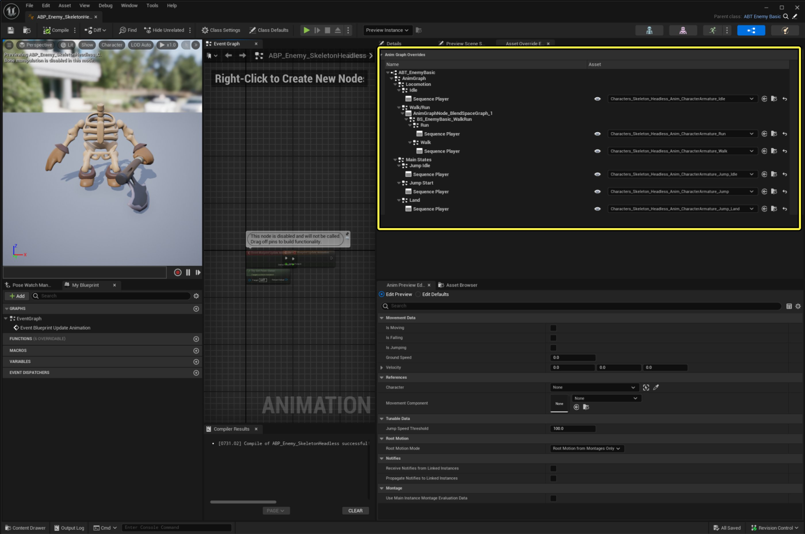
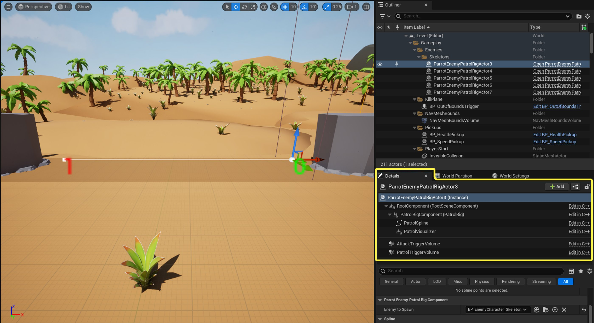
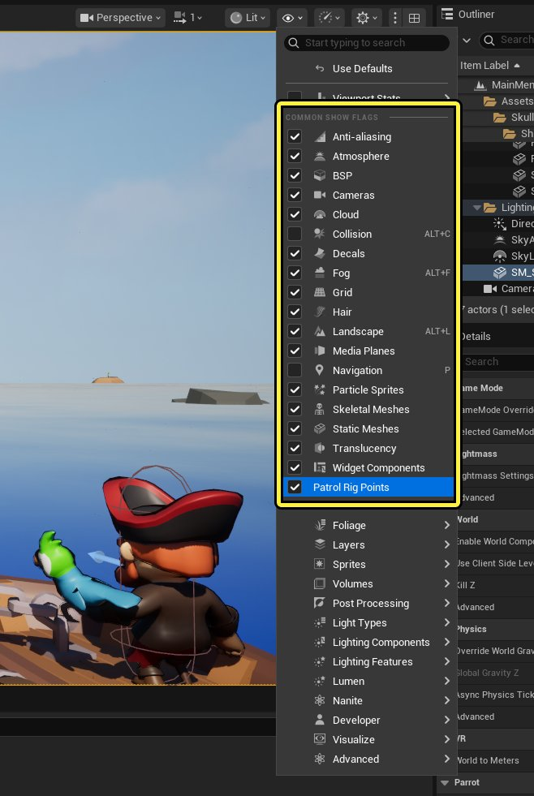

# Parrot中的敌方角色

> 路径：虚幻引擎5.7文档 / 入门指南 / 为Unity开发者准备的虚幻引擎指南 / Parrot游戏示例 / Parrot中的敌方角色

> 原始页面：https://dev.epicgames.com/documentation/unreal-engine/enemy-characters-in-parrot-for-unreal-engine

## 敌方角色

虚幻引擎中的NPC和敌人的设置通常都非常类似于玩家，因为敌人也有一个控制器和一个Pawn。 事实上，敌人和玩家都有常见基类`AParrotCharacterBase`中的部分功能。 Parrot游戏使用行为树控制敌人的行为，因此我们使用AI Controller类来创建敌人的控制器。 我们将从动画蓝图开始，因为敌人之间共享了动画蓝图的设置。

## 敌人的动画蓝图

### 动画蓝图模板

如果你有多个骨架网格体，而且它们对动画的需求相同，那么你可以创建动画蓝图模板（详情请参阅**[Animation Blueprint Linking](https://dev.epicgames.com/documentation/unreal-engine/BlueprintAPI/Components/SkeletalMesh/AnimationBlueprintLinking?application_version=5.6)**）。 本例中有四种类型的敌人：无头骷髅、骷髅、鲨鱼怪、鲨鱼Boss。 由于它们使用相同的骨架和动画配置，因此所有敌人都可以复用同一个模板来实现动画图表和事件图表。 如需查看模板的设置，请转到 `Blueprints > Enemy > EnemyBase > ABT_EnemyBase`。 它看起来与玩家的动画蓝图非常相似，因为模板的设置方式与动画蓝图几乎相同。

### 动画蓝图

本例中所有的实现方案都位于模板中，而动画本身缺失，因为模板并没有引用特定的骨架。 每个敌人都有派生自模板的专属动画蓝图，而每个敌人都在动画图表重载项中插入了该骨架的动画。 如需查看示例，请转到 `Blueprints > Enemy > HeadlessSkeleton > ABP_Enemy_HeadlessSkeleton`。

下图中，我们为无头骷髅的骨架网格体的每个动画状态都选择了合适的动画。

### 敌方Pawn

Parrot游戏的敌方角色具有许多与玩家角色相同的功能，特别是生命值和类似的功能（比如死亡）。 这种共享的实现方案可以在`AParrotCharacterBase`中看到。 针对敌人专有的实现方案，我们使用子类`AParrotEnemyCharacterBase`。 它可负责处理巡逻系统的工作原理、战斗的工作原理等所有实现。 如需详细了解战斗的工作原理，请参阅 [Parrot中的战斗](../combat-in-parrot/index.md)文档。

在该设置中，敌人的战斗命中和伤害判定都依赖一个蓝图基类，取决于如何触发该基类中的体积。该基类的位置见：`Blueprints > Enemy > EnemyBase > BP_EnemyCharacter_Base`。

之所以在这里进行实现，而不是在原生的C++类中实现，是因为每个敌人的网格体形状、大小和复杂程度均不同，导致对应的触发器体积也必须不同。 由于继承的触发器体积不能在派生类中修改，因此这么做是有必要的。

### 敌人AI控制器

如前所述，敌人是由行为树控制的，因此在`AParrotEnemyAIControllerBase`中存在一个派生自`AIController`的基类。 你会在这里看到各种 `BlueprintImplementableEvents`，它们用于向黑板发送数据以供行为树使用。

如需查看AI Controller如何将数据传递给行为树，以及如何探测到玩家，请转到`Blueprints > AI > EnemyBase > BP_EnemyController_Base`。

## 使用行为树创建AI

虚幻引擎为使用行为树编译AI提供了强大而灵活的基础架构。 如需快速了解如何使用行为设置基础样板，请参阅[行为树快速入门指南](../../../../gameplay-systems/artificial-intelligence/behavior-trees/behavior-tree-in-unreal-engine---quick-start-guide/index.md)。 该指南得出的结果被用作敌人AI的基础，供我们调整以设置所需的行为。

我们使用了两种行为树任务，即**Blueprints > AI > EnemyBase > BTT_FindNextPatrol**和**Blueprints > AI > EnemyBase > BTT_AttackPlayer**，它们分别负责提供巡逻和攻击玩家所需的基本功能。 由于所有敌人都具备支持所有功能的基础架构，因此我们只使用一份共享黑板，即**Blueprints > AI > EnemyBase > BB_Enemy_Base**。 至于使用哪些功能来自定义敌人的行为，则取决于行为树的具体实现方案。

每个敌人使用的行为树配置都不同，因此它们的行为方式也各不相同。 你可以在以下位置查看全部的四种敌人：

- ****Blueprints> AI > HeadlessSkeleton > BT_HeadlessSkeleto**n**
- **Blueprints > AI/Skeleton > BT_Skeleton**
- **Blueprints > AI > Sharky > BT_Sharky**
- **Blueprints > AI > BossShark > BT_Boss_Shark**

## 创建可编辑的巡逻路径点系统

Parrot并不想为敌人使用行为树指南一文中展示的那种巡逻功能，即敌方AI每4秒在半径范围内随机选择一个可寻路的点。 我们想要的效果是敌人主动按照巡逻路线来回巡逻，就像许多其他平台跳跃游戏那样。

为此，Parrot开发了自己的系统以提供所需的功能。 该系统包含了`UParrotEnemyPatrolRigComponent`。将其放置在场景中即可创建巡逻路径。 它使用类的默认子对象来将样条线实例化。 我们使用该样条线创建了巡逻路径点、两个触发器体积（用于触发AI行为）、一个编辑器专用的查看器。该查看器可绘制路径点的排列顺序。 路径点的排列顺序让你可以在编辑时看到巡逻路径的方向。 如需了解C++实现方案的细节，请转到`UParrotEnemyPatrolRigComponent`。

由于该实现方案是一个组件，所以我们可以将巡逻绑定附加到场景中的任意Actor上。 这让我们可以将绑定放置在移动的对象上，同时这还意味着，巡逻者能在本地空间中保持正确的位置。 若要放置一个未附加到场景中现有Actor的巡逻绑定，我们可以使用`AParrotEnemyPatrolRigActor`，它是一个可被放置在场景中任意位置的Actor，并且会生成一个`UParrotEnemyPatrolRigComponent`作为其自身的默认子对象。

这种实现方案让你能够在运行时选择要生成的敌人，并使其跟随巡逻路径。 此过程使用了虚幻引擎的**延迟Actor生成**功能，该功能让你能分两个阶段生成Actor，而在第一个阶段中，构造Actor对象的过程不会执行`AActor`的初始化（比如`BeginPlay`）。 这让你可以在Actor初始化之前对其进行必要的配置或设置。 完成此项设置后，你需要启动第二阶段来完成生成过程并将该Actor初始化。 之所以对巡逻绑定执行此操作，是为了在生成敌人Actor时将巡逻样条线和触发器体积输入到该Actor中，从而在Actor初始化期间就对其进行处理，并自动开始巡逻序列。

如需查看延迟Actor生成所用的代码，请转到`UParrotEnemyPatrolRigComponent`。 蓝图中也存在类似的功能。你可以将蓝图Actor的属性标记为**生成时公开（Expose on Spawn）**，这样你就可以将参数传递到生成蓝图节点中。而你可以在Actor初始化之前就设置好这些参数。

下图是在**地图（Maps） > Level_1 > Level_1**中设置巡逻绑定的一个示例。巡逻绑定使用了两个点，从右边的点0开始。 我们将该巡逻绑定设为了生成一个`BP_EnemyCharacter_Skeleton`。

下图中有一个 **显示标记（Show Flag）** 切换菜单，该菜单可标记巡逻绑定的路径点，以方便你在编辑时识别。 大多数显示标记复选框都已被勾选。 你可以在编辑器专用的查看器组件`UParrotPatrolRigDebugVisualizer`中查看其实现方案的详情。

