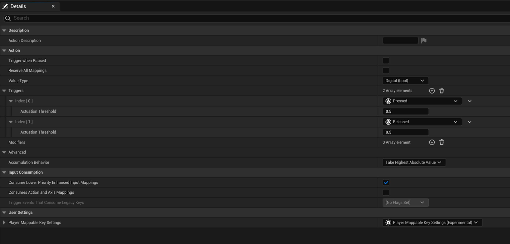
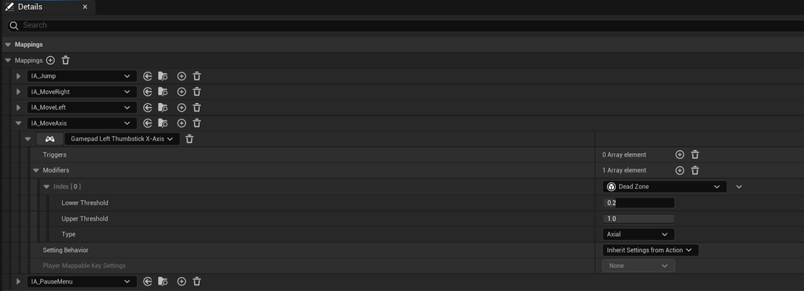
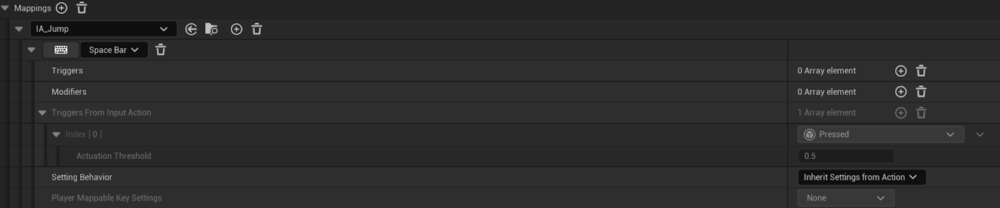
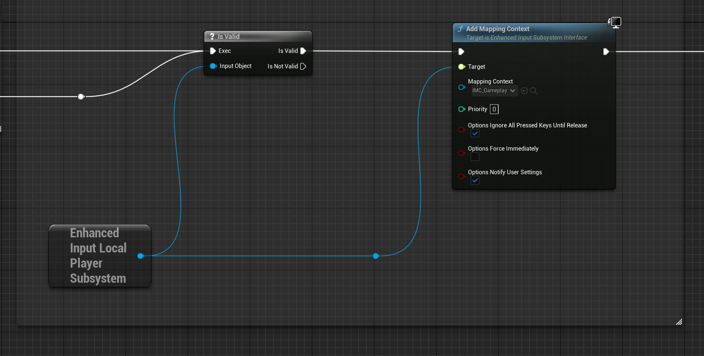
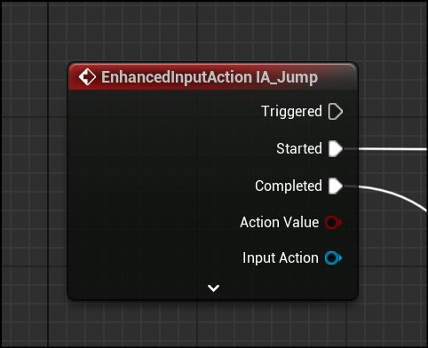
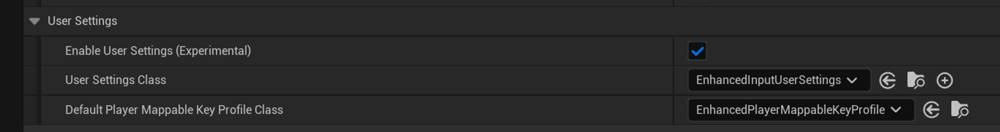
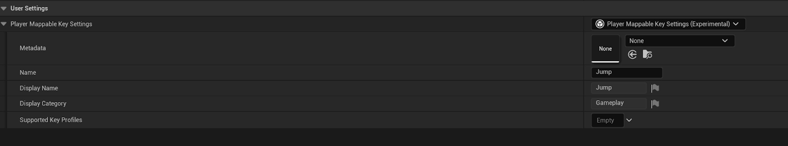
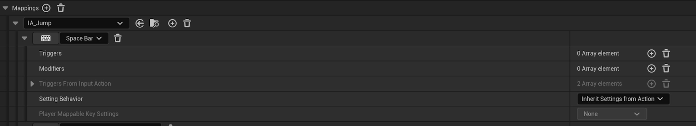

# Parrot中的增强输入

> 路径：虚幻引擎5.7文档 / 入门指南 / 为Unity开发者准备的虚幻引擎指南 / Parrot游戏示例 / Parrot中的增强输入

> 原始页面：https://dev.epicgames.com/documentation/unreal-engine/enhanced-input-in-parrot-for-unreal-engine

## 增强输入

增强输入（Enhanced Input）是Epic Games开发的一款第一方插件。我们在Parrot中也使用了该插件。 只要你使用的是最新版本的虚幻引擎5，就会默认启用该插件。 转到**编辑（Edit） > 插件（Plugins）**并勾选复选框即可确保将其启用。

增强输入取代了虚幻引擎的默认输入系统，是复杂输入处理或运行时功能按钮重映射的标准。 Epic Games的[官方文档](../../../../gameplay-systems/input/enhanced-input/index.md)详尽介绍了该系统，并说明了要如何设置输入资产。

## 核心概念

按照官方文档，关于增强输入，你需要了解的核心概念如下：

1. **输入操作（Input Actions）**
2. **输入映射上下文（Input Mapping Contexts, 简称IMC）**
3. **输入修饰器（Input Modifiers）**
4. **输入触发器（Input Triggers）**

如果你用过Unity的新版输入系统，那么你应该很熟悉这些概念。

1. **输入操作**可以被理解为在特定的游戏情境下“要执行的操作在游戏中所达成的效果”。 例如当你的角色在车内时，你会希望其具有”加速“或”刹车“的操作。
2. **输入映射上下文**也对此示例适用。 当玩家上车或下车后，你可能需要更改某些按键或游戏手柄按钮的功能。
3. 除非满足所有触发条件，否则**输入触发器**会阻止操作触发。 例如，你可能希望玩家按住某个按钮一段时间才能触发某个操作。
4. **输入修饰器**会改变输入本身的值。 盲区（Dead Zone）是一种常见的输入修饰器，用于简化原始输入值。 增强输入只需一些设置即可为你解决以上所有问题。

让我们来看Parrot中的一个示例。 在`Content/Input/Gameplay`目录下，你会找到一个`Actions`文件夹和一个`IMC_Gameplay`资产文件。 请在`Actions`文件夹中找到`IA_Jump`资产。

此处的值类型是`Digital (bool)`，表示此操作的输出类型。 触发器下有以下类型：

- 已按下（Pressed）
- 已释放（Released）

查看此输入操作后可得出结论：不论按键或按钮的映射为何，它都必须通过按下的动作触发，且具有布尔值的输出状态。 释放按钮即可触发操作的结束。 此处另一个重要的细节是，不论是触发器还是修饰器，它们都可以被输入映射上下文重载。 让我们以Gameplay输入映射上下文为例，了解修饰器重载的实际应用。

我们并未为`IA_MoveAxis`设置触发器，因此当检测到变化时，系统将立即读取此处的游戏手柄左摇杆X轴的值。 为简化原始输入值，我们使用了盲区修饰器来设置输入的上限和下限。

我们没有在IMC中提供重载的一个例子是跳跃映射。

在此处，你会注意到触发器来自输入操作本身，因此无需为映射定义触发器。 相关设置也会从操作中继承，但目前你可以暂时忽略这一点。相关内容将在重映射小节中介绍。

## 增强输入的事件监听器

现在你已设置好了所需的资产，是时候处理运行时设置了。 在Parrot中，我们绑定了增强输入本地玩家子系统（Enhanced Input Local Player Subsystem），以便在`BP_ParrotPlayerController`中设置事件监听器。 我们在`BeginPlay`节点的外部为`IMC_Gameplay`添加了映射上下文。

子系统可在不同的范围内被引用。 增强输入本地玩家子系统可在玩家控制器中访问。 通过该系统，你可以添加增强输入映射上下文，从而监听该事件图表中的输入事件。 在本例中，我们添加了Gameplay的默认映射上下文。

此处的优先级（Priority）参数非常重要。 输入映射上下文是根据其优先级来求值的，因此在为上下文分层时请记住这一点。 目前，你只需使用Gameplay上下文。

请注意，此处将通知用户设置，即`Notify User Settings`参数设为了`true` ——这对稍后的运行时输入重映射至关重要。

映射上下文准备就绪后，接下来只需为你所关注的操作添加增强输入事件节点即可。 以下是跳跃的示例：

该操作在玩家按下按钮时开始，在玩家释放按钮时完成。 如需了解其他输入类型的处理方式，请查看`BP_ParrotPlayerController`中的其他输入操作。 只要你愿意，你也可以使用C++绑定输入事件，具体方法在官方文档中有详细介绍。

## 运行时输入重映射

增强输入支持在运行时重新映射绑定到输入操作的按键。 注意，虽然此功能能够正常运行，但它仍处于试验阶段，因此在尝试发布此功能时请务必谨慎。 在Parrot中，我们使用了一个**按键绑定（Key Bindings）**界面，让玩家能够重新映射按键。 为此，我们结合使用了增强输入和Epic Games的Common UI插件，并凭此为界面控件提供正确的元数据。 [用户界面](../user-interface-for-parrot/index.md)文档介绍了Common UI的设置。请阅读该小节后再继续操作。 设置好该插件后，你还可以按平台显示不同的UI元素。

首先，请在项目设置中启用增强输入的用户设置。 该选项的位置见**编辑（Edit） > 项目设置（ProjectSettings） > 引擎（Engine） > 增强输入（Enhanced Input）**。 请按下图进行设置。

接下来，请找到输入操作资产，调整**玩家可映射键设置（Player Mappable Key Settings）**。 **名称（Name）**字段在所有输入操作中必须唯一。 **显示名称（Display Name）**和**类别（Category）**已在Parrot中本地化。

定义IMC中的按键时，你也可以重载玩家可映射键设置（Player Mappable Key Settings）。 我们将Gameplay IMC中的跳跃动作保留为了“从操作中继承设置（Inherit Settings from Action）”，因此无需进行特殊设置。

当你为玩家控制器蓝图添加输入映射上下文时，请确保将通知用户设置`Notify User Settings`参数设为`true`。

> 图片已省略：Parrot游戏的Add Mapping Context节点

下一小节将介绍如何将增强输入操作与Common UI相关联。 我们将介绍Parrot中输入重映射所需的内容，但这篇文档仅是对官方的[Common UI快速入门指南](../../../../user-interfaces/plugins-for-ui-development/common-ui/common-ui-quickstart-guide/index.md)的补充。

在下一步中，我们在`Content/Input/UI`下创建了新的IMC：`IMC_UI_Generic`。

你需要为所有输入操作设置“玩家可映射按键设置（Player Mappable Key Settings）”字段，并使其指向对应的UI元数据数据资产。 以下是通用的接受输入操作及其元数据资产的示例。

> 图片已省略：通用的接受输入操作

> 图片已省略：接受输入操作的元数据资产

Common UI必须使用这些IMC和输入操作才能了解由UI导航所调用的操作。 通用的“接受（Accept）”和“返回（Back）”输入操作就是此情况的主要示例，因为玩家在UI界面中导航时总会需要调用它们。 我们在Common UI专用的数据蓝图中定义了这些映射，该蓝图是`CommonUIInputData`的子类。

> 图片已省略：Common UI专用的数据蓝图

接下来，转到**编辑（Edit） > 项目设置（Project Settings） > 通用输入设置（Common Input Settings）**，将输入数据设为你的通用输入数据蓝图。

> 图片已省略：将输入数据设为通用输入数据蓝图。

设置好重要字段后，你就可以开始设置控件界面了。 首先，你需要为静态界面设置一个基本Parrot Screen类，并为其他界面创建一个可激活的类。 静态界面就类似于HUD，你无需担心其UI导航问题。 暂停菜单可被视为一份可激活的示例，因为它需要知道返回按钮是在何时被按下的，并且它位于游戏布局中的菜单层。

[用户界面](../user-interface-for-parrot/index.md)文档中已经介绍过了界面层级结构，但为了方便参考，我们将在此再次展现该层级：

> 图片已省略：可激活界面类的层级结构

在蓝图界面的类默认值中，我们设置了一个可选的输入映射上下文。 我们将其应用于控件的激活/停用，你也可以将其逐类重载。

> 图片已省略：设置输入映射上下文。

`UParrotActivatableScreen`有一个用于处理返回操作的实现方案。 `IA_UI_GenericBack`事件监听器由使用该监听器的派生蓝图的事件图表定义。 你还需要在细节面板中勾选**是返回处理程序（Is Back Handler）**复选框。

> 图片已省略：勾选"是返回处理程序"复选框

请参阅C++类和蓝图中的注释，了解返回模式在不同界面控件中的使用方式。

了解完基类后，请查看你的按键绑定界面。 `WBP_KeyBindingsScreen`位于`Content/UI/Widgets/Screens`目录之下。 你可以自行查阅该事件图表，以了解如何查询用户设置`User Settings`和按键配置文件`Key Profile`，以此从增强输入中拉取玩家按键映射`Player Key Mapping`的类型。 使用该数据即可添加并填充`WBP_InputSelectorBox`控件。 在`WBP_InputSelectorBox`控件内部，你会发现两个`W_ParrotInputSelector`控件。

其中一个用于游戏手柄的输入，另一个则用于键盘的输入。 Parrot输入选择器（Parrot Input Selector）是一款自定义控件，其灵感源自内置的输入选择器（Input Selector）控件。 这两款控件都会进入选择状态，等待输入，然后更新显示：

- 针对鼠标和键盘，我们使用了增强输入子系统的返回文本并更新了显示。
- 游戏手柄的实现则依赖于Common UI来查询控制器专用的图像。 在本例中，我们为Xbox的图像设置了一个名为`CommonInput_Gamepad_Xbox`的类，该类位于`Content/Input/UI/Platform`下。 该类派生自 `UCommonInputBaseControllerData`。

通过从此类中派生，你可以将输入按键映射到带有图像的笔刷上。 接下来，请转到**编辑（Edit） > 项目设置（Project Settings） > 通用输入设置（Common Input Settings）**，并设置控制器数据，然后导航到对应的平台。

> 图片已省略：在通用输入设置中设置控制器数据。

连接好数据后，其余工作将在控件中进行。 `UParrotInputSelector`和`WBP_InputSelectorBox`中的代码和注释值得一看，能帮你了解使用增强输入和Common UI子系统实现重映射功能的具体原理。

最后一个需要重点介绍的功能是如何保存映射的按键。 这将在`WBP_KeyBindingsScreen`的`SaveKeyMappings`函数中进行。 此函数会遍历所有选框控件，然后使用用户设置内置的`Apply Settings`和`Save Settings`函数。 `Save Settings`函数会将游戏存档文件`EnhancedInputUserSettings.sav`写入到磁盘中。 该文件位于**项目目录（Project Directory） > Parrot > Saved-SaveGames**下。

如果一切设置都正确无误，那么这时你应该会得到一个可以正常运行的按键绑定界面！

你可能会注意到，右下角显示了一个操作控件，它会在按键重新映射后更新。 该控件是`WBP_ParrotGamepadActionWidget`，位于`Content/UI/Widgets/Common`目录下。 它大量使用了Common UI的`UCommonActionWidget`类，当某个输入操作使用我们之前创建的通用输入数据时，该类就会显示各平台专用的图标。 利用Common UI，你可以轻松按需新建控件，并令其引用游戏的增强输入操作。
