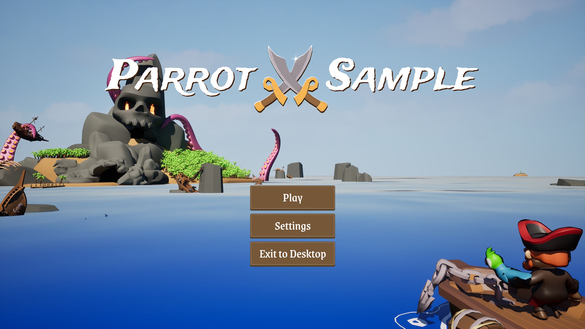

# Parrot游戏示例

> 路径：虚幻引擎5.7文档 / 入门指南 / 为Unity开发者准备的虚幻引擎指南 / Parrot游戏示例

> 原始页面：https://dev.epicgames.com/documentation/unreal-engine/parrot-game-sample-for-unreal-engine

Parrot游戏示例项目是Epic Games与资深开发工作室[Secret Dimension](https://secretdimension.com/)携手合作的成果，旨在为拥有Unity开发经验并希望以实践方式学习并在虚幻引擎中开发游戏的开发者提供支持。

Secret Dimension在虚幻引擎5.6和Unity 6中使用相同的资产开发了这款游戏。这是一款魅力十足、以海盗为主题的2.5D平台跳跃游戏，包含三个关卡、一个标题界面以及一套完整的菜单系统。 他们的目标是：让这两个版本尽可能保持高度一致，并记录整个过程中的每一个见解。

Parrot游戏示例项目就是最终成果，该项目在Fab上免费提供了[Unity](https://www.fab.com/listings/3b06d6ea-4185-472c-9783-22c329aae3fc) 版本和[虚幻引擎](https://www.fab.com/listings/844973a5-88a4-4870-a685-ab6d9770e203) 版本。 本项目附有详尽的注释和全面的文档，诚邀开发者深入探究每个项目，阅读文档与注释内容，探索所使用的工具，并从Secret Dimension跨引擎开发的历程中汲取关键经验。

- [Parrot中的关卡蓝图](unreal-engine-level-blueprints-in-parrot/index.md) - 了解Parrot使用关卡蓝图的方式。
- [Parrot中的子系统](subsystems-in-parrot/index.md) - 了解Parrot使用子系统的方式。
- [Parrot中的序列化](serialization-in-parrot/index.md) - 了解Parrot中保存和加载的工作原理。
- [Parrot中的虚幻引擎Gameplay框架](unreal-engine-gameplay-framework-in-parrot/index.md) - 了解Parrot使用虚幻引擎Gameplay框架的方式。
- [Parrot中的Pawn、玩家控制器以及角色移动](parrot-pawn-player-controller-and-character-movement/index.md) - Parrot项目的Pawn、玩家控制器以及角色移动功能。
- [Parrot摄像机](parrot-cameras/index.md) - 关于Project Parrot摄像机的所有信息。
- [Parrot中的敌方角色](enemy-characters-in-parrot/index.md) - Parrot项目为NPC敌人使用了模板。
- [Parrot中的战斗](combat-in-parrot/index.md) - Parrot游戏中战斗的工作原理。
- [Parrot中的碰撞物、触发器和拾取物](colliders-triggers-and-pickups-in-parrot/index.md) - Parrot项目中的碰撞和触发器。
- [Parrot中的序列](unreal-engine-sequences-in-parrot/index.md) - 了解Parrot项目使用Sequencer的方式。
- [Parrot的用户界面](user-interface-for-parrot/index.md) - 如何设置Parrot游戏用户界面所用的系统。
- [Parrot中的增强输入](enhanced-input-in-parrot/index.md) - 如何在Parrot游戏中使用增强输入。
- [Parrot中的音频引擎实现方案](unreal-engine-audio-implementation-in-parrot/index.md) - 了解Parrot项目在虚幻引擎中使用音频引擎的方式。
