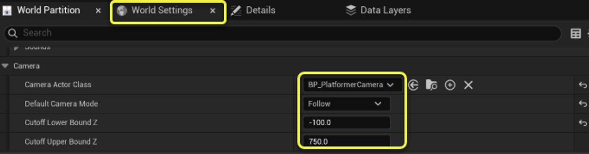
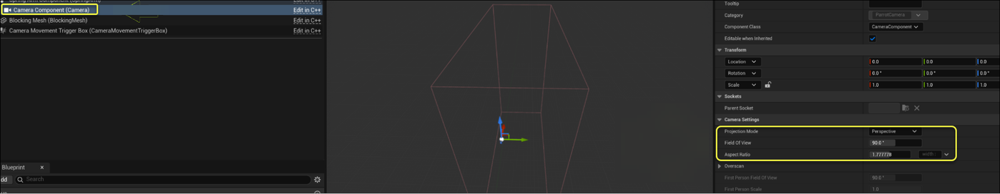

# Parrot摄像机

> 路径：虚幻引擎5.7文档 / 入门指南 / 为Unity开发者准备的虚幻引擎指南 / Parrot游戏示例 / Parrot摄像机

> 原始页面：https://dev.epicgames.com/documentation/unreal-engine/parrot-cameras-in-unreal-engine

在游戏中使用**摄像机**的方法多种多样，具体会因为你所制作的游戏类型而大为不同。 在虚幻引擎中，摄像机通常由一个带有弹簧臂组件的Actor和一个负责渲染视图的摄像机组件构成。 如需了解基本摄像机设置，请参阅 [在虚幻引擎中使用摄像机](../../../../gameplay-systems/gameplay-framework/cameras/using-cameras/index.md)。

在本文档中，开发者将介绍针对Parrot游戏项目确定摄像机实现方案的过程，以及其他值得注意的设置。

### Parrot摄像机子系统

首先，我们确定了可能需要针对世界而专门设置的摄像机的所有地图。

开发者创建了`UParrotCameraSubsystem`，它与世界共享生命周期，并在`BeginPlay`时使用对应的设置初始化摄像机。 地图专有的设置被存储在`AParrotWorldSettings`中，它非常适合用来存储逐地图的数据。 对于摄像机而言，这些数据指所需的摄像机类、移动模式、Z轴的上/下边界。到达这些边界时，摄像机不应该再跟随玩家。 类本身是可选的，不提供类也是一种有效路径。 该工作在主菜单中即可完成。

如需了解选择使用子系统的原因，请参阅[Parrot中的子系统](../subsystems-in-parrot/index.md)文档。

你可以在编辑器的**世界设置（World Settings）**面板中找到相关的世界设置项。

### Parrot摄像机

大部分逻辑都会在`AParrotCamera`中发生。 子系统初始化摄像机时，给出的事项包括：要跟随的玩家、移动模式、世界设置中的边界。

摄像机的移动模式有三种：**无（None）**、**固定（Fixed）**和**跟随（Follow）**。

**无（None）**模式如字面所述。 摄像机什么也不会做。

**固定（Fixed）**移动模式很简单。 当玩家进入一个边界体积时，摄像机子系统会给摄像机一个固定的位置，摄像机会根据该位置插值。 然后玩家就可以自由移动，直到移动模式更新为止。

**跟随（Follow）**移动模式较为复杂，最好查看`Content/Blueprints/BP_PlatformerCamera`以获得视觉参考。 `AParrotCamera`具有默认的子对象，即一个由移动触发的盒体和一个阻挡网格体。 这意味着AParrotCamera的所有实例都会在其层级中自动添加这两个对象。 这两个组件均与摄像机的视锥体、弹簧臂和透视视角对齐，以达到所需的效果。 两个组件都与摄像机Actor连接，并在世界中跟随其移动。

阻挡网格体会与世界中的玩家碰撞，从而防止玩家向后移动。

当玩家与移动触发盒体重叠时，摄像机会尝试以设定的速度插值到玩家的X值位置。 该速度还会根据玩家距离触发器体积最左侧边缘的距离而进行乘算。 这样一来，玩家越是深入该体积，摄像机移动的速度就越快，以便跟上玩家。

其结果是，玩家可以在屏幕左侧以阻挡网格体为界自由移动，但当玩家越过阈值时，摄像机就会跟随玩家移动。 当玩家在世界中的X轴上移动时，这能带来不错的效果。

跟随移动模式还有一个值得注意的方面，即玩家的最后已知位置会被追踪。 如果玩家的Z超过了世界边界，或者玩家角色被摧毁，我们就会将摄像机插值到玩家的最后已知位置。 这样就能避免因玩家的移动/状态而出现不连贯的摄像机行为。

最后，`BP_PlatformerCamera`的**摄像机组件**本身也有一些值得注意的设置。 其**投影模式（Projection Mode）**为透视（Perspective），视野为90度，高宽比为1.77，即标准高清（HD）。 我们限制了**摄像机选项（Camera Options）**下的高宽比，这样一来，无论应用程序的运行分辨率如何，摄像机看起来都是正常的。

