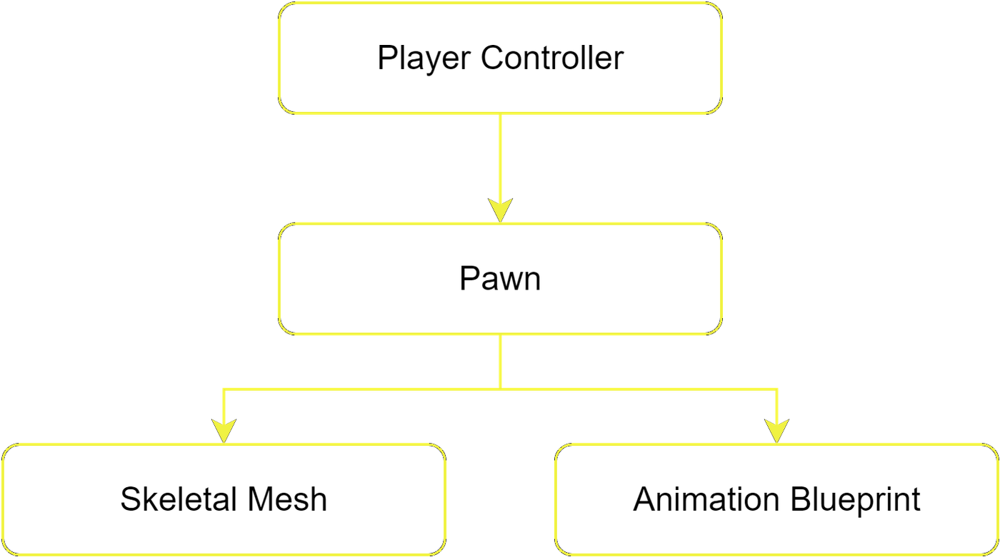
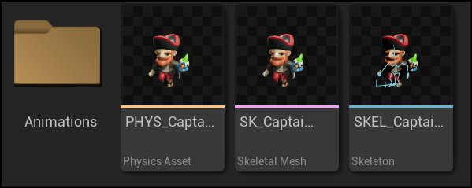
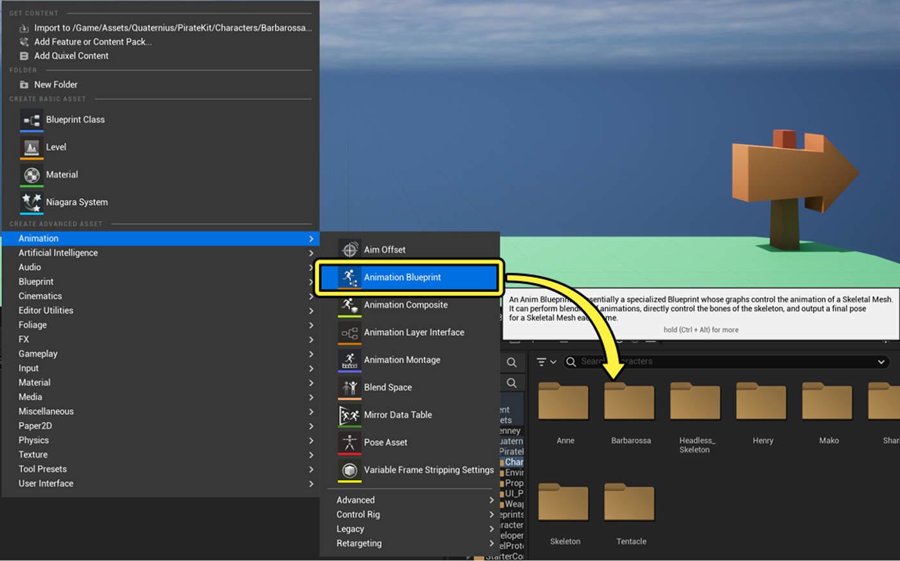
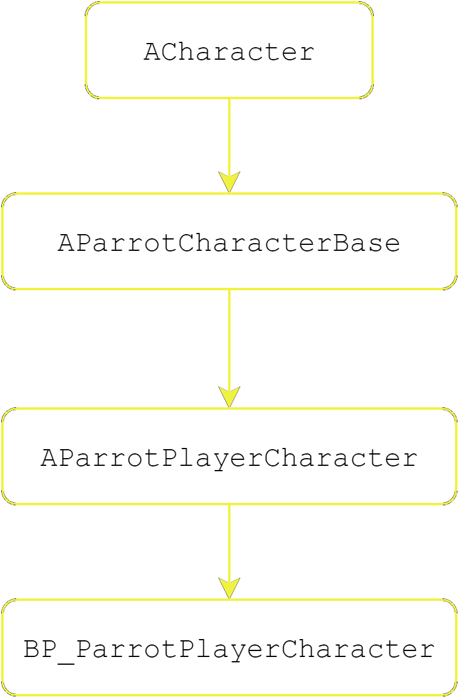
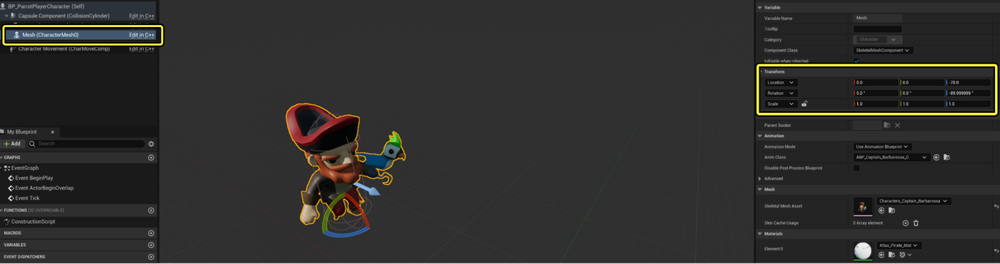
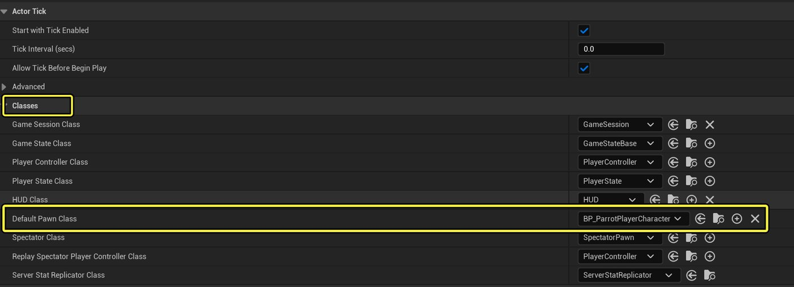
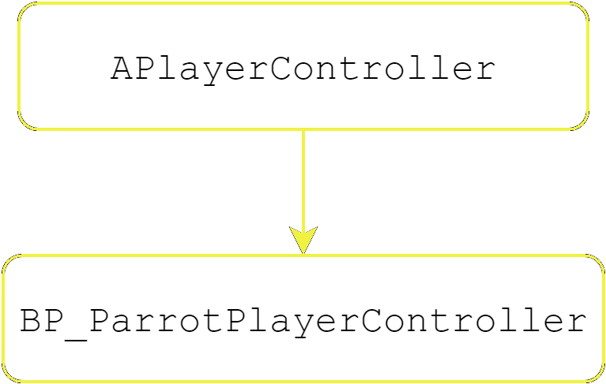
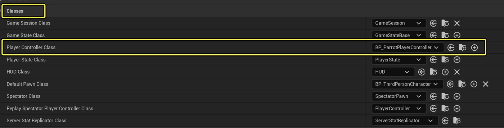

# Parrot中的Pawn、玩家控制器以及角色移动

> 路径：虚幻引擎5.7文档 / 入门指南 / 为Unity开发者准备的虚幻引擎指南 / Parrot游戏示例 / Parrot中的Pawn、玩家控制器以及角色移动

> 原始页面：https://dev.epicgames.com/documentation/unreal-engine/parrot-pawn-player-controller-and-character-movement-in-unreal-engine

## 虚幻引擎中角色的构成要素有哪些？

如**游戏模式**/**游戏状态**小节所述，[虚幻引擎Gameplay框架](../../../../gameplay-systems/gameplay-framework/index.md)能帮你理解角色在虚幻引擎中的工作原理。 从概念上讲，玩家由Pawn和控制器（controller）组成，Pawn代表了玩家在游戏世界中的物理存在，而控制器决定了玩家的行为。 这种解耦关系对AI和网络复制都非常有用。 作为参考，其层级结构如下所示：

让我们从导入资产开始，然后是创建Pawn，接着处理玩家控制器。 在Parrot中，玩家控制的主角是巴巴罗萨船长（Captain Barbarossa）。访问Quaternius网站即可获取[Quaternius的海盗套件（Pirate Kit）](https://quaternius.com/packs/piratekit.html)。

## 导入美术资产

请用你所选的3D建模工具，将网格体/动画导出为虚幻引擎兼容的格式。 在本例中，开发者使用的是 `.fbx` 格式。 巴巴罗萨的资产位于`Content/Assets/Quaternius/PirateKit/Characters/Barbarossa`下。 要导入`.fbx`文件，请右键点击上下文菜单，或将其拖放到内容浏览器中。 这时你会看到一个`.fbx`导入设置窗口。 请选择合适的导入选项。 在本实例中，请确保不选择现有骨架，并勾选**导入动画（import animations）**。 此外，你还必须新建一份可供网格体索引的图集材质。 海盗套件的所有资产均可重复使用该材质。 现在你的`.fbx.`文件中应该包含了这3个文件和所有的动画。

确切地说，**动画序列**文件应位于**Animations**文件夹下，与其他3个文件相邻：

## 骨架、骨架网格体和物理资产

骨架（Skeleton）是[骨架网格体（Skeletal Mesh）](../../../../working-with-content/skeletal-mesh-assets/index.md)中用于定义骨骼（有时也被称为关节）的层级结构。 这些骨骼应匹配你所用的3D建模工具中的绑定。 只要兼容绑定，你就可以在骨架网格体之间重复使用骨架。 你还会发现一份被创建的[物理资产](../../../../gameplay-systems/physics/physics-asset-editor/index.md)。 物理资产可定义骨架网格体所用的物理和碰撞。 它们包含了用于模拟的刚体和约束。 每份骨架网格体只能拥有一份物理资产，而且你可以按条件打开或关闭物理资产。 你可以在导入时调整物理资产，也可以用骨架网格体新建物理资产。

## 动画蓝图

你现在已经拥有了可用的骨架网格体，可以开始用[动画蓝图](../../../../animating-characters-and-objects/skeletal-mesh-animation-system/animation-blueprints/index.md)为其制作动画了。 动画蓝图就类似于Unity的**Mecanim动画系统（Mecanim Animation System）**。 **动画蓝图**的**动画图表（Animation Graph）**看起来相似，功能也类似。 这两套系统都拥有条件逻辑流，可以将动画状态过渡为最终的输出姿势。 请转到你的文件夹，用上下文菜单新建一份动画蓝图，并选择你的骨架。 请将该动画蓝图命名为`ABP_Captain_Barbarossa`，其目录为****内容/蓝图/玩家（Content/Blueprints/Player）****。

在**蓝图查看器（Blueprint Inspector）**的左侧，你会看到两张图表：**事件图表（Event Graph）**和**动画图表（Animation Graph）**。 动画图表是控制最终输出姿势的状态机。 而事件图表则负责让你定义动画相关的逻辑。 Unity需要向Mecanim组件传递数据，而动画蓝图则与之不同，它可以根据给定的事件拉取所需的数据。 例如，你可能需要查询角色的速度，并根据该速度值来驱动动画。 要完成此操作，一种简便的方法是使用事件图表中的**Event Blueprint Initialize Animation**节点以及**Get the Owning Actor**节点，并将其运动组件缓存到变量中。 这样一来，在`BlueprintThreadSafeUpdateAnimation`的每一帧调用中，你都可以直接从运动组件中查询速度。 事件图表和动画图表之间还可以共享变量。

配置完成的巴巴罗萨动画蓝图值得你在之后花时间深入探索。 双击节点后，你就可以看到状态机、状态和状态规则为最终输出姿势而进行的配置。 动画蓝图还提供了序列播放器和混合空间的使用示例。 同样地，事件图表也会展示角色数据是如何驱动动画的。随着本文的深入，这种关系将变得愈发清晰。

## Pawn

现在你已经得到了一个可动的骨架网格体，可以开始创建游戏模式将使用的[Pawn](../../../../gameplay-systems/gameplay-framework/pawn/index.md)了。 Parrot的开发者选择以虚幻引擎的默认 [角色（Character）](../../../../gameplay-systems/gameplay-framework/pawn/characters/index.md) 类为基础进行创建。角色类是默认的C++类Pawn的子类。 角色类中存在一个**角色移动（Character Movement）**组件，该组件对该游戏非常有用，也是一个可供编译的类。

玩家和敌人的Pawn存在部分共享的功能，如生命值、被击中和死亡等。 通过创建一个继承自`ACharacter`的C++类`AParrotCharacterBase`即可共享这些功能。 该类为后续编译提供了良好的基础，因为敌方Pawn和玩家Pawn在行为上存在差异。

接下来，创建一个C++类`AParrotPlayerCharacter`来处理玩家专有的逻辑。 最后，你需要创建一个蓝图来处理角色的视觉表示。 Parrot的蓝图是**内容/蓝图/玩家（Content/Blueprints/Player）**目录下的`BP_ParrotPlayerCharacter`。 具体继承层级如下所示：

打开`BP_ParrotPlayerCharacter`后，你应该在编辑器窗口左边的组件查看器下方看到一些组件。 你可以在**网格体组件（Mesh Component）**中设置**骨架网格体资产**，并在**动画类（Anim Class）**设置动画蓝图。 如果网格体的位置不正确，可以调整其变换值，并使其对齐你的胶囊体组件。 具体应如下所示：

接下来，你可以为游戏模式资产中的蓝图指定默认的Pawn类。

至此，你就得到了一份能在游戏中使用的可动Pawn！

## 玩家控制器

有了可用的Pawn后，你就可以创建玩家控制器了。 玩家控制器本质上代表了人类玩家的意愿。 制作游戏时，你需要考虑在何处定义输入事件。 对于那些Pawn不会变化的简单游戏而言，Pawn就能用来定义输入事件。 但当游戏行为变得复杂时，玩家控制器则是更好的选择。 Pawn是瞬时的，可以被玩家控制器占有或解除占有。 Pawn可以被生成或销毁，而玩家控制器在整个游戏中都持久存在。

玩家控制器中不需要C++逻辑，因此你只需创建一张蓝图就能完成所需的工作。 `BP_ParrotPlayerController`位于**内容/蓝图/玩家（Content/Blueprints/Player）**目录下。 具体继承层级如下所示：

请注意，该蓝图中存在一些输入事件节点，这些节点会导向一些基本的游戏逻辑。 这些输入事件分别与**增强输入（Enhanced Input）**相关。 如需详细了解其配置信息，请参阅 [增强输入](../enhanced-input-in-parrot/index.md) 文档。 在开始游戏（Begin Play）时缓存Parrot玩家角色Pawn后，随后我们就可以用它来调用基本的移动函数。 比如**Add Movement Input**、**Jump**和**StopJump**。

现在该测试了！ 转到游戏模式蓝图，设置新的玩家控制器类，然后验证能否在游戏中使用该控制器：

打开关卡编辑器中的此下拉菜单，检查是否选择了正确的游戏模式：

> 图片已省略：图片显示项目选择了正确的游戏模式。

最后，请确保地图中有一个`PlayerStart` Actor和一个可以查看的摄像机。 点击播放按钮后，你应该就能看到角色在移动并播放动画：

> 动图已省略：巴巴罗萨船长角色在世界中移动的短片。

## Parrot角色移动组件

`ACharacter`基类内置了许多强大的功能。 `UCharacterMovement`角色组件就是一个很好的例子。 该角色移动组件可处理角色在世界中移动的所有逻辑。 它支持行走、奔跑、坠落、游泳、飞行和自定义移动模式。 它非常值得你去深入探索，以了解基本的角色移动工作原理，并体会Actor组件的强大功能。

对于Parrot游戏项目而言，基础的角色移动组件并没有为开发者提供他们所期望的那种开箱即用的游戏感觉。 不过，它确实提供了一个坚实的基础。 C++类`UParrotCharacterMovementComponent`派生自`UCharacterMovementComponent`。 然后，我们可以在`BP_ParrotPlayerCharacter`的CDO移动组件上设置移动组件，如下所示：

> 图片已省略：Parrot角色移动组件被选为组件类的图像。

但Parrot移动组件究竟能做些什么呢？ 从本质上讲，该组件重载了基础移动组件中与跳跃相关的函数，从而让你能定义一种"平台跳跃游戏风格"的跳跃动作。 凭借一些可调整的值，你就可以在发生跳跃时修改玩家角色的重力比例和跳跃速度，从而在固定时间内达到顶点高度。 到达顶点后，你就可以对其施加下坠的重力比例。 如果玩家提前释放跳跃输入，则可以应用一个乘数来增加重力。

这样的跳跃更符合你期望在平台跳跃游戏中看到的那种"感觉"，而不是单纯在Z轴上施加冲量。

将繁重的工作交给基本角色移动组件后，你只就可以将Parrot移动组件的逻辑集中在跳跃上。 你还可以关注移动组件的`BP_ParrotPlayerCharacter`查看器中的值，从而在全局上理解移动组件的各个部分是如何协同工作的。 你可以扩展移动逻辑以适应不同的用例。
