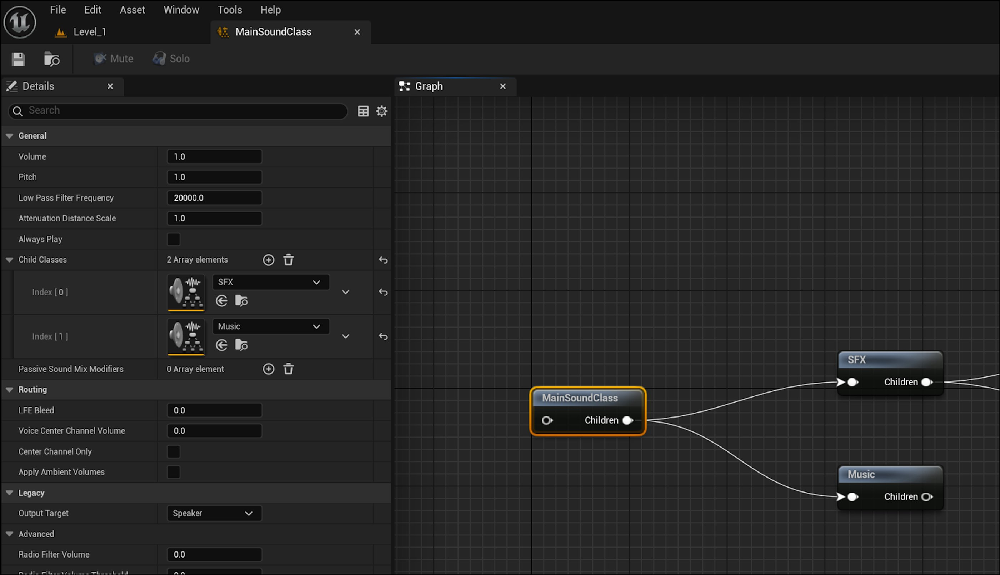
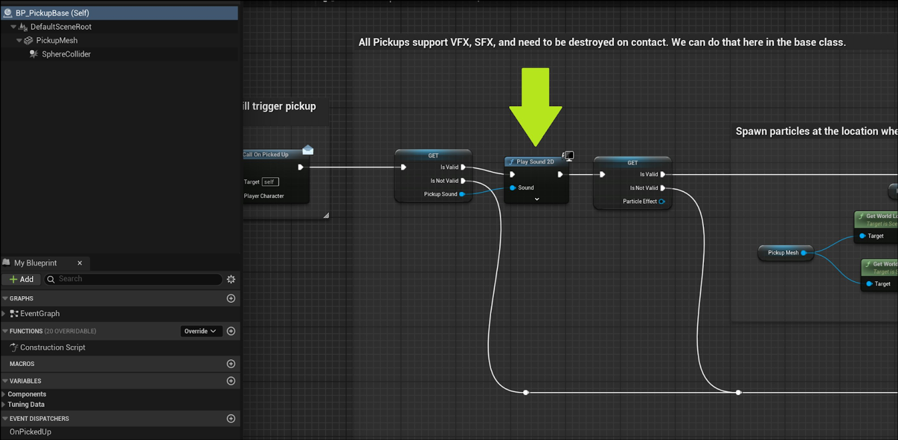
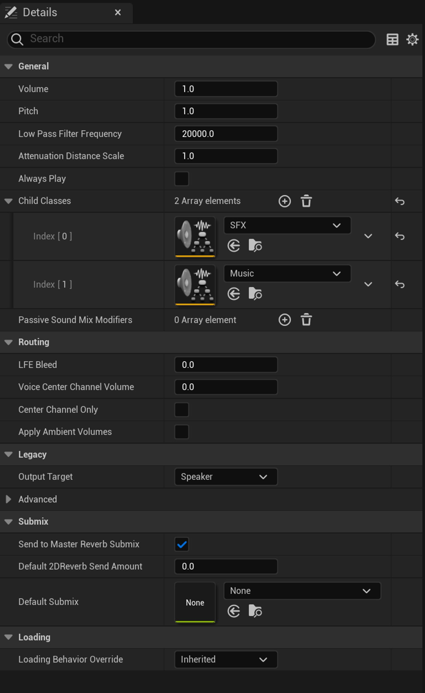
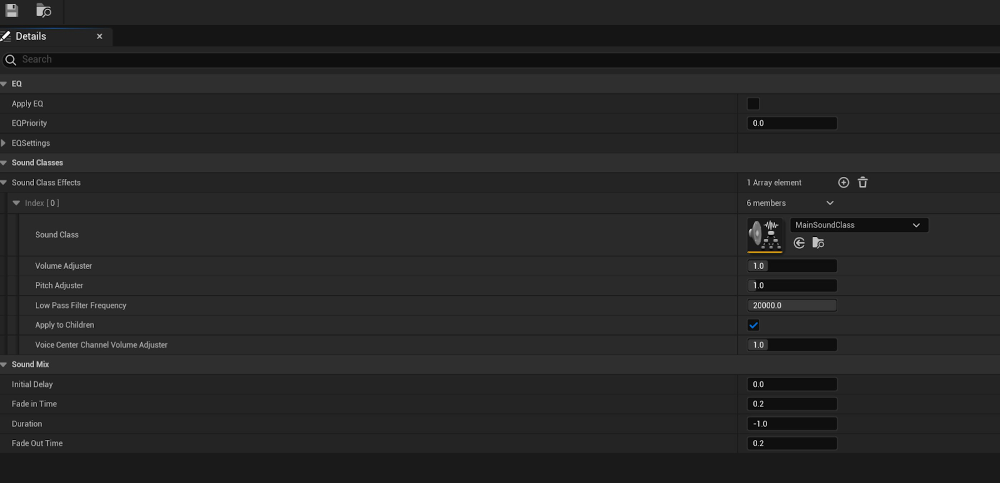
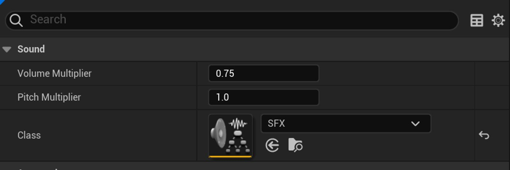
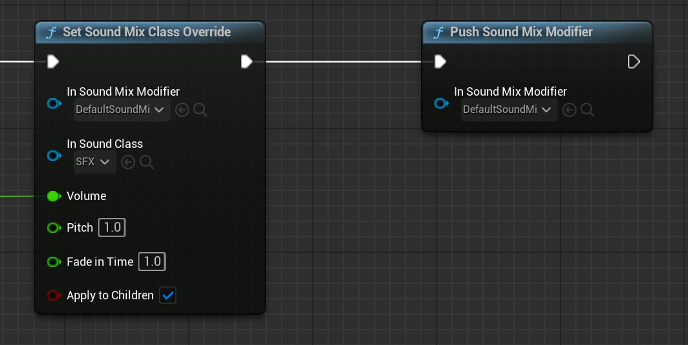
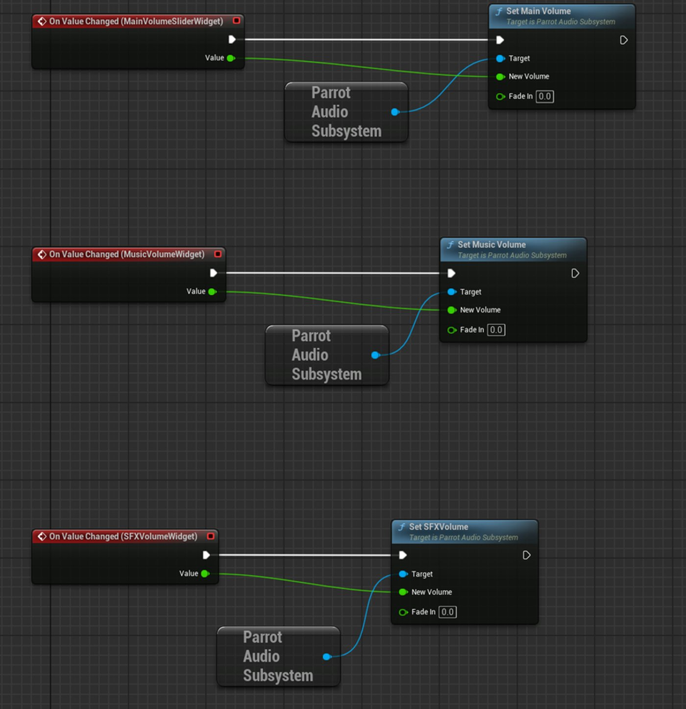
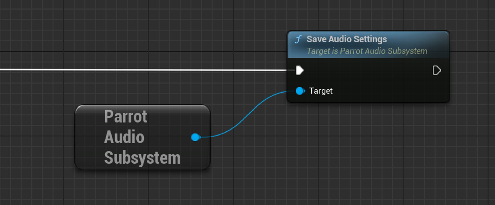

# Parrot中的音频引擎实现方案

> 路径：虚幻引擎5.7文档 / 入门指南 / 为Unity开发者准备的虚幻引擎指南 / Parrot游戏示例 / Parrot中的音频引擎实现方案

> 原始页面：https://dev.epicgames.com/documentation/unreal-engine/unreal-engine-audio-implementation-in-parrot

虚幻引擎5的音频功能可以满足具有各种音频需求的项目。 要导入音频，请找到内容文件夹，点击**导入（Import）**按钮，或使用操作系统自带的资源管理器找到该文件夹。 然后引擎会用你的音频文件创建一份 `.uasset` 文件。 虚幻引擎支持`.wav`、`.ogg`、`.flac`、`.aif`、`.opus`、以及`.mp3`格式的文件。 支持16位或24位的文件位深以及任意采样率。 虚幻引擎内部会将导入的音频文件存储为16位的未压缩`.wav`格式。

如需详细了解虚幻引擎中的音频引擎，请参阅以下文档：

- [音频引擎概述](../../../../working-with-audio/audio/audio-engine-overview/index.md)
- [导入音频文件](../../../../working-with-audio/sound-source/sound-waves/importing-audio-files/index.md)
- [虚幻引擎5中的音频系统](../../../../working-with-audio/audio/audio/index.md)

虚幻引擎将Sound Cue用作在运行时播放声音的对象。 Sound Cue会从一组代表相同概念的音频文件中进行选择。 例如，你可能有一个针对"风"的Sound Cue。在运行时，该Sound Cue会从多个代表风的音频文件中选择要播放的文件。 Parrot中的水花Sound Cue就是一个例子，见`Content/Sound/SFX/WaterSplash/CUE_WaterSplashSound`

声音（Sound）类是音频引擎所用的资产类型，用于将多个声音组合在一起，然后同时更改所有相关声波的参数。 Parrot使用了一个**MainSoundClass**，它可混合**Music**节点和**SFX**节点。

你可以为音效类的混合应用音量阈值，并且在播放音效类中的声音时自动应用该阈值。

## Parrot专用的实现方案

Parrot所用的大部分声音都是包含单个声音的Sound Cue。 音量和音高针对Sound Cue单独设定，而整体音量则由默认音效类和混音设置控制。 为了简化音乐的设置，Parrot使用了自定义的音频子系统。

## 拾取物示例

拾取物是简单Sound Cue的例子，这种音效在播放一次后就会被销毁。 拾取物使用了来自于[opengameart.org](http://opengameart.org/)的硬币音效。 导入的源资产位于`Content/Assets/OpenGameArt/8bitCoinSounds`目录下。 针对各个文件而创建的音效则位于`Content/Sound/SFX/Pickups`目录下。 在拾取事件初始化时，系统会使用**BP_PickupBase**中的所需Sound Cue调用 **Play Sound 2D** 函数。

所有拾取物都支持视觉特效（VFX）和音效（SFX），并且需要在接触时销毁。 这可以在BP_PickupBase类中完成。

你可以在此处使用Play Sound 2D节点，因为该声音在世界中无需具有空间相关性。 如果声音需要具有空间相关性，那么你可以使用Play Sound At Location节点作为替代。

## 音乐循环

音乐的工作原理与标准Sound Cue非常相似。 导入声音文件和设置Sound Cue的流程也与设置音效相同。 但这里也存在一些额外步骤：

- 针对导入的声音资产，请确保将虚拟化模式设为**静音时播放（Play When Silent）**。 这对音乐至关重要，因为它让玩家可以遵循音量的设置。 如果没有该设置，那么当静音时，声音将被销毁，即使恢复了音量也将不再播放。
- 在Sound Cue中，点击轨道节点并确保设置**循环播放（Looping）**。

## 声音设置

Parrot中的所有设置都与各种音量相关。

在`Content/Sound/Settings`下存在一个名为**MainSoundClass**的音效类资产。 你可以在 **子类（Child Classes）** 下将音效类设为其他相关的音效类。 默认的子类包括 **音效（SFX）**和**音乐（Music）**。

同一文件夹中还有一份名为**DefaultSoundMix**的资产。 你可以在 **MainSoundClass** 的设置中设定 **音效类效果（Sound Class Effects）**。 请务必启用 **对子项应用（Apply To Children）** 功能。

请务必在所有Sound Cue中将类（Class）设置为正确的类别。 针对拾取物，请使用SFX类。

要在运行时修改混音设置，你可以结合使用**Set Sound Class Mix Override**节点和**Push Sound Mix Modifier**节点。 这将应用你所做的所有更改。

以上是蓝图示例，但在Parrot中，这通常在音频子系统中使用C++完成。

## Parrot音频子系统

本节介绍了音频子系统实现的功能。 如需了解Parrot使用音频子系统的原因，请参阅[Parrot中的子系统](../subsystems-in-parrot/index.md)。

Parrot音频子系统是一个C++类，其名为 `UParrotAudioSubsystem`。 它共享游戏实例的生命周期，因为你可以随时通过主菜单或暂停菜单更改音量设置。 游戏通关时，音频子系统还会监听游戏状态的变化。 你还可以在关卡开始、关卡完成或玩家越界时更改音轨。

**WBP_SettingScreen**展示了音频子系统的运行情况。 我们会使用C++将UMG（虚幻示意图形UI设计器）的滑块值传递到子系统中。 运行时混音器会在这些值发生变化时更新。 **淡入（Fade In）**时间为零，因此音量更改会立即生效。

**Save Audio Settings**节点会保存以上设置。

如需详细了解用序列化保存这些设置的原理，请参阅[Parrot中的序列化](../serialization-in-parrot/index.md)。

Parrot中的音乐几乎完全使用C++编写。 由于Parrot的结构（每张地图都代表一个关卡），因此我们使用了一个`AParrotWorldSettings`类。 你可以用它来设置特定于世界的数据，例如关卡音乐等。 音频子系统会查询世界设置并拉取所需的音轨。 为了在游戏开始后响应游戏状态的变化，请在`WorldBeginPlay`上绑定Parrot游戏的状态。
