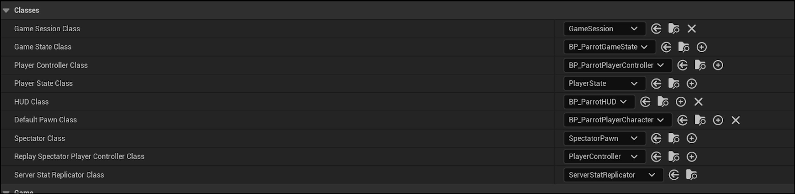
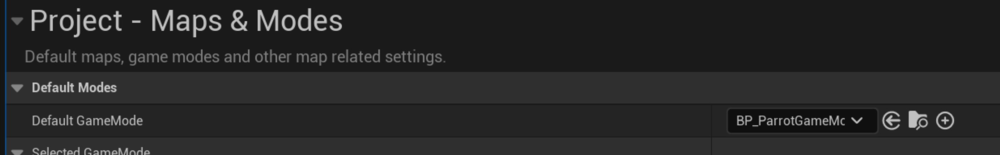
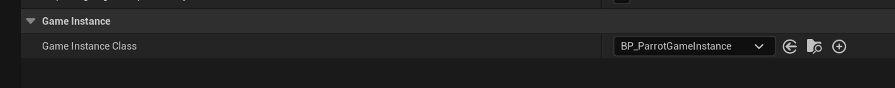
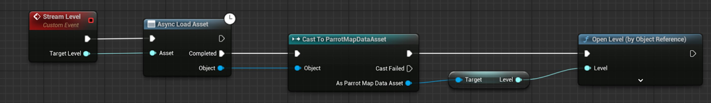

# Parrot中的虚幻引擎Gameplay框架

> 路径：虚幻引擎5.7文档 / 入门指南 / 为Unity开发者准备的虚幻引擎指南 / Parrot游戏示例 / Parrot中的虚幻引擎Gameplay框架

> 原始页面：https://dev.epicgames.com/documentation/unreal-engine/unreal-engine-gameplay-framework-in-parrot

在学习虚幻引擎的基础知识时，你应该了解过[虚幻引擎Gameplay框架](../../../../gameplay-systems/gameplay-framework/index.md)的工作原理。 而在本文档中，我们将介绍如何为Parrot设置游戏模式和游戏状态类。

## 游戏模式

游戏模式负责定义游戏的基本规则，例如玩家数量或玩家加入游戏的方式。 它还为设置有用的游戏类提供了框架，这些类包括游戏状态、玩家控制器、HUD和默认的Pawn类等等。

要为Parrot设置游戏模式，请执行以下步骤：

1. 转到 **内容浏览器（Content Browser）**，点击 **内容（Content）** > **蓝图（Blueprints）** > **游戏（Game）**。
2. 在内容浏览器中点击右键，然后点击**蓝图类（Blueprint Class）**。
3. 将父类设为 **AGameModeBase**。
4. 将该类命名为"BP_ParrotGameMode"。
5. 双击新建的蓝图并查看其定义的核心类。 针对Parrot，你将需要更改部分类：

   - 将 **游戏状态类（Game State Class）** 设为**BP_ParrotGameState**
   - 将**玩家控制器类（Player Controller Class）**设为**BP_ParrotPlayerController**
   - 将**HUD类（HUD Class）**设为**BP_ParrotHUD**
   - 将**默认Pawn类（Default Pawn Class）**设为**BP_ParrotPlayerCharacter**

   
6. 转到**编辑（Edit）** > **项目设置（Project Settings）** > **地图和模式（Maps & Modes）**，将**默认游戏模式（Default GameMode）**设为**BP_ParrotGameMode**。

   

设置好游戏模式后，你就可以设置游戏状态了。

## 游戏状态

游戏状态负责处理当前游戏中发生的事情。 它会管理客户端需要知晓的信息，但这些信息并不与任何特定的玩家绑定。 例如，你可以用游戏状态存储团队得分。

要为Parrot创建游戏状态，请执行以下步骤：

1. 在主编辑器中选择 "工具（Tool） > 新建C++类...（New C++ Class...）"
2. 将父类设为**AGameStateBase**。
3. 将该类命名为"AParrotGameState"。
4. 转到内容浏览器，点击**+添加（+ Add）** > **蓝图类（Blueprint Class）**。
5. 将父类设为**AParrotGameState**。
6. 将该类命名为"BP_ParrotGameState"。
7. 转到你的游戏模式蓝图，将游戏状态字段的值设为 **BP_ParrotGameState**。

## 游戏模式和游戏状态概念回顾

如需详细了解游戏模式和游戏状态，请参阅[游戏模式和游戏状态](../../../../gameplay-systems/gameplay-framework/game-mode-and-game-state/index.md)一文。 当你随着开发过程不断创建新的类时，请记得更新游戏模式和游戏状态。

你也可以逐地图设置游戏模式。 Parrot主菜单所使用的游戏模式就与游戏内关卡所使用的不同。

## 游戏实例

游戏实例是引擎中处理项目专属功能的单个持久类实例。 它在应用程序的整个生命周期中都存在。 它包含了游戏的视口客户端和本地玩家。

与处理游戏模式和状态的模式相同，我们会创建一个基础C++ 类（即UParrotGameInstance）以及一个蓝图类（即BP_ParrotGameInstance）。 要为项目设置游戏实例类，请转到"编辑（Edit） -> 项目设置（Project Settings） -> 地图和模式（Maps & Modes）"

要为Parrot创建游戏实例，请执行以下步骤：

1. 在主编辑器中选择 "工具（Tool） > 新建C++类...（New C++ Class...）"
2. 将父类设为**UGameInstance**。
3. 将该类命名为"UParrotGameInstance"。
4. 转到内容浏览器，点击**+添加（+ Add）** > **蓝图类（Blueprint Class）**。
5. 将父类设为**UParrotGameInstance**。
6. 将该类命名为"BP_ParrotGameInstance"。
7. 转到 编辑（Edit） > 项目设置（Project Settings） > 地图和模式（Maps & Modes），将 游戏实例类（Game Instance Class）设为 BP_ParrotGameInstance。

   

## 关卡流送示例

在Parrot中，不同的地图专属于不同的游戏模式，游戏实例会用`UParrotMapDataAsset`文件向游戏表明应该加载哪张地图。 这些[数据资产](../../../../cpp-programming/programming-in-the-unreal-engine-architecture/data-assets/index.md)包含了指向地图文件的软对象指针。 这些资产依靠游戏实例组织，并可随着玩家推进游戏进程而循环使用。 由于这些资产都依靠游戏实例，因此你可以从任何地方将下一关卡流送进来。 玩家控制器会监听游戏状态的变化，然后按需调用游戏实例。

下方截图所示的蓝图会使用**流送关卡（Stream Level）**节点和**异步加载资产（Async Load Asset）**节点异步加载**ParrotMapDataAsset**的软对象引用。 这时，由于关卡已被加载，因此无需等待同步加载即可调用**打开关卡（Open Level）**节点。 这里还使用了**CommonLoadingScreen**插件。 该加载界面控件会在预加载下一张地图时被调用，并在加载后被移除。

如需详细了解加载界面以及Parrot在此使用异步加载而不是同步加载的原因，请参阅[Parrot的用户界面](../user-interface-for-parrot/index.md)文档。
