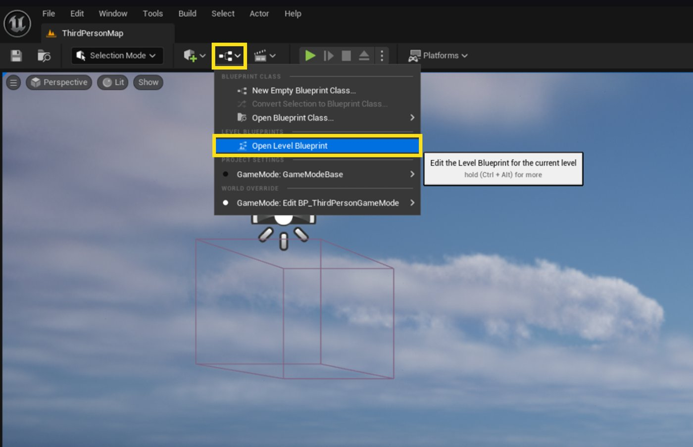

# Parrot中的关卡蓝图

> 路径：虚幻引擎5.7文档 / 入门指南 / 为Unity开发者准备的虚幻引擎指南 / Parrot游戏示例 / Parrot中的关卡蓝图

> 原始页面：https://dev.epicgames.com/documentation/unreal-engine/unreal-engine-level-blueprints-in-parrot

## 关卡编辑器

打开Parrot项目后，你首先会看到[关卡编辑器](https://dev.epicgames.com/documentation/unreal-engine/BlueprintAPI/LevelEditor?application_version=5.6)。 项目会默认打开主菜单地图。 你可以使用默认的编辑器布局，也可以进行自定义。 如需详细了解虚幻引擎的关卡编辑器及其与Unity的异同，请参阅[Unity转虚幻引擎概述](../../unity-to-unreal-engine-overview/index.md)。

## 关卡蓝图

你在虚幻引擎中制作的每个关卡或地图都自带集成蓝图。 集成蓝图会充当整个关卡的事件图表，而你可以凭该图表进行关卡专有的设置、触发关卡事件以及触发过渡到新关卡的流程等。 在关卡蓝图中实现的逻辑将无法被移植到其他地方或关卡中，也无法在其中被复用。 如需了解详情，请参阅 [关卡蓝图](../../../../blueprints-visual-scripting/specialized-blueprint-visual-scripting-node-groups/types-of-blueprints/level-blueprint/index.md)。

Parrot使用关卡蓝图来管理关卡序列。 如需了解详情，请参阅 [Parrot中的序列](../unreal-engine-sequences-in-parrot/index.md)。

## 打开关卡蓝图

转到编辑器视口顶部，点击**世界蓝图**按钮，然后点击**打开关卡蓝图（Open Level Blueprint）**。 这样即可打开当前关卡的关卡蓝图。

