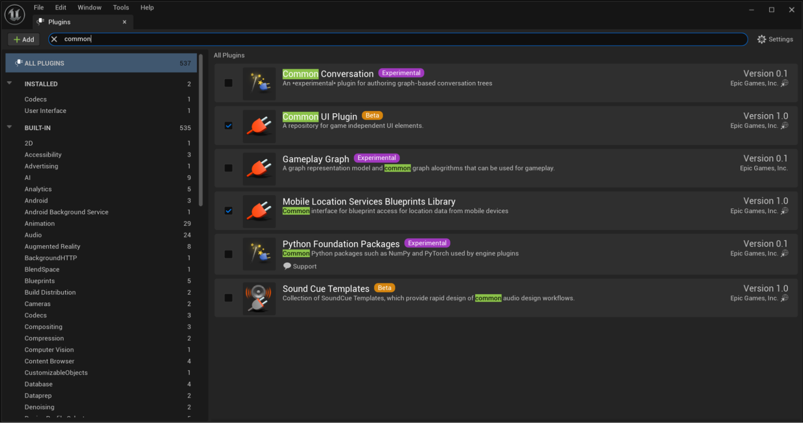
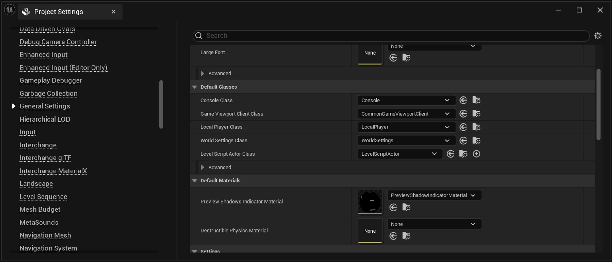
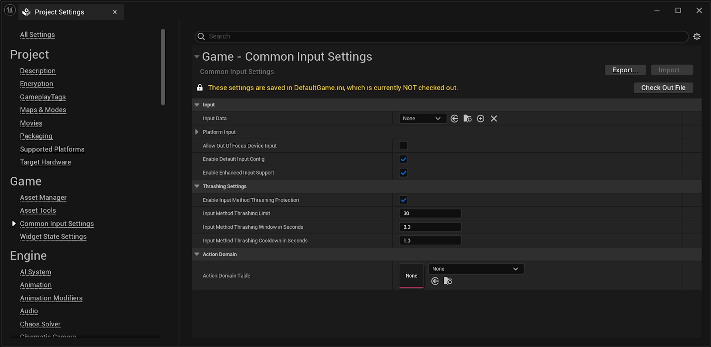
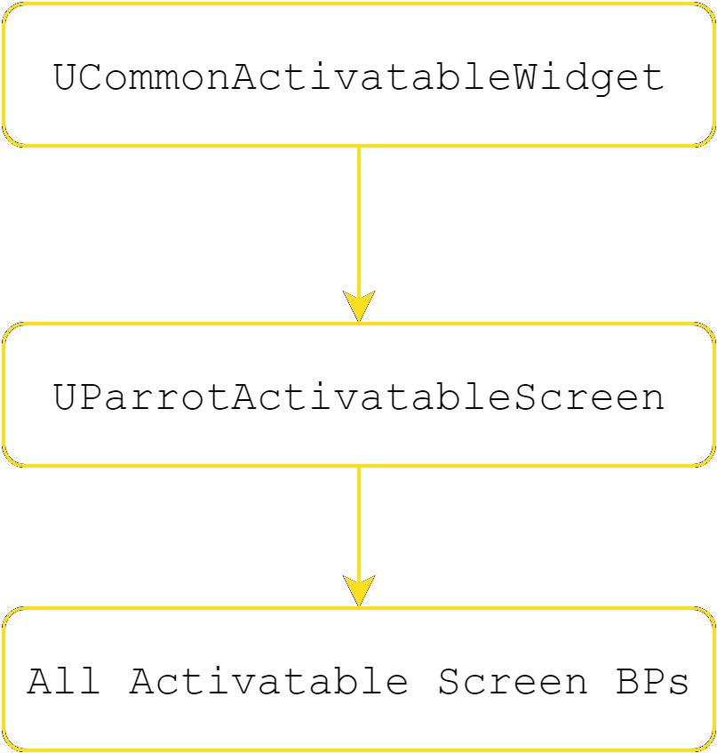
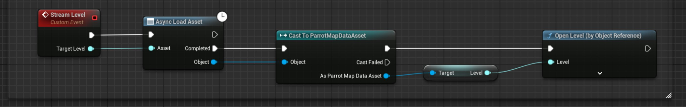
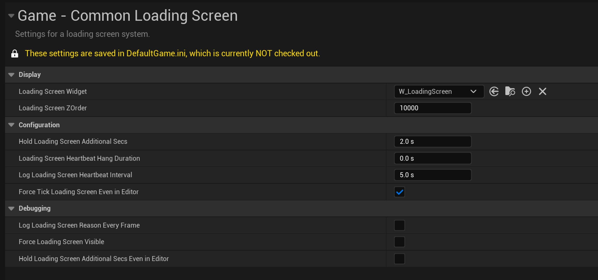

# Parrot的用户界面

> 路径：虚幻引擎5.7文档 / 入门指南 / 为Unity开发者准备的虚幻引擎指南 / Parrot游戏示例 / Parrot的用户界面

> 原始页面：https://dev.epicgames.com/documentation/unreal-engine/user-interface-for-parrot-in-unreal-engine

## UMG

虚幻引擎的UI系统即**虚幻示意图形（Unreal Motion Graphics）**，简称**UMG**。 它与Unity的标准uGUI系统截然不同。 如果你之前用过Unity的UI工具包"UI Builder"，那么你会发现UMG的UI设计器创作工具与其非常相似。 官方文档详细介绍了该设计器，其中[构建你的UI](../../../../user-interfaces/basics-of-user-interface-development/building-your-ui/index.md)和[UMG最佳实践](../../../../user-interfaces/basics-of-user-interface-development/umg-best-practices/index.md)页面对于Unity开发者的过渡而言尤其有用。 UMG的核心是**控件**，它们是一系列预制的函数和层级结构，供你使用并创建用户界面。

## Common UI

**Common UI**是Epic Games开发的一款第一方插件。我们在Parrot中也使用了该插件。 Common UI可为所有控件设置“通用”的样式和操作，而一般情况下，手动逐一设置这些事项通常需要花费大量时间。 检测输入设备的变化并自动切换界面上的输入图标就是一个实际的例子。 手动设置会花费大量时间，但Common UI插件则可以自动完成此过程。 增强输入（Enhanced Input）的按键重映射支持也需要Common UI。如需了解详情，请参阅[增强输入](../../../../gameplay-systems/input/enhanced-input/index.md)文档。

1. 要设置Common UI插件，你需要先在"插件（Plugins）"窗口中将其启用。 找到菜单栏，转到 **编辑（Edit） > 插件（Plugins）**，搜索"Common UI Plugin"，将其启用，然后重新启动编辑器。

   
2. 转到**项目设置（Project Settings） > 一般设置（General Settings）**，并将**游戏视口客户端类（Game Viewport Client Class）** 由“GameViewportClient”更改为“CommonGameViewportClient”。 这让 Common UI控件可以接收来自引擎的输入事件。

   
3. 转到**项目设置（Project Settings） > 通用输入设置（Common Input Settings）**，勾选**启用增强输入支持（Enable Enhanced Input Support）**。 这将让增强输入与CommonInput协同工作。 CommonInput负责处理Common UI控件内部的输入。

   
4. 最后，你需要在项目中启用一些模块，以便在代码中使用。 转到`$ProjectName.Build.cs`文件，对本例而言即`Parrot.Build.cs`文件。 将以下内容添加到**PublicDependencyModuleNames**列表中：

   - `CommonInput`
   - `Common UI`
   - `EnhancedInput`
   - `GameplayTags`
   - `UMG`

## Parrot专用的控件层级

Parrot中第一个要介绍的UI类是`AParrotHUD`。 虚幻引擎中的`HUD`类是为各个本地玩家创建的Actor，用于处理抬头显示。 它包含一张画布和一张可直接绘制的调试画布。 你也可以将其指派为游戏模式配置的一部分。 当你在Parrot中使用此类时，它会充当拥有根控件的Actor，该根控件可用于创建和管理所有其他控件。

该所属控件类的类型为UParrotGameLayout。 UParrotGameLayout是所有其他UI控件的C++基础控件容器。 它内部包含一个“层”的列表，这些层的类型为UCommonActivatableWidgetContainerBase。 你需要显示的所有其他控件都将被推送到其中之一的层上。

我们设置的基本层如下：

- **游戏（Game）**：推送你的UMG HUD控件的层
- **游戏菜单（GameMenu）**：推送在HUD顶部显示的控件的层。
- **菜单（Menu）**：所有界面控件的层，例如暂停界面、设置界面、物品栏界面和其他类似的界面。
- **模态（Modal）**：所有模态弹出窗口的层。

> [!NOTE]
> 每层一次仅可激活一个控件。 虽然你可以将多个不同的界面控件推送到"菜单"层，但只有最后一个控件将处于活动状态并显示。

在Parrot中，我们还为可激活的界面创建了一个类的层级结构，因为这些控件均拥有通用的功能并会被推送到菜单层。 类的层级结构如下：

我们使用该设置制作了Parrot中的所有UI界面。

## 控件样式

准备好Common UI插件和界面设置后，你就可以开始设计控件的样式了。 `Content/UI/Widgets/Common`目录下的`W_ButtonBase`就是一个很好的例子。 它使用了`Content/UI/Styling`目录下的`ButtonStyle_Base`样式数据。 同时使用了Common UI中的`UCommonButtonStyle`类。 有许多选项可供你自定义。 例如根据按钮状态设置声音和笔刷等等。 Common UI中还有许多类似的样式类，具体取决于你所用的控件。 如果你需要进行自定义，最好参考这些样式控件的引擎代码。

## 加载界面

Parrot的加载界面使用了Epic Games的第一方插件**CommonLoadingScreen**。 Epic Games的Lyra示例项目是该插件的另一个实际应用示例。 要理解我们为什么使用该款插件，首先我们需要理解虚幻引擎的关卡加载基础知识。

虚幻引擎中有数种处理关卡加载的方法。 一种简单的方法是调用蓝图中的`Open Level`节点。 该函数可以用字符串或地图的软对象引用来加载地图。 这种方法对简单的地图而言效果很好，但有一点需要注意。 调用此函数时会同步加载地图，而这可能导致明显的卡顿，程度取决于新地图需要加载的数据量。 另一个问题是，添加到视口中的控件将与上一个关卡中存在的玩家控制器绑定。 当关卡过渡时，它会在卸载关卡时被清除掉。

根据地图加载新的游戏模式（例如单人关卡与多人关卡）可能会有所帮助。 但要如何让加载界面持久化，并避免`Open Level`节点可能带来的加载卡顿呢？ 不妨看看`BP_ParrotGameInstance`

将软对象引用异步加载到地图数据资产中。 由于你已经加载了关卡，因此可以直接调用Open Level，而无需担心同步加载的问题。 这时系统也会调用CommonLoadingScreen插件。 该加载界面控件将在"预加载"下一张地图时被调用，并在"加载后"被移除。

异步加载关卡解决了调用Open Level时资产尚未就绪的问题。 正如注释中提到的，此时也已经处理完加载界面的工作。 插件的配置很简单。转到**编辑（Edit） > 项目设置（Project Settings） > 通用加载界面（Common Loading Screen）**即可设置加载界面控件。

同时请注意此处的调试开关。 使用这些编辑器内置的功能进行测试，可以让你更清楚地了解打包版本中加载界面的表现。

至此，游戏在加载关卡时就会使用加载界面了。 你还可以自行深入了解`BP_ParrotGameInstance`，以了解我们是如何设置单人和多人关卡的顺序的。 如需了解游戏状态的设置，请参阅[虚幻引擎Gameplay框架](../unreal-engine-gameplay-framework-in-parrot/index.md)文档。
