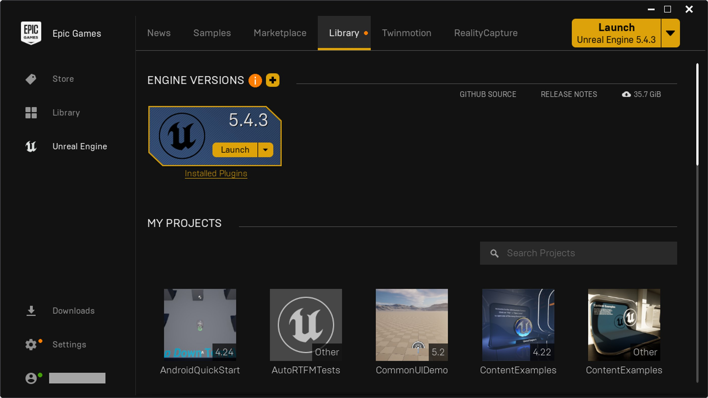
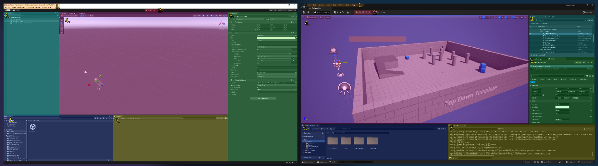
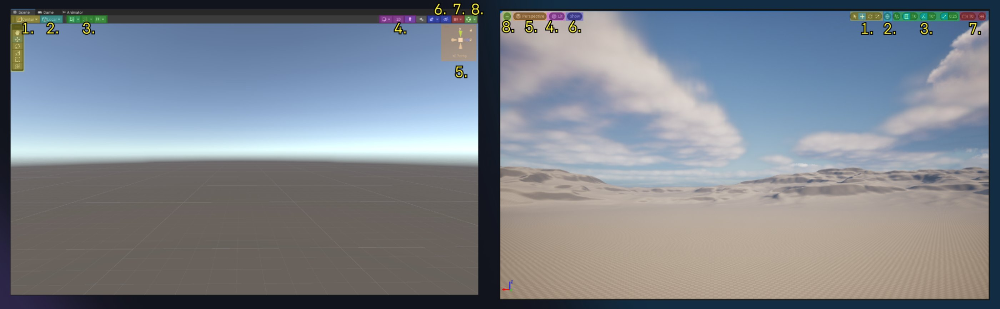
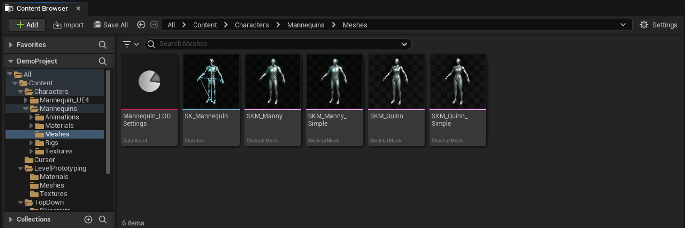
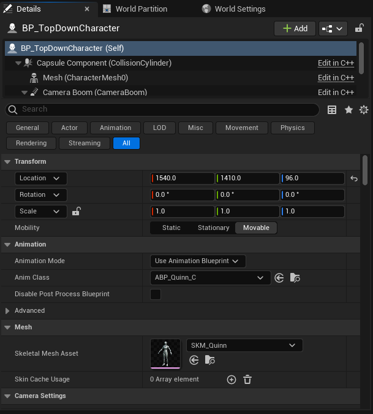
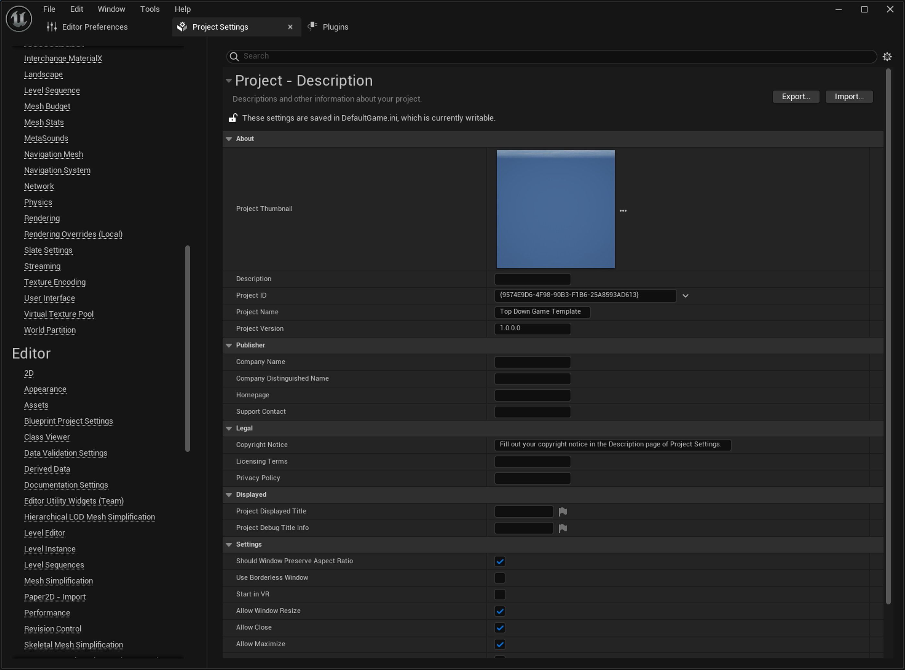
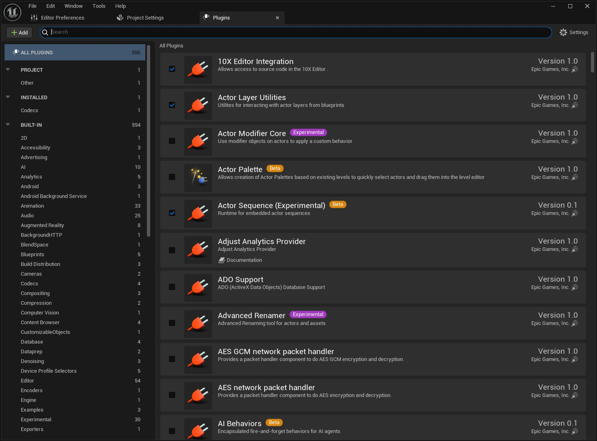
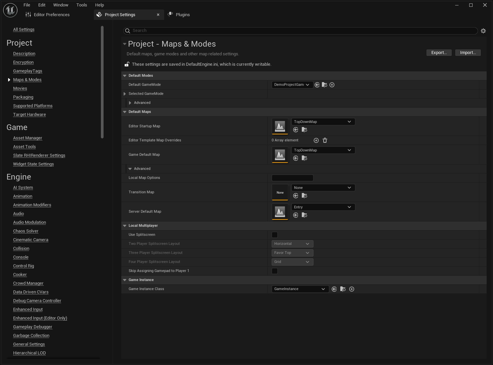

# Unity转虚幻引擎概述

> 路径：虚幻引擎5.7文档 / 入门指南 / 为Unity开发者准备的虚幻引擎指南 / Unity转虚幻引擎概述

> 原始页面：https://dev.epicgames.com/documentation/unreal-engine/unity-to-unreal-engine-overview

如果你要从Unity转到虚幻引擎（UE），那么你可能会面临挑战，因为原来的引擎上有你依赖和熟悉的功能，而现在要转换到另一个引擎。 虽然这两个引擎在很多方面都具有相似的功能，但虚幻引擎的生态系统和组织方式在很多方面都与Unity不同。

本指南介绍了Unity编辑器的基本功能和概念及其在虚幻引擎中的对等功能。 下方各小节论述了以下主题：

- 管理项目和安装。
- 虚幻编辑器导览。
- 管理关卡文件。
- 将Unity GameObject术语和操作转换到虚幻引擎的Actor框架。

## 版本信息

本文撰写时，所用的截图和术语源自以下虚幻引擎和Unity引擎版本：

- 虚幻引擎5.4.3
- Unity 6 (6000.0.2f1)

## Unity Hub/Epic Games启动器

Epic Games的Epic Games启动器相当于Unity的Unity Hub，用于管理引擎安装。 这也是Epic游戏商城的门户和启动程序。 要使用虚幻引擎，请执行以下步骤：

1. 点击启动程序左侧的**虚幻引擎（Unreal Engine）**选项卡。 屏幕顶部会出现一系列新的选项卡。
2. 点击**库（Library）**选项卡可管理虚幻引擎的安装和项目。 你创建的项目和下载的软件包都会出现在此窗口中。

   

   如果你想离线安装，可[从GitHub下载虚幻引擎的源代码](../../install/downloading-source-code/index.md)。

   关于详细的安装信息，请参阅[安装虚幻引擎](../../unreal-engine-for-maya-users/getting-started-animating-and-rendering-in-unre-f32e2a69/installing-and-setting-up-a-project/index.md)。

## Unity编辑器/虚幻编辑器

**虚幻编辑器**是用于编辑虚幻引擎关卡和资产的应用程序。

下方截图并排显示了Unity编辑器和虚幻编辑器。 各个区域采用相同的颜色来表示相同的功能。 每个区域上还添加了名称，以便你了解它们在虚幻引擎语境中的称呼。

| 索引 | Unity | 虚幻 | 说明 |
| --- | --- | --- | --- |
| 1 | 工具栏 | 主菜单 | 主菜单有主要下拉菜单，包括文件（File）、编辑（Edit）、窗口（Window）和帮助（Help）。 |
| 2 | 播放/暂停/步骤功能按钮 | "在编辑器中运行"（Play-In-Editor）功能按钮 | 用于在编辑器内运行游戏会话的功能按钮。 |
| 3 | 层级 | 大纲视图 | 你的游戏世界中的对象列表。 |
| 5 | 场景视图/游戏视图 | 视口 | 显示游戏世界。 |
| 6 | 查看器 | 细节面板 | 显示所选对象的可编辑参数。 |
| 4 | 项目面板 | 内容浏览器 | 用于浏览项目资产的浏览器，包括关卡、纹理、材质、动画、声音等。 |
| 7 | 主机 | 输出日志 | 显示日志并可输入命令的控制台。 |

虚幻编辑器支持自定义布局。 你可以拖放选项卡、将其停靠到主窗口中、更改颜色方案，等等。 参见：

- 详见[自定义虚幻引擎](../../../understanding-the-basics/customizing/index.md)，了解有关编辑器自定义的更多信息。
- 详见[虚幻编辑器界面](../../unreal-engine-for-new-users/unreal-editor-interface/index.md)，了解编辑器布局和使用的更多信息。

### 工具菜单

虚幻编辑器中的主菜单栏提供的选项不同于Unity的关卡编辑器中的工具栏。 下表对两个编辑器的选项进行了比较，并提示了不匹配的等效功能分别在何处。

| Unity | 虚幻 | 说明 |
| --- | --- | --- |
| 文件（File） | 文件（File） | 用于打开和保存关卡与项目。 Unity的**编译选项（Build Options）**菜单位于此处；虚幻引擎则为编译管理提供了一个单独的菜单。 |
| 编辑（Edit） | 编辑（Edit） | 提供复制/粘贴等基本编辑操作，以及打开编辑器和项目设置的选项。 Unity的**编辑**菜单还包含游戏模式控制、图形设置和选择管理工具，虚幻引擎则将这些内容分成了单独的菜单。 有关选择管理的信息，请参阅下方的**选择（Select）**菜单。 虚幻引擎的可延展性设置可通过关卡编辑器工具栏中的**设置（Settings）**下拉菜单访问。 |
| 资产 | - | 用于在项目中创建和管理资产的工具。 在虚幻引擎中，该功能位于**内容浏览器（Content Browser）**中。 |
| GameObject | Actor | 用于创建和管理游戏内对象的工具。 Unity的菜单用于创建新的GameObject，而虚幻引擎的菜单是一个上下文相关的菜单，用于对选定的Actor执行操作。 在虚幻引擎中，在**内容浏览器（Content Browser）**中点击并拖动Actor，或使用**放置Actor（Place Actors）**面板，即可放置Actor。 |
| 组件 | 组件 | 用于在选定的GameObject上创建和管理组件的菜单。 虚幻引擎中还有一个**组件（Component）**下拉菜单，选中一个Actor组件即可显示该菜单。 但该菜单用于编辑组件，而不是创建组件。 要获得相同的功能，请选择Actor并使用**细节（Details）**面板中的组件功能按钮，或打开Actor的蓝图并在**视口（Viewport）**选项卡的**组件（Components）**面板下管理其组件。 另外，如果你想编辑代码，请参阅**工具（Tools）**菜单中的选项。 |
| 服务（Services） | 在线子系统（Online Subsystems） | 用于在文件包管理器（Package Manager）中访问Unity云服务的菜单。 虚幻引擎中与文件包管理器相对应的是位于**编辑（Edit）**菜单中的**插件（Plugins）**窗口，许多在线子系统都以插件形式提供。 |
| - | 工具（Tools） | 可访问各种不同的工具集和菜单，包括调试器、在集成开发环境中创建C++代码的快捷方式、版本控制选项等。 |
| - | 构建（Build） | 提供用于运行具有不同功能的游戏构建的选项，包括照明、几何体和地形等。 |
| - | 选择（Select） | 关卡编辑器中的选择管理工具。 Unity将这些工具放在**编辑（Edit）**菜单中。 包括用于选择不同对象和几何体的选项。 |
| 窗口 | 窗口 | 用于打开常用菜单和面板的快捷方式。 也包括面板布局选项。 |
| 帮助（Help） | 帮助（Help） | 支持和故障排除链接，包括社区资源和文档的链接。 |

### 场景视图/视口

下方截图并排展示了Unity的场景视图与虚幻编辑器的关卡编辑器视口。 各个区域采用相同的颜色来表示相同的功能。 每个区域上还添加了名称，以便你了解它们在虚幻引擎语境中的称呼。

| 索引 | 说明 |
| --- | --- |
| 1 | 变换小工具的功能按钮。 |
| 2 | 本地/世界空间的功能按钮。 |
| 3 | 网格和对齐的功能按钮。 |
| 5 | 光照/着色的功能按钮。 |
| 6 | 透视/正交的功能按钮。 |
| 4 | 对象通道可见性的功能按钮。 |
| 7 | 摄像机设置。 |

### 项目面板/内容浏览器

虚幻引擎的**内容浏览器（Content Browser）**相当于Unity的项目面板（Project Panel）。 你可以在此浏览和创建新游戏资产，也可以点击并拖动资产到视口中。

请参阅[内容浏览器](../../../understanding-the-basics/content-browser/index.md)文档，详细了解内容浏览器及其功能。

### 查看器/细节面板

虚幻引擎的**细节（Details）**面板相当于Unity的查看器（Inspector）。 在世界中选择对象或编辑蓝图时，它会显示所选对象的相关信息。

细节面板支持搜索，有许多筛选选项可减少显示的参数，还可以展示Actor的组件。

更多信息请参阅：

- [虚幻编辑器界面](../../unreal-engine-for-new-users/unreal-editor-interface/index.md)，详细了解虚幻编辑器的面板和选项卡，包括细节面板。
- [细节面板自定义](../../../production-pipeline/scripting-and-automating-the-unreal-editor/programming-tools/details-panel-customizations/index.md)，了解如何为特定的Actor和属性自定义细节面板。

### 项目设置

点击**编辑（Edit）**>**项目设置（Project Settings）**，打开**项目设置**窗口。 该窗口包含适用于你的项目和许多虚幻引擎核心系统的配置选项，包括输入、物理、资产管理和打包选项，以及适用于各个平台和你启用的所有插件的选项。

### 插件

点击**编辑（Edit）**>**插件（Plugins）**，打开插件菜单，你可以在这里启用或禁用项目的许多插件包，包括实验性和测试版功能。

> [!NOTE]
> 只要插件出现在插件菜单中，就说明它与当前版本的虚幻引擎兼容。

## 场景/关卡

虚幻引擎的**关卡（Level）**文件相当于Unity的场景（Scene）文件。 你可以同步或异步地加载和卸载这些文件，这与Unity的场景差不多。 虽然你可以使用打开地图功能强行切换到某个地图，但虚幻引擎的[世界分区](../../../building-virtual-worlds/world-partition/index.md)系统可根据玩家位置自动流送关卡。

### 场景模版/世界设置

Unity使用场景模版来设置多个场景之间的通用对象或框架，而虚幻引擎的关卡具有内置的**世界设置（World Settings）**，可用于重载游戏模式和更改设置。 你可以使用[游戏框架](../../../gameplay-systems/gameplay-framework/gameplay-framework-quick-reference/index.md)类，例如`AGameMode`、`UGameInstance`和`AGameState`等，为你的游戏世界创建独有的额外逻辑。

### 选择你的默认关卡

Unity会将编译设置（Build Settings）中列出的首个场景选作默认场景。 在虚幻引擎中，你可以通过**项目设置（Project Settings）**窗口中的**项目（Projects）>地图和模式（Maps & Modes）**选择默认地图。

## GameObject/Actor

虚幻引擎的**Actor**相当于Unity的GameObject。 Unity使用基于复合的框架来编译GameObject，而虚幻引擎则结合使用了复合和面向对象的方法。

### 预制件/蓝图和C++类

虚幻引擎并非在世界中创建Actor然后将它们保存为预制件，而是在C++或蓝图中创建新的Actor类，然后将它的实例添加到你的世界中。 创建新Actor时，你可以选择以另一个Actor为基础，继承它的所有组件和代码。

如果你更喜欢按Unity的工作流程来编辑GameObject和预制件，你仍然可以在世界中放置一个空Actor，然后为其添加组件。

> 图片已省略：图片展示了给游戏世界中的蓝图Actor添加组件的工作流程。 +添加下拉菜单显示了要添加的组件列表。 用户选择点光源，点光源组件因此出现在世界中的对象上。

然后，你可以点击**编辑蓝图（Edit Blueprint）**按钮，将对象转换为新的蓝图类。

### 放置和浏览Actor

要浏览虚幻引擎的预制和常用Actor库，请使用**放置Actor（Place Actors）**面板。 你可以用搜索栏或类别筛选条件查找触发器、光源、图元和过场动画元素等。 点击并拖动列表中的Actor到视口中，即可将其添加到世界中。

> 图片已省略：放置Actor菜单截图。

你也可以使用主菜单中的**Actor**>**放置Actor（Place Actors）**下拉菜单来放置常用Actor。 在视口中点击右键也可显示该菜单。 你还可以使用内容浏览器来浏览和放置Actor。

### 组件

虚幻引擎的**Actor组件**和**场景组件**相当于Unity的组件。

- **场景组件**具有相对变换，蓝图编辑器和关卡编辑器细节面板中的Actor组件层级均会显示该组件。 场景组件的例子包括网格体、音源、摄像机、粒子系统、光源或其他任何可以在游戏世界中实际存在的东西。
- **Actor组件**只有代码。 它们在游戏世界中没有变换或物理表示。 Actor组件的例子包括移动组件或处理人工智能的组件，如人工智能感应组件、人工智能黑板或人工智能行为树。 许多这种组件都可以与世界互动，但它们不需要在本地有变换，而是依靠其父级Actor来确定世界位置。

下方截图显示了俯视角游戏模板中的俯视角角色。 场景组件以Actor为父级，包括Actor的网格体、摄像机和碰撞。 **角色移动（Character Movement）组件**是没有变换属性的Actor组件，因此显示在单独的列表中。

> 图片已省略：蓝图编辑器中自上而下角色的组件截图。 组件列表中显示了其所有组件。

#### 添加组件

点击细节（Details）面板中的**+添加（+ Add）**按钮，为游戏世界中的Actor添加组件。

> 图片已省略：图片展示了将组件添加到游戏世界中Actor实例的工作流程。 用户点击细节面板中组件列表旁的+添加按钮，然后选择点光源。 因此点光源组件被添加到了Actor的组件列表中。

点击蓝图编辑器**组件（Components）**面板中的**+添加（+ Add）**按钮，即可直接将组件添加到蓝图类中。

> 图片已省略：图片展示了在蓝图编辑器中添加组件的位置。 视口中的+添加下拉菜单显示了大量组件列表。

在C++中，使用`UObject::CreateDefaultSubObject`函数添加组件。 如果组件应默认附加到Actor上，则应在Actor的**构造**函数中添加该组件。

### 在虚幻引擎中为GameObject/Sub-Object添加父级

在Unity中，若要创建具有多个部分的复杂对象，而且这些部分具有相对变换，你需要将GameObject作为子对象附加到另一个GameObject上。

而在虚幻引擎中，要添加子对象，只需将场景组件添加Actor即可。 场景组件可以完成子GameObject在Unity中完成的大部分工作，例如提供碰撞物、粒子效果、音频源或可调节的光源。

> 图片已省略：截图显示了视口中的自上而下角色，它的详细信息位于屏幕右侧。 组件列表显示了其所有组件，视口显示了这些组件与角色的连接方式。

你还可以使用**子Actor组件**将一个Actor整体附加到另一个Actor上，也可以在代码中使用**Attach to Actor**函数在运行时实现该操作。

## Gameplay框架

虚幻引擎的[Gameplay框架](../../../gameplay-systems/gameplay-framework/index.md)是一个类集合，为你提供了打造游戏体验所需的模块化基础。 你可以从中选取适合自己游戏的元素，因为这些类是相互配合、相辅相成的。

## 编译并打包你的项目

虚幻引擎的**平台（Platforms）**下拉菜单与Unity的编译设置（Build Settings）菜单作用类似。

要创建项目的打包构建，请点击**平台（Platforms）**下拉菜单，选中要打包的平台，然后点击**打包项目（Package Project）**。 这将编译、烘培并打包项目中的所有内容。 **快速启动（Quick Launch）**选项可一步将你的构建打包并部署到特定设备上。

> 图片已省略：图片显示了虚幻编辑器中的平台下拉菜单。 Android子菜单已展开，项目打包按钮高亮显示。

你也可以使用**项目启动程序（Project Launcher）**启动预先配置好的构建，或使用**虚幻自动化工具（UAT）**脚本运行无头的命令行构建。

更多信息请参阅：

- [构建操作](../../../sharing-and-releasing-projects/packaging-and-cooking/build-operations-cooking-packaging-deploying-an-ca003a9c/index.md)，了解如何创建构建。
- [烘焙和数据块划分](../../../sharing-and-releasing-projects/packaging-and-cooking/cooking-content-and-creating-chunks/index.md)，了解项目如何打包资产。
