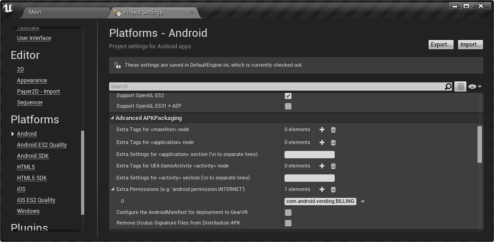
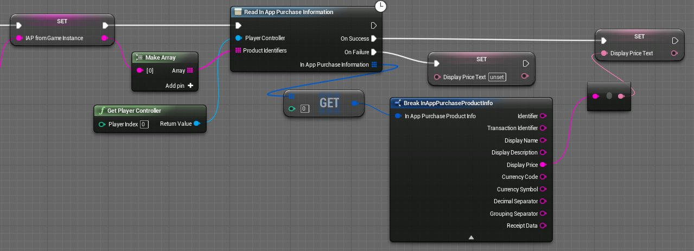
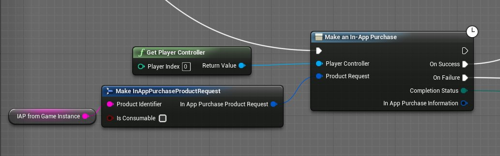

# 使用安卓内购

> 路径：虚幻引擎5.7文档 / 移动端开发 / Android支持 / Android开发指南 / 使用安卓内购

> 原始页面：https://dev.epicgames.com/documentation/unreal-engine/how-to-use-inapp-purchases-in-unreal-engine-projects-on-android

## 配置

1. 在 Google Play 中设置内购：

   > [!NOTE]
   > Google Play 要求 id 全部为小写字母。为便于进行蓝图设置，最好使 iOS 和安卓 ID 相匹配。

   
2. 记录使用的 ID，以及物品是否为消耗品。
3. 如项目为蓝图项目，则可直接开始。如项目为代码项目，尚未设置项目使用在线生态系统，则需要将以下代码块添加到项目的 Build.cs 文件中：

   ```
            if (Target.Platform == UnrealTargetPlatform.Android)         {             PrivateDependencyModuleNames.AddRange(new string[] { "Core", "CoreUObject", "Engine", "OnlineSubsystem" });             DynamicallyLoadedModuleNames.Add("OnlineSubsystemGooglePlay");         }		
   ```
4. 找到 **Project Settings > Platforms > Android** 中的 Advanced APKPackaging 部分。
5. 为 Extra Permissions 添加一个名为"com.android.vending.BILLING"的元素。

   
6. 编辑 [ProjectName]/Config/Android/AndroidEngine.ini:

   ```
            [OnlineSubsystem]         DefaultPlatformService=GooglePlay		         [OnlineSubsystemGooglePlay.Store]         bSupportsInAppPurchasing=True		
   ```

## 读取购买信息



然后您可以使用 **读取应用程序内购买信息（Read In-App Purchase Information）** 蓝图节点（或关联的C++函数调用）阅读应用程序内购买信息。像大多数其他在线子系统函数一样，它将玩家控制器作为输入以及您的产品辨识符数组。注意，下方的进行应用程序内购买（Make In-App Purchase）采用单个辨识符，而读取（Read）可以处理信息数组。此函数返回应用程序内购买（In App Purchase）结构体的数组，且该数组的各个元素均可以经过分析来获取名称、描述、价格和其他数据，以显示在您的UI中或用于您的游戏进程逻辑。

## 完成购买



若要进行应用程序内购买，请使用 **进行应用程序内购买（Make In-App Purchases）** 蓝图节点（或关联的C++函数调用）。它将玩家控制器作为输入以及产品请求（Product Request）结构体。产品请求（Product Request）就是来自iTunes Connect或Google Play Developer主机的产品辨识符（此例中为match3theme_night），以及产品是否是消费品。

**进行应用程序内购买（Make an In-App Purchase）** 节点是潜在的，因此您希望使其依赖于购买成功与否的任何游戏进程行为都应使用那两个执行引脚。它们将仅在收到在线服务返回的响应后执行。此节点还返回购买的完成状态（例如成功（Success）、失败（Failed）、恢复（Restored））和详细的应用程序内购买信息（In App Purchase Information）结构体。

此函数有非潜在版本（将显示蓝图节点，而不显示时钟）。此处的退出执行引脚并不会等待在线服务的响应，因此您通常需要使用潜在版本。

## 测试

如要进行安卓测试，需将打包的 APK 文件上传至 Google Play，并设置正确的测试账户。此外还需要您的自定义密钥库。

## 实用链接

- Administering In-app Billing (Creating products)
- Testing Android
