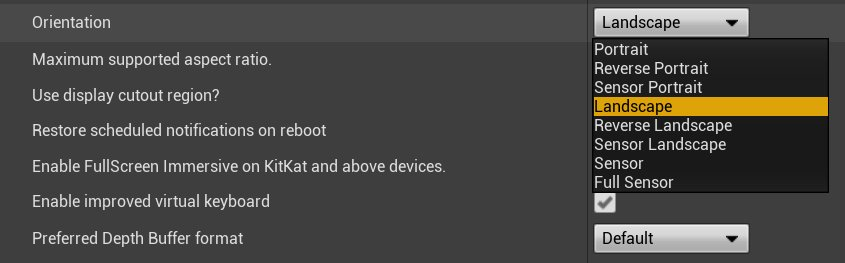

# 设置安卓运行画面

> 路径：虚幻引擎5.7文档 / 移动端开发 / Android支持 / Android开发指南 / 设置安卓运行画面

> 原始页面：https://dev.epicgames.com/documentation/unreal-engine/setting-up-android-launch-screens-in-unreal-engine

选择操作系统：

Windows

macOS

Linux

如需为 **安卓** 项目设置自定义运行画面，可在 **平台（Platforms）/安卓（Android）/运行画面（Launch Images）** 部分下的 **项目设置（Project Settings）** 中寻求支持。 您可设置使用的背景、纵向或横向图片，并设置功能是否已启用/禁用（参考下表中的详细信息）。

*运行图片选项*

| 选项 | 描述 |
| --- | --- |
| **下载背景纵向画面（Download Background Vertical Image）** | 在设备为纵向状态时用作 OBB 下载的背景。 |
| **下载背景横向画面（Download Background Horizontal Image）** | 在设备为横向状态时用作 OBB 下载的背景。 |
| **启动头像（Launch Portrait）** | 用作程序的启动画面，拥有纵向、反转纵向、感应纵向、感应或全感应朝向。 |
| **启动环境（Launch Landscape）** | 用作程序的启用画面，拥有横向、反转横向、感应横向、感应或全感应朝向。 |
| **显示启动画面（Show Launch Image）** | 将运行图片显示为启动画面。启用后，将基于项目的朝向设置包含为项目选择一个或两个运行图片。 |

> [!TIP]
> 可以在项目设置中修改应用程序的朝向设置。只需导航到 **平台（Platforms）/安卓（Android）/APK打包（APK Packaging）** 并点击 **朝向（Orientation）** 下拉菜单，选择应用需要的朝向即可。
>
> 

## 配置运行画面

对项目进行配置，以使用运行图片：

1. 在项目中，从 **文件（File）** 菜单选择 **编辑（Edit）**，然后选择 **项目设置（Project Settings）**。
2. 在 **项目设置（Project Settings）** 中，在屏幕左方的 **平台（Platforms）** 下选择 **安卓（Android）** 显示安卓 app 的项目设置。
3. 向下滚动至 **运行画面（Launch Images）** 部分，勾选 **显示运行画面（Show launch image）** 复选框。
4. 点击每个图片旁边的 **...** 图标打开浏览器，从电脑中选择图片。
5. 选择图片后，便会将其添加到项目中，并在启动画面中显示。

> [!NOTE]
> 在 Engine/Build/Android/Java/res/drawable 文件夹中可找到纵向和横向图片范例（PNG 格式）。
