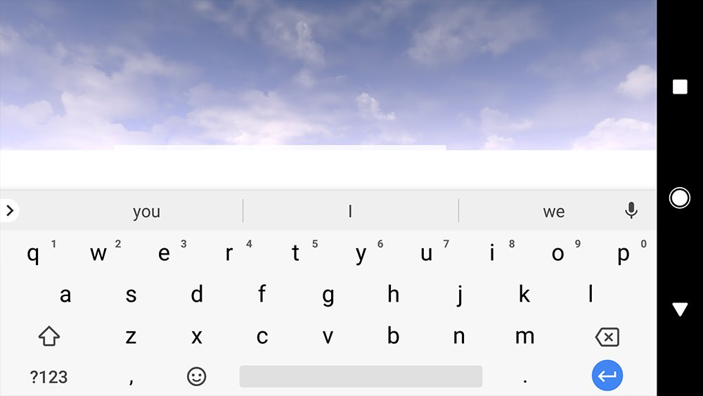
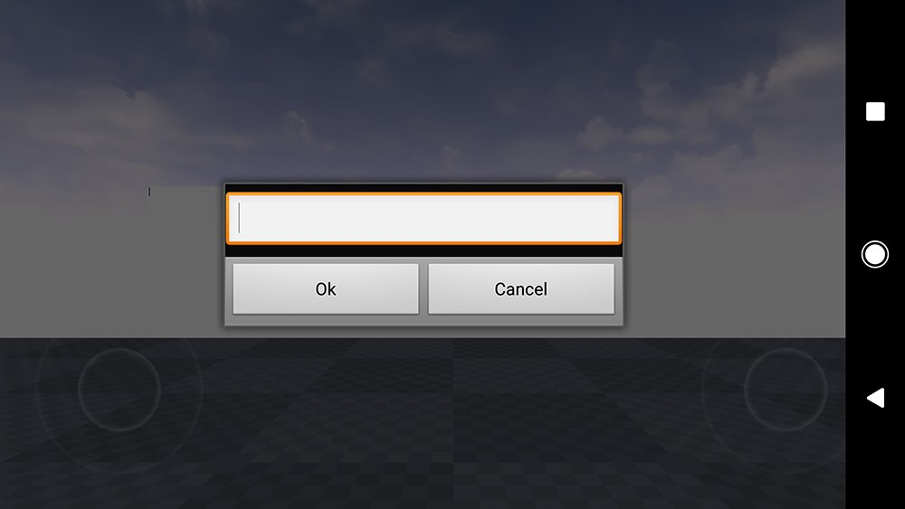
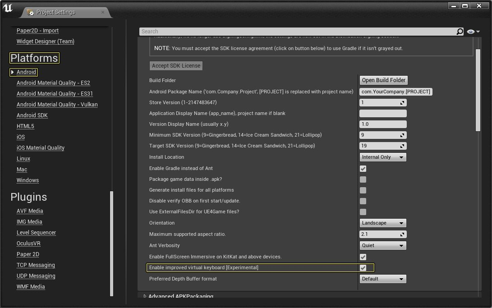
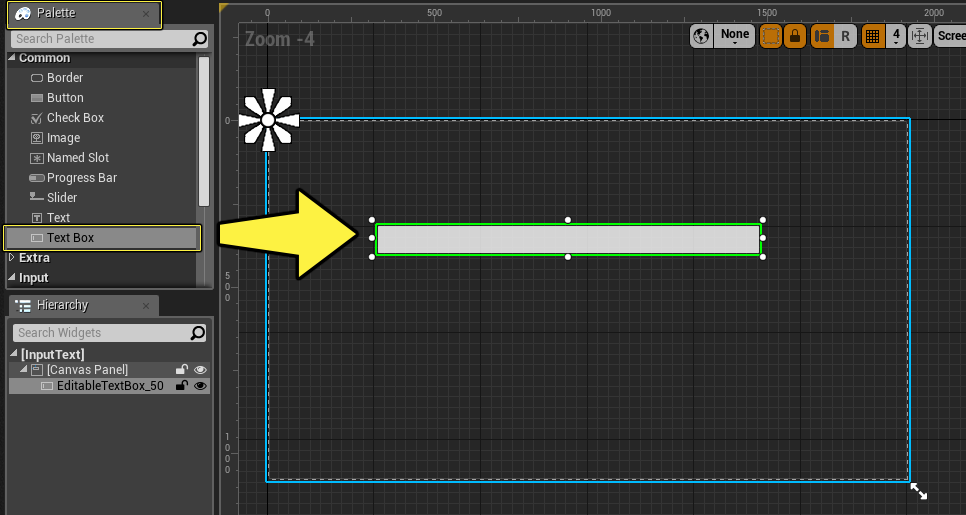
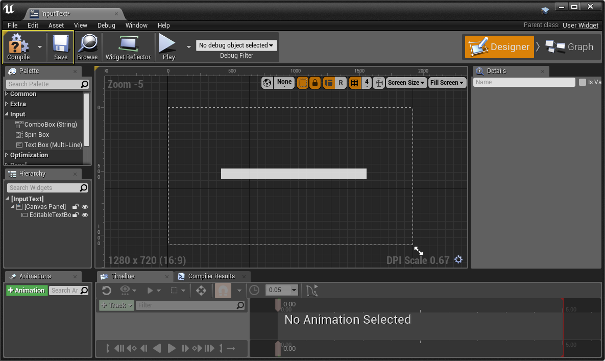
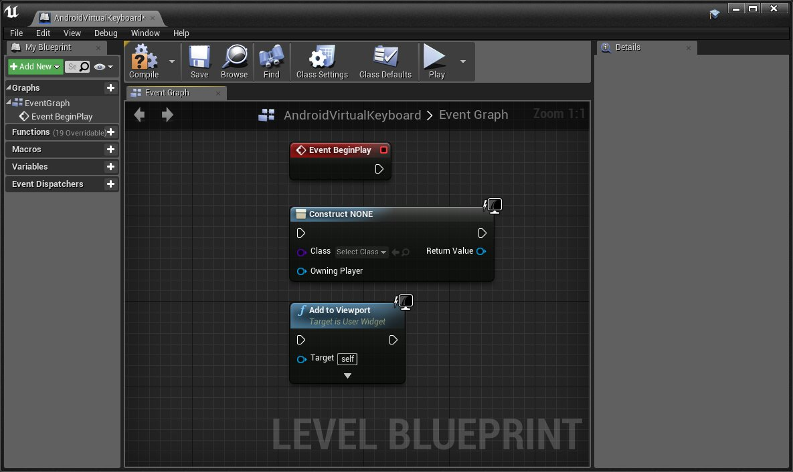
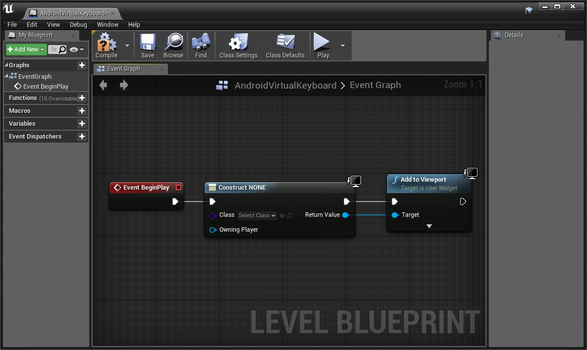
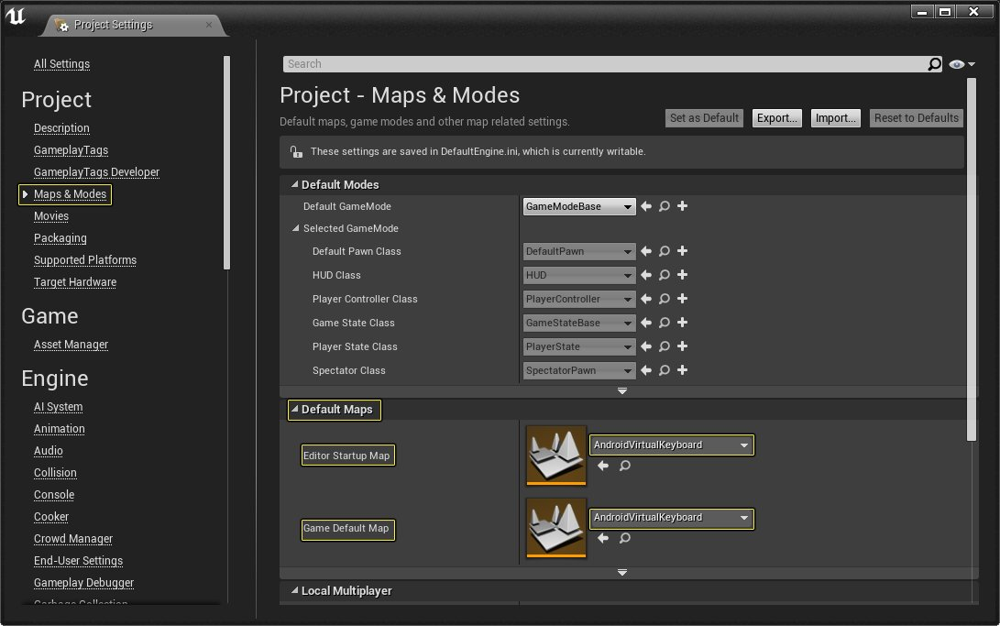

# Android虚拟键盘

> 路径：虚幻引擎5.7文档 / 移动端开发 / Android支持 / Android开发指南 / Android虚拟键盘

> 原始页面：https://dev.epicgames.com/documentation/unreal-engine/setting-up-android-virtual-keyboard-in-unreal-engine-projects

所有基于Android的虚幻引擎项目都支持使用标准弹出对话框输入框或操作系统的虚拟键盘。在下面的文档中，我们将了解如何在UE4项目中设置和调用任一虚拟键盘。

New Keyboard Input

Old Keyboard Input

## 步骤

要在项目中启用虚拟键盘，需要执行以下操作：

1. 在 **主菜单（Main Menu）** 中，转到 **编辑（Edit）**，然后单击 **Project Settings（项目设置）** 选项。
2. 在项目设置（ Project Settings）菜单中，转到 **平台（Platforms）** > **Android** ，在 **APK打包（APKPackaging）** 部分下，找到并单击 **启用改进型虚拟键盘[实验性]（Enable improved virtual keyboard [Experimental]）** 选项旁边的复选框以启用它。

   

   单击显示全图。
3. 右键单击 **内容浏览器（Content Browser）**，然后转到 **用户界面（User Interface）** 并单击 **控件蓝图（Widget Blueprint）** 选项，为此新蓝图提供一个 **输入文本（Input Text）** 的名称。
4. 双击输入文本UMG（Input Text UMG）小组件以打开它，并从 **调色板（Palette）** 中将一个 **文本框（TextBox）** 拖动到UMG图中。

   

   单击显示全图。
5. 将 **文本框（TextBox）** 定位到画布面板的中间位置，然后按下 **编译（Compile）** 和 **保存（Save）** 按钮。

   

   单击显示全图。

   > [!NOTE]
   > 请记住，应用程序负责确保：输入元素可见且不会被遮蔽在虚拟键盘后面。您可以使用提供的 **OnVirtualKeyboardShown** 和 **OnVirtualKeyboardHidden** 事件处理程序来确保UI元素不会遮蔽虚拟键盘。
6. 打开 **关卡蓝图（Level Blueprint）**，并将以下节点添加到事件图表（Event Graph）。

   

   单击显示全图。

   - 事件开始运行（Event Begin Play）
   - 创建控件（Create Widget）
   - 添加视口（Add to Viewport）
7. 将 **事件开始运行（Event Begin Play）** 节点连接到 **创建控件（Create Widget）** 节点，然后将 **创建控件（Create Widget）** 节点连接到 **添加视口（Add to Viewport）** 节点。完成后，**关卡蓝图（Level Blueprint）** 应该如下图所示。

   

   单击显示全图。
8. 接下来，在创建控件蓝图（Create Widget Blueprint）节点的 **类（Class）** 输入中，添加之前创建的 **InputText** 控件蓝图。
9. 保存关卡，同时为它提供一个 **Android虚拟键盘（AndroidVirtualKeyboard）** 名称，然后打开 Project Settings（项目设置）并转到 **图与模式（Maps & Modes）**，在 **默认图（Default Maps）** 中，将 **Android虚拟键盘（AndroidVirtualKeyboard）** 图输入 **编辑器启动图（Editor Startup Map）** 和 **游戏默认图（Game Default Map）** 中。

   

   单击显示全图。
10. 现在，在主菜单中，单击 **启动（Launch）** 旁边的白色小三角形，并从显示的列表中，选择您要部署UE4项目的Android设备。

## 最终结果

项目在Android设备上启动后，按下文本输入框，此时应该可以使用Android系统键盘输入所需的文本，如下面的视频所示。

您也可以使用 **Android新键盘（Android.NewKeyboard）** 控制台变量再结合以下任意一个数字来禁用虚拟键盘。当用户使用的语言需要不同IME（输入法编辑器）时，这样做特别有用。

| 命令名称 | 输入 | 说明 |
| --- | --- | --- |
| **Android.NewKeyboard** | 0 | 使用UE4编辑器中设置的复选框设置。 |
| **Android.NewKeyboard** | 1 | 强制使用新键盘。 |
| **Android.NewKeyboard** | 2 | 强制使用对话框。 |
