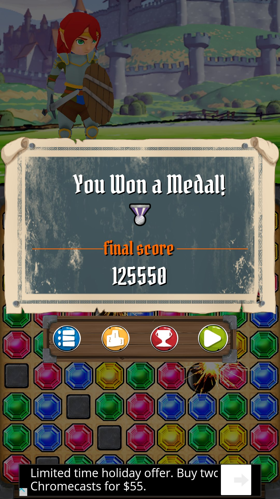
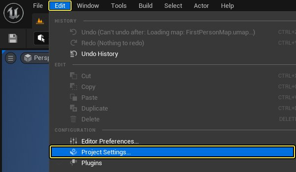
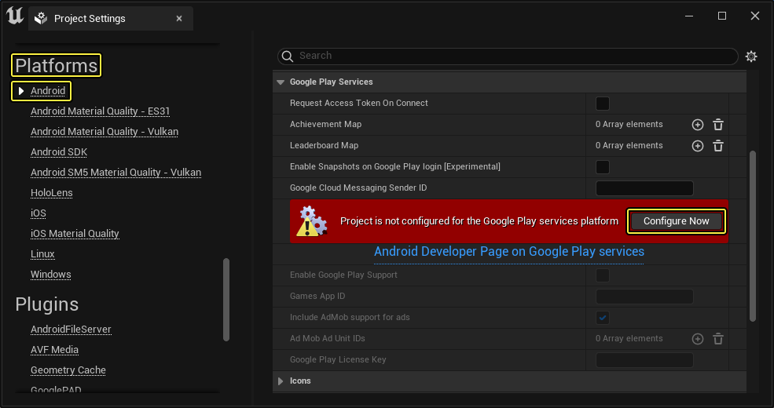
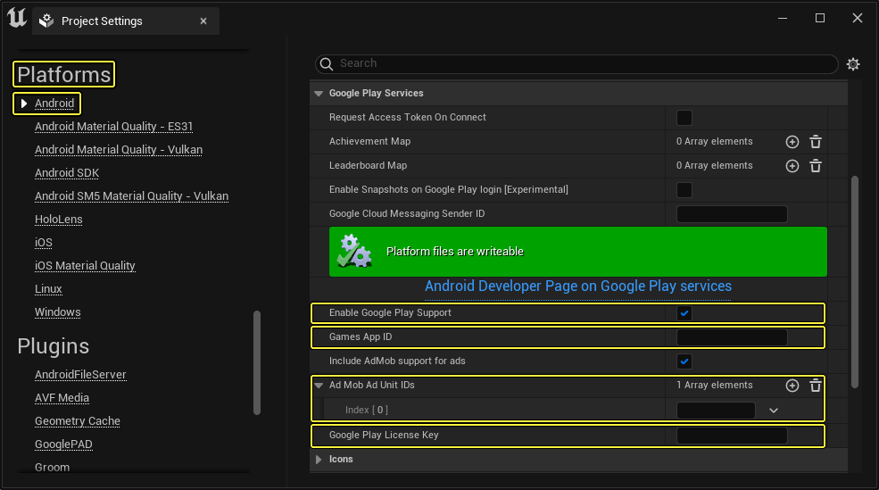
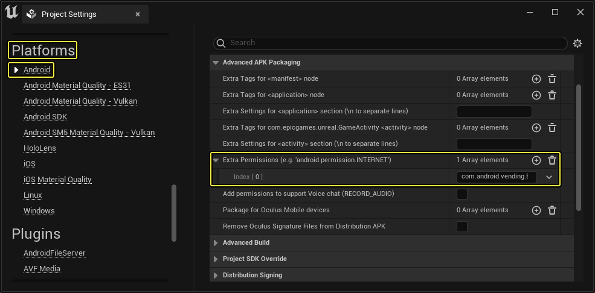
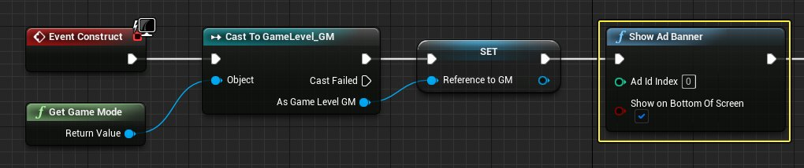
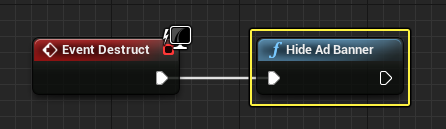

# 在安卓上使用 Ad Mob 游戏内置广告

> 路径：虚幻引擎5.7文档 / 移动端开发 / Android支持 / Android开发指南 / 在安卓上使用 Ad Mob 游戏内置广告

> 原始页面：https://dev.epicgames.com/documentation/unreal-engine/using-ad-mob-for-in-game-ads-on-android-with-unreal-engine



## 配置

配置安卓项目，使用 AdMob 游戏内置广告系统的步骤：

1. 在 **虚幻编辑器** 的 **Edit** 菜单中选择 **Project Settings** 查看项目的配置选项。

   
2. 选择左边的 **Platforms:Android** 标签。找到 **Google Play服务（Google Play Services）** 分段并为Google Play服务平台配置项目。

   

   点击查看大图
3. 勾选 **Google Play Services** 部分下的 **Enable Google Play Support** 选项。
4. 在 **Games App ID** 栏位中输入游戏的 App ID。
5. 为每个需要关联的 AdMob ID 的 **Ad Mob Ad Unit Ids** 阵列添加元素，并在文本框中输入 ID。
6. 在 **Google Play License Key** 栏位中输入 Google Play 授权码。

   

   点击查看大图

   这些数值在应用程序和游戏服务的 Google Play Developer Console 中（或在 Google Ad Mob 界面中）可用。
7. 最后需要将 **com.android.vending.BILLING** 添加到 **Android** 设置 **Advanced APKPackaging** 部分中的 **Extra Permissions** 阵列：

   

   点击查看大图

### C++ 项目

如项目为 C++ 项目，则需要为 Target.cs 文件添加合适的模块，例如：

```
		...		if (Target.Platform == UnrealTargetPlatform.Android)		{			ExtraModuleNames.Add("OnlineSubsystemGooglePlay");			ExtraModuleNames.Add("OnlineSubsystem");			ExtraModuleNames.Add("AndroidAdvertising");		} 
```

查看 Unreal Match 3 Target.cs 文件（`Match3\Source\Match3.Target.cs`），了解它如何融入整个文件。

## 展示广告横幅

**Show Ad Banner** 函数用于在游戏中显示广告横幅。需要展示广告时（如显示主菜单时）在逻辑中进行调用即可。

**在蓝图中：**

下例取自 Unreal Match 3 示例游戏 - 使用控件蓝图的 **Construct** 事件在胜利/失败画面出现时展示广告横幅。



如需了解节点的详细内容，请查阅 [展示广告横幅](https://docs.unrealengine.com/BlueprintAPI/Utilities/Platform/ShowAdBanner) 文档。

## 隐藏广告横幅

**Hide Ad Banner** 函数可隐藏广告横幅。无需显示广告时（如退出主菜单时）进行调用即可。

**在蓝图中：**

下例取自 Unreal Match 3 示例游戏 - 使用控件蓝图的 **Destruct** 事件在胜利/失败画面出现时隐藏广告横幅。



如需了解节点的详细内容，请查阅 [隐藏广告横幅](https://docs.unrealengine.com/BlueprintAPI/Utilities/Platform/HideAdBanner) 文档。
