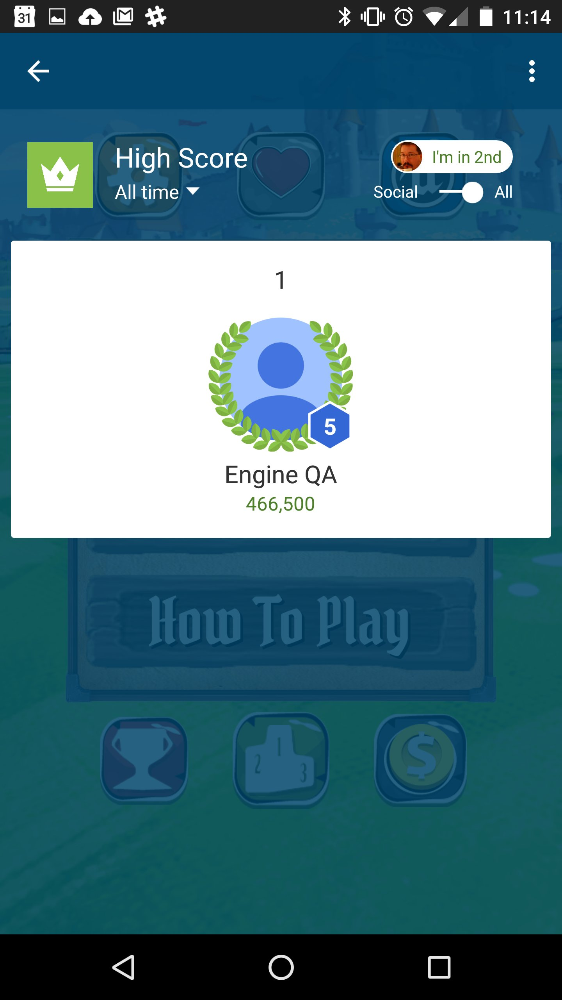
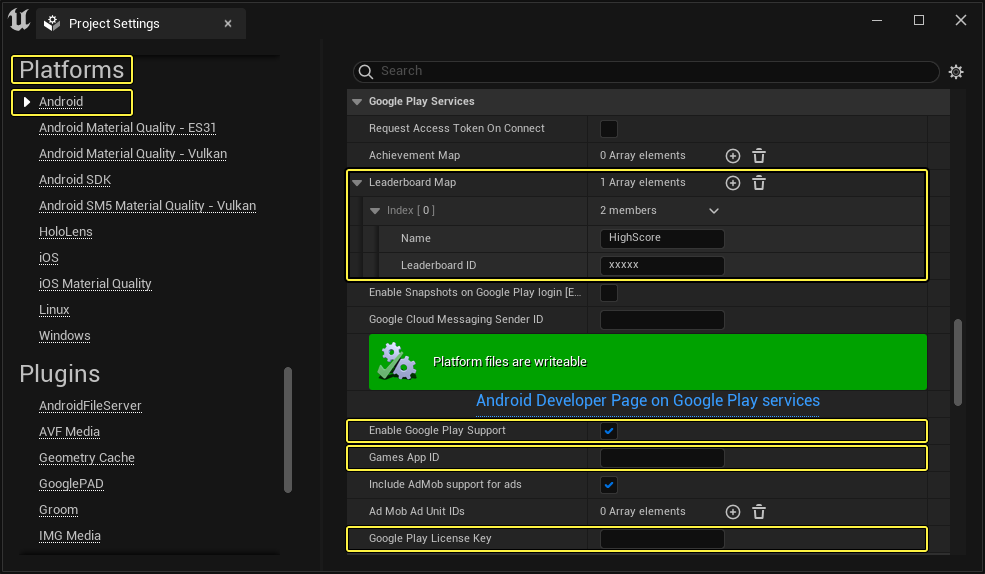

# 使用 Google Play Services 排行榜

> 路径：虚幻引擎5.7文档 / 移动端开发 / Android支持 / Android开发指南 / 使用 Google Play Services 排行榜

> 原始页面：https://dev.epicgames.com/documentation/unreal-engine/using-google-play-services-leaderboards-in-unreal-engine-projects

## 配置

在 [排行榜 | Play Game Services | Google 开发者](https://developers.google.com/games/services/common/concepts/leaderboards) 中可查阅应用程序 Google Play Game Services 设置的内容。

针对虚幻项目进行的操作：

1. 在 **虚幻编辑器** 的 **Edit** 菜单中选择 **Project Settings** 查看项目的配置选项。

   
2. 选择左边的 **Platforms:Android** 标签。找到 **Google Play Services** 分段，为Google Play服务平台配置项目。

   

   点击查看大图
3. 勾选 **Google Play Services** 部分下的 **Enable Google Play Support** 选项。
4. 在 **Games App ID** 栏位中输入游戏的 App ID。
5. 在 **Google Play License Key** 栏位中输入 Google Play 授权码。
6. 添加元素到 **Leaderboard Map**。
7. 在 **Leaderboard Map** 中，需要输入仅用于虚幻项目的 **Name** 和在 Google Play Services 中设置的 **Leaderboard ID**。

   

   点击查看大图

   应用程序和 Game Services 的这些数值保存在 Google Play Developer Console 中。

> [!TIP]
> 成就映射中的 **Name** 数值只是 Google Play Services **Leaderboard ID** 的一个映射，且 iOS 由它们的 **Leaderboard Reference** 直接引用。如需在安卓和 iOS 两个平台上进行发布，可将来自 iOS Game Center 设置的 Leaderboard Reference 作为 **Name** 输入，之后只需调用一个节点即可（无论哪个平台）。

## 从排行榜读取

**Read Leaderboard Integer** 节点将从平台的游戏服务（当前为 iOS Game Center 或 Google Play Services）请求存储在特定 **Player Controller** 的给定 **Stat Name** 上的数值。

它是 **隐藏** 节点，因此拥有多个执行输出引脚。最上方的是"pass through"，功能与其他执行输出引脚相似。在线服务返回数值（或返回数值失败）后，其他两个引脚（**On Success** 和 **On Failure**）将执行。在成功返回前（或者服务获取反馈失败），**Leaderboard Value** 的数值为 `0`。

**在蓝图中：**

下图取自 Unreal Match 3 示例游戏的 **Global Game Instance** 蓝图。在这几个节点中，我们对 Stat Name（排行榜）"Match3HighScore"上 Player Index 0 处的 Player Controller 调用 **Read Leaderboard Integer** 节点。

## 写入排行榜

**Write Leaderboard Integer** 将把给定整数 **Stat Value** 发送到特定 **Player Controller** 的 **Stat Name** 中指定的排行榜。

**在蓝图中：**

下图取自 Unreal Match 3 示例游戏的 **VictoryScreen** 蓝图。胜利（或失败）画面显示时，将会检查加载的 Unreal Match 3 是否可获取高分；如可获取，则将把最新高分提交到排行榜。在执行此检查前会先执行一些额外检查，确定新高分是否高于 app 启动时拉取的高分；即使不存在此高分，iOS 和安卓排行榜也只接受大于当前保存数值的新数值。

## 显示平台特有的排行榜

**Show Platform Specific Leaderboard Screen** 将在设备上显示由 **Category Name** 指定的排行榜。

**在蓝图中：**

下图取自 Unreal Match 3 示例游戏的 **GameOverButtons** 蓝图控件。按下 **ShowScores** 按钮后，游戏将显示排行榜。
