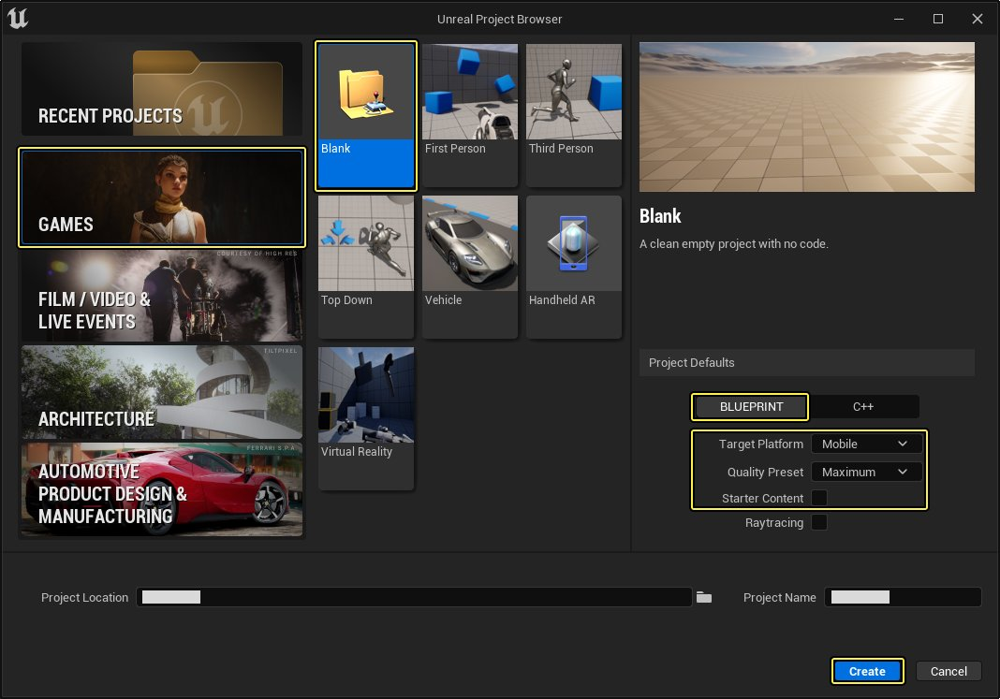
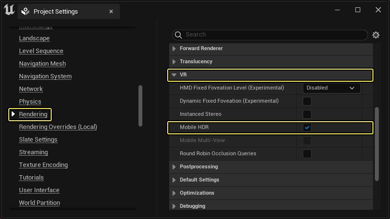
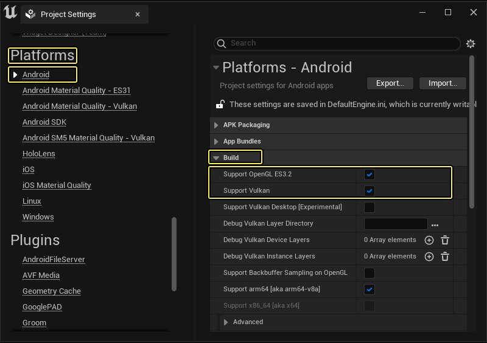
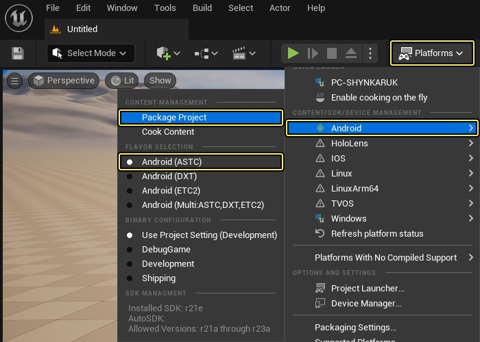
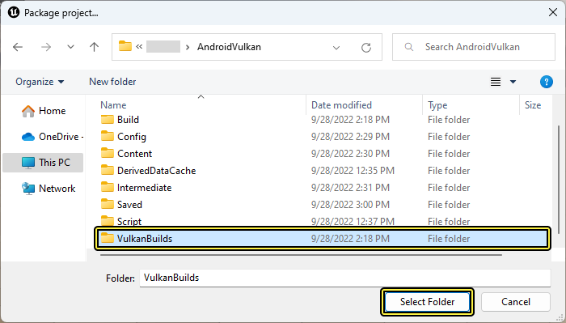
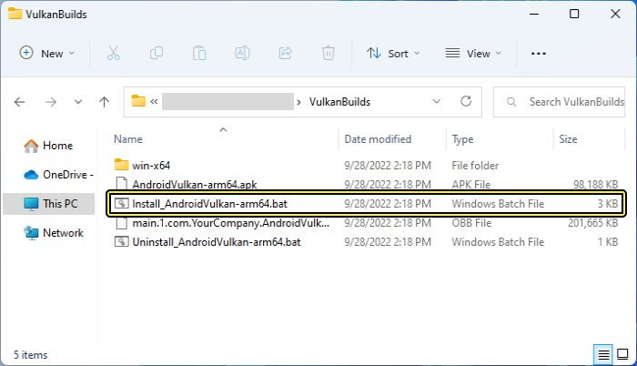
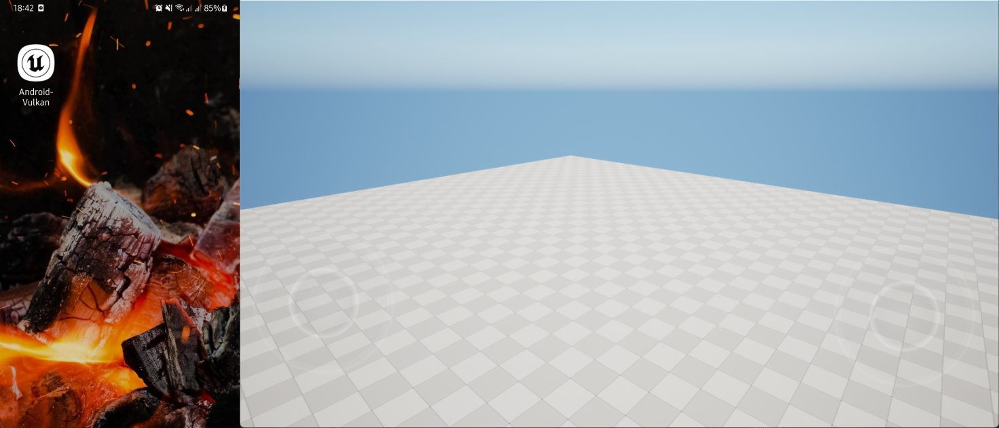
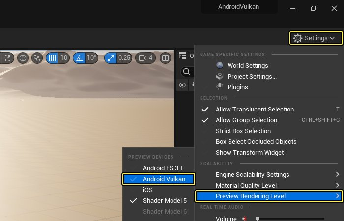

# Android Vulkan移动渲染器

> 路径：虚幻引擎5.7文档 / 移动端开发 / Android支持 / Android开发指南 / Android Vulkan移动渲染器

> 原始页面：https://dev.epicgames.com/documentation/unreal-engine/using-the-android-vulkan-mobile-renderer-in-unreal-engine

**虚幻引擎(UE)** 已内置对 **Vulkan** 图形API的支持。Vulkan是一个低系统占用、跨平台的3D图形库，它为开发人员提供了对GPU的更多控制，并降低了基于Android的移动项目的CPU使用率。在下面的文档中，我们将介绍如何在UE Android项目中启用和使用Vulkan。

## 用于PC开发的Vulkan视频驱动程序

为了确保您可以可视化Vulkan在您的开发PC上提供的渲染选项，您需要确保为显卡下载并安装了最新版本的显卡驱动程序。下面，您将找到为了能够在您的开发PC上预览Vulkan的显示效果而需要使用的最低驱动程序版本。

- NVIDIA

  : 390.0或更高版本
- AMD

  : 17或更高版本

## 检查Vulkan设备兼容性

要确定智能手机是否支持Vulkan渲染API比较困难，因为市场上的Android智能手机非常多样化。为了帮助您快速确认自己的智能手机是否支持Vulkan API，我们推荐安装来自Google Play商店的以下程序：[Vulkan硬件性能查看器（Hardware Caps Viewer for Vulkan）](https://play.google.com/store/apps/details)。

Vulkan硬件性能查看器（Hardware Caps Viewer for Vulkan）是一款客户端工具，可以根据开发者的需要，从支持新的Vulkan图形API的设备收集硬件实现的详细信息。

## 支持的Vulkan设备

以下设备除了支持非Vulkan配置文件，还支持Vulkan特定的配置文件。

- Adreno 6xx
- Mali G72
- Mali G76
- Mali G77
- PowerVR GM9xxx
- 三星 XClipse 系列

如果你的设备使用Android 9或更高版本的Android系统，并且你的项目启用了Vulkan功能级别，它将使用这些GPU的设备配置文件的Vulkan功能版本。

> [!NOTE]
> 请注意，使用Vulkan API的能力取决于您的移动运营商是否为您的特定设备变体发布了Vulkain更新。要查看此支持是否已推送到您的移动设备，您需要联系您的移动运营商。

## 为Vulkan构建

要构建支持Vulkan API的UE4项目，您需要执行以下操作：

1. 开始前，请确保您的Android智能手机已通过USB连接到您的开发PC上，并且您的Android智能手机已启用开发人员模式。
2. 启动UE4编辑器，使用 **游戏 > 空白** 模板并使用以下设置创建一个新项目：

   - 启用

     蓝图项目（Blueprint Project）
   - 启用

     手机/平板电脑（Mobile / Tablet）
   - 启用

     最高质量（Maximum Quality）
   - 启用

     无初学者内容包（No Starter Content）

   完成后，按下 **创建项目（Create Project）** 按钮以创建并加载新项目。

   

   点击查看大图。
3. 项目加载完成后，前往 **编辑（Edit）> 项目设置（Project Settings）** ，然后，在 **引擎（Engine）** 下，前往 **渲染（Rendering）** 分段，确保 **VR** 下已启用 **移动HDR（Mobile HDR）** 。

   

   点击查看大图。
4. 在 **项目设置（Project Settings）** 中，找到 **平台（Platforms）** ，前往 **Android** 分段，确保在 **构建（Build）** 下启用以下选项：

   - 支持OpenGL ES3.2（Support OpenGL ES3.2）
   - 支持Vulkan（Support Vulkan）

   

   点击查看大图。
5. 在菜单栏中，点击 **平台（Platform）** 按钮，前往 **Android** ，确保选中 **Android(ASTC)** 选项，并点击 **数据包项目（Package Project）** 。

   
6. 选择UE位置，保存Android构建版本，然后按 **选择文件夹（Select Folder）** 按钮，启动打包流程。

   
7. 打包流程完成后，打开放置已打包构建版本的文件夹。在此文件夹中，你会看到两个 `BAT` 文件。找到名称中带有 **Install** 字样的 `BAT` 文件，双击该文件，将其安装到你的设备上。

   
8. 在设备上完成安装后，按下方有你项目名称的UE图标，在设备上启动项目。

   

   点击查看大图。

## 在编辑器中启用Vulkan预览渲染

在上述步骤在项目中启动了Vulkan后，会自动出现预览渲染选项。在 **主工具栏（Main Toolbar）** 中点击 **设置（Setting）** 按钮，找到 **预览渲染关卡（Preview Rendering Level）** 选项。选择 **Android Vulkan** 选项在UE4视口中启用Vulkan预览。

视口会在右下角显示 **Feature Level: Android Vulkan ES31** 。

> [!NOTE]
> 启用Vulkan预览渲染后，编辑器需要重新编译整个着色器缓存以加入必要的Vulkan选项。根据项目的规模和开发用机的性能，此过程可能需要几分钟到一小时，甚至更多时间才能完成。

## 启用Vulkan移动预览渲染器

要启用Vulkan移动预览渲染器，您需要在项目中执行以下操作：

1. 在 **主工具栏（Main Toolbar）** 中，转到 **编辑（Edit）** 选项，然后从主菜单中选择 **编辑器首选项（Editor Preferences）** 选项。

   > 图片已省略：打开编辑器偏好设置
2. 在 **一般（General）** 部分中，在 **实验性（Experimental）** 类别下展开 **PIE** 部分，然后勾选 **允许Vulkan移动预览（Allow Vulkan Mobile Preview）** 旁边的复选框。

   > 图片已省略：Enable Allow Vulkan Preview

   点击查看大图。
3. 在 **主工具栏（Main Toolbar）** 中，点击 **播放（Play）** 面板上的选项按钮，从下拉列表中选择 **Vulkan移动预览（Vulkan Mobile Preview）（PIE）** 。

   > 图片已省略：在Vulkan移动预览中运行项目
4. 点击位于 **主工具栏（Main Toolbar）** 上的 **播放（Play）** 按钮，在启用Vulkan渲染器的情况，在新预览窗口中启动UE项目。如果所有内容设置成功，你会看到类似下图的画面。

   > 图片已省略：Example of VMP window

   点击查看大图。

> [!NOTE]
> 如果在预览窗口顶部项目名称的旁边没有看到 **(SF_VULKAN_ES31)** ，则意味着项目没有使用Vulkan API。如果出现这种情况，请确认您的视频卡已更新到最新版本。
