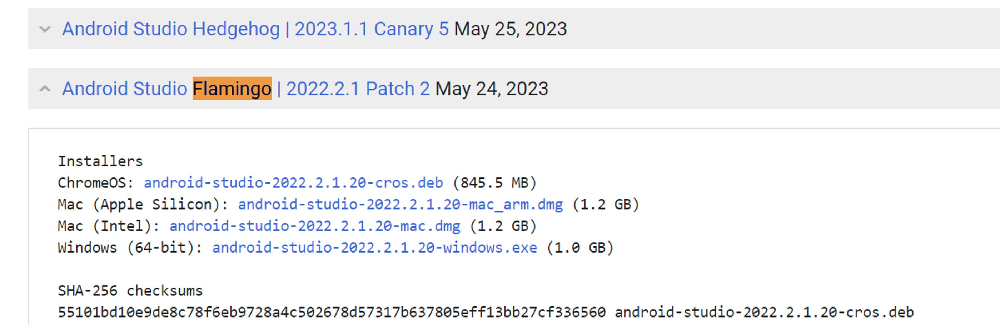
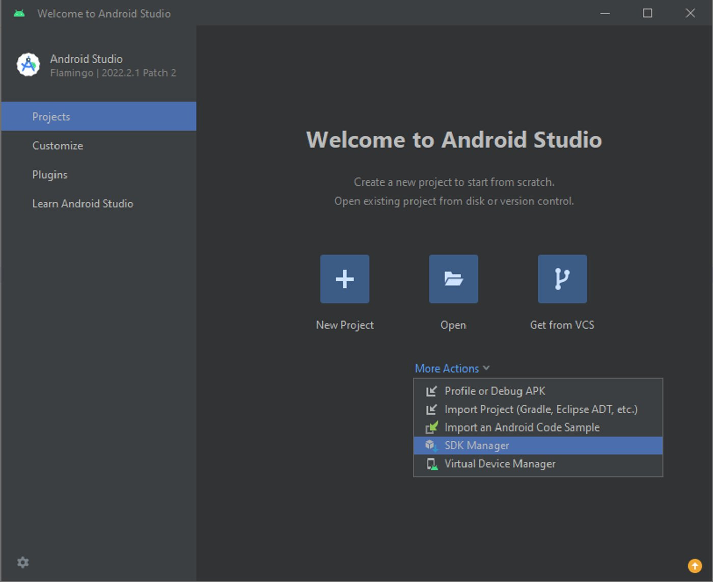
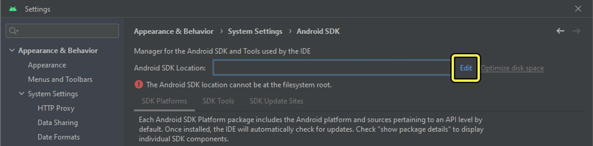
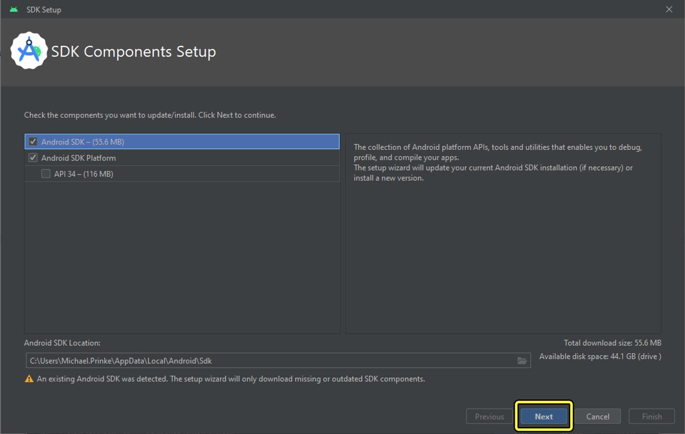
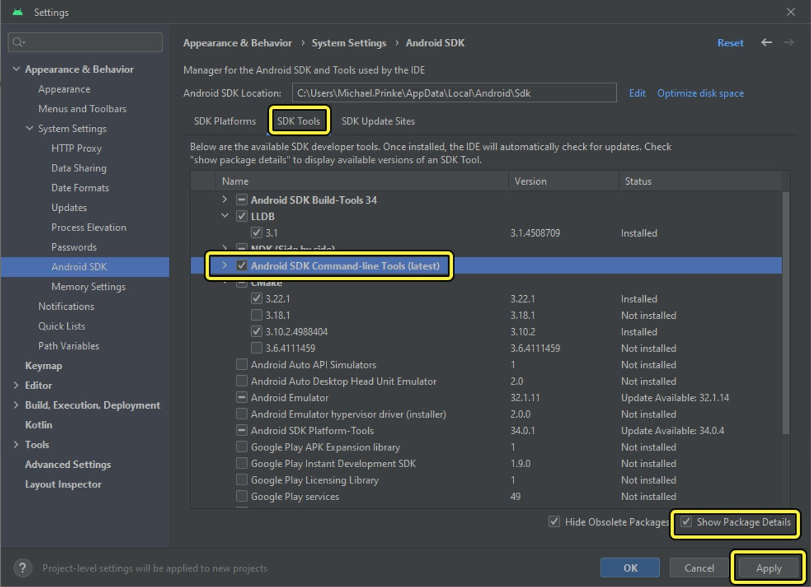
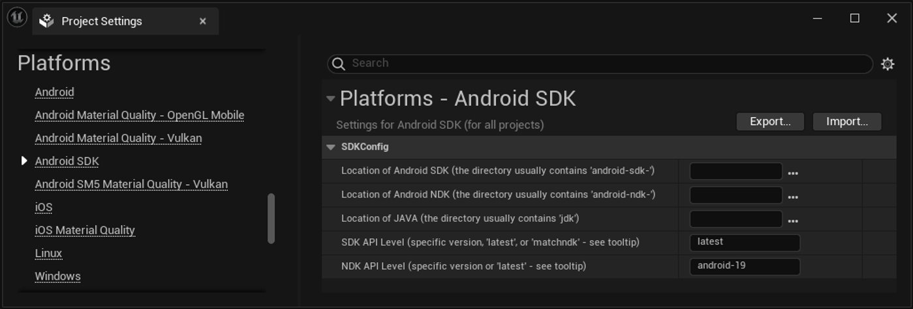

# 设置Android SDK和NDK

> 路径：虚幻引擎5.7文档 / 移动端开发 / Android支持 / 虚幻引擎Android项目入门指南 / 设置Android SDK和NDK

> 原始页面：https://dev.epicgames.com/documentation/unreal-engine/advanced-setup-and-troubleshooting-guide-for-using-android-sdk

> [!TIP]
> 如需了解简化的Android SDK设置流程，请参阅 [设置Android SDK和NDK](../set-up-android-sdk-ndk-and-android-studio-using-turnkey/index.md)指南，该指南可将设置过程部分自动化。 如果你遇到Android SDK安装冲突或需要排查故障，请参阅本指南。

虚幻引擎使用**Android Studio**随附的**Android软件开发套件（SDK）**处理所有必要的Android开发组件，包括**Android原生开发套件（NDK）**。 本页提供了设置Android Studio并确保虚幻引擎正确识别这些组件的演练流程，以及一些用于管理NDK安装和早期引擎版本的故障排除技巧。

> [!WARNING]
> 如果尝试运行SetupAndroid脚本时未满足所有先决条件，则将无法找到所需的SDK组件。 因此，在排查Android SDK的安装问题时，请**通读此页面**，因为安装过程取决于按照本文列示的顺序执行步骤。

> [!NOTE]
> Android SDK命令行工具在2023年2月更新之后，虚幻引擎4.27到5.1的用户需要编辑本教程中使用的SetupAndroid脚本。 本文档适用于UE 5.4和更高版本。 如果遇到问题，请根据你的虚幻引擎版本参考对应文档。

## 推荐设置

确保**虚幻编辑器**和**Epic Games启动器**都处于关闭状态，以确保安装NDK组件或设置引擎的环境变量时不会出现问题。

如需支持早期版本的虚幻引擎安装，请参阅"手动定位SDK路径"小节。 你可以在[Android开发要求](../../android-development-requirements/index.md)页面中找到你的虚幻引擎版本所需的对应NDK版本。

> [!NOTE]
> 虚幻引擎5.3和更高版本使用jbr (OpenJDK 17)进行其JDK安装，但UE 5.2和之前的版本使用jre (Java 1.8)。 这意味着当你卸载旧版Android Studio时，你可能会丢失jre并导致UE5.2或更早版本中出现错误。
>
> 如果你需要支持UE 5.2和更早版本，在继续之前，找到jre目录并将其复制到Android Studio目录之外的地方，避免丢失。 然后你可以在旧版本的虚幻引擎中手动定位此文件夹。 详情请参阅“手动定位SDK路径”。

## 安装Android Studio

在计算机上设置必要的SDK和NDK组件之前，你需要安装先**Android Studio**。

> [!NOTE]
> 请参阅[Android开发要求](../../android-development-requirements/index.md)，以了解兼容你当前所用虚幻引擎版本的Android Studio和NDK版本。

1. 在你的Web浏览器中前往[Android Studio归档](https://developer.android.com/studio/archive)。 向下滚动到**Android Studio Flamingo | 2022.2.1 Patch 2 May 24, 2023**。 展开下拉菜单，并为你的操作系统下载相应的安装程序或zip文件。

   
2. 运行**Android Studio安装程序**。 在**Android Studio设置（Android Studio Setup）**对话框中，点击**下一步（Next）**以继续。
3. 在**选择组件（Choose Components）**对话框中，保持启用默认组件。 点击**下一步（Next）**以继续。
4. 在**安装位置（Install Locations）**对话框中，确保安装位置设置为默认位置。 点击**下一步（Next）**以继续。

   > [!NOTE]
   > 如果选择自定义安装位置，`SetupAndroid`脚本将无法找到文件，除非你事先编辑了该文件。 点击 **下一步（Next）** 继续。
5. 在**选择开始菜单文件夹（Choose Start Menu Folder）**对话框中，点击**安装（Install）**以开始安装流程。
6. 安装完成后，点击**下一步（Next）**以开始设置组件。
7. 设置完成后，确保勾选**启动Android Studio（Start Android Studio）**复选框，并点击**完成（Finish）**以退出安装程序。

## 设置Android Studio以供首次使用

首次启动新安装的Android Studio时，请执行以下步骤：

1. 当出现**数据分享（Data Sharing）**对话框时，选择是否要给Google发送使用情况统计数据。 如何选择全凭自己意愿，选择任一选项都会继续进入下一步骤。
2. 在**欢迎使用Android Studio（Welcome to Android Studio）**对话框中，点击**更多操作（More Actions）**下拉菜单，然后点击**SDK管理器（SDK Manager）**。

   
3. 在**Android SDK**系统设置中，点击**Android SDK位置（Android SDK Location）**旁边的**编辑（Edit）**按钮。

   
4. **SDK组件设置（SDK Components Setup）**对话框中已选择了所需的组件。 点击**下一步（Next）**以安装组件。

   
5. 在**验证设置（Verify Settings）**窗口中，再次点击**下一步（Next）**以继续安装。
6. 安装完成后，点击**完成（Finish）**。
7. 在**设置（Settings）**菜单中，点击**SDK工具（SDK Tools）**选项卡。 这时将显示可选组件列表。
8. 勾选**显示包装细节（Show Package Details）**复选框，以显示所有可用的SDK组件。
9. 勾选**Android SDK命令行工具（最新）（Android SDK Command-line Tools (latest)）**复选框。 点击**应用（Apply）**以下载并安装此组件。

   
10. 点击**确定（OK）**以取消窗口并关闭欢迎对话框。

## 在你的操作系统上完成Android Studio安装

完成上述所有步骤之后，你需要完成安装，确保在继续之前充分设置好你的环境。 每个操作系统都需要不同的步骤来完成安装。

| 操作系统 | 必要操作 |
| --- | --- |
| Windows | 重启你的计算机。 |
| Linux | 关闭你的终端窗口并重新打开它。 |
| macOS | 关闭你的终端窗口并重新打开它，或登出之后再重新登录。 |

## 重置或验证你的环境变量

此小节中的步骤主要适用于从UE 5.2及更早版本迁移到UE 5.3及更高版本的用户，他们可能需要重置环境变量。 如果你使用的是全新的UE和Android Studio版本，请继续进入下一个小节。

这对于使用AGDE进行调试的用户尤为重要，因为UE和AGDE现在都以jbr目录为目标，不需要单独的环境变量。

1. 打开计算机的**系统属性（System Properties）**。
2. 点击**环境变量（Environment Variables）**按钮。
3. 如果存在名为`AGDE_JAVA_HOME`的环境变量，删除它。 此变量已不再需要，因为虚幻引擎和AGDE现在使用同一Java版本。
4. 重置或验证以下环境变量。

   | 环境变量 | 预期值 |
   | --- | --- |
   | `JAVA_HOME` | C:\\Program Files\\Android\\Android Studio\\jbr |
   | `ANDROID_HOME` | C:\\Users(Username)\\AppData\\Local\\Android\\Sdk |
   | `NDK_ROOT` | C:\\Users(Username)\\AppData\\Local\\Android\\Sdk\\ndk(NDK Version Number) |
   | `NDKROOT` | C:\\Users(Username)\\AppData\\Local\\Android\\Sdk\\ndk(NDK Version Number) |

   将`(Username)`替换为你的用户名，`(NDK Version Number)`替换为所需安装版本号的目录名称。

   > [!TIP]
   > 为了方便修复，请删除你的环境变量。 后续步骤中，它们将被SetupAndroid脚本替换。

如果需要支持早期版本的虚幻引擎，建议按照上述步骤保持与当前和未来虚幻引擎版本的兼容性。 要保留先前版本的虚幻引擎的路径，建议你编辑你的项目设置，并手动定位各个Android SDK、NDK和JDK版本的对应SDK路径。 详情请参阅下文的"手动定位SDK路径"。

## 运行SetupAndroid脚本

安装必要的Android SDK组件后，你可以使用`SetupAndroid`脚本下载并安装相应版本的Android NDK。

1. 打开`Engine/Extras/Android`目录，并为你的操作系统运行相应的`SetupAndroid`脚本：

   - `SetupAndroid.bat` – Windows
   - `SetupAndroid.command` – Mac
   - `SetupAndroid.sh` – Linux.
2. 脚本提示你接受Android SDK许可协议。 键入**Y**并按下**Enter**即可接受。
3. 安装完成后，按任意键关闭命令提示符。
4. 重启计算机，使所有更改生效。

NDK的安装目录应为`C:/Users/[Username]/AppData/Local/Android/SDK/ndk/`，其中`[Username]`是你计算机的登录名称。 你应该在此位置看到一个包含所需NDK版本的文件夹。

## 手动定位SDK路径

如果你按照上述说明操作而未遇到问题，虚幻引擎将自动关联Android SDK、当前Android NDK版本和Java开发套件（JDK）的SDK路径。 但是，如果你使用的是早期版本的虚幻引擎和Android Studio，可能需要手动定位SDK路径以使其兼容。 如果要从UE 5.0、5.1或5.2迁移到UE 5.3或更高版本，你很可能需要执行该操作。

要找到SDK路径，打开**编辑（Edit）** > **项目设置（Project Settings）**，然后转到**平台（Platforms）** > **Android** > **Android SDK**分段。



如果这些字段是空白的，UE将回退到先前分段中安装流程中使用的一组默认路径。 如果你安装了这些组件的多个版本，或在非标准目录下安装了这些组件，你可以在此处手动提供其路径。 或者，你也可以打开`BaseEngine.ini`并在`[/Script/AndroidPlatformEditor.AndroidSDKSettings]`分段下提供这些路径。

C++

```
[/Script/AndroidPlatformEditor.AndroidSDKSettings]    SDKPath = (Path="C:\Filepath")    NDKPath = (Path="C:\Filepath")    JDKPath = (Path="C:\Filepath")
```

如果`BaseEngine.ini`中不存在SDKPath、NDKPath和JDKPath的条目，则系统将使用Android主目录的默认路径。
