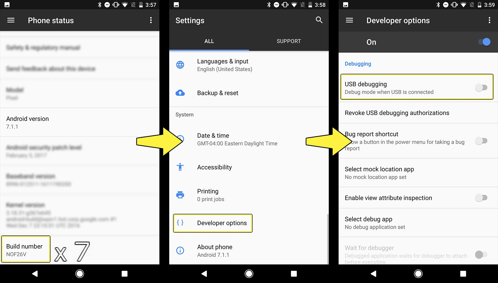
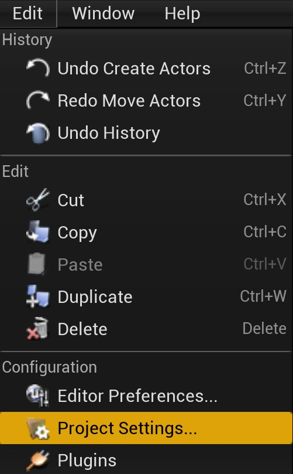
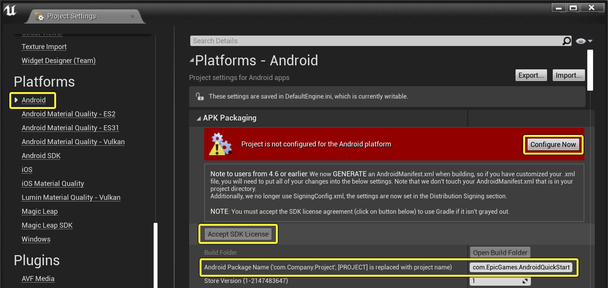
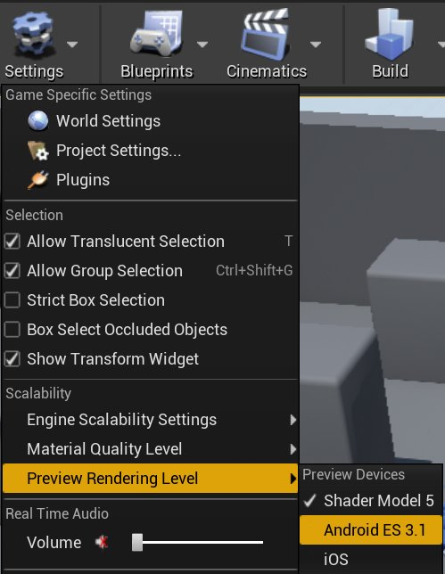
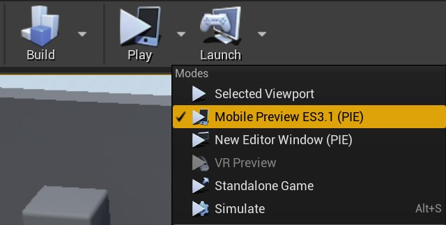
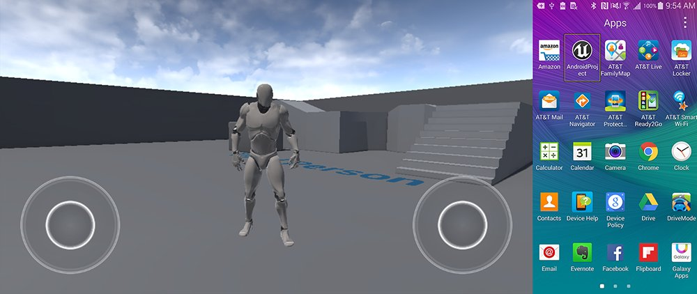
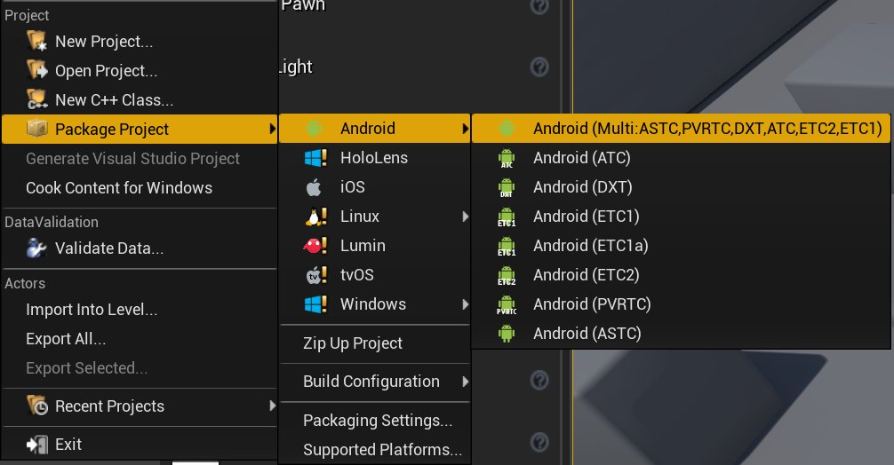

# Android快速入门

> 路径：虚幻引擎5.7文档 / 移动端开发 / Android支持 / 虚幻引擎Android项目入门指南 / Android快速入门

> 原始页面：https://dev.epicgames.com/documentation/unreal-engine/setting-up-unreal-engine-projects-for-android-development

本快速入门指南将介绍设置 **虚幻引擎4** 进行Android游戏开发的所有相关要点，其中包括以下主题：

- 设置Android游戏开发的测试设备和计算机。
- 配置移动平台开发的新项目。
- 设置

  虚幻编辑器

  ，打包Android版本。
- 设置编辑器预览移动渲染特征等级。
- 在编辑器中测试设备上的项目。
- 打包项目的独立版本。

完成本指南后，将可从初始设置开始，准备Android项目进行测试和打包。

## 1 - Android开发先决条件

要创建和部署Android插件，需安装虚幻引擎包含的数个Android开发先决条件，并确保设备已可开始测试。

1. 请参照[为虚幻引擎设置Android SDK和NDK](../advanced-setup-and-troubleshooting-guide-for-us-ec72c4a3/index.md)一文来安装Android Studio，并设置虚幻引擎Android开发所需的SDK组件。
2. 在测试设备上打开 **设置（Settings）** 并启用 **开发者模式（Developer Mode）**。
3. 在设备的设置（Settings）中找到 **开发者选项（Developer Options）**，然后启用 **USB调试（USB Debugging）**。

   

   点击查看大图。
4. 将设备连接到计算机，然后允许计算机访问设备数据。
5. 允许计算机安装设备所需驱动程序。

完成以上步骤后，即可开发新的Android项目。

> [!TIP]
> - 关于设备设置的更多详情，请参阅
>
>   Android设备开发设置
>
>   。

## 2 - 创建项目

在以下章节中，我们将新建UE4项目，并使用蓝图第三人称模板以展示在Android设备上运行UE4项目的速度。

1. 启动 **虚幻编辑器**。在 **虚幻项目浏览器** 中，使用以下设置新建项目：

   - 项目类别：

     游戏（Games）
   - 模板：

     自上而下（Top Down）
   - 目标硬件：

     移动设备/平板电脑（Mobile/Tablet）
   - 质量级别：

     可缩放3D或2D（Scalable 3D or 2D）
2. 将项目命名为 **AndroidQuickStart**，并点击 **创建项目（Create Project）** 按钮完成项目创建。

选择"移动设备/平板电脑（Mobile/Tablet）"作为目标硬件，并选择"可缩放3D或2D（Scalable 3D or 2D）"作为目标质量级别，确保项目考虑移动设备的用户界面和硬件限制。

## 3 - 设置用于Android的虚幻编辑器

接下来确保在虚幻编辑器中配置Android APK版本的 **项目设置（Project Settings）**。

1. 点击 **编辑（Edit）** > **项目设置（Project Settings）**，打开项目设置（Project Settings）窗口。

   
2. 在项目设置（Project Settings）窗口内，导航至 **平台（Platforms）** > **Android**。
3. **APK打包（APK Packaging）** 下会出现警告，写有"未配置Android平台的项目（Project is not configured for the Android platform）"。点击 **立即配置（Configure Now）** 按钮，自动设置项目以写入必需平台文件。
4. 使用正确公司名和项目名填写 **Android包命名（Android Package Name）**。本实例中使用 **com.EpicGames.AndroidQuickStart**。
5. 若已启用 **接受SDK授权（Accept SDK License）** 按钮，点击器以接受Android的SDK授权协议。若之前已接受此协议，则无需完成此步骤。

   

项目现可创建Android版本并在Android设备上进行启动。

## 4 - 配置编辑器和PIE进行移动预览

可设置虚幻编辑器的 **编辑器中运行** (PIE) 模式，以预览游戏在移动渲染器中的效果。

1. 在 **工具栏（Toolbar）** 中，点击 **设置（Settings）** > **预览渲染关卡（Preview Rendering Level）**，然后选择Android的可用渲染关卡。

   

   点击查看大图。
2. 点击 **工具栏（Toolbar）** 中 **运行（Play）** 按钮旁的 **下拉菜单**。选择所选渲染关卡对应的可用 **移动预览** 模式。

   

编辑器将以与目标渲染器视觉一致的方式显示游戏。此外，按下PIE按钮时，游戏将在标准移动宽高比的独立窗口中启用，并已配置为使用鼠标模拟触摸屏。此类设置不会影响移动设备的打包，但可确保在编辑器中工作时获得准确预览。

> [!TIP]
> 欲了解配置移动预览器的方法，参见[移动预览器](../../../development-tools-for-mobile-applications/using-the-mobile-previewer/index.md)参考。

## 5 - 在Android设备上启动

要在基于Android的设备上测试当前关卡，需进行以下操作：

1. 首先确保已打开要测试的关卡。本例将使用 **ThirdPersonExampleMap** 关卡，其位于上一步中创建的基于蓝图的项目内。
2. 将 **ThirdPersonExampleMap** 打开后，前往 **主工具栏**，点击 **启动** 图标旁的白色小三角形显示更多选项。
3. 在 **设备** 部分下的 **启动** 菜单中，点击选中列表内的Android设备。
4. 关卡在设备上启动时，进度将显示在屏幕的右下角，如下图所示。 AndroidDevelopment_QS_4_PackingProgress.png
5. 部署完成后，应自动开始在Android设备上运行项目。若项目无法自动运行，可在设备上找到应用程序并点击启动。

   

   点击查看大图。

## 6 - 将Android版本打包

上述步骤讲解了在设备上打包并立即启动项目的方法。按照以下步骤，可打包独立APK以供分步和测试：

1. 点击 **文件（File）** > **打包项目（Package Project）** > **Android** > **Android (Multi:ASTC,PVRTC,DXT,ATC,ETC2,ETC1)**。

   

   点击查看大图。
2. 出现 **打包项目（Package Project）** 对话框时，选择保存其的目录。在本例中，将其保存到 **AndroidQuickStart/Build**。

   > 图片已省略：undefined

   点击查看大图。
3. 点击 **选择文件夹（Select Folder）**，虚幻编辑器将开始打包项目。等待打包完成。

若导航至输出版本的目标文件夹，该文件夹将包含在Android设备上安装游戏所需的APK和OBB文件。其中有一对 **.bat** 文件，可用于在相连设备上自动安装和卸载版本。

> 图片已省略：undefined

点击查看大图。

> [!TIP]
> 欲了解配置Android版本的打包设置的详情，参见[将Android项目打包](../../packaging-and-publishing-android-projects/packaging-android-projects/index.md)参考页。

## 4 - 自行尝试

凭借在本快速入门中学到的知识，你现在可打包UE4项目并分发到一般Android设备上。通过新建gameplay和关卡可扩展UE4提供的模板，以创建出完整功的移动平台游戏。根据项目需求和针对的目标设备，需进一步配置以优化版本。以下链接将提供项目构建后续步骤的更多信息：

- Android开发参考

  - Android开发者所需的UE4一般参考信息。
- Android SDK要求

  - 使用UE4特定版本时所需的SDK和OS要求参考。
- Android设备兼容性

  - 当前UE4版本支持的设备相关信息。
- Android调试

  - 在设备上调试Android项目的教程指南。
- 移动渲染

  - 有关移动特定渲染功能的相关信息。
- 移动服务

  - 实现在线服务和通知的相关信息。
- Android发布

  - 准备游戏发布的相关指南。
