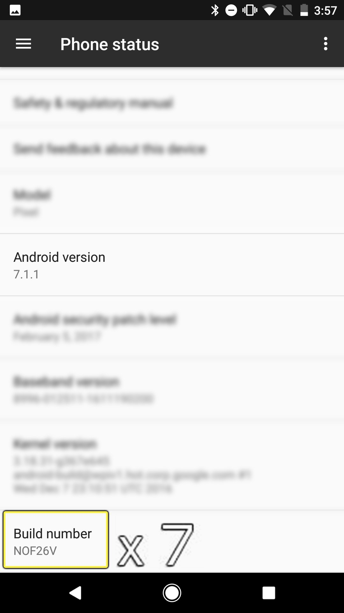
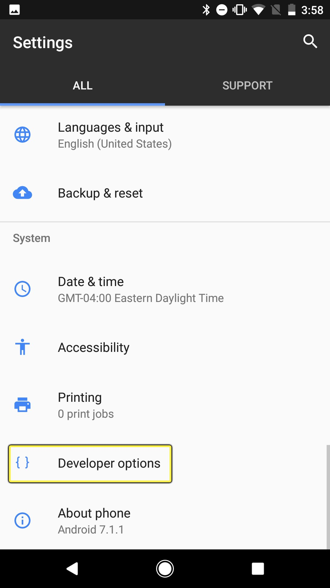
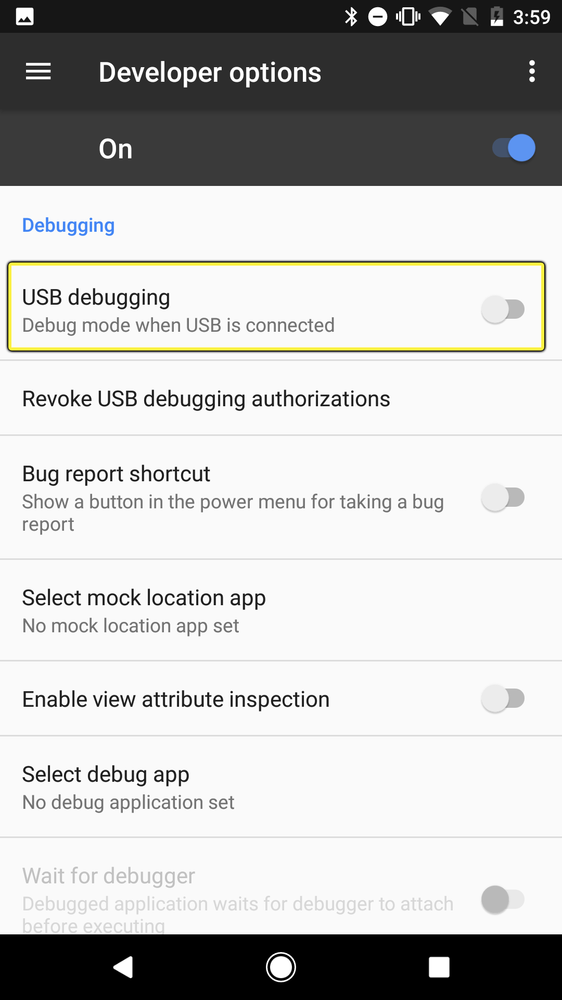

# 设置Android设备

> 路径：虚幻引擎5.7文档 / 移动端开发 / Android支持 / 虚幻引擎Android项目入门指南 / 设置Android设备

> 原始页面：https://dev.epicgames.com/documentation/unreal-engine/setting-up-your-android-device-for-developing-applications-in-unreal-engine

以下部分将讲述如何设置Android设备，使其能运行您的 **虚幻引擎（UE）** 项目。

## 1. 将Android USB驱动程序安装到计算机

1. 将Android设备通过USB连接到开发用PC上。
2. 设备驱动软件应该会自动安装。如果没有安装，请访问[Android的OEM USB驱动程序](http://developer.android.com/tools/extras/oem-usb.html)页面，寻找更多驱动安装程序链接及其他信息。
3. 将Android设备从USB断开，然后立即插回。PC辨识出设备后，Android设备上将出现以下信息，询问是否要允许此PC与设备对话。信息框会询问想要用USB链接做什么。点击 **允许此计算机** 前的 **勾选框**，然后点击 **确认** 按钮。

## 2. 在Android设备上启用开发者模式

1. 在Android设备上打开 **设置（Settings）** 菜单。
2. 向下滚动并选择 **关于手机（About Phone）**。根据所使用Android设备的不同，此处可能出现 **关于设备（About Device）**、**关于平板（About Tablet）** 或 **关于Shield（About Shield）** 等选项。

   > [!NOTE]
   > 在较新的Android版本中，其可能位于 **更多（More）** 部分中。
3. 点按 **版本号（Build Number）** 7次来启动开发者模式。

   
4. 启动开发者模式后，屏幕上便会出现类似于下图的成功消息。

## 3. 启用USB调试

1. 在Android设备上打开 **设置** 菜单。
2. 回到 **设置（Settings）** 菜单中，并选择应已存在与此的 **开发者选项（Developer Options）**。

   
3. 在 **开发者选项（Developer Options）** 菜单点按中启用 **USB调试（USB debugging）**。

   
4. 弹出提示后点按 **OK** 键。

## 4. 验证设备是否已连接

可执行以下操作来验证所有内容是否已设置完毕，Android也已能够用于虚幻引擎开发。

1. 按下 **Windows + R** 组合键打开 **运行** 命令框，开启 **Windows命令提示符**。
2. 在 **打开** 输入中，键入 **cmd** 并按下 **确认** 按钮打开Windows命令提示符。
3. 在Windows命令提示符中输入 **adb devices** 然后按下 **回车** 键显示连接的所有Android设备。

1. 从/Applications/Utilities打开Terminal应用。
2. 在命令提示符中输入 **adb devices**，就能看到连接到Mac的所有设备。

输入adb devices命令后如仍未看到设备，可尝试以下操作：

- 如设备已在列表中但名称旁显示有 **未授权**，则说明尚未接受开发PC电脑的RSA密钥指纹。
- 如插入并设置设备后其仍未出现，则在Windows命令行弹窗中按以下顺序输入命令并重启 **Android调试桥** 或（ADB）服务：

  | 属性名称 | 描述 |
  | --- | --- |
  | **ADB kill - server** | 其将停止ADB服务。 |
  | **ADB start - server** | 其将开始ADB服务。 |
- 在一些情况下，一个已正确配置的Android设备如果被连接为 **媒体设备（MTP）**，其则有可能不会出现。如出现此情况，请在使用USB的选项中选择"相机（PTP）"选项，将其连接为 **相机（PTP）**。

## 最终结果

完成上述步骤后，Android设备就可以用于部署和调试了。如需进一步了解细节，请参阅[Android快速入门指南](../setting-up-unreal-engine-projects-for-android-d-db209844/index.md)，可学习在虚幻引擎中针对Android系统配置项目。
