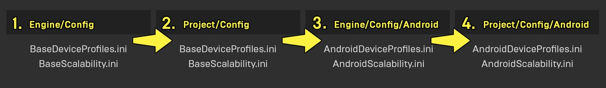
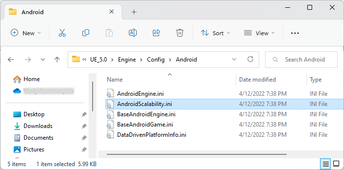
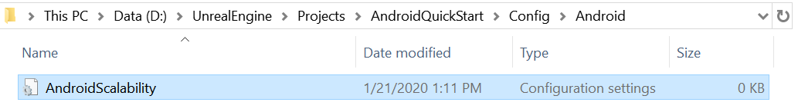
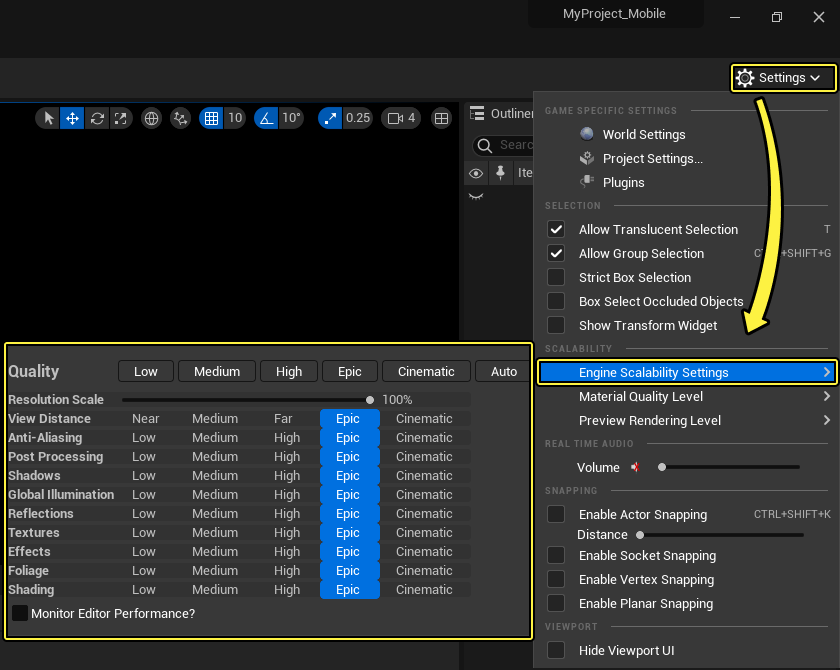
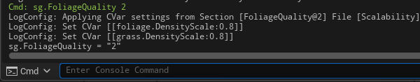
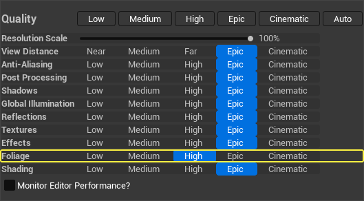
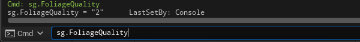
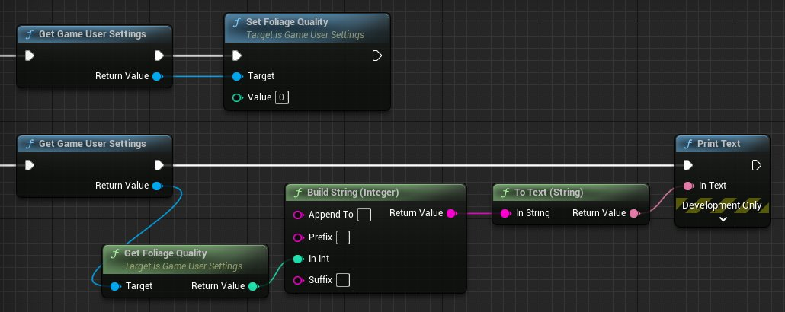

# 关于Android项目的自定义设备描述和伸缩性

> 路径：虚幻引擎5.7文档 / 移动端开发 / Android支持 / 打包和发布 / 关于Android项目的自定义设备描述和伸缩性

> 原始页面：https://dev.epicgames.com/documentation/unreal-engine/customizing-device-profiles-and-scalability-in-unreal-engine-projects-for-android

**虚幻引擎**使用**[设备描述](../../../../sharing-and-releasing-projects/tools-for-general-platform-support/setting-up-device-profiles/index.md)**和**[可伸缩性设置](../../../../designing-visuals-rendering-and-graphics/optimizing-and-debugging-projects-for-realtime-rendering/scalability/index.md)**为各类硬件量身定制渲染设置。 伸缩性设置定义了阴影、植被和网格体细节等各项功能的质量级别，将大量不同的设置压缩为一个可轻松缩放的值。 设备描述则会将这些设置映射到与之兼容的设备。

**Android**拥有大量与特定**GPU产品系列**匹配的描述文件。 本指南将介绍**设备匹配规则**、规则编辑方式，以及如何使用可伸缩性设置创建适合游戏特定需求的描述文件。

## 配置和优先级顺序

系统会同时从引擎的安装目录和你的项目文件夹读取虚幻引擎的**[配置文件](../../../../cpp-programming/programming-in-the-unreal-engine-architecture/configuration-files/index.md)**。 `Engine/Config`文件夹将设置引擎的基础配置设置。 之后，按以下顺序相互覆盖：



1. `Engine/Config/Base*.ini`
2. `Project/Config/Base*.ini`
3. `Engine/Config/Android/Android*.ini`
4. `Project/Config/Android/Android*.ini`

例如，`Engine/Config/Android`中的`AndroidDeviceProfiles.ini`文件优先于`Engine/Config`和`Project/Config`中的`BaseDeviceProfiles.ini`。 `Project/Config/Android`中的`AndroidDeviceProfiles.ini`优先于所有上述文件。

## Android设备描述

标准Android设备描述为`Android_Low`、`Android_Mid`和 `Android_High`。 `Android_High`描述文件代表了虚幻引擎在最高端Android设备上支持的全系列功能，而`Android_Low`则代表了针对最低端Android设备的最小功能集。

由于具有相同GPU的移动设备通常有类似的性能特征，因此我们还根据虚幻引擎支持的GPU系列，对更多特定设备描述进行了分类。 这些针对特定GPU的设备描述通常会将某个标准描述文件（例如`Android_High`）映射到特定设备，但有时需要提供特殊用例调整。

例如，以下为**虚幻引擎4.24**中，针对**Adreno 5xx**设备的设备描述：

C++

BaseDeviceProfiles.ini

```
[Android_Adreno5xx DeviceProfile]	DeviceType=Android	BaseProfileName=Android_High	+CVars=r.DisjointTimerQueries=1 	[Android_Adreno5xx_No_Vulkan DeviceProfile]	DeviceType=Android	BaseProfileName=Android_Adreno5xx;	There are several issues (vulkan sub-passes, occlusion queries) on devices running Android 7 and earlier	+CVars=r.Android.DisableVulkanSupport=1
```

标准`Android_Adreno5xx`设备描述从`Android_High`继承其所有基础设置，并仅重载`rDisjointTimerQueries`。 `Android_Adreno5xx_No_Vulkan`描述文件则继承自标准`Android_Adreno5xx`描述文件，由于旧版Adreno5xx设备上的问题，同时提供另一重载项来禁用对**[Vulkan渲染器](../../developing-guides-for-android/using-the-android-vulkan-mobile-renderer/index.md)**的支持。

根据游戏的内容，你可能需要在项目的`AndroidDeviceProfiles.ini`文件中重载现有描述文件或提供新描述文件。 若需要，可以进一步扩展这些特定于GPU的描述文件，以代表这些GPU系列中更多特定设备，也可以完全重写之前定义的描述文件。

## 设备描述匹配规则

虚幻引擎应用程序启动时，会加载运行该应用程序的设备相关信息。 应用程序之后将迭代根据这些参数识别设备的规则列表。 可在`[/Script/AndroidDeviceProfileSelector.AndroidDeviceProfileMatchingRules]`分段下的 `**BaseDeviceProfiles.ini**` 文件中找到此类规则。 应用程序找到匹配所检索设备信息的规则后，其将停止浏览列表并使用该设备描述。

此列表中的条目格式如下：

C++

```
+MatchProfile=(Profile="Profile_Name", Match=( ( Rule 1 ), ( Rule 2 ), (...) )
```

规则本身是字符串比较，格式如下：

C++

```
SourceType=[source string], CompareType=[comparison type], MatchString=[string to compare the source string to]
```

根据你为**SourceType**提供的值，它将输出**源字符串**供系统之后与**MatchString**进行比较。

SourceType的有效值及其对应源字符串输出如下：

| SourceType值 | 说明 | 输出示例 |
| --- | --- | --- |
| `SRC_DeviceModel` | 设备型号。 | "Nexus 6" |
| `SRC_DeviceMake` | 设备制造商。 | "NVidia" |
| `SRC_GPUFamily` | 此设备中GPU的GPU系列。 | "Adreno (TM) 320"、"NVIDIA Tegra" |
| `SRC_GlVersion` | 此设备正在运行的OpenGL版本。 | OpenGL ES 3 |
| `SRC_AndroidVersion` | 此设备使用的Android操作系统版本。 | 任何数值。 |
| `SRC_VulkanAvailable` | 检查应用程序是否在启用Vulkan的情况下打包，以及设备是否支持你的项目设置中指定的Vulkan必需版本。 | Vulkan不可用时为`false`，可用时为`true`。 |
| `SRC_VulkanVersion` | 此设备使用的Vulkan的版本（若可用）。 | 任何数值。 |
| `SRC_PreviousRegexMatch` | 前一正则表达式在同一MatchProfile条目中匹配项的值。 | 正则表达式匹配项之前输出的信息。 |

可用比较类型如下：

| 比较类型 | 说明 |
| --- | --- |
| `CMP_Regex` | 在MatchString中执行使用正则表达式运算符的比较。 |
| `CMP_Equal` | 检查两个字符串的值是否完全相同。 |
| `CMP_EqualIgnore` | 同`CMP_Equal`，但不区分大小写。 |
| `CMP_NotEqual` | 检查两个字符串的值是否不同。 |
| `CMP_NotEqualIgnore` | 同`CMP_NotEqual`，但不区分大小写。 |
| `CMP_Less` | 检查源字符串的数字值是否小于MatchString。 |
| `CMP_LessIgnore` | 同`CMP_Less`，但不区分大小写。 |
| `CMP_LessEqual` | 同`CMP_Less`，但若源和MatchString也相等，则返回true。 |
| `CMP_LessEqualIgnore` | 同`CMP_LessEqual`，但不区分大小写。 |
| `CMP_Greater` | 检查源字符串的数字值是否大于MatchString。 |
| `CMP_GreaterIgnore` | 同`CMP_Greater`，但不区分大小写。 |
| `CMP_GreaterEqual` | 同`CMP_Greater`，但若源和MatchString也相等，则返回true。 |
| `CMP_GreaterEqualIgnore` | 同`CMP_GreaterEqual`，但不区分大小写。 |

例如，以下是4.24中Mali T8xx设备的条目：

C++

BaseDeviceProfiles.ini

```
+MatchProfile=(Profile="Android_Mali_T8xx_No_Vulkan",Match=((SourceType=SRC_GpuFamily,CompareType=CMP_Regex,MatchString="^Mali\\-T8"),(SourceType=SRC_AndroidVersion, CompareType=CMP_Regex,MatchString="([0-9]+).*"),(SourceType=SRC_PreviousRegexMatch,CompareType=CMP_Less,MatchString="8")))
```

此MatchProfile条目有三项规则：

1. 必须拥有含字符串"^Mali-T8"的GPU产品系列的正则表达式匹配项。
2. Android版本必须有一位或多位数字，发现非数字之前，必须记住这些数字。
3. 第二条规则中获取的Android版本必须小于8。

若满足所有这些条件，则使用描述文件`Android_Mali_T8xx_No_Vulkan`。

设备描述规则首先按制造商列示，并以最低端规范到最高端规范的升序排列。 标准Android描述文件作为备用文件列出，以防无匹配规则或者无法识别特定设备。

> [!WARNING]
> 若向该列表添加规则，请确保按照相对于同一系列中的其他设备的适当顺序放置。

## 启用Vulkan

名为`VulkanAvailable`的特殊参数将用于判断设备能否使用Android的Vulkan渲染器。 它首先检查游戏本身是否启用Vulkan支持，然后检查设备是否拥有Vulkan驱动程序。 若满足这两个条件，则视`VulkanAvailable`为`true`。

无论是否启用Vulkan，支持Vulkan的设备都启用描述文件，以考虑到不使用Vulkan的项目，即便Vulkan在目标设备上可用。 所有描述文件都有名为`r.Android.DisableVulkanSupport`的参数，其默认值为`1`。 启用Vulkan的设备描述会将此参数值重载为`0`。

> [!NOTE]
> 由于最早支持Vulkan的设备存在较多驱动程序bug，因此建议仅在运行Android 9或更高版本的设备上启用Vulkan。

## 伸缩性设置

虚幻引擎的基础可伸缩性设置由`Engine/Config/BaseScalability.ini`定义。你可在引擎安装目录中找到该文件。 Android设备的基础可伸缩性设置由`Engine/Config/Android/AndroidScalability.ini`定义。



### 了解伸缩性值

伸缩性设置吸收了大量参数，将这些参数压缩到各个类别之下，然后可用0到3之间的简单值定义。 例如，以下是`BaseScalability.ini`中ShadowQuality等级0的可伸缩性映射：

C++

BaseScalability.ini

```
[ShadowQuality@0]
	r.LightFunctionQuality=0
	r.ShadowQuality=0
	r.Shadow.CSM.MaxCascades=1
	r.Shadow.MaxResolution=512
	r.Shadow.MaxCSMResolution=512
	r.Shadow.RadiusThreshold=0.06
	r.Shadow.DistanceScale=0.6
	r.Shadow.CSM.TransitionScale=0
	r.Shadow.PreShadowResolutionFactor=0.5
```

列示的每个值都表示高度具体的功能，且拥有各自的范围。 例如，部分操作遵照像素分辨率，部分操作遵照与默认值相乘的缩放因子，而部分操作则更为随意。 以各功能为基础进行定义十分繁琐，并且随着硬件的频繁更新，还需要在不同版本之间调整。

因此，我们使用ShadowQuality将一组相关设置压缩到单个可读值之下。 上述条目定义了将配置文件中的`sg.ShadowQuality`设为`0`时的所有值的行为。 `ShadowQuality@1`到`3`也存在类似条目。

以下为这些默认伸缩性值的准则：

| 伸缩性值 | 说明 |
| --- | --- |
| 0 | 低质量。 与虚幻引擎支持的最低硬件范围兼容的最低设置。 |
| 1 | 中等质量。 经虚幻引擎测试且介于最低端与最高端设备之间的硬件上适用的设置。 |
| 2 | 高质量。 经虚幻引擎测试的最高端硬件上适用的设置。 |
| 3 | 顶级质量。 当前虚幻引擎版本中给定功能的最高可能值。 |

### 覆盖伸缩性设置

要重载可伸缩性设置，请在项目自身的配置文件目录中创建`AndroidScalability.ini`。 例如，若有名为AndroidQuickStart的项目，应将其放在`AndroidQuickStart/Config/Android`中。



此文件中创建的所有可伸缩性设置将优先于`Engine/Config/Android/AndroidScalability.ini`中定义的设置。

### 设备描述中设置伸缩性值

要引用设备描述中的可伸缩性值，请使用`sg.`前缀，后接要设置的值的名称。 例如，若要在设备描述中将ShadowQuality设置为1，可以使用以下设置：

C++

```
+CVars=sg.ShadowQuality = 1
```

此伸缩性值之后列出的设置将优先于其原始值。 但强烈建议在`*Scalability.ini`文件中修改可伸缩性参数，并持续观察可伸缩性组，而不是在设备描述中修改小规模参数。 这可确保编辑器中的**预览渲染级别（Preview Rendering Level）**准确应用移动端可伸缩性值。

## 运行时修改伸缩性设置

设备描述所选的初始伸缩性设置只是默认值，可用多种方法在运行时轻松修改伸缩性。

### 在虚幻编辑器中使用设置菜单

出于测试目的，你可在**虚幻编辑器**中点击**工具栏**中的**设置（Settings）**下拉菜单，找到**引擎可伸缩性设置（Engine Scalability Settings）**，修改游戏中的可伸缩性设置。



点击查看大图。

此菜单中所做变更将立即生效。

### 使用控制台命令修改伸缩性设置

你可以将任何可伸缩性设置作为**[控制台命令](../../../../cpp-programming/programming-in-the-unreal-engine-architecture/console-variables-cplusplus/index.md)**来引用。 例如，若在控制台中输入`sg.FoliageQuality 2`并按下回车键，则系统将修改FoliageQuality下所有控制台变量的值。



引擎伸缩性设置菜单中的值将反映此修改。



通过将伸缩性设置的名称作为控制台命令输入，还可以输出伸缩性设置的当前值（无数字值）。 例如，若输入`sg.FoliageQuality`并按下回车键，则控制台将打印FoliageQuality的当前值以及上次设置它的位置。



### 在蓝图中修改伸缩性设置

你既可以通过蓝图使用控制台命令修改可伸缩性设置，也可以通过专用函数将其作为**游戏用户设置（Game User Settings）**的一部分来访问，同时可使用**Get Game User Settings**节点来获取引用。



点击查看大图。

可将此功能与**UMG**结合使用，以编译菜单，供用户修改这些设置。 利用此设置，用户可按需自定义游戏的图形和性能。

### 在C++中修改伸缩性设置

在C++中，使用静态函数`UGameUserSettings::GetGameUserSettings`即可访问游戏用户设置。 然后可使用其专用get和set函数来获取和设置伸缩性设置中的质量级别。

C++

```
#include "MyActor.h"
	#include "GameUserSettings.h"

	void AMyActor::SampleScalabilityFunctions()
	{
		//Getting a reference to the Game User Settings.
		UGameUserSettings* UserSettings = UGameUserSettings::GetGameUserSettings();

		//Getting the current Foliage Quality.
		Int32 FoliageQuality = UserSettings->GetFoliageQuality();
```
