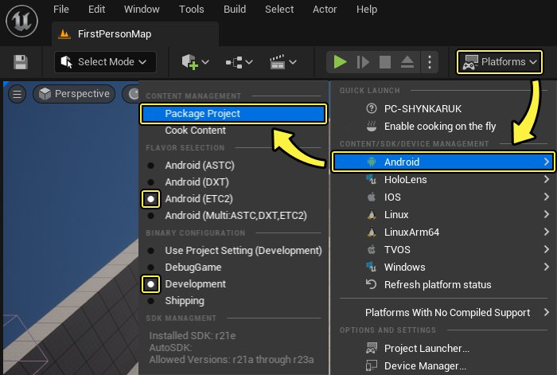
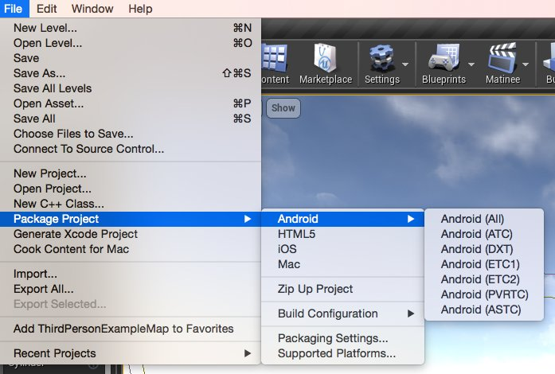
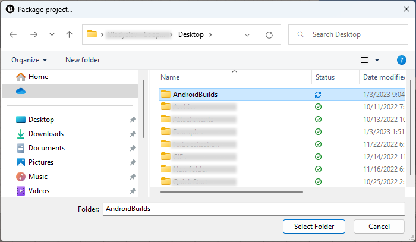
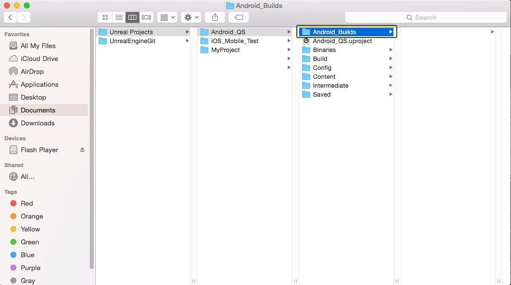
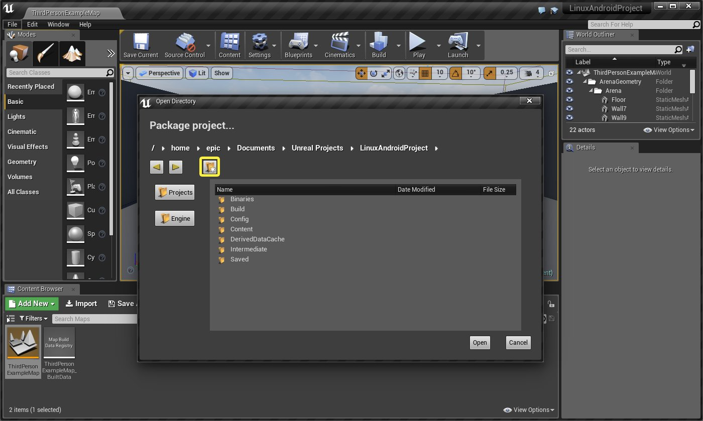
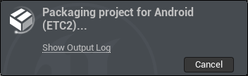
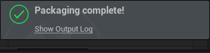

# 打包Android项目

> 路径：虚幻引擎5.7文档 / 移动端开发 / Android支持 / 打包和发布 / 打包Android项目

> 原始页面：https://dev.epicgames.com/documentation/unreal-engine/packaging-android-projects-in-unreal-engine

选择操作系统：

Windows

macOS

Linux

在本页面中，我们将了解打包 **虚幻引擎4**（UE4）项目以部署到Android设备上的方法。UE4中的Android打包流程简单易用，同时可输出多个文件，便于在手机上安装和卸载项目用于测试的项目。

## 基本设置

首先，最好满足以下要求和项目设置：

- 需在计算机上设置

  Android Studio

  。参见

  设置Android SDK和NDK

  。
- Android设备必须已启用

  开发模式（Development Mode）

  和

  USB调试（USB Debugging）

  。参见

  设置Android设备进行开发

  。
- 需配置Android的

  项目设置（Project Settings）

  ，并接受Android SDK授权协议。参见

  Android快速入门指南

  。

若尚未创建项目，使用 **第三人称模板** 进行创建，并将 **目标平台（Target Platform）** 设为 **移动设备（Mobile）**，同时将质量设为 **可伸缩（Scalable）**。

## 1.打包项目

本章中将介绍如何将项目打包为 `.APK` 文件。

> [!NOTE]
> 在示例中，打包配置被设置为 **开发（evelopment）** 以便测试此游戏。但当游戏开发完成时，你可以使用 **发布（Shippin）** 配置来打包它。找到 **平台（Platforms）> Android** 并选择 **发布（Shippin）** 即可将打包配置设置为"发布"。

1. 在 **文件（File）** 菜单中，前往 **打包项目（Package Project）> Android**，并选择要打包的纹理格式。由于所有设备均支持Android **ETC2**，因此本例中使用此格式。

   

   点击查看大图

   

   

   点击查看大图

   > [!NOTE]
   > 不同设备支持不同纹理格式，具体基于其应用的硬件。欲了解各类格式详情，参见[Android开发参考](../../developing-guides-for-android/android-development-basics/index.md)。

   | **格式** | **描述** |
   | --- | --- |
   | **ETC2** | 所有OpenGL 3.x 类型的设备都支持，并且支持alpha压缩。 |
   | **DXT** | 受Nvidia Tegra GPU支持。支持alpha压缩。 |
   | **ASTC** | 最新的纹理压缩格式，通过指定块大小，允许对质量进行更多控制。支持alpha压缩。目前可在部分设备上使用。 |

   > [!NOTE]
   > 如果你用的是老版本虚幻引擎，你还能访问以下格式。
   >
   > | **Format** | **说明** |
   > | --- | --- |
   > | **ETC1** | 基于Android的所有设备均支持该格式，但其无法压缩透明纹理（未压缩保存）。若需要透明度来获得更好压缩效果，建议使用RGB和单独的透明纹理。 |
   > | **ETC1a** | ETC1用于非透明纹理，ETC2用于透明纹理。若设备不支持ETC2，透明纹理将在运行时解压到RGBA中。此格式可在ETC1和ETC2设备上使用，但相较于ETC2，非透明纹理的ETC1质量可能偏低。 |
   > | **ATC** | Qualcomm Adreno GPU支持此格式，其支持透明压缩。 |
   > | **PVRTC** | PowerVR GPU支持此格式，其支持透明压缩。 |
2. 将弹出提示，说明打包游戏的保存位置，其应默认为项目文件夹。新建文件夹并命名为 **Android_Builds**。

   

   

   

   点击查看大图
3. 打包项目时，右下角将出现打包消息，显示打包进度。

   
4. 打包成功后，编辑器右下角将显示打包成功消息。

   
5. 找到步骤2中创建的文件夹。

   > 图片已省略：打开打包项目的文件夹

   > 图片已省略：Open folder for packaging project

   > 图片已省略：Open folder for packaging project

   点击查看大图

## 2.将打包项目部署到设备

现在项目已被打包为 `.APK` 文件，本章节中将介绍将版本部署到设备的方法。

1. 用USB线将Android设备连接到PC。若收到提示，请允许PC更改文件。
2. **双击** `Install_[ProjectName]_Development.bat` 批处理文件，将项目安装到Android设备上。

   > 图片已省略：将项目安装到Android设备

   > [!NOTE]
   > 若未使用USB线连接设备，运行 `.BAT` 文件将无任何反应。

1. 用USB线将Android设备连接到PC。若收到提示，请允许PC更改文件。
2. 打开Android_ETC2文件夹，然后 **双击** `Install_[ProjectName]_Development_armv7-es3.command` 文件，将项目安装到Android设备上。

   > [!NOTE]
   > 若未使用USB线连接设备，运行 `.command` 文件将无任何反应。

1. 用USB线将Android设备连接到PC。若收到提示，请允许PC更改文件。
2. 打开 **Android_ETC2** 文件夹，其中包含打包过程中创建的文件。

   > 图片已省略：undefined

   点击查看大图

   此处有 **Installation** 和 **Uninstallation** shell脚本（*.sh），以及包含将项目安装到Android设备（支持ETC1压缩方案）所需全部文件的Android应用程序包（*.apk）。
3. 在文件夹中点击右键并选择 **在终端中打开（Open in Terminal）**，从该文件夹的位置打开终端。

   > 图片已省略：undefined

   点击查看大图
4. 在终端中输入 `./Install_LinuxAndroidProject_Development-arm64.es2.sh`，将项目安装到Android设备。

   > 图片已省略：undefined

   点击查看大图

   > [!NOTE]
   > 若运行shell脚本时遭遇问题，尝试在终端中输入 `adb devices`，验证设备是否已连接到计算机。
5. 在安装过程中，shell脚本应将以下输出发送到终端

   > 图片已省略：undefined

   点击查看大图

   > [!NOTE]
   > Shell脚本完成安装进程后，将出现 **安装成功** 消息。

完成本教程后，项目应显示在Android设备上，如下图所示：

> 图片已省略：Example of installed game on phone

点击查看大图

此外，你将拥有打包的.APK文件和随附助手程序，以将其部署到其他设备进行测试。

## 打包App Bundle

**Android App Bundle** 是Google提供的一种发布格式，可用作打包 `.APKs` 的替代方案。你可以创建一个Android App Bundle（`.aab`），然后将其上传到 **Google Play商店**，而无需为不同的设备子集创建不同的 `.APKs`。然后，商店的动态发布系统使用App Bundle的内容生成 `.APKs`，该文件在用户下载应用程序时，针对用户的特定设备进行优化。

除了大幅简化维护Google Play商店中的构建所涉及的工作之外，App Bundle编译可以发布最大150 MB的 `.APKs`，而非以前的100 MB。此限制适用于最终 `.APK`，而不是用于生成.apk的App Bundle。

要创建App Bundle构建（build），请打开 **项目设置（Project Settings）**，然后找到 **平台（Platforms）> Android** 分段。在 **App Bundle** 分段中，启用 **生成束（AAB）（Generate Bundle (AAB)）**。

> 图片已省略：Enable Generate Bundle

点击查看大图

现在，当你打包Android项目时，你将生成 `.aab` 文件，上传到Google Play。你还将生成用于测试目的的通用 `.apk`。

> [!WARNING]
> 因为Google Play商店的限制，Android App Bundle不能用 `.obb` 文件发布。

借助可用于配置App Bundle构建的其他设置，你可以微调App Bundle用于生成项目最终 `.apks` 时的敏感度。

| 设置 | 说明 |
| --- | --- |
| **从Bundle生成通用APK（Generate Universal APK from Bundle）** | 启用此设置将允许App Bundle为最终用户生成通用的.apk文件，该文件可以在任何类型的设备上运行。这不会影响为在计算机上进行测试而生成的通用.apk。 |
| **启用ABI拆分（Enable ABI Split）** | App Bundle将基于用户CPU使用的应用程序二进制接口生成单独的.apks。例如：arm64-v8a、x86、x86_64。 |
| **启用语言拆分（Enable language split）** | App Bundle将基于用户的语言生成单独的.apks。 将仅下载用户本地化用的字符串。 |
| **启用密度拆分（Enable density split）** | App Bundle基于图像分辨率和DPI生成单独的.apks。将仅下载与用户设备兼容的图标和启动屏幕。 |

例如，如果你启用ABI拆分但禁用语言拆分，则 `.aab` 会根据用户设备的兼容ABI为用户设备量身定制最终 `APK`，但是每个用户都将收到所有语言的资源，无论其设备或语言设置如何。

默认设置下，最终的 `.apk` 将拥有最小的尺寸，而禁用这些设置则会产生较大的 `.APKs`。

有关如何将 `.APKs` 或 `.AABs` 上传到Google Play商店的信息，请参阅[Android发布](../index.md)。
