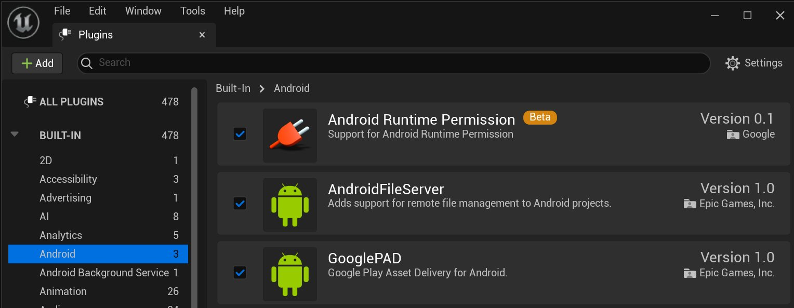
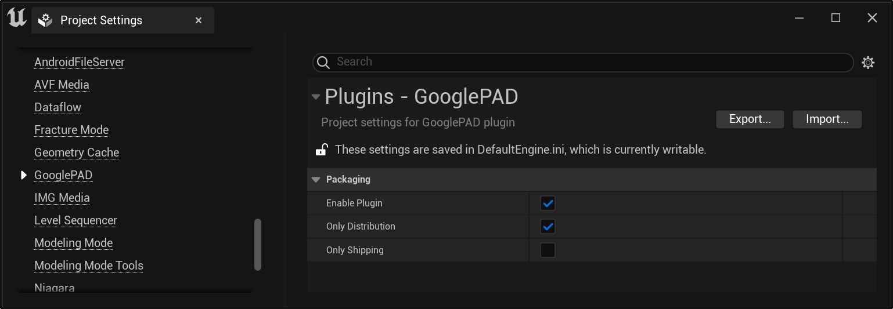
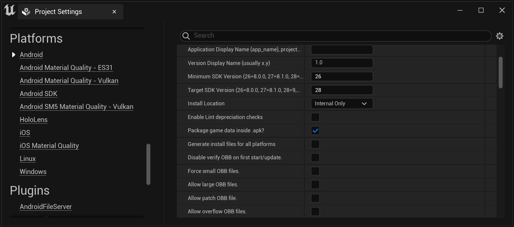
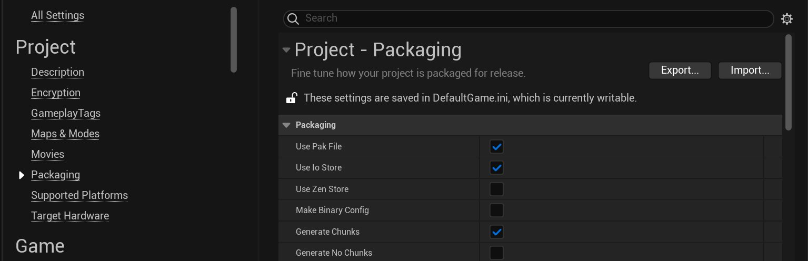
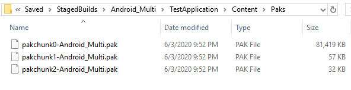

# Google Play资产交付参考

> 路径：虚幻引擎5.7文档 / 移动端开发 / Android支持 / 打包和发布 / Google Play资产交付参考

> 原始页面：https://dev.epicgames.com/documentation/unreal-engine/using-google-play-asset-delivery-in-unreal-engine

**Google Play Asset Delivery（Google PAD）** 是Google Play商店的解决方案，用于将资产包安装到设备上后将其交付给应用程序。此解决方案设计为与 **Android App Bundle** 发布格式一起使用。App Bundle为最终用户发布自定义.apk，处理初始安装的代码和二进制文件，而Play Asset Delivery系统则独立于.apk提供模型、纹理、声音、着色器和其他大型资产文件。这样，通过Google Play发布的应用就可通过按需交付内容管理内容占用空间。

有关Google Play资产交付的更多详情，请参阅Android官方文档：https://android-developers.googleblog.com/2020/06/introducing-google-play-asset-delivery.html]。

**虚幻引擎4.25** 及更高版本支持通过插件集成Google PAD，使此系统易于在自己的项目中执行。此插件提供了一个函数库，用于管理下载以及从Play Asset交付系统请求信息。C++和蓝图均提供了 `UGooglePADFunctionLibrary` 。

> [!NOTE]
> 欲了解通过Android App Bundle的更多信息，参见[Android项目打包](../packaging-android-projects/index.md)。

## 启用Google PAD插件

GooglePAD插件默认启用，可在虚幻引擎的 **插件（Plugins）** 窗口中的 **Android** 分段下将其禁用。要使用GooglePAD，你还必须使用Android App Bundle为打包格式。



要完全启用该插件，打开 **项目设置（Project Settings）** 并找到 **插件（Plugins）** > **GooglePAD** > **打包（Packaging）** 。单击 **启用插件（Enable Plugin）** 复选框，该模块将在Android项目启动时可用。



若要将Google PAD用于 **安装时（install-time）** 资产，则还需找到 **平台（Platforms）** > **Android** > **APK打包（APK Packaging）** ，并禁用 **在APK内打包数据（Package data inside APK）** 。main .obb文件然后会作为安装时资产包自动交付。



点击查看大图

## 创建资产包

Google PAD的 **资产包** 封装在Android App Bundle构建中，并在上传时由Google Play商店管理。本部分介绍如何打包和整理资产包，以便包含在App Bundle中。

### 资产包交付模式

**数据块（Chunks）** 是虚幻引擎用于整理外部资产的格式。数据块0（Chunks 0）代表游戏的基础安装，而所有其他数据块都是.pak文件，其中包含游戏主安装之外的资产。

要使用Google PAD，你必须将游戏的资产分组为数据块，然后根据你要使用的交付模式将这些数据块分组为资产包。Google Play Asset Delivery支持以下资产包交付模式：

| 交付模式 | 文件大小限制（每个资产包） | 说明 |
| --- | --- | --- |
| **安装时间（Install-Time）** | 1 GB | 安装时交付的资产包。项目中的主要.obb会自动捆绑到此资产包中。 |
| **快速跟进（Fast-Follow）** | 512 MB | 应用程序安装后，资产包自动下载。无需打开应用程序即可下载。每个项目仅允许使用一个快速跟进资产包。 |
| **按需（On-Demand）** | 512 MB | 应用程序运行时下载的资产包。 |

你总共可以为每个应用程序创建 **50** 个资产包。每个项目仅有一个安装时间和一个快速跟进资产包，但是只要不超过此限制，你就可以使用任意数量的按需资产包。

### 创建数据块

打开 **项目设置** ，然后找到项目（Project）> 打包（Packaging），并确保启用生成块（Generate Chunks）。



打包"分段中激活"生成块"" loading="lazy" />

现在，你可以使用 **资产管理器** 或 **主要资产标签** 将资产整理为数据块。请参阅[烘焙和分块](https://dev.epicgames.com/documentation/404)页面，详细了解这些功能的用法。

指定哪些资产属于特定数据块后，则 **打包** 项目会将数据块输出为 **.pak** 文件。你可以在 `Saved\StagedBuilds[PlatformName][ProjectName]\Content\Paks` 的项目文件夹中找到文件。



点击查看大图。

### 在App Bundle构建中包含数据块

对于将数据块合并到App Bundle中时，Play Asset Deliver的每种交付模式都有不同的要求。

对于安装时间资产，你无需进行任何更改。

对于快速跟进（Fast-Follow）或按需（On-Demand）资产，请选择你要包含的.pak文件，然后将其移动到项目的 `Build/Android/gradle/assetpacks` 目录中。每种交付模式都有不同的子文件夹：

- 快速跟进（Fast-Follow）资产包必须放在 `Build/Android/gradle/assetpacks/fast-follow/[assetpackname]/src/main/assets`
- 按需（On-Demand）资产包必须放在 `Build/Android/gradle/assetpacks/on-demand/[assetpackname]/src/main/assets`

将[assetpackname]替换为捆绑数据块的目标资产包的名称。你可以使用不同的.pak文件集创建多个不同的命名资产包。但是，资产包的名称必须唯一，并且不能在快速跟进和按需之间重复使用。该名称将是你在使用API查询资产包时使用的名称。

最后，你需要在资产包文件夹中添加build.gradle文件，其中包含以下代码：

```
	apply plugin: 'com.android.asset-pack' 	def fileparts = projectDir.absolutePath.replaceAll('\\\\', '/').tokenize('/')	def assetPackName = fileparts[fileparts.size()-1]	def assetPackType = fileparts[fileparts.size()-2] 	assetPack {		packName = assetPackName		dynamicDelivery {			deliveryType = assetPackType			instantDeliveryType = assetPackType		}	} 
```

当你满足这些要求之后，再次将该项目打包为App Bundle，打包出的版本将包含所有资产包。当你将App Bundle上传到Google Play商店时，将可以使用Google PAD API下载资产包。

> [!NOTE]
> 虚幻引擎4.26中将进一步简化该工作流程。

## 排除来自OBB文件的数据块

默认情况下，.pak文件包含在与项目一起生成的OBB文件中。要排除它们，你需要打开你的 "DefaultEngine.ini " 文件，用"Android运行时设置"中的OBB过滤器过滤它们。

```
	[/Script/AndroidRuntimeSettings.AndroidRuntimeSettings]	+ObbFilters="-*pakchunk1*"	+ObbFilters="-*pakchunk2*"	+ObbFilters="-*pakchunk3*"	+ObbFilters="-*pakchunk4*"	+ObbFilters="-*pakchunk5*"	+ObbFilters="-*pakchunk6*"	+ObbFilters="-*pakchunk7*"	+ObbFilters="-*pakchunk8*"	+ObbFilters="-*pakchunk9*" 
```

在上文的示例中，OBB过滤器会捕捉所有包含这些文本的.pak文件。比如，`+ObbFilters="-*pakchunk1*"` 会忽略所有文件名称包含 "pakchunk1" 的pak文件。

## API参考

以下各节详细介绍了Google PAD函数库中的可用函数及其用法。

### 请求和错误处理

Google PAD函数库中的所有请求均会返回 `EGooglePADErrorCode` ，它会提示操作是否成功，若操作失败，它则会提示导致请求失败的具体错误。可能出现如下错误代码：

| EGooglePADErrorCode | 说明 |
| --- | --- |
| `AssetPack_NO_ERROR` | 请求没有错误。正常处理请求信息。 |
| `AssetPack_APP_UNAVAILABLE` | 请求应用程序不可用。 |
| `AssetPack_UNAVAILABLE` | 应用程序的当前版本不提供请求的资产包。 |
| `AssetPack_INVALID_REQUEST` | 请求无效。 |
| `AssetPack_DOWNLOAD_NOT_FOUND` | 找不到请求的下载。 |
| `AssetPack_API_NOT_AVAILABLE` | 资产包API不可用。 |
| `AssetPack_NETWORK_ERROR` | 由于超时或其他网络错误，无法获取有关资产包的详情。 |
| `AssetPack_ACCESS_DENIED` | 当前设备环境不允许下载，通常是因为用户未登录Google账户。 |
| `AssetPack_INSUFFICIENT_STORAGE` | 由于存储空间不足，资产包下载失败。 |
| `AssetPack_PLAY_STORE_NOT_FOUND` | 此设备没有安装Play Store应用程序，或者没有安装官方版本。 |
| `AssetPack_NETWORK_UNRESTRICTED` | 若调用了 `ShowCellularDataConfirmation` ，但没有资产包正在等待wi-fi，则返回此代码。这意味着下载可继续进行，无需等待用户确认。 |
| `AssetPack_INTERNAL_ERROR` | 下载资产包时出现未知错误。 |
| `AssetPack_INITIALIZATION_NEEDED` | 尚未调用 `AssetPackManager_init`，因此尚未启用该API。 |
| `AssetPack_INITIALIZATION_FAILED` | 初始化资产包API时出错。 |

除了此返回值之外，请求函数还具有提供所请求信息的out变量。若获取的结果为 `AssetPack_NO_ERROR` ，则可正常处理所提供信息。否则，应使用流控制适当响应提供的错误代码。

### 获取已下载文件的位置

`GetAssetPackLocation` 函数获取已下载资产包的位置，并在本地缓存相关信息。若资产可用，将输出整数句柄，该句柄可用于按需访问缓存信息。

调用 `GetAssetsPath` 并提供位置句柄，将输出带有所需资产包资产路径的字符串。 `GetStorageMethod` 将输出 `EGooglePADStorageMethod` ，指示资产包存储在用户设备上的方式。了解资产路径和存储方法后，就可使用适当的调用访问资产。

可用的存储方式如下：

| EGooglePADStorageMethod | 说明 |
| --- | --- |
| `AssetPack_STORAGE_FILES` | 资产包解压缩到包含各资产文件的文件夹。可通过标准文件API访问此类资产。 |
| `AssetPack_STORAGE_APK` | 资产包作为APK安装，其中包含已打包的资产文件。可通过AssetManager访问此类资产。 |
| `AssetPack_STORAGE_UNKNOWN` | 没有关于资产包的可用信息，很可能是由于出现错误。 |
| `AssetPack_STORAGE_NOT_INSTALLED` | 资产包未安装，因此不可用。 |

使用以上信息完成操作后，必须将位置句柄传递给 `ReleaseAssetPackLocation` ，释放缓存位置信息。

若 `GetAssetPackLocation` 返回 AsetPack_UNAVAILABLE`或 AssetPack_DOWNLOAD_NOT_FOUND` 的错误代码，则所需资产包不可用，必须下载。

### 请求关于资产包的信息

函数 `RequestInfo` 接收资产包名称的 `Tarray` ，并返回指示当前状态的 `EGooglePADErrorCode` 。无需RequestInfo启动下载，但RequestInfo可用于确定远程资产包是否有效。

### 请求或取消下载

函数 `RequestDownload` 接收字符串的 `Tarray` ，该字符串表示要下载的资产包的名称，然后向远程服务发送请求以开始下载资产包。若 `RequestDownload` 没有显示错误，则资产包将在后台下载并异步传输到应用程序。

由于此功能异步，因此 `RequestDownload` 函数不会返回有关已下载资产包的信息，只有表示请求是否成功的错误代码。必须使用下面[监视下载状态](#%E7%9B%91%E6%B5%8B%E4%B8%8B%E8%BD%BD%E7%8A%B6%E6%80%81)部分中详细介绍的函数检查下载的当前状态。要访问资产包本身，必须在下载完成后使用 `GetAssetPackLocation` 。

函数 `CancelDownload` 也使用资产包名称列表，并将取消下载指定的资产包。

### 获取蜂窝数据状态

函数 `ShowCellularDataConfirmation` 将提示用户是否要使用蜂窝网络下载数据。若提示已存在，则可使用GetShowCellularDataConfirmationStatus返回 `EGooglePADCellularDataConfirmStatus` ，指示用户是否已批准下载。

结果为 `AssetPack_CONFIRM_UNKNOWN` 和 `AssetPack_CONFIRM_PENDING` 表示用户尚未获得批准，申请在获得批准前待定。

结果为 `AssetPack_CONFIRM_USER_CANCELLED` 表示用户已选择不允许使用蜂窝数据，此时不允许下载。

结果为 `AssetPack_CONFIRM_USER_APPROVED` 表示用户已明确同意使用蜂窝数据，将允许下载继续。此外，若此函数返回结果为 `AssetPack_NETWORK_UNRESTRICTED` 的 `EGooglePADErrorCode` ，则该用户已连接wi-fi网络，无需使用蜂窝网络数据，因此将允许下载，而无需继续查看此函数。

### 监测下载状态

`GetDownloadState` 将在本地缓存资产包的下载状态，并返回提供缓存信息访问权限的下载句柄。此函数接收要下载资产包的名称，并将句柄输出为整数。应保持缓存下载句柄，以便可继续监视下载，否则，需要重新获取。

借助有效的下载句柄，可调用 `GetDownloadStatus` 将所需资产包的状态以 `EGooglePADDownloadStatus` 返回。此枚举包含若干种状态，分别表示下载的不同状态，详情如下：

| EGooglePADDownloadStatus | 说明 |
| --- | --- |
| `AssetPack_UNKNOWN` | 目前没有资产包的任何已知信息。 |
| `AssetPack_DOWNLOAD_PENDING` | 已提出下载资产包的异步请求，该请求当前正在待处理中。 |
| `AssetPack_DOWNLOADING` | 资产包下载当前正在进行中。 |
| `AssetPack_TRANSFERRING` | 资产包正在传输到应用程序。 |
| `AssetPack_DOWNLOAD_COMPLETED` | 下载和传输均已完成，资产现在可用于该应用程序。 |
| `AssetPack_DOWNLOAD_FAILED` | 下载资产包的请求失败。 |
| `AssetPack_DOWNLOAD_CANCELED` | 下载资产包的请求已取消。 |
| `AssetPack_WAITING_FOR_WIFI` | 资产包下载正等待wi-fi带宽继续。 |
| `AssetPack_NOT_INSTALLED` | 当前未安装资产包。 |
| `AssetPack_INFO_FAILED` | 请求有关资产包的信息失败。 |
| `AssetPack_REMOVAL_PENDING` | 已提出删除资产包的异步请求，该请求当前正在待处理中。 |
| `AssetPack_REMOVAL_FAILED` | 删除资产包的异步请求失败。 |

还可使用下载状态句柄调用 `GetBytesDownloaded` （返回当前下载到用户设备的字节数）和 `GetTotalBytesToDownload` （返回下载的总目标大小）。

使用下载状态信息完成后，必须调用 `ReleaseDownloadState` 并提供句柄，从内存释放缓存的下载信息。

### 删除资产包

函数 `RequestRemoval` 接收资产包名称，并以异步方式从用户设备删除指定资产包。如上所述，可使用 `GetDownloadStatus` 监视资产包的删除状态。

## 推荐的实现

Google PAD API的实现可以建模成不同状态的循环，每个状态对应一个下载。

| 状态 | 说明 |
| --- | --- |
| **正在访问资产包（Accessing Asset Pack）** | 使用 `GetAssetPackLocation` 检查是否已经下载资产包。应先运行此函数，避免尝试下载已有资产。 使用 `GetAssetsPath` 和 `GetStorageMethod` 确定适用于资产包的文件路径和访问方法。 必须调用 `ReleaseAssetPackLocation` 为资产包的缓存位置释放内存。 |
| **正在启动下载（Initiating Download）** | 若所需资产包在本地不可用，请调用 `RequestDownload` 启动下载。 若出现连接问题，则可能需要重复执行 `RequestDownload` 直到成功。 |
| **正在检查蜂窝数据确认（Checking for Cellular Data Confirmation）** | 使用 `ShowCelllarDataConfirmation` 确保应用程序具有继续下载的权限。 在出现初始蜂窝数据确认提示后，使用 `GetShowCellularDataConfirmationStatus` 输出提示的当前状态。这将在 `Tick` 函数中持续出现，直到取消或确认提示。 |
| **正在监视下载状态（Monitoring Download Status）** | `RequestDownload` 成功运行后，使用 `GetDownloadState` 缓存下载状态并获取句柄访问。此函数仅需调用一次，只要你需要使用它，就请缓存该句柄。 使用 `GetBytesDownloaded` 和 `GetTotalBytesToDownload` 查看下载进度。`GetBytesDownloaded` 将在标记后持续运行，直到停止监视进度为止。 使用 `GetDownloadStatus` 确定具体的下载状态。此外，它还应该在Tick中持续被监测。状态返回 `AssetPack_DOWNLOAD_COMPLETED` 时，你可以停止监测下载状态并访问资产包。 完成后，必须调用 `RelaseDownloadState` 释放用于缓存下载状态的内存。 |

在自定义 **GameState** 类中执行解决方案即可连续跟踪下载，即使更改场景和游戏模式也是如此。或者，可能想要在启动时加载的前端游戏模式中执行解决方案，以便在启动游戏之前执行必要的补丁程序和更新。解决方案的具体细节将取决于项目具体的资产更新需求。
