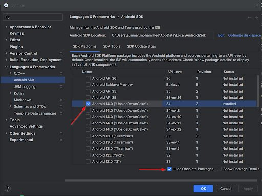
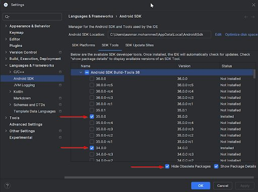
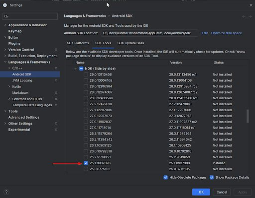

# Android多视图

> 路径：虚幻引擎5.7文档 / 移动端开发 / 汽车HMI开发 / Android多视图

> 原始页面：https://dev.epicgames.com/documentation/unreal-engine/android-multiview-in-unreal-engine

## 为虚幻引擎设置Android

要成功打包ASIS（安卓单实例服务），你需要先设置Android SDK和NDK。 虚幻引擎（UE）会使用Android Studio和Android SDK命令行工具下载并安装在开发Android项目时所需的Android SDK组件。 详情请参阅下方文档：

- [设置Android SDK和NDK](../../android-support/getting-started-and-setup-for-android-projects/set-up-android-sdk-ndk-and-android-studio-using-turnkey/index.md) - 安装Android Studio并自动添加SDK组件。

如果你使用的是虚幻引擎5.5.x，请启用下列SDK平台和工具：







## 从模板创建项目

安装Android SDK/NDK后，就可以设置ASIS模板插件了。 该插件以独立压缩包的形式提供，因此你需要手动准备虚幻引擎源代码。

## 获取UE5.*源代码

拉取虚幻引擎5主版本的最新源代码（从Perforce或Github）

Perforce：

- [使用Perforce访问虚幻引擎](../../../get-started/onboarding-licensees/accessing-unreal-engine-with-perforce/index.md)

GitHub：

- [从GitHub下载虚幻引擎源代码](../../../get-started/install/downloading-source-code/index.md)

## 设置ASIS插件

### 若使用Perforce：

1. 前往ASIS插件文件夹： `UE5_Main\Engine\Restricted\NotForLicensees\Plugins\AndroidSingleInstanceService`
2. 在 `AndroidSingleInstanceService`文件夹中，打开`Templates`文件夹： `UE5_Main/Engine\Restricted\NotForLicensees\Plugins\AndroidSingleInstanceService\Templates\`

### 若使用GitHub：

解压Epic提供的压缩包，将复制ASIS插件内容复制到：`Engine\Restricted\NotForLicensees\Plugins\AndroidSingleInstanceService`

### 复制模板

将**TP_HMI_ASIS**文件夹复制到**UE5/Templates/**

然后复制下列代码到**UE5_Main/Templates/TemplateCategories.ini**

C++

```
Categories=(Key="HMI", LocalizedDisplayNames=((Language="en",Text="Automotive\nHMI &\nVehicle Cockpit using Android Single Instance Service")), LocalizedDescriptions=((Language="en",Text="Find templates for automotive vehicle cockpit using Android Single Instance Service"), Icon="TP_HMI_ASIS/Media/AutomotiveHMI_2x.png", IsMajorCategory=true)
```

运行虚幻编辑器。 这时再打开虚幻引擎项目浏览器，应该就能看到新的HMI模板：

## 从HMI模板创建项目

项目应该如下所示：

## 将ASIS插件添加至现有项目

如果你需要为现有项目添加ASIS插件，请执行以下步骤：

1. 在插件设置中启用ASIS
2. 添加重映射插件目录。 将下列代码添加到{ProjectName}/Config/DefaultGame.ini

   C++

   ```
   [Staging]+RemapDirectories=(From="Engine/Restricted/NotForLicensees/Plugins/AndroidSingleInstanceService", To="Engine/Plugins/Runtime/AndroidSingleInstanceService")+RemapDirectories=(From="Engine/Restricted/NotForLicensees/Plugins/Experimental/MultiWindow", To="Engine/Plugins/Experimental/MultiWindow")
   ```
3. 打开你的项目并启用如下ASIS插件设置

### 打包并运行ASIS示例

在虚幻引擎中设置Android SDK/NDK和模板后，我们就可以将项目打包为Android应用程序：

## 应用程序通信

有了虚幻引擎所打包的应用程序，我们将使用一个示例客户端应用程序与虚幻引擎APK展开通信

虚幻引擎的项目包包含3个构件。

1. 使用Android服务的APK。 其位于在项目打包对话框过程中选定的文件夹。
2. 客户端应用程序所用的ASIS辅助库。

   C++

   ```
   Binaries/Android/aars├── asisclientlib-1.0.1-debug.aar├── asisclientlib-1.0.1-debug.jar├── asiscommon-1.0.1-debug.aar
   ```
3. 与服务通信的客户端应用程序示例。 其位置不在被打包的虚幻项目中，而是位于虚幻引擎项目的Binaries文件夹中。 具体位置为**\Unreal Projects\*Project_Name*\Binaries\Android**

你可以使用Android Studio打开该Android项目。 打开时，它将自动走完Android编译流程。

你也可以使用命令行。

你可以使用命令提示符生成客户端APK

C++

```
cd {Project_Name}\Binaries\Android\ExampleUseCase_{Project_Name}\gradlew assembleDebug
```

APK的生成位置为： `{Project_Name}\Binaries\Android\ExampleUseCase_{Project_Name}\app\build\outputs\apk\debug\app-debug.apk`

回到Android Studio中，选定Android设备后，按**Shift** + **F10**，或点击顶部菜单上的绿色运行按钮，即可运行该应用程序

### 安装服务后

现在请将虚幻引擎的APK文件安装到设备上。 你可以使用虚幻引擎项目包文件夹中的命令行运行adb命令

在Android应用程序中，选择激活视图1（Activate View1）、视图2（Activate View2）和视图3（Activate View3），即可查看Android服务与虚幻引擎应用程序展开通信的情况

### 启用多视图

多视图功能从虚幻引擎5.6开始可用。 启用多视图功能要求你启用AndroidSingleInstanceService插件。 请先执行启用ASIS所需的步骤，然后从这里开始。

**启用**插件设置中的**多视图（Multiview）**插件。

在关卡中创建两个摄像机，以测试多视图。 本示例将使用TP_HMI_Automotive。

接下来，请打开关卡蓝图。 为蓝图添加摄像机Actor。 拖出Camera Actor节点并选择"获取摄像机视图（Get Camera View）"。 然后删除Get Camera节点。我们只需要摄像机组件对象引用。

然后创建`Register Camera for Asis`。 将摄像机对象节点连接到对应的节点。 确保将各个摄像机对应的摄像机ID设为1和2。 将执行引脚连接到**事件开始运行（Event Begin Play）**。

为Android打包项目。

现在我们在Android Studio中打开客户端应用程序。 打开客户端的示例Android应用程序项目。 其位置不在被打包的虚幻项目中，而是位于虚幻引擎项目的Binaries文件夹中。 客户端应用程序的源代码位置为： `{Project_Name}\Binaries\Android\ExampleUseCase_{Project_Name}\`

然后，从标准ASIS切换到MultiviewEdit。

编辑`Binaries\Android\ExampleUseCase_{Project_Name}\app\src\main\AndroidManifest.xml`，将游戏活动变为**ActivityForMultiView**的第22行。

回到Android Studio中，连接Android设备后，按Shift + F10，或点击顶部菜单上的绿色运行按钮，即可运行该应用程序。

安装服务后

现在请将虚幻引擎的APK文件安装到设备上。 你可以使用虚幻引擎项目包文件夹中的命令行运行adb命令。

选择附加/分离视图1（Attach/Detach View1）和附加/分离视图2（Attach/Detach View2）以查看各摄像机。 现在ASIS可以在Android上使用多视图功能了。

### 架构概述

支持的方法

### 界面说明

`ASISConnection`类

该类允许与ASIS服务建立连接和通信。 它封装了这种通信的复杂性，并为发送和接收数据和命令提供了一个易用的接口。

`ASISConnection.ASISConnectionCallBacks`接口定义了ASISConnection事件的回调。 当你需要处理连接成功事件时，请实现此接口。

Java

```
public interface ASISConnectionCallBacks{void onConnectionSuccess();void onServiceDisconnected();}
```

`onConnectionSuccess()` - 在成功建立服务连接时调用。

`onServiceDisconnected()` - 在与服务的连接丢失时调用

`ASISConnection.EngineMessagesListener`接口定义了引擎消息的监听器。 当你需要处理来自引擎的消息时，请实现此接口。

Java

```
public interface EngineMessagesListener{void onEngineMessage(Message message);}
```

`onEngineMessage(Message message)` - 在收到来自引擎的消息时调用。

`Message` - 传入消息的值

`ASISConnection.ConnectionBuilder`类

该类实现了创建`ASISConnection`实例的编译器的设计模式。 该类采用了流畅的风格，支持方法链式调用，从而在需要用到多个参数时提高可读性。

Java

```
ConnectionBuilder(Context ctx)
```

使用给定的上下文初始化一个新的 `ConnectionBuilder` 类实例。

参数

- `ctx` - 创建ConnectionBuilder所用的上下文。

Java

```
public ConnectionBuilder withConnectionListener(ASISConnectionCallBacks connectionListener)
```

为ASISConnection设置ASISConnectionCallBacks监听器。

参数

- `connectionListener` - 需设置的ASISConnectionCallBacks监听器。

返回

- ConnectionBuilder示例，用于链式调用方法。

Java

```
public ConnectionBuilder withEngineMessageListener(EngineMessagesListener engineMessageListener)
```

设置ASISConnection的EngineMessagesListener。

参数

- `engineMessageListener` - 需设置的EngineMessagesListener监听器。

返回

- ConnectionBuilder示例，用于链式调用方法。

Java

```
public ConnectionBuilder withConnectionId(String connectionID)
```

设置ASISConnection的connectionID。

参数

- `connectionID` - connectioID的字符串

返回

- ConnectionBuilder示例，用于链式调用方法。

Java

```
public ConnectionBuilder withServicePackageName(String packageName)
```

重载默认服务包名称

参数

- `packageName` - 服务包名称（com.epicgames.PROJECTNAME）

返回

- ConnectionBuilder示例，用于链式调用方法。

Java

```
public ConnectionBuilder withServiceClassName(String className)
```

重载默认服务类名称

参数

1. `className` - 服务类名（com.epicgames.makeaar.UnrealSharedInstanceService）

返回

- ConnectionBuilder示例，用于链式调用方法。

Java

```
public ConnectionBuilder withObbModuleName(String obbModuleName)
```

重载默认obbModuleName

参数

- obbModuleName - 内容obb名称（虚幻引擎项目名称）

返回

- ConnectionBuilder示例，用于链式调用方法。

C++

```
public ConnectionBuilder withInsightsTracing()
```

启用InsightsTracing

返回

- ConnectionBuilder示例，用于链式调用方法。

Java

```
public ConnectionBuilder withCommandLineArgs(String cmdArgs)
```

重载默认命令行参数

参数

1. cmdArgs - 启用虚幻引擎的命令行参数

返回

- ConnectionBuilder示例，用于链式调用方法。

Java

```
public ConnectionBuilder withOverridePropagateAlpha(boolean value)
```

重载默认的移动传播Alpha值

参数

- `value` - 重载移动传播Alpha值

返回

- ConnectionBuilder示例，用于链式调用方法。

Java

```
public ASISConnection build()
```

使用所设参数编译ASISConnection实例。

返回

- 新的ASISConnection实例。

示例：

Java

```
public class UseServiceActivity extends Activity
     implements ASISConnection.ASISConnectionCallBacks,
   ASISConnection.EngineMessagesListener
....
ASISConnection mServiceConnection ;
...

mServiceConnection = new ASISConnection.ConnectionBuilder(this)					.withServicePackageName("com.epicgames.UE_PROJECT")
		.withObbModuleName("UE_PROJECT")
		.withConnectionListener(this)
```

Java

```
ASISConnection(ConnectionBuilder builder)
```

使`ConnectionBuilder`成为argument.ConnectionBuilder的构造函数

此构造函数通常通过`ConnectionBuilder`的`build()` 方法使用。

Java

```
public boolean bindToUnrealInstanceService()
```

由给定调用者绑定至一个虚幻Android单实例服务。

返回

- 绑定成功则为`true`，否则为false。

Java

```
public void unbindToUnrealInstanceService()
```

与虚幻实例服务解除绑定。

Java

```
public boolean isBoundToService()
```

检查应用程序当前是否被绑定至该服务。

返回

- 如果应用程序被绑定至该服务，则返回true。

Java

```
public int attachSurfaceToService(int displayIndex, Surface externalSurface)
```

将外部表面附加至服务中，以进行渲染。

参数：

- displayIndex：显示屏的索引。0即单个显示器。
- externalSurface：待附加的表面。

返回：

- 被附加表面的ID。

Java

```
public boolean detachSurfaceFromService(int attachId, Handler.Callback callback)
```

根据附加的ID解绑表面与服务。

参数：

- attachId：解绑表面所用的附加ID。
- callback：解绑完成后需调用的回调。

返回

- 解绑初始化成功则为true，否则为false。

Java

```
public boolean sendData(String key, Object value)
```

此方法允许你向ASIS服务发送键值数据。

参数

- key：代表所发送数据的键的字符串。
- value：待发送的数据片段。

返回

- 此方法会返回布尔值，以表示数据发送是否成功。

Java

```
public boolean consoleCommand(String consoleCommand)
```

向连接的服务发送控制台命令。

参数

- consoleCommand：控制台命令的字符串。

返回

- 如果消息发送成功，则返回true。

Java

```
public boolean sendTouchEvent(MotionEvent event, int attachId)
```

从附加的表面向服务转发接触事件。

参数

- event：代表接触事件的Android MotionEvent。
- attachId：表面所关联的ID。

返回

- 如果接触事件发送成功则为true，否则为false。

### Android应用程序集成

将ASIS java库导入到你的项目。

- 将来自于{Project_Name}\Binaries\Android\aars的被生成库复制到你的应用程序空间中（例如库中）

C++

```
{Android_app}/libs├── asisclientlib-1.0.1-debug.aar├── asisclientlib-1.0.1-debug.jar├── asiscommon-1.0.1-debug.aar└── asiscommon-1.0.1-debug.jar
```

- 通过build.gradle向库添加导入项

Java

```
android {
 	...
	repositories {
		flatDir { dirs 'libs' }
	}
...
}

def asiscommonVersion = "1.0.1"
def asisclientlibVersion = "1.0.1"
```

应用程序活动生命周期的序列图表如下：
