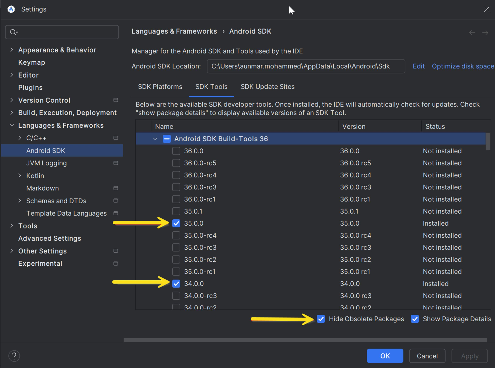
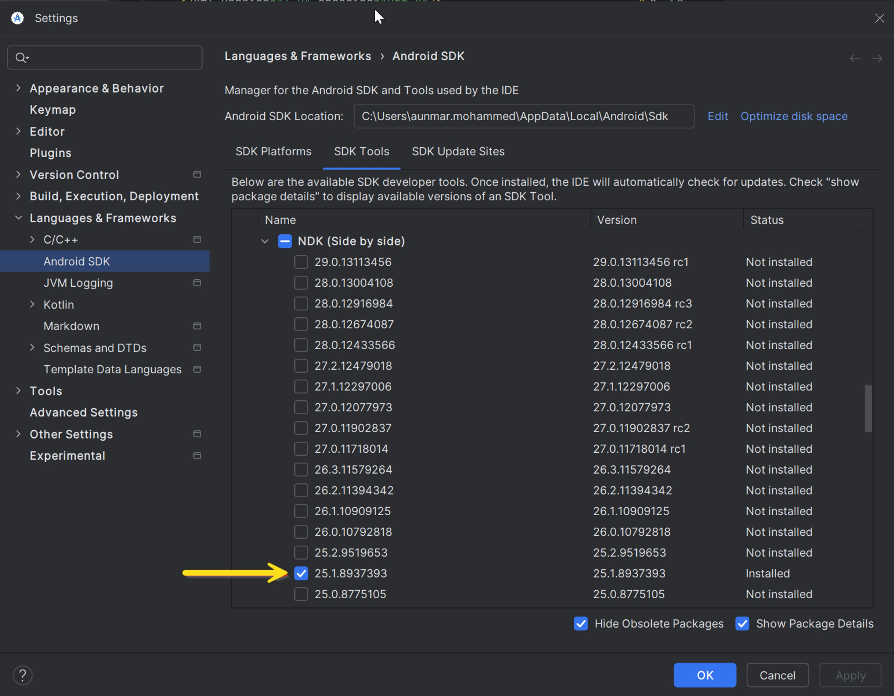
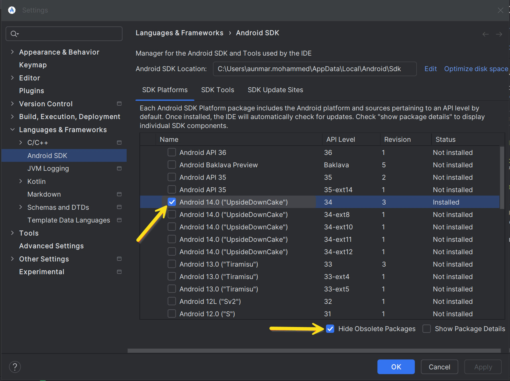
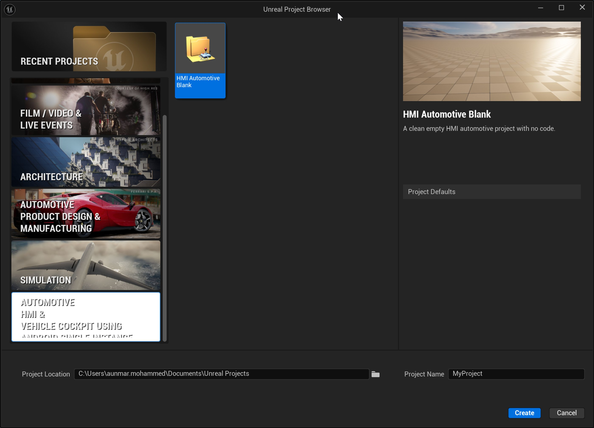
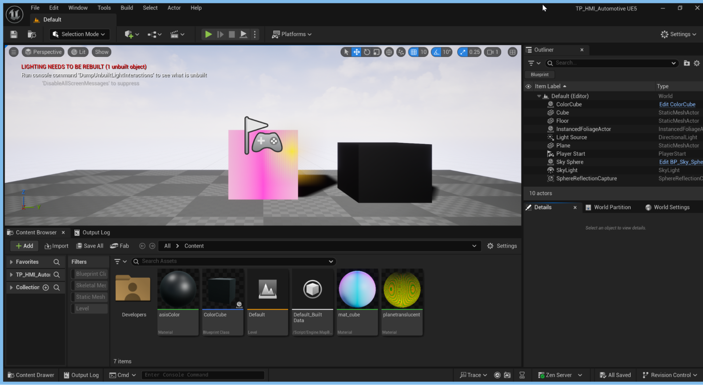
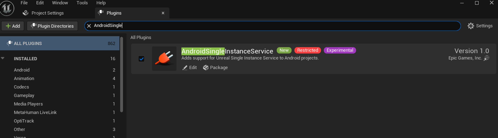
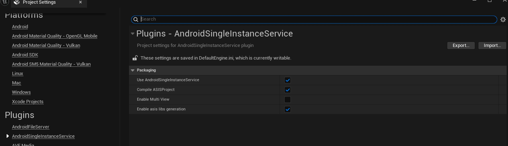
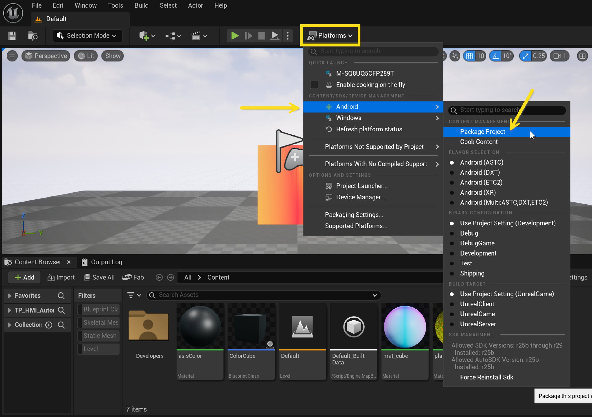

# 设置Android单实例服务

> 路径：虚幻引擎5.7文档 / 移动端开发 / 汽车HMI开发 / Android单实例服务 / 设置Android单实例服务

> 原始页面：https://dev.epicgames.com/documentation/unreal-engine/setting-up-android-single-instance-service-in-unreal-engine

本指南介绍了如何在虚幻引擎中设置Android单实例服务（ASIS），以及如何将虚幻引擎项目作为Android应用程序进行创建、打包和运行。

## 设置Android SDK和NDK

要设置ASIS，你必须首先在虚幻引擎中设置Android软件开发工具包（SDK）以及Android原生开发工具包（NDK）。 虚幻引擎会使用Android Studio和Android SDK命令行工具下载并安装开发Android项目所需的Android SDK组件。

要设置Android SDK和NDK，请执行以下步骤：

1. 请执行 [设置Android SDK和NDK](../../../android-support/getting-started-and-setup-for-android-projects/set-up-android-sdk-ndk-and-android-studio-using-turnkey/index.md) 页面上的步骤。
2. 如果你使用的是虚幻引擎5.5或更高版本，请启用以下SDK平台和工具：

   1. **SDK工具（SDK Tools）** > **Android SDK Build-Tools 36** > **35.0.0**和**34.0.0**

      
   2. **SDK工具（SDK Tools）** > **NDK（并行）（NDK (Side by side)）** > **25.1.8937393**

      
   3. **SDK平台（SDK Platforms）** > **Android 14.0 ("UpsideDownCake")**，API级别（API Level）34

      

## 从ASIS模板新建项目

安装Android SDK和NDK后，你就可以设置ASIS模板插件了。 该插件以独立压缩包的形式提供，因此你需要手动准备虚幻引擎源代码。

### 获取虚幻引擎源代码

在Perforce或Github上拉取虚幻引擎5主版本的最新源代码。 如需详细了解如何搭配虚幻引擎使用Perforce和Github，请参阅以下资源：

- [使用Perforce作为源码管理软件](../../../../production-pipeline/collaboration-and-version-control/using-perforce-as-source-control/index.md)
- [如何使用虚幻引擎5 - Perforce](https://www.perforce.com/blog/vcs/how-use-unreal-engine-5-perforce)
- [在GitHub上访问虚幻引擎源代码](https://www.unrealengine.com/en-US/ue-on-github)
- [下载虚幻引擎源代码](../../../../get-started/install/downloading-source-code/index.md)
- [从源代码编译虚幻引擎](../../../../get-started/install/downloading-source-code/building-unreal-engine-from-source/index.md)

### 设置ASIS插件

1. 前往ASIS模板文件夹。

1. 前往ASIS模板文件夹。

   1. 如果你使用Perforce，请前往 `UE5_Main\Engine\Restricted\NotForLicensees\Plugins\AndroidSingleInstanceService\Templates\`
   2. 如果你使用GitHub，请访问`ue5-main`分支并前往`ue5-main\Engine\Restricted\NotForLicensees\Plugins\AndroidSingleInstanceService`。
2. 将**TP_HMI_ASIS** 文件夹复制到`UE5_Main\Templates\`（Perforce）或 `ue5-main\Templates\`（GitHub）。
3. 复制下列代码并将其粘贴至 `UE5_Main\Templates\TemplateCategories.ini`（Perforce）或`ue5-main\Templates\TemplateCategories.ini`（GitHub）：

   C++

   ```
   Categories=(Key="HMI", LocalizedDisplayNames=((Language="en",Text="Automotive\nHMI &\nVehicle Cockpit using Android Single Instance Service")), LocalizedDescriptions=((Language="en",Text="Find templates for automotive vehicle cockpit using Android Single Instance Service"), Icon="TP_HMI_ASIS/Media/AutomotiveHMI_2x.png", IsMajorCategory=true)
   ```
4. 运行**虚幻编辑器**。 这时虚幻项目浏览器应该显示一个新的HMI模板：

   
5. 点击**创建（Create）**。 此项目应如下方截图所示：

   

为现有项目添加ASIS插件

## 为现有项目添加ASIS插件

如果你需要为现有项目添加ASIS插件，请执行以下步骤：

1. 转到 **编辑（Edit）** > **插件（Plugins）**并启用 **AndroidSingleInstanceService**。

   
2. 复制下列代码并将其粘贴到 `{Project_Name}/Config/DefaultGame.ini` 文件中：

   Config

   ```
   [Staging]+RemapDirectories=(From="Engine/Restricted/NotForLicensees/Plugins/AndroidSingleInstanceService", To="Engine/Plugins/Runtime/AndroidSingleInstanceService")+RemapDirectories=(From="Engine/Restricted/NotForLicensees/Plugins/Experimental/MultiWindow", To="Engine/Plugins/Experimental/MultiWindow")
   ```
3. 在虚幻引擎中，前往**编辑（Edit）** > **项目设置（Project Settings）**。
4. 在**插件（Plugins）** > **AndroidSingleInstanceService**下，启用如下设置：

   

   1. **编译ASIS项目（Compile ASISProject）**
   2. **启用ASIS库生成（Enable asis libs generation）**
   3. **使用Android单实例服务（Use AndroidSingleInstanceService）**

## 打包并运行ASIS项目

为虚幻引擎项目设置ASIS后，你可以将该项目打包并作为Android应用程序运行。

要将ASIS项目打包为Android应用程序，请执行以下步骤：

1. 在主工具栏中，点击**平台（Platforms）** > **Android** > **打包项目（Package Project）**。

   
2. 检查**输出日志（Output Log）** 并确认编译成功。

   > 图片已省略：输出日志显示编译成功。

项目包的默认保存位置是`/Documents/UnrealProjects/_packages/ASIS_Package`。

> 图片已省略：ASIS项目包文件夹

### 在Android应用程序和虚幻引擎APK之间通信

打包应用程序后，你可以使用客户端应用程序示例与虚幻引擎APK通信。

虚幻引擎项目包主要包括3个部分：

- 使用Android服务的**APK**。 其位于在项目打包对话框过程中选定的文件夹。
- 客户端应用程序所用的一套ASIS辅助库。

  C++

  ```
  Binaries/Android/aars├── asisclientlib-1.0.1-debug.aar├── asisclientlib-1.0.1-debug.jar├── asiscommon-1.0.1-debug.aar└── asiscommon-1.0.1-debug.jar
  ```
- 与相关服务通信的客户端应用程序示例。 其位置不在被打包的虚幻引擎项目中，而是位于虚幻引擎项目的Binaries文件夹中（`\Unreal Projects\{Project_Name}\Binaries\Android`）。

  > 图片已省略：Binaries文件夹中的示例应用程序。

你可以使用Android Studio打开该Android示例项目。 打开时，它将自动走完Android编译流程。

你还可以使用以下命令行提示符来编译项目：

Command Line

```
cd {Project_Name}\Binaries\Android\ExampleUseCase_{Project_Name}\gradlew assembleDebug
```

此命令将在 `{Project_Name}\Binaries\Android\ExampleUseCase_{Project_Name}\app\build\outputs\apk\debug\app-debug.apk`位置生成APK文件。

在Android Studio中选定Android设备后，点击 **Shift** + **F10**，或点击顶部工具栏上的 **运行**按钮，即可运行该应用程序。

> 图片已省略：Android Studio中的运行按钮

要在你的Android设备上安装该APK，请运行如下`adb`命令：

C++

```
adb install {Project_Name}.apk
```

在你的设备的应用程序中，点击 **激活视图1（Activate View1）**、**激活视图2（Activate View2）**和**激活视图3（Activate View3）**，即可查看Android服务与虚幻引擎应用程序展开通信的情况。

> 图片已省略：展示三个视图的Android应用程序。
