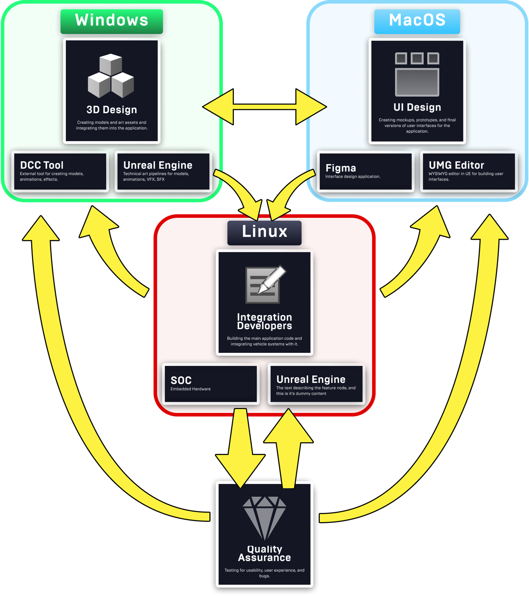

# 汽车HMI开发

> 路径：虚幻引擎5.7文档 / 移动端开发 / 汽车HMI开发

> 原始页面：https://dev.epicgames.com/documentation/unreal-engine/automotive-hmi-development-in-unreal-engine

**虚幻引擎****（UE）**中的**汽车人机界面****（HMI）**项目是高度优化的移动应用程序，具有许多独特的注意事项。 汽车的功能按钮和显示功能都需要高水平的响应性、稳定性和可靠性，因为这些方面一旦出现故障就可能导致用户产生挫败感和引发安全问题。 此外，HMI团队具有独特的跨学科构成，团队中的开发者来自不同行业和工作环境，能够共同为项目做出贡献。

本节虚幻引擎文档提供了专为汽车HMI项目定制的指南，包括：

- 为初次使用虚幻引擎的HMI开发者提供的入门资源
- 实现高优化水平和高性能HMI产品所需的指南
- 调整HMI项目规模以及协调该行业独特的构成学科和工作环境的指南

## HMI项目中的规则和环境

虚幻引擎（UE）的HMI项目具有独特的跨学科环境。 下图概括了典型的虚幻引擎HMI项目的构成，不过你所在组织的偏好可能会有所不同：

| 开发团队 | 人员数量 | 学科/行业 | 偏好环境 | 说明 |
| --- | --- | --- | --- | --- |
| 技术美术师 | 2-5 | 技术美术、3D美术、使用虚幻引擎的CAD、DCC | Windows | 主要负责视觉效果资产，如汽车模型等。 包括绑定、动画、材质、特效、蓝图设计、UI/UMG、渲染、光照、分析和其他相关工作。 |
| UI/UX开发者 | 2-5 | UI设计，网页设计，用户体验设计 | MacOS、Figma | 为车辆编译UI和菜单。 |
| 集成开发者 | 10-15 | 计算机科学、软件开发 | Linux | 整合车辆系统和虚幻引擎应用程序。 |
| 质量保证测试员 | - | 计算机科学、软件开发 | - | 测试应用程序，并向团队反馈漏洞及功能方面的意见。 |

这些团队的一般工作流程如下：

1. 技术和3D美术师为项目开发美术资产，尤其是汽车模型，这些模型通常与技术信息一起展示。 这包括将开发资产转换为以性能为导向的模型，以便用于实时应用。
2. UI和UX开发者使用虚幻引擎的UI编辑器"虚幻示意图形（UMG）"编译项目的前端UI。 这通常包括在Figma或其他UI设计套件中制作原型，然后在UMG中重建团队的设计。
3. 集成开发者处理项目的后台系统，同时将车辆系统、项目应用流程以及UI和技术美术团队提供的资产整合到一起。 集成开发者还会分析和调试应用程序，并向其他团队提供技术反馈，以便让他们调整各自的资产。 这让集成开发者成为了HMI项目迭代工作流程的核心支柱。
4. 由质量保证团队测试应用程序的构建，并提供关于性能、漏洞和整体用户体验的反馈。
5. 所有团队都会根据彼此的反馈不断迭代各自的部分，从而纠正出现的问题并调整体验，然后再次进行测试。

这种团队构成给虚幻引擎项目带来了独特的挑战，因为在其他类型的项目中，这其中的所有行业都偏爱不同的操作系统和软件套件。 幸运的是，虚幻引擎支持所有上述环境，而这些多元化的团体也能够进行协作。

## 帮助你的组织入门

为了确保项目能取得成功，请按照以下指南设置开发环境，并准备向团队分发项目：

- [非游戏类被授权用户入门指南](https://dev.epicgames.com/documentation/unreal-engine/onboarding-guide-for-unreal-engine-nongames-licensees?application_version=5.5)
- [调整团队规模所需的资源](resources-for-scaling-your-unreal-engine-team/index.md)
- [虚幻引擎中的源码管理](../../understanding-the-basics/source-control/index.md)
- [创建已安装构建](../../production-pipeline/deploying/create-an-installed-build-of/index.md)

## 管理应用程序的性能

汽车HMI项目必须在可靠性、响应性和性能方面达到超高标准，以确保尽可能流畅和安全的用户体验。 本节中的资源介绍了虚幻引擎中关于性能的概念，以及可用于分析和配置性能的工具。

### 基础知识

下列页面概述了性能分析背后的概念，以及针对各种情况的优化注意事项。

- [性能分析与配置简介](../../testing-and-optimizing-content/introduction-to-performance-profiling-and-configuration/index.md)
- [常见性能注意事项](../../testing-and-optimizing-content/common-memory-and-cpu-performance-considerations/index.md)
- [移动端的渲染优化技巧](../debugging-and-optimization-for-mobile/optimization-and-development-best-practices-for-f2fc3d86/index.md)
- [UMG优化准则](../../user-interfaces/optimizing-user-interfaces/optimization-guidelines-for-umg/index.md)

### 分析工具

下列页面提供了你能使用的各种项目性能分析工具的指南。

- [Unreal Insights](../../testing-and-optimizing-content/unreal-insights/index.md)
- [RenderDoc](../../designing-visuals-rendering-and-graphics/optimizing-and-debugging-projects-for-realtime-rendering/using-renderdoc/index.md)
- [Stat命令](../../testing-and-optimizing-content/stat-commands/index.md)

### 性能调节资源

下列页面介绍了可用于优化应用程序性能的系统，包括在各种设备上进行优化的方法。

- [可伸缩性设置](../../designing-visuals-rendering-and-graphics/optimizing-and-debugging-projects-for-realtime-rendering/scalability/index.md)
- [自定义Android设备描述](../android-support/packaging-and-publishing-android-projects/customizing-device-profiles-and-scalability-in-e75f27cc/index.md)

## 技术美术

本节为负责HMI项目的模型、材质及其他资产的技术人员提供了定制化的资源。 你尤为需要考虑项目的移动渲染器的**着色模式**，因为这会影响同时光照质量和虚幻引擎处理材质的方式。

- [移动预览器](../development-tools-for-mobile-applications/using-the-mobile-previewer/index.md)
- [移动着色模式](../rendering-features-for-mobile-games/mobile-rendering-and-shading-modes/index.md)
- [移动延迟着色模式](../rendering-features-for-mobile-games/using-the-mobile-deferred-shading-mode/index.md)
- [移动端的渲染优化技巧](../debugging-and-optimization-for-mobile/optimization-and-development-best-practices-for-f2fc3d86/index.md)

## UI开发

本节包含专为从事HMI项目前端工作的UI开发者定制的资源，包括针对macOS用户的资源。

### 使用UMG

- [UMG快速入门](../../user-interfaces/basics-of-user-interface-development/building-your-ui/umg-ui-designer-quick-start-guide/index.md)
- [UMG编辑器参考](../../user-interfaces/umg-editor-reference/index.md)
- [制作UMG控件动画](../../user-interfaces/umg-editor-reference/animating-umg-widgets/index.md)
- [UMG Viewmodel插件](../../user-interfaces/plugins-for-ui-development/umg-viewmodel/index.md)

### 优化UI性能

- [UMG优化准则](../../user-interfaces/optimizing-user-interfaces/optimization-guidelines-for-umg/index.md)

### MacOS

- [Xcode](../debugging-and-optimization-for-mobile/ios-and-tvos-debugging-and-optimization/using-the-xcode-ios-simulator-with-unreal-engin-6ff7b645/index.md)
- [现代化Xcode工作流程](../../cpp-programming/setting-up-your-development-environment-for-cplusplus/using-modern-xcode/index.md)
- [用Windows支持Mac工作流程](../ios-ipados-and-tvos-support/working-on-ios-projects-using-a-windows-machine/index.md)

## HMI工程和调试资源

本节包含专为从事HMI项目后端工作的集成工程师定制的资源，包括针对Linux用户的资源。

### Linux开发环境

- [Visual Studio Code](../../cpp-programming/setting-up-your-development-environment-for-cplusplus/setting-up-visual-studio-code/index.md)

### 调试资源

- [在Android Studio中调试](../debugging-and-optimization-for-mobile/debugging-for-android-devices/debugging-unreal-engine-projects-for-android-us-3a4e6274/index.md)
- [设置Android设备以供开发](../android-support/getting-started-and-setup-for-android-projects/setting-up-your-android-device-for-developing-a-f537b307/index.md)
- [搭配使用虚幻引擎和Android模拟器](../debugging-and-optimization-for-mobile/debugging-for-android-devices/debugging-unreal-engine-projects-with-virtual-d-ad0e0d85/index.md)
- [自动化测试](../../testing-and-optimizing-content/automation-test-framework/index.md)
