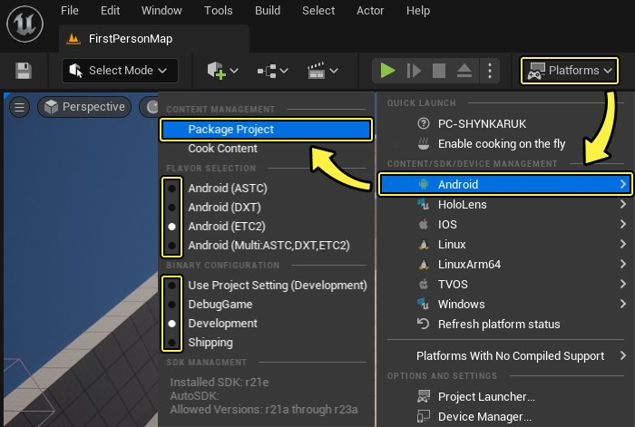
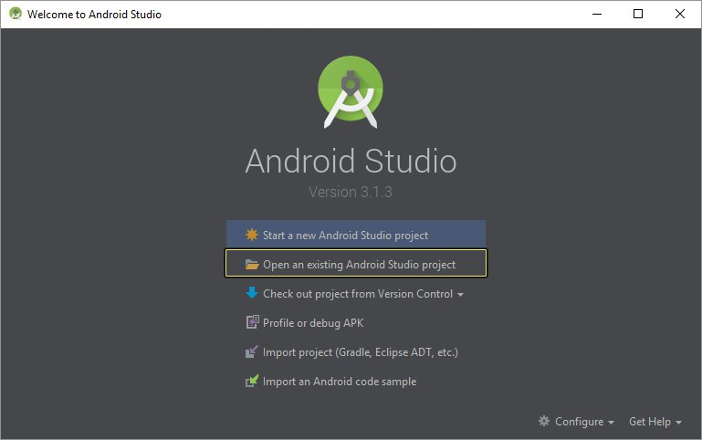
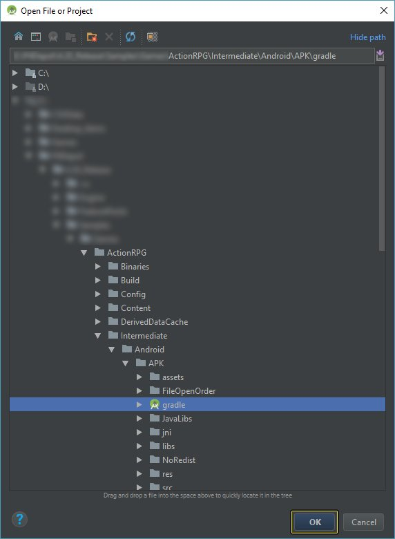
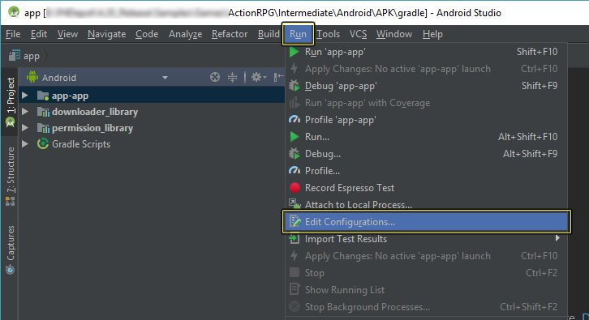
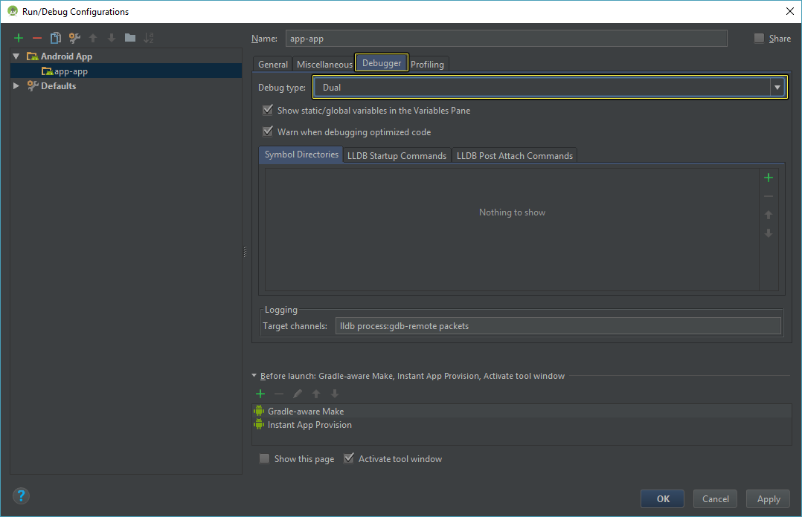
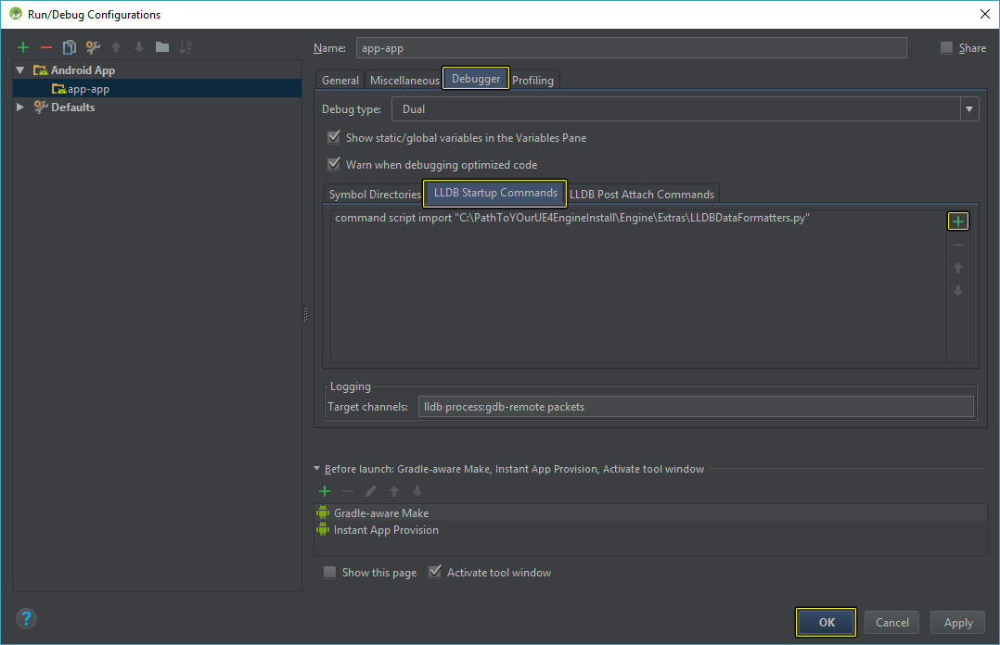
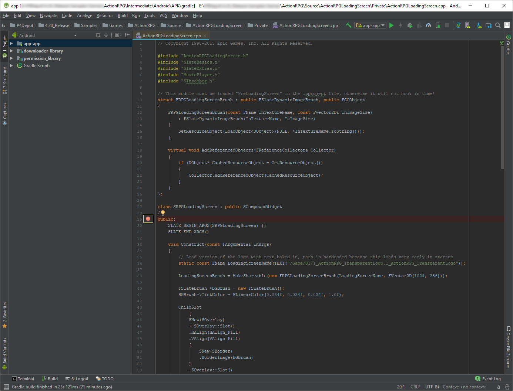
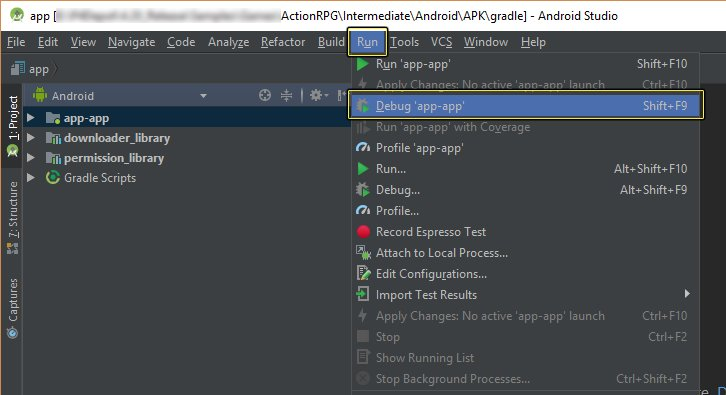

# 调试Android项目

> 路径：虚幻引擎5.7文档 / 移动端开发 / 移动端调试和优化 / Android调试 / 调试Android项目

> 原始页面：https://dev.epicgames.com/documentation/unreal-engine/debugging-unreal-engine-projects-for-android-using-android-studio

虚幻引擎(UE)允许您使用Android Studio调试UE4项目中使用的C++和Java代码。在下面的教程中，我们将了解如何设置Android Studio，以便它可以用于调试UE Android项目。

## 减少迭代时间

为了在迭代中缩短Android项目的编译时间，可以对项目进行设置以避免在 `.apk` 中打包 `libUnreal.so`，而是将其推送到设备的内部文件目录中。这可以跳过Grandle并避免每次更改都要重装 `.apk`。要实现以上目的，请打开项目的 `*Engine.ini` 文件并添加以下行：

*Engine.ini

```
	[[/Script/AndroidRuntimeSettings.AndroidRuntimeSettings]	bDontBundleLibrariesInAPK=True
```

如果你直接使用了虚幻编译工具，也可以传递 `-ForceDontBundleLibrariesInAPK=true` 以启用此设置。

在选择了该设置后，非发布构建的AGDE和Quick Launch都会启用它。发布构建仍然会将 `libUnreal.so` 打包进 `.apk`。

## 设置Android Studio

要Android Studio以调试UE项目，请按以下步骤操作：

1. 如果你还没有这样做，请下载并安装与当前虚幻引擎版本兼容的Android Studio版本。请参考[开发要求](https://dev.epicgames.com/documentation/404)，了解应该使用哪个版本；参考[Android SDK和NDK设置指南](https://dev.epicgames.com/documentation/404)，了解如何设置您的环境。
2. 接下来，构建要调试的 `APK`，然后将其部署到用于调试的Android设备上。

   

   点击查看大图
3. 打开Android Studio Launcher，从显示的选项中，选择 **打开现有的Android Studio项目（Open an existing Android Studio Project）**。

   

   点击查看大图
4. 在 **打开文件或项目（Open File or Project）** 菜单中，导航到 **C:\YourProjectName\Intermediate\Android\APK\Gradle**，选择 **Gradle** 目录，然后按下 **确定（OK）** 按钮。

   
5. 打开Android Studio后，前往 **运行菜单（Run Menu）**，并选择 **编辑配置（Edit Configurations）** 选项。

   

   点击查看大图
6. 单击 **调试器（Debugger）** 选项卡，并将调试类型设置为 **双（Dual）**。

   

   点击查看大图
7. 接下来，转到 **LLDB启动命令（LLDB Startup Command）** 选项卡，按下 **加号（plus）** 图标(+)然后输入以下一行，同时按下 **确定（OK）** 按钮以完成此过程。

   ```
       命令脚本导入 "C:\PathToYourUE4EngineInstall\Engine\Extras/LLDBDataFormatters\UE4DataFormatters_2ByteChars.py"
   ```

   > [!NOTE]
   > 请注意，在C++代码中，应使用TEXT（"string"）替代L（"string"）。

   

   点击查看大图

   > [!NOTE]
   > 请务必按下 **回车（Enter）** 键，否则命令不会执行。
8. 现在，打开项目的任意一个.cpp文件，并将断点添加到要调试的项目。

   

   点击查看大图
9. 在主菜单中，选择 **运行（Run）** > **调试（Debug）'app-app'**。



点击查看大图

1. 当显示

   选择部署类型（Select Deployment Type）

   窗口时，从列表中选择你的设备并按下

   确定（OK）

   按钮。

> 图片已省略：Select your device from the list

点击查看大图

## 最终结果

完成上述步骤后，等待调试器附加到你的Android设备。

> 图片已省略：Wait for the debugger to attach to your Android Device

点击查看大图

根据项目的大小，调试器可能需要一些时间来进行附加。如果没有使用 **在APK内打包数据（Package data inside APK）** 选项，这样做也 **不会** 在设备上安装数据。这样做会减慢重新部署调试的速度，因为APK会更大。另一种选择是，在使用Android Studio进行调试之前，首先在编辑器上执行 **启动**，以在设备上安装当前关卡。或者，如果您需要的不仅仅是当前关卡数据，则可以在设备上打包和安装OBB。
