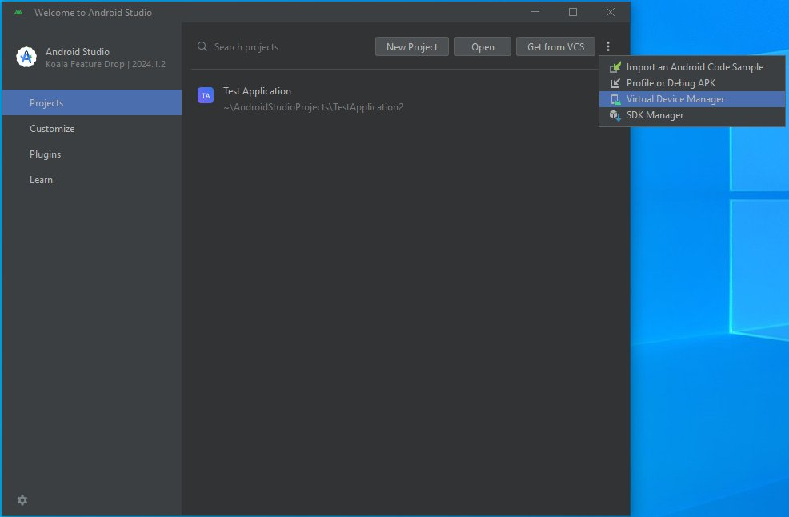
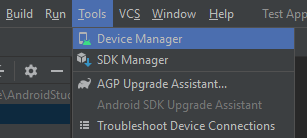
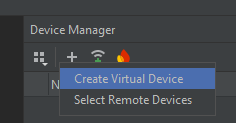
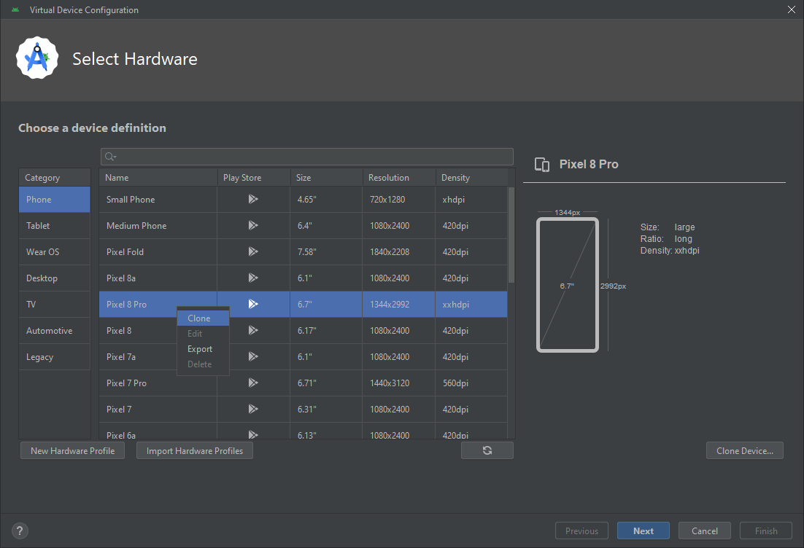
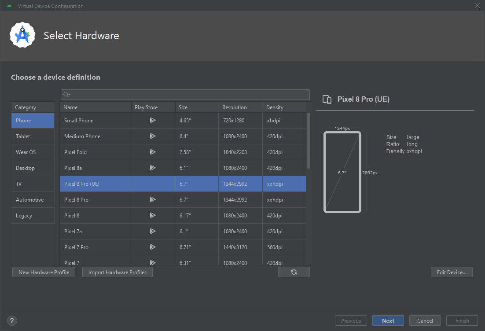
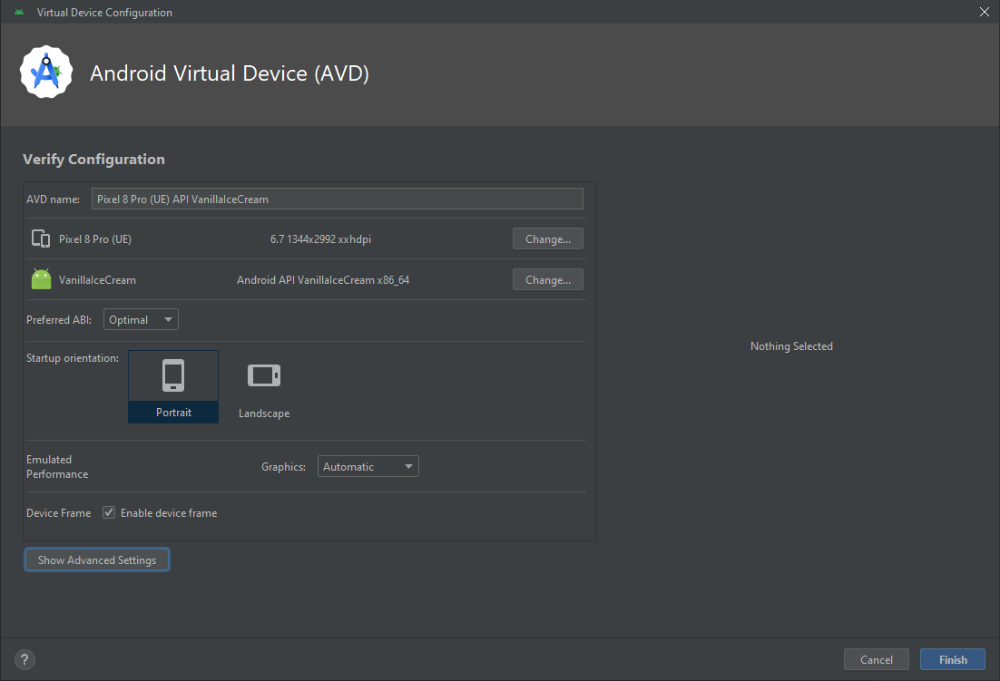
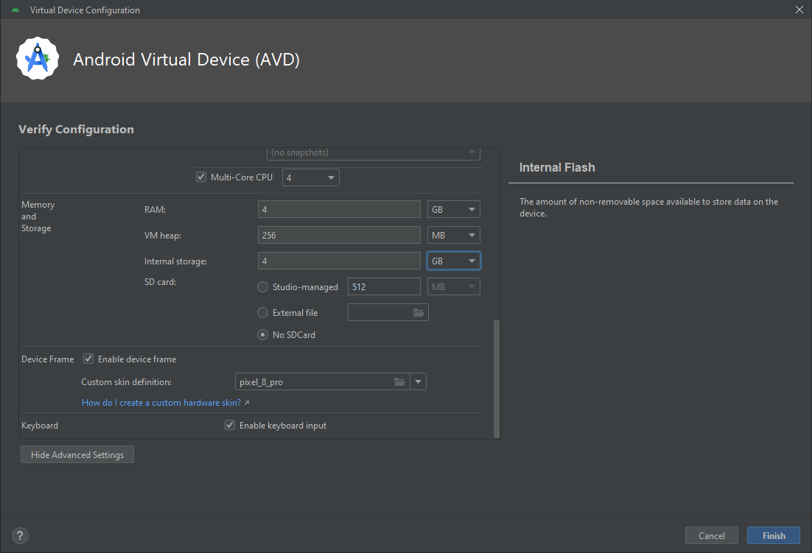
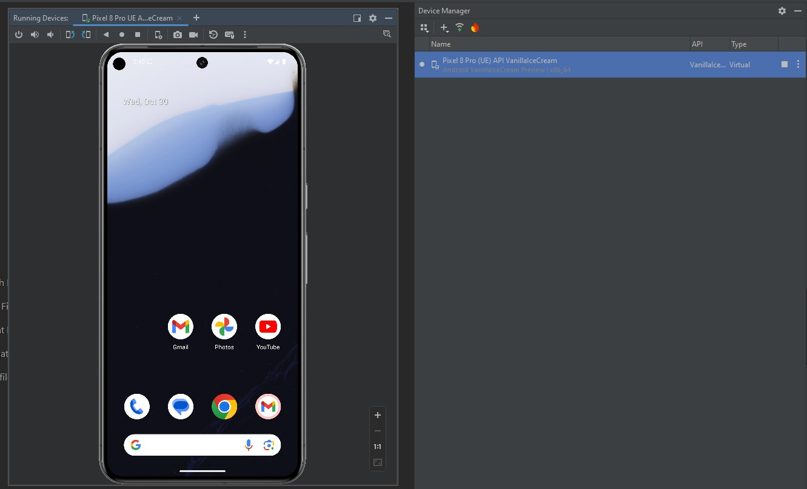

# Android Emulator

> 路径：虚幻引擎5.7文档 / 移动端开发 / 移动端调试和优化 / Android调试 / Android Emulator

> 原始页面：https://dev.epicgames.com/documentation/unreal-engine/debugging-unreal-engine-projects-with-virtual-devices-using-the-android-emulator

可以在 **Unreal Engine（UE）** 的 **Android** 应用运行于 **Android Emulator** ，它随 **Android Studio**附带提供；这样无需依赖大量实体设备，也能在广泛的 Android 虚拟设备上测试。设置好虚拟设备后，可以像使用实体设备一样，通过 Unreal Editor 或 UAT 启动应用。本页提供以下指南：

- 设置虚拟设备。

  - 运行 Unreal Engine 所需规格。
- 在桌面上启动虚拟设备。
- 在虚拟设备上运行项目构建。
- 在虚拟设备上调试。

## 设置虚拟设备

默认情况下，Android Studio 中的虚拟设备大约配置 256 MB RAM 和有限内部存储。要可靠运行 Unreal 应用，需要将其覆盖为以下规格：

- **RAM：** 至少 **4 GB**
- **内部存储：** 打包游戏大小的两倍。

要创建新设备并按这些规格设置，请按以下步骤操作：

1. 打开 **Android Studio**.
2. 打开 **Device Manager**.

   1. 如果没有可加载的 Android Studio 项目，请在 **Welcome to Android Studio** 对话框中点击 **More Actions** 下拉菜单，并选择 **Virtual Device Manager。

      
   2. 如果已经打开 Android Studio 项目，请点击 **Tools**> **Device Manager**.

   
3. Device Manager 面板出现后，点击 **+** 符号并点击 **Create Virtual Device**。这会打开 Virtual Device Configuration 窗口。

   
4. 在 Virtual Device Configuration 窗口中，右键单击某个既有设备配置文件并点击 **Clone**。这会打开 Hardware Profile Configuration 窗口。此示例使用 **Pixel 8 Pro** 作为基础。

   
5. 为设备设置以下参数：

   1. **Device Name：** 使用适合组织的命名约定重命名它。此示例添加后缀 `(UE)` 表示该硬件配置文件已针对 UE 调整。
   2. **Memory**：将设备 RAM 设置为至少 4 GB。
6. 点击 **Finish** 返回 Virtual Device Configuration 窗口。
7. 选择自定义配置文件，然后点击 **Next**.

   
8. 系统会提示选择 **System Image**。选择 Vanilla Ice Cream 或更高版本。确保所选版本支持 **API 35** **或更高版本**。准备继续时，点击 **Next**.

   1. 如果想要的 System Image 显示为灰色，或选择后无法点击 Next 按钮，请点击版本名称旁的下载按钮，以安装该设备镜像所需组件。

      > [!NOTE]
      > 如果未使用兼容 Android 35 的系统镜像，则无法运行 arm64。此时需要以 x86-64 为目标。
9. 系统会提示验证配置。点击 **Show Advanced Settings**.

   
10. 在高级设置中，确保以下项目具有正确设置： **Memory**和 **Storage**:

    1. 再次检查 **RAM**是否为 **4 GB** 或更高。下拉菜单默认单位为 MB，因此继续前请确认已切换为 GB，或相应增加内存。
    2. 将 **Internal Storage**设置为大约游戏大小的两倍。例如，如果预计游戏大小为 2 GB，则将此值设为 4 GB。

    
11. 点击 **Finish**，设备会出现在可启动设备列表中。可以点击 **Play** 按钮开始运行应用。模拟器加载可能需要几分钟。

    

### 为虚拟设备设置所需 Android 功能

要让虚拟设备完整支持 UE 项目，需要为其启用一些图形功能：

1. 打开 `Users/Username/.Android` 文件夹。
2. 打开 `AndroidFeatures.ini`.

   1. 如果

      AndroidFeatures.ini

      文件不存在，请创建一个。
3. 添加以下变量：

   1. `Vulkan=on`.
   2. `GLDirectMem=on`。这会启用硬件 GPU 加速。

## 运行 Android 虚拟设备

需要在 Android emulator 中运行虚拟设备，才能在该虚拟设备上启动应用并附加调试进程。可以把它理解为模拟器中的“开机并以开发者模式连接到电脑”。可以从 Android Studio 启动，也可以启动独立版本的 emulator。

### 从 Android Studio 启动

要从 Android Studio 启动虚拟设备：

1. 打开 Android Studio，然后点击 **Tools**> **Device Manager**.
2. 在 **Device Manager**中，点击 **Play** 按钮，该按钮位于要启动的设备旁。

模拟器加载需要几分钟；加载完成后，可以像使用触摸屏一样用鼠标控制虚拟设备。

### 从桌面启动独立 Emulator

可以从 Android Studio 中的 **Device Manager**启动它，也可以按以下步骤启动独立版本 emulator：

1. 打开 Android SDK 根目录，然后打开 `Emulator` 文件夹。应能看到一个名为 `Emulator.exe`.
2. 使用命令行运行该可执行文件，并传入参数 `-avd=[name of virtual device profile]`。例如，如果将配置文件命名为 Pixel8_UE，则应使用参数 `-avd=Pixel8_UE`.

Android Emulator 会在桌面上显示虚拟设备。

## 在虚拟设备上启动 UE 应用

Android Emulator 运行后，UE 可以通过 Unreal Editor 中的 Device Manager 和 Platforms 下拉菜单看到它。

> 图片已省略：The Platforms dropdown. The virtual device is highlighted at the top of the list.

请参阅 [构建操作](../../../../sharing-and-releasing-projects/packaging-and-cooking/cooking-content/index.md) 指南以了解更多信息。

> [!WARNING]
> 虽然在 Android Studio 中为虚拟设备配置文件指定了名称，但这与该虚拟设备 *实例* 的名称不同。在命令行参数中提供设备名称前，请再次确认设备名称。

## 在虚拟设备上调试

只要 Android 虚拟设备正在运行，就可以使用 [Android Studio](../debugging-unreal-engine-projects-for-android-us-3a4e6274/index.md) 或 [带 AGDE 的 Visual Studio](../debugging-unreal-engine-projects-for-android-in-8ae85ef6/index.md) 像调试实体设备一样在其上调试。不过，要使用调试器，Android 应用的架构需要匹配 PC 主机架构。例如：

- 如果在 x86_64 PC 或 Intel Mac 上运行，应用必须设置为使用 x86_64 架构，才能在桌面上调试。
- 如果使用 Apple Silicon Mac 或 arm64 Linux 机器，应用必须设置为使用 arm64 架构，才能在桌面上调试。

还可以利用以下调试和性能分析资源：

- 使用 [Android File Server 和 Unreal Android File Tool](../android-file-server/index.md) 进行调试和文件管理。
- 使用以下工具运行 Trace： [Unreal Insights](https://dev.epicgames.com/documentation/404).
