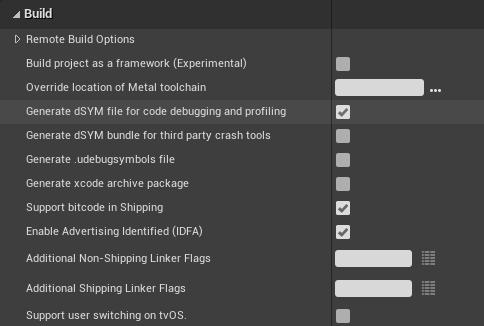

# 访问iOS和tvOS上的日志和崩溃报告

> 路径：虚幻引擎5.7文档 / 移动端开发 / 移动端调试和优化 / iOS和tvOS的调试和优化 / 访问iOS和tvOS上的日志和崩溃报告

> 原始页面：https://dev.epicgames.com/documentation/unreal-engine/accessing-logs-and-crash-reports-on-ios-and-tvos-in-unreal-engine

### 访问iOS和tvOS的日志和崩溃报告

使用虚幻引擎构建的iOS应用程序会生成崩溃日志，可供开发人员调试项目和修复代码问题。 但是，出于安全原因，调试符号不可用于崩溃日志本身。 你将看到键和编号，但要以人工可读格式看到函数名称或有关变量的信息，你需要将日志匹配到你的项目的符号数据库。

有几个过程可用于重新符号化你的日志并进行读取，具体取决于你是如何将调试版本交付到设备的。 **TestFlight**是Apple的应用程序，用于向大量可能的设备交付测试构建，并向开发者提供这些构建的日志。 你还可以直接通过USB调试获取日志。

> [!NOTE]
> 你需要Mac和Xcode，才能读取iOS项目的日志。 其他操作系统和IDE不适用于此页面上的工作流程。

## 1. 直接从设备访问日志

如果你是通过USB或以太网直接调试，请执行以下步骤来查看符号化崩溃日志：

1. 在Xcode中，转到主菜单，选择**窗口（Window）** > **设备和模拟器（Devices and Simulators）**。
2. 点击需要获取崩溃数据的iPhone，然后点击**查看设备日志（View Device Logs）**。
3. 按住Control键的同时点击你想读取的日志，然后点击**重新符号化并导出日志（Re-Symbolicate and export Log）**。

这将提供带有调试符号的人工可读格式日志。

## 2. 从TestFlight访问日志

通过TestFlight交付的应用程序崩溃时，会生成包含崩溃信息的**XCrashPoint**文件。 要读取这些文件，你需要有`.dSYM`文件，其中包含你的项目的调试符号，然后你需要提取崩溃报告并将其重新符号化。

如需了解如何通过TestFlight部署应用程序并访问日志，请参阅[Apple关于TestFlight的文档](https://developer.apple.com/testflight/)。 本小节将提供有关如何在获取这些日志后将其符号化的信息。

### 在打包过程中生成.dSYM文件

要在打包项目时生成`.dSYM`文件，请执行以下步骤：

1. 打开**虚幻编辑器（Unreal Editor）**。
2. 打开**项目设置（Project Settings）**，找到**平台（Platforms）** > **iOS** > **编译（Build）**。
3. 启用**生成dSYM文件以用于代码调试和分析（Generate dSYM file for code debugging and profiling）**。

   
4. 打包项目。

项目的`.dSYM`文件位于项目文件夹`/Binaries/iOS`之下。

> [!TIP]
> `.dSYM`文件会用时间戳显示打包时间。 请记录此信息，以便将`.dSYM`文件匹配到正确的构建。

### 从命令行生成.dSYSM文件

要使用UAT生成.dSYM文件，请使用**GenerateDYSM**命令在命令行中执行RunUAT脚本。 应指定以下参数：

| 参数 | 可选 | 有效值 | 说明 |
| --- | --- | --- | --- |
| -Platform=[目标平台] | 是（Yes） | IOS、TVOS、Mac | 指定目标平台。 如果未指定，则默认为当前平台。 |
| -Target=[项目名称] | 是（Yes） | 项目的名称。 | 指定要使用的项目。 如果未指定，则默认为当前项目。 |
| -Config=[构建配置] | 是（Yes） | Debug、DebugGame、Development、Test、Shipping | 目标构建配置。 如果未指定，则默认为Development。 |
| -Architecture=[架构类型] | 否（No） | x64、arm64、x64+arm64] | 目标设备架构。 |
| -flat | 是（Yes） | 不接受输入。 | 如果指定，.dSYM将是更易于在计算机或服务器之间复制的平面文件。 |

例如，以下命令将为使用arm64架构的iOS设备生成.dSYM文件：

C++

```
```RunUAT.command GenerateDYSM -project=MyProject -platform=Mac -target=EngineTestEditor -config=Test -architecutre=arm64```
```

### 提取崩溃报告并重新符号化

要获取崩溃报告并将其重新符号化，以便你可以进行读取，请执行以下步骤：

1. 从TestFlight获取`XCrashPoint`文件。 你可以使用以下命令行输入来执行此操作。

   C++

   ```
   export PATH="/Applications/Xcode.app/Contents/SharedFrameworks/DVTFoundation.framework/Versions/A/Resources:$PATH"
   ```
2. 按住Control键的同时点击`.XCrashPoint`文件，然后点击**提取`.crash`文件（Extract .crash file）**。 你还可以使用以下命令行输入来导出此信息：

   C++

   ```
   export PATH="/Applications/Xcode.app/Contents/SharedFrameworks/DVTFoundation.framework/Versions/A/Resources:$PATH"
   ```
3. 打开XCode，然后查看**终端（terminal）**。 使用终端找到你的Xcode`.package`文件。
4. 运行以下命令行来使用symbolicatecrash工具：

   C++

   ```
   export DEVELOPER_DIR="/Applications/Xcode.app/Contents/Developer" cp -i /Applications/Xcode.app/Contents/SharedFrameworks/DVTFoundation.framework/Versions/A/Resources/symbolicatecrash ././symbolicatecrash unsymbolicated.crash symbols.dSYM > symbolicated.crash
   ```

上述说明使用默认目录。 运行这些命令行时，请使用你的`.crash`和`.dSYM`文件的位置。

然后，Xcode将提供显示了函数名称和变量的崩溃日志。
